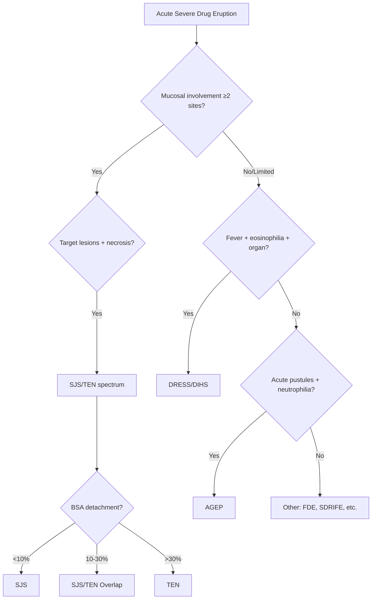
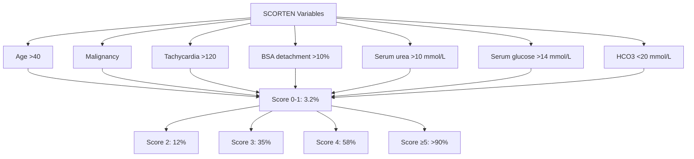

# Drug Eruptions Hub

---
tags: [medicine, dermatology, heading-hub, scaffold-hub]
davidson_part: Part 3: Clinical Medicine
davidson_chapter: Chapter 29: Dermatology
heading: Drug Eruptions & Adverse Cutaneous Drug Reactions
topic_group:
topic:
status: full-fcps-mrcp-hub
priority: critical
created: 2026-06-15
modified: 2026-06-15
exam_relevance: [FCPS, MRCP Part 1, MRCP Part 2, PACES]
see_also:
  - "[[Dermatology MOC]]"
  - "[[Davidson Chapter 29 - Dermatology Hierarchy]]"
  - "[[../04_Vesiculobullous/Vesiculobullous Hub]]"
---

# Drug Eruptions Hub

> [!info]
> **Davidson Ch29 Section 5** | **5 Topic Groups, 18 Disease Topics** | **Priority: CRITICAL**

---

## Topic Groups in this Section

| # | Topic Group | Disease Topics | Status |
|---|-------------|----------------|--------|
| 5.1 | Exanthematous (Morbilliform) Drug Eruptions | 4 | 🔴 scaffold |
| 5.2 | Severe Cutaneous Adverse Reactions (SCARs) | 4 | 🔴 scaffold |
| 5.3 | Photosensitivity Drug Reactions | 4 | 🔴 scaffold |
| 5.4 | Targeted Therapy & Immunotherapy Cutaneous Toxicity | 5 | 🔴 scaffold |
| 5.5 | Other Drug Reaction Patterns | 5 | 🔴 scaffold |

---

## High-Yield Summary Table

| SCAR | Typical Latency | Key Features | Diagnostic Score | Mortality |
|------|-----------------|--------------|------------------|-----------|
| **SJS/TEN** | 1-4 weeks | Target lesions → necrosis, mucosal ≥2, Nikolsky+ | SCORTEN | 10-50% (TEN) |
| **DRESS/DIHS** | 2-6 weeks | Fever, eosinophilia, organ involvement, facial oedema | RegiSCAR ≥5 | 5-10% |
| **AGEP** | 1-5 days | Acute generalised pustules, neutrophilia, fever | EUROSCAR | <5% |
| **Overlap** | Variable | Mixed features | Clinical | Variable |

---

## Key Algorithms

### SCARs Differentiation Algorithm

### SCORTEN (SJS/TEN Mortality)

### RegiSCAR (DRESS)
- Fever >38°C
- Lymphadenopathy
- Eosinophilia >1.5 ×10⁹/L or >20%
- Atypical lymphocytes
- Skin involvement >50% BSA or biopsy compatible
- Organ involvement (liver, kidney, lung, heart, pancreas)
- Resolution >15 days
- Exclusion of other causes
- **Score ≥5 = definite DRESS**

---

## FCPS/MRCP Viva Topics (High-Yield)

1. **SCARs comparison** - SJS/TEN/DRESS/AGEP table (latency, features, scores, mortality)
2. **SCORTEN** - 7 variables, calculate, mortality prediction
3. **RegiSCAR** - criteria, ≥5 = definite
4. **EUROSCAR** - criteria for AGEP
4. **Culprit drugs** - Allopurinol, carbamazepine, lamotrigine, sulfas, NSAIDs, antibiotics, allopurinol
5. **HLA associations** - HLA-B*58:01 (allopurinol), B*15:02 (carbamazepine), B*57:01 (abacavir), A*31:01 (carbamazepine)
6. **Management** - STOP drug immediately, supportive care, specialist referral, consider IVIG/ciclosporin/steroids
7. **Exanthematous drug eruption** - morbilliform, 1-2w latency, self-limiting after withdrawal
8. **Fixed drug eruption** - recurrent same site, hyperpigmentation, DRESS overlap
9. **Photosensitivity** - phototoxic (dose-dependent) vs photoallergic (immune), culprit drugs
10. **Targeted therapy toxicity** - EGFRi rash (papulopustular), BRAFi/MEKi (cuSCC, photosensitivity), ICIs (vitiligo, lichenoid, bullous)

---

## Mnemonics

- **SCARs Culprit Drugs:** `SCAR DRUGS` = **S**ulfonamides, **C**arbamazepine, **A**llopurinol, **R**educed (none), **D**apsone, **R**ifampicin, **U**rate-lowering (allopurinol), **G**abapentin? **S** NSAIDs
- **HLA-Drug:** `HLA BAD` = **HLA-B*58:01** = Allopurinol, **HLA-B*15:02** = Carbamazepine, **HLA-B*57:01** = Abacavir, **HLA-A*31:01** = Carbamazepine
- **SCORTEN:** `SCORTEN` = **S**evere malignancy, **C**ardiac disease, **O**lder >40, **R**ate BSA >10%, **T**achycardia >120, **E**pidermal detachment >10%, **N** urea >10

---

## Quick Revision Card

| SCAR | Latency | Key Feature | Score | 1st Action | Mortality |
|------|---------|-------------|-------|------------|-----------|
| **SJS** | 1-4w | Mucosa ≥2, target, <10% BSA | SCORTEN | Stop drug, supportive, ICU | 10% |
| **SJS/TEN Overlap** | 1-4w | Mucosa ≥2, 10-30% BSA | SCORTEN | Stop drug, ICU, consider IVIG/ciclosporin | 30% |
| **TEN** | 1-4w | Mucosa ≥2, >30% BSA | SCORTEN | Stop drug, ICU, consider IVIG/ciclosporin | 30-50% |
| **DRESS** | 2-6w | Fever, eosinophilia, organ | RegiSCAR | Stop drug, pred 1mg/kg, monitor organs | 5-10% |
| **AGEP** | 1-5d | Pustules, neutrophilia | EUROSCAR | Stop drug, supportive | <5% |
| **FDE** | Hours-days | Recurrent same site, hyperpig | Clinical | Avoid drug, TCS | Low |
| **SDRIFE** | Days | Baboon syndrome (flexures) | Clinical | Avoid drug, TCS | Low |

---

## Linkage

- **MOC:** [[Dermatology MOC]]
- **Hierarchy:** [[Davidson Chapter 29 - Dermatology Hierarchy]]
- **Section Dir:** `05_Drug_Eruptions/`
- **Previous Hub:** [[../04_Vesiculobullous/Vesiculobullous Hub]]
- **Next Hub:** [[../06_Skin_Infections/Skin Infections Hub]]

---

## Progress
- [ ] 5.1 Exanthematous Drug Eruptions Hub (scaffold-hub)
- [ ] 5.2 SCARs Hub (scaffold-hub)
- [ ] 5.3 Photosensitivity Drug Reactions Hub (scaffold-hub)
- [ ] 5.4 Targeted Therapy/Immunotherapy Hub (scaffold-hub)
- [ ] 5.5 Other Drug Reaction Patterns Hub (scaffold-hub)
- [ ] 18 Disease Topics (scaffold → full-fcps-mrcp-note)