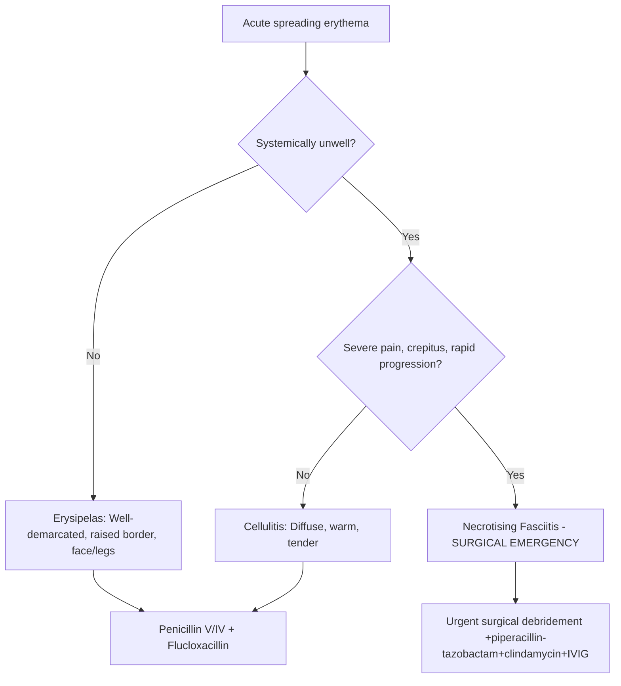
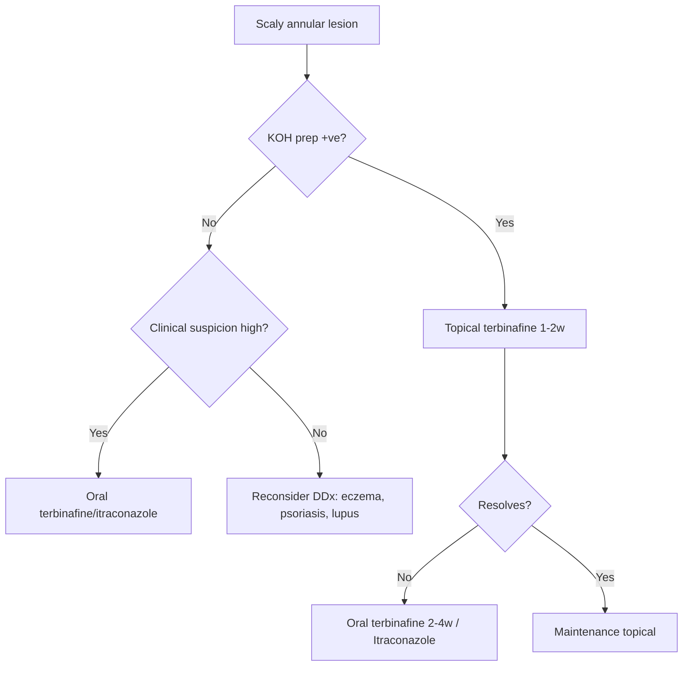

# Skin Infections Hub

---
tags: [medicine, dermatology, heading-hub, scaffold-hub]
davidson_part: Part 3: Clinical Medicine
davidson_chapter: Chapter 29: Dermatology
heading: Skin Infections
topic_group:
topic:
status: full-fcps-mrcp-hub
priority: critical
created: 2026-06-15
modified: 2026-06-15
exam_relevance: [FCPS, MRCP Part 1, MRCP Part 2, PACES]
see_also:
  - "[[Dermatology MOC]]"
  - "[[Davidson Chapter 29 - Dermatology Hierarchy]]"
  - "[[../05_Drug_Eruptions/Drug Eruptions Hub]]"
---

# Skin Infections Hub

> [!info]
> **Davidson Ch29 Section 6** | **6 Topic Groups, 22 Disease Topics** | **Priority: CRITICAL**

---

## Topic Groups in this Section

| # | Topic Group | Disease Topics | Status |
|---|-------------|----------------|--------|
| 6.1 | Bacterial Infections | 10 | 🔴 scaffold |
| 6.2 | Viral Infections | 6 | 🔴 scaffold |
| 6.3 | Fungal Infections | 5 | 🔴 scaffold |
| 6.4 | Parasitic Infestations | 6 | 🔴 scaffold |
| 6.5 | STIs (Cutaneous) | 6 | 🔴 scaffold |
| 6.6 | Atypical & Opportunistic Infections | 4 | 🔴 scaffold |

---

## High-Yield Summary Table

| Infection | Clinical Key | Diagnosis | 1st Line Treatment | Red Flag |
|-----------|--------------|-----------|-------------------|----------|
| **Impetigo** | Honey-crusted erosions | Clinical ± swab | Topical mupirocin / Oral flucloxacillin | Ecthyma, glomerulonephritis |
| **Cellulitis/Erysipelas** | Spreading erythema, warmth, pain, fever | Clinical, blood cultures if septic | Flucloxacillin ± penicillin (erysipelas) | Necrotising fasciitis |
| **Necrotising fasciitis** | Pain out of proportion, crepitus, rapid spread | Clinical, LRINEC ≥6, imaging | **Surgical emergency** + broad ABx | Mortality 20-40% |
| **HSV/VZV** | Vesicles on erythematous base, dermatomal (VZV) | Tzanck, PCR, DFA | Aciclovir/Valaciclovir | Neonatal, encephalitis, ophthalmic |
| **Scabies** | Burrows, nocturnal itch, contact history | Dermoscopy (delta wing), skin scraping | Permethrin 5% / Ivermectin | Crusted (Norwegian) |
| **Dermatophytes** | Annular scaly plaque, central clearing | KOH prep, culture | Topical terbinafine / Oral terbinafine/itraconazole | Majocchi, immunosuppressed |
| **Molluscum** | Dome papules, central umbilication | Clinical | Observation, curettage, topical | Immunocompromised = extensive |
| **Warts** | Verrucous papules, thrombosed capillaries | Clinical | Salicylic acid, cryotherapy, immunotherapy | Immunocompromised = refractory |

---

## Key Algorithms

### Cellulitis vs Erysipelas vs Necrotising Fasciitis

### LRINEC Score (Necrotising Fasciitis)
| Variable | Points |
|----------|--------|
| CRP >150 mg/L | 4 |
| WBC >25 ×10⁹/L | 2 |
| Hb <11 g/dL | 1 |
| Na <135 mmol/L | 2 |
| Cr >141 μmol/L | 2 |
| Glucose >10 mmol/L | 1 |
| **Score ≥6** = High risk | |

### Fungal Infection Approach

---

## FCPS/MRCP Viva Topics (High-Yield)

1. **Impetigo vs ecthyma** - superficial vs deep, bullous vs non-bullous, S. aureus vs strep
2. **Cellulitis vs erysipelas** - depth, border, systemic features, pathogens
3. **Necrotising fasciitis** - LRINEC, surgical emergency, ABx regimen, IVIG role
4. **Staphylococcal scalded skin syndrome** - exfoliative toxin, Ritter disease, neonates, Nikolsky+
5. **HSV vs VZV** - vesicles on erythema, Tzanck multinucleated giant cells, dermatomal (VZV)
6. **Eczema herpeticum** - Kaposi varicelliform eruption, punched-out erosions, urgent aciclovir
7. **Scabies** - burrows, nocturnal itch, contact, permethrin/ivermectin, crusted variant
8. **Dermatophytes** - tinea capitis (griseofulvin/terbinafine), corporis, cruris, pedis, unguium
9. **Molluscum contagiosum** - umbilicated papules, self-limiting, immunocompromised = extensive
10. **Cutaneous TB** - lupus vulgaris, scrofuloderma, TB verrucosa cutis, PCR/histology
11. **Leprosy** - TT/BT/BB/BL/LL spectrum, Lepra reactions (Type 1 reversal, Type 2 ENL)
12. **Syphilis** - primary chancre, secondary (palmoplantar rash, condylomata lata), tertiary (gumma)
13. **Opportunistic infections** - immunocompromised: HSV/VZV severe, fungi, KS, bacillary angiomatosis

---

## Mnemonics

- **Necrotising fasciitis LRINEC:** `CR HWN` = **C**RP>150, **R**enal (Cr>141), **H**b<11, **W**BC>25, **N**a<135
- **Cellulitis vs Erysipelas:** `CELL` = **C**ellulitis = **D**iffuse, **E**DEMA deep / `ERISEL` = **ERISEL** = **E**risipelas = **R**aised, **I**ndistinct, **S**harp border, **E**pidermal, **L**ymphangitis
- **Scabies treatment:** `PERM-IVER` = **PERM**ethrin 5% overnight ×2 (day 1, day 8) / **IVER**mectin 200µg/kg day 1, day 8 (if failed/contraindicated)
- **Syphilis stages:** `PST` = **P**rimary (chancre), **S**econdary (rash, condylomata), **T**ertiary (gumma, CVS, CNS)
- **Leprosy spectrum:** `TT to LL` = **T**uberculoid → **B**orderline **T**uberculoid → **B**orderline → **B**orderline **L**epromatous → **L**epromatous (immune ↓, bacilli ↑)

---

## Quick Revision Card

| Infection | Key Clinical | Key Test | 1st Line | Emergency |
|-----------|--------------|----------|----------|-----------|
| **Impetigo** | Honey crust | Swab | Mupirocin topical / Flucloxacillin oral | Ecthyma |
| **Cellulitis** | Diffuse erythema | Clinical | Flucloxacillin ± Penicillin | Nec fasc |
| **Nec fasc** | Pain>>erythema, crepitus | LRINEC≥6 | **Surgery** + Pip-Taz + Clinda + IVIG | Mortality 40% |
| **HSV/VZV** | Vesicles on erythema | PCR/Tzanck | Aciclovir/Valaciclovir | Encephalitis, ophthalmic |
| **Eczema herpeticum** | Punched-out erosions | PCR | **IV Aciclovir urgent** | Sepsis |
| **Scabies** | Burrows, nocturnal itch | Dermoscopy/scraping | Permethrin 5% / Ivermectin | Crusted |
| **Tinea capitis** | Scalp scale + alopecia | KOH/culture | **Griseofulvin 6-8w / Terbinafine 4w** | Kerion |
| **Onychomycosis** | Thick/discoloured nail | KOH/culture | **Terbinafine 3-6m / Itraconazole pulse** | - |
| **Molluscum** | Umbilicated papules | Clinical | Observation / Curettage | Immunocompromised |
| **Syphilis 2°** | Palmoplantar rash | RPR/VDRL + TPHA | **Benzathine penicillin 2.4MU IM** | Neurosyphilis |

---

## Linkage

- **MOC:** [[Dermatology MOC]]
- **Hierarchy:** [[Davidson Chapter 29 - Dermatology Hierarchy]]
- **Section Dir:** `06_Skin_Infections/`
- **Previous Hub:** [[../05_Drug_Eruptions/Drug Eruptions Hub]]
- **Next Hub:** [[../07_Skin_Tumours/Skin Tumours Hub]]

---

## Progress
- [ ] 6.1 Bacterial Infections Hub (scaffold-hub)
- [ ] 6.2 Viral Infections Hub (scaffold-hub)
- [ ] 6.3 Fungal Infections Hub (scaffold-hub)
- [ ] 6.4 Parasitic Infestations Hub (scaffold-hub)
- [ ] 6.5 STIs Hub (scaffold-hub)
- [ ] 6.6 Atypical/Opportunistic Hub (scaffold-hub)
- [ ] 22 Disease Topics (scaffold → full-fcps-mrcp-note)