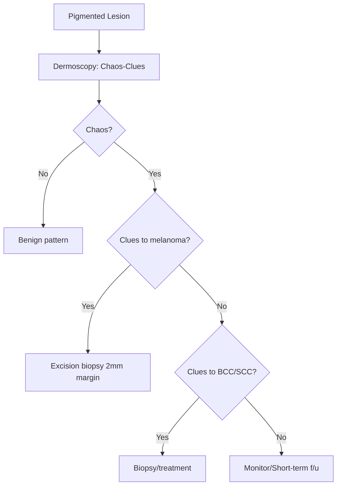

# Skin Tumours Hub

---
tags: [medicine, dermatology, heading-hub, scaffold-hub]
davidson_part: Part 3: Clinical Medicine
davidson_chapter: Chapter 29: Dermatology
heading: Skin Tumours
topic_group:
topic:
status: full-fcps-mrcp-hub
priority: critical
created: 2026-06-15
modified: 2026-06-15
exam_relevance: [FCPS, MRCP Part 1, MRCP Part 2, PACES]
see_also:
  - "[[Dermatology MOC]]"
  - "[[Davidson Chapter 29 - Dermatology Hierarchy]]"
  - "[[../06_Skin_Infections/Skin Infections Hub]]"
---

# Skin Tumours Hub

> [!info]
> **Davidson Ch29 Section 7** | **4 Topic Groups, 16 Disease Topics** | **Priority: CRITICAL**

---

## Topic Groups in this Section

| # | Topic Group | Disease Topics | Status |
|---|-------------|----------------|--------|
| 7.1 | Benign Epithelial Tumours | 8 | 🔴 scaffold |
| 7.2 | Benign Melanocytic Lesions | 7 | 🔴 scaffold |
| 7.3 | Malignant Skin Tumours | 8 | 🔴 scaffold |
| 7.4 | Skin Tumour Syndromes & Screening | 4 | 🔴 scaffold |

---

## High-Yield Summary Table

| Tumour | Clinical Key | Histology | Staging | 1st Line Management |
|--------|--------------|-----------|---------|---------------------|
| **Basal Cell Carcinoma (BCC)** | Pearly nodule, telangiectasia, ulcer (rodent) | Basaloid nests, peripheral palisading | Local (no mets) | Surgery (Mohs for H-zone), vismodegib if adv |
| **Squamous Cell Carcinoma (SCC)** | Keratotic nodule, ulcer, induration | Keratin pearls, dysplasia | TNM (mets risk 2-5%) | Surgery, radiotherapy, cemiplimab if adv |
| **Melanoma** | ABCDE, asymmetric, irregular, >6mm, evolving | Atypical melanocytes, Breslow, ulceration | TNM 8th (Breslow, ulceration, SLNB) | Wide excision + SLNB, adjuvant (anti-PD1, BRAFi/MEKi) |
| **Actinic Keratosis** | Rough scaly patch, sandpaper feel | Keratinocyte dysplasia (AK → SCC) | Field change | 5-FU, imiquimod, PDT, diclofenac, cryotherapy |
| **Bowen Disease (SCC in situ)** | Slow erythematous scaly plaque | Full-thickness epidermal dysplasia | Tis | Surgery, 5-FU, PDT, imiquimod |
| **Merkel Cell Carcinoma** | Rapid violet nodule, sun-exposed, elderly | Small round blue cells, CK20+, MCPyV+ | TNM | Surgery + RT, avelumab adjuvant |
| **Dermatofibrosarcoma Protuberans (DFSP)** | Protuberant plaque, protuberant | Storiform fibroblasts, COL1A1-PDGFB | Local (rare mets) | Wide excision (Mohs), imatinib if unresectable |
| **Seborrhoeic Keratosis** | Stuck-on, waxy, verrucous, any colour | Horn cysts, basaloid cells | Benign | Cryotherapy, curettage (if symptomatic) |

---

## Key Algorithms

### Pigmented Lesion Assessment (ABCDE + Chaos-Clues)


### Melanoma Management (TNM 8th)
```mermaid
flowchart TD
    A[Primary Melanoma] --> B[Wide Local Excision Margin]
    B --> C{Breslow}
    C -->|<0.8mm| D[1cm margin, no SLNB]
    C -->|0.8-1.0mm| E[1cm margin, discuss SLNB]
    C -->|1.0-2.0mm| F[1-2cm margin, SLNB]
    C -->|2.0-4.0mm| G[2cm margin, SLNB]
    C -->|>4.0mm| H[2cm margin, SLNB]
    F --> I{SLNB +ve?}
    G --> I
    H --> I
    I -->|Yes| J[Completion LN dissection OR observation + adjuvant]
    I -->|No| K[Observation]
    J --> L[Adjuvant: Anti-PD1 (pembrolizumab/nivolumab) OR BRAFi+MEKi if BRAFmut]
    K --> M[Follow-up per AJCC]
```

### BCC Subtype Management
```mermaid
flowchart TD
    A[BCC Diagnosed] --> B{Subtype}
    B -->|Nodular| C[Standard excision 4mm / Mohs H-zone]
    B -->|Superficial| D[Topical 5-FU / Imiquimod / PDT / Cryo]
    B -->|Morphoeic/Infiltrative| E[Mohs / Wide excision + margins]
    B -->|Pigmented| F[Excision (r/o melanoma)]
    C --> G[Follow-up: 5y skin checks]
    D --> G
    E --> G
    F --> G
```

---

## FCPS/MRCP Viva Topics (High-Yield)

1. **Melanoma ABCDE** - Asymmetry, Border, Colour, Diameter >6mm, Evolution
2. **Breslow vs Clark** - Breslow = thickness (mm), Clark = anatomic level (I-V)
3. **TNM 8th staging** - T (Breslow + ulceration), N (SLNB/clinically +ve), M (distant)
4. **SLNB indications** - Breslow ≥0.8mm, or <0.8mm with ulceration/mitoses/young age
5. **Adjuvant therapy** - Anti-PD1 (pembro/nivo) for stage III; BRAFi+MEKi for BRAFmut stage III
6. **BCC subtypes** - Nodular (most common), superficial, morphoeic (aggressive), pigmented
7. **Mohs indications** - H-zone, recurrent, large, aggressive subtype, tissue conservation
8. **SCC risk factors** - UV, immunosuppression, actinic keratosis, Bowen, arsenic, HPV
9. **Merkel cell** - AEIOU: Asymptomatic, Expanding, Immune suppressed, Older >50, UV-exposed; CK20+
10. **DFSP** - COL1A1-PDGFB fusion, imatinib for unresectable, local recurrence high, mets rare

---

## Mnemonics

- **Melanoma ABCDE:** `ABCDE` = **A**symmetry, **B**order irregular, **C**olour variegated, **D**iameter >6mm, **E**volution
- **BCC subtypes:** `NMSP` = **N**odular (most common), **M**orphoeic (aggressive), **S**uperficial (topical Rx), **P**igmented (r/o melanoma)
- **Merkel cell AEIOU:** `AEIOU` = **A**symptomatic, **E**xpanding rapidly, **I**mmunosuppressed, **O**lder >50, **U**V-exposed
- **TNM 8th T-categories:** `T1-T4` = **T1** ≤1mm, **T2** 1.01-2mm, **T3** 2.01-4mm, **T4** >4mm (each: a=non-ulcerated, b=ulcerated)
- **DFSP:** `DFSP` = **D**ermato**F**ibrosarcoma **S**tuberous **P**rotuberans, **COL1A1-PDGFB**, **Imatinib** if unresectable

---

## Quick Revision Card

| Tumour | Key Clinical | Histology | Staging | 1st Line |
|--------|--------------|-----------|---------|----------|
| **BCC** | Pearly, telangiectasia, ulcer | Basaloid nests, palisading | Local | Excision 4mm / Mohs H-zone |
| **SCC** | Keratotic nodule, indurated | Keratin pearls, dysplasia | TNM (mets 2-5%) | Excision / RT / Cemiplimab adv |
| **Melanoma** | ABCDE | Atypical melanocytes, Breslow | TNM 8th | WLE + SLNB (≥0.8mm) ± Adjuvant |
| **AK** | Sandpaper scaly patch | Keratinocyte dysplasia | Field | 5-FU / Imiquimod / PDT / Cryo |
| **Bowen (SCCis)** | Erythematous scaly plaque | Full-thickness dysplasia | Tis | Excision / 5-FU / PDT |
| **Merkel Cell** | Violent nodule, elderly | Small blue cells, CK20+ | TNM | Surgery + RT ± Avelumab |
| **DFSP** | Protuberant plaque | Storiform, COL1A1-PDGFB | Local | Wide excision / Mohs / Imatinib |
| **SK** | Stuck-on, waxy | Horn cysts | Benign | Cryo / Curette if symptomatic |

---

## Linkage

- **MOC:** [[Dermatology MOC]]
- **Hierarchy:** [[Davidson Chapter 29 - Dermatology Hierarchy]]
- **Section Dir:** `07_Skin_Tumours/`
- **Previous Hub:** [[../06_Skin_Infections/Skin Infections Hub]]
- **Next Hub:** [[../08_Pigmentation_Disorders/Pigmentation Disorders Hub]]

---

## Progress
- [ ] 7.1 Benign Epithelial Tumours Hub (scaffold-hub)
- [ ] 7.2 Benign Melanocytic Lesions Hub (scaffold-hub)
- [ ] 7.3 Malignant Skin Tumours Hub (scaffold-hub)
- [ ] 7.4 Skin Tumour Syndromes & Screening Hub (scaffold-hub)
- [ ] 16 Disease Topics (scaffold → full-fcps-mrcp-note)