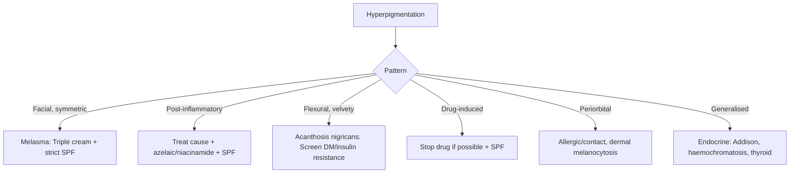

# Pigmentation Disorders Hub

---
tags: [medicine, dermatology, heading-hub, scaffold-hub]
davidson_part: Part 3: Clinical Medicine
davidson_chapter: Chapter 29: Dermatology
heading: Disorders of Pigmentation
topic_group:
topic:
status: full-fcps-mrcp-hub
priority: high
created: 2026-06-15
modified: 2026-06-15
exam_relevance: [FCPS, MRCP Part 1, MRCP Part 2, PACES]
see_also:
  - "[[Dermatology MOC]]"
  - "[[Davidson Chapter 29 - Dermatology Hierarchy]]"
  - "[[../07_Skin_Tumours/Skin Tumours Hub]]"
---

# Disorders of Pigmentation Hub

> [!info]
> **Davidson Ch29 Section 8** | **3 Topic Groups, 10 Disease Topics** | **Priority: HIGH**

---

## Topic Groups in this Section

| # | Topic Group | Disease Topics | Status |
|---|-------------|----------------|--------|
| 8.1 | Hyperpigmentation Disorders | 7 | 🔴 scaffold |
| 8.2 | Hypopigmentation Disorders | 6 | 🔴 scaffold |
| 8.3 | Other Pigmentary Conditions | 3 | 🔴 scaffold |

---

## High-Yield Summary Table

| Disorder | Clinical Key | Pathophysiology | 1st Line Management | Key Association |
|----------|--------------|-----------------|---------------------|-----------------|
| **Melasma** | Symmetric facial hyperpigmentation, women, pregnancy/OCP | UV + hormones → melanocyte stimulation | Strict photoprotection, topical triple combo (hydroquinone/tretinoin/steroid) | Pregnancy, OCP, thyroid |
| **Post-inflammatory hyperpigmentation (PIH)** | Follows inflammation, darker skin | Melanin incontinence | Treat underlying, photoprotection, azelaic/niacinamide | Acne, eczema, trauma |
| **Vitiligo** | Chalk-white macules, Koebner, periorificial | Autoimmune melanocyte destruction, oxidative stress | TCS/TCI face/flexures, NB-UVB body, JAKi (ruxolitinib) | Thyroid, alopecia areata, DM1 |
| **Albinism** | Congenital generalised hypopigmentation, nystagmus, photophobia | Tyrosinase/OCA gene mutations | Photoprotection, low vision aids, skin cancer surveillance | Ocular albinism |
| **Pityriasis alba** | Hypopigmented scaly patches, face, children | Mild eczema + post-inflammatory | Emollients, mild TCS, photoprotection | Atopic dermatitis |
| **Lentigines** | Discrete brown macules, sun-exposed | Melanocyte hyperplasia | Photoprotection, laser, cryo | Syndromes (Peutz-Jeghers, Carney) |
| **Acanthosis nigricans** | Velvety hyperpigmented plaques, flexures | Insulin resistance → IGF-1R stimulation | Weight loss, treat insulin resistance, topical retinoids | Obesity, DM2, malignancy (gastric) |

---

## Key Algorithms

### Vitiligo Management
```mermaid
flowchart TD
    A[Vitiligo Diagnosed] --> B{Type}
    B -->|Segmental| C[Topical TCS/TCI ×3-6m then stop if stable]
    B -->|Non-segmental| D{Extent}
    D -->|Limited <10% BSA| E[TCS potent face/flexures / TCI / NB-UVB if resistant]
    D -->|Extensive >10% BSA| F[NB-UVB 2-3x/week + TCS/TCI]
    F --> G{Repigmentation?}
    G -->|Limited| H[Consider JAKi (ruxolitinib cream) / systemic JAKi]
    G -->|Good| I[Maintenance NB-UVB monthly]
    H --> J[Monitor CBC, LFT, lipids]
```

### Hyperpigmentation Approach


---

## FCPS/MRCP Viva Topics (High-Yield)

1. **Melasma** - triple combination cream (hydroquinone 4% + tretinoin 0.05% + fluocinolone 0.01%), strict SPF, chronic
2. **Vitiligo** - segmental vs non-segmental, Koebner, NB-UVB, JAK inhibitors (ruxolitinib cream FDA approved), associated autoimmune
3. **PIH** - treat inflammation first, then pigment, darker skin types more prone
4. **Albinism** - OCA types, tyrosinase, ocular findings (nystagmus, foveal hypoplasia), skin cancer risk
5. **Acanthosis nigricans** - insulin resistance, malignancy screen if sudden onset/severe (gastric ca)
6. **Lentigines** - simple vs solar vs PUVA vs syndromic (Peutz-Jeghers, Carney, LEOPARD)
7. **Pityriasis alba** - atopic children, hypopigmented facial patches, self-limiting, emollients
8. **Chemical leucoderma** - phenols, catechols, occupational, vitiligo-like
9. **Linea nigra** - pregnancy, hormonal, midline abdominal, fades postpartum

---

## Mnemonics

- **Melasma triggers:** `MELASMA` = **M**elasma = **E**strogen (pregnancy/OCP), **L**ight (UV), **A**ge, **S**tress, **M**edications (phenytoin), **A**utoimmune (thyroid)
- **Vitiligo associations:** `VITILIGO` = **V**itiligo = **I**nsulin-dependent DM, **T**hyroid (Hashimoto/Graves), **I**AA (alopecia areata), **L**upus (rare), **I**nflammatory bowel, **G**astric parietal cell Ab, **O**ther autoimmune
- **Acanthosis nigricans causes:** `AN CANCER` = **A**N = **C**ushing, **A**cromegaly, **N**eoplasia (gastric), **C**ushing, **E**ndocrine (insulin resistance), **R**etinoid deficiency? No - **R**are genetic

---

## Quick Revision Card

| Disorder | Clinical | 1st Line | Key Association |
|----------|----------|----------|-----------------|
| **Melasma** | Symmetrical facial brown patches | Triple cream + strict SPF50 | Pregnancy, OCP, thyroid |
| **PIH** | Post-inflammatory dark marks | Treat cause + azelaic/niacinamide + SPF | Acne, eczema, trauma |
| **Vitiligo** | Chalk-white macules, Koebner | TCS/TCI face, NB-UVB body, JAKi | Thyroid, alopecia, DM1 |
| **Albinism** | Generalised hypopig, nystagmus | Photoprotection, surveillance | Ocular albinism, skin CA |
| **Pityriasis alba** | Hypopig scaly face patches, kids | Emollients, mild TCS | Atopic dermatitis |
| **Acanthosis nigricans** | Velvety flexural hyperpig | Weight loss, metformin, topical retinoids | Insulin resistance, malignancy |
| **Lentigines** | Discrete brown macules | SPF, laser if cosmetic | Syndromes (Peutz-Jeghers) |

---

## Linkage

- **MOC:** [[Dermatology MOC]]
- **Hierarchy:** [[Davidson Chapter 29 - Dermatology Hierarchy]]
- **Section Dir:** `08_Pigmentation_Disorders/`
- **Previous Hub:** [[../07_Skin_Tumours/Skin Tumours Hub]]
- **Next Hub:** [[../09_Hair_Nail_Disorders/Hair and Nail Hub]]

---

## Progress
- [ ] 8.1 Hyperpigmentation Disorders Hub (scaffold-hub)
- [ ] 8.2 Hypopigmentation Disorders Hub (scaffold-hub)
- [ ] 8.3 Other Pigmentary Conditions Hub (scaffold-hub)
- [ ] 10 Disease Topics (scaffold → full-fcps-mrcp-note)