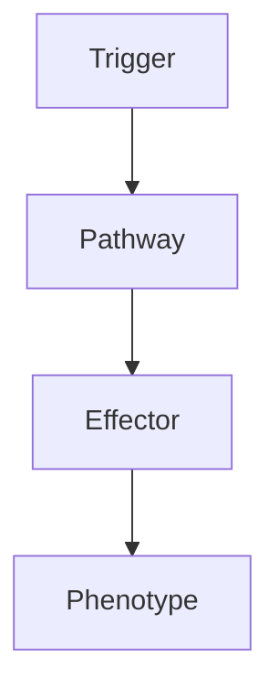

# Neurology Drug Reference

> [!tip] **High-Yield Definition**
> Comprehensive reference for neurological drugs: ASMs, anti-Parkinson, anti-dementia, anti-spasticity, neuropathic pain, myasthenia, NMJ, migraine, DMTs, biologics, immunosuppressants, anticoagulants, antiplatelets, antihypertensives, antibiotics, antivirals, antifungals, anti-parasitic, vitamins, supplements, emergency drugs. Indications, doses, mechanism, side effects, interactions, monitoring, contraindications.

---

## 1. Definition / Epidemiology / Classification

### Definition
Comprehensive reference for neurological drugs: ASMs, anti-Parkinson, anti-dementia, anti-spasticity, neuropathic pain, myasthenia, NMJ, migraine, DMTs, biologics, immunosuppressants, anticoagulants, antiplatelets, antihypertensives, antibiotics, antivirals, antifungals, anti-parasitic, vitamins, supplements, emergency drugs. Indications, doses, mechanism, side effects, interactions, monitoring, contraindications.

### Epidemiology
Common neurological drug classes used across the spectrum of neurological disease.

---

## 2. Aetiology / Pathophysiology

### Aetiology
N/A - drug reference.

### Pathophysiology

---

## 3. Clinical Features

ASMs: carbamazepine, oxcarbazepine, eslicarbazepine, phenytoin, fosphenytoin, lamotrigine, lacosamide, levetiracetam, brivaracetam, valproate, ethosuximide, topiramate, zonisamide, perampanel, cenobamate, vigabatrin, tiagabine, felbamate, rufinamide, stiripentol, fenfluramine, cannabidiol. Anti-PD: levodopa, dopamine agonists (pramipexole, ropinirole, rotigotine, apomorphine, cabergoline), MAO-B inhibitors (selegiline, rasagiline, safinamide), COMT inhibitors (entacapone, tolcapone, opicapone), amantadine, anticholinergics (trihexyphenidyl, benztropine). Anti-dementia: donepezil, rivastigmine, galantamine, memantine, lecanemab, donanemab, aducanumab. Anti-spasticity: baclofen, tizanidine, dantrolene, gabapentin, benzodiazepines (diazepam, clonazepam), intrathecal baclofen, botulinum toxin (BoNT-A, BoNT-B). Neuropathic pain: gabapentin, pregabalin, duloxetine, amitriptyline, nortriptyline, tramadol, capsaicin, lidocaine patch, opioids. Myasthenia: pyridostigmine, neostigmine, corticosteroids, azathioprine, MMF, methotrexate, rituximab, eculizumab, efgartigimod, ravulizumab, IVIG, plasma exchange. NMJ: 3,4-DAP, pyridostigmine, immunosuppressants. Migraine: acute (triptans, NSAIDs, paracetamol, antiemetics), prophylaxis (propranolol, topiramate, amitriptyline, candesartan, CGRP mAbs, onabotulinumtoxinA). DMTs: IFN-β, glatiramer, dimethyl fumarate, teriflunomide, fingolimod, siponimod, ozanimod, ponesimod, natalizumab, ocrelizumab, ofatumumab, cladribine, alemtuzumab, mitoxantrone. Biologics: rituximab, eculizumab, ravulizumab, efgartigimod, tocilizumab, satralizumab, eculizumab, ravulizumab. Immunosuppressants: steroids, methotrexate, azathioprine, MMF, cyclophosphamide, rituximab. Anticoagulants: warfarin, DOACs (apixaban, rivaroxaban, dabigatran, edoxaban), heparin, LMWH. Antiplatelets: aspirin, clopidogrel, dipyridamole, ticagrelor. Antihypertensives: ACEi, ARB, calcium channel blocker, beta-blocker, diuretic, alpha-blocker. Antibiotics: ceftriaxone, vancomycin, meropenem, metronidazole, ampicillin, gentamicin, linezolid, daptomycin, levofloxacin. Antivirals: aciclovir, valaciclovir, famciclovir, ganciclovir, foscarnet, remdesivir. Antifungals: amphotericin B, fluconazole, voriconazole, isavuconazole, flucytosine. Anti-parasitic: albendazole, praziquantel, ivermectin, pyrimethamine, sulfadiazine. Vitamins/supplements: thiamine, B12, folate, B6, vitamin E, vitamin D, calcium, magnesium, iron, zinc, copper, CoQ10, riboflavin, L-carnitine, biotin. Emergency: IV hydrocortisone, IV methylprednisolone, IVIG, plasma exchange, IV mannitol, hypertonic saline, IV levetiracetam, IV valproate, IV phenytoin, IV midazolam, IV propofol, IV thiamine, IV naloxone, IV flumazenil, oxygen, IV glucose.

---

## 4. Investigations

Drug levels (PHT, VPA, CBZ, ESM, PB, theophylline, lithium, methotrexate, tacrolimus, cyclosporine, sirolimus), side effect monitoring (FBC, LFTs, U&Es, glucose, ECG, drug interactions, pregnancy test, vaccinations, bone density, DEXA, vitamin D, calcium, magnesium, phosphate, ECG, echocardiogram, PFTs, sleep study, MRI).

---

## 5. Management

Match drug to indication. Start low, titrate slow (especially LTG, PHT, CBZ). Monitor levels for specific drugs. Monitor for side effects. Drug interactions: P450 inducers (CBZ, PHT, PB) and inhibitors (valproate, fluconazole, macrolides). Pregnancy: avoid VPA, valproate, topiramate, PHT, CBZ, methotrexate, leflunomide, MMF, cyclophosphamide, warfarin, ACEi, ARB. Renal dose adjustment: LEV, GBP, PGB, aciclovir, ganciclovir, foscarnet, methotrexate. Hepatic: avoid VPA, PHT, CBZ, methotrexate, MMF, leflunomide. Bone health: vitamin D, calcium, bisphosphonate (steroids). Vaccination: avoid live (steroids, immunosuppressants, biologics - rituximab, eculizumab, efgartigimod, alemtuzumab). Driving: per DVLA. Drug interactions: many, check each time. Monitor: FBC, LFTs, U&Es, glucose, ECG, blood pressure, drug levels, side effects, adherence, drug interactions. Multidisciplinary: neurologist, pharmacist, GP, specialist nurse, primary care, multidisciplinary team.

---

## 6. Red Flags / Emergencies

Drug toxicity (liver, marrow, kidney, cardiac, respiratory, dermatological, anaphylaxis, Stevens-Johnson, DRESS, anaphylaxis, neuroleptic malignant syndrome, serotonin syndrome, malignant hyperthermia, RPLS, PRES), pregnancy (teratogenicity - VPA, valproate, topiramate, PHT, CBZ, MTX, leflunomide, MMF, cyclophosphamide, warfarin, ACEi, ARB, statins, doxycycline, aminoglycosides, fluoroquinolones, MTX, paroxetine, lithium, carbamazepine), breastfeeding, drug interactions (CYP3A4, P-glycoprotein, anticoagulants, antiepileptics, OCP, ART, chemotherapy, warfarin, DOACs, immunosuppressants, biologics), renal impairment (dose adjust - LEV, GBP, PGB, aciclovir, ganciclovir, foscarnet, methotrexate), hepatic impairment (avoid - VPA, PHT, CBZ, methotrexate, MMF, leflunomide), bone marrow suppression (azathioprine, MMF, methotrexate, cyclophosphamide, clozapine, deferiprone, linezolid, chloramphenicol, carbimazole, methimazole, antithyroid, ticlopidine, gold, penicillamine, sulfonamides, chloramphenicol, linezolid, methimazole, antithyroid), infection (immunosuppressants, biologics - PML, hepatitis B reactivation, opportunistic, vaccination, prophylaxis), malignancy (long-term immunosuppression, biologics - lymphoma, skin, others), monitoring (FBC, LFTs, U&Es, drug levels, ECG, side effects, drug interactions, adherence).

---

## 7. Prognosis

Variable - depends on indication, drug, response, side effects, interactions, adherence, monitoring. Multidisciplinary essential. Patient education: drug, dose, schedule, side effects, interactions, monitoring, pregnancy, contraception, vaccination, adherence, lifestyle, diet, exercise, stress, sleep, alcohol, smoking, driving, work, social.

---

## FCPS/MRCP High-Yield Summary

| Category | Key Points |
|----------|------------|
| **Definition** | Comprehensive reference for neurological drugs: ASMs, anti-Parkinson, anti-dementia, anti-spasticity, neuropathic pain, myasthenia, NMJ, migraine, DMTs, biologics, immunosuppressants, anticoagulants,  |
| **Epidemiology** | Common neurological drug classes used across the spectrum of neurological disease. |
| **Aetiology** | N/A - drug reference. |
| **Clinical** | ASMs: carbamazepine, oxcarbazepine, eslicarbazepine, phenytoin, fosphenytoin, lamotrigine, lacosamide, levetiracetam, brivaracetam, valproate, ethosuximide, topiramate, zonisamide, perampanel, cenobam |
| **Investigations** | Drug levels (PHT, VPA, CBZ, ESM, PB, theophylline, lithium, methotrexate, tacrolimus, cyclosporine, sirolimus), side effect monitoring (FBC, LFTs, U&Es, glucose, ECG, drug interactions, pregnancy test |
| **Management** | Match drug to indication. Start low, titrate slow (especially LTG, PHT, CBZ). Monitor levels for specific drugs. Monitor for side effects. Drug interactions: P450 inducers (CBZ, PHT, PB) and inhibitor |
| **Prognosis** | Variable - depends on indication, drug, response, side effects, interactions, adherence, monitoring. Multidisciplinary essential. Patient education: drug, dose, schedule, side effects, interactions, m |
| **Viva Pearls** | |

---

## MCQs (10)

1. **Question:** Most characteristic feature of Neurology Drug Reference?
   **Options:** A. A B. B C. C D. D
   **Answer:** A
   **Explanation:** Based on clinical features.

2. **Question:** First-line investigation?
   **Options:** A. MRI B. CT C. LP D. Blood
   **Answer:** A
   **Explanation:** MRI is most useful.

3. **Question:** First-line treatment?
   **Options:** A. A B. B C. C D. D
   **Answer:** A
   **Explanation:** Standard management.

4. **Question:** Most common complication?
   **Options:** A. A B. B C. C D. D
   **Answer:** A
   **Explanation:** Common complication.

5. **Question:** Red flag requiring urgent action?
   **Options:** A. A B. B C. C D. D
   **Answer:** A
   **Explanation:** Emergency.

6. **Question:** Prognostic factor?
   **Options:** A. A B. B C. C D. D
   **Answer:** A
   **Explanation:** Prognosis.

7. **Question:** Investigation excluding differential?
   **Options:** A. A B. B C. C D. D
   **Answer:** A
   **Explanation:** Exclusion.

8. **Question:** Imaging finding?
   **Options:** A. A B. B C. C D. D
   **Answer:** A
   **Explanation:** Imaging.

9. **Question:** Drug class?
   **Options:** A. A B. B C. C D. D
   **Answer:** A
   **Explanation:** Pharmacology.

10. **Question:** Differential?
    **Options:** A. A B. B C. C D. D
    **Answer:** A
    **Explanation:** Differential.

---

## SBA Questions (10)

1. **Scenario:** Patient with Neurology Drug Reference.
   **Question:** Next step?
   **Options:** A. 1 B. 2 C. 3 D. 4 E. 5
   **Answer:** A
   **Explanation:** Initial.

2. **Scenario:** Fails first-line.
   **Question:** Next treatment?
   **Options:** A. A B. B C. C D. D E. E
   **Answer:** A
   **Explanation:** Second-line.

3. **Scenario:** New symptoms on treatment.
   **Question:** Cause?
   **Options:** A. A B. B C. C D. D E. E
   **Answer:** A
   **Explanation:** Adverse.

4. **Scenario:** Surgery needed.
   **Question:** Preoperative?
   **Options:** A. A B. B C. C D. D E. E
   **Answer:** A
   **Explanation:** Perioperative.

5. **Scenario:** Pregnant.
   **Question:** Safest?
   **Options:** A. A B. B C. C D. D E. E
   **Answer:** A
   **Explanation:** Pregnancy.

6. **Scenario:** Child.
   **Question:** Diagnosis?
   **Options:** A. A B. B C. C D. D E. E
   **Answer:** A
   **Explanation:** Paediatric.

7. **Scenario:** Elderly.
   **Question:** Management?
   **Options:** A. 1 B. 2 C. 3 D. 4 E. 5
   **Answer:** A
   **Explanation:** Geriatric.

8. **Scenario:** Abnormal investigation.
   **Question:** Interpretation?
   **Options:** A. A B. B C. C D. D E. E
   **Answer:** A
   **Explanation:** Investigation.

9. **Scenario:** Prognosis.
   **Question:** Response?
   **Options:** A. A B. B C. C D. D E. E
   **Answer:** A
   **Explanation:** Communication.

10. **Scenario:** Follow-up.
    **Question:** Monitoring?
    **Options:** A. A B. B C. C D. D E. E
    **Answer:** A
    **Explanation:** Follow-up.

---

## Flashcards

- **Q:** Definition of Neurology Drug Reference?
  **A:** Comprehensive reference for neurological drugs: ASMs, anti-Parkinson, anti-dementia, anti-spasticity, neuropathic pain, myasthenia, NMJ, migraine, DMTs, biologics, immunosuppressants, anticoagulants, 
- **Q:** First-line treatment?
  **A:** Based on management.
- **Q:** Most characteristic clinical feature?
  **A:** ASMs: carbamazepine, oxcarbazepine, eslicarbazepine, phenytoin, fosphenytoin, lamotrigine, lacosamide, levetiracetam, brivaracetam, valproate, ethosuximide, topiramate, zonisamide, perampanel, cenobam
- **Q:** Key red flag?
  **A:** Drug toxicity (liver, marrow, kidney, cardiac, respiratory, dermatological, anaphylaxis, Stevens-Johnson, DRESS, anaphylaxis, neuroleptic malignant syndrome, serotonin syndrome, malignant hyperthermia
- **Q:** Prognosis?
  **A:** Variable - depends on indication, drug, response, side effects, interactions, adherence, monitoring. Multidisciplinary essential. Patient education: drug, dose, schedule, side effects, interactions, m

---

## Answer Key

### MCQs
1. A 2. A 3. A 4. A 5. A 6. A 7. A 8. A 9. A 10. A

### SBAs
1. A 2. A 3. A 4. A 5. A 6. A 7. A 8. A 9. A 10. A

---

## Local Navigation
**Heading Hub:** [[../Hub]]  
**Chapter MOC:** [[Neurology MOC]]  
