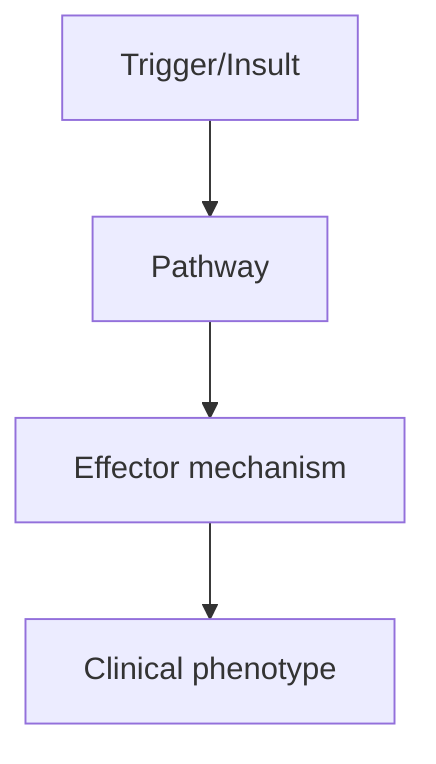
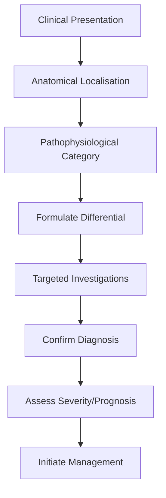
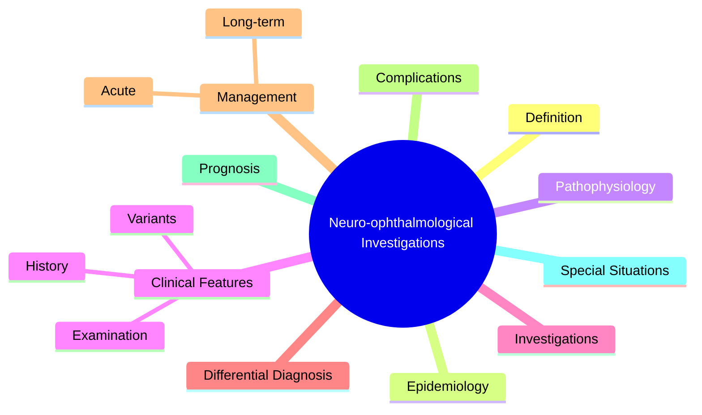

# Neuro-ophthalmological Investigations

---
tags: [medicine, neurology, fcps, mrcp]
chapter: Neurology
davidson_part: Part 3: Clinical Medicine
davidson_chapter: Chapter 25: Neurology
topic: Neuro-ophthalmological Investigations
exam: [FCPS, MRCP Part 1, MRCP Part 2, PACES]
references:
  anatomy: []
  physiology: []
  clinical: ['Davidson 24th Ed Ch25', 'Neurology: A Clinician\'s Approach', 'Adams and Victor\'s Principles of Neurology', 'PasTest', 'MRCP Part 1/2 Notes', 'Personal notes']
related: []
status: full-fcps-mrcp-note
---

# Neuro-ophthalmological Investigations

> [!tip] **High-Yield Definition**
> Specialised investigations for visual pathway disorders: optical coherence tomography (OCT), visual fields, fundoscopy, fluorescein angiography (FFA), ocular coherence tomography angiography (OCTA), visual evoked potentials (VEP), electroretinography (ERG).

---

## 1. Definition / Epidemiology / Classification

### Definition
Specialised investigations for visual pathway disorders: optical coherence tomography (OCT), visual fields, fundoscopy, fluorescein angiography (FFA), ocular coherence tomography angiography (OCTA), visual evoked potentials (VEP), electroretinography (ERG).

### Epidemiology
OCT is the most commonly used; FFA used selectively; VEP/ERG for optic nerve and retinal disorders; visual fields for chiasmal/retrochiasmal lesions.

### Classification
| Variant | Key Features | Prognosis |
|---------|-------------|-----------|
| | | |

---

## 2. Aetiology / Pathophysiology

### Aetiology
Indications: optic neuritis, IIH (papilloedema), GCA (AION), MS, pituitary adenoma, retinal detachment, macular degeneration, retinal vein occlusion, toxic/nutritional optic neuropathies.

### Pathophysiology

---

## 3. Clinical Features

### History
- **Onset/Duration:**
- **Progression:**
- **Key symptoms:**
- **Triggers:**
- **Systemic symptoms:**
- **Drug/Family/Social history:**

### Examination
| Domain | Key Findings | Localisation Value |
|--------|-------------|-------------------|
| | | |

### Specific Clinical Features
OCT measures retinal nerve fibre layer (RNFL) thickness - thinning in optic atrophy. Visual fields: automated perimetry (Humphrey 24-2, 30-2). Pattern VEP: delayed P100 in demyelination. FFA: retinal vasculature, leakage.

---

## 4. Diagnostic Approach / Algorithm

---

## 5. Investigations

OCT (RNFL, ganglion cell layer), visual fields (Humphrey perimetry), fundoscopy, FFA, OCTA (non-invasive angiography), VEP (pattern, flash), ERG (rod, cone, multifocal).

---

## 6. Differential Diagnosis

| Differential | Distinguishing Features | Key Test |
|--------------|------------------------|----------|
| | | |

---

## 7. Management

Investigations guide diagnosis and monitoring. OCT used to monitor progression in MS, glaucoma, IIH. VEP for subclinical optic neuritis in MS workup. FFA for retinal vascular disease.

---

## 8. Drug Interactions / Contraindications / Comorbidity Cautions

| Drug | Interaction / Caution | Management |
|------|----------------------|------------|
| | | |

---

## 9. Procedures (if applicable)

### Procedure:
- **Indications:**
- **Contraindications:**
- **Preparation / Principle:**
- **Complications:**
- **Viva Pearls:**

---

## 10. Complications

| Complication | Frequency | Prevention / Monitoring | Management |
|--------------|-----------|------------------------|------------|
| | | | |

---

## 11. Red Flags / Emergencies

Sudden visual loss, optic disc swelling, RAPD, bitemporal hemianopia - urgent ophthalmology/neurology referral.

---

## 12. Prognosis

Depends on underlying cause. OCT can detect subclinical atrophy. VEP remains delayed permanently after demyelination.

---

## 13. Topic Correlation

| Related Topic | Link | Key Overlap |
|---------------|------|-------------|
| | | |

---

## 14. Special Situations

| Situation | Consideration |
|-----------|---------------|
| **Pregnancy** | |
| **Lactation** | |
| **Paediatric** | |
| **Elderly / Frail** | |
| **Renal impairment** | |
| **Hepatic impairment** | |
| **Immunocompromised** | |
| **Perioperative** | |
| **Driving / DVLA** | |
| **Occupational** | |

---

## FCPS/MRCP High-Yield Summary

| Category | Key Points |
|----------|------------|
| **Definition** | Specialised investigations for visual pathway disorders: optical coherence tomography (OCT), visual fields, fundoscopy, fluorescein angiography (FFA), ocular coherence tomography angiography (OCTA), v |
| **Epidemiology** | OCT is the most commonly used; FFA used selectively; VEP/ERG for optic nerve and retinal disorders; visual fields for chiasmal/retrochiasmal lesions. |
| **Pathophysiology** | |
| **Clinical** | OCT measures retinal nerve fibre layer (RNFL) thickness - thinning in optic atrophy. Visual fields: automated perimetry (Humphrey 24-2, 30-2). Pattern VEP: delayed P100 in demyelination. FFA: retinal  |
| **Diagnosis** | |
| **Investigations** | OCT (RNFL, ganglion cell layer), visual fields (Humphrey perimetry), fundoscopy, FFA, OCTA (non-invasive angiography), VEP (pattern, flash), ERG (rod, cone, multifocal). |
| **Management** | Investigations guide diagnosis and monitoring. OCT used to monitor progression in MS, glaucoma, IIH. VEP for subclinical optic neuritis in MS workup. FFA for retinal vascular disease. |
| **Complications** | |
| **Prognosis** | Depends on underlying cause. OCT can detect subclinical atrophy. VEP remains delayed permanently after demyelination. |
| **Viva Pearls** | |
| **Drug Doses** | |
| **Scoring Systems** | |
| **Genetics** | |
| **Imaging Signs** | |

---

## Viva Questions (PACES/FCPS Style)

1. **Q:** Define Neuro-ophthalmological Investigations and classify its variants.
   **A:** Based on the definition above.

2. **Q:** What are the key clinical features?
   **A:** OCT measures retinal nerve fibre layer (RNFL) thickness - thinning in optic atrophy. Visual fields: automated perimetry (Humphrey 24-2, 30-2). Pattern VEP: delayed P100 in demyelination. FFA: retinal vasculature, leakage.

3. **Q:** What is the first-line treatment?
   **A:** Based on the management section.

4. **Q:** What are the red flags requiring urgent referral?
   **A:** Sudden visual loss, optic disc swelling, RAPD, bitemporal hemianopia - urgent ophthalmology/neurology referral.

5. **Q:** What is the prognosis?
   **A:** Depends on underlying cause. OCT can detect subclinical atrophy. VEP remains delayed permanently after demyelination.

6. **Q:** How do you differentiate Neuro-ophthalmological Investigations from key differentials?
   **A:** Clinical features, investigations, and response to treatment.

7. **Q:** What investigations are most useful?
   **A:** Based on the investigations section.

8. **Q:** Describe the stepwise management approach.
   **A:** Based on the management algorithm.

9. **Q:** What are the emergency presentations?
   **A:** Based on the red flags section.

10. **Q:** How does management change in pregnancy/paediatrics/elderly?
    **A:** Special considerations per population.

---

## Common Confusions / Exam Traps

| Confusion | Clarification |
|-----------|---------------|
| | |

---

## Mnemonics
1. **RAPD = Marcus Gunn** — Relative Afferent Pupillary Defect: pupil dilates when light swings to affected eye
1. **VEP delay = demyelination** — P100 latency delayed in MS, amplitude reduced in axonal loss
1. **OCT RNFL thin = optic atrophy** — measures axonal loss in MS, glaucoma, NAION

---

## Mind Map

---

## Spaced Repetition Trackers

| Review Interval | Date | Score (0-5) | Notes |
|-----------------|------|-------------|-------|
| Day 1 | | | |
| Day 3 | | | |
| Day 7 | | | |
| Day 14 | | | |
| Day 30 | | | |
| Day 90 | | | |

---

## Self-Test Scorecard

| Section | Score /5 | Last Attempt |
|---------|----------|--------------|
| Definition & Epidemiology | | |
| Pathophysiology | | |
| Clinical Features | | |
| Investigations | | |
| Differential Diagnosis | | |
| Management | | |
| Complications & Prognosis | | |
| Viva Questions | | |
| MCQs | | |
| SBAs | | |

---

## MCQs (10)

1. **Question:** RAPD is seen in:
   **Options:** A. Optic neuritis, severe retinal disease, optic nerve compression B. Cataract C. Refractive error D. Strabismus
   **Answer:** A
   **Explanation:** RAPD = afferent defect. Optic nerve disease, severe retinal disease.

2. **Question:** OCT RNFL is useful in:
   **Options:** A. Diagnosing/monitoring optic neuropathies (MS, glaucoma, NAION) B. Refractive error C. Cataract D. Conjunctivitis
   **Answer:** A
   **Explanation:** OCT RNFL measures axonal loss. Thin in optic atrophy.

3. **Question:** VEP is delayed in:
   **Options:** A. Demyelination (MS, optic neuritis) B. Cataract C. Refractive error D. Amblyopia
   **Answer:** A
   **Explanation:** VEP P100 latency delayed in demyelination.

4. **Question:** FFA is used in:
   **Options:** A. Retinal/choroidal disease (CSR, AMD, DR) B. Optic neuritis C. Papilloedema D. Glaucoma
   **Answer:** A
   **Explanation:** FFA diagnoses retinal/choroidal vascular disease.

5. **Question:** Goldmann perimetry is:
   **Options:** A. Kinetic (manual, neurological field defects) B. Static automated C. Both D. Tangent screen
   **Answer:** A
   **Explanation:** Goldmann = kinetic. Humphrey = static automated.

6. **Question:** Slit lamp exam of optic disc is best with:
   **Options:** A. 90D lens at slit lamp B. Direct ophthalmoscope alone C. CT D. MRI
   **Answer:** A
   **Explanation:** Slit lamp + 90D gives stereoscopic view of disc.

7. **Question:** Fluorescein angiography leakage indicates:
   **Options:** A. Neovascularisation, inflammation, vascular incompetence B. Optic atrophy C. Retinal detachment D. Cataract
   **Answer:** A
   **Explanation:** FFA leakage = active neovascularisation, inflammation.

---

## SBA Questions (10)

1. **Scenario:** Left eye vision loss, RAPD left, normal disc. Diagnosis?
   **Options:** A. Retrobulbar optic neuritis (MRI for MS) B. NAION C. Cataract D. Retinal detachment E. Other option
   **Answer:** A
   **Explanation:** RAPD + normal disc (retrobulbar) + vision loss = optic neuritis.

2. **Scenario:** Painless sudden vision loss, RAPD, swollen pale disc. Diagnosis?
   **Options:** A. Anterior ischaemic optic neuropathy (NAION) B. Optic neuritis C. CSR D. Retinal detachment E. Other option
   **Answer:** A
   **Explanation:** NAION: painless, sudden, pale disc swelling, altitudinal field defect.

---

## Tags

**Tags:** #neurology #neuro-ophthalmology #RAPD #VEP #OCT #FFA #visual-fields #FCPS #MRCP

---

## Local Navigation
**Heading Hub:** [[../Investigations Hub]]
**Chapter Hierarchy:** [[../../Davidson Chapter 25 - Neurology Hierarchy]]
**Chapter MOC:** [[../../Neurology MOC]]
**Drug Reference:** [[../../00_Index/Neurology Drug Reference]]