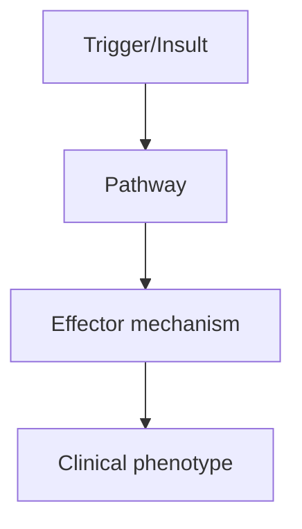
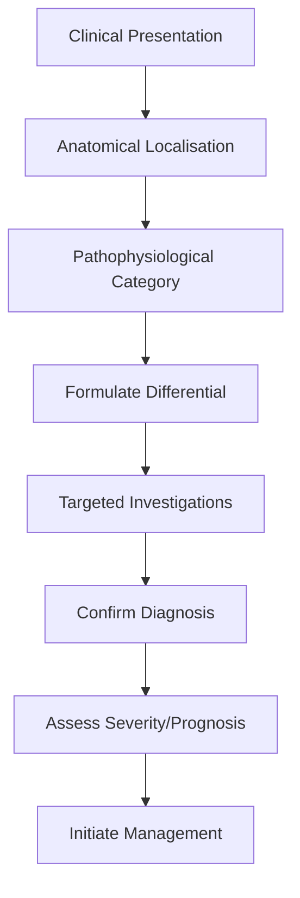
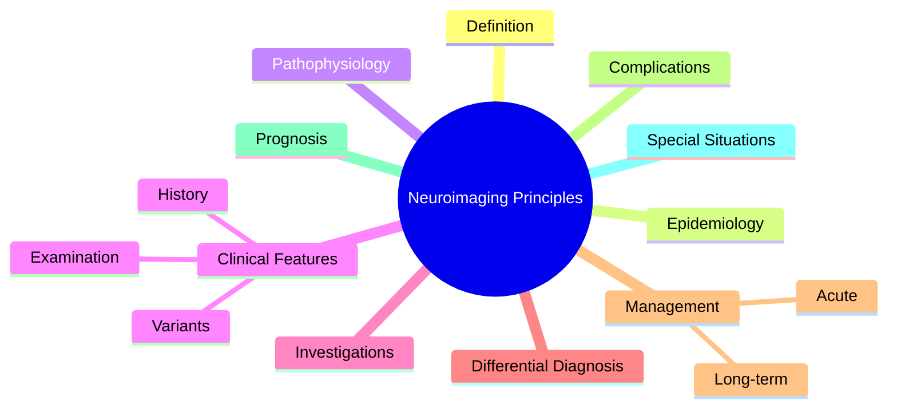

# Neuroimaging (CT-MRI) Principles

---
tags: [medicine, neurology, fcps, mrcp]
chapter: Neurology
davidson_part: Part 3: Clinical Medicine
davidson_chapter: Chapter 25: Neurology
topic: Neuroimaging (CT-MRI) Principles
exam: [FCPS, MRCP Part 1, MRCP Part 2, PACES]
references:
  anatomy: []
  physiology: []
  clinical: ['Davidson 24th Ed Ch25', 'Neurology: A Clinician\'s Approach', 'Adams and Victor\'s Principles of Neurology', 'PasTest', 'MRCP Part 1/2 Notes', 'Personal notes']
related: []
status: full-fcps-mrcp-note
---

# Neuroimaging (CT-MRI) Principles

> [!tip] **High-Yield Definition**
> Principles and interpretation of CT and MRI in neurological disease. Understanding sequences, contrast, indications, and limitations is essential for clinical neurology.

---

## 1. Definition / Epidemiology / Classification

### Definition
Principles and interpretation of CT and MRI in neurological disease. Understanding sequences, contrast, indications, and limitations is essential for clinical neurology.

### Epidemiology
CT most commonly used in emergency (stroke, trauma, haemorrhage). MRI superior for most non-emergency indications. ~80% of neurological diagnosis involves imaging.

### Classification
| Variant | Key Features | Prognosis |
|---------|-------------|-----------|
| | | |

---

## 2. Aetiology / Pathophysiology

### Aetiology
N/A. Principles of imaging modality selection.

### Pathophysiology

---

## 3. Clinical Features

### History
- **Onset/Duration:**
- **Progression:**
- **Key symptoms:**
- **Triggers:**
- **Systemic symptoms:**
- **Drug/Family/Social history:**

### Examination
| Domain | Key Findings | Localisation Value |
|--------|-------------|-------------------|
| | | |

### Specific Clinical Features
CT: hyperacute blood (hyperdense), ischaemia (loss of grey-white differentiation at 6h, well seen at 24-48h), fractures, calcifications. MRI sequences: T1 (anatomy, fat bright), T2 (oedema, fluid bright), FLAIR (T2 with CSF suppression - periventricular lesions), DWI (acute stroke, abscess, pus), GRE/SWI (blood, microbleeds, calcification), contrast (tumour, infection, inflammation, demyelination). MRA (arteries), MRV (veins), CTA (arteries, faster).

---

## 4. Diagnostic Approach / Algorithm

---

## 5. Investigations

CT head: stroke (non-contrast), trauma, haemorrhage, mass effect, hydrocephalus, fractures. MRI brain: most non-emergency indications. MRI spine: cord compression, demyelination, tumour. CT/MR angiography: vascular abnormalities. Functional MRI: pre-surgical planning.

---

## 6. Differential Diagnosis

| Differential | Distinguishing Features | Key Test |
|--------------|------------------------|----------|
| | | |

---

## 7. Management

Choose appropriate modality. Sequence selection critical. Always correlate with clinical findings. Pitfalls: early stroke may be normal on CT, posterior fossa obscured by CT artefact, contrast reactions.

---

## 8. Drug Interactions / Contraindications / Comorbidity Cautions

| Drug | Interaction / Caution | Management |
|------|----------------------|------------|
| | | |

---

## 9. Procedures (if applicable)

### Procedure:
- **Indications:**
- **Contraindications:**
- **Preparation / Principle:**
- **Complications:**
- **Viva Pearls:**

---

## 10. Complications

| Complication | Frequency | Prevention / Monitoring | Management |
|--------------|-----------|------------------------|------------|
| | | | |

---

## 11. Red Flags / Emergencies

Mass effect, midline shift, obstructive hydrocephalus, cord compression, large vessel occlusion - all require urgent intervention.

---

## 12. Prognosis

Imaging guides diagnosis and management but prognosis depends on underlying pathology.

---

## 13. Topic Correlation

| Related Topic | Link | Key Overlap |
|---------------|------|-------------|
| | | |

---

## 14. Special Situations

| Situation | Consideration |
|-----------|---------------|
| **Pregnancy** | |
| **Lactation** | |
| **Paediatric** | |
| **Elderly / Frail** | |
| **Renal impairment** | |
| **Hepatic impairment** | |
| **Immunocompromised** | |
| **Perioperative** | |
| **Driving / DVLA** | |
| **Occupational** | |

---

## FCPS/MRCP High-Yield Summary

| Category | Key Points |
|----------|------------|
| **Definition** | Principles and interpretation of CT and MRI in neurological disease. Understanding sequences, contrast, indications, and limitations is essential for clinical neurology. |
| **Epidemiology** | CT most commonly used in emergency (stroke, trauma, haemorrhage). MRI superior for most non-emergency indications. ~80% of neurological diagnosis invo |
| **Pathophysiology** | |
| **Clinical** | CT: hyperacute blood (hyperdense), ischaemia (loss of grey-white differentiation at 6h, well seen at 24-48h), fractures, calcifications. MRI sequences: T1 (anatomy, fat bright), T2 (oedema, fluid brig |
| **Diagnosis** | |
| **Investigations** | CT head: stroke (non-contrast), trauma, haemorrhage, mass effect, hydrocephalus, fractures. MRI brain: most non-emergency indications. MRI spine: cord compression, demyelination, tumour. CT/MR angiogr |
| **Management** | Choose appropriate modality. Sequence selection critical. Always correlate with clinical findings. Pitfalls: early stroke may be normal on CT, posterior fossa obscured by CT artefact, contrast reactio |
| **Complications** | |
| **Prognosis** | Imaging guides diagnosis and management but prognosis depends on underlying pathology. |
| **Viva Pearls** | |
| **Drug Doses** | |
| **Scoring Systems** | |
| **Genetics** | |
| **Imaging Signs** | |

---

## Viva Questions (PACES/FCPS Style)

1. **Q:** Define Neuroimaging (CT-MRI) Principles and classify its variants.
   **A:** Based on the definition above.

2. **Q:** What are the key clinical features?
   **A:** CT: hyperacute blood (hyperdense), ischaemia (loss of grey-white differentiation at 6h, well seen at 24-48h), fractures, calcifications. MRI sequences: T1 (anatomy, fat bright), T2 (oedema, fluid bright), FLAIR (T2 with CSF suppression - periventricular lesions), DWI (acute stroke, abscess, pus), GR

3. **Q:** What is the first-line treatment?
   **A:** Based on the management section.

4. **Q:** What are the red flags requiring urgent referral?
   **A:** Mass effect, midline shift, obstructive hydrocephalus, cord compression, large vessel occlusion - all require urgent intervention.

5. **Q:** What is the prognosis?
   **A:** Imaging guides diagnosis and management but prognosis depends on underlying pathology.

6. **Q:** How do you differentiate Neuroimaging (CT-MRI) Principles from key differentials?
   **A:** Clinical features, investigations, and response to treatment.

7. **Q:** What investigations are most useful?
   **A:** Based on the investigations section.

8. **Q:** Describe the stepwise management approach.
   **A:** Based on the management algorithm.

9. **Q:** What are the emergency presentations?
   **A:** Based on the red flags section.

10. **Q:** How does management change in pregnancy/paediatrics/elderly?
    **A:** Special considerations per population.

---

## Common Confusions / Exam Traps

| Confusion | Clarification |
|-----------|---------------|
| | |

---

## Mnemonics
1. **CT hyperdense = fresh bleed** — Acute ICH = hyperdense (white). Becomes isodense, then hypodense over weeks.
1. **MRI sequence guide** — **T1** = anatomy, **T2** = pathology (oedema bright), **FLAIR** = T2 with CSF suppressed, **DWI** = acute stroke bright
1. **Stroke window** — CT insensitive <6h; MRI DWI positive within minutes

---

## Mind Map

---

## Spaced Repetition Trackers

| Review Interval | Date | Score (0-5) | Notes |
|-----------------|------|-------------|-------|
| Day 1 | | | |
| Day 3 | | | |
| Day 7 | | | |
| Day 14 | | | |
| Day 30 | | | |
| Day 90 | | | |

---

## Self-Test Scorecard

| Section | Score /5 | Last Attempt |
|---------|----------|--------------|
| Definition & Epidemiology | | |
| Pathophysiology | | |
| Clinical Features | | |
| Investigations | | |
| Differential Diagnosis | | |
| Management | | |
| Complications & Prognosis | | |
| Viva Questions | | |
| MCQs | | |
| SBAs | | |

---

## MCQs (10)

1. **Question:** Best imaging for acute stroke (<6h):
   **Options:** A. MRI DWI (sensitive within minutes) or CT (rules out haemorrhage) B. CT contrast C. MRI T1 D. MRA only
   **Answer:** A
   **Explanation:** MRI DWI most sensitive for acute infarct.

2. **Question:** CT shows hyperdense lesion in basal ganglia. Diagnosis:
   **Options:** A. Acute intracerebral haemorrhage B. Old infarct C. Tumour D. Abscess
   **Answer:** A
   **Explanation:** Hyperdense on CT = fresh blood.

3. **Question:** FLAIR sequence suppresses:
   **Options:** A. CSF signal (T2 with nulled CSF) B. Fat signal C. Bone signal D. Air signal
   **Answer:** A
   **Explanation:** FLAIR = T2 with CSF nulled.

4. **Question:** DWI shows restricted diffusion in:
   **Options:** A. Acute ischaemic stroke (cytotoxic oedema) B. Chronic infarct C. Tumour D. Vasogenic oedema
   **Answer:** A
   **Explanation:** DWI bright = restricted diffusion. Acute stroke.

5. **Question:** Contrast enhancement in brain tumour indicates:
   **Options:** A. Blood-brain barrier breakdown B. Necrosis only C. Calcification D. Cyst
   **Answer:** A
   **Explanation:** Gadolinium enhancement = BBB breakdown.

6. **Question:** First-line imaging in head trauma (GCS <8):
   **Options:** A. Non-contrast CT head B. MRI C. CT with contrast D. Skull X-ray
   **Answer:** A
   **Explanation:** CT head non-contrast first-line acute trauma.

7. **Question:** DWI differentiates stroke from:
   **Options:** A. TIA (no DWI lesion) B. Migraine C. Seizure D. Tumour
   **Answer:** A
   **Explanation:** Stroke = DWI positive. TIA = DWI negative.

---

## SBA Questions (10)

1. **Scenario:** Sudden right hemiparesis + aphasia 2h ago. CT head normal. Next step?
   **Options:** A. MRI DWI or CT perfusion/CTA B. Discharge C. Lumbar puncture D. EEG E. Reassure
   **Answer:** A
   **Explanation:** Normal CT 2h post-stroke doesn't exclude ischaemia.

2. **Scenario:** Ring-enhancing lesion on MRI. Differential (MAGIC DR)?
   **Options:** A. Metastasis, Abscess, Glioblastoma, Infarct, Contusion, Demyelination, Radiation necrosis B. Stroke only C. Tumour only D. Haemorrhage E. Other option
   **Answer:** A
   **Explanation:** MAGIC DR differential for ring-enhancing lesions.

3. **Scenario:** CT shows loss of grey-white differentiation in MCA territory. Diagnosis?
   **Options:** A. Early MCA infarct (hyperacute) B. Tumour C. Abscess D. MS E. Other option
   **Answer:** A
   **Explanation:** Loss of grey-white = early ischaemic changes. ASPECTS score.

---

## Tags

**Tags:** #neurology #neuroimaging #CT #MRI #DWI #FLAIR #stroke #trauma #MAGIC-DR #FCPS #MRCP

---

## Local Navigation
**Heading Hub:** [[../Investigations Hub]]
**Chapter Hierarchy:** [[../../Davidson Chapter 25 - Neurology Hierarchy]]
**Chapter MOC:** [[../../Neurology MOC]]
**Drug Reference:** [[../../00_Index/Neurology Drug Reference]]