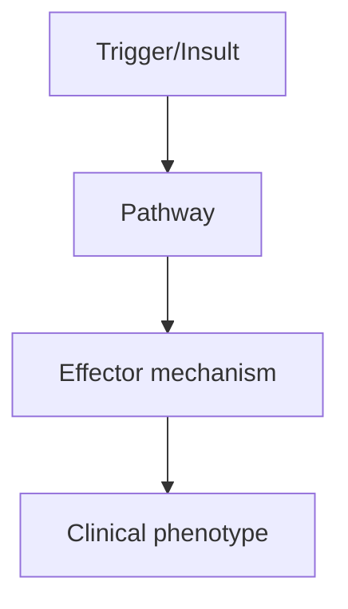
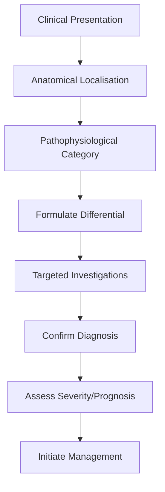
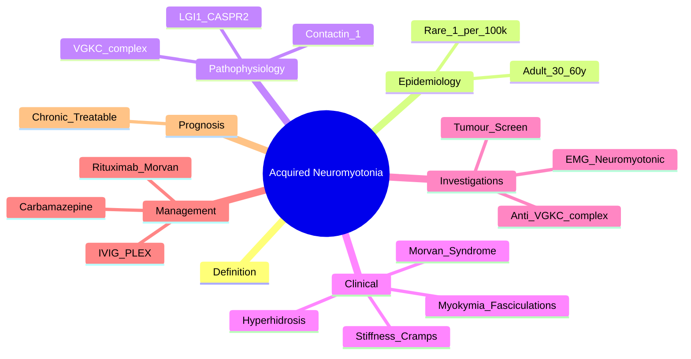

# Acquired Neuromyotonia

> [!tip] **High-Yield Definition**
> Acquired neuromyotonia: immune-mediated peripheral nerve hyperexcitability, distinct from genetic (Isaacs syndrome). Anti-VGKC complex antibodies (LGI1, CASPR2, contactin-associated protein-like 2). Can be paraneoplastic (thymoma, SCLC, Hodgkin) or autoimmune.

---

## 1. Definition / Epidemiology / Classification

### Definition
Acquired neuromyotonia: immune-mediated peripheral nerve hyperexcitability, distinct from genetic (Isaacs syndrome). Anti-VGKC complex antibodies (LGI1, CASPR2, contactin-associated protein-like 2). Can be paraneoplastic (thymoma, SCLC, Hodgkin) or autoimmune.

### Epidemiology
Rare. 1/100,000. Adult onset (30-60y). Autoimmune (60%), paraneoplastic (20%), idiopathic (20%).

### Classification
| Variant | Key Features | Prognosis |
|---------|-------------|-----------|
| | | |

---

## 2. Aetiology / Pathophysiology

### Aetiology
Autoimmune: anti-VGKC complex antibodies (LGI1, CASPR2, contactin-1, TAG-1). Paraneoplastic: thymoma (often with MG, 20%), SCLC (10%), Hodgkin lymphoma (rare), other. Genetic: KCNA1 (familial episodic ataxia with neuromyotonia), others. Other: peripheral neuropathy, CIDP, radiculopathy. Triggers: penicillamine (gold-related neuromyotonia), immune checkpoint inhibitors. Molecular: VGKC (Kv1.1, Kv1.2) at juxtaparanode - reduced K+ current, hyperexcitability.

### Pathophysiology

---

## 3. Clinical Features

### History
- **Onset/Duration:**
- **Progression:**
- **Key symptoms:**
- **Triggers:**
- **Systemic symptoms:**
- **Drug/Family/Social history:**

### Examination
| Domain | Key Findings | Localisation Value |
|--------|-------------|-------------------|
| | | |

### Specific Clinical Features
Similar to genetic neuromyotonia. Stiffness, fasciculations, cramps, myokymia, pseudomyotonia. Visible fasciculations (continuous). Hyperhidrosis. Pain (common). Muscle hypertrophy. NO weakness (or mild). Reflexes: normal or reduced. Cranial: rare, mild. Sensation: usually preserved. Morvan syndrome (anti-CASPR2): neuromyotonia + insomnia + encephalopathy (confusion, hallucinations, seizures) + autonomic (hyperhidrosis, hypotension, GI). Limbic encephalitis (anti-LGI1, anti-CASPR2): confusion, seizures, amnesia, hyponatraemia (LGI1).

---

## 4. Diagnostic Approach / Algorithm

---

## 5. Investigations

NCS/EMG: neuromyotonic discharges (high-frequency doublets/triplets/multiplets, 150-300Hz, waxing/waning), fibrillation potentials, fasciculations, myokymic discharges. Anti-VGKC complex: LGI1, CASPR2, contactin-1 (positive in 30-50%). Other autoantibodies: AChR (if MG overlap), anti-Hu, anti-CRMP5. MRI brain: limbic if encephalitis (medial temporal, FLAIR hyperintensity). Tumour screen: CT chest/abdomen/pelvis, PET-CT, mammogram, testicular ultrasound (thymoma, SCLC, lymphoma, teratoma). EEG: if seizures. CSF: OCBs (CNS involvement). Bloods: FBC, U&Es, LFTs, autoimmune, cryoglobulins, SPEP. Genetic: KCNA1 (if family history).

---

## 6. Differential Diagnosis

| Differential | Distinguishing Features | Key Test |
|--------------|------------------------|----------|
| | | |

---

## 7. Management

Symptomatic: carbamazepine 200-1200mg/day (first-line, most effective), phenytoin, lacosamide, gabapentin, lamotrigine, topiramate. Immunomodulation: IVIG 2g/kg over 2-5 days, plasma exchange (5 exchanges, severe), corticosteroids, azathioprine, MMF, methotrexate, rituximab (refractory, Morvan). Treat underlying: thymoma (thymectomy), SCLC (chemo, RT), lymphoma (chemo). Multidisciplinary: neurology, oncology (paraneoplastic), immunology, palliative, sleep (Morvan), OT, PT, social, psychology, chaplaincy. Monitor: clinical, antibody titres, tumour screen (annual for 2-5 years).

---

## 8. Drug Interactions / Contraindications / Comorbidity Cautions

| Drug | Interaction / Caution | Management |
|------|----------------------|------------|
| | | |

---

## 9. Procedures (if applicable)

### Procedure:
- **Indications:**
- **Contraindications:**
- **Preparation / Principle:**
- **Complications:**
- **Viva Pearls:**

---

## 10. Complications

| Complication | Frequency | Prevention / Monitoring | Management |
|--------------|-----------|------------------------|------------|
| | | | |

---

## 11. Red Flags / Emergencies

Morvan syndrome (CNS - seizures, confusion, autonomic), respiratory failure (rare), thymoma (MG overlap), SCLC (paraneoplastic), treatment side effects (carbamazepine: SIADH, hyponatraemia, agranulocytosis, SJS).

---

## 12. Prognosis

Variable. Idiopathic: chronic, often stable with treatment. Paraneoplastic: depends on tumour. Morvan: severe, may be fatal, immunotherapy responsive. Carbamazepine: effective in most. Rituximab: effective in refractory. Recovery: months-years, may be incomplete. Long-term: chronic, treatment-responsive. Multidisciplinary care essential.

---

## 13. Topic Correlation

| Related Topic | Link | Key Overlap |
|---------------|------|-------------|
| | | |

---

## 14. Special Situations

| Situation | Consideration |
|-----------|---------------|
| **Pregnancy** | |
| **Lactation** | |
| **Paediatric** | |
| **Elderly / Frail** | |
| **Renal impairment** | |
| **Hepatic impairment** | |
| **Immunocompromised** | |
| **Perioperative** | |
| **Driving / DVLA** | |
| **Occupational** | |

---

## FCPS/MRCP High-Yield Summary

| Category | Key Points |
|----------|------------|
| **Definition** | Acquired neuromyotonia: immune-mediated peripheral nerve hyperexcitability, distinct from genetic (Isaacs syndrome). Anti-VGKC complex antibodies (LGI1, CASPR2, contactin-associated protein-like 2). C |
| **Epidemiology** | Rare. 1/100,000. Adult onset (30-60y). Autoimmune (60%), paraneoplastic (20%), idiopathic (20%). |
| **Pathophysiology** | |
| **Clinical** | Similar to genetic neuromyotonia. Stiffness, fasciculations, cramps, myokymia, pseudomyotonia. Visible fasciculations (continuous). Hyperhidrosis. Pain (common). Muscle hypertrophy. NO weakness (or mi |
| **Diagnosis** | |
| **Investigations** | NCS/EMG: neuromyotonic discharges (high-frequency doublets/triplets/multiplets, 150-300Hz, waxing/waning), fibrillation potentials, fasciculations, myokymic discharges. Anti-VGKC complex: LGI1, CASPR2 |
| **Management** | Symptomatic: carbamazepine 200-1200mg/day (first-line, most effective), phenytoin, lacosamide, gabapentin, lamotrigine, topiramate. Immunomodulation: IVIG 2g/kg over 2-5 days, plasma exchange (5 excha |
| **Complications** | |
| **Prognosis** | Variable. Idiopathic: chronic, often stable with treatment. Paraneoplastic: depends on tumour. Morvan: severe, may be fatal, immunotherapy responsive. Carbamazepine: effective in most. Rituximab: effe |
| **Viva Pearls** | |
| **Drug Doses** | |
| **Scoring Systems** | |
| **Genetics** | |
| **Imaging Signs** | |

---

## Viva Questions (PACES/FCPS Style)

1. **Q:** Define Acquired Neuromyotonia and classify its variants.
   **A:** Based on the definition above.

2. **Q:** What are the key clinical features?
   **A:** Similar to genetic neuromyotonia. Stiffness, fasciculations, cramps, myokymia, pseudomyotonia. Visible fasciculations (continuous). Hyperhidrosis. Pain (common). Muscle hypertrophy. NO weakness (or mild). Reflexes: normal or reduced. Cranial: rare, mild. Sensation: usually preserved. Morvan syndrome

3. **Q:** What is the first-line treatment?
   **A:** Based on the management section.

4. **Q:** What are the red flags requiring urgent referral?
   **A:** Morvan syndrome (CNS - seizures, confusion, autonomic), respiratory failure (rare), thymoma (MG overlap), SCLC (paraneoplastic), treatment side effects (carbamazepine: SIADH, hyponatraemia, agranulocytosis, SJS).

5. **Q:** What is the prognosis?
   **A:** Variable. Idiopathic: chronic, often stable with treatment. Paraneoplastic: depends on tumour. Morvan: severe, may be fatal, immunotherapy responsive. Carbamazepine: effective in most. Rituximab: effective in refractory. Recovery: months-years, may be incomplete. Long-term: chronic, treatment-respon

6. **Q:** How do you differentiate Acquired Neuromyotonia from key differentials?
   **A:** Clinical features, investigations, and response to treatment.

7. **Q:** What investigations are most useful?
   **A:** Based on the investigations section.

8. **Q:** Describe the stepwise management approach.
   **A:** Based on the management algorithm.

9. **Q:** What are the emergency presentations?
   **A:** Based on the red flags section.

10. **Q:** How does management change in pregnancy/paediatrics/elderly?
    **A:** Special considerations per population.

---

## Common Confusions / Exam Traps

| Confusion | Clarification |
|-----------|---------------|
| | |

---

## Mnemonics
1. **CASPR2** = **C**ontactin-**A**ssociated **P**rotein-like **R**eceptor **2** (use: most common antibody in acquired neuromyotonia, Morvan syndrome)
2. **LGI1** = **L**eucine-rich **G**lioma-**I**nactivated **1** (use: limbic encephalitis, faciobrachial dystonic seizures, hyponatraemia)
3. **VGKC** = **V**oltage-**G**ated **P**otassium **C**hannel complex (use: target of LGI1/CASPR2 antibodies, juxtaparanode)
4. **MORVAN** = **M**yokymia + **O**rganic psycho**R**eflex epi**V**entricular **A**rrhythmia + **N**europathy (use: neuromyotonia + insomnia + encephalopathy + autonomic)

---

## Mind Map

---

## Spaced Repetition Trackers

| Review Interval | Date | Score (0-5) | Notes |
|-----------------|------|-------------|-------|
| Day 1 | | | |
| Day 3 | | | |
| Day 7 | | | |
| Day 14 | | | |
| Day 30 | | | |
| Day 90 | | | |

---

## Self-Test Scorecard

| Section | Score /5 | Last Attempt |
|---------|----------|--------------|
| Definition & Epidemiology | | | |
| Pathophysiology | | | |
| Clinical Features | | | |
| Investigations | | | |
| Differential | | | |
| Management - Acute | | | |
| Management - Long-term | | | |
| Complications | | | |
| Viva Questions | | | |
| MCQs | | | |
| SBAs | | | |

---

## MCQs (10)

1. **Question:** Acquired neuromyotonia (Isaacs syndrome) is caused by antibodies against which channel complex?
   **Options:** A. Voltage-gated calcium channels B. Voltage-gated potassium channel complex (LGI1, CASPR2) C. Acetylcholine receptors D. Ryanodine receptor
   **Answer:** B
   **Explanation:** Antibodies target the VGKC complex, principally LGI1 and CASPR2, reducing K+ current and causing peripheral nerve hyperexcitability.
2. **Question:** The EMG hallmark of neuromyotonia is:
   **Options:** A. Decrement on 3 Hz repetitive nerve stimulation B. Doublet/triplet/multiplet high-frequency (150–300 Hz) neuromyotonic discharges C. Myotonic discharges only D. Fibrillation potentials alone
   **Answer:** B
   **Explanation:** High-frequency (150–300 Hz) doublets/triplets/multiplets that wax and wane are characteristic; decrement is seen in MG, not ANM.
3. **Question:** First-line symptomatic drug for acquired neuromyotonia is:
   **Options:** A. Pyridostigmine B. Carbamazepine C. Prednisolone D. 3,4-diaminopyridine
   **Answer:** B
   **Explanation:** Carbamazepine (200–1200 mg/day) is the most consistently effective membrane-stabilising agent; alternatives include phenytoin, lacosamide, lamotrigine.
4. **Question:** Morvan syndrome is characterised by:
   **Options:** A. MG + thymoma B. Neuromyotonia + insomnia + encephalopathy + autonomic dysfunction (anti-CASPR2) C. MG + hyperthyroidism D. Botulism + ophthalmoplegia
   **Answer:** B
   **Explanation:** Morvan syndrome combines peripheral nerve hyperexcitability with CNS features (agrypnia excitata, hallucinations, seizures) and dysautonomia; strongly associated with anti-CASPR2 and underlying thymoma.
5. **Question:** Anti-LGI1 antibodies classically cause:
   **Options:** A. LEMS B. Limbic encephalitis with faciobrachial dystonic seizures and hyponatraemia C. Botulism D. Stiff-person syndrome
   **Answer:** B
   **Explanation:** Anti-LGI1 causes limbic encephalitis, FBDS (often precede encephalitis), and SIADH-related hyponatraemia.
6. **Question:** Which tumour is most commonly associated with paraneoplastic acquired neuromyotonia?
   **Options:** A. Thymoma B. Small cell lung cancer C. Breast carcinoma D. Renal cell carcinoma
   **Answer:** A
   **Explanation:** Thymoma is the most frequent paraneoplastic association (often with concurrent MG); SCLC and Hodgkin lymphoma are less common.
7. **Question:** Reflexes in acquired neuromyotonia are typically:
   **Options:** A. Absent B. Normal or reduced C. Markedly brisk with clonus D. Pendular
   **Answer:** B
   **Explanation:** Reflexes are usually preserved or reduced (peripheral hyperexcitability, not central); contrast with brisk reflexes in LEMS after exercise.
8. **Question:** Which of the following is the most appropriate immunotherapy for refractory Morvan syndrome?
   **Options:** A. Methotrexate B. Rituximab C. Azathioprine monotherapy D. Cyclophosphamide only
   **Answer:** B
   **Explanation:** Rituximab (anti-CD20) is the preferred second-line agent for CASPR2 antibody disease and refractory Morvan syndrome.
9. **Question:** Carbamazepine in neuromyotonia works by:
   **Options:** A. Increasing ACh release B. Blocking voltage-gated sodium channels, reducing peripheral nerve firing C. Inhibiting complement D. Blocking potassium channels
   **Answer:** B
   **Explanation:** Carbamazepine stabilises hyperexcitable peripheral nerve membranes by blocking voltage-gated Na+ channels.
10. **Question:** A patient with neuromyotonia and thymoma on CT should:
    **Options:** A. Be observed B. Undergo thymectomy and immunomodulation C. Receive chemotherapy only D. Have no further workup
    **Answer:** B
    **Explanation:** All thymomas warrant surgical resection; immunotherapy is usually needed for paraneoplastic ANM.

---

## SBA Questions (10)

1. **Scenario:** 45-year-old man with months of muscle stiffness, visible rippling fasciculations, calf hypertrophy, hyperhidrosis, and insomnia.
   **Question:** Most likely antibody?
   **Options:** A. Anti-AChR B. Anti-MuSK C. Anti-CASPR2 D. Anti-VGCC
   **Answer:** C
   **Explanation:** Anti-CASPR2 produces the full neuromyotonia ± Morvan phenotype with autonomic and sleep features.
2. **Scenario:** Patient with acquired neuromyotonia has VGKC-complex antibody positive at 400 pM (high).
   **Question:** Next investigation of choice?
   **Options:** A. Skeletal survey B. CT chest/abdomen/pelvis ± PET for occult malignancy C. Colonoscopy only D. No screening needed
   **Answer:** B
   **Explanation:** High-titre VGKC-complex antibodies warrant whole-body tumour screen (thymoma, SCLC, lymphoma).
3. **Scenario:** Patient with Morvan syndrome worsens on carbamazepine and IVIG.
   **Question:** Best next-line therapy?
   **Options:** A. Increase carbamazepine B. Rituximab ± plasma exchange C. Pyridostigmine D. 3,4-DAP
   **Answer:** B
   **Explanation:** Refractory CASPR2 / Morvan responds to B-cell depletion (rituximab) ± plasma exchange.
4. **Scenario:** EMG shows doublets/triplets at 200 Hz, waning amplitude, firing spontaneously.
   **Question:** Diagnosis?
   **Options:** A. Myotonia congenita B. Neuromyotonia (Isaacs) C. Myasthenia gravis D. Polymyositis
   **Answer:** B
   **Explanation:** High-frequency spontaneous multiplets are pathognomonic of neuromyotonia.
5. **Scenario:** A patient with neuromyotonia develops seizures, confusion, hyponatraemia (Na 124).
   **Question:** Likely cause?
   **Options:** A. SIADH from carbamazepine alone B. Anti-LGI1 limbic encephalitis C. Stroke D. Hypoglycaemia
   **Answer:** B
   **Explanation:** Hyponatraemia + seizures + encephalitis in this context points to anti-LGI1 encephalitis (FBDS often preceding).
6. **Scenario:** Patient with neuromyotonia is found to have an anterior mediastinal mass on CT.
   **Question:** Best next step?
   **Options:** A. Repeat CT in 1 year B. Surgical referral for thymectomy C. Empirical pyridostigmine D. No action
   **Answer:** B
   **Explanation:** All thymomas require resection; check for coexisting MG with AChR antibodies.
7. **Scenario:** Patient with ANM is started on carbamazepine; one week later develops rash, fever, and eosinophilia.
   **Question:** Most likely diagnosis?
   **Options:** A. Viral exanthem B. DRESS syndrome / carbamazepine hypersensitivity C. MG exacerbation D. Sepsis
   **Answer:** B
   **Explanation:** Carbamazepine causes DRESS (Drug Reaction with Eosinophilia and Systemic Symptoms) and SJS/TEN; stop the drug and avoid phenytoin/oxcarbazepine cross-reactivity.
8. **Scenario:** Patient with refractory CASPR2 disease is started on rituximab; when should response be assessed?
   **Question:** Best monitoring point?
   **Options:** A. 1 week B. 2–3 months after first dose C. 1 year D. Immediately
   **Answer:** B
   **Explanation:** Clinical response to rituximab in NMJ antibody disease is usually evident 2–3 months after B-cell depletion.
9. **Scenario:** Patient with ANM and insomnia is unable to sleep for days with vivid hallucinations and autonomic instability.
   **Question:** Sleep phenomenon called?
   **Options:** A. Sleep apnoea B. Agrypnia excitata C. Narcolepsy D. Restless leg syndrome
   **Answer:** B
   **Explanation:** Agrypnia excitata (loss of sleep with persistent motor/cognitive activation) is a feature of Morvan syndrome.
10. **Scenario:** Patient with ANM, on carbamazepine, develops confusion and Na 122.
    **Question:** Most likely cause?
    **Options:** A. SIADH from carbamazepine B. Anti-LGI1 encephalitis C. Adrenal insufficiency D. Diuretic excess
    **Answer:** A
    **Explanation:** Carbamazepine is a recognised cause of SIADH; weigh against LGI1 encephalitis clinically.

---

## Tags
**Tags:** #neurology #NMJ #peripheral_nerve_hyperexcitability #Isaacs #CASPR2 #LGI1 #VGKC #FCPS #MRCP

---

## Local Navigation
**Heading Hub:** [[../Hub]]  
**Chapter Hierarchy:** [[Davidson Chapter 25 - Neurology Hierarchy]]  
**Chapter MOC:** [[Neurology MOC]]  
**Drug Reference:** [[../00_Index/Neurology Drug Reference]]  
