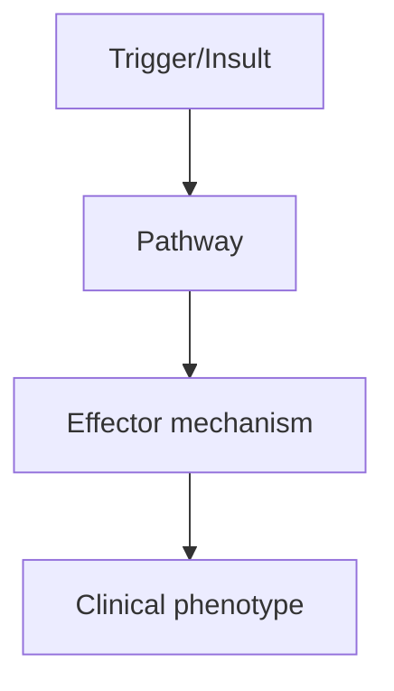
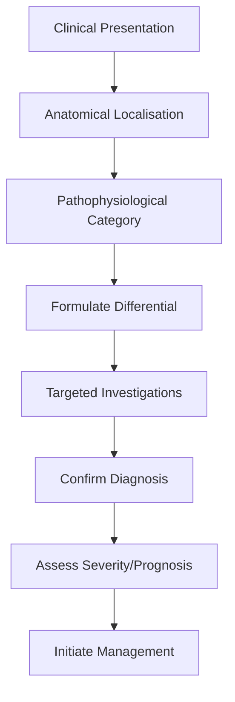
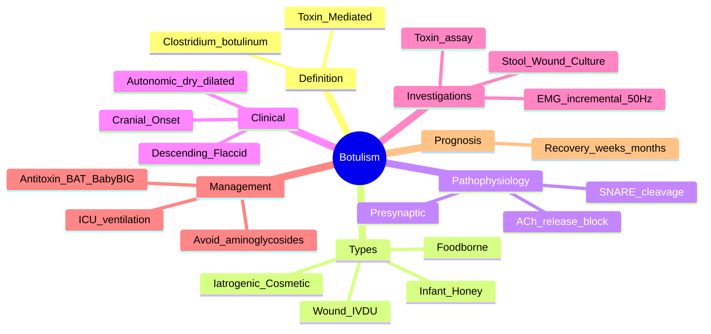

# Botulism

> [!tip] **High-Yield Definition**
> Botulism: rare, life-threatening paralytic illness caused by botulinum toxin (Clostridium botulinum). Blocks ACh release at NMJ. Forms: foodborne (home-canned, preserved), wound (drug users, traumatic), infant (honey, environmental), iatrogenic (cosmetic, therapeutic overdose), inhalational (bioterrorism).

---

## 1. Definition / Epidemiology / Classification

### Definition
Botulism: rare, life-threatening paralytic illness caused by botulinum toxin (Clostridium botulinum). Blocks ACh release at NMJ. Forms: foodborne (home-canned, preserved), wound (drug users, traumatic), infant (honey, environmental), iatrogenic (cosmetic, therapeutic overdose), inhalational (bioterrorism).

### Epidemiology
Incidence: 0.01-0.1/100,000/year. ~200 cases/year in UK. Foodborne: most common (US, home-canned vegetables, fish, meat). Infant: 70-100 cases/year in US. Wound: drug users, traumatic. Iatrogenic: rare, overdose. Mortality: 5-10% with treatment, 50% without.

### Classification
| Variant | Key Features | Prognosis |
|---------|-------------|-----------|
| | | |

---

## 2. Aetiology / Pathophysiology

### Aetiology
Clostridium botulinum: gram-positive, anaerobic, spore-forming. 7 toxin types: A (most common, foodborne), B (infant, foodborne), E (fish, foodborne), F (rare), C, D, G. Toxin: zinc metalloprotease, cleaves SNARE proteins (SNAP-25, synaptobrevin, syntaxin), blocks ACh release at NMJ. Infant: ingested spores germinate, produce toxin in gut (honey, environmental). Wound: anaerobic infection produces toxin. Foodborne: preformed toxin in food. Iatrogenic: overdose (cosmetic, therapeutic - cervical dystonia, spasticity, migraine).

### Pathophysiology

---

## 3. Clinical Features

### History
- **Onset/Duration:**
- **Progression:**
- **Key symptoms:**
- **Triggers:**
- **Systemic symptoms:**
- **Drug/Family/Social history:**

### Examination
| Domain | Key Findings | Localisation Value |
|--------|-------------|-------------------|
| | | |

### Specific Clinical Features
Foodborne (12-36h onset): descending paralysis (cranial first - diplopia, ptosis, dysarthria, dysphagia), then limbs (proximal, symmetric), respiratory failure. Autonomic: dilated pupils, dry mouth, ileus, urinary retention, postural hypotension. Sensation preserved. NO fever (unless wound). Wound (7-14d): similar, slower onset. Infant: constipation (first), poor feeding, weak cry, hypotonia, descending weakness (floppy baby), respiratory failure. Iatrogenic: local or systemic effects. Bioterrorism: inhalational, descending paralysis.

---

## 4. Diagnostic Approach / Algorithm

---

## 5. Investigations

Clinical: descending paralysis, autonomic features, normal sensation. Exclude: GBS (ascending, sensory, no autonomic), myasthenia (fatigable, no autonomic), stroke, tick paralysis. EMG: normal sensory, low CMAP, normal NCV, incremental response to high-frequency repetitive stimulation (20-50Hz, facilitation). Edrophonium test: may improve (differentiate from MG). LP: normal (albuminocytological dissociation in GBS). Stool: C. botulinum, toxin (foodborne, infant). Wound culture: C. botulinum. Serum toxin: mouse bioassay (gold standard, slow). Food: toxin detection. Infant: stool culture, toxin (most sensitive). MRI brain: exclude brainstem stroke. Bloods: FBC, U&Es, LFTs, glucose, ABG, CK. FVC, NIF: monitor respiratory.

---

## 6. Differential Diagnosis

| Differential | Distinguishing Features | Key Test |
|--------------|------------------------|----------|
| | | |

---

## 7. Management

EMERGENCY: ICU admission, monitor (FVC, NIF, cardiac, autonomic). Botulinum antitoxin (heptavalent BAT for A-G, or trivalent ABE): give early (within 24-48h, even before lab confirmation if suspected), blocks circulating toxin. NOT effective on toxin already bound to NMJ. For infant: human-derived botulism immune globulin (BabyBIG). Wound: surgical debridement + antibiotics (penicillin, metronidazole). Foodborne: gastric lavage, enema (if recent ingestion). Supportive: intubation + ventilation (often prolonged, weeks-months), NG/PEG feeding, urinary catheter, bowel care, DVT prophylaxis, pressure care, psychological support. Recovery: regeneration of NMJ (weeks-months, gradual), full recovery usual. Multidisciplinary: ICU, neurology, infectious diseases, microbiologist, paediatrician, OT, PT, SLT, dietitian, social. Public health notification.

---

## 8. Drug Interactions / Contraindications / Comorbidity Cautions

| Drug | Interaction / Caution | Management |
|------|----------------------|------------|
| | | |

---

## 9. Procedures (if applicable)

### Procedure:
- **Indications:**
- **Contraindications:**
- **Preparation / Principle:**
- **Complications:**
- **Viva Pearls:**

---

## 10. Complications

| Complication | Frequency | Prevention / Monitoring | Management |
|--------------|-----------|------------------------|------------|
| | | | |

---

## 11. Red Flags / Emergencies

Respiratory failure (FVC <20, NIF <30, bulbar), autonomic instability (arrhythmias, ileus, urinary retention), aspiration, infection, prolonged ventilation, decannulation, relapse, hospital-acquired infections.

---

## 12. Prognosis

Mortality 5-10% with treatment (was 50% before). Recovery: weeks-months (often prolonged ventilation). Full recovery usual. Infant: excellent with BabyBIG. Wound: good with debridement + antibiotics. Foodborne: depends on antitoxin timing, supportive care. Long-term: full recovery, may have fatigue, autonomic dysfunction.

---

## 13. Topic Correlation

| Related Topic | Link | Key Overlap |
|---------------|------|-------------|
| | | |

---

## 14. Special Situations

| Situation | Consideration |
|-----------|---------------|
| **Pregnancy** | |
| **Lactation** | |
| **Paediatric** | |
| **Elderly / Frail** | |
| **Renal impairment** | |
| **Hepatic impairment** | |
| **Immunocompromised** | |
| **Perioperative** | |
| **Driving / DVLA** | |
| **Occupational** | |

---

## FCPS/MRCP High-Yield Summary

| Category | Key Points |
|----------|------------|
| **Definition** | Botulism: rare, life-threatening paralytic illness caused by botulinum toxin (Clostridium botulinum). Blocks ACh release at NMJ. Forms: foodborne (home-canned, preserved), wound (drug users, traumatic |
| **Epidemiology** | Incidence: 0.01-0.1/100,000/year. ~200 cases/year in UK. Foodborne: most common (US, home-canned vegetables, fish, meat). Infant: 70-100 cases/year in |
| **Pathophysiology** | |
| **Clinical** | Foodborne (12-36h onset): descending paralysis (cranial first - diplopia, ptosis, dysarthria, dysphagia), then limbs (proximal, symmetric), respiratory failure. Autonomic: dilated pupils, dry mouth, i |
| **Diagnosis** | |
| **Investigations** | Clinical: descending paralysis, autonomic features, normal sensation. Exclude: GBS (ascending, sensory, no autonomic), myasthenia (fatigable, no autonomic), stroke, tick paralysis. EMG: normal sensory |
| **Management** | EMERGENCY: ICU admission, monitor (FVC, NIF, cardiac, autonomic). Botulinum antitoxin (heptavalent BAT for A-G, or trivalent ABE): give early (within 24-48h, even before lab confirmation if suspected) |
| **Complications** | |
| **Prognosis** | Mortality 5-10% with treatment (was 50% before). Recovery: weeks-months (often prolonged ventilation). Full recovery usual. Infant: excellent with BabyBIG. Wound: good with debridement + antibiotics.  |
| **Viva Pearls** | |
| **Drug Doses** | |
| **Scoring Systems** | |
| **Genetics** | |
| **Imaging Signs** | |

---

## Viva Questions (PACES/FCPS Style)

1. **Q:** Define Botulism and classify its variants.
   **A:** Based on the definition above.

2. **Q:** What are the key clinical features?
   **A:** Foodborne (12-36h onset): descending paralysis (cranial first - diplopia, ptosis, dysarthria, dysphagia), then limbs (proximal, symmetric), respiratory failure. Autonomic: dilated pupils, dry mouth, ileus, urinary retention, postural hypotension. Sensation preserved. NO fever (unless wound). Wound (

3. **Q:** What is the first-line treatment?
   **A:** Based on the management section.

4. **Q:** What are the red flags requiring urgent referral?
   **A:** Respiratory failure (FVC <20, NIF <30, bulbar), autonomic instability (arrhythmias, ileus, urinary retention), aspiration, infection, prolonged ventilation, decannulation, relapse, hospital-acquired infections.

5. **Q:** What is the prognosis?
   **A:** Mortality 5-10% with treatment (was 50% before). Recovery: weeks-months (often prolonged ventilation). Full recovery usual. Infant: excellent with BabyBIG. Wound: good with debridement + antibiotics. Foodborne: depends on antitoxin timing, supportive care. Long-term: full recovery, may have fatigue,

6. **Q:** How do you differentiate Botulism from key differentials?
   **A:** Clinical features, investigations, and response to treatment.

7. **Q:** What investigations are most useful?
   **A:** Based on the investigations section.

8. **Q:** Describe the stepwise management approach.
   **A:** Based on the management algorithm.

9. **Q:** What are the emergency presentations?
   **A:** Based on the red flags section.

10. **Q:** How does management change in pregnancy/paediatrics/elderly?
    **A:** Special considerations per population.

---

## Common Confusions / Exam Traps

| Confusion | Clarification |
|-----------|---------------|
| | |

---

## Mnemonics
1. **DESCB** = **D**escending **E**ye **S**ymptoms, **C**ranial **B**ulbar then limbs (use: classic descending flaccid paralysis with cranial onset)
2. **HONEY** = **H**armful **ON** garum for **E**ating bab**Y** (use: avoid honey in <12 months – infant botulism)
3. **ANTITOXIN** = **A**ntitoxin (heptavalent BAT / BabyBIG) **N**eutralises **T**oxin in **I**ntestine & **O**utside nerve (**XI**N = stopping spread)
4. **4 Ds of foodborne botulism**: **D**iplopia, **D**ysarthria, **D**ysphagia, **D**ry mouth

---

## Mind Map

---

## Spaced Repetition Trackers

| Review Interval | Date | Score (0-5) | Notes |
|-----------------|------|-------------|-------|
| Day 1 | | | |
| Day 3 | | | |
| Day 7 | | | |
| Day 14 | | | |
| Day 30 | | | |
| Day 90 | | | |

---

## Self-Test Scorecard

| Section | Score /5 | Last Attempt |
|---------|----------|--------------|
| Definition & Epidemiology | | | |
| Pathophysiology | | | |
| Clinical Features | | | |
| Investigations | | | |
| Differential | | | |
| Management - Acute | | | |
| Management - Long-term | | | |
| Complications | | | |
| Viva Questions | | | |
| MCQs | | | |
| SBAs | | | |

---

## MCQs (10)

1. **Question:** Botulinum toxin causes paralysis by:
   **Options:** A. Blocking postsynaptic ACh receptors B. Cleaving SNARE proteins and blocking ACh release presynaptically C. Inhibiting acetylcholinesterase D. Activating complement at the NMJ
   **Answer:** B
   **Explanation:** Light chain of botulinum toxin is a Zn2+-dependent protease that cleaves SNARE proteins (SNAP-25, synaptobrevin, syntaxin), preventing ACh vesicle fusion.
2. **Question:** Classic botulism paralysis pattern is:
   **Options:** A. Ascending (like GBS) B. Descending, starting with cranial nerves C. Purely proximal D. Spastic
   **Answer:** B
   **Explanation:** Botulism is a DESCENDING flaccid paralysis with early cranial involvement (diplopia, dysphagia, dysarthria).
3. **Question:** Infant botulism is most commonly associated with:
   **Options:** A. Home-canned vegetables B. Honey C. Unpasteurised milk D. Undercooked poultry
   **Answer:** B
   **Explanation:** Honey can contain C. botulinum spores; do not give to infants <12 months.
4. **Question:** Wound botulism is increasingly seen in:
   **Options:** A. Postoperative patients B. People who inject drugs (subcutaneous/"skin popping") C. Burn victims D. Diabetics
   **Answer:** B
   **Explanation:** Subcutaneous or IM injection of black-tar heroin creates an anaerobic nidus for C. botulinum spore germination.
5. **Question:** Autonomic features of botulism include:
   **Options:** A. Hypertension, bradycardia, miosis B. Dilated pupils, dry mouth, ileus, urinary retention C. Hyperhidrosis D. None
   **Answer:** B
   **Explanation:** Anticholinergic autonomic profile: dilated unreactive pupils, xerostomia, ileus, urinary retention, postural hypotension.
6. **Question:** EMG in botulism characteristically shows:
   **Options:** A. Decrement at 3 Hz RNS B. Increment (>100%) at 20–50 Hz RNS and small CMAPs C. Myotonic discharges D. Fibrillation only
   **Answer:** B
   **Explanation:** Small CMAPs with INCREMENTAL response (>100%, often >400%) at high-frequency (20–50 Hz) RNS, similar to LEMS.
7. **Question:** First-line specific treatment for foodborne botulism in adults is:
   **Options:** A. IVIG B. Heptavalent botulism antitoxin (BAT) C. Edrophonium D. Plasmapheresis
   **Answer:** B
   **Explanation:** Heptavalent BAT (against types A–G) should be given as soon as possible; do not wait for lab confirmation.
8. **Question:** For infant botulism, the specific treatment is:
   **Options:** A. BAT B. Human-derived botulism immune globulin (BabyBIG / BIG-IV) C. Antibiotics D. Steroids
   **Answer:** B
   **Explanation:** BabyBIG (BIG-IV) is human-derived immune globulin given within days of symptom onset; antibiotics are NOT given (theorised toxin release).
9. **Question:** Which antibiotic class is classically AVOIDED in botulism because it may worsen blockade?
   **Options:** A. Penicillins B. Aminoglycosides (e.g. gentamicin) C. Macrolides D. Cephalosporins
   **Answer:** B
   **Explanation:** Aminoglycosides potentiate NMJ blockade and may worsen paralysis in botulism and MG.
10. **Question:** A negative wound or stool culture excludes botulism.
    **Options:** True B. False
    **Answer:** B
    **Explanation:** Culture/ toxin assay is positive in only a minority; diagnosis is primarily clinical plus supportive EMG.

---

## SBA Questions (10)

1. **Scenario:** A 6-month-old infant presents with constipation, weak cry, poor feeding, and descending flaccid paralysis.
   **Question:** Most likely diagnosis?
   **Options:** A. Spinal muscular atrophy B. Infant botulism C. GBS D. Myasthenia gravis
   **Answer:** B
   **Explanation:** Constipation followed by descending paralysis in a "floppy baby" is classic infant botulism, often from honey or environmental spores.
2. **Scenario:** Adult develops diplopia, dysphagia, dry mouth, dilated pupils after home-canned vegetables.
   **Question:** Best initial step?
   **Options:** A. Edrophonium test B. Administer heptavalent botulism antitoxin (BAT) urgently C. IVIG D. MRI brain
   **Answer:** B
   **Explanation:** BAT should be given ASAP on clinical suspicion; do not wait for confirmatory tests.
3. **Scenario:** IVDU patient with a skin abscess and progressive descending paralysis.
   **Question:** Likely mechanism and treatment?
   **Options:** A. Wound botulism; debride + BAT B. GBS; IVIG C. MG; pyridostigmine D. Stroke; thrombolysis
   **Answer:** A
   **Explanation:** Wound botulism in IVDU: surgical debridement plus BAT.
4. **Scenario:** Patient with foodborne botulism and progressive weakness; FVC is now 1.0 L (was 2.0).
   **Question:** Best management?
   **Options:** A. Observe B. Elective intubation and ICU admission C. Antitoxin only D. Antibiotics
   **Answer:** B
   **Explanation:** A falling FVC is an indication for elective intubation; elective intubation is safer than emergency.
5. **Scenario:** Infant with confirmed botulism. Prescribed amoxicillin for possible pneumonia.
   **Question:** Should you stop?
   **Options:** A. Yes, antibiotics can worsen paralysis in infant botulism B. No, antibiotics are standard C. Switch to gentamicin D. Add metronidazole
   **Answer:** A
   **Explanation:** Antibiotics are usually avoided in infant botulism (theoretical risk of lysing gut C. botulinum and releasing more toxin).
6. **Scenario:** Botulism patient in ICU: severe ileus, dry mouth, dilated pupils, BP 80/50.
   **Question:** Most appropriate management of autonomic features?
   **Options:** A. Atropine B. Supportive – IV fluids ± vasopressors, avoid unnecessary drugs C. Pyridostigmine D. Neostigmine
   **Answer:** B
   **Explanation:** Autonomic dysfunction is supportive; cholinesterase inhibitors are not effective. Atropine for severe bradycardia only.
7. **Scenario:** EMG in suspected botulism: small CMAPs with 250% increment at 50 Hz.
   **Question:** Most consistent with?
   **Options:** A. Myasthenia gravis B. Botulism (or LEMS) C. Polymyositis D. Myotonia
   **Answer:** B
   **Explanation:** Presynaptic NMJ disorders (botulism, LEMS) show incremental response with high-frequency RNS.
8. **Scenario:** Patient with foodborne botulism is improving on day 14. How long may full recovery take?
   **Question:** Best counselling?
   **Options:** A. A few days B. Weeks to months; may need prolonged ventilation C. Permanent weakness D. 1–2 weeks only
   **Answer:** B
   **Explanation:** Recovery requires regeneration of presynaptic terminals – typically weeks to months; full recovery is the norm.
9. **Scenario:** Public health: 5 people who shared home-preserved fish develop descending paralysis. Notify?
   **Options:** A. Treat only; no notification B. Notify public health authorities for outbreak investigation C. Notify media directly D. No action
   **Answer:** B
   **Explanation:** Suspected foodborne botulism is a notifiable public health emergency; samples of food should be retained.
10. **Scenario:** Botulinum toxin A (Botox) cosmetic injection causes dysphagia and ptosis.
    **Question:** Diagnosis?
    **Options:** A. Anaphylaxis B. Iatrogenic botulism C. MG crisis D. Stroke
    **Answer:** B
    **Explanation:** Iatrogenic botulism from over-spread of toxin; usually self-limiting but supportive care + ICU may be needed.

---

## Tags
**Tags:** #neurology #NMJ #botulism #Clostridium #presynaptic #antitoxin #food_safety #FCPS #MRCP

---

## Local Navigation
**Heading Hub:** [[../Hub]]  
**Chapter Hierarchy:** [[Davidson Chapter 25 - Neurology Hierarchy]]  
**Chapter MOC:** [[Neurology MOC]]  
**Drug Reference:** [[../00_Index/Neurology Drug Reference]]  
