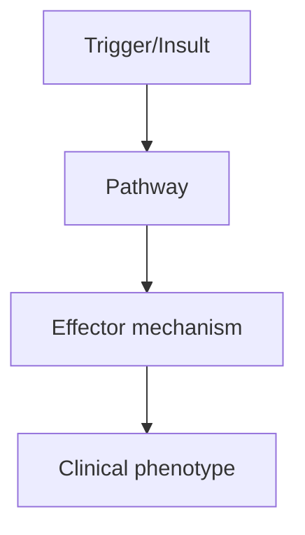
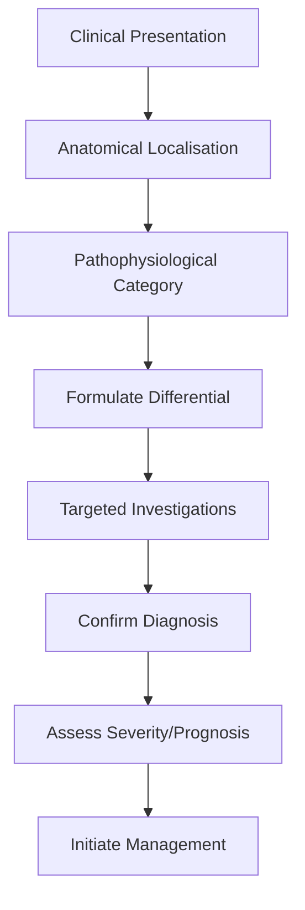
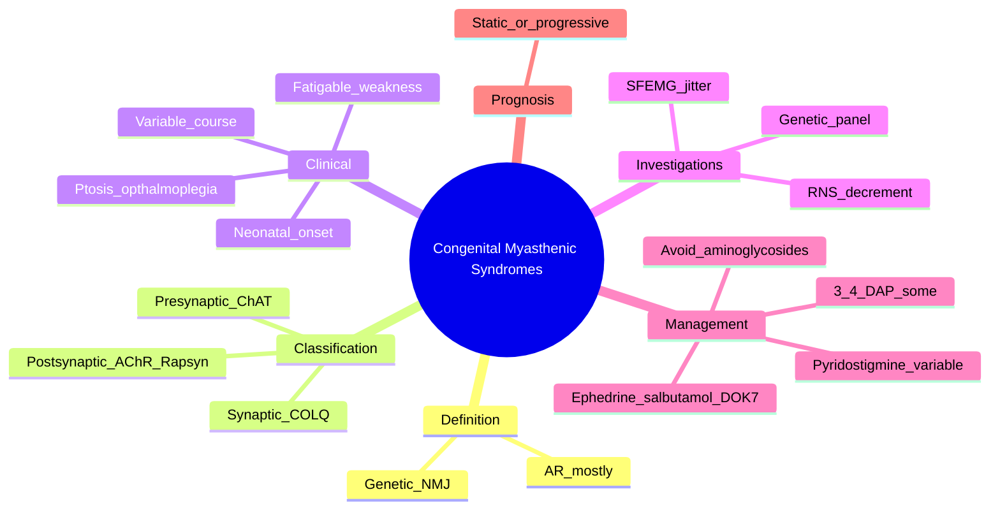

# Congenital Myasthenic Syndromes

> [!tip] **High-Yield Definition**
> Congenital myasthenic syndromes (CMS): heterogeneous group of genetic disorders of NMJ. Onset usually neonatal or childhood. No autoantibodies. Multiple types: presynaptic (ChAT, SYT2), synaptic (COLQ, LAMB2), postsynaptic (AChR subunits: CHRNA1, CHRNB1, CHRND, CHRNE; rapsyn, DOK7, MuSK, LRP4, AGRN).

---

## 1. Definition / Epidemiology / Classification

### Definition
Congenital myasthenic syndromes (CMS): heterogeneous group of genetic disorders of NMJ. Onset usually neonatal or childhood. No autoantibodies. Multiple types: presynaptic (ChAT, SYT2), synaptic (COLQ, LAMB2), postsynaptic (AChR subunits: CHRNA1, CHRNB1, CHRND, CHRNE; rapsyn, DOK7, MuSK, LRP4, AGRN).

### Epidemiology
Prevalence: 1-9/1,000,000 (rare). AR (most) or AD. Neonatal or childhood onset (most). Adult onset (few - slow channel, AChR deficiency, Escobar syndrome).

### Classification
| Variant | Key Features | Prognosis |
|---------|-------------|-----------|
| | | |

---

## 2. Aetiology / Pathophysiology

### Aetiology
Presynaptic: ChAT (congenital, arthrogryposis, apnoea), SYT2 (synaptotagmin 2, presynaptic, severe neonatal, AChE inhibitors responsive). Synaptic: COLQ (collagen Q, AChE anchoring, slow channel, AChE inhibitors CONTRAINDICATED - worsen), LAMB2 (laminin β2). Postsynaptic: AChR subunit mutations (CHRNE - most common, neonatal, AChE inhibitors responsive), rapsyn (RAPSN, neonatal, AChE inhibitors responsive, 3,4-DAP), DOK7 (limb-girdle, late onset, 3,4-DAP + ephedrine), MuSK (neonatal, may worsen with AChE inhibitors), LRP4 (congenital, AChE inhibitors responsive), AGRN (neonatal, AChE inhibitors responsive).

### Pathophysiology

---

## 3. Clinical Features

### History
- **Onset/Duration:**
- **Progression:**
- **Key symptoms:**
- **Triggers:**
- **Systemic symptoms:**
- **Drug/Family/Social history:**

### Examination
| Domain | Key Findings | Localisation Value |
|--------|-------------|-------------------|
| | | |

### Specific Clinical Features
Variable. Neonatal: hypotonia ('floppy baby'), respiratory distress, feeding difficulty, weak cry, arthrogryposis multiplex congenita (ChAT, rapsyn, AChR), ptosis, facial weakness. Childhood: fatigable weakness, ptosis, ophthalmoplegia, bulbar, limb-girdle, episodic apnoea (especially in infancy). Specific syndromes: DOK7 (limb-girdle, adolescent, slow progression), slow channel (AD, progressive weakness, AChE worsen), Escobar (CHRND, multiple pterygia, AChE responsive), FAST channel (rapid AChR desensitisation, AChE responsive). Fluctuating weakness (fatigability). No autoantibodies. Family history (often AR, consanguinity).

---

## 4. Diagnostic Approach / Algorithm

---

## 5. Investigations

Clinical: neonatal/childhood fatigable weakness, family history (AR/AD), consanguinity. EMG: decremental response on repetitive nerve stimulation (RNS) at 2-3Hz. SFEMG: increased jitter and blocking. Anti-AChR, anti-MuSK: NEGATIVE (vs autoimmune MG). Genetic testing: gene panels (CHAT, SYT2, COLQ, LAMB2, CHRNA1/B1/D/E, RAPSN, DOK7, MUSK, LRP4, AGRN), or WES. Edrophonium (Tensilon) test: may improve (variable, AChR subunit), worsen (COLQ slow channel, DOK7 - worsening with AChE inhibitors). Treat response: AChE inhibitors trial (pyridostigmine), monitor. Salbutamol: effective in DOK7, COLQ. 3,4-DAP: effective in some (DOK7, presynaptic). Muscle biopsy: not routinely needed.

---

## 6. Differential Diagnosis

| Differential | Distinguishing Features | Key Test |
|--------------|------------------------|----------|
| | | |

---

## 7. Management

Specific: trial of AChE inhibitors (pyridostigmine 30-60mg q4-6h) - effective in many (CHRNE, RAPSN, AChR deficiency). Salbutamol 4mg BD-TDS: effective in DOK7, COLQ, AChR (β-agonist, stabilises NMJ). 3,4-DAP: effective in DOK7, presynaptic (ChAT, SYT2). AVOID AChE inhibitors: COLQ slow channel (worsens), DOK7 (worsens, use salbutamol). Supportive: respiratory support (NIV, ventilation), feeding (NG/PEG), physiotherapy, OT, speech, social, psychological, genetic counselling. Multidisciplinary: neurology, genetics, paediatrician, pulmonology, OT, PT, SLT, social. Trial of treatment under specialist supervision.

---

## 8. Drug Interactions / Contraindications / Comorbidity Cautions

| Drug | Interaction / Caution | Management |
|------|----------------------|------------|
| | | |

---

## 9. Procedures (if applicable)

### Procedure:
- **Indications:**
- **Contraindications:**
- **Preparation / Principle:**
- **Complications:**
- **Viva Pearls:**

---

## 10. Complications

| Complication | Frequency | Prevention / Monitoring | Management |
|--------------|-----------|------------------------|------------|
| | | | |

---

## 11. Red Flags / Emergencies

Respiratory failure (apnoea, especially in infancy), bulbar failure, scoliosis, contractures, aspiration, response to AChE inhibitors worsening (COLQ), severe scoliosis, sudden death.

---

## 12. Prognosis

Variable. Neonatal: severe, may need lifelong ventilation. Childhood: better, often stabilise. Adult (slow channel, DOK7): progressive. Lifelong condition, manageable. Genetic counselling for family. New therapies: gene therapy, specific molecular approaches. Multidisciplinary care essential.

---

## 13. Topic Correlation

| Related Topic | Link | Key Overlap |
|---------------|------|-------------|
| | | |

---

## 14. Special Situations

| Situation | Consideration |
|-----------|---------------|
| **Pregnancy** | |
| **Lactation** | |
| **Paediatric** | |
| **Elderly / Frail** | |
| **Renal impairment** | |
| **Hepatic impairment** | |
| **Immunocompromised** | |
| **Perioperative** | |
| **Driving / DVLA** | |
| **Occupational** | |

---

## FCPS/MRCP High-Yield Summary

| Category | Key Points |
|----------|------------|
| **Definition** | Congenital myasthenic syndromes (CMS): heterogeneous group of genetic disorders of NMJ. Onset usually neonatal or childhood. No autoantibodies. Multiple types: presynaptic (ChAT, SYT2), synaptic (COLQ |
| **Epidemiology** | Prevalence: 1-9/1,000,000 (rare). AR (most) or AD. Neonatal or childhood onset (most). Adult onset (few - slow channel, AChR deficiency, Escobar syndr |
| **Pathophysiology** | |
| **Clinical** | Variable. Neonatal: hypotonia ('floppy baby'), respiratory distress, feeding difficulty, weak cry, arthrogryposis multiplex congenita (ChAT, rapsyn, AChR), ptosis, facial weakness. Childhood: fatigabl |
| **Diagnosis** | |
| **Investigations** | Clinical: neonatal/childhood fatigable weakness, family history (AR/AD), consanguinity. EMG: decremental response on repetitive nerve stimulation (RNS) at 2-3Hz. SFEMG: increased jitter and blocking.  |
| **Management** | Specific: trial of AChE inhibitors (pyridostigmine 30-60mg q4-6h) - effective in many (CHRNE, RAPSN, AChR deficiency). Salbutamol 4mg BD-TDS: effective in DOK7, COLQ, AChR (β-agonist, stabilises NMJ). |
| **Complications** | |
| **Prognosis** | Variable. Neonatal: severe, may need lifelong ventilation. Childhood: better, often stabilise. Adult (slow channel, DOK7): progressive. Lifelong condition, manageable. Genetic counselling for family.  |
| **Viva Pearls** | |
| **Drug Doses** | |
| **Scoring Systems** | |
| **Genetics** | |
| **Imaging Signs** | |

---

## Viva Questions (PACES/FCPS Style)

1. **Q:** Define Congenital Myasthenic Syndromes and classify its variants.
   **A:** Based on the definition above.

2. **Q:** What are the key clinical features?
   **A:** Variable. Neonatal: hypotonia ('floppy baby'), respiratory distress, feeding difficulty, weak cry, arthrogryposis multiplex congenita (ChAT, rapsyn, AChR), ptosis, facial weakness. Childhood: fatigable weakness, ptosis, ophthalmoplegia, bulbar, limb-girdle, episodic apnoea (especially in infancy). S

3. **Q:** What is the first-line treatment?
   **A:** Based on the management section.

4. **Q:** What are the red flags requiring urgent referral?
   **A:** Respiratory failure (apnoea, especially in infancy), bulbar failure, scoliosis, contractures, aspiration, response to AChE inhibitors worsening (COLQ), severe scoliosis, sudden death.

5. **Q:** What is the prognosis?
   **A:** Variable. Neonatal: severe, may need lifelong ventilation. Childhood: better, often stabilise. Adult (slow channel, DOK7): progressive. Lifelong condition, manageable. Genetic counselling for family. New therapies: gene therapy, specific molecular approaches. Multidisciplinary care essential.

6. **Q:** How do you differentiate Congenital Myasthenic Syndromes from key differentials?
   **A:** Clinical features, investigations, and response to treatment.

7. **Q:** What investigations are most useful?
   **A:** Based on the investigations section.

8. **Q:** Describe the stepwise management approach.
   **A:** Based on the management algorithm.

9. **Q:** What are the emergency presentations?
   **A:** Based on the red flags section.

10. **Q:** How does management change in pregnancy/paediatrics/elderly?
    **A:** Special considerations per population.

---

## Common Confusions / Exam Traps

| Confusion | Clarification |
|-----------|---------------|
| | |

---

## Mnemonics
1. **CMS** = **C**ongenital **M**yasthenic **S**yndrome (use: distinguish from autoimmune MG; no antibodies, genetic, often AR)
2. **ChAT-RAP-COLQ-DOK** = the four most common CMS genes: **Ch**oline **A**cetyl**T**ransferase (presynaptic), **RAP**syn (rapsyn, postsynaptic), **COLQ** (synaptic basal lamina), **DOK7** (use: order of frequency/importance)
3. **3 Ps of CMS** = **P**aediatric onset, **P**ositive family history (often), **P**yridostigmine response VARIABLE (use: key clues)
4. **NO ANTIBODIES** in CMS (use: distinguishes from acquired MG)

---

## Mind Map

---

## Spaced Repetition Trackers

| Review Interval | Date | Score (0-5) | Notes |
|-----------------|------|-------------|-------|
| Day 1 | | | |
| Day 3 | | | |
| Day 7 | | | |
| Day 14 | | | |
| Day 30 | | | |
| Day 90 | | | |

---

## Self-Test Scorecard

| Section | Score /5 | Last Attempt |
|---------|----------|--------------|
| Definition & Epidemiology | | | |
| Pathophysiology | | | |
| Clinical Features | | | |
| Investigations | | | |
| Differential | | | |
| Management - Acute | | | |
| Management - Long-term | | | |
| Complications | | | |
| Viva Questions | | | |
| MCQs | | | |
| SBAs | | | |

---

## MCQs (10)

1. **Question:** Congenital myasthenic syndromes (CMS) are usually inherited in which pattern?
   **Options:** A. Autosomal dominant B. Autosomal recessive (most) C. X-linked D. Mitochondrial
   **Answer:** B
   **Explanation:** Most CMS subtypes are autosomal recessive; some (e.g. slow-channel CMS) are autosomal dominant.
2. **Question:** Which of the following is the most common subtype of CMS?
   **Options:** A. CHAT deficiency B. COLQ C. DOK7 D. Rapsyn (RAPSN) and CHAT most common in some populations
   **Answer:** C
   **Explanation:** DOK7 is the most common CMS in many European cohorts; CHAT and RAPSN are also common, especially in neonatal/infantile forms.
3. **Question:** A defining feature distinguishing CMS from autoimmune MG is:
   **Options:** A. Older age of onset B. Anti-AChR antibodies are NEGATIVE; family history often positive C. Presence of thymoma D. Normal EMG
   **Answer:** B
   **Explanation:** CMS patients have no anti-AChR/MuSK/LRP4 antibodies; the diagnosis is genetic.
4. **Question:** DOK7 CMS classically:
   **Options:** A. Responds dramatically to pyridostigmine B. May WORSEN with pyridostigmine; responds to ephedrine/salbutamol C. Requires thymectomy D. Has absent reflexes
   **Answer:** B
   **Explanation:** DOK7 mutations cause a "synaptic" CMS in which pyridostigmine is often unhelpful or worsens symptoms; salbutamol or ephedrine is preferred.
5. **Question:** COLQ mutations cause deficiency of:
   **Options:** A. Acetylcholine receptor B. Collagen Q (anchoring acetylcholinesterase at the NMJ) C. Choline acetyltransferase D. Rapsyn
   **Answer:** B
   **Explanation:** COLQ anchors AChE in the synaptic basal lamina; loss prolongs ACh action and causes endplate myopathy.
6. **Question:** The most useful confirmatory test for CMS is:
   **Options:** A. Anti-AChR antibody B. CT chest C. Targeted CMS genetic panel / exome sequencing D. Tensilon test
   **Answer:** C
   **Explanation:** Genetic testing (CMS panel or whole exome) confirms the diagnosis; EMG/SFEMG supports but is not specific.
7. **Question:** Which finding is typical on EMG/SFEMG in CMS?
   **Options:** A. Decrement on low-frequency RNS, increased jitter on SFEMG B. Myotonic discharges C. Fibrillation potentials only D. Normal study
   **Answer:** A
   **Explanation:** As with MG, low-frequency RNS shows a decrement and SFEMG shows increased jitter.
8. **Question:** Patients with CHAT deficiency typically present with:
   **Options:** A. Sudden apnoeic episodes (especially with fever/fasting) B. Adult onset weakness C. Cognitive decline D. Thymoma
   **Answer:** A
   **Explanation:** Choline acetyltransferase deficiency can cause neonatal apnoea and sudden infant death; weakness worsens with fatigue, infection, fever.
9. **Question:** Which of the following drugs is most useful in DOK7 CMS?
   **Options:** A. Pyridostigmine B. Salbutamol / ephedrine C. Prednisolone D. Plasmapheresis
   **Answer:** B
   **Explanation:** β2-adrenergic agonists (salbutamol, ephedrine) are first-line symptomatic therapy for DOK7 CMS.
10. **Question:** A pregnant mother with CMS delivers a baby with neonatal weakness. Antibodies are negative. Likely cause?
    **Options:** A. Maternal AChR antibodies (transferred) B. Inherited CMS (AR) C. Birth trauma D. Hypoxia
    **Answer:** B
    **Explanation:** Neonatal symptoms in CMS reflect inherited disease (AR), not transferred antibodies (which are negative here).

---

## SBA Questions (10)

1. **Scenario:** Term neonate with hypotonia, ptosis, feeding difficulty, episodic apnoea with infections. Mother is well; AChR antibodies negative.
   **Question:** Most likely diagnosis?
   **Options:** A. Neonatal MG B. Spinal muscular atrophy C. CMS (e.g. CHAT, RAPSN) D. Sepsis
   **Answer:** C
   **Explanation:** Neonatal weakness with negative maternal antibodies and apnoeic crises points to CMS (CHAT/RAPSN are common).
2. **Scenario:** Child with fatigable weakness, AChR antibody negative, sibling similarly affected.
   **Question:** Best next investigation?
   **Options:** A. Anti-MuSK antibody B. Genetic CMS panel C. MRI brain D. Anti-GQ1b
   **Answer:** B
   **Explanation:** Consanguineous/affected siblings suggest autosomal recessive CMS; genetic panel is the standard.
3. **Scenario:** 8-year-old with limb-girdle weakness, ptosis; pyridostigmine makes them WORSE. Genetic test shows DOK7 mutation.
   **Question:** Best alternative treatment?
   **Options:** A. Stop all treatment B. Salbutamol or ephedrine C. Plasmapheresis D. IVIG
   **Answer:** B
   **Explanation:** DOK7 CMS: β2-agonists (salbutamol, ephedrine) are effective; pyridostigmine should be reduced or stopped.
4. **Scenario:** Patient with CMS is admitted for surgery.
   **Question:** Anaesthetic consideration?
   **Options:** A. Use suxamethonium and aminoglycosides freely B. Avoid depolarising and non-depolarising NMBAs where possible; use regional/local where appropriate C. Stop all NMJ drugs pre-op D. Prolonged ventilation always required
   **Answer:** B
   **Explanation:** Patients with CMS are very sensitive to NMBAs; doses must be reduced and reversal carefully managed.
5. **Scenario:** A baby with CMS is given an aminoglycoside for sepsis.
   **Question:** What may happen?
   **Options:** A. Improved weakness B. Worsening neuromuscular blockade / paralysis C. No effect D. Permanent cure
   **Answer:** B
   **Explanation:** Aminoglycosides worsen NMJ transmission and should be avoided in CMS and MG.
6. **Scenario:** A child with COLQ mutation is started on pyridostigmine. 6 months later weakness has progressed.
   **Question:** Likely mechanism?
   **Options:** A. Disease progression despite drug B. Pyridostigmine worsens COLQ CMS by prolonging ACh action at endplate C. Wrong dose D. Allergic reaction
   **Answer:** B
   **Explanation:** In COLQ CMS, AChE is already deficient; pyridostigmine causes ACh excess and can worsen endplate myopathy.
7. **Scenario:** Mother with autoimmune MG has a baby with transient weakness lasting 3 weeks.
   **Question:** Most likely diagnosis?
   **Options:** A. Inherited CMS B. Transient neonatal MG (maternal AChR antibodies) C. Spinal muscular atrophy D. Birth asphyxia
   **Answer:** B
   **Explanation:** Maternal IgG antibodies cross the placenta and cause transient neonatal MG, resolving in weeks to months.
8. **Scenario:** Genetic testing in a child with CMS reveals CHAT mutation.
   **Question:** Important monitoring?
   **Options:** A. Continuous cardiac monitoring B. Apnoea monitoring; cautious with anaesthesia and infections C. Annual MRI brain D. Liver function tests
   **Answer:** B
   **Explanation:** CHAT deficiency can cause apnoeic crises with infection, fever, or anaesthetic exposure; apnoea monitoring is essential.
9. **Scenario:** A CMS patient has fluctuating ptosis and no response to pyridostigmine, salbutamol, or 3,4-DAP.
   **Question:** Appropriate action?
   **Options:** A. Genetic re-review ± whole exome; consider drug side effects B. Stop all treatment C. Start immunosuppression D. Thymectomy
   **Answer:** A
   **Explanation:** Re-evaluate genetics, consider rare subtypes (slow-channel CMS, GFPT1, DPAGT1), and review compliance/side effects.
10. **Scenario:** Teenager with CMS is offered a general anaesthetic for appendicectomy.
    **Question:** Best pre-op plan?
    **Options:** A. No special considerations B. Warn anaesthetist; reduce non-depolarising NMBA dose; use short-acting agents; ensure reversal confirmed C. Spinal anaesthetic only D. Avoid all anaesthetics
    **Answer:** B
    **Explanation:** Patients with CMS are sensitive to non-depolarising NMBAs; doses must be reduced, and reversal carefully confirmed.

---

## Tags
**Tags:** #neurology #NMJ #congenital #CMS #genetic #paediatric #DOK7 #COLQ #CHAT #RAPSN #FCPS #MRCP

---

## Local Navigation
**Heading Hub:** [[../Hub]]  
**Chapter Hierarchy:** [[Davidson Chapter 25 - Neurology Hierarchy]]  
**Chapter MOC:** [[Neurology MOC]]  
**Drug Reference:** [[../00_Index/Neurology Drug Reference]]  
