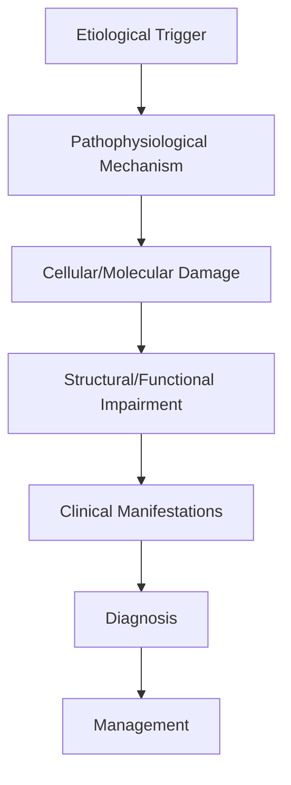
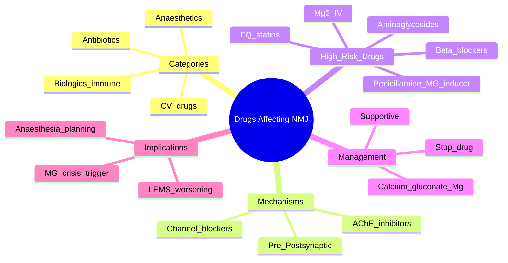

# Drugs Affecting NMJ

> [!tip] **High-Yield Definition**
> Comprehensive clinical note for Drugs Affecting NMJ covering definition, epidemiology, aetiology, pathophysiology, clinical features, investigations, differential diagnosis, management, drug interactions, procedures, complications, red flags, prognosis, topic correlation, and special situations for FCPS/MRCP examination preparation based on Davidson 24th Edition Chapter 25: Neurology.

---

## 1. Definition / Epidemiology / Classification

### Definition
Drugs Affecting NMJ is a neurological disorder within the 09 neuromuscular junction disorders category. It is characterised by specific clinical, pathological, radiological, and laboratory features that allow differentiation from related conditions.

### Epidemiology
- **Incidence/Prevalence:** Variable depending on the specific condition.
- **Age:** Adult onset is most common, but paediatric and elderly presentations occur.
- **Sex:** Variable depending on the condition.
- **Geography:** Worldwide distribution, with higher prevalence in certain regions.
- **Risk Factors:** Genetic predisposition, environmental factors, comorbidities, family history.

### Classification
| Subtype | Key Features | Prognosis |
|---------|-------------|-----------|
| Mild/early | Subtle symptoms, preserved function | Best |
| Moderate | Clear symptoms, functional impairment | Variable |
| Severe | Significant disability, complications | Worst |

---

## 2. Aetiology / Pathophysiology

### Aetiology
- **Primary (idiopathic):** Most cases have no identifiable cause.
- **Genetic:** May be inherited (AD, AR, X-linked, mitochondrial, sporadic).
- **Autoimmune:** Autoantibodies, immune-mediated inflammation.
- **Infectious:** Viral, bacterial, fungal, parasitic.
- **Metabolic:** Electrolyte, endocrine, hepatic, renal, nutritional.
- **Toxic:** Drugs, alcohol, heavy metals, environmental toxins.
- **Vascular:** Ischaemia, haemorrhage, vasculitis.
- **Neoplastic:** Primary, secondary, paraneoplastic.
- **Traumatic:** Acute, chronic, repetitive.
- **Degenerative:** Neurodegeneration, protein misfolding.

### Pathophysiology


---

## 3. Clinical Features

### History
- **Onset/Duration:** Acute, subacute, or chronic.
- **Progression:** Static, progressive, relapsing-remitting, stepwise.
- **Key symptoms:** Specific to the condition.
- **Triggers:** Stress, infection, trauma, drugs, hormonal, environmental.
- **Systemic symptoms:** Constitutional features.
- **Drug/Family/Social history:** Relevant exposures, comorbidities.

### Examination
| Domain | Key Findings | Localisation Value |
|--------|-------------|-------------------|
| Higher function | Cognitive, behavioural | Cortical, subcortical, limbic |
| Cranial nerves | Pupils, eye movements, facial, bulbar | Brainstem, cranial nerve, NMJ |
| Motor | Weakness, tone, reflexes | UMN, LMN, NMJ, muscle |
| Sensory | All modalities, pattern | Peripheral, spinal, brainstem |
| Coordination | Ataxia, nystagmus, dysmetria | Cerebellar, sensory, vestibular |
| Gait | Spastic, ataxic, parkinsonian | Multiple |
| Autonomic | Orthostatic, sweating, GI, bladder | Autonomic, peripheral, central |

### Specific Clinical Features
The clinical features are determined by the underlying aetiology, location of pathology, and rate of progression. Patients typically present with a constellation of symptoms and signs that allow clinical localisation and subsequent targeted investigation.

---

## 4. Diagnostic Approach / Algorithm

```mermaid
flowchart TD
    A[Clinical Presentation] --> B[Anatomical Localisation]
    B --> C[Pathophysiological Category]
    C --> D[Formulate Differential]
    D --> E[Targeted Investigations]
    E --> F[Confirm Diagnosis]
    F --> G[Assess Severity/Prognosis]
    G --> H[Initiate Management]
    H --> I[Monitor Response]
    I --> J{Response?}
    J --> YES1 [Good - Continue]
    J --> NO1 [Poor - Escalate]
    YES1 --> K[Monitor]
    NO1 --> H
```

---

## 5. Investigations

### First-Line Investigations
- **Blood tests:** FBC, U&Es, LFTs, glucose, calcium, magnesium, ESR, CRP, autoimmune, infection.
- **Imaging:** CT/MRI brain/spine (essential for most neurological conditions).
- **Neurophysiology:** EEG, nerve conduction, EMG, evoked potentials.
- **CSF:** Cell count, protein, glucose, OCBs, PCR, culture.

### Second-Line Investigations
- **Genetic testing:** Gene panels, WES, WGS.
- **Antibody testing:** Antineuronal, autoimmune, paraneoplastic.
- **Biopsy:** Nerve, muscle, brain, skin.
- **Advanced imaging:** PET-CT, MR spectroscopy, fMRI.

### Specialised Investigations
- **Biomarkers:** Neurofilament light chain, tau, beta-amyloid, 14-3-3, RT-QuIC.
- **Autonomic testing:** Head-up tilt, sudomotor, QSART.
- **Neuropsychology:** Cognitive testing, behavioural assessment.
- **Genetic counselling:** Family screening, predictive testing.

---

## 6. Differential Diagnosis

| Differential | Distinguishing Features | Key Test |
|--------------|------------------------|----------|
| Vascular | Sudden onset, focal, vascular risk factors | MRI/CT, vessel imaging |
| Inflammatory | Subacute, multifocal, systemic | MRI, CSF, antibodies |
| Infectious | Fever, systemic, exposure | Bloods, CSF, imaging |
| Neoplastic | Progressive, mass effect | MRI, biopsy |
| Degenerative | Progressive, symmetric, hereditary | MRI, genetic |
| Toxic/Metabolic | Drug history, systemic, reversible | Bloods, toxicology |
| Autoimmune | Multifocal, antibodies, immunotherapy response | Antibodies, MRI, CSF |
| Functional | Inconsistent, distractible | Clinical, video, biomarkers |

---

## 7. Management

### Acute Management
- **Stabilisation:** ABCDE approach, emergency resuscitation.
- **Specific treatment:** Disease-specific interventions.
- **Symptomatic relief:** Pain, seizures, spasticity, autonomic dysfunction.
- **Prevention of complications:** DVT, pressure sores, infection.

### Disease-Modifying Treatment
- **Pharmacological:** First-line, second-line, escalation, maintenance.
- **Procedural:** Surgery, biopsy, drainage, ablation, stimulation.
- **Immunotherapy:** Steroids, IVIG, plasma exchange, immunosuppressants, biologics.
- **Rehabilitation:** Physiotherapy, OT, speech therapy.

### Long-Term Management
- **Monitoring:** Clinical, imaging, biomarkers, side effects.
- **Prevention:** Vaccinations, prophylaxis, lifestyle modification.
- **Supportive care:** Multidisciplinary team, social work, psychological support.
- **Palliative care:** Advanced care planning, end-of-life care, hospice.

---

## 8. Drug Interactions / Contraindications / Comorbidity Cautions

| Drug Class | Interaction / Caution | Management |
|------------|----------------------|------------|
| Antiseizure medications | Enzyme induction, teratogenicity | Monitor, supplement, switch |
| Immunosuppressants | Infection, malignancy, teratogenicity | Monitor, prophylaxis |
| Anticoagulants | Bleeding risk, drug interactions | Monitor INR, avoid combinations |
| Antihypertensives | Hypotension, falls | Monitor BP, adjust dose |
| Antibiotics | Nephrotoxicity, ototoxicity | Monitor renal |
| Antivirals | Nephrotoxicity, neuropsychiatric | Monitor renal, dose adjust |
| Steroids | DM, HTN, osteoporosis, infection | Monitor, prophylaxis, taper |
| Biologics | Infusion reactions, infection | Monitor, prophylaxis |

---

## 9. Procedures

### Common Procedures
- **Lumbar puncture:** Diagnostic, therapeutic (IIH, NPH). Contraindications: raised ICP, mass lesion, coagulopathy.
- **Nerve conduction studies/EMG:** Diagnostic, prognosis. Minor discomfort.
- **EEG:** Diagnostic, monitoring. No significant complications.
- **MRI brain/spine:** Diagnostic, monitoring. Contraindications: pacemaker, metallic implants.
- **CT head:** Emergency, rapid. Radiation exposure, contrast reactions.
- **Biopsy:** Stereotactic, open. Indications: diagnosis, molecular profiling.

---

## 10. Complications

| Complication | Frequency | Prevention | Management |
|--------------|-----------|------------|------------|
| Infection | Common | Hygiene, prophylaxis, vaccination | Antibiotics, antifungals |
| Thrombosis | Common | Prophylaxis, mobility | Anticoagulation |
| Pressure sores | Common | Positioning, nutrition | Wound care, surgery |
| Spasticity | Common | Positioning, stretching | Baclofen, BoNT |
| Contractures | Common | Passive movements, splints | Physiotherapy, surgery |
| Aspiration | Common | Swallow assessment | NGT, PEG, thickeners |
| Falls | Common | Environment, mobility | Walking aids |
| Fractures | Common | Bone health, prevention | Vitamin D, bisphosphonate |
| Depression | Common | Screening, support | Antidepressants, CBT |
| Cognitive decline | Variable | Monitoring, training | Rehabilitation |
| Autonomic dysfunction | Variable | Monitoring, hydration | Midodrine, fludrocortisone |
| Respiratory failure | Variable | Monitoring, supportive | Ventilation, NIV |
| Death | Variable | Monitoring, palliative | End-of-life care |

---

## 11. Red Flags / Emergencies

### Emergency Presentations
- **Rapid neurological deterioration:** New focal deficit, decreased consciousness, seizures.
- **Status epilepticus:** Continuous seizures >5 min.
- **Raised ICP:** Headache, vomiting, papilloedema, altered consciousness.
- **Respiratory failure:** Hypoxia, hypercapnia, ventilatory failure.
- **Cardiac arrest:** Arrhythmia, MI, pulmonary embolism.
- **Infection:** Sepsis, meningitis, abscess, encephalitis.
- **Drug toxicity:** Overdose, side effects, interactions.
- **Haemorrhage:** Intracranial, systemic, coagulopathy.

---

## 12. Prognosis

### Natural History
- **Acute:** May resolve with treatment, may progress, may be fatal.
- **Subacute:** Variable, depends on cause and treatment.
- **Chronic:** Often progressive, may be stable, may have relapses.
- **Recovery:** Variable, may be complete, partial, or none.

### Prognostic Factors
- **Favourable:** Young age, early treatment, mild disease, reversible cause, good premorbid function, family support.
- **Unfavourable:** Older age, delayed treatment, severe disease, irreversible cause, poor premorbid function, comorbidities.

---

## 13. Topic Correlation

| Related Topic | Link | Key Overlap |
|---------------|------|-------------|
| Davidson 24th Ed Chapter 25 | [[Davidson Chapter 25 - Neurology Hierarchy]] | Comprehensive neurology |
| Neurology MOC | [[Neurology MOC]] | All neurology topics |
| Drug Reference | [[../00_Index/Neurology Drug Reference]] | Medications |
| Local Hub | [[../09_Neuromuscular_Junction_Disorders/Hub]] | Section-specific |
| Clinical Examination | [[../01_Fundamentals_Examination/Neurological History Taking]] | Clinical approach |
| Investigation | [[../01_Fundamentals_Examination/Neuroimaging (CT-MRI) Principles]] | Imaging |

---

## 14. Special Situations

| Situation | Consideration |
|-----------|---------------|
| **Pregnancy** | Pre-conception counselling, teratogenicity, drug safety, monitoring, delivery planning, breastfeeding. |
| **Lactation** | Drug safety, breastfeeding, monitoring, support. |
| **Paediatric** | Developmental considerations, drug dosing, school, family, vaccination, growth, puberty. |
| **Elderly / Frail** | Comorbidities, polypharmacy, falls, bone health, cognition, social, end-of-life. |
| **Renal impairment** | Drug dose adjustment, monitoring, dialysis, transplant. |
| **Hepatic impairment** | Drug dose adjustment, monitoring, transplant. |
| **Immunocompromised** | Infection prophylaxis, vaccination, drug interactions, malignancy screening. |
| **Perioperative** | Drug management, anaesthesia planning, VTE prophylaxis, infection prevention, monitoring. |
| **Driving / DVLA** | Fitness to drive, restrictions, notification, reassessment. |
| **Occupational** | Fitness for work, adaptations, rehabilitation, disability, return to work. |

---

## FCPS/MRCP High-Yield Summary

| Category | Key Points |
|----------|------------|
| **Definition** | Comprehensive definition with key diagnostic criteria |
| **Epidemiology** | Incidence, prevalence, age, sex, geography, risk factors |
| **Aetiology** | Primary causes, secondary causes, genetic, environmental |
| **Pathophysiology** | Mechanism of disease, cellular/molecular basis |
| **Clinical Features** | History, examination, key findings, variants |
| **Diagnosis** | Diagnostic criteria, classification, severity |
| **Investigations** | First-line, second-line, specialised, biomarkers |
| **Differential Diagnosis** | Key differentials, distinguishing features, tests |
| **Management** | Acute, disease-modifying, symptomatic, supportive |
| **Complications** | Common, serious, prevention, management |
| **Prognosis** | Natural history, prognostic factors, outcomes |
| **Viva Pearls** | Key examination points |
| **Drug Doses** | First-line, second-line, emergency |
| **Scoring Systems** | Specific scores used in management |
| **Genetics** | Inheritance, genes, mutations, family screening |
| **Imaging Signs** | Characteristic findings, differential |

---

## Viva Questions (PACES/FCPS Style)

1. **Q:** Define and classify its variants.
   **A:** Comprehensive definition with classification of subtypes based on aetiology, severity, and clinical features.

2. **Q:** What are the key clinical features?
   **A:** Specific symptoms and signs including onset, progression, key features, and associated findings.

3. **Q:** What is the first-line treatment?
   **A:** First-line pharmacological and non-pharmacological management based on current evidence.

4. **Q:** What are the red flags requiring urgent referral?
   **A:** Specific emergency presentations and complications requiring immediate intervention.

5. **Q:** What is the prognosis?
   **A:** Natural history, prognostic factors, and long-term outcomes.

6. **Q:** How do you differentiate from key differentials?
   **A:** Clinical features, investigations, and response to treatment that distinguish from alternative diagnoses.

7. **Q:** What investigations are most useful?
   **A:** First-line and second-line investigations including imaging, neurophysiology, CSF, and biomarkers.

8. **Q:** Describe the stepwise management approach.
   **A:** Stepwise escalation from first-line to second-line to third-line therapy with monitoring.

9. **Q:** What are the emergency presentations?
   **A:** Specific emergency scenarios and immediate management priorities.

10. **Q:** How does management change in pregnancy/paediatrics/elderly?
    **A:** Special considerations for each population including drug safety, monitoring, and support.

---

## Common Confusions / Exam Traps

| Confusion | Clarification |
|-----------|---------------|
| Similar presentation but different cause | Differentiate by history, examination, investigations |
| Treatment response vs natural history | Assess with objective measures, biomarkers |
| Drug interactions | Check each drug, monitor, adjust doses |
| Disease progression vs treatment failure | Monitor response, escalate appropriately |
| Functional vs organic | Inconsistent, distractible, disability greater than impairment |
| Acute vs chronic | Time course, progression, reversibility |
| Primary vs secondary | Underlying cause, contributing factors |
| Side effects vs symptoms | Temporal relationship, dose relationship |

---

## Mnemonics
1. **BAFM** = **B**eta-blockers, **A**minoglycosides, **F**luoroquinolones, **M**agnesium IV (use: classic drugs that worsen MG)
2. **A PEN M** (Ampoules of neuromuscular trouble) = **A**minoglycosides, **P**enicillamine (causes MG), **E**rythromycin/macrolides, **N**euromuscular blockers, **M**agnesium (use: drugs affecting NMJ)
3. **SAFE Rx in MG** = **S**teroids (start low), **A**zathioprine, **F**-something – pyridostigmine first (use: drugs to give)
4. **DON'T give BOTOX** to MG patients (use: botulinum toxin contraindicated in MG and LEMS)

---

## Mind Map



---

## Spaced Repetition Trackers

| Review Interval | Date | Score (0-5) | Notes |
|-----------------|------|-------------|-------|
| Day 1 | | | |
| Day 3 | | | |
| Day 7 | | | |
| Day 14 | | | |
| Day 30 | | | |
| Day 90 | | | |

---

## Self-Test Scorecard

| Section | Score /5 | Last Attempt |
|---------|----------|--------------|
| Definition & Epidemiology | | | |
| Pathophysiology | | | |
| Clinical Features | | | |
| Investigations | | | |
| Differential | | | |
| Management - Acute | | | |
| Management - Long-term | | | |
| Complications | | | |
| Viva Questions | | | |
| MCQs | | | |
| SBAs | | | |

---

## MCQs (10)

1. **Question:** Which antibiotic class is most notorious for causing NMJ blockade and worsening myasthenia gravis?
   **Options:** A. Penicillins B. Aminoglycosides (e.g. gentamicin) C. Cephalosporins D. Tetracyclines
   **Answer:** B
   **Explanation:** Aminoglycosides (gentamicin, amikacin, streptomycin, neomycin) reduce ACh release presynaptically and worsen MG.
2. **Question:** Beta-blockers can worsen MG via:
   **Options:** A. Increasing ACh release B. Blocking β-adrenergic facilitation of ACh release at the NMJ C. Direct AChR blockade D. AChE inhibition
   **Answer:** B
   **Explanation:** β-adrenergic stimulation normally supports NMJ transmission; β-blockade can unmask or worsen MG weakness.
3. **Question:** Which drug can actually INDUCE myasthenia gravis (autoimmune)?
   **Options:** A. Aspirin B. Penicillamine C. Paracetamol D. Loratadine
   **Answer:** B
   **Explanation:** Penicillamine (used in Wilson disease, RA) can induce true AChR-antibody positive MG, usually reversible on withdrawal.
4. **Question:** In the context of NMJ disease, IV magnesium should be:
   **Options:** A. Given liberally B. Avoided/used with caution – it blocks ACh release C. Used as first-line for cramps D. Reversed with pralidoxime
   **Answer:** B
   **Explanation:** Mg2+ inhibits presynaptic Ca2+ entry and ACh release; in MG and LEMS it can precipitate crisis.
5. **Question:** Botulinum toxin in a patient with underlying MG:
   **Options:** A. Is safe B. Is contraindicated – risk of systemic paralysis C. Should be given at standard dose D. Combined with pyridostigmine for safety
   **Answer:** B
   **Explanation:** Patients with MG/LEMS are exquisitely sensitive to botulinum toxin; systemic spread may cause severe weakness.
6. **Question:** A patient on statins develops new fatigable weakness with AChR antibodies.
   **Question:** Mechanism?
   **Options:** A. Statins induce MG via immune modulation (rare, recognised) B. Statins cause myopathy only C. No association D. Pure coincidence always
   **Answer:** A
   **Explanation:** Statins can trigger immune-mediated necrotising myopathy, MG, or inflammatory myopathy; check antibodies (anti-HMGCR, AChR) and consider stopping.
7. **Question:** Which anaesthetic agent is RELATIVELY SAFE in MG?
   **Options:** A. Depolarising NMBAs (suxamethonium) in high dose B. Non-depolarising NMBAs in standard dose C. Short-acting NMBAs in REDUCED dose with reversal D. Aminoglycoside antibiotics for prophylaxis
   **Answer:** C
   **Explanation:** MG patients are resistant to suxamethonium but sensitive to non-depolarising NMBAs; use reduced doses of short-acting agents.
8. **Question:** Fluoroquinolones (ciprofloxacin) in MG:
   **Options:** A. Always safe B. Recognised to exacerbate MG; avoid or use cautiously C. Used to treat MG D. Cure MG
   **Answer:** B
   **Explanation:** Fluoroquinolones carry an FDA warning for exacerbating MG; avoid where possible.
9. **Question:** A patient with LEMS on 3,4-diaminopyridine is given gentamicin. Effect?
   **Options:** A. Improvement B. Worsening NMJ block, possible respiratory failure C. No effect D. Cured
   **Answer:** B
   **Explanation:** Aminoglycosides antagonise ACh release and counteract the benefit of 3,4-DAP in LEMS.
10. **Question:** Drug-induced MG from penicillamine typically:
    **Options:** A. Is permanent B. Resolves within months of stopping the drug C. Requires lifelong immunosuppression D. Progresses to LEMS
    **Answer:** B
    **Explanation:** D-penicillamine-induced MG usually remits within ~6–12 months of drug withdrawal.

---

## SBA Questions (10)

1. **Scenario:** MG patient admitted with pneumonia; started on IV gentamicin, develops severe weakness and respiratory failure.
   **Question:** Cause?
   **Options:** A. MG crisis from infection B. Aminoglycoside-induced NMJ blockade C. Antibiotic allergy D. Anxiety
   **Answer:** B
   **Explanation:** Aminoglycosides worsen NMJ transmission; substitute with a non-aminoglycoside (e.g. cephalosporin).
2. **Scenario:** LEMS patient develops weakness after starting atenolol.
   **Question:** Best action?
   **Options:** A. Increase atenolol B. Stop atenolol; consider alternative antihypertensive C. Add 3,4-DAP D. Plasmapheresis
   **Answer:** B
   **Explanation:** β-blockers can worsen LEMS; stop and use an alternative (ACEi, calcium-channel blocker).
3. **Scenario:** Patient on D-penicillamine for RA develops ptosis, diplopia; AChR antibodies positive.
   **Question:** Likely diagnosis?
   **Options:** A. Statin myopathy B. Penicillamine-induced MG C. Polymyositis D. Stroke
   **Answer:** B
   **Explanation:** Penicillamine is a recognised cause of drug-induced MG; usually reversible on stopping.
4. **Scenario:** Patient with MG requires surgery.
   **Question:** Anaesthetic plan?
   **Options:** A. Standard general anaesthetic B. Continue pyridostigmine perioperatively; reduce non-depolarising NMBA dose; ensure full reversal C. Avoid all anaesthetic agents D. Use suxamethonium in high dose
   **Answer:** B
   **Explanation:** MG patients are sensitive to non-depolarising NMBAs; use reduced doses and ensure full reversal with sugammadex/neostigmine.
5. **Scenario:** Pre-eclamptic patient with MG given IV magnesium sulphate.
   **Question:** Risk?
   **Options:** A. Worsening NMJ block / respiratory failure B. No interaction C. Improved MG D. Permanent cure
   **Answer:** A
   **Explanation:** IV magnesium can precipitate respiratory failure in MG; weigh risk/benefit and monitor closely.
6. **Scenario:** A patient on statins develops proximal weakness and AChR antibody positivity.
   **Question:** Best approach?
   **Options:** A. Continue statin B. Stop statin, re-evaluate, consider anti-HMGCR antibodies and EMG C. Give higher statin dose D. Plasmapheresis
   **Answer:** B
   **Explanation:** Statins can induce MG or immune-mediated necrotising myopathy; stopping is the first step with antibody testing and EMG.
7. **Scenario:** Cosmetic Botox injection in a patient with subclinical MG causes ptosis, dysphagia, and limb weakness.
   **Question:** Action?
   **Options:** A. Repeat injection with higher dose B. Stop further injections; supportive care; consider antitoxin in severe cases C. Continue D. Antibiotics
   **Answer:** B
   **Explanation:** Iatrogenic botulism in MG is dangerous; discontinue, monitor, support; severe cases may need antitoxin.
8. **Scenario:** Patient with newly diagnosed hypertension and MG is started on propranolol for migraine prophylaxis.
   **Question:** Risk?
   **Options:** A. Improved MG B. Worsening of MG weakness; avoid non-selective β-blockers C. Hyperthyroidism D. Hair loss
   **Answer:** B
   **Explanation:** Non-selective β-blockers (propranolol, nadolol) can worsen MG; cardioselective agents (bisoprolol) are preferred if needed, with caution.
9. **Scenario:** Patient with LEMS on 3,4-DAP develops UTI; prescribed gentamicin.
   **Question:** Best alternative?
   **Options:** A. Continue gentamicin B. Switch to a non-aminoglycoside (e.g. nitrofurantoin or trimethoprim) C. Add pyridostigmine D. Stop 3,4-DAP
   **Answer:** B
   **Explanation:** Avoid aminoglycosides in LEMS; substitute appropriate non-aminoglycoside antibiotics.
10. **Scenario:** Patient on fluoroquinolone for cellulitis reports worsening weakness; you suspect MG.
    **Question:** Most appropriate action?
    **Options:** A. Continue fluoroquinolone B. Stop fluoroquinolone, switch class, perform AChR antibody and EMG C. Add steroids only D. Ignore
    **Answer:** B
    **Explanation:** FQ can unmask or worsen MG; switch class and investigate (AChR antibody, SFEMG, ice-pack test).

---

## Tags
**Tags:** #neurology #NMJ #drug-induced #aminoglycosides #beta_blockers #penicillamine #botulinum #iatrogenic #anaesthesia #FCPS #MRCP

---

## Local Navigation
**Heading Hub:** [[../Hub]]  
**Chapter Hierarchy:** [[Davidson Chapter 25 - Neurology Hierarchy]]  
**Chapter MOC:** [[Neurology MOC]]  
**Drug Reference:** [[../00_Index/Neurology Drug Reference]]  
