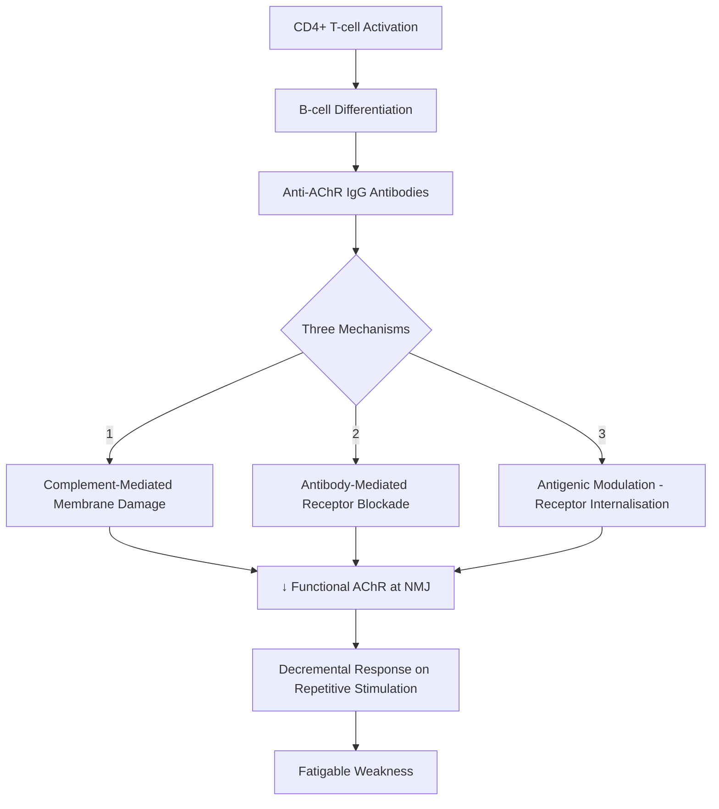
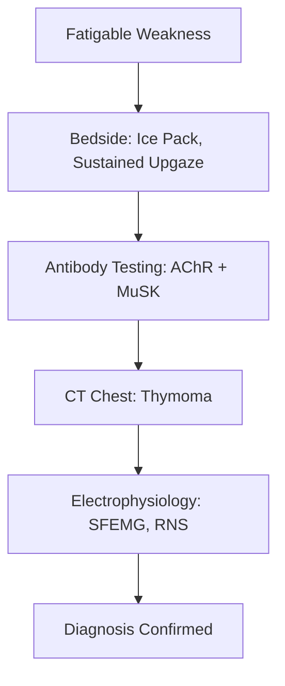
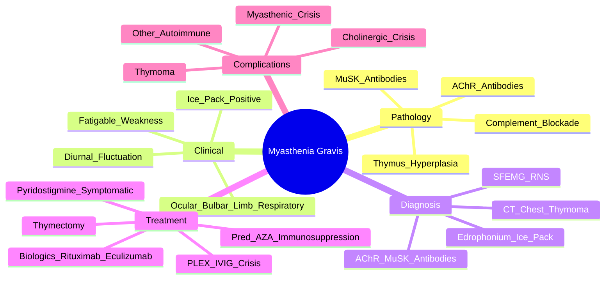

# Myasthenia Gravis (MG)

> [!tip] **MG = Fatigable weakness of ocular, bulbar, limb, respiratory muscles; **AChR antibodies in 80-85%**, MuSK in 5-10%, thymoma in 10-15%**
> **Ice pack test, edrophonium, SFEMG, AChR/MuSK antibodies, CT chest for thymoma**
> **Myasthenic crisis** = respiratory failure; treat with **IVIG/PLEX + ventilation**

## 1. Definition / Epidemiology / Classification

### Definition
Autoimmune disorder of the neuromuscular junction (NMJ) caused by antibodies against postsynaptic acetylcholine receptors (AChR) or related proteins → fatigable muscle weakness that worsens with activity and improves with rest.

### Epidemiology
- **Prevalence:** 15-20/100,000
- **Incidence:** 0.3-2.8/100,000/year
- **Age:** **Bimodal** — early-onset (F, 20-40y, thymic hyperplasia) + late-onset (M, 60-80y, thymoma)
- **Sex:** Early-onset F > M (3:1); late-onset M > F
- **Comorbidities:** Thymoma (10-15%), other autoimmune (thyroid, RA, SLE)

### Classification — MGFA
| Class | Features |
|-------|----------|
| **I** | Ocular only (any weakness, no other) |
| **IIa** | Mild generalised + predominant limb/axial |
| **IIb** | Mild generalised + predominant bulbar |
| **IIIa** | Moderate generalised + limb/axial |
| **IIIb** | Moderate generalised + bulbar |
| **IVa** | Severe generalised + limb/axial |
| **IVb** | Severe generalised + bulbar |
| **V** | Intubation (crisis) |

**Antibody-based:**
- **AChR antibody positive:** 80-85% generalised, 50% ocular
- **MuSK antibody positive:** 5-10% (predominantly bulbar, often severe)
- **LRP4 antibody:** ~2%
- **Seronegative:** 5-10%

---

## 2. Aetiology / Pathophysiology

### Aetiology
- **Autoimmune:** Idiopathic (most common)
- **Paraneoplastic:** Thymoma (10-15%); thymic hyperplasia (50-60% early-onset)
- **Drug-induced:** Penicillamine, α-interferon, immune checkpoint inhibitors
- **Neonatal:** Maternal antibodies crossing placenta (transient)

### Pathophysiology

### Pathology
- **NMJ:** Simplified postsynaptic folds; widened synaptic cleft
- **Thymus:** Hyperplasia (germinal centres) in 50-60%; thymoma in 10-15%
- **MuSK MG:** Different mechanism (disrupts MuSK-LRP4-rapsyn clustering)

---

## 3. Clinical Features

### Hallmark — **Fatigable Weakness**
- **Worsens with use, improves with rest**
- **Fluctuates** through day (worse evening)
- **No sensory, no autonomic, no reflex loss**

### Patterns
| Pattern | Frequency | Features |
|---------|-----------|----------|
| **Ocular** | 50% at onset (90% eventually generalised) | Ptosis, diplopia; sparing pupils |
| **Bulbar** | 15-20% | Dysarthria, dysphagia, chewing difficulty, nasal speech |
| **Limb** | Proximal > distal | Arms > legs typically |
| **Respiratory** | Crisis | Dyspnoea, bulbar weakness |

### Examination
| Test | Positive Sign |
|------|---------------|
| **Sustained upgaze (>60 sec)** | Ptosis (fatigable) |
| **Simpson test** | ↑ ptosis on sustained upgaze |
| **Repetitive limb movement** | ↓ power with repetition |
| **Ice pack test** | **Cold improves ptosis** (2-5 min) — clinical test |
| **Edrophonium (Tensilon) test** | Rapid, transient improvement in weakness |

### Specific Signs
- **Ptosis:** Unilateral or bilateral; worsens with sustained upgaze
- **Ophthalmoplegia:** Variable pattern; pupillary-sparing (key)
- **Myasthenic snarl:** Attempted smile — upper lip rises but horizontal smile fails
- **Tubular voice:** Prolonged speech hypernasality
- **No reflexes change with fatigue**

---

## 4. Diagnostic Approach / Algorithm

### Diagnostic Approach
1. **Clinical suspicion** (fatigable weakness)
2. **Bedside:** Ice pack test (≥2 mm improvement in ptosis)
3. **Antibodies:** AChR, MuSK
4. **CT chest:** All confirmed/suspected MG (thymoma)
5. **Electrophysiology:** SFEMG (most sensitive), RNS (decremental response)

---

## 5. Investigations

### First-Line
| Test | Indication | Finding |
|------|------------|---------|
| **AChR antibodies** | All suspected MG | **Positive in 80-85% generalised, 50% ocular** |
| **MuSK antibodies** | AChR-negative | Positive in 30-50% of seronegative |
| **CT Chest (contrast)** | All MG | Thymoma (10-15%), thymic hyperplasia |
| **TFTs** | All | Concurrent thyroid disease |
| **Other autoimmune** | Clinical suspicion | ANA, RF, anti-TTG (coeliac) |

### Bedside / Pharmacological Tests
| Test | Mechanism | Use |
|------|-----------|-----|
| **Ice pack test** | Cold improves NMJ transmission | Ptosis (≥2mm improvement in 2-5 min) |
| **Edrophonium (Tensilon)** | Short-acting AChEi | **Rarely used now**; risk of bradycardia (atropine ready); historical |
| **Neostigmine test** | Longer-acting AChEi | Alternative to edrophonium |

### Electrophysiology
| Test | Finding | Sensitivity |
|------|---------|-------------|
| **Repetitive Nerve Stimulation (RNS)** | **Decremental response (>10% decrease in CMAP amplitude)** | 50-80% generalised MG |
| **Single Fibre EMG (SFEMG)** | **Increased jitter, blocking** | **95-99%** (most sensitive) |
| **NCS** | Normal sensory and motor conduction | Excludes neuropathy |

### Other
- **Pulmonary Function Tests (PFTs):** **VC, NIF, PImax** — respiratory monitoring (serial)
- **Pregnancy test** (in women) — teratogenic drugs (methotrexate, MMF)
- **Echocardiogram** (before anaesthesia)

---

## 6. Differential Diagnosis
| Condition | Distinguishing Feature |
|-----------|----------------------|
| **Lambert-Eaton Myasthenic Syndrome (LEMS)** | Proximal weakness; **↑ with exercise**; autonomic features; small cell lung cancer; **anti-VGCC** |
| **Botulism** | Descending paralysis; **dilated pupils**; ↓GI motility; recent canned food |
| **GBS** | Ascending, areflexia, CSF alb-cyto dissociation |
| **Ocular MG mimics** | Ocular myopathy (CPEO), thyroid eye disease, III nerve palsy |
| **Brainstem stroke** | Sudden onset, pupil-involving III |
| **Polymyositis** | Proximal; no fatigue pattern; ↑CK |
| **Motor Neurone Disease** | UMN+LMN, fasciculations, no fatigue |
| **Functional weakness** | Inconsistent, Hoover's sign |
| **Drug-induced MG** | Penicillamine, interferon; resolves on withdrawal |

---

## 7. Management

### Acute — Myasthenic Crisis
| Action | Details |
|--------|---------|
| **ABCDE** | Intubation if VC <20 ml/kg, NIF <-30, fatigue, bulbar weakness |
| **ICU** | Respiratory monitoring (VC, NIF, ABG) |
| **Plasma Exchange (PLEX)** | **First-line in crisis**; rapid onset (days); 4-5 exchanges over 1-2 weeks |
| **IVIG** | Alternative to PLEX (slower onset); 0.4 g/kg ×5d |
| **Continue oral pyridostigmine** | Via NG tube if NBM |
| **Stop drugs worsening MG** | β-blockers, aminoglycosides, fluoroquinolones, magnesium |
| **Treat infection** | Common trigger; antibiotics (avoid aminoglycosides) |

### Symptomatic
| Drug | Dose | Notes |
|------|------|-------|
| **Pyridostigmine** | **30-60 mg QDS** (max 1.2g/day); may need Q3-4 hourly | **First-line**; AChEi; muscarinic SE (diarrhoea, cramps); can use MR (Mestinon Timespan) at night |
| **Neostigmine** | 15-30 mg Q2-6 hourly | IV for crisis; **always with atropine** |
| **Distigmine** | 5-10 mg daily | Less commonly used |
| **Antimuscarinics** | Propantheline, hyoscine | Counteract GI side effects |

### Immunosuppression
| Drug | Indication | Notes |
|------|------------|-------|
| **Prednisolone** | Moderate-severe | **Start low** (10-20mg alternate day) to avoid initial worsening; titrate up |
| **Azathioprine** | Steroid-sparing | First-line steroid-sparing; FBC, LFT; TPMT testing |
| **Mycophenolate mofetil (MMF)** | Steroid-sparing | Alternative; avoid pregnancy; FBC |
| **Methotrexate** | Refractory | Folic acid; liver/bone marrow monitoring |
| **Tacrolimus** | Refractory | TDM; nephrotoxicity |
| **Cyclosporin** | Refractory | Nephrotoxicity |
| **Cyclophosphamide** | Severe refractory | Monthly pulses |

### Biologics / Newer
| Drug | Mechanism | Use |
|------|-----------|-----|
| **Rituximab** | Anti-CD20 | **First-line for MuSK MG**; refractory AChR MG |
| **Eculizumab** | Anti-C5 complement | **Refractory AChR+ generalised MG** (REGAIN trial); meningococcal vaccination |
| **Ravulizumab** | Long-acting anti-C5 | Refractory AChR+ MG |
| **Efgartigimod** | Neonatal Fc receptor antagonist | Refractory MG |
| **Rozanolixizumab** | FcRn antagonist | Refractory MG |

### Thymectomy
- **Indication:** All **AChR+ MG <65y** (generalised); thymoma (any age, all MG)
- **Not for:** MuSK MG (less benefit), ocular MG (controversial)
- **Approach:** Median sternotomy (open) or VATS (video-assisted)
- **Effect:** ↑ remission rate; ↑ chance of being off medication
- **Pre-op:** Optimise respiratory function; treat infection; may need pre-op IVIG/PLEX
- **Post-op:** Risk of myasthenic crisis (monitor for 48-72h)

---

## 8. Drug Interactions / Contraindications
| Drug | Concern |
|------|---------|
| **β-blockers (propranolol)** | Worsen MG |
| **Aminoglycosides (gentamicin)** | NMJ blockade |
| **Fluoroquinolones** | Exacerbate MG |
| **Magnesium (IV)** | NMJ blockade |
| **Macrolides, statins, opioids** | Possible worsening |
| **Penicillamine** | Causes MG (drug-induced) |
| **Botulinum toxin** | Contraindicated |
| **Live vaccines** | Avoid on immunosuppression |
| **Succinylcholine** | Resistance in MG; non-depolarising NMBA sensitivity |

---

## 9. Procedures
### Edrophonium (Tensilon) Test
- **Indication:** Rarely used now; historical
- **Procedure:** Test dose 2mg IV; if tolerated, 8mg IV; observe for transient improvement
- **Risks:** Bradycardia (atropine ready), syncope, cholinergic crisis
- **Caution:** Avoid in elderly, cardiac disease

### Thymectomy
- **Indication:** AChR+ generalised MG <65y; all thymomas
- **Pre-op prep:** IVIG/PLEX may be needed; optimise respiratory function

### Plasmapheresis / IVIG
- **Indication:** Crisis, refractory disease, pre-thymectomy optimisation
- **PLEX preferred** in crisis (faster)

---

## 10. Complications
| Complication | Management |
|--------------|------------|
| **Myasthenic crisis** | ICU, ventilation, PLEX/IVIG |
| **Cholinergic crisis** (over-treatment) | Hold AChEi; atropine; supportive |
| **Thymoma** | Surgery ± radiotherapy |
| **Other autoimmune** | Thyroid, RA monitoring |
| **Respiratory infections** | Vaccination; early treatment |
| **Osteoporosis** (steroids) | Ca/vit D, bisphosphonate |
| **Mood disturbance** (steroids) | Monitor; psychological support |

---

## 11. Red Flags
| Red Flag | Action |
|----------|--------|
| **Respiratory symptoms** | ICU; serial VC/NIF |
| **Bulbar weakness** | Swallow assessment, NG tube |
| **Sudden worsening** | Trigger (infection, drug); crisis |
| **Suspected thymoma** | CT chest; surgical referral |
| **Refractory symptoms** | Consider MuSK, rituximab |
| **Pregnancy** | Multidisciplinary; avoid teratogenic drugs |
| **Difficulty chewing/swallowing** | Aspiration risk; SALT |

---

## 12. Prognosis
| Factor | Good | Poor |
|--------|------|------|
| **Antibody** | AChR | MuSK, seronegative |
| **Onset** | Ocular | Bulbar, severe |
| **Age** | Younger | Older |
| **Thymectomy** | Responds | Thymoma (malignant) |
| **Crisis** | First only | Recurrent |

- **Course:** Variable; ~10-20% achieve remission off treatment; majority have manageable symptoms with treatment
- **Mortality:** <5% (improved with modern treatment)
- **Most deaths:** Respiratory failure (crisis), thymoma

---

## 13. Topic Correlation
| Topic | Overlap |
|-------|---------|
| **LEMS** | Pre-synaptic; anti-VGCC; ↑ with exercise; small cell lung cancer |
| **Botulism** | Toxin blocks ACh release; descending; dilated pupils |
| **Thymoma** | 10-15% of MG; ↑ risk of other paraneoplastic (e.g., LEMS) |
| **Drug-induced MG** | Penicillamine, interferon; resolves on withdrawal |
| **Pregnancy MG** | Variable; ↑ postpartum crisis; AChR antibodies cross placenta → neonatal MG |

---

## 14. Special Situations
- **Pregnancy:** Pyridostigmine safe; **AVOID MMF, methotrexate**; prednisolone, azathioprine (safe); plasma exchange if crisis; **postpartum crisis risk ↑**; neonatal MG (transient, 10-20%)
- **Paediatric:** Neonatal MG (maternal antibodies); juvenile MG (similar to adult); **fluctuating ptosis, fatiguability**
- **Elderly:** ↑ thymoma, late-onset; ↑ infection risk (immunosuppression)
- **Surgery/Anaesthesia:** Pre-op optimisation; **regional preferred**; caution with NMBA; rapid sequence with suxamethonium (resistant); **monitor post-op 48-72h**
- **Driving (DVLA):** Notify; medical assessment; depends on ocular/bulbar control

---

## FCPS/MRCP High-Yield Summary
| Category | Key Points |
|----------|------------|
| **Definition** | Autoimmune NMJ disorder; fatigable weakness; AChR antibodies (80-85%) |
| **Triad** | Fatigable weakness + diurnal fluctuation + AChR antibodies |
| **Patterns** | Ocular (50% onset) → generalised; bulbar; respiratory |
| **Bedside tests** | Ice pack test (≥2mm ptosis improvement); sustained upgaze |
| **Antibodies** | AChR (80-85%), MuSK (5-10%), LRP4 (2%), seronegative (5-10%) |
| **Thymoma** | 10-15% MG; CT chest all MG; thymectomy for all |
| **Treatment** | **Pyridostigmine** first-line; **Prednisolone + Azathioprine** for sustained; **PLEX/IVIG** for crisis |
| **Crisis** | PLEX > IVIG; ICU; ventilation; remove triggers |
| **Biologics** | Rituximab (MuSK); Eculizumab (refractory AChR+) |
| **Avoid** | β-blockers, aminoglycosides, fluoroquinolones, magnesium |

---

## Viva Questions
1. **MG pathophysiology?** Antibodies against postsynaptic AChR → complement damage, blockade, internalisation → ↓functional receptors.
2. **AChR antibody prevalence?** 80-85% generalised MG; 50% ocular.
3. **Bedside test for MG?** Ice pack test (≥2 mm ptosis improvement in 2-5 min); sustained upgaze.
4. **Most sensitive test?** Single fibre EMG (SFEMG) — 95-99% sensitivity.
5. **Treatment of myasthenic crisis?** PLEX (first-line) or IVIG + ventilation.
6. **Pyridostigmine dose?** 30-60 mg QDS (max 1.2 g/day).
7. **Why start prednisolone low?** High-dose steroids can transiently worsen MG (start 10-20mg alternate day).
8. **MuSK MG treatment?** **Rituximab** (often better response than AChR MG).
9. **Drugs to avoid in MG?** β-blockers, aminoglycosides, fluoroquinolones, magnesium IV, botulinum toxin.
10. **Thymectomy indication?** All AChR+ generalised MG <65y; all thymomas.

---

## Common Confusions
| Confusion | Clarification |
|-----------|---------------|
| **MG vs LEMS** | MG: postsynaptic, fatigable, ↑with exercise; LEMS: presynaptic, anti-VGCC, ↑with exercise, autonomic |
| **MG vs botulism** | Botulism: descending, dilated pupils, ↓GI motility |
| **Myasthenic vs cholinergic crisis** | Myasthenic = weak pupils, dry; cholinergic = SLUDGE (salivation, lacrimation, urination, defaecation, GI distress, emesis); use edrophonium to differentiate |
| **Prednisolone start** | Start LOW (10-20mg alternate day) to avoid initial worsening |
| **MuSK vs AChR MG** | MuSK: severe bulbar, less fatigable, thymectomy not helpful, rituximab first-line |
| **Pregnancy MG** | Variable; postpartum ↑; neonatal MG from maternal IgG |

---

## Mnemonics
1. **MGFE** — **M**yasthenia **G**ravis **F**atigability **E**xamination
2. **MG antibodies:** **A**ChR, **M**uSK, **L**RP4 (in order of frequency)
3. **Crisis treatment:** "**IVIg or PLEX**" — both work; PLEX faster
4. **Avoid in MG:** **B**eta-blockers, **A**minoglycosides, **F**luoroquinolones, **M**agnesium (BAFM)

---

## Mind Map

---

## One-Page Revision Card
| **Topic** | **Myasthenia Gravis** |
|-----------|----------------------|
| **Definition** | Autoimmune NMJ disorder; fatigable weakness |
| **Antibodies** | AChR (80-85%), MuSK (5-10%), LRP4, seronegative |
| **Thymus** | Hyperplasia (50-60%); thymoma (10-15%); CT chest all |
| **Bedside** | Ice pack test (≥2mm ptosis improvement) |
| **Most sensitive test** | SFEMG (95-99%) |
| **Treatment** | **Pyridostigmine** (symptomatic); **Pred + AZA** (immunosuppression); **PLEX/IVIG** (crisis) |
| **Thymectomy** | AChR+ generalised <65y; all thymomas |
| **Crisis** | PLEX > IVIG; ICU; ventilation; remove triggers |
| **Avoid** | β-blockers, aminoglycosides, fluoroquinolones, IV Mg |
| **MuSK MG** | Bulbar predominant; rituximab first-line |

---

## MCQs (10)

1. **MG is caused by antibodies against:**
   A. Pre-synaptic calcium channels B. **Post-synaptic AChR** C. Acetylcholinesterase D. MuSK only
   *Answer: B*

2. **AChR antibodies are positive in approximately:**
   A. 30% B. 50% C. **80-85%** D. 99%
   *Answer: C*

3. **Ice pack test is positive when:**
   A. Ptosis worsens B. **Ptosis improves by ≥2 mm** C. Pupils dilate D. Nystagmus appears
   *Answer: B*

4. **Most sensitive diagnostic test for MG:**
   A. AChR antibodies B. CT chest C. **SFEMG** D. Tensilon test
   *Answer: C*

5. **Thymectomy is indicated in:**
   A. All MG B. **AChR+ generalised MG <65y + all thymomas** C. MuSK MG D. Ocular MG only
   *Answer: B*

6. **Myasthenic crisis first-line treatment:**
   A. IVIG B. **Plasma exchange** C. Steroids D. Pyridostigmine alone
   *Answer: B*

7. **Drug to AVOID in MG:**
   A. Paracetamol B. **Gentamicin (aminoglycoside)** C. Pyridostigmine D. Prednisolone
   *Answer: B*

8. **Rituximab is first-line for:**
   A. AChR MG B. **MuSK MG** C. Ocular MG D. All MG
   *Answer: B*

9. **MGFE in management refers to:**
   A. Symptom type B. **Fatigability Examination** C. Drug class D. Antibody
   *Answer: B*

10. **CT chest is required in MG to exclude:**
    A. Lung cancer B. **Thymoma** C. Pneumonia D. Tuberculosis
    *Answer: B*

---

## SBAs (10)

1. **A 35-year-old woman has ptosis that worsens in evening, diplopia, and fatigable chewing. AChR antibody positive. CT chest: anterior mediastinal mass. Best management?**
   A. Pyridostigmine only B. **Pyridostigmine + steroids + thymectomy** C. IVIG alone D. PLEX
   *Answer: B* — Symptomatic + immunosuppression + thymectomy for thymoma + AChR+ MG.

2. **A 50-year-old with MG develops dyspnoea, dysphagia, and VC of 18 ml/kg. Best management?**
   A. Increase pyridostigmine B. **ICU + ventilation + PLEX** C. Oral steroids D. Antibiotics
   *Answer: B* — Myasthenic crisis: ICU, ventilation, PLEX.

3. **A 70-year-old with generalised MG, AChR+, on pyridostigmine, prednisolone, azathioprine still symptomatic. Next step?**
   A. Add IVIG monthly B. **Consider rituximab or eculizumab (biologics)** C. Thymectomy D. Stop treatment
   *Answer: B* — Biologics for refractory AChR+ MG.

4. **A 40-year-old with severe bulbar MG, AChR negative, MuSK positive. Best treatment?**
   A. Pyridostigmine B. **Rituximab** C. Thymectomy D. Steroids
   *Answer: B* — MuSK MG: rituximab first-line; thymectomy not beneficial.

5. **A 30-year-old with MG is started on high-dose prednisolone 1 mg/kg. 5 days later she is much weaker. Cause?**
   A. MG progression B. **Steroid-induced worsening (start low)** C. Infection D. Cholinergic crisis
   *Answer: B* — High-dose steroids can worsen MG initially; start low (10-20 mg alternate day).

6. **A patient with MG has too much pyridostigmine and now has SLUDGE symptoms. This is:**
   A. Myasthenic crisis B. **Cholinergic crisis** C. Heart failure D. Anxiety
   *Answer: B* — Cholinergic excess → SLUDGE (salivation, lacrimation, urination, defaecation, GI, emesis).

7. **A patient with MG is scheduled for surgery. Best pre-op strategy?**
   A. Stop pyridostigmine B. **Continue pyridostigmine; consider IVIG/PLEX if poorly controlled** C. Stop all meds D. Reverse anaesthesia
   *Answer: B* — Continue pyridostigmine; optimise MG before surgery.

8. **A pregnant woman with MG is planning. Which drug should be AVOIDED?**
   A. Pyridostigmine B. Prednisolone C. **Mycophenolate mofetil (MMF)** D. Azathioprine
   *Answer: C* — MMF is teratogenic; avoid in pregnancy.

9. **A patient with MG, AChR+, has NOT had a CT chest. Why is this important?**
   A. Lung cancer risk B. **To exclude thymoma (10-15%)** C. Pneumonia D. Aspiration
   *Answer: B* — 10-15% of MG have thymoma; CT chest is mandatory.

10. **A 60-year-old with new MG symptoms has small cell lung cancer. Diagnosis?**
    A. MG B. **LEMS (Lambert-Eaton)** C. Botulism D. Polymyositis
    *Answer: B* — Small cell lung cancer + proximal weakness + autonomic = LEMS (anti-VGCC).

---

## Flashcards

- **Q:** MG antibodies (in order)?
  **A:** AChR (80-85%) → MuSK (5-10%) → LRP4 (2%) → seronegative
- **Q:** Ice pack test?
  **A:** ≥2mm ptosis improvement with cold application (2-5 min)
- **Q:** Most sensitive diagnostic test?
  **A:** SFEMG (95-99%)
- **Q:** First-line treatment?
  **A:** Pyridostigmine (symptomatic); Pred + AZA (immunosuppression)
- **Q:** Crisis treatment?
  **A:** PLEX (faster) or IVIG + ICU + ventilation
- **Q:** Thymectomy indication?
  **A:** AChR+ generalised MG <65y + all thymomas
- **Q:** MuSK MG treatment?
  **A:** Rituximab (often better than in AChR MG)
- **Q:** Eculizumab for?
  **A:** Refractory AChR+ generalised MG (anti-C5)
- **Q:** Drugs to avoid?
  **A:** β-blockers, aminoglycosides, fluoroquinolones, IV Mg, botulinum toxin
- **Q:** Postpartum MG?
  **A:** ↑ Crisis risk; neonatal MG from maternal IgG (transient)

---

## Answer Key

### MCQs
1. **B** — Post-synaptic AChR
2. **C** — 80-85% AChR+
3. **B** — ≥2mm ptosis improvement
4. **C** — SFEMG most sensitive
5. **B** — AChR+ <65y + thymoma
6. **B** — PLEX in crisis
7. **B** — Aminoglycosides worsen
8. **B** — Rituximab for MuSK
9. **B** — MGFE = fatigability
10. **B** — CT chest for thymoma

### SBAs
1. **B** — Symptomatic + IS + thymectomy
2. **B** — ICU + ventilation + PLEX
3. **B** — Biologics for refractory
4. **B** — Rituximab for MuSK
5. **B** — Steroid-induced worsening
6. **B** — SLUDGE = cholinergic crisis
7. **B** — Continue pyridostigmine + optimise
8. **C** — Avoid MMF (teratogenic)
9. **B** — Thymoma in 10-15%
10. **B** — SCLC + proximal weakness = LEMS

---

## Local Navigation
**Heading Hub:** [[09_Neuromuscular_Junction_Disorders/NMJ Hub]]
**Topic-Group Hub:** [[09_Neuromuscular_Junction_Disorders/NMJ MOC]]
**Chapter Hierarchy:** [[Davidson Chapter 25 - Neurology Hierarchy]]
