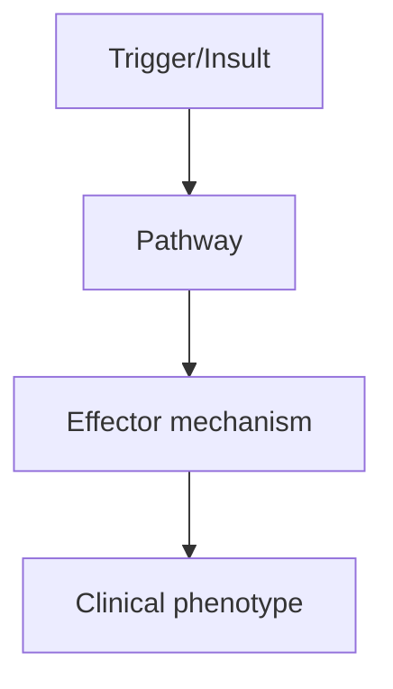
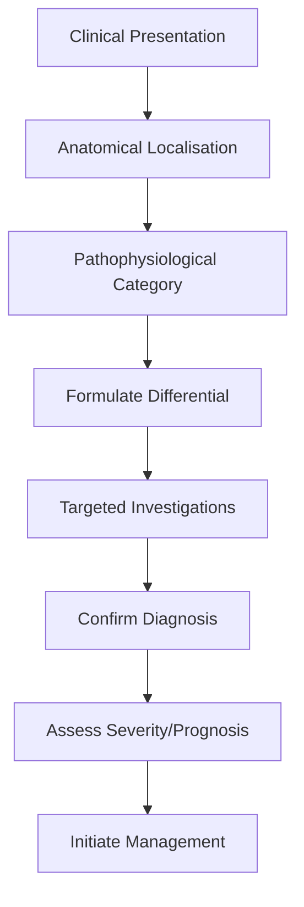
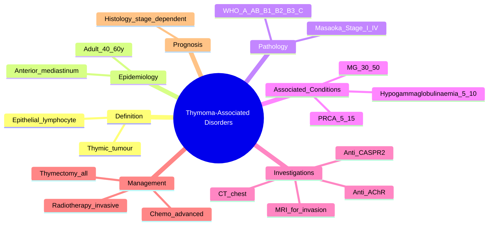

# Thymoma-Associated Disorders

> [!tip] **High-Yield Definition**
> Thymoma-associated disorders: paraneoplastic conditions linked to thymoma. Myasthenia gravis (30-50% thymoma), pure red cell aplasia (PRCA, 5-15%), hypogammaglobulinaemia (Good syndrome, 5-10%), neuromyotonia (Morvan), stiff person syndrome, autoimmune cytopenias, thyroid disease, SLE, RA, lichen planus. Thymoma is the prototype paraneoplastic disorder.

---

## 1. Definition / Epidemiology / Classification

### Definition
Thymoma-associated disorders: paraneoplastic conditions linked to thymoma. Myasthenia gravis (30-50% thymoma), pure red cell aplasia (PRCA, 5-15%), hypogammaglobulinaemia (Good syndrome, 5-10%), neuromyotonia (Morvan), stiff person syndrome, autoimmune cytopenias, thyroid disease, SLE, RA, lichen planus. Thymoma is the prototype paraneoplastic disorder.

### Epidemiology
Thymoma incidence: 0.13/100,000/year. Age: 50-70y. MG: 30-50% have thymoma. Thymoma: 10-15% have MG. PRCA: 5-15% thymoma. Good syndrome: 5-10% thymoma. Neuromyotonia: 20% thymoma. Multiple autoimmune: 30% thymoma has ≥1 autoimmune disease.

### Classification
| Variant | Key Features | Prognosis |
|---------|-------------|-----------|
| | | |

---

## 2. Aetiology / Pathophysiology

### Aetiology
Thymoma: epithelial tumour, often encapsulated, locally invasive, rarely metastasises. WHO classification: A, AB, B1, B2, B3, C (thymic carcinoma). Masaoka staging: I (encapsulated), II (microscopic/macroscopic invasion), III (macroscopic invasion), IV (metastatic). Autoimmunity: CD4+ T cell dysregulation, Treg deficiency, AIRE expression, autoantibody generation. Genetic: GTF2I mutation (most common), TP53, CDKN2A.

### Pathophysiology

---

## 3. Clinical Features

### History
- **Onset/Duration:**
- **Progression:**
- **Key symptoms:**
- **Triggers:**
- **Systemic symptoms:**
- **Drug/Family/Social history:**

### Examination
| Domain | Key Findings | Localisation Value |
|--------|-------------|-------------------|
| | | |

### Specific Clinical Features
Thymoma: often asymptomatic, chest X-ray/CT (anterior mediastinal mass, 50%). Local: cough, chest pain, SVC syndrome, hoarseness (laryngeal nerve), dysphagia. Systemic: paraneoplastic (MG, PRCA, hypogammaglobulinaemia, neuromyotonia, stiff person, autoimmune cytopenias, thyroid, SLE, RA, lichen planus). MG: fatigable weakness, ptosis, diplopia, dysphagia, dysarthria, respiratory. PRCA: anaemia, normal WBC, platelets. Good syndrome: hypogammaglobulinaemia, recurrent infections (sinopulmonary), autoimmune cytopenias. Neuromyotonia: stiffness, fasciculations, cramps, hyperhidrosis. Stiff person: axial rigidity, spasms.

---

## 4. Diagnostic Approach / Algorithm

---

## 5. Investigations

Imaging: chest X-ray (anterior mediastinal mass), CT chest with contrast (thymoma, size, invasion, lymphadenopathy), MRI chest (better soft tissue), PET-CT (staging, distant metastasis). Histology: CT-guided biopsy, surgical biopsy (mediastinoscopy, VATS, open). Staging: PET-CT, MRI. Antibodies: anti-AChR (MG, 90% thymoma MG), anti-MuSK, anti-VGCC (LEMS), anti-VGKC (LGI1, CASPR2 - neuromyotonia), anti-GAD (SPS), anti-CCP, ANA, RF, antiplatelet, anti-neutrophil. Bloods: FBC (PRCA - low retics, macrocytosis), immunoglobulins (low IgG, IgA in Good), autoimmune screen, infection screen. Spirometry: FVC, NIF (MG). EMG: repetitive nerve stimulation (MG, neuromyotonia). NCS/EMG: confirm NMJ, neuropathy. Bone marrow: PRCA (erythroid hypoplasia, normal myelopoiesis, megakaryopoiesis).

---

## 6. Differential Diagnosis

| Differential | Distinguishing Features | Key Test |
|--------------|------------------------|----------|
| | | |

---

## 7. Management

Thymoma: surgery (thymectomy - mainstay, complete resection), stage-dependent. Post-operative: radiotherapy (locally invasive, II+), chemotherapy (advanced, unresectable, metastatic - cisplatin, doxorubicin, cyclophosphamide, CAP regimen). MG: thymectomy (mandatory if thymoma), AChE inhibitors (pyridostigmine, sustained-release), immunosuppression (corticosteroids, azathioprine, MMF, rituximab, eculizumab, IVIG, PLEX). PRCA: thymectomy (50% response), immunosuppression (corticosteroids, cyclosporine, cyclophosphamide, rituximab), danazol, EPO. Good syndrome: IVIG, prophylactic antibiotics, immunisation (avoid live vaccines if on immunosuppression). Neuromyotonia: carbamazepine, IVIG, immunosuppression. Stiff person: diazepam, baclofen, IVIG, rituximab. Multidisciplinary: thoracic surgery, oncology, neurology, haematology, immunology, palliative, OT, PT, dietitian, social, chaplaincy. Follow-up: regular (relapse, second malignancy, autoimmune).

---

## 8. Drug Interactions / Contraindications / Comorbidity Cautions

| Drug | Interaction / Caution | Management |
|------|----------------------|------------|
| | | |

---

## 9. Procedures (if applicable)

### Procedure:
- **Indications:**
- **Contraindications:**
- **Preparation / Principle:**
- **Complications:**
- **Viva Pearls:**

---

## 10. Complications

| Complication | Frequency | Prevention / Monitoring | Management |
|--------------|-----------|------------------------|------------|
| | | | |

---

## 11. Red Flags / Emergencies

SVC syndrome (thymoma, lymphoma), invasive thymoma (SVC, pleura, pericardium, lung, diaphragm, nerve), MG crisis (respiratory failure), PRCA (transfusion-dependent), Good syndrome (severe infections, encapsulated organisms, opportunistic), paraneoplastic (severe, refractory), treatment side effects (immunosuppression: infection, malignancy; chemotherapy: nausea, cytopenias, nephrotoxicity, ototoxicity).

---

## 12. Prognosis

Depends on stage and histology. Thymoma: 5-year survival 80% (I), 70% (II), 50% (III), 30% (IV). Recurrence 10-30% (long-term). Thymic carcinoma: worse (5-year 35%). MG: improved with thymectomy + immunosuppression. PRCA: 50% response to thymectomy, often requires immunosuppression. Good: recurrent infections, poor. New: immunotherapy (PD-1, CTLA-4) - encouraging. Multidisciplinary care essential. Long-term follow-up (relapse, second malignancy).

---

## 13. Topic Correlation

| Related Topic | Link | Key Overlap |
|---------------|------|-------------|
| | | |

---

## 14. Special Situations

| Situation | Consideration |
|-----------|---------------|
| **Pregnancy** | |
| **Lactation** | |
| **Paediatric** | |
| **Elderly / Frail** | |
| **Renal impairment** | |
| **Hepatic impairment** | |
| **Immunocompromised** | |
| **Perioperative** | |
| **Driving / DVLA** | |
| **Occupational** | |

---

## FCPS/MRCP High-Yield Summary

| Category | Key Points |
|----------|------------|
| **Definition** | Thymoma-associated disorders: paraneoplastic conditions linked to thymoma. Myasthenia gravis (30-50% thymoma), pure red cell aplasia (PRCA, 5-15%), hypogammaglobulinaemia (Good syndrome, 5-10%), neuro |
| **Epidemiology** | Thymoma incidence: 0.13/100,000/year. Age: 50-70y. MG: 30-50% have thymoma. Thymoma: 10-15% have MG. PRCA: 5-15% thymoma. Good syndrome: 5-10% thymoma |
| **Pathophysiology** | |
| **Clinical** | Thymoma: often asymptomatic, chest X-ray/CT (anterior mediastinal mass, 50%). Local: cough, chest pain, SVC syndrome, hoarseness (laryngeal nerve), dysphagia. Systemic: paraneoplastic (MG, PRCA, hypog |
| **Diagnosis** | |
| **Investigations** | Imaging: chest X-ray (anterior mediastinal mass), CT chest with contrast (thymoma, size, invasion, lymphadenopathy), MRI chest (better soft tissue), PET-CT (staging, distant metastasis). Histology: CT |
| **Management** | Thymoma: surgery (thymectomy - mainstay, complete resection), stage-dependent. Post-operative: radiotherapy (locally invasive, II+), chemotherapy (advanced, unresectable, metastatic - cisplatin, doxor |
| **Complications** | |
| **Prognosis** | Depends on stage and histology. Thymoma: 5-year survival 80% (I), 70% (II), 50% (III), 30% (IV). Recurrence 10-30% (long-term). Thymic carcinoma: worse (5-year 35%). MG: improved with thymectomy + imm |
| **Viva Pearls** | |
| **Drug Doses** | |
| **Scoring Systems** | |
| **Genetics** | |
| **Imaging Signs** | |

---

## Viva Questions (PACES/FCPS Style)

1. **Q:** Define Thymoma-Associated Disorders and classify its variants.
   **A:** Based on the definition above.

2. **Q:** What are the key clinical features?
   **A:** Thymoma: often asymptomatic, chest X-ray/CT (anterior mediastinal mass, 50%). Local: cough, chest pain, SVC syndrome, hoarseness (laryngeal nerve), dysphagia. Systemic: paraneoplastic (MG, PRCA, hypogammaglobulinaemia, neuromyotonia, stiff person, autoimmune cytopenias, thyroid, SLE, RA, lichen plan

3. **Q:** What is the first-line treatment?
   **A:** Based on the management section.

4. **Q:** What are the red flags requiring urgent referral?
   **A:** SVC syndrome (thymoma, lymphoma), invasive thymoma (SVC, pleura, pericardium, lung, diaphragm, nerve), MG crisis (respiratory failure), PRCA (transfusion-dependent), Good syndrome (severe infections, encapsulated organisms, opportunistic), paraneoplastic (severe, refractory), treatment side effects 

5. **Q:** What is the prognosis?
   **A:** Depends on stage and histology. Thymoma: 5-year survival 80% (I), 70% (II), 50% (III), 30% (IV). Recurrence 10-30% (long-term). Thymic carcinoma: worse (5-year 35%). MG: improved with thymectomy + immunosuppression. PRCA: 50% response to thymectomy, often requires immunosuppression. Good: recurrent 

6. **Q:** How do you differentiate Thymoma-Associated Disorders from key differentials?
   **A:** Clinical features, investigations, and response to treatment.

7. **Q:** What investigations are most useful?
   **A:** Based on the investigations section.

8. **Q:** Describe the stepwise management approach.
   **A:** Based on the management algorithm.

9. **Q:** What are the emergency presentations?
   **A:** Based on the red flags section.

10. **Q:** How does management change in pregnancy/paediatrics/elderly?
    **A:** Special considerations per population.

---

## Common Confusions / Exam Traps

| Confusion | Clarification |
|-----------|---------------|
| | |

---

## Mnemonics
1. **Thymic 3 Ps** = **P**araneoplastic disorders, **P**arathymic syndromes, **P**ost-thymectomy improvement (use: thymoma drives multiple autoimmune conditions)
2. **MG-PRCA-AG** = **M**yasthenia **G**ravis, **P**ure **R**ed **C**ell **A**plasia, **A**gammaglobulinaemia (use: classic thymoma-associated triad)
3. **MAS-HIT** = **M**yasthenia, **A**gammaglobulinaemia, **S**LE, **H**ypo/Hyperthyroid, **I**TP, **T**-cell deficiency (use: other autoimmune associations)
4. **Masaoka stages I-IV** = encapsulated, invasive (pericardium/pleura/lung), into vessels, disseminated (use: thymoma staging)

---

## Mind Map

---

## Spaced Repetition Trackers

| Review Interval | Date | Score (0-5) | Notes |
|-----------------|------|-------------|-------|
| Day 1 | | | |
| Day 3 | | | |
| Day 7 | | | |
| Day 14 | | | |
| Day 30 | | | |
| Day 90 | | | |

---

## Self-Test Scorecard

| Section | Score /5 | Last Attempt |
|---------|----------|--------------|
| Definition & Epidemiology | | | |
| Pathophysiology | | | |
| Clinical Features | | | |
| Investigations | | | |
| Differential | | | |
| Management - Acute | | | |
| Management - Long-term | | | |
| Complications | | | |
| Viva Questions | | | |
| MCQs | | | |
| SBAs | | | |

---

## MCQs (10)

1. **Question:** Thymoma is most commonly located in the:
   **Options:** A. Posterior mediastinum B. Anterior mediastinum (prevascular) C. Middle mediastinum D. Lung apex
   **Answer:** B
   **Explanation:** Thymoma arises in the anterior (prevascular) mediastinum; it is the most common primary anterior mediastinal tumour in adults.
2. **Question:** The MOST COMMON paraneoplastic syndrome associated with thymoma is:
   **Options:** A. LEMS B. Myasthenia gravis C. Polymyositis D. Stiff-person syndrome
   **Answer:** B
   **Explanation:** MG is the most frequent (30–50% of thymoma patients); thymoma is present in 10–15% of MG patients.
3. **Question:** Pure red cell aplasia (PRCA) in a thymoma patient is characterised by:
   **Options:** A. Pancytopenia B. Isolated anaemia with absent reticulocytes and absent erythroid precursors in marrow C. Thrombocytosis D. Leukaemoid reaction
   **Answer:** B
   **Explanation:** PRCA: severe normocytic/normochromic anaemia, low reticulocytes, absent erythroid precursors; other cell lines preserved.
4. **Question:** Acquired hypogammaglobulinaemia in a thymoma patient is best described as:
   **Options:** A. Good syndrome B. CVID unrelated to thymoma C. Multiple myeloma D. Waldenström macroglobulinaemia
   **Answer:** A
   **Explanation:** Good syndrome = thymoma + hypogammaglobulinaemia (acquired CVID-like); recurrent sinopulmonary and opportunistic infections.
5. **Question:** Staging of thymoma by the Masaoka system is based on:
   **Options:** A. Tumour size alone B. Degree of capsular invasion, pleural/pericardial involvement, nodal/distant spread C. Number of mitoses D. WHO histology only
   **Answer:** B
   **Explanation:** Masaoka: I encapsulated; II microscopic/macroscopic capsular invasion; III invasion of neighbouring structures; IV pleural dissemination (a) or nodal/distant (b).
6. **Question:** Best initial imaging for suspected thymoma is:
   **Options:** A. Abdominal ultrasound B. CT chest with contrast (anterior mediastinal mass) C. MRI brain D. Bone scan
   **Answer:** B
   **Explanation:** Contrast CT chest characterises the mass, invasion, and nodal disease; MRI helps with vascular/pericardial invasion.
7. **Question:** Anti-AChR antibodies in a patient with an anterior mediastinal mass strongly suggest:
   **Options:** A. LEMS B. MG with thymoma C. Botulism D. CIDP
   **Answer:** B
   **Explanation:** Anti-AChR positivity with anterior mediastinal mass points to MG associated with thymoma; CT chest is mandatory in MG.
8. **Question:** Definitive treatment of thymoma is:
   **Options:** A. Chemotherapy only B. Radiotherapy only C. Surgical thymectomy (in all resectable cases) ± adjuvant radiotherapy/chemotherapy D. Observation
   **Answer:** C
   **Explanation:** Complete surgical resection is the cornerstone; adjuvant radiotherapy for invasive disease and platinum-based chemotherapy for advanced/recurrent disease.
9. **Question:** Thymoma histology (WHO) that is MOST associated with MG is:
   **Options:** A. B3 (thymic carcinoma) B. B1/B2 (cortical thymoma) C. Type A (medullary) D. Type C only
   **Answer:** B
   **Explanation:** Cortical thymomas (B1, B2) are most strongly associated with MG; medullary (A) and thymic carcinoma (C) less so.
10. **Question:** Good syndrome patients should receive:
    **Options:** A. Routine IVIG and infection prophylaxis B. No infection precautions C. Steroids only D. Plasmapheresis
    **Answer:** A
    **Explanation:** Good syndrome: IVIG replacement, antibiotic prophylaxis, and vaccination reduce severe infections; outcomes remain poor.

---

## SBA Questions (10)

1. **Scenario:** 55-year-old with fatigable weakness, AChR antibody positive, CT chest 4 cm anterior mediastinal mass.
   **Question:** Best management?
   **Options:** A. Pyridostigmine only B. Thymectomy + MG treatment (pyridostigmine ± steroids) C. Plasmapheresis alone D. Radiotherapy only
   **Answer:** B
   **Explanation:** All resectable thymomas require surgical removal plus MG-specific therapy; adjuvant radiotherapy/chemo depends on stage.
2. **Scenario:** Patient post-thymectomy, MG improving. New normocytic anaemia, low reticulocytes, absent erythroid precursors in marrow.
   **Question:** Diagnosis?
   **Options:** A. PRCA (pure red cell aplasia) B. Aplastic anaemia C. Iron deficiency D. B12 deficiency
   **Answer:** A
   **Explanation:** Isolated erythroid aplasia = PRCA; treat with thymectomy (already done), immunosuppression (CsA, steroids), and rituximab.
3. **Scenario:** Thymoma patient with recurrent sinopulmonary and CMV infections; serum immunoglobulins all low.
   **Question:** Diagnosis?
   **Options:** A. Multiple myeloma B. Good syndrome (thymoma + hypogammaglobulinaemia) C. CVID without thymoma D. SCID
   **Answer:** B
   **Explanation:** Good syndrome: thymoma + acquired hypogammaglobulinaemia; treat with IVIG and antimicrobial prophylaxis.
4. **Scenario:** Masaoka stage III thymoma (invasion of pericardium and left brachiocephalic vein).
   **Question:** Standard adjuvant approach?
   **Options:** A. No further therapy B. Adjuvant radiotherapy ± chemotherapy C. Best supportive care only D. Repeat thymectomy
   **Answer:** B
   **Explanation:** Invasive disease (Masaoka III/IV) benefits from adjuvant radiotherapy ± platinum-based chemotherapy.
5. **Scenario:** Thymoma patient with both MG and PRCA; thymectomy performed. Still transfusion-dependent.
   **Question:** Next treatment for PRCA?
   **Options:** A. Cyclosporine or corticosteroids (PRCA often responds to immunosuppression) B. IVIG C. Plasmapheresis D. Splenectomy
   **Answer:** A
   **Explanation:** PRCA after thymectomy often needs immunosuppression: steroids, ciclosporin, azathioprine, or rituximab.
6. **Scenario:** Thymoma patient; pre-op evaluation for MG shows AChR antibody 200 nmol/L; FVC 65% predicted.
   **Question:** Perioperative plan?
   **Options:** A. Proceed without preparation B. Optimise with IVIG/PLEX pre-op, continue pyridostigmine, plan for possible post-op ventilation C. Cancel surgery D. Permanent tracheostomy
   **Answer:** B
   **Explanation:** Optimise respiratory function; pre-op IVIG or PLEX if bulbar/respiratory weakness; continue pyridostigmine and monitor post-op.
7. **Scenario:** Thymoma histology: lymphocytes admixed with epithelial cells; lobulated architecture; bland cytology; WHO classification?
   **Options:** A. Type A (medullary) B. Type B1 (lymphocyte-rich) C. Type B3 (epithelial-rich) D. Type C (thymic carcinoma)
   **Answer:** B
   **Explanation:** Type B1: cortex-like architecture with abundant lymphocytes; B2 has more epithelial cells; B3 is epithelial-rich; A is medullary spindle cell.
8. **Scenario:** Patient with thymoma completes surgery and radiotherapy. Best long-term follow-up?
   **Options:** A. No follow-up B. Periodic CT chest, monitor for recurrence and autoimmune disease (MG, PRCA, hypogammaglobulinaemia) C. Annual PET only D. Symptomatic only
   **Answer:** B
   **Explanation:** Thymomas recur late; follow with periodic CT chest and screen for paraneoplastic syndromes; lifelong MG risk.
9. **Scenario:** Patient with thymoma develops severe weakness; AChR antibody positive; EMG decrement.
   **Question:** Most appropriate acute treatment?
   **Options:** A. Plasmapheresis or IVIG B. Stop pyridostigmine C. Start magnesium IV D. Cease steroids
   **Answer:** A
   **Explanation:** Acute exacerbation/MG crisis: plasma exchange (faster) or IVIG; continue chronic immunomodulation.
10. **Scenario:** Patient with MG has CT chest reported as "no thymoma" but is found to have micro-thymoma at thymectomy.
    **Question:** Explanation?
    **Options:** A. CT missed it B. MG without thymoma is not a real entity C. Thymectomy not required D. Disease cured by pyridostigmine
    **Answer:** A
    **Explanation:** CT may miss small or diffuse thymic abnormalities; in AChR+ generalised MG <65 years, thymectomy is still recommended because of microscopic thymoma/hyperplasia.

---

## Tags
**Tags:** #neurology #NMJ #thymoma #MG #PRCA #Good_syndrome #anterior_mediastinum #paraneoplastic #FCPS #MRCP

---

## Local Navigation
**Heading Hub:** [[../Hub]]  
**Chapter Hierarchy:** [[Davidson Chapter 25 - Neurology Hierarchy]]  
**Chapter MOC:** [[Neurology MOC]]  
**Drug Reference:** [[../00_Index/Neurology Drug Reference]]  
