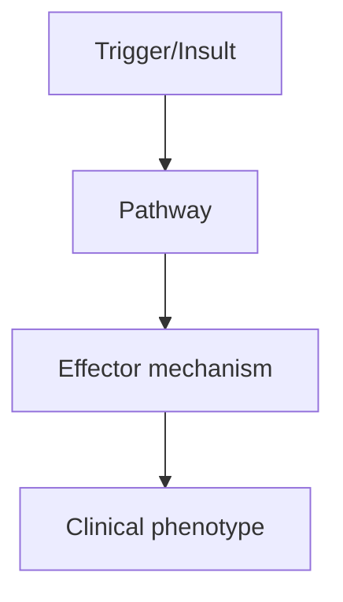
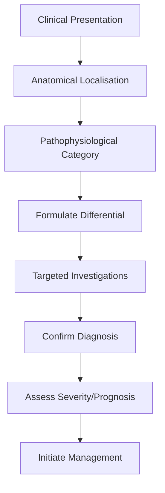
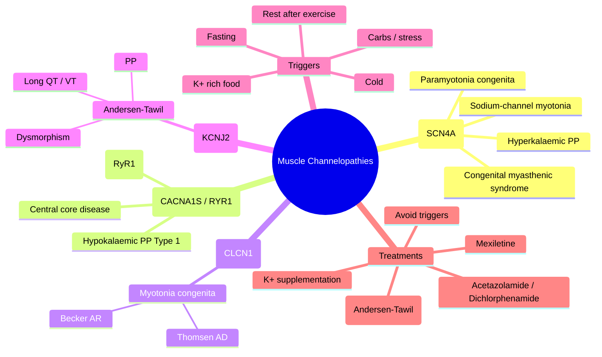

# Channelopathies

> [!tip] **High-Yield Definition**
> Muscle channelopathies: inherited disorders of muscle ion channels. Periodic paralyses (hyperkalaemic, hypokalaemic, Andersen-Tawil), non-dystrophic myotonias (myotonia congenita, paramyotonia congenita, sodium channel myotonia, hyperkalaemic periodic paralysis with myotonia), malignant hyperthermia susceptibility (RYR1, CACNA1S).

---

## 1. Definition / Epidemiology / Classification

### Definition
Muscle channelopathies: inherited disorders of muscle ion channels. Periodic paralyses (hyperkalaemic, hypokalaemic, Andersen-Tawil), non-dystrophic myotonias (myotonia congenita, paramyotonia congenita, sodium channel myotonia, hyperkalaemic periodic paralysis with myotonia), malignant hyperthermia susceptibility (RYR1, CACNA1S).

### Epidemiology
Prevalence: 1-10/100,000. AD inheritance (most). Onset: childhood-young adult. Hyperkalaemic PP: 1/200,000. Hypokalaemic PP: 1/100,000. Myotonia congenita: 1/100,000. Andersen-Tawil: 1/1,000,000. Malignant hyperthermia: 1/10,000-1/50,000.

### Classification
| Variant | Key Features | Prognosis |
|---------|-------------|-----------|
| | | |

---

## 2. Aetiology / Pathophysiology

### Aetiology
Sodium channel (SCN4A): hyperkalaemic periodic paralysis (gain of function, prolonged opening), paramyotonia congenita (impaired inactivation, cold-induced), sodium channel myotonia (mild, no weakness), congenital myasthenic syndrome (SCN4A). Calcium channel (CACNA1S): hypokalaemic periodic paralysis (Type 1, 60%), malignant hyperthermia susceptibility (Type 5). Potassium channel (KCNJ2): Andersen-Tawil syndrome (periodic paralysis, cardiac arrhythmias, dysmorphism). Chloride channel (CLCN1): myotonia congenita (Thomsen - AD, Becker - AR, more severe). RYR1: malignant hyperthermia (also central core disease), King-Denborough syndrome. SCN5A (cardiac, related to Brugada). Pathophysiology: altered excitability, sustained depolarisation, sodium channel inactivation, myotonia or paralysis.

### Pathophysiology

---

## 3. Clinical Features

### History
- **Onset/Duration:**
- **Progression:**
- **Key symptoms:**
- **Triggers:**
- **Systemic symptoms:**
- **Drug/Family/Social history:**

### Examination
| Domain | Key Findings | Localisation Value |
|--------|-------------|-------------------|
| | | |

### Specific Clinical Features
Hyperkalaemic PP: episodes of weakness (minutes to hours), triggered by rest after exercise, cold, fasting, high K+ foods, stress. May have myotonia between attacks. Paramyotonia congenita: cold-induced myotonia that worsens with exercise (paradoxical myotonia), weakness follows. Sodium channel myotonia: myotonia (no weakness), variable severity, myotonia fluctuans, acetazolamide-responsive. Hypokalaemic PP: severe episodes (hours-days), triggered by high carb meals, rest after exercise, stress, cold. Improvement with K+. Andersen-Tawil: PP + cardiac arrhythmias (long QT, ventricular arrhythmias, bid VT) + dysmorphism (short stature, scoliosis, clinodactyly). Myotonia congenita: generalised myotonia, muscle hypertrophy ('Herculean'), warm-up phenomenon, variable severity. Thomsen (AD): mild, early. Becker (AR): more severe, late. Malignant hyperthermia: hypermetabolic crisis with volatile anaesthetics, suxamethonium (masseter spasm, tachycardia, hypercapnia, hyperthermia, rhabdomyolysis).

---

## 4. Diagnostic Approach / Algorithm

---

## 5. Investigations

Clinical: episodic weakness, triggers, myotonia, family history. Bloods: K+ (hypo or hyper during attack), CK (mildly elevated, especially Becker), TFTs (exclude thyroid), glucose. ECG: long QT, ventricular arrhythmias (Andersen-Tawil, periodic paralyses), Brugada-like (SCN4A). EMG: myotonic discharges (high-frequency waxing/waning), fibrillation (PP, post-attack), short exercise test (incremental >40% decrement - PP), long exercise test (CMAP decrement >40% - PP), cooling (paramyotonia). Genetic testing: SCN4A, CACNA1S, KCNJ2, CLCN1, RYR1. Muscle biopsy: usually normal. Caffeine-halothane contracture test (gold standard, old, replaced by genetic). Provocation: K+ load (hyperkalaemic), glucose-insulin (hypokalaemic), cold (paramyotonia).

---

## 6. Differential Diagnosis

| Differential | Distinguishing Features | Key Test |
|--------------|------------------------|----------|
| | | |

---

## 7. Management

Acute: hyperkalaemic PP (mild, K+ 5-5.5: wait, inhale salbutamol 2.5-5mg, calcium gluconate, IV dextrose + insulin if severe; severe: calcium gluconate, insulin/dextrose, haemodialysis), hypokalaemic PP (oral K+ 60-120 mEq, IV K+ 20-40 mEq/h if severe, monitor ECG, avoid hyperkalaemia), paramyotonia (warm, avoid cold), myotonia (move around). Prophylaxis: hyperkalaemic PP (acetazolamide 250-750mg/day, dichlorphenamide, thiazide, avoid high K+), hypokalaemic PP (acetazolamide, thiazide, K+ sparing diuretic, low-carb diet, avoid triggers), Andersen-Tawil (acetazolamide, K+ supplementation, cardiology referral, ICD if VT), paramyotonia (mexiletine 200mg BD-TDS, acetazolamide, avoid cold), myotonia congenita (mexiletine, carbamazepine, phenytoin, lacosamide, ranolazine), sodium channel myotonia (mexiletine, ranolazine). Malignant hyperthermia: avoid volatile + suxamethonium, use IV anaesthetic (TIVA - propofol, ketamine, fentanyl, remifentanil), dantrolene pre-treatment if needed, monitor. Acute MH: stop trigger, dantrolene 2.5mg/kg IV bolus, repeat to 10mg/kg max, active cooling, supportive (ICU, ventilation, treat hyperkalaemia, acidosis, arrhythmia), hydration (urine flow >2ml/kg/h, alkalinisation, monitor CK, AKI). Avoid: triggers. Multidisciplinary: neurologist, cardiologist (Andersen-Tawil), anaesthetist (MH), geneticist, OT, PT, social, palliative.

---

## 8. Drug Interactions / Contraindications / Comorbidity Cautions

| Drug | Interaction / Caution | Management |
|------|----------------------|------------|
| | | |

---

## 9. Procedures (if applicable)

### Procedure:
- **Indications:**
- **Contraindications:**
- **Preparation / Principle:**
- **Complications:**
- **Viva Pearls:**

---

## 10. Complications

| Complication | Frequency | Prevention / Monitoring | Management |
|--------------|-----------|------------------------|------------|
| | | | |

---

## 11. Red Flags / Emergencies

Respiratory failure (rare, severe attack, aspiration), cardiac arrhythmias (Andersen-Tawil, hypokalaemic PP), sudden death (arrhythmia, MH), permanent weakness (progressive myopathy, Andersen-Tawil), anaesthetic emergencies (MH - emergency, AVOID volatile + suxamethonium), K+ disturbances (cardiac, weakness), trauma (falls, myotonic falls), feeding (bulbar, severe).

---

## 12. Prognosis

Variable. Most: normal life expectancy with prophylaxis. Hyperkalaemic PP: usually less severe. Hypokalaemic PP: severe, can be life-threatening, may develop progressive myopathy. Paramyotonia: usually stable. Andersen-Tawil: cardiac arrhythmias - sudden death risk, requires ICD. Myotonia congenita: stable, no weakness, normal life expectancy. MH: life-threatening if triggered, full recovery with prompt treatment, AVOID triggers. Genetic counselling for family. Multidisciplinary care essential. Trigger avoidance. Quality of life variable.

---

## 13. Topic Correlation

| Related Topic | Link | Key Overlap |
|---------------|------|-------------|
| | | |

---

## 14. Special Situations

| Situation | Consideration |
|-----------|---------------|
| **Pregnancy** | |
| **Lactation** | |
| **Paediatric** | |
| **Elderly / Frail** | |
| **Renal impairment** | |
| **Hepatic impairment** | |
| **Immunocompromised** | |
| **Perioperative** | |
| **Driving / DVLA** | |
| **Occupational** | |

---

## FCPS/MRCP High-Yield Summary

| Category | Key Points |
|----------|------------|
| **Definition** | Muscle channelopathies: inherited disorders of muscle ion channels. Periodic paralyses (hyperkalaemic, hypokalaemic, Andersen-Tawil), non-dystrophic myotonias (myotonia congenita, paramyotonia congeni |
| **Epidemiology** | Prevalence: 1-10/100,000. AD inheritance (most). Onset: childhood-young adult. Hyperkalaemic PP: 1/200,000. Hypokalaemic PP: 1/100,000. Myotonia conge |
| **Pathophysiology** | |
| **Clinical** | Hyperkalaemic PP: episodes of weakness (minutes to hours), triggered by rest after exercise, cold, fasting, high K+ foods, stress. May have myotonia between attacks. Paramyotonia congenita: cold-induc |
| **Diagnosis** | |
| **Investigations** | Clinical: episodic weakness, triggers, myotonia, family history. Bloods: K+ (hypo or hyper during attack), CK (mildly elevated, especially Becker), TFTs (exclude thyroid), glucose. ECG: long QT, ventr |
| **Management** | Acute: hyperkalaemic PP (mild, K+ 5-5.5: wait, inhale salbutamol 2.5-5mg, calcium gluconate, IV dextrose + insulin if severe; severe: calcium gluconate, insulin/dextrose, haemodialysis), hypokalaemic  |
| **Complications** | |
| **Prognosis** | Variable. Most: normal life expectancy with prophylaxis. Hyperkalaemic PP: usually less severe. Hypokalaemic PP: severe, can be life-threatening, may develop progressive myopathy. Paramyotonia: usuall |
| **Viva Pearls** | |
| **Drug Doses** | |
| **Scoring Systems** | |
| **Genetics** | |
| **Imaging Signs** | |

---

## Viva Questions (PACES/FCPS Style)

1. **Q:** Define Channelopathies and classify its variants.
   **A:** Based on the definition above.

2. **Q:** What are the key clinical features?
   **A:** Hyperkalaemic PP: episodes of weakness (minutes to hours), triggered by rest after exercise, cold, fasting, high K+ foods, stress. May have myotonia between attacks. Paramyotonia congenita: cold-induced myotonia that worsens with exercise (paradoxical myotonia), weakness follows. Sodium channel myot

3. **Q:** What is the first-line treatment?
   **A:** Based on the management section.

4. **Q:** What are the red flags requiring urgent referral?
   **A:** Respiratory failure (rare, severe attack, aspiration), cardiac arrhythmias (Andersen-Tawil, hypokalaemic PP), sudden death (arrhythmia, MH), permanent weakness (progressive myopathy, Andersen-Tawil), anaesthetic emergencies (MH - emergency, AVOID volatile + suxamethonium), K+ disturbances (cardiac, 

5. **Q:** What is the prognosis?
   **A:** Variable. Most: normal life expectancy with prophylaxis. Hyperkalaemic PP: usually less severe. Hypokalaemic PP: severe, can be life-threatening, may develop progressive myopathy. Paramyotonia: usually stable. Andersen-Tawil: cardiac arrhythmias - sudden death risk, requires ICD. Myotonia congenita:

6. **Q:** How do you differentiate Channelopathies from key differentials?
   **A:** Clinical features, investigations, and response to treatment.

7. **Q:** What investigations are most useful?
   **A:** Based on the investigations section.

8. **Q:** Describe the stepwise management approach.
   **A:** Based on the management algorithm.

9. **Q:** What are the emergency presentations?
   **A:** Based on the red flags section.

10. **Q:** How does management change in pregnancy/paediatrics/elderly?
    **A:** Special considerations per population.

---

## Common Confusions / Exam Traps

| Confusion | Clarification |
|-----------|---------------|
| | |

---

## Mnemonics

1. **"CHANNEL"** = **C**hloride (CLCN1 → myotonia congenita Thomsen AD/Becker AR) · **H**ypokalaemic PP (CACNA1S) · **A**ndersen-Tawil (KCNJ2 + long QT) · **N**a-channel (SCN4A → hyperK PP, paramyotonia, SCM) · **N**emaline ≠ here · **E**xercise-induced (PP) · **L**ong QT (Andersen). **Use:** Classify muscle channelopathies by defective channel.

2. **"SCNA-K Hot"** = **S**CN4A (Na channel) → hyperkalaemic PP, paramyotonia congenita, sodium-channel myotonia (SCM), congenital myasthenic syndrome. **Use:** SCN4A spectrum — gain of function = myotonia/weakness.

3. **"HypoK-CACNA1S, HyperK-SCN4A"** = Hypokalaemic PP — Type 1 = CACNA1S (60%); Type 2 = SCN4A. Hyperkalaemic PP — SCN4A (always). Andersen-Tawil — KCNJ2. **Use:** Genetics of periodic paralyses at the bedside.

---

## Mind Map

---

## Spaced Repetition Trackers

| Topic | Day 1 | Day 3 | Day 7 | Day 14 | Day 30 | Day 90 |
|-------|-------|-------|-------|--------|--------|--------|
| Gene–disease pairs (SCN4A, CACNA1S, CLCN1, KCNJ2, RYR1) | ☐ | ☐ | ☐ | ☐ | ☐ | ☐ |
| Trigger patterns (hyperK vs hypoK PP) | ☐ | ☐ | ☐ | ☐ | ☐ | ☐ |
| EMG findings: myotonic discharges vs long-exercise test | ☐ | ☐ | ☐ | ☐ | ☐ | ☐ |
| Treatment ladder (acetazolamide, mexiletine, K+) | ☐ | ☐ | ☐ | ☐ | ☐ | ☐ |
| Andersen-Tawil triad + ECG features | ☐ | ☐ | ☐ | ☐ | ☐ | ☐ |
| Malignant hyperthermia: triggers + dantrolene | ☐ | ☐ | ☐ | ☐ | ☐ | ☐ |
| Paramyotonia vs myotonia congenita (cold/paradoxical) | ☐ | ☐ | ☐ | ☐ | ☐ | ☐ |

---

## Self-Test Scorecard

| # | Topic | 1 | 2 | 3 | 4 | 5 | Score /5 |
|---|-------|---|---|---|---|---|----------|
| 1 | Gene–phenotype matching | ☐ | ☐ | ☐ | ☐ | ☐ | /5 |
| 2 | Triggers for each PP subtype | ☐ | ☐ | ☐ | ☐ | ☐ | /5 |
| 3 | EMG / long-exercise test interpretation | ☐ | ☐ | ☐ | ☐ | ☐ | /5 |
| 4 | Cardiac features (Andersen-Tawil) | ☐ | ☐ | ☐ | ☐ | ☐ | /5 |
| 5 | Anaesthesia considerations (MH) | ☐ | ☐ | ☐ | ☐ | ☐ | /5 |
| 6 | Acute attack management | ☐ | ☐ | ☐ | ☐ | ☐ | /5 |
| 7 | Preventive therapy | ☐ | ☐ | ☐ | ☐ | ☐ | /5 |
| 8 | Myotonia vs paramyotonia | ☐ | ☐ | ☐ | ☐ | ☐ | /5 |
| 9 | Inheritance / genetic counselling | ☐ | ☐ | ☐ | ☐ | ☐ | /5 |
| 10 | Differential from dystrophy / neuropathy | ☐ | ☐ | ☐ | ☐ | ☐ | /5 |

---

## MCQs (10)

1. **Question:** A 22-year-old man has recurrent episodes of limb weakness lasting 2–6 hours, often after resting following strenuous exercise or eating bananas. Serum potassium during an attack is 6.7 mmol/L. Which gene is most likely mutated?
   **Options:** A. CACNA1S B. SCN4A C. CLCN1 D. KCNJ2
   **Answer:** B
   **Explanation:** SCN4A gain-of-function causes hyperkalaemic periodic paralysis; attacks are brief, precipitated by rest after exercise, cold, fasting, and K+-rich foods.

2. **Question:** A 4-year-old boy with severe, generalised muscle stiffness that improves with repeated activity ("warm-up phenomenon"), muscle hypertrophy, and a CK of 800 U/L inherits the condition in an autosomal recessive pattern. Which gene is defective?
   **Options:** A. SCN4A B. CACNA1S C. CLCN1 D. RYR1
   **Answer:** C
   **Explanation:** Becker disease is the recessive, more severe form of myotonia congenita due to biallelic CLCN1 mutations; warm-up phenomenon and hypertrophy are classic.

3. **Question:** A patient with episodic weakness, short stature, clinodactyly, scoliosis, and a prolonged QTc with bidirectional ventricular tachycardia is most likely to have a mutation in which gene?
   **Options:** A. SCN4A B. CACNA1S C. KCNJ2 D. RYR1
   **Answer:** C
   **Explanation:** Andersen-Tawil syndrome (KCNJ2) = periodic paralysis + ventricular arrhythmias (incl. bidirectional VT) + dysmorphism (short stature, clinodactyly, scoliosis).

4. **Question:** Which of the following best characterises paramyotonia congenita on examination?
   **Options:** A. Myotonia that improves with repeated activity B. Cold-induced stiffness that worsens with exercise (paradoxical myotonia) C. Permanent weakness with no myotonia D. Myotonia confined to the tongue
   **Answer:** B
   **Explanation:** Paradoxical myotonia = stiffness worsens with continued activity (opposite of myotonia congenita) and is precipitated by cold; caused by SCN4A mutations with impaired fast inactivation.

5. **Question:** A patient with hypokalaemic periodic paralysis has had multiple severe attacks provoked by high-carbohydrate meals. Which prophylactic drug reduces attack frequency?
   **Options:** A. Mexiletine B. Acetazolamide C. Sotalol D. Sildenafil
   **Answer:** B
   **Explanation:** Acetazolamide (carbonic anhydrase inhibitor) is first-line prophylaxis for hypokalaemic PP; it also helps hyperkalaemic PP and many non-dystrophic myotonias.

6. **Question:** On EMG, myotonia is recognised by which discharge pattern?
   **Options:** A. Fibrillation potentials at rest B. High-frequency repetitive discharges that wax and wane in amplitude/frequency C. Single fibre jitter on SFEMG D. Myokymic doublets
   **Answer:** B
   **Explanation:** Myotonic discharges are runs of positive sharp waves or fibrillations that wax and wane in amplitude and frequency ("dive-bomber" sound on audio).

7. **Question:** A patient scheduled for elective surgery gives a family history of malignant hyperthermia. Which anaesthetic agent must be avoided?
   **Options:** A. Propofol B. Sevoflurane C. Midazolam D. Fentanyl
   **Answer:** B
   **Explanation:** Volatile anaesthetics (sevoflurane, isoflurane, halothane) and suxamethonium trigger MH; safe agents include propofol, opioids, N₂O, non-depolarising relaxants.

8. **Question:** Which ECG abnormality is part of Andersen-Tawil syndrome?
   **Options:** A. Short QT B. Prolonged QT with prominent U waves C. Delta wave D. Brugada-pattern ST elevation only
   **Answer:** B
   **Explanation:** KCNJ2 loss-of-function causes prolonged QU interval and ventricular arrhythmias including bidirectional VT; some patients also show Brugada-like patterns.

9. **Question:** In the long-exercise test, a CMAP amplitude decrement of >40% after exercise is suggestive of which disorder?
   **Options:** A. Myasthenia gravis B. Lambert-Eaton myasthenic syndrome C. Periodic paralysis D. Polymyositis
   **Answer:** C
   **Explanation:** A >40% decrement in CMAP amplitude after sustained exercise of the abductor digiti minimi is highly suggestive of a periodic paralysis (hyper- or hypokalaemic).

10. **Question:** A 6-year-old presents with delayed motor milestones, hypotonia, and congenital hip dislocation. Muscle biopsy shows well-demarcated central cores devoid of oxidative enzyme activity on NADH staining. Mutation in which gene?
    **Options:** A. SCN4A B. CACNA1S C. CLCN1 D. RYR1
    **Answer:** D
    **Explanation:** Central core disease is caused by RYR1 mutations; these patients are at high risk of malignant hyperthermia and require non-triggering anaesthetic technique.

---

## SBA Questions (10)

1. **Scenario:** A 19-year-old footballer has sudden weakness of both legs after a long match while waiting in the changing room. He had a similar episode last winter. Examination between attacks is normal. Serum K⁺ during an attack is 6.4 mmol/L.
   **Question:** Which single investigation most likely confirms the diagnosis?
   **Options:** A. Muscle biopsy B. Genetic testing for SCN4A C. Anti-HMGCR antibodies D. Acetylcholine receptor antibodies
   **Answer:** B
   **Explanation:** Clinical picture (rest-after-exercise, cold, brief attacks, raised K⁺) is hyperkalaemic periodic paralysis; targeted SCN4A genetic testing confirms the diagnosis.

2. **Scenario:** A 30-year-old woman with genetically confirmed Andersen-Tawil syndrome presents after a syncopal episode while jogging. ECG shows bidirectional ventricular tachycardia. She is on acetazolamide 250 mg BD.
   **Question:** What is the most appropriate next step in management?
   **Options:** A. Increase acetazolamide to 500 mg BD B. Add oral flecainide C. Refer for ICD assessment; consider beta-blocker D. Stop acetazolamide and observe
   **Answer:** C
   **Explanation:** Andersen-Tawil with syncope and bidirectional VT warrants ICD assessment; beta-blockers may help. Acetazolamide treats the PP component but not the arrhythmic risk.

3. **Scenario:** A 7-year-old boy is found to have a pathogenic RYR1 variant after his mother had a malignant-hyperthermia reaction during anaesthesia. He is now scheduled for tonsillectomy.
   **Question:** Which anaesthetic plan is safest?
   **Options:** A. Avoid suxamethonium and volatile agents; use propofol/remifentanil TIVA with air/O₂ B. Use sevoflurane with prophylactic dantrolene C. Spinal anaesthesia only D. Any standard technique with dantrolene standby
   **Answer:** A
   **Explanation:** MH-susceptible patients should receive a "clean" non-triggering anaesthetic (TIVA ± N₂O, opioids, non-depolarising relaxants); volatile agents and suxamethonium must be avoided.

4. **Scenario:** A patient with myotonia congenita (CLCN1) has troublesome generalised stiffness interfering with work. Carbamazepine and phenytoin have failed.
   **Question:** Which is the next most appropriate targeted therapy?
   **Options:** A. Mexiletine B. Pyridostigmine C. 3,4-diaminopyridine D. Edrophonium
   **Answer:** A
   **Explanation:** Mexiletine (a use-dependent Na-channel blocker) is effective for non-dystrophic myotonias including CLCN1 myotonia congenita; caution with cardiac conduction disease.

5. **Scenario:** A 25-year-old man with hypokalaemic periodic paralysis (CACNA1A wait — CACNA1S) wakes at 03:00 unable to move; serum K⁺ is 1.9 mmol/L with ECG U waves.
   **Question:** Which immediate treatment is most appropriate?
   **Options:** A. IV glucose + insulin B. Oral potassium chloride 60 mmol and ECG monitoring, repeat K⁺ C. IV sodium bicarbonate D. Oral acetazolamide 500 mg only
   **Answer:** B
   **Explanation:** Acute hypokalaemic PP attack: oral KCl 30–60 mmol (or IV if severe) with cardiac monitoring; avoid glucose/insulin (worsens hypokalaemia) and avoid bicarbonate.

6. **Scenario:** A patient with paramyotonia congenita asks whether cold weather will trigger attacks.
   **Question:** What is the most accurate advice?
   **Options:** A. Cold has no effect B. Cold worsens myotonia and may provoke prolonged weakness C. Only heat triggers attacks D. Only emotional stress triggers attacks
   **Answer:** B
   **Explanation:** Paramyotonia congenita is uniquely cold-sensitive; cooling provokes stiffness (paradoxical myotonia) and may cause prolonged weakness that does not reverse with rewarming immediately.

7. **Scenario:** A 40-year-old with Andersen-Tawil syndrome is found to have a QTc of 520 ms with non-sustained polymorphic VT on Holter.
   **Question:** What medication should be considered first for arrhythmia prophylaxis?
   **Options:** A. Amiodarone B. Flecainide C. Beta-blocker (e.g. nadolol or propranolol) D. Sotalol
   **Answer:** C
   **Explanation:** Beta-blockers are first-line for Andersen-Tawil ventricular arrhythmias; class IC agents (flecainide) and sotalol carry pro-arrhythmic risk; amiodarone is reserved for refractory cases.

8. **Scenario:** A patient with hyperkalaemic periodic paralysis on acetazolamide develops recurrent renal calculi.
   **Question:** Which is the best alternative for attack prophylaxis?
   **Options:** A. Dichlorphenamide B. Thiazide diuretic C. Sodium bicarbonate D. Allopurinol
   **Answer:** A
   **Explanation:** Dichlorphenamide is another carbonic anhydrase inhibitor with similar efficacy in PP and may be better tolerated; thiazides can provoke hyperkalaemia and worsen attacks.

9. **Scenario:** A 12-year-old girl with severe myotonia congenita (Becker type) requires general anaesthesia for dental extraction.
   **Question:** Which additional perioperative concern is most important?
   **Options:** A. Hyperthermia risk like MH B. Risk of suxamethonium-induced generalised myotonic contracture C. Risk of severe bradycardia from neostigmine D. Risk of malignant hyperkalaemia
   **Answer:** B
   **Explanation:** Suxamethonium (and other depolarising agents) can trigger severe generalised myotonic contracture in non-dystrophic myotonias; avoid suxamethonium and consider preoperative mexiletine for severe stiffness.

10. **Scenario:** A 35-year-old with genetically confirmed hypokalaemic periodic paralysis asks about long-term prognosis.
    **Question:** Which statement is most accurate?
    **Options:** A. Most patients develop progressive permanent proximal myopathy with fixed weakness by middle age B. Attacks always resolve completely with no residual deficit C. Pregnancy eliminates attacks D. Dietary modification has no role
    **Answer:** A
    **Explanation:** Hypokalaemic PP is associated with development of a fixed progressive proximal myopathy in middle age in a substantial proportion of patients; early prophylactic treatment may reduce this risk.

---

## Tags

#neurology #muscle #channelopathies #periodicparalysis #myotonia #malignanthyperthermia #AndersenTawil #FCPS #MRCP #PACES

---

## Local Navigation
**Heading Hub:** [[../Hub]]  
**Chapter Hierarchy:** [[Davidson Chapter 25 - Neurology Hierarchy]]  
**Chapter MOC:** [[Neurology MOC]]  
**Drug Reference:** [[../00_Index/Neurology Drug Reference]]
