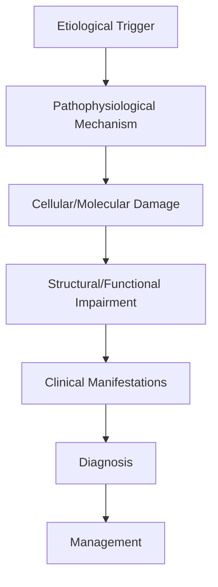
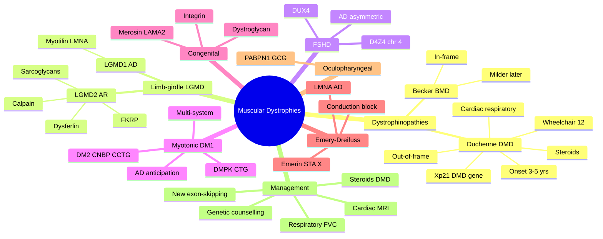

# Muscular Dystrophies

> [!tip] **High-Yield Definition**
> Comprehensive clinical note for Muscular Dystrophies covering definition, epidemiology, aetiology, pathophysiology, clinical features, investigations, differential diagnosis, management, drug interactions, procedures, complications, red flags, prognosis, topic correlation, and special situations for FCPS/MRCP examination preparation based on Davidson 24th Edition Chapter 25: Neurology.

---

## 1. Definition / Epidemiology / Classification

### Definition
Muscular Dystrophies is a neurological disorder within the 10 muscle disorders category. It is characterised by specific clinical, pathological, radiological, and laboratory features that allow differentiation from related conditions.

### Epidemiology
- **Incidence/Prevalence:** Variable depending on the specific condition.
- **Age:** Adult onset is most common, but paediatric and elderly presentations occur.
- **Sex:** Variable depending on the condition.
- **Geography:** Worldwide distribution, with higher prevalence in certain regions.
- **Risk Factors:** Genetic predisposition, environmental factors, comorbidities, family history.

### Classification
| Subtype | Key Features | Prognosis |
|---------|-------------|-----------|
| Mild/early | Subtle symptoms, preserved function | Best |
| Moderate | Clear symptoms, functional impairment | Variable |
| Severe | Significant disability, complications | Worst |

---

## 2. Aetiology / Pathophysiology

### Aetiology
- **Primary (idiopathic):** Most cases have no identifiable cause.
- **Genetic:** May be inherited (AD, AR, X-linked, mitochondrial, sporadic).
- **Autoimmune:** Autoantibodies, immune-mediated inflammation.
- **Infectious:** Viral, bacterial, fungal, parasitic.
- **Metabolic:** Electrolyte, endocrine, hepatic, renal, nutritional.
- **Toxic:** Drugs, alcohol, heavy metals, environmental toxins.
- **Vascular:** Ischaemia, haemorrhage, vasculitis.
- **Neoplastic:** Primary, secondary, paraneoplastic.
- **Traumatic:** Acute, chronic, repetitive.
- **Degenerative:** Neurodegeneration, protein misfolding.

### Pathophysiology


---

## 3. Clinical Features

### History
- **Onset/Duration:** Acute, subacute, or chronic.
- **Progression:** Static, progressive, relapsing-remitting, stepwise.
- **Key symptoms:** Specific to the condition.
- **Triggers:** Stress, infection, trauma, drugs, hormonal, environmental.
- **Systemic symptoms:** Constitutional features.
- **Drug/Family/Social history:** Relevant exposures, comorbidities.

### Examination
| Domain | Key Findings | Localisation Value |
|--------|-------------|-------------------|
| Higher function | Cognitive, behavioural | Cortical, subcortical, limbic |
| Cranial nerves | Pupils, eye movements, facial, bulbar | Brainstem, cranial nerve, NMJ |
| Motor | Weakness, tone, reflexes | UMN, LMN, NMJ, muscle |
| Sensory | All modalities, pattern | Peripheral, spinal, brainstem |
| Coordination | Ataxia, nystagmus, dysmetria | Cerebellar, sensory, vestibular |
| Gait | Spastic, ataxic, parkinsonian | Multiple |
| Autonomic | Orthostatic, sweating, GI, bladder | Autonomic, peripheral, central |

### Specific Clinical Features
The clinical features are determined by the underlying aetiology, location of pathology, and rate of progression. Patients typically present with a constellation of symptoms and signs that allow clinical localisation and subsequent targeted investigation.

---

## 4. Diagnostic Approach / Algorithm

```mermaid
flowchart TD
    A[Clinical Presentation] --> B[Anatomical Localisation]
    B --> C[Pathophysiological Category]
    C --> D[Formulate Differential]
    D --> E[Targeted Investigations]
    E --> F[Confirm Diagnosis]
    F --> G[Assess Severity/Prognosis]
    G --> H[Initiate Management]
    H --> I[Monitor Response]
    I --> J{Response?}
    J --> YES1 [Good - Continue]
    J --> NO1 [Poor - Escalate]
    YES1 --> K[Monitor]
    NO1 --> H
```

---

## 5. Investigations

### First-Line Investigations
- **Blood tests:** FBC, U&Es, LFTs, glucose, calcium, magnesium, ESR, CRP, autoimmune, infection.
- **Imaging:** CT/MRI brain/spine (essential for most neurological conditions).
- **Neurophysiology:** EEG, nerve conduction, EMG, evoked potentials.
- **CSF:** Cell count, protein, glucose, OCBs, PCR, culture.

### Second-Line Investigations
- **Genetic testing:** Gene panels, WES, WGS.
- **Antibody testing:** Antineuronal, autoimmune, paraneoplastic.
- **Biopsy:** Nerve, muscle, brain, skin.
- **Advanced imaging:** PET-CT, MR spectroscopy, fMRI.

### Specialised Investigations
- **Biomarkers:** Neurofilament light chain, tau, beta-amyloid, 14-3-3, RT-QuIC.
- **Autonomic testing:** Head-up tilt, sudomotor, QSART.
- **Neuropsychology:** Cognitive testing, behavioural assessment.
- **Genetic counselling:** Family screening, predictive testing.

---

## 6. Differential Diagnosis

| Differential | Distinguishing Features | Key Test |
|--------------|------------------------|----------|
| Vascular | Sudden onset, focal, vascular risk factors | MRI/CT, vessel imaging |
| Inflammatory | Subacute, multifocal, systemic | MRI, CSF, antibodies |
| Infectious | Fever, systemic, exposure | Bloods, CSF, imaging |
| Neoplastic | Progressive, mass effect | MRI, biopsy |
| Degenerative | Progressive, symmetric, hereditary | MRI, genetic |
| Toxic/Metabolic | Drug history, systemic, reversible | Bloods, toxicology |
| Autoimmune | Multifocal, antibodies, immunotherapy response | Antibodies, MRI, CSF |
| Functional | Inconsistent, distractible | Clinical, video, biomarkers |

---

## 7. Management

### Acute Management
- **Stabilisation:** ABCDE approach, emergency resuscitation.
- **Specific treatment:** Disease-specific interventions.
- **Symptomatic relief:** Pain, seizures, spasticity, autonomic dysfunction.
- **Prevention of complications:** DVT, pressure sores, infection.

### Disease-Modifying Treatment
- **Pharmacological:** First-line, second-line, escalation, maintenance.
- **Procedural:** Surgery, biopsy, drainage, ablation, stimulation.
- **Immunotherapy:** Steroids, IVIG, plasma exchange, immunosuppressants, biologics.
- **Rehabilitation:** Physiotherapy, OT, speech therapy.

### Long-Term Management
- **Monitoring:** Clinical, imaging, biomarkers, side effects.
- **Prevention:** Vaccinations, prophylaxis, lifestyle modification.
- **Supportive care:** Multidisciplinary team, social work, psychological support.
- **Palliative care:** Advanced care planning, end-of-life care, hospice.

---

## 8. Drug Interactions / Contraindications / Comorbidity Cautions

| Drug Class | Interaction / Caution | Management |
|------------|----------------------|------------|
| Antiseizure medications | Enzyme induction, teratogenicity | Monitor, supplement, switch |
| Immunosuppressants | Infection, malignancy, teratogenicity | Monitor, prophylaxis |
| Anticoagulants | Bleeding risk, drug interactions | Monitor INR, avoid combinations |
| Antihypertensives | Hypotension, falls | Monitor BP, adjust dose |
| Antibiotics | Nephrotoxicity, ototoxicity | Monitor renal |
| Antivirals | Nephrotoxicity, neuropsychiatric | Monitor renal, dose adjust |
| Steroids | DM, HTN, osteoporosis, infection | Monitor, prophylaxis, taper |
| Biologics | Infusion reactions, infection | Monitor, prophylaxis |

---

## 9. Procedures

### Common Procedures
- **Lumbar puncture:** Diagnostic, therapeutic (IIH, NPH). Contraindications: raised ICP, mass lesion, coagulopathy.
- **Nerve conduction studies/EMG:** Diagnostic, prognosis. Minor discomfort.
- **EEG:** Diagnostic, monitoring. No significant complications.
- **MRI brain/spine:** Diagnostic, monitoring. Contraindications: pacemaker, metallic implants.
- **CT head:** Emergency, rapid. Radiation exposure, contrast reactions.
- **Biopsy:** Stereotactic, open. Indications: diagnosis, molecular profiling.

---

## 10. Complications

| Complication | Frequency | Prevention | Management |
|--------------|-----------|------------|------------|
| Infection | Common | Hygiene, prophylaxis, vaccination | Antibiotics, antifungals |
| Thrombosis | Common | Prophylaxis, mobility | Anticoagulation |
| Pressure sores | Common | Positioning, nutrition | Wound care, surgery |
| Spasticity | Common | Positioning, stretching | Baclofen, BoNT |
| Contractures | Common | Passive movements, splints | Physiotherapy, surgery |
| Aspiration | Common | Swallow assessment | NGT, PEG, thickeners |
| Falls | Common | Environment, mobility | Walking aids |
| Fractures | Common | Bone health, prevention | Vitamin D, bisphosphonate |
| Depression | Common | Screening, support | Antidepressants, CBT |
| Cognitive decline | Variable | Monitoring, training | Rehabilitation |
| Autonomic dysfunction | Variable | Monitoring, hydration | Midodrine, fludrocortisone |
| Respiratory failure | Variable | Monitoring, supportive | Ventilation, NIV |
| Death | Variable | Monitoring, palliative | End-of-life care |

---

## 11. Red Flags / Emergencies

### Emergency Presentations
- **Rapid neurological deterioration:** New focal deficit, decreased consciousness, seizures.
- **Status epilepticus:** Continuous seizures >5 min.
- **Raised ICP:** Headache, vomiting, papilloedema, altered consciousness.
- **Respiratory failure:** Hypoxia, hypercapnia, ventilatory failure.
- **Cardiac arrest:** Arrhythmia, MI, pulmonary embolism.
- **Infection:** Sepsis, meningitis, abscess, encephalitis.
- **Drug toxicity:** Overdose, side effects, interactions.
- **Haemorrhage:** Intracranial, systemic, coagulopathy.

---

## 12. Prognosis

### Natural History
- **Acute:** May resolve with treatment, may progress, may be fatal.
- **Subacute:** Variable, depends on cause and treatment.
- **Chronic:** Often progressive, may be stable, may have relapses.
- **Recovery:** Variable, may be complete, partial, or none.

### Prognostic Factors
- **Favourable:** Young age, early treatment, mild disease, reversible cause, good premorbid function, family support.
- **Unfavourable:** Older age, delayed treatment, severe disease, irreversible cause, poor premorbid function, comorbidities.

---

## 13. Topic Correlation

| Related Topic | Link | Key Overlap |
|---------------|------|-------------|
| Davidson 24th Ed Chapter 25 | [[Davidson Chapter 25 - Neurology Hierarchy]] | Comprehensive neurology |
| Neurology MOC | [[Neurology MOC]] | All neurology topics |
| Drug Reference | [[../00_Index/Neurology Drug Reference]] | Medications |
| Local Hub | [[../10_Muscle_Disorders/Hub]] | Section-specific |
| Clinical Examination | [[../01_Fundamentals_Examination/Neurological History Taking]] | Clinical approach |
| Investigation | [[../01_Fundamentals_Examination/Neuroimaging (CT-MRI) Principles]] | Imaging |

---

## 14. Special Situations

| Situation | Consideration |
|-----------|---------------|
| **Pregnancy** | Pre-conception counselling, teratogenicity, drug safety, monitoring, delivery planning, breastfeeding. |
| **Lactation** | Drug safety, breastfeeding, monitoring, support. |
| **Paediatric** | Developmental considerations, drug dosing, school, family, vaccination, growth, puberty. |
| **Elderly / Frail** | Comorbidities, polypharmacy, falls, bone health, cognition, social, end-of-life. |
| **Renal impairment** | Drug dose adjustment, monitoring, dialysis, transplant. |
| **Hepatic impairment** | Drug dose adjustment, monitoring, transplant. |
| **Immunocompromised** | Infection prophylaxis, vaccination, drug interactions, malignancy screening. |
| **Perioperative** | Drug management, anaesthesia planning, VTE prophylaxis, infection prevention, monitoring. |
| **Driving / DVLA** | Fitness to drive, restrictions, notification, reassessment. |
| **Occupational** | Fitness for work, adaptations, rehabilitation, disability, return to work. |

---

## FCPS/MRCP High-Yield Summary

| Category | Key Points |
|----------|------------|
| **Definition** | Comprehensive definition with key diagnostic criteria |
| **Epidemiology** | Incidence, prevalence, age, sex, geography, risk factors |
| **Aetiology** | Primary causes, secondary causes, genetic, environmental |
| **Pathophysiology** | Mechanism of disease, cellular/molecular basis |
| **Clinical Features** | History, examination, key findings, variants |
| **Diagnosis** | Diagnostic criteria, classification, severity |
| **Investigations** | First-line, second-line, specialised, biomarkers |
| **Differential Diagnosis** | Key differentials, distinguishing features, tests |
| **Management** | Acute, disease-modifying, symptomatic, supportive |
| **Complications** | Common, serious, prevention, management |
| **Prognosis** | Natural history, prognostic factors, outcomes |
| **Viva Pearls** | Key examination points |
| **Drug Doses** | First-line, second-line, emergency |
| **Scoring Systems** | Specific scores used in management |
| **Genetics** | Inheritance, genes, mutations, family screening |
| **Imaging Signs** | Characteristic findings, differential |

---

## Viva Questions (PACES/FCPS Style)

1. **Q:** Define and classify its variants.
   **A:** Comprehensive definition with classification of subtypes based on aetiology, severity, and clinical features.

2. **Q:** What are the key clinical features?
   **A:** Specific symptoms and signs including onset, progression, key features, and associated findings.

3. **Q:** What is the first-line treatment?
   **A:** First-line pharmacological and non-pharmacological management based on current evidence.

4. **Q:** What are the red flags requiring urgent referral?
   **A:** Specific emergency presentations and complications requiring immediate intervention.

5. **Q:** What is the prognosis?
   **A:** Natural history, prognostic factors, and long-term outcomes.

6. **Q:** How do you differentiate from key differentials?
   **A:** Clinical features, investigations, and response to treatment that distinguish from alternative diagnoses.

7. **Q:** What investigations are most useful?
   **A:** First-line and second-line investigations including imaging, neurophysiology, CSF, and biomarkers.

8. **Q:** Describe the stepwise management approach.
   **A:** Stepwise escalation from first-line to second-line to third-line therapy with monitoring.

9. **Q:** What are the emergency presentations?
   **A:** Specific emergency scenarios and immediate management priorities.

10. **Q:** How does management change in pregnancy/paediatrics/elderly?
    **A:** Special considerations for each population including drug safety, monitoring, and support.

---

## Common Confusions / Exam Traps

| Confusion | Clarification |
|-----------|---------------|
| Similar presentation but different cause | Differentiate by history, examination, investigations |
| Treatment response vs natural history | Assess with objective measures, biomarkers |
| Drug interactions | Check each drug, monitor, adjust doses |
| Disease progression vs treatment failure | Monitor response, escalate appropriately |
| Functional vs organic | Inconsistent, distractible, disability greater than impairment |
| Acute vs chronic | Time course, progression, reversibility |
| Primary vs secondary | Underlying cause, contributing factors |
| Side effects vs symptoms | Temporal relationship, dose relationship |

---

## Mnemonics

1. **"DMD-DEATH"** = **D**ystrophin absent → onset 3–5 yrs; **E**xons 45–50 deletion hot-spot; calf pseudohypertrophy; **A**mbulation lost by ~12; **T**rapped in wheelchair by teens; **H**eart (dilated cardiomyopathy) and respiratory failure by 20s without steroid/ventilation support.
2. **"BMD-Bumps"** = **B**ecker = truncated but partly functional dystrophin → **B**umps into teens/adulthood with milder phenotype and slower progression (in-frame deletion).
3. **"FSHD-Faces"** = **F**acio-**S**capulo-**H**umeral **D**ystrophy = D4Z4 repeat contraction on 4q35 → DUX4 derepression; facial weakness, scapular winging, anterior tibial weakness; autosomal dominant.
4. **"Myotonic-CTG"** = DM1 = **C**TG trinucleotide repeat expansion in DMPK 3'UTR; autosomal dominant with anticipation; multi-system: cataracts, frontal balding, testicular atrophy, cardiac conduction defects.
5. **"EDMD-PACE"** = **E**mery-**D**reifuss = **E**merin (X-linked) or LMNA (AD/AR); humeroperoneal weakness, early contractures, **P**acing required for **A**V **C**onduction block / **E**xpect early death if untreated.

---

## Mind Map



---

## Spaced Repetition Trackers

| Topic | Day 1 | Day 3 | Day 7 | Day 14 | Day 30 | Day 90 |
|-------|-------|-------|-------|--------|--------|--------|
| DMD: X-linked, onset 3-5, Gowers sign, calf pseudohypertrophy | ☐ | ☐ | ☐ | ☐ | ☐ | ☐ |
| BMD vs DMD (in-frame vs out-of-frame) | ☐ | ☐ | ☐ | ☐ | ☐ | ☐ |
| FSHD: D4Z4/DUX4, facial/scapular/asymmetric | ☐ | ☐ | ☐ | ☐ | ☐ | ☐ |
| Myotonic DM1: CTG repeat, anticipation, multi-system | ☐ | ☐ | ☐ | ☐ | ☐ | ☐ |
| LGMD 1 (AD) vs 2 (AR) classification | ☐ | ☐ | ☐ | ☐ | ☐ | ☐ |
| Congenital (merosin / dystroglycan) | ☐ | ☐ | ☐ | ☐ | ☐ | ☐ |
| Emery-Dreifuss: cardiac block → pacemaker/ICD | ☐ | ☐ | ☐ | ☐ | ☐ | ☐ |
| Steroid regimen in DMD (prednisolone / deflazacort) | ☐ | ☐ | ☐ | ☐ | ☐ | ☐ |

---

## Self-Test Scorecard

| # | Topic | 1 | 2 | 3 | 4 | 5 | Score /5 |
|---|-------|---|---|---|---|---|----------|
| 1 | DMD genetics and clinical course | ☐ | ☐ | ☐ | ☐ | ☐ | /5 |
| 2 | BMD differences from DMD | ☐ | ☐ | ☐ | ☐ | ☐ | /5 |
| 3 | LGMD classification (AD vs AR) | ☐ | ☐ | ☐ | ☐ | ☐ | /5 |
| 4 | FSHD features (D4Z4, DUX4) | ☐ | ☐ | ☐ | ☐ | ☐ | /5 |
| 5 | Myotonic dystrophy (DM1/DM2) multi-system | ☐ | ☐ | ☐ | ☐ | ☐ | /5 |
| 6 | Congenital muscular dystrophies | ☐ | ☐ | ☐ | ☐ | ☐ | /5 |
| 7 | Emery-Dreifuss cardiac risk | ☐ | ☐ | ☐ | ☐ | ☐ | /5 |
| 8 | Steroid use in DMD | ☐ | ☐ | ☐ | ☐ | ☐ | /5 |
| 9 | Cardiac and respiratory monitoring | ☐ | ☐ | ☐ | ☐ | ☐ | /5 |
| 10 | Carrier detection and genetic counselling | ☐ | ☐ | ☐ | ☐ | ☐ | /5 |

---

## MCQs (10)

1. **Question:** A 4-year-old boy presents with calf pseudohypertrophy, Gowers' sign, and CK 25,000 U/L; he walks on his toes. Most likely diagnosis?
   **Options:** A. Duchenne muscular dystrophy B. Becker muscular dystrophy C. Myotonic dystrophy D. FSHD
   **Answer:** A
   **Explanation:** DMD presents at 3–5 yrs with proximal weakness, Gowers' sign, calf pseudohypertrophy, very high CK, and toe walking.

2. **Question:** Becker muscular dystrophy differs from Duchenne because the DMD gene mutation is:
   **Options:** A. In-frame, producing a partially functional dystrophin B. Always nonsense C. Mitochondrial D. Autosomal recessive
   **Answer:** A
   **Explanation:** In-frame deletions produce truncated but partly functional dystrophin → milder Becker phenotype with later onset and slower progression.

3. **Question:** Gowers' sign in a child with proximal weakness indicates:
   **Options:** A. Pelvic girdle weakness; patient climbs up legs to stand B. Upper limb cerebellar dysfunction C. Sensory ataxia D. Spasticity
   **Answer:** A
   **Explanation:** Gowers' sign reflects pelvic-girdle/proximal weakness; classic in DMD and other proximal myopathies.

4. **Question:** Which gene is mutated in facioscapulohumeral muscular dystrophy (FSHD type 1)?
   **Options:** A. DUX4 (D4Z4 repeat contraction at 4q35) B. DMD C. DMPK D. LMNA
   **Answer:** A
   **Explanation:** FSHD1 = contraction of D4Z4 macrosatellite repeat on 4q35 → derepression of DUX4; FSHD2 = SMCHD1 mutations with same downstream effect.

5. **Question:** Myotonic dystrophy type 1 (DM1) is caused by:
   **Options:** A. CTG trinucleotide repeat expansion in DMPK B. CGG repeat in FMR1 C. GAA repeat in FXN D. CAG repeat in HTT
   **Answer:** A
   **Explanation:** DM1 = CTG repeat in 3'UTR of DMPK on chr 19; AD with anticipation. DM2 = CCTG repeat in CNBP.

6. **Question:** A 30-year-old man with myotonic dystrophy DM1 attends annual review. Which investigation is most important to monitor?
   **Options:** A. ECG (PR interval, conduction disease) B. Colonoscopy C. DEXA D. LFTs
   **Answer:** A
   **Explanation:** Cardiac conduction disease (PR prolongation, AV block) is a leading cause of death in DM1; annual ECG ± Holter is essential; pacemaker when indicated.

7. **Question:** A neonate presents with hypotonia, multiple contractures, and muscle biopsy showing merosin (laminin α2) deficiency. Most likely diagnosis?
   **Options:** A. Congenital muscular dystrophy type 1A (merosin-deficient) B. Duchenne muscular dystrophy C. Myotonic dystrophy D. Emery-Dreifuss
   **Answer:** A
   **Explanation:** Merosin-deficient CMD (LAMA2) presents with neonatal hypotonia, contractures, and progressive white-matter changes on MRI; often accompanied by epilepsy.

8. **Question:** A patient with X-linked Emery-Dreifuss muscular dystrophy (emerin mutation) requires:
   **Options:** A. Cardiac pacemaker ± ICD for conduction disease B. Statin therapy C. Insulin D. No cardiac follow-up
   **Answer:** A
   **Explanation:** EDMD with emerin or LMNA mutation causes progressive conduction block, ventricular arrhythmias, and sudden death; early pacemaker/ICD is life-saving.

9. **Question:** Which long-term corticosteroid regimen improves muscle strength and prolongs ambulation in DMD?
   **Options:** A. Prednisolone 0.75 mg/kg/day or deflazacort 0.9 mg/kg/day B. Hydrocortisone 10 mg/m²/day C. Dexamethasone 4 mg weekly D. No steroid benefit exists
   **Answer:** A
   **Explanation:** Daily prednisolone (~0.75 mg/kg) or deflazacort prolongs ambulation by ~2–3 years and delays scoliosis and cardiomyopathy.

10. **Question:** Oculopharyngeal muscular dystrophy (OPMD) characteristically presents with:
    **Options:** A. Late-onset ptosis, dysphagia, and limb-girdle weakness B. Childhood onset with severe cardiac involvement C. Myotonia and cataracts D. Infantile hypotonia
    **Answer:** A
    **Explanation:** OPMD — PABPN1 GCG trinucleotide repeat expansion; autosomal dominant; presents in the 5th–6th decade with ptosis, dysphagia, and proximal weakness.

---

## SBA Questions (10)

1. **Scenario:** A 6-year-old boy with DMD is starting corticosteroid therapy.
   **Question:** Which baseline and ongoing monitoring is most important?
   **Options:** A. Baseline DEXA, growth, BP, fasting glucose, cataracts, behaviour B. Baseline CK only C. ECG only D. Sleep study only
   **Answer:** A
   **Explanation:** Long-term steroids require monitoring of growth, BMI, BP, glucose, bone density, behaviour, and cataracts.

2. **Scenario:** A 28-year-old man with FSHD asks about risk to his children.
   **Question:** Most accurate genetic counselling?
   **Options:** A. Autosomal dominant; each child has 50% risk of inheriting the D4Z4 contraction B. All children unaffected C. Only sons inherit D. Risk negligible
   **Answer:** A
   **Explanation:** FSHD1 is autosomal dominant; offspring risk is 50%. Penetrance is high by adulthood.

3. **Scenario:** A 35-year-old woman with myotonic dystrophy DM1 becomes pregnant.
   **Question:** Most important obstetric and anaesthetic consideration?
   **Options:** A. High-risk pregnancy; avoid suxamethonium; monitor for respiratory failure and postpartum haemorrhage; offer prenatal diagnosis for congenital DM1 B. No additional risk C. Caesarean section mandatory D. Steroids required
   **Answer:** A
   **Explanation:** DM1 pregnancy is high risk (anaesthetic sensitivity, postpartum haemorrhage, congenital DM1 in offspring); multidisciplinary care and prenatal diagnosis are indicated.

4. **Scenario:** A 24-year-old with LGMD2A (calpain-3 deficiency) develops progressive proximal weakness.
   **Question:** Most appropriate screening protocol?
   **Options:** A. Annual cardiac echo + ECG, spirometry, CK, genetic confirmation B. No monitoring required C. Colonoscopy only D. MRI brain
   **Answer:** A
   **Explanation:** LGMDs have variable cardiac and respiratory involvement; routine cardiac (ECG/echo) and respiratory (FVC) surveillance is standard.

5. **Scenario:** An asymptomatic 30-year-old woman whose brother has DMD asks about her carrier status.
   **Question:** Most appropriate first-line investigation?
   **Options:** A. CK measurement followed by targeted DMD genetic testing (MLPA) B. Muscle biopsy C. EMG D. MRI brain
   **Answer:** A
   **Explanation:** Female carriers often have raised CK; targeted DMD testing with MLPA / sequencing confirms carrier status.

6. **Scenario:** A 40-year-old with FSHD has new-onset foot drop and progressive ankle weakness.
   **Question:** Most appropriate management?
   **Options:** A. Ankle-foot orthosis, physiotherapy, and consideration of scapular fixation B. Bed rest C. High-dose steroids D. Chemotherapy
   **Answer:** A
   **Explanation:** Tibialis anterior weakness in FSHD is managed conservatively with AFOs and physiotherapy; scapular fixation is considered in selected patients.

7. **Scenario:** A 10-year-old with DMD reports fatigue and daytime somnolence; FVC is 45% predicted.
   **Question:** Most appropriate next step?
   **Options:** A. Polysomnography / overnight oximetry and initiation of nocturnal non-invasive ventilation B. No action required C. Antibiotics only D. High-dose steroids
   **Answer:** A
   **Explanation:** DMD respiratory failure requires NIV once symptomatic hypoventilation appears; polysomnography confirms.

8. **Scenario:** A 50-year-old presents with slowly progressive ptosis, dysphagia, and limb-girdle weakness; family history consistent with autosomal dominant inheritance.
   **Question:** Most likely genetic cause?
   **Options:** A. PABPN1 GCG expansion B. DMD C. FSHD D. DMPK
   **Answer:** A
   **Explanation:** OPMD — GCG trinucleotide expansion in PABPN1 gene.

9. **Scenario:** A 32-year-old with LGMD2I (FKRP mutation) has an LVEF of 35%.
   **Question:** Most appropriate management?
   **Options:** A. Standard heart-failure therapy (ACE-I, beta-blocker); consider transplant evaluation B. No cardiac treatment needed C. Restrict fluids D. Start steroids
   **Answer:** A
   **Explanation:** LGMD2I commonly involves dilated cardiomyopathy; standard heart-failure therapy and transplant assessment are indicated.

10. **Scenario:** A 20-year-old man with BMD is starting a job involving heavy lifting.
    **Question:** Most appropriate advice?
    **Options:** A. Avoid extreme exertion; monitor cardiac function; preserve ambulation B. No restrictions C. Encourage competitive weightlifting D. Limit fluids
    **Answer:** A
    **Explanation:** BMD has cardiac and respiratory risks; heavy exertion may accelerate muscle damage and cardiac decompensation. Occupational advice is essential.

---

## Tags

#neurology #muscle #musculardystrophy #DMD #BMD #FSHD #myotonic #LGMD #EmeryDreifuss #FCPS #MRCP

---

## Local Navigation
**Heading Hub:** [[../Hub]]  
**Chapter Hierarchy:** [[Davidson Chapter 25 - Neurology Hierarchy]]  
**Chapter MOC:** [[Neurology MOC]]  
**Drug Reference:** [[../00_Index/Neurology Drug Reference]]

## PasTest Scenario SBAs (Clinical Vignettes)

> **Auto-generated PasTest/Mediscope-style scenario SBAs** grounded in the authored source. Each scenario tests a real clinical fact (triad, specific sign, contraindication, trial, first-line Rx) extracted from the topic. *Source: Ch 27: Neurology & Stroke — Muscular Dystrophies*

**Q1.** Which of the following features is most specific or characteristic of Muscular Dystrophies?

  - **A.** Key symptoms:
  - **B.** A feature common to many acute inflammatory conditions
  - **C.** A non-specific sign that does not localise the diagnosis
  - **D.** An investigation finding rather than a clinical feature

  > **Answer: A** — Key symptoms:
  >
  > *Source:* - **Key symptoms:** Specific to the condition

**Q2.** What is the most appropriate first-line therapy for Muscular Dystrophies?

  - **A.** Rehabilitation:
  - **B.** An advanced/surgical therapy reserved for refractory disease
  - **C.** Symptomatic treatment only, no disease-modifying therapy
  - **D.** Empiric broad-spectrum therapy without specific indication

  > **Answer: A** — Rehabilitation:
  >
  > *Source:* **Rehabilitation:** Physiotherapy, OT, speech therapy.

