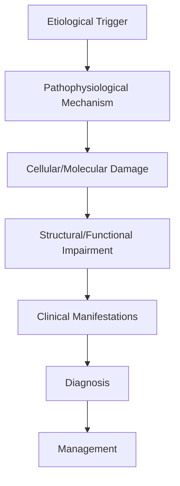
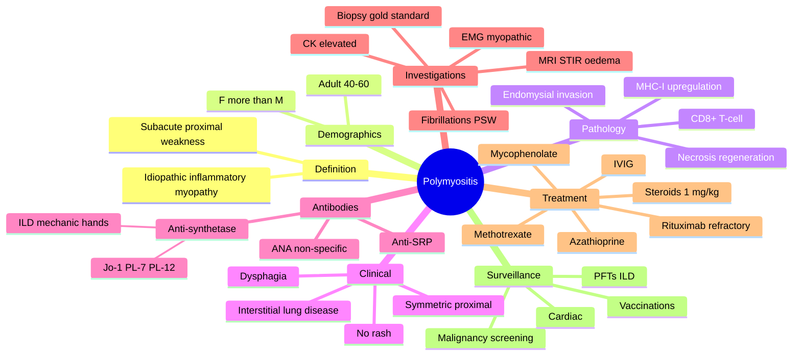

# Polymyositis

> [!tip] **High-Yield Definition**
> Comprehensive clinical note for Polymyositis covering definition, epidemiology, aetiology, pathophysiology, clinical features, investigations, differential diagnosis, management, drug interactions, procedures, complications, red flags, prognosis, topic correlation, and special situations for FCPS/MRCP examination preparation based on Davidson 24th Edition Chapter 25: Neurology.

---

## 1. Definition / Epidemiology / Classification

### Definition
Polymyositis is a neurological disorder within the 10 muscle disorders category. It is characterised by specific clinical, pathological, radiological, and laboratory features that allow differentiation from related conditions.

### Epidemiology
- **Incidence/Prevalence:** Variable depending on the specific condition.
- **Age:** Adult onset is most common, but paediatric and elderly presentations occur.
- **Sex:** Variable depending on the condition.
- **Geography:** Worldwide distribution, with higher prevalence in certain regions.
- **Risk Factors:** Genetic predisposition, environmental factors, comorbidities, family history.

### Classification
| Subtype | Key Features | Prognosis |
|---------|-------------|-----------|
| Mild/early | Subtle symptoms, preserved function | Best |
| Moderate | Clear symptoms, functional impairment | Variable |
| Severe | Significant disability, complications | Worst |

---

## 2. Aetiology / Pathophysiology

### Aetiology
- **Primary (idiopathic):** Most cases have no identifiable cause.
- **Genetic:** May be inherited (AD, AR, X-linked, mitochondrial, sporadic).
- **Autoimmune:** Autoantibodies, immune-mediated inflammation.
- **Infectious:** Viral, bacterial, fungal, parasitic.
- **Metabolic:** Electrolyte, endocrine, hepatic, renal, nutritional.
- **Toxic:** Drugs, alcohol, heavy metals, environmental toxins.
- **Vascular:** Ischaemia, haemorrhage, vasculitis.
- **Neoplastic:** Primary, secondary, paraneoplastic.
- **Traumatic:** Acute, chronic, repetitive.
- **Degenerative:** Neurodegeneration, protein misfolding.

### Pathophysiology


---

## 3. Clinical Features

### History
- **Onset/Duration:** Acute, subacute, or chronic.
- **Progression:** Static, progressive, relapsing-remitting, stepwise.
- **Key symptoms:** Specific to the condition.
- **Triggers:** Stress, infection, trauma, drugs, hormonal, environmental.
- **Systemic symptoms:** Constitutional features.
- **Drug/Family/Social history:** Relevant exposures, comorbidities.

### Examination
| Domain | Key Findings | Localisation Value |
|--------|-------------|-------------------|
| Higher function | Cognitive, behavioural | Cortical, subcortical, limbic |
| Cranial nerves | Pupils, eye movements, facial, bulbar | Brainstem, cranial nerve, NMJ |
| Motor | Weakness, tone, reflexes | UMN, LMN, NMJ, muscle |
| Sensory | All modalities, pattern | Peripheral, spinal, brainstem |
| Coordination | Ataxia, nystagmus, dysmetria | Cerebellar, sensory, vestibular |
| Gait | Spastic, ataxic, parkinsonian | Multiple |
| Autonomic | Orthostatic, sweating, GI, bladder | Autonomic, peripheral, central |

### Specific Clinical Features
The clinical features are determined by the underlying aetiology, location of pathology, and rate of progression. Patients typically present with a constellation of symptoms and signs that allow clinical localisation and subsequent targeted investigation.

---

## 4. Diagnostic Approach / Algorithm

```mermaid
flowchart TD
    A[Clinical Presentation] --> B[Anatomical Localisation]
    B --> C[Pathophysiological Category]
    C --> D[Formulate Differential]
    D --> E[Targeted Investigations]
    E --> F[Confirm Diagnosis]
    F --> G[Assess Severity/Prognosis]
    G --> H[Initiate Management]
    H --> I[Monitor Response]
    I --> J{Response?}
    J --> YES1 [Good - Continue]
    J --> NO1 [Poor - Escalate]
    YES1 --> K[Monitor]
    NO1 --> H
```

---

## 5. Investigations

### First-Line Investigations
- **Blood tests:** FBC, U&Es, LFTs, glucose, calcium, magnesium, ESR, CRP, autoimmune, infection.
- **Imaging:** CT/MRI brain/spine (essential for most neurological conditions).
- **Neurophysiology:** EEG, nerve conduction, EMG, evoked potentials.
- **CSF:** Cell count, protein, glucose, OCBs, PCR, culture.

### Second-Line Investigations
- **Genetic testing:** Gene panels, WES, WGS.
- **Antibody testing:** Antineuronal, autoimmune, paraneoplastic.
- **Biopsy:** Nerve, muscle, brain, skin.
- **Advanced imaging:** PET-CT, MR spectroscopy, fMRI.

### Specialised Investigations
- **Biomarkers:** Neurofilament light chain, tau, beta-amyloid, 14-3-3, RT-QuIC.
- **Autonomic testing:** Head-up tilt, sudomotor, QSART.
- **Neuropsychology:** Cognitive testing, behavioural assessment.
- **Genetic counselling:** Family screening, predictive testing.

---

## 6. Differential Diagnosis

| Differential | Distinguishing Features | Key Test |
|--------------|------------------------|----------|
| Vascular | Sudden onset, focal, vascular risk factors | MRI/CT, vessel imaging |
| Inflammatory | Subacute, multifocal, systemic | MRI, CSF, antibodies |
| Infectious | Fever, systemic, exposure | Bloods, CSF, imaging |
| Neoplastic | Progressive, mass effect | MRI, biopsy |
| Degenerative | Progressive, symmetric, hereditary | MRI, genetic |
| Toxic/Metabolic | Drug history, systemic, reversible | Bloods, toxicology |
| Autoimmune | Multifocal, antibodies, immunotherapy response | Antibodies, MRI, CSF |
| Functional | Inconsistent, distractible | Clinical, video, biomarkers |

---

## 7. Management

### Acute Management
- **Stabilisation:** ABCDE approach, emergency resuscitation.
- **Specific treatment:** Disease-specific interventions.
- **Symptomatic relief:** Pain, seizures, spasticity, autonomic dysfunction.
- **Prevention of complications:** DVT, pressure sores, infection.

### Disease-Modifying Treatment
- **Pharmacological:** First-line, second-line, escalation, maintenance.
- **Procedural:** Surgery, biopsy, drainage, ablation, stimulation.
- **Immunotherapy:** Steroids, IVIG, plasma exchange, immunosuppressants, biologics.
- **Rehabilitation:** Physiotherapy, OT, speech therapy.

### Long-Term Management
- **Monitoring:** Clinical, imaging, biomarkers, side effects.
- **Prevention:** Vaccinations, prophylaxis, lifestyle modification.
- **Supportive care:** Multidisciplinary team, social work, psychological support.
- **Palliative care:** Advanced care planning, end-of-life care, hospice.

---

## 8. Drug Interactions / Contraindications / Comorbidity Cautions

| Drug Class | Interaction / Caution | Management |
|------------|----------------------|------------|
| Antiseizure medications | Enzyme induction, teratogenicity | Monitor, supplement, switch |
| Immunosuppressants | Infection, malignancy, teratogenicity | Monitor, prophylaxis |
| Anticoagulants | Bleeding risk, drug interactions | Monitor INR, avoid combinations |
| Antihypertensives | Hypotension, falls | Monitor BP, adjust dose |
| Antibiotics | Nephrotoxicity, ototoxicity | Monitor renal |
| Antivirals | Nephrotoxicity, neuropsychiatric | Monitor renal, dose adjust |
| Steroids | DM, HTN, osteoporosis, infection | Monitor, prophylaxis, taper |
| Biologics | Infusion reactions, infection | Monitor, prophylaxis |

---

## 9. Procedures

### Common Procedures
- **Lumbar puncture:** Diagnostic, therapeutic (IIH, NPH). Contraindications: raised ICP, mass lesion, coagulopathy.
- **Nerve conduction studies/EMG:** Diagnostic, prognosis. Minor discomfort.
- **EEG:** Diagnostic, monitoring. No significant complications.
- **MRI brain/spine:** Diagnostic, monitoring. Contraindications: pacemaker, metallic implants.
- **CT head:** Emergency, rapid. Radiation exposure, contrast reactions.
- **Biopsy:** Stereotactic, open. Indications: diagnosis, molecular profiling.

---

## 10. Complications

| Complication | Frequency | Prevention | Management |
|--------------|-----------|------------|------------|
| Infection | Common | Hygiene, prophylaxis, vaccination | Antibiotics, antifungals |
| Thrombosis | Common | Prophylaxis, mobility | Anticoagulation |
| Pressure sores | Common | Positioning, nutrition | Wound care, surgery |
| Spasticity | Common | Positioning, stretching | Baclofen, BoNT |
| Contractures | Common | Passive movements, splints | Physiotherapy, surgery |
| Aspiration | Common | Swallow assessment | NGT, PEG, thickeners |
| Falls | Common | Environment, mobility | Walking aids |
| Fractures | Common | Bone health, prevention | Vitamin D, bisphosphonate |
| Depression | Common | Screening, support | Antidepressants, CBT |
| Cognitive decline | Variable | Monitoring, training | Rehabilitation |
| Autonomic dysfunction | Variable | Monitoring, hydration | Midodrine, fludrocortisone |
| Respiratory failure | Variable | Monitoring, supportive | Ventilation, NIV |
| Death | Variable | Monitoring, palliative | End-of-life care |

---

## 11. Red Flags / Emergencies

### Emergency Presentations
- **Rapid neurological deterioration:** New focal deficit, decreased consciousness, seizures.
- **Status epilepticus:** Continuous seizures >5 min.
- **Raised ICP:** Headache, vomiting, papilloedema, altered consciousness.
- **Respiratory failure:** Hypoxia, hypercapnia, ventilatory failure.
- **Cardiac arrest:** Arrhythmia, MI, pulmonary embolism.
- **Infection:** Sepsis, meningitis, abscess, encephalitis.
- **Drug toxicity:** Overdose, side effects, interactions.
- **Haemorrhage:** Intracranial, systemic, coagulopathy.

---

## 12. Prognosis

### Natural History
- **Acute:** May resolve with treatment, may progress, may be fatal.
- **Subacute:** Variable, depends on cause and treatment.
- **Chronic:** Often progressive, may be stable, may have relapses.
- **Recovery:** Variable, may be complete, partial, or none.

### Prognostic Factors
- **Favourable:** Young age, early treatment, mild disease, reversible cause, good premorbid function, family support.
- **Unfavourable:** Older age, delayed treatment, severe disease, irreversible cause, poor premorbid function, comorbidities.

---

## 13. Topic Correlation

| Related Topic | Link | Key Overlap |
|---------------|------|-------------|
| Davidson 24th Ed Chapter 25 | [[Davidson Chapter 25 - Neurology Hierarchy]] | Comprehensive neurology |
| Neurology MOC | [[Neurology MOC]] | All neurology topics |
| Drug Reference | [[../00_Index/Neurology Drug Reference]] | Medications |
| Local Hub | [[../10_Muscle_Disorders/Hub]] | Section-specific |
| Clinical Examination | [[../01_Fundamentals_Examination/Neurological History Taking]] | Clinical approach |
| Investigation | [[../01_Fundamentals_Examination/Neuroimaging (CT-MRI) Principles]] | Imaging |

---

## 14. Special Situations

| Situation | Consideration |
|-----------|---------------|
| **Pregnancy** | Pre-conception counselling, teratogenicity, drug safety, monitoring, delivery planning, breastfeeding. |
| **Lactation** | Drug safety, breastfeeding, monitoring, support. |
| **Paediatric** | Developmental considerations, drug dosing, school, family, vaccination, growth, puberty. |
| **Elderly / Frail** | Comorbidities, polypharmacy, falls, bone health, cognition, social, end-of-life. |
| **Renal impairment** | Drug dose adjustment, monitoring, dialysis, transplant. |
| **Hepatic impairment** | Drug dose adjustment, monitoring, transplant. |
| **Immunocompromised** | Infection prophylaxis, vaccination, drug interactions, malignancy screening. |
| **Perioperative** | Drug management, anaesthesia planning, VTE prophylaxis, infection prevention, monitoring. |
| **Driving / DVLA** | Fitness to drive, restrictions, notification, reassessment. |
| **Occupational** | Fitness for work, adaptations, rehabilitation, disability, return to work. |

---

## FCPS/MRCP High-Yield Summary

| Category | Key Points |
|----------|------------|
| **Definition** | Comprehensive definition with key diagnostic criteria |
| **Epidemiology** | Incidence, prevalence, age, sex, geography, risk factors |
| **Aetiology** | Primary causes, secondary causes, genetic, environmental |
| **Pathophysiology** | Mechanism of disease, cellular/molecular basis |
| **Clinical Features** | History, examination, key findings, variants |
| **Diagnosis** | Diagnostic criteria, classification, severity |
| **Investigations** | First-line, second-line, specialised, biomarkers |
| **Differential Diagnosis** | Key differentials, distinguishing features, tests |
| **Management** | Acute, disease-modifying, symptomatic, supportive |
| **Complications** | Common, serious, prevention, management |
| **Prognosis** | Natural history, prognostic factors, outcomes |
| **Viva Pearls** | Key examination points |
| **Drug Doses** | First-line, second-line, emergency |
| **Scoring Systems** | Specific scores used in management |
| **Genetics** | Inheritance, genes, mutations, family screening |
| **Imaging Signs** | Characteristic findings, differential |

---

## Viva Questions (PACES/FCPS Style)

1. **Q:** Define and classify its variants.
   **A:** Comprehensive definition with classification of subtypes based on aetiology, severity, and clinical features.

2. **Q:** What are the key clinical features?
   **A:** Specific symptoms and signs including onset, progression, key features, and associated findings.

3. **Q:** What is the first-line treatment?
   **A:** First-line pharmacological and non-pharmacological management based on current evidence.

4. **Q:** What are the red flags requiring urgent referral?
   **A:** Specific emergency presentations and complications requiring immediate intervention.

5. **Q:** What is the prognosis?
   **A:** Natural history, prognostic factors, and long-term outcomes.

6. **Q:** How do you differentiate from key differentials?
   **A:** Clinical features, investigations, and response to treatment that distinguish from alternative diagnoses.

7. **Q:** What investigations are most useful?
   **A:** First-line and second-line investigations including imaging, neurophysiology, CSF, and biomarkers.

8. **Q:** Describe the stepwise management approach.
   **A:** Stepwise escalation from first-line to second-line to third-line therapy with monitoring.

9. **Q:** What are the emergency presentations?
   **A:** Specific emergency scenarios and immediate management priorities.

10. **Q:** How does management change in pregnancy/paediatrics/elderly?
    **A:** Special considerations for each population including drug safety, monitoring, and support.

---

## Common Confusions / Exam Traps

| Confusion | Clarification |
|-----------|---------------|
| Similar presentation but different cause | Differentiate by history, examination, investigations |
| Treatment response vs natural history | Assess with objective measures, biomarkers |
| Drug interactions | Check each drug, monitor, adjust doses |
| Disease progression vs treatment failure | Monitor response, escalate appropriately |
| Functional vs organic | Inconsistent, distractible, disability greater than impairment |
| Acute vs chronic | Time course, progression, reversibility |
| Primary vs secondary | Underlying cause, contributing factors |
| Side effects vs symptoms | Temporal relationship, dose relationship |

---

## Mnemonics

1. **"POLYMYO-CK8"** = **P**roximal symmetric **O**nset, adult 40-60, subacute; **LY**mphocytic (CD8+) **M**HC-I **Y**ields fibre invasion; **O**n biopsy **C**D8+ endomysial; CK↑↑. **Use:** Distinguish polymyositis from other inflammatory myopathies.
2. **"ANTI-Jo-1-ASS"** = Anti-synthetase syndrome: **A**rthritis, mechanic **S**kin hands, ILD, Raynaud's, **S**clerodactyly, **F**ever. Anti-Jo-1 = histidyl-tRNA synthetase (most common). **Use:** Recognise the ILD-predominant phenotype.
3. **"PM vs DM"** = **PM** = CD8+ endomysial, no rash, adult; malignancy association less than DM. **DM** = CD4+ perimysial/perivascular, perifascicular atrophy, heliotrope/Gottron rash, malignancy association stronger.

---

## Mind Map



---

## Spaced Repetition Trackers

| Topic | Day 1 | Day 3 | Day 7 | Day 14 | Day 30 | Day 90 |
|-------|-------|-------|-------|--------|--------|--------|
| Polymyositis: CD8+ endomysial, MHC-I upregulation | ☐ | ☐ | ☐ | ☐ | ☐ | ☐ |
| Anti-synthetase (Jo-1) and ILD | ☐ | ☐ | ☐ | ☐ | ☐ | ☐ |
| CK elevation (often >10× ULN) | ☐ | ☐ | ☐ | ☐ | ☐ | ☐ |
| EMG: myopathic + fibrillations + PSW | ☐ | ☐ | ☐ | ☐ | ☐ | ☐ |
| First-line: prednisolone 1 mg/kg | ☐ | ☐ | ☐ | ☐ | ☐ | ☐ |
| Steroid-sparing: MTX / AZA / MMF / IVIG | ☐ | ☐ | ☐ | ☐ | ☐ | ☐ |
| Malignancy screening (less than DM) | ☐ | ☐ | ☐ | ☐ | ☐ | ☐ |
| Dysphagia and aspiration risk | ☐ | ☐ | ☐ | ☐ | ☐ | ☐ |

---

## Self-Test Scorecard

| # | Topic | 1 | 2 | 3 | 4 | 5 | Score /5 |
|---|-------|---|---|---|---|---|----------|
| 1 | Polymyositis clinical presentation | ☐ | ☐ | ☐ | ☐ | ☐ | /5 |
| 2 | Polymyositis vs dermatomyositis | ☐ | ☐ | ☐ | ☐ | ☐ | /5 |
| 3 | Anti-synthetase syndrome features | ☐ | ☐ | ☐ | ☐ | ☐ | /5 |
| 4 | Muscle biopsy findings (CD8+, MHC-I) | ☐ | ☐ | ☐ | ☐ | ☐ | /5 |
| 5 | EMG features (myopathic + fibrillations) | ☐ | ☐ | ☐ | ☐ | ☐ | /5 |
| 6 | CK and other muscle enzymes | ☐ | ☐ | ☐ | ☐ | ☐ | /5 |
| 7 | Initial corticosteroid regimen | ☐ | ☐ | ☐ | ☐ | ☐ | /5 |
| 8 | Steroid-sparing agents | ☐ | ☐ | ☐ | ☐ | ☐ | /5 |
| 9 | Malignancy association & screening | ☐ | ☐ | ☐ | ☐ | ☐ | /5 |
| 10 | Dysphagia and aspiration management | ☐ | ☐ | ☐ | ☐ | ☐ | /5 |

---

## MCQs (10)

1. **Question:** A 48-year-old woman presents with 3 months of progressive proximal upper and lower limb weakness, myalgia, and weight loss. CK is 4,500 U/L. There is no skin rash. Most likely diagnosis?
   **Options:** A. Polymyositis B. Dermatomyositis C. Inclusion body myositis D. Limb-girdle muscular dystrophy
   **Answer:** A
   **Explanation:** Adult-onset subacute proximal weakness with very high CK and no rash = polymyositis. DM would have skin findings; IBM would be more distal/asymmetric.

2. **Question:** The characteristic muscle biopsy finding in polymyositis is:
   **Options:** A. CD8+ T-cell endomysial infiltrate with MHC-I upregulation B. Perifascicular atrophy with CD4+ perimysial infiltrate C. Ragged-red fibres D. Rimmed vacuoles with congophilic inclusions
   **Answer:** A
   **Explanation:** PM = endomysial CD8+ cytotoxic T cells invading non-necrotic fibres with MHC-I upregulation; DM = perifascicular atrophy with perimysial CD4+ infiltrate.

3. **Question:** Which antibody is most strongly associated with anti-synthetase syndrome?
   **Options:** A. Anti-Jo-1 (histidyl-tRNA synthetase) B. Anti-Mi-2 C. Anti-SRP D. Anti-HMGCR
   **Answer:** A
   **Explanation:** Anti-Jo-1 is the most common anti-synthetase antibody; associated with ILD, mechanic hands, arthritis, Raynaud's, fever.

4. **Question:** The first-line treatment for polymyositis is:
   **Options:** A. High-dose oral corticosteroids B. Methotrexate only C. Plasmapheresis D. Bed rest
   **Answer:** A
   **Explanation:** Prednisolone 1 mg/kg/day is first-line; steroid-sparing agents (MTX, AZA, MMF) are added for long-term control.

5. **Question:** Which investigation is most likely to show myopathic units with fibrillations and positive sharp waves in polymyositis?
   **Options:** A. Needle electromyography (EMG) B. Nerve conduction studies only C. Muscle MRI D. Repetitive nerve stimulation
   **Answer:** A
   **Explanation:** EMG in PM shows short-duration, low-amplitude polyphasic motor units with fibrillations and positive sharp waves (muscle membrane irritability).

6. **Question:** Polymyositis is associated with an increased risk of which malignancy?
   **Options:** A. Lung, ovarian, gastric, colorectal, lymphoma (less than DM) B. Breast only C. Thyroid only D. No association
   **Answer:** A
   **Explanation:** PM has a smaller but real malignancy association; risk is highest in dermatomyositis. Standard age-appropriate cancer screening is recommended.

7. **Question:** Which of the following is a recognised steroid-sparing agent for polymyositis?
   **Options:** A. Methotrexate B. Amiodarone C. Beta-interferon D. Penicillin
   **Answer:** A
   **Explanation:** Methotrexate, azathioprine, mycophenolate, cyclosporine, tacrolimus, IVIG, and rituximab are used as steroid-sparing options in PM.

8. **Question:** In a patient with anti-synthetase syndrome, which complication should be screened for at diagnosis and during follow-up?
   **Options:** A. Interstitial lung disease B. Renal cell carcinoma C. Pituitary adenoma D. Hepatic cysts
   **Answer:** A
   **Explanation:** Anti-synthetase antibodies (especially anti-Jo-1, anti-PL-7, anti-PL-12) are strongly associated with ILD; HRCT and PFTs are mandatory.

9. **Question:** Polymyositis differs from inclusion body myositis (IBM) in that IBM characteristically has:
   **Options:** A. Asymmetric finger-flexor and quadriceps weakness, slower progression B. Rash C. Severe myocarditis D. Childhood onset
   **Answer:** A
   **Explanation:** IBM is the most common acquired myopathy over age 50; asymmetric finger-flexor and quadriceps weakness, rimmed vacuoles on biopsy, and poor response to steroids.

10. **Question:** Dysphagia in polymyositis most commonly results from:
    **Options:** A. Involvement of pharyngeal / upper-oesophageal striated muscle B. Oesophageal dysmotility alone C. Cranial nerve X lesion D. Psychogenic cause
    **Answer:** A
    **Explanation:** PM can affect striated pharyngeal muscles, leading to dysphagia and aspiration risk; treatment is of underlying inflammation plus swallow assessment.

---

## SBA Questions (10)

1. **Scenario:** A 55-year-old man with PM has progressive proximal weakness despite 8 weeks of prednisolone 1 mg/kg/day. CK is unchanged.
   **Question:** Most appropriate next step?
   **Options:** A. Add a steroid-sparing agent (methotrexate or azathioprine) B. Stop steroids C. Plasmapheresis only D. Bisphosphonates only
   **Answer:** A
   **Explanation:** Add a steroid-sparing immunosuppressant for steroid-refractory or relapsing PM.

2. **Scenario:** A 50-year-old woman with PM and anti-Jo-1 antibodies presents with progressive dyspnoea and dry cough. SpO₂ 90% on room air.
   **Question:** Most appropriate investigation?
   **Options:** A. HRCT chest and pulmonary function tests B. Echocardiogram C. Colonoscopy D. Sleep study
   **Answer:** A
   **Explanation:** Anti-Jo-1 is associated with ILD; HRCT and PFTs (FVC, DLCO) confirm and quantify lung involvement.

3. **Scenario:** A patient with newly diagnosed PM has no evidence of malignancy on initial CT chest/abdomen/pelvis and age-appropriate screening.
   **Question:** Most appropriate surveillance strategy?
   **Options:** A. Repeat age-appropriate cancer screening annually for at least 3 years B. No further screening C. Colonoscopy every 10 years only D. MRI brain
   **Answer:** A
   **Explanation:** Malignancy risk in PM/DM is highest in the first 3 years after diagnosis; annual age-appropriate screening is recommended.

4. **Scenario:** A 60-year-old with PM has persistent dysphagia with weight loss despite controlled muscle disease.
   **Question:** Most appropriate intervention?
   **Options:** A. Swallow assessment, consider IVIG, dietary modification, feeding tube if needed B. Stop all medications C. Increase steroids only D. PPI monotherapy
   **Answer:** A
   **Explanation:** Dysphagia in PM may respond to IVIG; multidisciplinary swallow assessment and nutritional support are essential; NG/PEG feeding may be needed.

5. **Scenario:** A 48-year-old with PM develops Cushingoid features and steroid-induced diabetes on long-term prednisolone 15 mg/day.
   **Question:** Most appropriate management?
   **Options:** A. Taper steroids and introduce methotrexate or azathioprine B. Continue current dose C. Stop steroids abruptly D. Add growth hormone
   **Answer:** A
   **Explanation:** Gradual taper with addition of a steroid-sparing agent minimises steroid toxicity while maintaining disease control.

6. **Scenario:** A 45-year-old woman with PM develops fever, dry cough, and bilateral ground-glass opacities on HRCT.
   **Question:** Most likely underlying antibody?
   **Options:** A. Anti-Jo-1 B. Anti-Mi-2 C. Anti-SRP D. ANA only
   **Answer:** A
   **Explanation:** Anti-synthetase syndrome (Jo-1 most common) is the leading cause of rapidly progressive ILD in inflammatory myopathy.

7. **Scenario:** A 52-year-old with PM is started on azathioprine.
   **Question:** Most important safety monitoring?
   **Options:** A. TPMT activity before starting, regular FBC and LFTs B. TSH only C. Audiometry D. DEXA only
   **Answer:** A
   **Explanation:** Pre-treatment TPMT activity and regular FBC/LFT monitoring are required for azathioprine to avoid life-threatening myelosuppression.

8. **Scenario:** A patient with PM develops new-onset heart failure with reduced LVEF.
   **Question:** Most appropriate interpretation?
   **Options:** A. Cardiac involvement is uncommon in PM; evaluate for other causes including ischaemic heart disease B. PM always causes this C. Treatment is high-dose steroids only D. No further evaluation needed
   **Answer:** A
   **Explanation:** Cardiac involvement in PM is uncommon but recognised; standard heart-failure workup (ECG, troponin, echo, ischaemia screen) is required.

9. **Scenario:** A 47-year-old with PM achieves clinical remission on methotrexate and asks about vaccinations.
   **Question:** Most appropriate advice?
   **Options:** A. Avoid live vaccines while on immunosuppression; recommend inactivated influenza, pneumococcal, and COVID-19 vaccines B. All live vaccines are safe C. No vaccinations needed D. Annual live attenuated influenza vaccine
   **Answer:** A
   **Explanation:** Live vaccines are contraindicated on immunosuppression; inactivated vaccines are strongly recommended.

10. **Scenario:** A 50-year-old with refractory PM is being considered for rituximab.
    **Question:** Most appropriate pre-treatment screening?
    **Options:** A. Hepatitis B and C serology, HIV, baseline Ig levels, vaccination update B. No screening needed C. Colonoscopy D. EEG
    **Answer:** A
    **Explanation:** Pre-rituximab screening for hepatitis B (reactivation risk), hepatitis C, HIV, baseline immunoglobulins, and vaccination update is mandatory.

---

## Tags

#neurology #muscle #polymyositis #inflammatory #myositis #antisynthetase #Jo1 #FCPS #MRCP

---

## Local Navigation
**Heading Hub:** [[../Hub]]  
**Chapter Hierarchy:** [[Davidson Chapter 25 - Neurology Hierarchy]]  
**Chapter MOC:** [[Neurology MOC]]  
**Drug Reference:** [[../00_Index/Neurology Drug Reference]]

## PasTest Scenario SBAs (Clinical Vignettes)

> **Auto-generated PasTest/Mediscope-style scenario SBAs** grounded in the authored source. Each scenario tests a real clinical fact (triad, specific sign, contraindication, trial, first-line Rx) extracted from the topic. *Source: Ch 27: Neurology & Stroke — Polymyositis*

**Q1.** Which of the following features is most specific or characteristic of Polymyositis?

  - **A.** Key symptoms:
  - **B.** A feature common to many acute inflammatory conditions
  - **C.** A non-specific sign that does not localise the diagnosis
  - **D.** An investigation finding rather than a clinical feature

  > **Answer: A** — Key symptoms:
  >
  > *Source:* - **Key symptoms:** Specific to the condition

**Q2.** What is the most appropriate first-line therapy for Polymyositis?

  - **A.** Rehabilitation:
  - **B.** An advanced/surgical therapy reserved for refractory disease
  - **C.** Symptomatic treatment only, no disease-modifying therapy
  - **D.** Empiric broad-spectrum therapy without specific indication

  > **Answer: A** — Rehabilitation:
  >
  > *Source:* **Rehabilitation:** Physiotherapy, OT, speech therapy.

