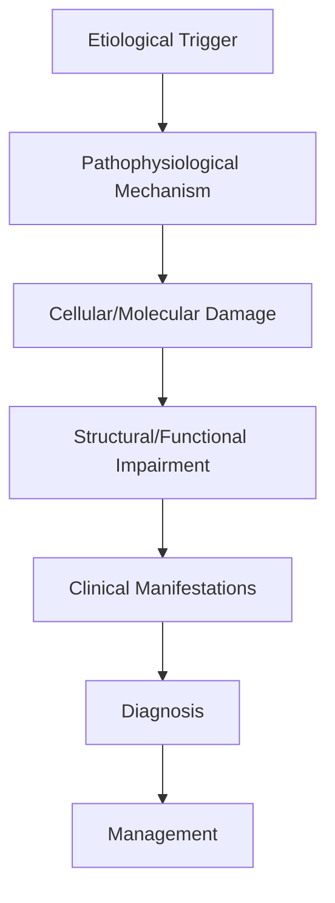
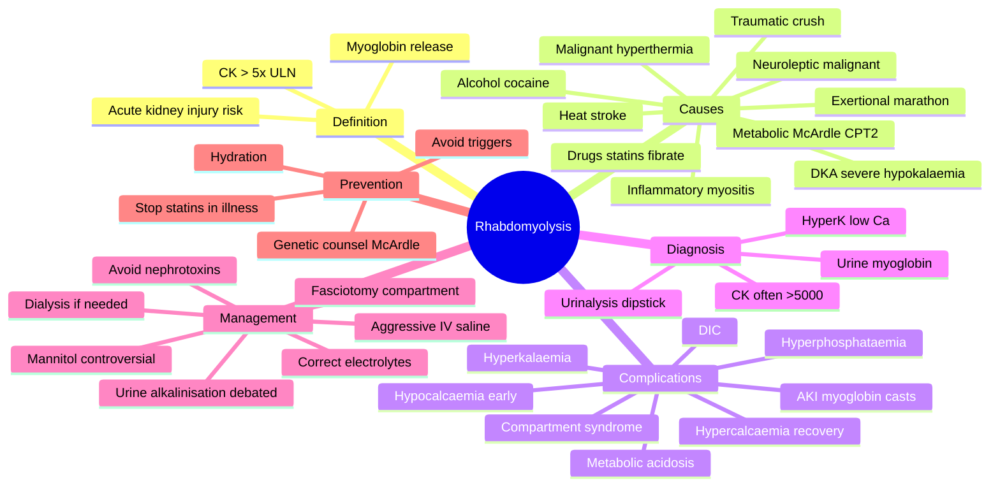

# Rhabdomyolysis

> [!tip] **High-Yield Definition**
> Comprehensive clinical note for Rhabdomyolysis covering definition, epidemiology, aetiology, pathophysiology, clinical features, investigations, differential diagnosis, management, drug interactions, procedures, complications, red flags, prognosis, topic correlation, and special situations for FCPS/MRCP examination preparation based on Davidson 24th Edition Chapter 25: Neurology.

---

## 1. Definition / Epidemiology / Classification

### Definition
Rhabdomyolysis is a neurological disorder within the 10 muscle disorders category. It is characterised by specific clinical, pathological, radiological, and laboratory features that allow differentiation from related conditions.

### Epidemiology
- **Incidence/Prevalence:** Variable depending on the specific condition.
- **Age:** Adult onset is most common, but paediatric and elderly presentations occur.
- **Sex:** Variable depending on the condition.
- **Geography:** Worldwide distribution, with higher prevalence in certain regions.
- **Risk Factors:** Genetic predisposition, environmental factors, comorbidities, family history.

### Classification
| Subtype | Key Features | Prognosis |
|---------|-------------|-----------|
| Mild/early | Subtle symptoms, preserved function | Best |
| Moderate | Clear symptoms, functional impairment | Variable |
| Severe | Significant disability, complications | Worst |

---

## 2. Aetiology / Pathophysiology

### Aetiology
- **Primary (idiopathic):** Most cases have no identifiable cause.
- **Genetic:** May be inherited (AD, AR, X-linked, mitochondrial, sporadic).
- **Autoimmune:** Autoantibodies, immune-mediated inflammation.
- **Infectious:** Viral, bacterial, fungal, parasitic.
- **Metabolic:** Electrolyte, endocrine, hepatic, renal, nutritional.
- **Toxic:** Drugs, alcohol, heavy metals, environmental toxins.
- **Vascular:** Ischaemia, haemorrhage, vasculitis.
- **Neoplastic:** Primary, secondary, paraneoplastic.
- **Traumatic:** Acute, chronic, repetitive.
- **Degenerative:** Neurodegeneration, protein misfolding.

### Pathophysiology


---

## 3. Clinical Features

### History
- **Onset/Duration:** Acute, subacute, or chronic.
- **Progression:** Static, progressive, relapsing-remitting, stepwise.
- **Key symptoms:** Specific to the condition.
- **Triggers:** Stress, infection, trauma, drugs, hormonal, environmental.
- **Systemic symptoms:** Constitutional features.
- **Drug/Family/Social history:** Relevant exposures, comorbidities.

### Examination
| Domain | Key Findings | Localisation Value |
|--------|-------------|-------------------|
| Higher function | Cognitive, behavioural | Cortical, subcortical, limbic |
| Cranial nerves | Pupils, eye movements, facial, bulbar | Brainstem, cranial nerve, NMJ |
| Motor | Weakness, tone, reflexes | UMN, LMN, NMJ, muscle |
| Sensory | All modalities, pattern | Peripheral, spinal, brainstem |
| Coordination | Ataxia, nystagmus, dysmetria | Cerebellar, sensory, vestibular |
| Gait | Spastic, ataxic, parkinsonian | Multiple |
| Autonomic | Orthostatic, sweating, GI, bladder | Autonomic, peripheral, central |

### Specific Clinical Features
The clinical features are determined by the underlying aetiology, location of pathology, and rate of progression. Patients typically present with a constellation of symptoms and signs that allow clinical localisation and subsequent targeted investigation.

---

## 4. Diagnostic Approach / Algorithm

```mermaid
flowchart TD
    A[Clinical Presentation] --> B[Anatomical Localisation]
    B --> C[Pathophysiological Category]
    C --> D[Formulate Differential]
    D --> E[Targeted Investigations]
    E --> F[Confirm Diagnosis]
    F --> G[Assess Severity/Prognosis]
    G --> H[Initiate Management]
    H --> I[Monitor Response]
    I --> J{Response?}
    J --> YES1 [Good - Continue]
    J --> NO1 [Poor - Escalate]
    YES1 --> K[Monitor]
    NO1 --> H
```

---

## 5. Investigations

### First-Line Investigations
- **Blood tests:** FBC, U&Es, LFTs, glucose, calcium, magnesium, ESR, CRP, autoimmune, infection.
- **Imaging:** CT/MRI brain/spine (essential for most neurological conditions).
- **Neurophysiology:** EEG, nerve conduction, EMG, evoked potentials.
- **CSF:** Cell count, protein, glucose, OCBs, PCR, culture.

### Second-Line Investigations
- **Genetic testing:** Gene panels, WES, WGS.
- **Antibody testing:** Antineuronal, autoimmune, paraneoplastic.
- **Biopsy:** Nerve, muscle, brain, skin.
- **Advanced imaging:** PET-CT, MR spectroscopy, fMRI.

### Specialised Investigations
- **Biomarkers:** Neurofilament light chain, tau, beta-amyloid, 14-3-3, RT-QuIC.
- **Autonomic testing:** Head-up tilt, sudomotor, QSART.
- **Neuropsychology:** Cognitive testing, behavioural assessment.
- **Genetic counselling:** Family screening, predictive testing.

---

## 6. Differential Diagnosis

| Differential | Distinguishing Features | Key Test |
|--------------|------------------------|----------|
| Vascular | Sudden onset, focal, vascular risk factors | MRI/CT, vessel imaging |
| Inflammatory | Subacute, multifocal, systemic | MRI, CSF, antibodies |
| Infectious | Fever, systemic, exposure | Bloods, CSF, imaging |
| Neoplastic | Progressive, mass effect | MRI, biopsy |
| Degenerative | Progressive, symmetric, hereditary | MRI, genetic |
| Toxic/Metabolic | Drug history, systemic, reversible | Bloods, toxicology |
| Autoimmune | Multifocal, antibodies, immunotherapy response | Antibodies, MRI, CSF |
| Functional | Inconsistent, distractible | Clinical, video, biomarkers |

---

## 7. Management

### Acute Management
- **Stabilisation:** ABCDE approach, emergency resuscitation.
- **Specific treatment:** Disease-specific interventions.
- **Symptomatic relief:** Pain, seizures, spasticity, autonomic dysfunction.
- **Prevention of complications:** DVT, pressure sores, infection.

### Disease-Modifying Treatment
- **Pharmacological:** First-line, second-line, escalation, maintenance.
- **Procedural:** Surgery, biopsy, drainage, ablation, stimulation.
- **Immunotherapy:** Steroids, IVIG, plasma exchange, immunosuppressants, biologics.
- **Rehabilitation:** Physiotherapy, OT, speech therapy.

### Long-Term Management
- **Monitoring:** Clinical, imaging, biomarkers, side effects.
- **Prevention:** Vaccinations, prophylaxis, lifestyle modification.
- **Supportive care:** Multidisciplinary team, social work, psychological support.
- **Palliative care:** Advanced care planning, end-of-life care, hospice.

---

## 8. Drug Interactions / Contraindications / Comorbidity Cautions

| Drug Class | Interaction / Caution | Management |
|------------|----------------------|------------|
| Antiseizure medications | Enzyme induction, teratogenicity | Monitor, supplement, switch |
| Immunosuppressants | Infection, malignancy, teratogenicity | Monitor, prophylaxis |
| Anticoagulants | Bleeding risk, drug interactions | Monitor INR, avoid combinations |
| Antihypertensives | Hypotension, falls | Monitor BP, adjust dose |
| Antibiotics | Nephrotoxicity, ototoxicity | Monitor renal |
| Antivirals | Nephrotoxicity, neuropsychiatric | Monitor renal, dose adjust |
| Steroids | DM, HTN, osteoporosis, infection | Monitor, prophylaxis, taper |
| Biologics | Infusion reactions, infection | Monitor, prophylaxis |

---

## 9. Procedures

### Common Procedures
- **Lumbar puncture:** Diagnostic, therapeutic (IIH, NPH). Contraindications: raised ICP, mass lesion, coagulopathy.
- **Nerve conduction studies/EMG:** Diagnostic, prognosis. Minor discomfort.
- **EEG:** Diagnostic, monitoring. No significant complications.
- **MRI brain/spine:** Diagnostic, monitoring. Contraindications: pacemaker, metallic implants.
- **CT head:** Emergency, rapid. Radiation exposure, contrast reactions.
- **Biopsy:** Stereotactic, open. Indications: diagnosis, molecular profiling.

---

## 10. Complications

| Complication | Frequency | Prevention | Management |
|--------------|-----------|------------|------------|
| Infection | Common | Hygiene, prophylaxis, vaccination | Antibiotics, antifungals |
| Thrombosis | Common | Prophylaxis, mobility | Anticoagulation |
| Pressure sores | Common | Positioning, nutrition | Wound care, surgery |
| Spasticity | Common | Positioning, stretching | Baclofen, BoNT |
| Contractures | Common | Passive movements, splints | Physiotherapy, surgery |
| Aspiration | Common | Swallow assessment | NGT, PEG, thickeners |
| Falls | Common | Environment, mobility | Walking aids |
| Fractures | Common | Bone health, prevention | Vitamin D, bisphosphonate |
| Depression | Common | Screening, support | Antidepressants, CBT |
| Cognitive decline | Variable | Monitoring, training | Rehabilitation |
| Autonomic dysfunction | Variable | Monitoring, hydration | Midodrine, fludrocortisone |
| Respiratory failure | Variable | Monitoring, supportive | Ventilation, NIV |
| Death | Variable | Monitoring, palliative | End-of-life care |

---

## 11. Red Flags / Emergencies

### Emergency Presentations
- **Rapid neurological deterioration:** New focal deficit, decreased consciousness, seizures.
- **Status epilepticus:** Continuous seizures >5 min.
- **Raised ICP:** Headache, vomiting, papilloedema, altered consciousness.
- **Respiratory failure:** Hypoxia, hypercapnia, ventilatory failure.
- **Cardiac arrest:** Arrhythmia, MI, pulmonary embolism.
- **Infection:** Sepsis, meningitis, abscess, encephalitis.
- **Drug toxicity:** Overdose, side effects, interactions.
- **Haemorrhage:** Intracranial, systemic, coagulopathy.

---

## 12. Prognosis

### Natural History
- **Acute:** May resolve with treatment, may progress, may be fatal.
- **Subacute:** Variable, depends on cause and treatment.
- **Chronic:** Often progressive, may be stable, may have relapses.
- **Recovery:** Variable, may be complete, partial, or none.

### Prognostic Factors
- **Favourable:** Young age, early treatment, mild disease, reversible cause, good premorbid function, family support.
- **Unfavourable:** Older age, delayed treatment, severe disease, irreversible cause, poor premorbid function, comorbidities.

---

## 13. Topic Correlation

| Related Topic | Link | Key Overlap |
|---------------|------|-------------|
| Davidson 24th Ed Chapter 25 | [[Davidson Chapter 25 - Neurology Hierarchy]] | Comprehensive neurology |
| Neurology MOC | [[Neurology MOC]] | All neurology topics |
| Drug Reference | [[../00_Index/Neurology Drug Reference]] | Medications |
| Local Hub | [[../10_Muscle_Disorders/Hub]] | Section-specific |
| Clinical Examination | [[../01_Fundamentals_Examination/Neurological History Taking]] | Clinical approach |
| Investigation | [[../01_Fundamentals_Examination/Neuroimaging (CT-MRI) Principles]] | Imaging |

---

## 14. Special Situations

| Situation | Consideration |
|-----------|---------------|
| **Pregnancy** | Pre-conception counselling, teratogenicity, drug safety, monitoring, delivery planning, breastfeeding. |
| **Lactation** | Drug safety, breastfeeding, monitoring, support. |
| **Paediatric** | Developmental considerations, drug dosing, school, family, vaccination, growth, puberty. |
| **Elderly / Frail** | Comorbidities, polypharmacy, falls, bone health, cognition, social, end-of-life. |
| **Renal impairment** | Drug dose adjustment, monitoring, dialysis, transplant. |
| **Hepatic impairment** | Drug dose adjustment, monitoring, transplant. |
| **Immunocompromised** | Infection prophylaxis, vaccination, drug interactions, malignancy screening. |
| **Perioperative** | Drug management, anaesthesia planning, VTE prophylaxis, infection prevention, monitoring. |
| **Driving / DVLA** | Fitness to drive, restrictions, notification, reassessment. |
| **Occupational** | Fitness for work, adaptations, rehabilitation, disability, return to work. |

---

## FCPS/MRCP High-Yield Summary

| Category | Key Points |
|----------|------------|
| **Definition** | Comprehensive definition with key diagnostic criteria |
| **Epidemiology** | Incidence, prevalence, age, sex, geography, risk factors |
| **Aetiology** | Primary causes, secondary causes, genetic, environmental |
| **Pathophysiology** | Mechanism of disease, cellular/molecular basis |
| **Clinical Features** | History, examination, key findings, variants |
| **Diagnosis** | Diagnostic criteria, classification, severity |
| **Investigations** | First-line, second-line, specialised, biomarkers |
| **Differential Diagnosis** | Key differentials, distinguishing features, tests |
| **Management** | Acute, disease-modifying, symptomatic, supportive |
| **Complications** | Common, serious, prevention, management |
| **Prognosis** | Natural history, prognostic factors, outcomes |
| **Viva Pearls** | Key examination points |
| **Drug Doses** | First-line, second-line, emergency |
| **Scoring Systems** | Specific scores used in management |
| **Genetics** | Inheritance, genes, mutations, family screening |
| **Imaging Signs** | Characteristic findings, differential |

---

## Viva Questions (PACES/FCPS Style)

1. **Q:** Define and classify its variants.
   **A:** Comprehensive definition with classification of subtypes based on aetiology, severity, and clinical features.

2. **Q:** What are the key clinical features?
   **A:** Specific symptoms and signs including onset, progression, key features, and associated findings.

3. **Q:** What is the first-line treatment?
   **A:** First-line pharmacological and non-pharmacological management based on current evidence.

4. **Q:** What are the red flags requiring urgent referral?
   **A:** Specific emergency presentations and complications requiring immediate intervention.

5. **Q:** What is the prognosis?
   **A:** Natural history, prognostic factors, and long-term outcomes.

6. **Q:** How do you differentiate from key differentials?
   **A:** Clinical features, investigations, and response to treatment that distinguish from alternative diagnoses.

7. **Q:** What investigations are most useful?
   **A:** First-line and second-line investigations including imaging, neurophysiology, CSF, and biomarkers.

8. **Q:** Describe the stepwise management approach.
   **A:** Stepwise escalation from first-line to second-line to third-line therapy with monitoring.

9. **Q:** What are the emergency presentations?
   **A:** Specific emergency scenarios and immediate management priorities.

10. **Q:** How does management change in pregnancy/paediatrics/elderly?
    **A:** Special considerations for each population including drug safety, monitoring, and support.

---

## Common Confusions / Exam Traps

| Confusion | Clarification |
|-----------|---------------|
| Similar presentation but different cause | Differentiate by history, examination, investigations |
| Treatment response vs natural history | Assess with objective measures, biomarkers |
| Drug interactions | Check each drug, monitor, adjust doses |
| Disease progression vs treatment failure | Monitor response, escalate appropriately |
| Functional vs organic | Inconsistent, distractible, disability greater than impairment |
| Acute vs chronic | Time course, progression, reversibility |
| Primary vs secondary | Underlying cause, contributing factors |
| Side effects vs symptoms | Temporal relationship, dose relationship |

---

## Mnemonics

1. **"CK-5 Big Drop"** = **CK > 5 × ULN** (typically >1,000 U/L) plus **B**rown "drop" of urine (cola-coloured, dipstick positive for blood without RBCs = myoglobinuria). Electrolyte **D**isturbances: ↑K⁺, ↓Ca²⁺, ↑PO₄³⁻, ↑urate, metabolic acidosis.
2. **"7 Ts of Causes"** = **T**rauma/crush, **T**oxin (statins, alcohol, cocaine, colchicine), **T**ension (exertion), **T**emperature (heat stroke, malignant hyperthermia, NMS), **T**hryoid (hypothyroidism), **T**hrombosis/ischaemia, **T**issue (metabolic myopathy, inflammatory myositis, infection).
3. **"ABCDE-Fluid"** = **A**ggressive isotonic crystalloid, **B**icarbonate controversial, **C**heck K⁺/Ca²⁺/PO₄/urate, **D**iuresis target 200–300 mL/h, **E**xtracorporeal (dialysis) for refractory AKI / hyperK / acidosis.

---

## Mind Map



---

## Spaced Repetition Trackers

| Topic | Day 1 | Day 3 | Day 7 | Day 14 | Day 30 | Day 90 |
|-------|-------|-------|-------|--------|--------|--------|
| Diagnostic threshold: CK >5 × ULN / >1,000 U/L | ☐ | ☐ | ☐ | ☐ | ☐ | ☐ |
| Myoglobinuria and AKI mechanism | ☐ | ☐ | ☐ | ☐ | ☐ | ☐ |
| Common causes (crush, statins, exercise) | ☐ | ☐ | ☐ | ☐ | ☐ | ☐ |
| Electrolyte abnormalities (K, Ca, PO4) | ☐ | ☐ | ☐ | ☐ | ☐ | ☐ |
| Treatment: aggressive IV crystalloid | ☐ | ☐ | ☐ | ☐ | ☐ | ☐ |
| Urine alkalinisation / mannitol controversy | ☐ | ☐ | ☐ | ☐ | ☐ | ☐ |
| Compartment syndrome recognition | ☐ | ☐ | ☐ | ☐ | ☐ | ☐ |
| DIC association and monitoring | ☐ | ☐ | ☐ | ☐ | ☐ | ☐ |

---

## Self-Test Scorecard

| # | Topic | 1 | 2 | 3 | 4 | 5 | Score /5 |
|---|-------|---|---|---|---|---|----------|
| 1 | Diagnostic criteria for rhabdomyolysis | ☐ | ☐ | ☐ | ☐ | ☐ | /5 |
| 2 | Common causes (drugs, trauma, metabolic) | ☐ | ☐ | ☐ | ☐ | ☐ | /5 |
| 3 | Pathophysiology of myoglobinuric AKI | ☐ | ☐ | ☐ | ☐ | ☐ | /5 |
| 4 | Electrolyte complications (K, Ca, PO4) | ☐ | ☐ | ☐ | ☐ | ☐ | /5 |
| 5 | Fluid resuscitation strategy | ☐ | ☐ | ☐ | ☐ | ☐ | /5 |
| 6 | Urine alkalinisation and mannitol evidence | ☐ | ☐ | ☐ | ☐ | ☐ | /5 |
| 7 | Dialysis indications in rhabdomyolysis | ☐ | ☐ | ☐ | ☐ | ☐ | /5 |
| 8 | Compartment syndrome diagnosis and management | ☐ | ☐ | ☐ | ☐ | ☐ | /5 |
| 9 | Malignant hyperthermia recognition and dantrolene | ☐ | ☐ | ☐ | ☐ | ☐ | /5 |
| 10 | Prevention in recurrent metabolic cases | ☐ | ☐ | ☐ | ☐ | ☐ | /5 |

---

## MCQs (10)

1. **Question:** The most widely used diagnostic threshold for rhabdomyolysis is:
   **Options:** A. CK >5 × upper limit of normal (typically >1,000 U/L) with muscle injury B. CK >100 U/L C. AST >500 U/L D. Any detectable myoglobinuria
   **Answer:** A
   **Explanation:** Standard definition is CK >5× ULN (~1,000 U/L) in the context of muscle injury. Lower CK can still be clinically significant; very high CK (>5,000) markedly increases AKI risk.

2. **Question:** A patient with bilateral crush injuries of both legs is at greatest risk of which life-threatening complication within 24 hours?
   **Options:** A. Hyperkalaemia-induced cardiac arrhythmia B. Hypoglycaemia C. Hypocalcaemia-induced tetany D. Anaemia
   **Answer:** A
   **Explanation:** Massive release of intracellular K⁺ causes severe hyperkalaemia and risk of ventricular arrhythmia; ECG monitoring and urgent treatment are essential.

3. **Question:** The most important initial treatment for acute rhabdomyolysis to prevent AKI is:
   **Options:** A. Aggressive intravenous crystalloid resuscitation B. Oral fluids only C. Loop diuretic monotherapy D. Platelet transfusion
   **Answer:** A
   **Explanation:** Early, aggressive isotonic crystalloid (1–2 L/h initially, titrated to urine output >200 mL/h) reduces intratubular cast formation and AKI risk.

4. **Question:** Which class of drugs is a well-recognised cause of rhabdomyolysis?
   **Options:** A. HMG-CoA reductase inhibitors (statins), particularly with fibrates B. Proton pump inhibitors C. SSRIs alone D. Topical corticosteroids
   **Answer:** A
   **Explanation:** Statins (especially with fibrates, CYP3A4 inhibitors, hypothyroidism, or acute illness) are a common cause; baseline and follow-up CK is recommended.

5. **Question:** Urine dipstick is positive for "blood" but microscopy shows no RBCs. This indicates:
   **Options:** A. Myoglobinuria B. Haematuria C. UTI D. Glucosuria
   **Answer:** A
   **Explanation:** Myoglobin cross-reacts with the dipstick haem peroxidase; absence of RBCs on microscopy confirms myoglobinuria, which should prompt CK measurement.

6. **Question:** Malignant hyperthermia is most commonly triggered by:
   **Options:** A. Volatile anaesthetics (e.g., sevoflurane) and suxamethonium B. Propofol C. Opioids D. Local anaesthetic infiltration
   **Answer:** A
   **Explanation:** Volatile agents and suxamethonium trigger MH via RyR1 receptor; treat immediately with dantrolene and cooling.

7. **Question:** Most appropriate acute treatment for malignant hyperthermia is:
   **Options:** A. Dantrolene 2.5 mg/kg IV bolus, repeat as needed, plus cooling B. Naloxone C. Insulin infusion D. Mannitol
   **Answer:** A
   **Explanation:** Dantrolene blocks sarcoplasmic Ca²⁺ release via RyR1; immediate administration is life-saving. Discontinue trigger agents, cool, treat hyperK and acidosis.

8. **Question:** Compartment syndrome in rhabdomyolysis is best diagnosed by:
   **Options:** A. Clinical assessment plus compartment pressure measurement (ΔP <30 mmHg) B. MRI brain C. Lumbar puncture D. Serum CK alone
   **Answer:** A
   **Explanation:** Suspect with pain out of proportion, tense compartment, pain on passive stretch; confirm with compartment pressure monitoring. ΔP (diastolic BP – compartment pressure) <30 mmHg is the surgical threshold.

9. **Question:** In rhabdomyolysis, early hypocalcaemia occurs primarily because:
   **Options:** A. Calcium is deposited in damaged muscle B. Parathyroid hormone is elevated C. Vitamin D is reduced acutely D. Renal calcium loss
   **Answer:** A
   **Explanation:** Calcium deposits in injured myofibres; a rebound hypercalcaemia may occur during recovery, especially if calcium was given early.

10. **Question:** The "crush syndrome" classically describes rhabdomyolysis following:
    **Options:** A. Prolonged compression of limbs (earthquakes, entrapment) B. Acute viral myositis C. Statin-induced muscle injury D. Neuroleptic malignant syndrome
    **Answer:** A
    **Explanation:** Crush syndrome = prolonged limb compression → reperfusion injury, AKI, shock; field triage with pre-hospital IV fluids improves outcomes (e.g., Marmara earthquake data).

---

## SBA Questions (10)

1. **Scenario:** A 25-year-old is brought in after being trapped under rubble for 8 hours. He is hypotensive; both legs are crushed; urine is dark brown; CK 65,000 U/L; K⁺ 6.8 mmol/L.
   **Question:** Most appropriate immediate management?
   **Options:** A. Aggressive IV isotonic saline, treat hyperkalaemia, monitor urine output, evaluate for fasciotomy B. Oral fluids only C. Loop diuretic only D. Platelet transfusion
   **Answer:** A
   **Explanation:** Aggressive fluid resuscitation, urgent hyperkalaemia management (insulin/dextrose, calcium), monitor for compartment syndrome and AKI.

2. **Scenario:** A patient on simvastatin + fenofibrate develops myalgia, dark urine, and CK 18,000 U/L.
   **Question:** Most appropriate next step?
   **Options:** A. Stop both drugs; aggressive IV fluids; check renal function and electrolytes B. Add another statin C. Continue both D. Aspirin only
   **Answer:** A
   **Explanation:** Statin-fibrate combination has high rhabdomyolysis risk; stop offending drugs, fluid resuscitate, monitor for AKI.

3. **Scenario:** A 35-year-old marathon runner presents with severe thigh pain, dark urine, CK 25,000 U/L, creatinine 180 µmol/L after a race in hot weather.
   **Question:** Most likely underlying contributor?
   **Options:** A. Exertional heat stroke / exercise-induced rhabdomyolysis with dehydration B. Polymyositis C. McArdle disease only D. Hypothyroidism
   **Answer:** A
   **Explanation:** Exertional rhabdomyolysis in hot weather with dehydration is classic; cooling and aggressive fluid resuscitation are essential.

4. **Scenario:** A patient with rhabdomyolysis (CK 30,000 U/L) develops urine output <0.5 mL/kg/h despite 2 L/h IV saline and pulmonary oedema.
   **Question:** Most appropriate management?
   **Options:** A. Reduce fluid rate, consider diuretics, arrange renal replacement therapy B. Increase fluid rate C. Stop all fluids D. Platelet transfusion
   **Answer:** A
   **Explanation:** Established oliguric AKI with fluid overload requires careful fluid balance and renal replacement therapy (indications: refractory hyperK, acidosis, volume overload, uraemia).

5. **Scenario:** A patient on clozapine develops hyperthermia, rigidity, autonomic instability, and CK 12,000 U/L.
   **Question:** Most likely diagnosis?
   **Options:** A. Neuroleptic malignant syndrome B. Malignant hyperthermia C. SIRS D. Septic arthritis
   **Answer:** A
   **Explanation:** NMS = dopamine antagonist reaction; treatment includes dantrolene and/or bromocriptine, supportive cooling, ICU care.

6. **Scenario:** A patient with rhabdomyolysis has persistent hypocalcaemia of 1.85 mmol/L, asymptomatic.
   **Question:** Most appropriate management?
   **Options:** A. Observe; treat only if symptomatic or in arrhythmia/tetany B. IV calcium immediately C. Oral calcium + vitamin D D. Bisphosphonates
   **Answer:** A
   **Explanation:** Asymptomatic hypocalcaemia in rhabdo should not be corrected because calcium may precipitate in damaged muscle; treat only if symptomatic.

7. **Scenario:** A patient with McArdle disease and recurrent rhabdomyolysis asks about prevention.
   **Question:** Most accurate advice?
   **Options:** A. Avoid sudden bursts of intense exercise, stay hydrated, ensure carbohydrate intake before/during exertion B. Avoid all exercise C. High-protein diet only D. Statin therapy
   **Answer:** A
   **Explanation:** Conditioning, gradual warm-up, and pre-exercise carbohydrate (to access "second wind") reduce rhabdo risk in McArdle.

8. **Scenario:** A patient with compartment syndrome has compartment pressure of 35 mmHg and diastolic BP of 70 mmHg.
   **Question:** Most appropriate management?
   **Options:** A. Emergency fasciotomy B. Increased fluids only C. Observe D. Plasmapheresis
   **Answer:** A
   **Explanation:** ΔP (diastolic BP − compartment pressure) = 70 − 35 = 35 mmHg? borderline; if <30 mmHg (e.g., 70 − 35 = 35 → 35 is not <30, but at 50 mmHg compartment pressure ΔP would be 20) it is a surgical emergency requiring fasciotomy. The threshold for surgery is generally ΔP <30 mmHg.

9. **Scenario:** A patient with rhabdomyolysis develops prolonged PT, aPTT, low fibrinogen, elevated D-dimer with thrombocytopenia.
   **Question:** Most appropriate management?
   **Options:** A. Supportive resuscitation and replacement of blood components per DIC protocol B. Platelet transfusion only C. Stop all fluids D. Heparin only
   **Answer:** A
   **Explanation:** DIC in rhabdo is treated by addressing the underlying cause (rhabdo) and replacing deficient components (FFP, cryoprecipitate, platelets) as bleeding or procedure demands.

10. **Scenario:** A patient with known RYR1-related malignant hyperthermia susceptibility requires emergency appendicectomy.
    **Question:** Most appropriate anaesthetic plan?
    **Options:** A. Non-triggering anaesthetic (TIVA with propofol/remifentanil, avoid volatiles and suxamethonium); dantrolene immediately available B. Standard technique C. Spinal only D. Halothane + dantrolene
    **Answer:** A
    **Explanation:** Clean TIVA technique, no volatile agents or suxamethonium, dantrolene available, monitor core temperature and ETCO₂.

---

## Tags

#neurology #muscle #rhabdomyolysis #myoglobinuria #AKI #statin #crush #malignanthyperthermia #FCPS #MRCP

---

## Local Navigation
**Heading Hub:** [[../Hub]]  
**Chapter Hierarchy:** [[Davidson Chapter 25 - Neurology Hierarchy]]  
**Chapter MOC:** [[Neurology MOC]]  
**Drug Reference:** [[../00_Index/Neurology Drug Reference]]  
