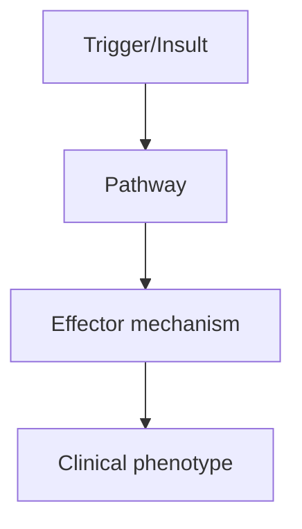
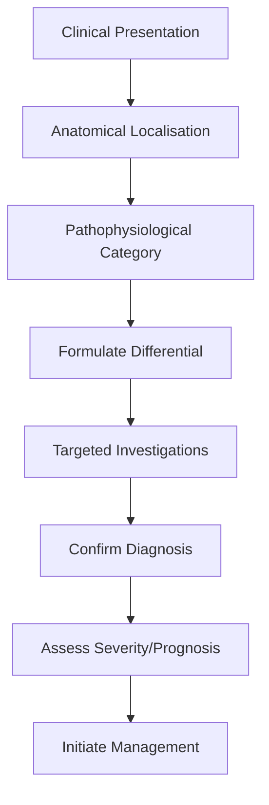
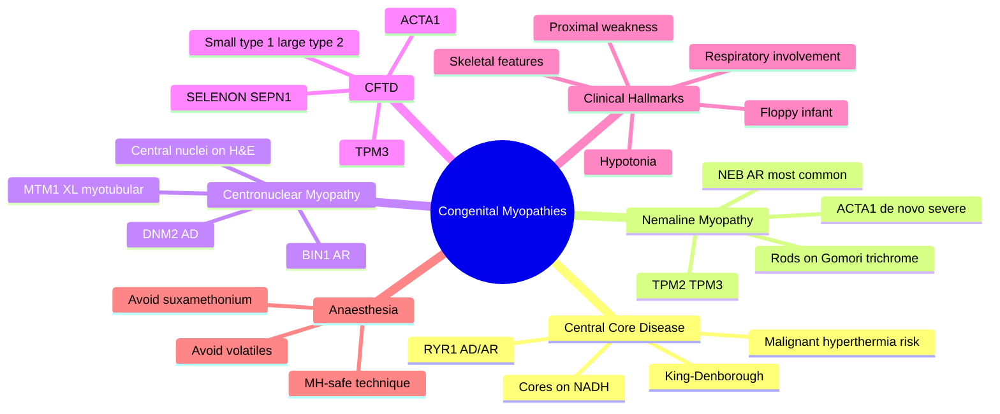

# Congenital Myopathies

> [!tip] **High-Yield Definition**
> Congenital myopathies: group of genetic muscle disorders presenting at birth or infancy with hypotonia, weakness, often stable or slowly progressive. Defined by characteristic histopathology: central core disease (RYR1), nemaline myopathy (ACTA1, NEB, TPM2, TPM3, TNNT1), centronuclear/myotubular myopathy (MTM1, DNM2, BIN1, RYR1), centronuclear (MTM1 X-linked, severe neonatal, centronuclear myotubularin), multi-minicore (SEPN1, RYR1), reducing body (FHL1), tubular aggregate, fingerprint, zebra body, sarcotubular, trilaminar, hyaline body, spheroid body. Distinguish from congenital muscular dystrophies (DGC: dystrophin, sarcoglycans, fukutin, POMT1, POMT2, FKRP, POMGnT1; collagen: COL6 - Ullrich, Bethlem), congenital myasthenic syndromes (NMJ), metabolic myopathies, SMA.

---

## 1. Definition / Epidemiology / Classification

### Definition
Congenital myopathies: group of genetic muscle disorders presenting at birth or infancy with hypotonia, weakness, often stable or slowly progressive. Defined by characteristic histopathology: central core disease (RYR1), nemaline myopathy (ACTA1, NEB, TPM2, TPM3, TNNT1), centronuclear/myotubular myopathy (MTM1, DNM2, BIN1, RYR1), centronuclear (MTM1 X-linked, severe neonatal, centronuclear myotubularin), multi-minicore (SEPN1, RYR1), reducing body (FHL1), tubular aggregate, fingerprint, zebra body, sarcotubular, trilaminar, hyaline body, spheroid body. Distinguish from congenital muscular dystrophies (DGC: dystrophin, sarcoglycans, fukutin, POMT1, POMT2, FKRP, POMGnT1; collagen: COL6 - Ullrich, Bethlem), congenital myasthenic syndromes (NMJ), metabolic myopathies, SMA.

### Epidemiology
Rare individually. Centronuclear myopathy (X-linked, MTM1): 1/50,000 males. Central core (RYR1): 1/100,000. Nemaline: 1/50,000. Most present at birth or infancy. Variable severity.

### Classification
| Variant | Key Features | Prognosis |
|---------|-------------|-----------|
| | | |

---

## 2. Aetiology / Pathophysiology

### Aetiology
Central core: RYR1 (ryanodine receptor, calcium release, AD/AR, malignant hyperthermia susceptibility - AVOID volatile anaesthetics, suxamethonium). Nemaline: ACTA1 (AD/AR, severe neonatal/AR, AD/AR, variable), NEB (nebulin, AR, most common), TPM2/3, TNNT1, CFL2. Centronuclear: MTM1 (X-linked, myotubularin, severe neonatal, death by 1y), DNM2 (AD, mild), BIN1, RYR1. Multi-minicore: SEPN1 (selenoprotein, rigid spine), RYR1. Reducing body: FHL1 (X-linked). Congenital fibre type disproportion: ACTA1, MYH7, TPM3. Pathogenesis: sarcomere dysfunction, calcium handling, myofibrillar disorganisation. Genetic: many genes, multiple inheritance patterns.

### Pathophysiology

---

## 3. Clinical Features

### History
- **Onset/Duration:**
- **Progression:**
- **Key symptoms:**
- **Triggers:**
- **Systemic symptoms:**
- **Drug/Family/Social history:**

### Examination
| Domain | Key Findings | Localisation Value |
|--------|-------------|-------------------|
| | | |

### Specific Clinical Features
Hypotonia ('floppy baby'), weakness (proximal, facial, bulbar, respiratory), feeding difficulty, respiratory failure (variable). Skeletal: scoliosis, contractures, hip dislocation, foot deformities (pes cavus, clubfoot), long face, high-arched palate. Cardiac: rare (vs dystrophy). Eye: ophthalmoplegia (centronuclear, mitochondrial, myotubular). Onset: birth, infancy. Stable or slowly progressive. Specific: central core (hip dislocation, scoliosis, malignant hyperthermia), nemaline (severe neonatal, or mild adult), centronuclear X-linked (severe neonatal, death by 1y), multi-minicore (rigid spine, scoliosis, respiratory), reducing body (scapuloperoneal).

---

## 4. Diagnostic Approach / Algorithm

---

## 5. Investigations

CK: normal or mildly elevated (2-5x). EMG: myopathic (small motor units, short duration). NCS: normal. Muscle biopsy: characteristic histopathology (central cores on NADH/SDH - central core; nemaline rods on Gomori trichrome - nemaline; central nuclei in 25-90% fibres - centronuclear; multiple minicores - multi-minicore; reducing bodies on menadione-NBT - reducing body). Electron microscopy: characteristic. Genetic testing: gene panels, WES, WGS. RYR1 for central core and malignant hyperthermia. ACTA1, NEB for nemaline. MTM1 for centronuclear X-linked. MRI: muscle (fatty infiltration pattern). Respiratory: FVC, sleep study. Cardiac: ECG, echo (rarely involved).

---

## 6. Differential Diagnosis

| Differential | Distinguishing Features | Key Test |
|--------------|------------------------|----------|
| | | |

---

## 7. Management

Supportive: respiratory (monitoring, NIV, ventilation, scoliosis surgery), feeding (NG/PEG, gastro-oesophageal reflux management), physiotherapy, OT, orthotics (AFO, walking aids, wheelchair), scoliosis monitoring, contracture prevention. Multidisciplinary: paediatrician, neurologist, geneticist, pulmonologist, orthopaedic, OT, PT, dietitian, social. Anaesthesia: AVOID volatile anaesthetics (sevoflurane, desflurane, isoflurane, halothane) and suxamethonium in RYR1, CACNA1S, SCN4A - trigger malignant hyperthermia (hyperthermia, rigidity, tachycardia, hypercapnia, hyperkalaemia, rhabdomyolysis). Use IV anaesthetics (propofol, ketamine, fentanyl), regional, total IV anaesthesia. Monitor: temperature, ETCO2, muscle tone. Malignant hyperthermia treatment: stop trigger, dantrolene 2.5mg/kg IV, active cooling, supportive, ICU. No disease-modifying therapy for most. Gene therapy: experimental. Avoid: exercise-induced rhabdomyolysis.

---

## 8. Drug Interactions / Contraindications / Comorbidity Cautions

| Drug | Interaction / Caution | Management |
|------|----------------------|------------|
| | | |

---

## 9. Procedures (if applicable)

### Procedure:
- **Indications:**
- **Contraindications:**
- **Preparation / Principle:**
- **Complications:**
- **Viva Pearls:**

---

## 10. Complications

| Complication | Frequency | Prevention / Monitoring | Management |
|--------------|-----------|------------------------|------------|
| | | | |

---

## 11. Red Flags / Emergencies

Respiratory failure (scoliosis, weak cough, aspiration), scoliosis progression, contractures, hip dislocation, anaesthetic complications (malignant hyperthermia - emergency, AVOID volatile + suxamethonium in RYR1), aspiration, feeding difficulty, failure to thrive, fractures, scoliosis surgery, anaesthesia planning.

---

## 12. Prognosis

Variable. Severe neonatal (nemaline, centronuclear X-linked): may die in infancy. Milder: stable or slowly progressive, normal life expectancy. Central core: usually stable, but malignant hyperthermia risk lifelong. Nemaline: variable (mild to severe). Multi-minicore: variable. Reducing body: variable. No disease-modifying therapy. Multidisciplinary care essential. Anaesthesia planning critical. Genetic counselling for family. Quality of life depends on severity and respiratory involvement.

---

## 13. Topic Correlation

| Related Topic | Link | Key Overlap |
|---------------|------|-------------|
| | | |

---

## 14. Special Situations

| Situation | Consideration |
|-----------|---------------|
| **Pregnancy** | |
| **Lactation** | |
| **Paediatric** | |
| **Elderly / Frail** | |
| **Renal impairment** | |
| **Hepatic impairment** | |
| **Immunocompromised** | |
| **Perioperative** | |
| **Driving / DVLA** | |
| **Occupational** | |

---

## FCPS/MRCP High-Yield Summary

| Category | Key Points |
|----------|------------|
| **Definition** | Congenital myopathies: group of genetic muscle disorders presenting at birth or infancy with hypotonia, weakness, often stable or slowly progressive. Defined by characteristic histopathology: central  |
| **Epidemiology** | Rare individually. Centronuclear myopathy (X-linked, MTM1): 1/50,000 males. Central core (RYR1): 1/100,000. Nemaline: 1/50,000. Most present at birth  |
| **Pathophysiology** | |
| **Clinical** | Hypotonia ('floppy baby'), weakness (proximal, facial, bulbar, respiratory), feeding difficulty, respiratory failure (variable). Skeletal: scoliosis, contractures, hip dislocation, foot deformities (p |
| **Diagnosis** | |
| **Investigations** | CK: normal or mildly elevated (2-5x). EMG: myopathic (small motor units, short duration). NCS: normal. Muscle biopsy: characteristic histopathology (central cores on NADH/SDH - central core; nemaline  |
| **Management** | Supportive: respiratory (monitoring, NIV, ventilation, scoliosis surgery), feeding (NG/PEG, gastro-oesophageal reflux management), physiotherapy, OT, orthotics (AFO, walking aids, wheelchair), scolios |
| **Complications** | |
| **Prognosis** | Variable. Severe neonatal (nemaline, centronuclear X-linked): may die in infancy. Milder: stable or slowly progressive, normal life expectancy. Central core: usually stable, but malignant hyperthermia |
| **Viva Pearls** | |
| **Drug Doses** | |
| **Scoring Systems** | |
| **Genetics** | |
| **Imaging Signs** | |

---

## Viva Questions (PACES/FCPS Style)

1. **Q:** Define Congenital Myopathies and classify its variants.
   **A:** Based on the definition above.

2. **Q:** What are the key clinical features?
   **A:** Hypotonia ('floppy baby'), weakness (proximal, facial, bulbar, respiratory), feeding difficulty, respiratory failure (variable). Skeletal: scoliosis, contractures, hip dislocation, foot deformities (pes cavus, clubfoot), long face, high-arched palate. Cardiac: rare (vs dystrophy). Eye: ophthalmopleg

3. **Q:** What is the first-line treatment?
   **A:** Based on the management section.

4. **Q:** What are the red flags requiring urgent referral?
   **A:** Respiratory failure (scoliosis, weak cough, aspiration), scoliosis progression, contractures, hip dislocation, anaesthetic complications (malignant hyperthermia - emergency, AVOID volatile + suxamethonium in RYR1), aspiration, feeding difficulty, failure to thrive, fractures, scoliosis surgery, anae

5. **Q:** What is the prognosis?
   **A:** Variable. Severe neonatal (nemaline, centronuclear X-linked): may die in infancy. Milder: stable or slowly progressive, normal life expectancy. Central core: usually stable, but malignant hyperthermia risk lifelong. Nemaline: variable (mild to severe). Multi-minicore: variable. Reducing body: variab

6. **Q:** How do you differentiate Congenital Myopathies from key differentials?
   **A:** Clinical features, investigations, and response to treatment.

7. **Q:** What investigations are most useful?
   **A:** Based on the investigations section.

8. **Q:** Describe the stepwise management approach.
   **A:** Based on the management algorithm.

9. **Q:** What are the emergency presentations?
   **A:** Based on the red flags section.

10. **Q:** How does management change in pregnancy/paediatrics/elderly?
    **A:** Special considerations per population.

---

## Common Confusions / Exam Traps

| Confusion | Clarification |
|-----------|---------------|
| | |

---

## Mnemonics

1. **"CRNC Core Rods Nukes"** = **C**entral core disease (RYR1) · **R**od / **N**emaline myopathy (ACTA1, NEB) · **N**uclei central = Centronuclear / myotubular (MTM1, DNM2, BIN1) · **C**ongenital fibre-type disproportion (TPM3, SELENON, ACTA1). **Use:** Classify congenital myopathies by biopsy hallmark.

2. **"RyR1 = Hot & Core"** = RYR1 mutations cause **central core disease** AND **malignant hyperthermia susceptibility** AND **King-Denborough syndrome**. Anaesthetic warning always applies. **Use:** Recognise RYR1 spectrum and trigger avoidance.

3. **"MTM1 XL = X-Lethal"** = MTM1 myotubular myopathy is **X-linked recessive** → severe floppy infant **males**, with ptosis, ophthalmoplegia, respiratory failure, often fatal in infancy. **Use:** Centronuclear / myotubular myopathy inheritance.

---

## Mind Map

---

## Spaced Repetition Trackers

| Topic | Day 1 | Day 3 | Day 7 | Day 14 | Day 30 | Day 90 |
|-------|-------|-------|-------|--------|--------|--------|
| Four core entities (core, nemaline, centronuclear, CFTD) | ☐ | ☐ | ☐ | ☐ | ☐ | ☐ |
| Gene associations (RYR1, ACTA1, NEB, MTM1, TPM3) | ☐ | ☐ | ☐ | ☐ | ☐ | ☐ |
| Biopsy hallmarks on each stain | ☐ | ☐ | ☐ | ☐ | ☐ | ☐ |
| Inheritance patterns (AD/AR/XL) | ☐ | ☐ | ☐ | ☐ | ☐ | ☐ |
| Malignant hyperthermia precautions (RYR1) | ☐ | ☐ | ☐ | ☐ | ☐ | ☐ |
| Skeletal features (long face, high palate, scoliosis) | ☐ | ☐ | ☐ | ☐ | ☐ | ☐ |
| Differential: SMA, Pompe, congenital MD | ☐ | ☐ | ☐ | ☐ | ☐ | ☐ |

---

## Self-Test Scorecard

| # | Topic | 1 | 2 | 3 | 4 | 5 | Score /5 |
|---|-------|---|---|---|---|---|----------|
| 1 | Differentiate the four core entities | ☐ | ☐ | ☐ | ☐ | ☐ | /5 |
| 2 | Gene and inheritance for each | ☐ | ☐ | ☐ | ☐ | ☐ | /5 |
| 3 | Biopsy staining patterns | ☐ | ☐ | ☐ | ☐ | ☐ | /5 |
| 4 | Floppy infant work-up | ☐ | ☐ | ☐ | ☐ | ☐ | /5 |
| 5 | RYR1 and MH risk management | ☐ | ☐ | ☐ | ☐ | ☐ | /5 |
| 6 | Skeletal and facial features | ☐ | ☐ | ☐ | ☐ | ☐ | /5 |
| 7 | Ophthalmoplegia patterns | ☐ | ☐ | ☐ | ☐ | ☐ | /5 |
| 8 | Respiratory & feeding support | ☐ | ☐ | ☐ | ☐ | ☐ | /5 |
| 9 | Genetic testing strategy (panel/WES) | ☐ | ☐ | ☐ | ☐ | ☐ | /5 |
| 10 | Prognosis and counselling | ☐ | ☐ | ☐ | ☐ | ☐ | /5 |

---

## MCQs (10)

1. **Question:** Which gene is most commonly implicated in central core disease, and what is the associated anaesthetic risk?
   **Options:** A. RYR1 — malignant hyperthermia susceptibility B. ACTA1 — cardiomyopathy C. NEB — renal failure D. MTM1 — hearing loss
   **Answer:** A
   **Explanation:** RYR1 mutations cause central core disease AND predispose to malignant hyperthermia; volatile anaesthetics and suxamethonium must be avoided.

2. **Question:** On muscle biopsy with modified Gomori trichrome stain, small dark rod-like inclusions within muscle fibres are characteristic of which congenital myopathy?
   **Options:** A. Central core disease B. Nemaline myopathy C. Centronuclear myopathy D. Congenital fibre-type disproportion
   **Answer:** B
   **Explanation:** Nemaline rods appear red on Gomori trichrome; most cases are due to ACTA1 or NEB mutations.

3. **Question:** A male neonate presents with severe hypotonia, ptosis, external ophthalmoplegia, feeding difficulty, and respiratory failure. Genetic testing confirms a hemizygous pathogenic MTM1 variant. The most likely diagnosis is:
   **Options:** A. Duchenne muscular dystrophy B. Myotubular (X-linked centronuclear) myopathy C. Pompe disease D. Spinal muscular atrophy type 1
   **Answer:** B
   **Explanation:** MTM1 mutations cause severe X-linked myotubular myopathy in males; characteristic features include ptosis, ophthalmoplegia and respiratory failure.

4. **Question:** Which biopsy finding is characteristic of central core disease on oxidative enzyme staining (NADH-TR)?
   **Options:** A. Centrally placed nuclei in most fibres B. Well-demarcated central zones devoid of oxidative enzyme activity C. Small type 1 fibres with relative type 2 hypertrophy D. Ragged red fibres
   **Answer:** B
   **Explanation:** Central cores appear as well-defined central regions that lack oxidative enzyme (NADH, SDH) activity, corresponding to sarcomeric disorganisation.

5. **Question:** A child with hypotonia and motor delay is found on biopsy to have >80% of fibres with centrally located nuclei, often with perinuclear halos. Which gene is most likely involved if inheritance is autosomal dominant?
   **Options:** A. MTM1 B. DNM2 C. NEB D. RYR1
   **Answer:** B
   **Explanation:** DNM2 causes the autosomal dominant form of centronuclear myopathy; MTM1 is X-linked; NEB causes nemaline myopathy.

6. **Question:** Which congenital myopathy is most strongly associated with ophthalmoplegia (extraocular muscle weakness)?
   **Options:** A. Central core disease B. Nemaline myopathy C. Centronuclear myopathy D. CFTD
   **Answer:** C
   **Explanation:** Extraocular muscle involvement with ptosis and ophthalmoplegia is characteristic of centronuclear/myotubular myopathy (MTM1, DNM2, BIN1).

7. **Question:** A child with congenital myopathy, scoliosis, long narrow face, high-arched palate and hip dislocation is being prepared for scoliosis surgery. The most important pre-anaesthetic consideration is:
   **Options:** A. Risk of malignant hyperthermia (especially in RYR1-related disease) B. Risk of opioid overdose C. Risk of latex allergy D. Risk of contrast nephropathy
   **Answer:** A
   **Explanation:** Several congenital myopathies, particularly RYR1-related central core disease, confer MH susceptibility; trigger-free anaesthetic technique is mandatory.

8. **Question:** In congenital fibre-type disproportion (CFTD), the biopsy typically shows:
   **Options:** A. Centrally placed nuclei in type 2 fibres B. Small type 1 fibres with relatively larger type 2 fibres C. Ragged red fibres on modified Gomori trichrome D. Rimmed vacuoles
   **Answer:** B
   **Explanation:** CFTD is defined by ≥12% size disproportion with small type 1 fibres and relatively normal/hypertrophic type 2 fibres; genes include TPM3, ACTA1, SELENON.

9. **Question:** Which is the most commonly mutated gene in recessive nemaline myopathy?
   **Options:** A. ACTA1 B. NEB C. TPM3 D. MTM1
   **Answer:** B
   **Explanation:** NEB (nebulin) mutations account for ~50% of nemaline myopathy cases and are typically autosomal recessive with a milder, childhood-onset course.

10. **Question:** A newborn with severe hypotonia, arthrogryposis, and fatal respiratory failure harbours a de novo ACTA1 missense variant. The most likely diagnosis is:
    **Options:** A. Severe neonatal nemaline myopathy B. Duchenne muscular dystrophy C. Pompe disease D. Congenital myotonic dystrophy
    **Answer:** A
    **Explanation:** De novo dominant ACTA1 mutations cause the most severe form of nemaline myopathy, presenting at birth with hypotonia, arthrogryposis and often fatal respiratory failure.

---

## SBA Questions (10)

1. **Scenario:** A 6-month-old infant with motor delay and hypotonia has a muscle biopsy showing well-demarcated central cores lacking NADH-TR activity. Genetic testing reveals a pathogenic RYR1 variant.
   **Question:** Which anaesthetic planning is most appropriate for any future surgery?
   **Options:** A. Avoid volatile anaesthetics and suxamethonium; consider non-triggering TIVA B. Use any standard general anaesthetic with dantrolene standby only C. Use halothane with prophylactic cooling D. Use spinal anaesthesia only
   **Answer:** A
   **Explanation:** RYR1 mutations confer MH susceptibility; trigger-free technique (TIVA, opioids, non-depolarising relaxants) is the safest standard, regardless of dantrolene availability.

2. **Scenario:** A floppy infant with congenital hip dislocation, long narrow face, high-arched palate, and a biopsy showing rods on Gomori trichrome stain is being worked up.
   **Question:** Which gene panel should be sent first?
   **Options:** A. Dystrophinopathy panel B. Congenital myopathy gene panel including NEB and ACTA1 C. Mitochondrial DNA point mutation panel D. SMA SMN1 deletion test only
   **Answer:** B
   **Explanation:** Rod-like inclusions on Gomori trichrome suggest nemaline myopathy; targeted panel including NEB and ACTA1 has the highest diagnostic yield.

3. **Scenario:** A 2-week-old male infant with severe hypotonia, ptosis, external ophthalmoplegia and respiratory failure has a hemizygous MTM1 nonsense mutation.
   **Question:** Which statement about prognosis is most accurate?
   **Options:** A. Most children survive with normal life expectancy B. Early mortality is high due to respiratory failure; long-term ventilatory support is often needed C. The condition resolves spontaneously by 1 year D. It is associated with cardiomyopathy and sudden death only
   **Answer:** B
   **Explanation:** X-linked myotubular myopathy carries high early mortality from respiratory failure; survivors usually require long-term ventilatory and feeding support.

4. **Scenario:** A 5-year-old with central core disease is scheduled for tendon lengthening surgery. The anaesthetist plans to use an MH-safe technique.
   **Question:** Which combination of agents is appropriate?
   **Options:** A. Propofol, remifentanil, rocuronium, air/O₂ B. Sevoflurane, N₂O, suxamethonium C. Halothane, morphine, suxamethonium D. Isoflurane, fentanyl, vecuronium
   **Answer:** A
   **Explanation:** MH-safe technique: TIVA (propofol/remifentanil), non-depolarising relaxants (rocuronium/vecuronium), air/O₂, opioids. Avoid volatile agents and suxamethonium.

5. **Scenario:** A child has biopsy showing numerous centrally placed nuclei with perinuclear halos. Genetic panel reveals a DNM2 mutation inherited from his affected mother.
   **Question:** Which mode of inheritance and clinical feature is most characteristic?
   **Options:** A. Autosomal dominant with mild–moderate myopathy and often facial weakness B. Autosomal recessive with cardiomyopathy C. X-linked dominant lethal in males D. Mitochondrial with optic atrophy
   **Answer:** A
   **Explanation:** DNM2 centronuclear myopathy is typically autosomal dominant with variable severity; facial weakness and ptosis are common.

6. **Scenario:** A neonate with severe hypotonia and arthrogryposis is found to have a de novo ACTA1 missense variant. Biopsy shows numerous nemaline rods.
   **Question:** Which feature is most consistent with severe ACTA1-related nemaline myopathy?
   **Options:** A. Favourable response to steroids B. Often fatal neonatal respiratory failure with limited treatment options C. Predominant distal weakness with sparing of bulbar muscles D. Adult-onset progressive course
   **Answer:** B
   **Explanation:** Severe de novo ACTA1 nemaline myopathy presents at birth with hypotonia, arthrogryposis, and frequently fatal respiratory failure; treatment is largely supportive.

7. **Scenario:** A child with biopsy-proven CFTD and a TPM3 variant is reviewed in clinic.
   **Question:** Which additional feature should be actively screened for?
   **Options:** A. Sensorineural hearing loss B. Spinal rigidity and early-onset scoliosis (especially if SELENON) C. Cardiomyopathy with troponin elevation D. Retinitis pigmentosa
   **Answer:** B
   **Explanation:** CFTD due to SELENON (SEPN1) is associated with rigid spine and early scoliosis; respiratory insufficiency from diaphragmatic weakness is also seen and should be monitored.

8. **Scenario:** A 4-year-old with central core disease (RYR1 mutation) develops perioperative masseter spasm, tachycardia, and rising end-tidal CO₂ during an anaesthetic using sevoflurane.
   **Question:** What is the most appropriate immediate management?
   **Options:** A. Stop volatile agent, hyperventilate with 100% O₂, give dantrolene 2.5 mg/kg IV, active cooling B. Continue the case and observe C. Give IV lorazepam D. Give sugammadex and finish the case
   **Answer:** A
   **Explanation:** MH emergency: stop trigger, hyperventilate with 100% O₂, dantrolene 2.5 mg/kg IV bolus (repeat to response), active cooling, treat hyperkalaemia and acidosis.

9. **Scenario:** A couple have an affected child with NEB-related nemaline myopathy and are planning another pregnancy.
   **Question:** What is the recurrence risk and most appropriate reproductive option?
   **Options:** A. 50% recurrence risk, dominant; offer prenatal testing B. 25% recurrence risk, autosomal recessive; offer prenatal or preimplantation genetic testing C. Negligible risk, de novo only D. 100% recurrence, X-linked
   **Answer:** B
   **Explanation:** NEB-related nemaline myopathy is autosomal recessive; recurrence risk is 25%; prenatal testing (CVS/amniocentesis) or preimplantation genetic testing is appropriate.

10. **Scenario:** A 10-year-old boy with genetically confirmed centronuclear myopathy (BIN1, AR) is reviewed with progressive scoliosis and FVC of 45%.
    **Question:** Which intervention is most appropriate at this stage?
    **Options:** A. Observe until skeletal maturity B. Refer for spinal fusion and initiate nocturnal non-invasive ventilation C. Start high-dose steroids D. List for lung transplant only
    **Answer:** B
    **Explanation:** Progressive scoliosis with restrictive lung disease (FVC <50%) warrants consideration of spinal fusion (with MH precautions) and nocturnal NIV for ventilatory support.

---

## Tags

#neurology #muscle #congenitalmyopathy #centralcore #nemaline #centronuclear #myotubular #RYR1 #malignanthyperthermia #floppyinfant #FCPS #MRCP #PACES

---

## Local Navigation
**Heading Hub:** [[../Hub]]  
**Chapter Hierarchy:** [[Davidson Chapter 25 - Neurology Hierarchy]]  
**Chapter MOC:** [[Neurology MOC]]  
**Drug Reference:** [[../00_Index/Neurology Drug Reference]]
