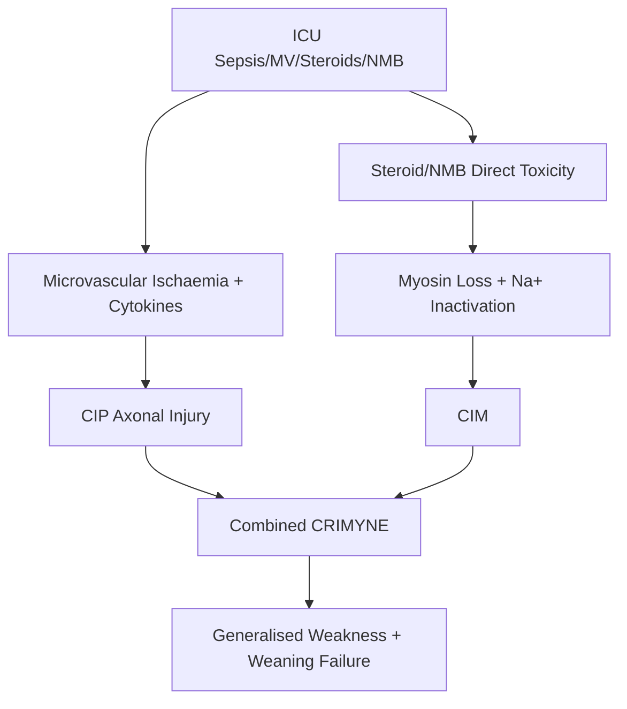
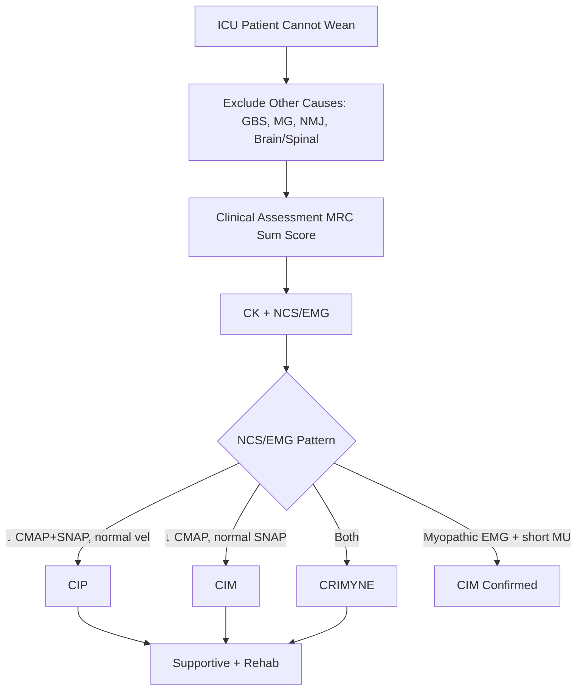

# Critical Illness Myopathy-Neuropathy (CIM/CIP)

> [!tip] **Definition**
> **Critical Illness Myopathy (CIM)** and **Critical Illness Polyneuropathy (CIP)** are acquired neuromuscular disorders developing in critically ill patients (sepsis, multi-organ failure, mechanical ventilation), manifesting as **generalised muscle weakness and difficulty weaning from ventilation**. Often coexist as **Critical Illness Myopathy-Neuropathy (CRIMYNE)**.

> [!tip] **Key concept:** "Weak ICU patient who can't wean" → think CIM/CIP. Common (~30-50% of ICU patients with sepsis/MV >1 week). Underdiagnosed.

## 1. Definition / Epidemiology / Classification

### Definition
- **CIP:** Acute axonal sensorimotor polyneuropathy in critically ill patients without other cause
- **CIM:** Acute (quadri-) myopathy with selective loss of thick (myosin) filaments; sparing nerves
- **CRIMYNE:** Combined CIM + CIP (most common)

### Epidemiology
- **Incidence:** 30-50% of ICU patients with sepsis/MV >1 week; up to 70% with severe sepsis
- **Risk factors:** Sepsis, SIRS, MV >1 week, multi-organ failure, **corticosteroids**, neuromuscular blockers, hyperglycaemia, parenteral nutrition, vasopressors
- **Onset:** Days 5-7 of ICU stay
- **Mortality:** Higher with CIM/CIP (~30-50%)

### Classification
| Type | Features |
|------|----------|
| **CIP** | Axonal sensorimotor polyneuropathy; ↓CMAP & SNAP amplitudes; normal velocities |
| **CIM (cachectic)** | Selective myosin loss; type II fibre atrophy |
| **CIM (acute necrotising)** | Severe with myonecrosis; ↑↑ CK |
| **CIM (thick filament)** | Selective myosin loss; classic form |
| **CRIMYNE** | Combined features |
| **Mobility障碍 (ICU-acquired weakness)** | Umbrella term |

## 2. Aetiology / Pathophysiology

### Mechanisms
- **CIP:** Sepsis → microvascular ischaemia + cytokine-mediated axonal injury → Wallerian-like degeneration of motor and sensory axons
- **CIM:** Sepsis + corticosteroids + NMB → ↓membrane excitability + selective myosin thick filament loss + NMJ dysfunction
- **Hyperglycaemia:** Mitochondrial dysfunction, oxidative stress
- **Channel dysfunction:** Inactivation of Na⁺ channels → electrical inexcitability

## 3. Clinical Features

### History
- ICU patient with **delayed weaning** from mechanical ventilation
- **Generalised weakness** (proximal and distal)
- Onset typically **5-7 days** into ICU stay
- Difficult to obtain history due to intubation/sedation

### Examination
| Domain | Findings |
|--------|----------|
| **Motor** | **Symmetric** proximal + distal weakness; ↓ tone; **hyporeflexia/areflexia** |
| **Sensory** | ↓ sensation (CIP); spared in pure CIM |
| **Cranial nerves** | Facial weakness (mild); ptosis; ophthalmoplegia rare |
| **Respiratory** | Diaphragmatic weakness → weaning failure |
| **Autonomic** | Variable |

### MRC Sum Score
- Sum of bilateral strength in 6 muscle groups (deltoid, biceps, wrist ext, hip flex, knee ext, ankle DF)
- Maximum 60; <48 indicates ICU-acquired weakness
- <36 = severe

## 4. Diagnostic Approach

### Severity Scoring
| Tool | Use |
|------|-----|
| **MRC Sum Score** | Quantifies weakness (0-60) |
| **Medical Research Council scale** | 0-5 per muscle group |
| **Handgrip dynamometry** | Simple bedside strength |
| **Inspiratory pressure (MIP)** | Respiratory strength |

## 5. Investigations

| Investigation | Expected Finding |
|----------------|------------------|
| **CK** | Normal/mildly ↑ (CIM); may be ↑↑ in necrotising CIM |
| **NCS** | ↓ CMAP (CIM); ↓ CMAP + SNAP (CIP); **normal conduction velocities** |
| **EMG** | **Myopathic pattern** (small, polyphasic units; early recruitment) in CIM; fibrillations + positive sharp waves in CIP |
| **Direct muscle stimulation** | Distinguishes CIM (no response to direct muscle stimulation) from CIP (preserved muscle response) |
| **Muscle biopsy** | Type II atrophy, myosin loss, necrosis (rarely needed) |
| **CSF** | Normal (excludes GBS) |
| **AChR antibodies** | Negative (excludes MG) |
| **Imaging** | MRI shows muscle oedema (acute), fatty replacement (chronic) |

## 6. Differential Diagnosis

| Differential | Distinguishing Features |
|--------------|--------------------------|
| **Guillain-Barré syndrome** | Antecedent infection, ascending paralysis, ↑ CSF protein, demyelinating NCS |
| **Myasthenia gravis** | Fatigability, ocular, AChR+, decremental EMG |
| **Lambert-Eaton** | ↑ with exercise, autonomic, small-cell lung cancer |
| **Spinal cord lesion** | Sensory level, UMN signs (spasticity, hyperreflexia) |
| **Brainstem lesion** | CN involvement, long tract signs |
| **Neuromuscular blocker persistence** | Recent use; TOF monitoring; supportive |
| **Opioid/sedative accumulation** | Renal/hepatic impairment; reversed by naloxone |
| **Severe hypophosphataemia/hypokalaemia** | Metabolic causes of weakness |
| **Adrenal insufficiency** | Steroid withdrawal; hyponatraemia |

## 7. Management

### Prevention (Most Effective)
| Strategy | Evidence |
|----------|----------|
| **Aggressive sepsis treatment** | Reduces CIM/CIP incidence |
| **Glycaemic control** | Target 6-10 mmol/L (avoid hypo- and hyperglycaemia) |
| **Minimize corticosteroid use** | Use lowest effective dose; taper when possible |
| **Minimize NMB use** | Train-of-four monitoring; avoid prolonged infusions |
| **Early mobilisation** | Reduces weakness and improves outcomes |
| **Avoid parenteral nutrition excess** | Contribute to insulin resistance |

### Treatment
| Domain | Intervention |
|--------|--------------|
| **Treat underlying** | Sepsis, MOF, electrolyte correction |
| **Supportive** | Continue MV until recovery; nutrition |
| **Rehabilitation** | Early physiotherapy, mobilisation, OT |
| **Weaning** | Gradual; spontaneous breathing trials |
| **Avoid sedatives** | Daily sedation holds; minimise opioids/benzodiazepines |

### Specific Therapies (Limited Evidence)
- IgIV, PLEX: **not effective**
- Testosterone/oxandrolone: under investigation
- Electrical muscle stimulation: some benefit
- Antioxidants (vit C/E): theoretical; no clear benefit

### Multidisciplinary
Intensivist, neurologist, physiotherapist, OT, dietitian, psychologist; weekly MDT review

## 8. Drug Interactions / Cautions

| Drug | Caution |
|------|---------|
| **Corticosteroids** | Major risk factor; use lowest dose |
| **NMB (vecuronium, rocuronium)** | Prolonged use → CIM; monitor with TOF |
| **Aminoglycosides** | NMJ blockade; additive weakness |
| **Linezolid** | Mitochondrial dysfunction; neuropathy with prolonged use |
| **Vasopressors** | Worsen microvascular ischaemia |
| **Propofol infusion** | High-dose prolonged = propofol infusion syndrome |
| **Metronidazole** | Peripheral neuropathy (chronic) |
| **Statins** | Myopathy risk |

## 9. Procedures
### Bedside Muscle Stimulation Test
- **Method:** Direct muscle stimulation via needle electrode, compare with CMAP
- **Finding:** CIM = absent/negligible response to direct stimulation; CIP = preserved
- **Indication:** Differentiate CIM from CIP at bedside

### Weaning Protocol
- Daily sedation interruption
- Spontaneous breathing trials
- Pressure support ventilation
- Diaphragmatic function assessment

## 10. Complications
- **Prolonged ventilation** → VAP, tracheostomy
- **DVT/PE** → prophylaxis
- **Pressure ulcers** → 2-hourly turning
- **Joint contractures** → splinting, physio
- **Aspiration** → swallow assessment
- **Mortality ↑** (2-3×)
- **Long-term disability** (5-10% persistent at 1 year)
- **Cognitive impairment** (co-existing ICU delirium)

## 11. Red Flags / Emergencies
- **Respiratory failure/arrest** → intubation
- **Aspiration pneumonia** → antibiotics, NPO
- **DVT/PE** → anticoagulation
- **Rhabdomyolysis** (necrotising CIM) → fluids, monitor CK, renal function
- **Failure to wean** → consider tracheostomy, nutrition review

## 12. Prognosis
- **Mortality:** 30-50% (driven by underlying critical illness)
- **Recovery:** Most recover over weeks to months
- **Persistent weakness at 1 year:** 5-10%
- **Poor prognostic factors:** Prolonged sepsis, multi-organ failure, high SOFA score, severe weakness, advanced age
- **CIM** generally better prognosis than **CIP**

## 13. Topic Correlation
| Related Topic | Key Overlap |
|---------------|-------------|
| [[Guillain-Barré Syndrome]] | Areflexia, weakness differential |
| [[Myasthenia Gravis]] | Fatigability, NMJ dysfunction |
| [[Sepsis]] | Major risk factor |
| [[Rhabdomyolysis]] | Severe CIM form |
| [[Prolonged Ventilation]] | Clinical manifestation |

## 14. Special Situations

| Situation | Consideration |
|-----------|---------------|
| **Pregnancy** | Rare (ICU); obstetric critical care |
| **Paediatric** | Similar risk factors; lower incidence; developmental considerations |
| **Elderly** | Higher risk; worse outcomes |
| **Renal impairment** | Drug accumulation; NMB caution |
| **Hepatic impairment** | Drug metabolism; lactate, glucose |
| **Septic shock** | Highest risk; aggressive source control |
| **Long ICU stay** | Cumulative risk; monitor EMG weekly |
| **Rehabilitation** | Begin early; continue post-discharge |

---

## FCPS/MRCP High-Yield Summary

| Category | Key Points |
|----------|------------|
| **Definition** | Acquired ICU weakness (CIP axonal + CIM myosin loss); often combined |
| **Epidemiology** | 30-50% ICU pts with sepsis/MV >1 week |
| **Risk factors** | Sepsis, MV, steroids, NMB, hyperglycaemia, MOF |
| **Pathophysiology** | Microvascular ischaemia + cytokine injury + myosin loss |
| **Clinical** | Symmetric weakness, areflexia, weaning failure; 5-7 days onset |
| **Diagnosis** | Exclude GBS, MG, etc.; NCS/EMG (↓CMAP, myopathic EMG); muscle biopsy |
| **Investigations** | CK (mild ↑), NCS, EMG, MRI, exclude mimics |
| **Management** | **Prevention**: glucose control, minimise steroids/NMB, early mobilisation; **Treatment**: supportive + rehab |
| **Complications** | Prolonged MV, VAP, DVT, pressure ulcers, persistent weakness |
| **Prognosis** | 30-50% mortality; most recover weeks-months; 5-10% persistent at 1y |
| **Viva Pearls** | "Weak ICU patient = CIM/CIP until proven otherwise"; CIP=↓CMAP+SNAP, CIM=↓CMAP only with myopathic EMG |
| **Scoring** | MRC Sum Score (0-60); <48 = ICU-acquired weakness |
| **Drug Doses** | No specific drug; supportive care |

---

## Viva Questions

1. **Q:** Define CIM and CIP.
**A:** CIM = acute myopathy with selective myosin loss in ICU patients. CIP = acute axonal sensorimotor polyneuropathy in critically ill. Often coexist (CRIMYNE).
2. **Q:** Risk factors for CIM/CIP?
**A:** Sepsis, mechanical ventilation >1 week, multi-organ failure, **corticosteroids**, neuromuscular blockers, hyperglycaemia, parenteral nutrition, vasopressors.
3. **Q:** Differentiate CIM from CIP on NCS/EMG.
**A:** CIM: ↓ CMAP, normal SNAP, myopathic EMG (small polyphasic units). CIP: ↓ CMAP + ↓ SNAP (axonal), normal velocities, fibrillation potentials. Direct muscle stimulation preserved in CIP, absent in CIM.
4. **Q:** MRC Sum Score interpretation?
**A:** Sum of strength in 6 muscle groups bilaterally (max 60). <48 = ICU-acquired weakness; <36 = severe.
5. **Q:** Prevention of CIM/CIP?
**A:** Aggressive sepsis treatment, glycaemic control (6-10 mmol/L), minimise corticosteroids and NMB, early mobilisation, avoid excess parenteral nutrition.
6. **Q:** Why does CIM/CIP develop?
**A:** Sepsis → microvascular ischaemia + cytokines → axonal injury (CIP); steroids + NMB → myosin loss + Na⁺ channel inactivation (CIM).
7. **Q:** Treatment options for CIM/CIP?
**A:** No specific drug therapy. Supportive: continue MV until recovery, nutritional support, early rehabilitation, gradual weaning. Avoid IgIV/PLEX (ineffective).
8. **Q:** Why do patients fail to wean?
**A:** Diaphragmatic weakness + phrenic nerve dysfunction + muscle deconditioning + cognitive issues. MRC score predicts weaning success.
9. **Q:** Long-term outcomes of CIM/CIP?
**A:** Most recover over weeks to months. 5-10% have persistent weakness at 1 year. Increased mortality (driven by underlying illness). Risk of functional limitations.
10. **Q:** Role of muscle biopsy?
**A:** Gold standard for CIM diagnosis (myosin loss, type II atrophy, necrosis). Not routinely needed in practice; reserved for atypical cases.
11. **Q:** Why distinguish CIM from CIP?
**A:** Prognosis (CIM better), research (different pathophysiology), some implications for rehabilitation approach.
12. **Q:** ICU-acquired weakness vs CIM/CIP?
**A:** ICU-acquired weakness (ICUAW) = umbrella term for weakness developing in ICU without other cause. CIM and CIP are the two main subtypes; often combined as CRIMYNE.

---

## Common Confusions / Exam Traps

| Confusion | Clarification |
|-----------|---------------|
| CIM vs CIP | CIM = ↓ CMAP only, myopathic EMG; CIP = ↓ CMAP + SNAP, normal velocities |
| CIM/CIP vs GBS | GBS: ascending paralysis, ↑ CSF protein, demyelinating; CIM/CIP: ICU context, axonal |
| GBS in ICU vs CIM/CIP | GBS treated with IgIV/PE; CIM/CIP no specific Rx |
| Steroid myopathy vs CIM | Steroid myopathy = type II atrophy; CIM = myosin loss + necrosis |
| Channel inactivation vs denervation | Both cause ↓ CMAP; direct muscle stimulation distinguishes |
| MRC Sum Score vs grip strength | MRC = full clinical assessment; grip = simple bedside |

---

## Mnemonics

1. **ICU WEAK** — **I**CU acquired, **C**orticosteroids, **U**ncontrolled sepsis; **W**eaning failure; **E**MG abnormal; **A**reflexia; **K**+ imbalance
2. **CIM vs CIP** — **C**IM = **C**alf + **C**MAP only ↓; **C**IP = **C**MAP + **S**NAP both ↓
3. **PREVENT** — **P**rotocols for weaning; **R**ehabilitate early; **E**lectrolytes; **V**entilation strategies; **E**ndotoxaemia control; **N**MB minimisation; **T**ight glucose
4. **5-7-7** — Onset **5**-**7** days, peaks around day **7**

---

## MCQs (10)

1. **Q:** Most common cause of ICU-acquired weakness?
**Options:** A. CIM alone B. CIP alone C. CRIMYNE (combined) D. GBS
**Answer:** C — Most patients have combined CIM+CIP.

2. **Q:** Which is NOT a risk factor for CIM/CIP?
**Options:** A. Sepsis B. Corticosteroids C. NMB D. Hypothermia
**Answer:** D — Risk factors: sepsis, steroids, NMB, hyperglycaemia, MOF.

3. **Q:** NCS finding in CIP?
**Options:** A. Demyelinating pattern (↓ vel) B. Axonal pattern (↓ amp, normal vel) C. Normal D. ↑ amplitude
**Answer:** B — ↓ CMAP + SNAP amplitudes with preserved velocities (axonal).

4. **Q:** MRC Sum Score <48 indicates?
**Options:** A. Normal B. ICU-acquired weakness C. Critical illness only D. GBS
**Answer:** B — MRC <48 = clinically significant ICU-acquired weakness.

5. **Q:** Why is CIM different from CIP on direct muscle stimulation?
**Options:** A. CIM: preserved response B. CIP: no response C. CIM: no response; CIP: preserved D. Both no response
**Answer:** C — CIM = muscle inexcitable (no direct response); CIP = nerve injury (preserved muscle response).

6. **Q:** CK in typical CIM?
**Options:** A. Markedly ↑ (>10×) B. Normal or mildly ↑ C. Always normal D. Variable
**Answer:** B — Normal/mildly ↑ (unless necrotising form).

7. **Q:** First-line prevention of CIM/CIP?
**Options:** A. IVIG B. Plasma exchange C. Aggressive sepsis treatment + glucose control D. Corticosteroids
**Answer:** C — Treat sepsis + tight glucose control.

8. **Q:** Long-term outcome for most CIM/CIP survivors?
**Options:** A. Permanent quadriplegia B. Recovery over weeks-months C. ALS progression D. Death within 1 year
**Answer:** B — Most recover over weeks to months.

9. **Q:** Direct muscle stimulation is positive (preserved) in:
**Options:** A. CIM B. CIP C. CRIMYNE D. Steroid myopathy
**Answer:** B — CIP preserves direct muscle response (nerve injury, muscle intact).

10. **Q:** Which drug has NO role in CIM/CIP treatment?
**Options:** A. IVIG B. Insulin C. Antibiotics D. Heparin
**Answer:** A — IVIG ineffective in CIM/CIP (unlike GBS).

---

## SBA Questions (10)

1. **Scenario:** 60-year-old with septic shock on MV 10 days, IV hydrocortisone, NMB infusion. Now cannot wean. MRC Sum 24. NCS: ↓CMAP, normal SNAP. EMG: myopathic. Diagnosis?
**Options:** A. CIP B. CIM C. CRIMYNE D. GBS
**Answer:** B — ↓CMAP only, myopathic EMG, myosin loss pathology = CIM.

2. **Scenario:** ICU patient on MV 2 weeks, sepsis, weaning failure. NCS: ↓CMAP + ↓SNAP, normal velocities. Direct muscle stimulation preserved. Diagnosis?
**Options:** A. CIM B. CIP C. Both D. NMJ disorder
**Answer:** B — CIP: ↓ CMAP+SNAP axonal pattern; preserved direct muscle response.

3. **Scenario:** Septic patient on MV day 8 develops weakness, CK 250 U/L (mildly ↑). NCS/EMG planned. Initial prevention measures?
**Options:** A. Stop all antibiotics B. Tight glucose control + early mobilisation C. IVIG D. Steroid burst
**Answer:** B — Glucose control + early mobilisation + minimise NMB.

4. **Scenario:** ICU patient with CIM, MRC 30. Weaning trial scheduled. What adjuncts improve weaning?
**Options:** A. Daily sedation holds + spontaneous breathing trials B. Continuous sedation C. Muscle relaxants D. TPN only
**Answer:** A — Daily sedation interruption + SBT improves outcomes.

5. **Scenario:** CIM patient develops CK 15,000 U/L with dark urine. Diagnosis?
**Options:** A. MI B. Acute necrotising CIM with rhabdomyolysis C. DVT D. Sepsis progression
**Answer:** B — Severe CIM with myonecrosis → rhabdomyolysis. Aggressive IV fluids, monitor renal function.

6. **Scenario:** Patient recovering from CIM 2 months post-ICU. Persistent weakness. Best assessment?
**Options:** A. Repeat NCS only B. MRI + functional assessment (FIM, 6MWT) C. Re-biopsy D. Discharge without follow-up
**Answer:** B — Functional assessment tools + MRI (chronic changes) guide rehabilitation.

7. **Scenario:** ICU patient on prolonged NMB infusion (vecuronium 7 days). Now weakness. NCS shows ↓CMAP. Most appropriate action?
**Options:** A. Continue NMB B. Stop NMB, supportive care C. IVIG D. Plasmapheresis
**Answer:** B — Stop NMB, supportive care, monitor recovery (reversible if NMB-induced).

8. **Scenario:** CRIMYNE patient 6 months post-ICU, persistent proximal weakness MRC 40. Best management?
**Options:** A. IVIG B. Long-term rehabilitation programme C. Steroids D. Methotrexate
**Answer:** B — Multidisciplinary rehab (PT, OT, psychology) for functional recovery.

9. **Scenario:** Septic patient day 5, on vasopressors, MV. Glucose 18 mmol/L. Glycaemic target?
**Options:** A. 4-6 mmol/L B. 6-10 mmol/L C. 10-15 mmol/L D. No target
**Answer:** B — 6-10 mmol/L (avoid both hypo- and hyperglycaemia). Intensive insulin (4-6) increases hypoglycaemia risk.

| Scenario: Septic shock patient on MV, NMB, high-dose steroids develops weakness day 10. EMG shows myopathic units with fibrillations. Direct muscle stimulation absent. Diagnosis?
**Options:** A. CIP only B. CIM (thick filament loss) C. Steroid myopathy only D. NMJ disorder
**Answer:** B — Myopathic EMG + fibrillations + absent direct response = CIM (thick filament loss); differs from pure steroid myopathy (type II atrophy, normal direct response).

---

## Flashcards

- **Q:** Definition of CIP vs CIM?
**A:** CIP = axonal polyneuropathy; CIM = acute myopathy with myosin loss
- **Q:** Onset of CIM/CIP?
**A:** 5-7 days of ICU stay
- **Q:** Risk factors?
**A:** Sepsis, MV, steroids, NMB, hyperglycaemia
- **Q:** NCS in CIP?
**A:** ↓ CMAP + ↓ SNAP, normal velocities
- **Q:** NCS in CIM?
**A:** ↓ CMAP only, normal SNAP
- **Q:** Direct muscle stimulation in CIM?
**A:** Absent (muscle inexcitable)
- **Q:** Direct muscle stimulation in CIP?
**A:** Preserved
- **Q:** MRC Sum Score cutoff?
**A:** <48 = ICU-acquired weakness
- **Q:** Best prevention?
**A:** Aggressive sepsis Rx + glucose control + early mobilisation
- **Q:** Treatment?
**A:** Supportive + rehab; no specific drug

---

## Answer Key

### MCQs
1. **C** — CRIMYNE most common
2. **D** — Hypothermia not a risk factor
3. **B** — Axonal pattern in CIP
4. **B** — MRC <48 = ICUAW
5. **C** — CIM no response; CIP preserved
6. **B** — Normal/mild ↑ CK
7. **C** — Sepsis Rx + glucose control
8. **B** — Recovery weeks-months
9. **B** — CIP preserves muscle response
10. **A** — IVIG ineffective

### SBAs
1. **B** — CIM (↓CMAP only + myopathic EMG)
2. **B** — CIP (↓CMAP + SNAP; preserved direct)
3. **B** — Glucose + mobilisation
4. **A** — Sedation holds + SBT
5. **B** — Necrotising CIM + rhabdo
6. **B** — Functional assessment
7. **B** — Stop NMB; supportive
8. **B** — Long-term rehab
9. **B** — 6-10 mmol/L target
10. **B** — CIM thick filament loss

---

## Local Navigation
**Heading Hub:** [[Muscle Disorders Hub]]  
**Topic-Group Hub:** [[Inflammatory & Acquired Myopathies Hub]]  
**Chapter Hierarchy:** [[Davidson Chapter 25 - Neurology Hierarchy]]  
**Chapter MOC:** [[Neurology MOC]]  
**Drug Reference:** [[00_Index/Neurology Drug Reference]]  
**Related Topics:** [[Guillain-Barré Syndrome]], [[Myasthenia Gravis]], [[Rhabdomyolysis]], [[Sepsis]], [[Prolonged Ventilation]]

## PasTest Scenario SBAs (Clinical Vignettes)

> **Auto-generated PasTest/Mediscope-style scenario SBAs** grounded in the authored source. Each scenario tests a real clinical fact (triad, specific sign, contraindication, trial, first-line Rx) extracted from the topic. *Source: Ch 27: Neurology & Stroke — Critical Illness Myopathy-Neuropathy*

**Q1.** What is the most appropriate first-line therapy for Critical Illness Myopathy-Neuropathy?

  - **A.** Treat underlying
  - **B.** An advanced/surgical therapy reserved for refractory disease
  - **C.** Symptomatic treatment only, no disease-modifying therapy
  - **D.** Empiric broad-spectrum therapy without specific indication

  > **Answer: A** — Treat underlying
  >
  > *Source:* **Treat underlying**   Sepsis, MOF, electrolyte correction

