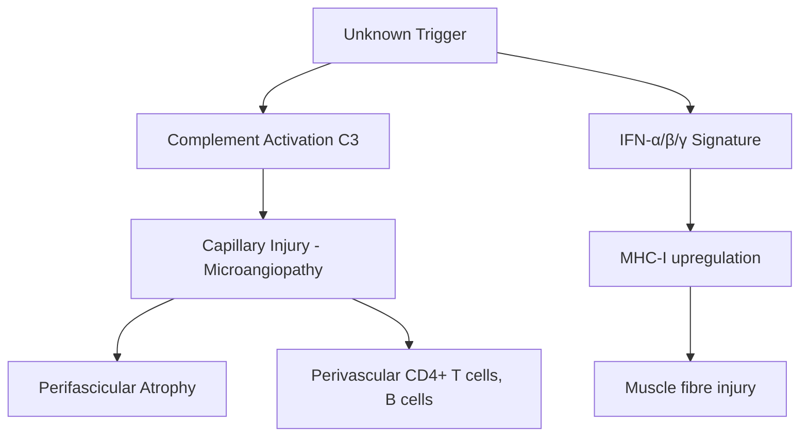

# Dermatomyositis (DM)

Related: [[Polymyositis]], [[Inclusion Body Myositis]], [[Immune-Mediated Necrotising Myopathy]], [[Paraneoplastic Neurological Syndromes]]

> [!tip] **High-Yield**
> DM is an idiopathic inflammatory myopathy with **characteristic skin signs** preceding or accompanying muscle weakness. The **ENMC 2003 criteria** require skin rash + ≥3 of: proximal weakness, ↑CK, EMG myopathic, muscle biopsy (perifascicular atrophy, perivascular inflammation), MRI. **Anti-Mi-2** = classic DM (good prognosis, steroid-responsive); **anti-TIF1γ** = strong **cancer association**; **anti-MDA5** = clinically amyopathic DM with rapidly progressive ILD (Asian, severe); **anti-NXP2** = malignancy/calcinosis. **Cancer screening mandatory in adult DM** (CT CAP ± PET).

## 1. Definition / Epidemiology / Classification

### Definition
Idiopathic inflammatory myopathy (IIM) with **symmetric proximal muscle weakness and characteristic cutaneous features** (heliotrope rash, Gottron papules). Pathogenesis: **humoral/complement-mediated microangiopathy** (vs polymyositis/IBM = T-cell mediated).

### Epidemiology
- **Incidence:** 5-10/1,000,000/year
- **Bimodal:** Peak 5-15 yr (juvenile) and 45-65 yr (adult)
- **F > M** (2-3:1 adult; juvenile F>M)
- **Race variation:** Anti-MDA5 amyopathic DM — Asians; classic DM — Caucasians

### Classification (Bohan & Peter / ENMC 2003)
| Subtype | Features |
|---------|----------|
| **Classic DM** | Rash + myositis |
| **Clinically amyopathic DM (CADM)** | Rash, normal CK/minimal weakness (10-20%) — anti-MDA5 |
| **Juvenile DM** | <16 yr; vasculitis, calcinosis common |
| **DM with malignancy association** | Anti-TIF1γ, NXP2; 30% ↑ cancer risk |
| **Overlap DM** | With CTD (SLE, SSc, RA) — anti-PL-7, PL-12, Jo-1, PM-Scl |
| **Antisynthetase syndrome** | Anti-Jo-1, PL-7, PL-12, EJ, OJ, KS, Zo — myositis, ILD, mechanics' hands, Raynaud's, fever |

## 2. Pathophysiology

### Molecular / Antibodies
| Antibody | Prevalence | Clinical Association |
|----------|-----------|---------------------|
| **Anti-Mi-2** (helicase) | 20-30% | Classic DM, good prognosis, steroid-responsive, low malignancy |
| **Anti-TIF1γ** | 20-30% adult | **Strong cancer association** (40-60%) |
| **Anti-NXP2/MJ** | 20% | Malignancy, juvenile DM with calcinosis |
| **Anti-MDA5 (CADM-140)** | 10-20% Asian, <5% Caucasian | Clinically amyopathic, **rapidly progressive ILD**, severe |
| **Anti-SAE** | 5-10% | Adult DM, severe dysphagia |
| **Anti-Jo-1 (anti-synthetase)** | 20-30% overlap | Antisynthetase syndrome: ILD, mechanics' hands, arthritis, Raynaud's, fever |
| **Anti-PL-7, PL-12, EJ, OJ, KS, Zo** | Rare | Antisynthetase variants |

## 3. Clinical Features

### Cutaneous (may precede weakness by months)
- **Heliotrope rash:** Violaceous periorbital oedema
- **Gottron papules:** Violaceous, flat-topped papules over **MCP/IP joints**, elbows, knees
- **Gottron sign:** Erythema over extensor surfaces
- **Shawl sign:** Erythema over shoulders, upper back, V of neck
- **V-sign:** Erythema over anterior neck/chest
- **Mechanics' hands:** Cracked, hyperkeratotic lateral fingers
- **Periungual telangiectasia, nailfold capillary dropout**
- **Calcinosis cutis:** Subcutaneous calcium deposits — juvenile DM
- **Photosensitive poikiloderma** (Civatte)
- **Pruritus** common

### Musculoskeletal
- **Symmetric proximal weakness** (shoulder, hip girdle) — gradual onset
- **Neck flexor weakness** (dropped head)
- **Pharyngeal/dysphagia** (10-30%)
- **Respiratory muscle weakness** (rare)
- **Myalgia** (25%)

### Systemic
- **Interstitial lung disease (ILD):** 20-70% (anti-synthetase, anti-MDA5 — RP-ILD)
- **Cardiac:** Arrhythmias, myocarditis (10%), pericarditis
- **Joint:** Symmetric non-erosive arthritis
- **Constitutional:** Fever, weight loss
- **Gastrointestinal:** Dysphagia, dysmotility
- **Vasculitis** (gut, skin) — juvenile DM

## 4. Diagnostic Approach

### ENMC 2003 Criteria
**Definite DM** = **Skin rash** + ≥3 of:
1. Proximal muscle weakness (symmetric)
2. ↑CK, LDH, AST/ALT, aldolase
3. **EMG:** Myopathic (small, short, polyphasic MUAPs + fibrillations)
4. **Muscle biopsy:** Perifascicular atrophy, perivascular/perimysial inflammation (CD4+ T, B, MAC deposition)
5. **MRI:** Symmetric oedema of proximal muscles (STIR hyperintensity)

**Probable DM** = rash + 2 criteria  
**Possible DM** = rash + 1 criterion

## 5. Investigations

| Test | Indication | Finding |
|------|------------|---------|
| **CK** | All | ↑↑↑ (often >10x normal); may be normal in CADM |
| **LDH, AST/ALT, aldolase** | Adjunct | ↑ with active myositis |
| **ESR/CRP** | All | Often ↑ |
| **Myositis-specific antibodies** | All | Anti-Mi-2, TIF1γ, NXP2, MDA5, SAE, Jo-1 etc. |
| **EMG** | Diagnostic uncertainty | Myopathic + fibrillations (active) |
| **MRI (STIR/T2)** | Biopsy site selection, monitor | Symmetric oedema of proximal muscles |
| **Muscle biopsy** | Atypical, exclude mimics | Perifascicular atrophy, perivascular inflammation |
| **ANA** | All | Often +ve (non-specific) |
| **Cancer screen** | All adult DM | CT CAP, mammography, US pelvis, ± PET-CT |
| **PFTs + HRCT chest** | All (esp. anti-synthetase) | Restrictive, ↓DLCO, ground-glass |
| **ECG, echo** | Cardiac symptoms | Arrhythmia, myocarditis |
| **Swallow assessment** | Dysphagia | Cricopharyngeal dysfunction |
| **Skin biopsy** | Diagnostic uncertainty | Interface dermatitis, mucin |

## 6. Differential Diagnosis
| Differential | Distinguishing | Test |
|--------------|----------------|------|
| **Polymyositis** | No rash; biopsy = endomysial CD8+ T cells | Biopsy, myositis Abs |
| **Inclusion body myositis** | Older, distal (finger flexors, quadriceps), refractory | Biopsy (rimmed vacuoles), anti-cN1A |
| **SLE** | Multisystem, dsDNA, complement ↓ | ANA, dsDNA, C3/C4 |
| **Systemic sclerosis** | Skin thickening, RP, anti-Scl-70/centromere | ANA, capillaroscopy |
| **Statin myopathy** | Drug history, normal biopsy | Stop statin, CK response |
| **Dystrophinopathy** | Younger, X-linked, calf pseudohypertrophy | Genetic |
| **Hypothyroid myopathy** | ↑TSH, delayed relaxation | TFTs |
| **Cushing's** | Truncal obesity, striae | Cortisol |
| **Dermatomyositis-like rash (amyopathic)** | Statins, hydroxyurea | Drug history |

## 7. Management

### Initial (Acute)
| Agent | Dose | Notes |
|-------|------|-------|
| **Prednisolone** | 1 mg/kg/day PO (max 80 mg) | Tap slowly over 12-18 months; cover with bone protection (bisphosphonate, vit D), PPI |
| **Methylprednisolone** | 500-1000 mg IV ×3-5d | Severe (dysphagia, RP-ILD, myocarditis) |
| **Methotrexate** | 15-25 mg/wk + folic acid | **First-line steroid-sparing**; hepatotoxic, marrow |
| **Azathioprine** | 2-3 mg/kg/day | Alternative; check TPMT |

### Refractory / Severe
- **IVIG** 2 g/kg over 2-5 days (monthly) — effective for skin, weakness, dysphagia
- **Cyclophosphamide** (RP-ILD, severe vasculitis)
- **Mycophenolate mofetil** 2-3 g/day
- **Rituximab** (anti-CD20) — for refractory DM; RIM trial: 83% response
- **Ciclosporin, tacrolimus** (anti-calcineurin)
- **JAK inhibitors** (refractory DM)
- **Anti-MDA5 RP-ILD:** Aggressive immunosuppression (cyclophosphamide + rituximab + JAKi)

### Supportive
- **Physiotherapy:** Avoid bed rest; graded exercise
- **Sun protection** for rash
- **Swallow assessment** — NG/PEG if severe
- **Vaccinations:** Pneumococcal, influenza; **avoid live vaccines** if on immunosuppression
- **Bone protection** (bisphosphonate, vitamin D, calcium)
- **Cardiac monitoring** (ECG, echo)
- **Pulmonary function** (PFTs, HRCT)

### Cancer Screening (Adult DM — **MANDATORY**)
- **CT chest/abdomen/pelvis**
- **Mammography** (women), **pelvic US**
- **Age-appropriate** (colon, prostate)
- **FDG-PET/CT** if TIF1γ or NXP2 +ve, or no cause found
- **Repeat annually** for 3-5 years

## 8. Drug Cautions
| Drug | Caution |
|------|---------|
| **Steroids** | DM, infection, weight, mood, glucose; bisphosphonate cover |
| **Methotrexate** | Hepatotoxic, marrow, pulmonary; **teratogenic (X)**; folic acid 5 mg |
| **Azathioprine** | Marrow, hepatotoxic, ↑infection; check TPMT; **avoid in pregnancy** |
| **Cyclophosphamide** | Haemorrhagic cystitis (mesna cover), marrow, bladder ca, infertility |
| **IVIG** | Thrombosis, AKI, aseptic meningitis (esp. migraine) |
| **Rituximab** | PML, hepatitis B reactivation, infusion reactions |

## 9. Procedures
- **Muscle biopsy:** Open or needle — typical site MRI STIR hyperintensity (e.g., vastus lateralis, deltoid)
- **Skin biopsy:** Diagnostic uncertainty
- **Skin EMG** (not routine)

## 10. Complications
| Complication | Frequency | Management |
|--------------|-----------|-----------|
| **ILD / RP-ILD** | 20-70% | HRCT, PFTs; cyclophosphamide, rituximab (anti-MDA5: aggressive) |
| **Malignancy** | 20-30% adult | Screen all adult DM (TIF1γ, NXP2) |
| **Cardiac** | 10-30% | Echo, ECG, troponin |
| **Dysphagia** | 10-30% | Swallow assessment, NG/PEG |
| **Calcinosis** | 30-50% juvenile | Surgical, diltiazem, bisphosphonates |
| **Vasculitis** | Juvenile | Aggressive immunosuppression |
| **Lipodystrophy** | 10-20% | Cosmetic |
| **Infection** | Immunosuppression | Prophylaxis, vaccination |

## 11. Red Flags
| Red Flag | Action |
|----------|--------|
| **Rapidly progressive dyspnoea** | HRCT, PFTs — **anti-MDA5 RP-ILD** (fatal in 50%) |
| **Dysphagia with aspiration** | Swallow assessment, NG/PEG |
| **New mass/weight loss** | Cancer screen (CT CAP ± PET) |
| **Cardiac symptoms** | ECG, troponin, echo |
| **Stricture/fistula** | GI vasculitis (juvenile) |
| **PML (on rituximab)** | MRI brain, CSF JCV |

## 12. Prognosis
| Factor | Good | Poor |
|--------|------|------|
| **Antibody** | Anti-Mi-2 | Anti-MDA5, TIF1γ + malignancy |
| **Onset** | Gradual | Acute, severe |
| **Response** | Steroid-responsive | Refractory |
| **ILD** | Absent, mild | RP-ILD (anti-MDA5) |
| **Cancer** | No | Yes |

- **5-yr survival:** 80-90% (treated, no malignancy)
- **Anti-MDA5 RP-ILD:** Mortality 30-50% in 6 months
- **Recurrence:** 30-50% on tapering; malignancy worsens prognosis

## 13. Topic Correlation
| Topic | Link | Overlap |
|-------|------|---------|
| **Polymyositis** | [[Polymyositis]] | Differential |
| **IBM** | [[Inclusion Body Myositis]] | Older, distal, refractory |
| **IMNM** | [[Immune-Mediated Necrotising Myopathy]] | Anti-SRP, HMGCR, statin |
| **Antisynthetase syndrome** | [[Polymyositis]] | Anti-Jo-1, ILD |
| **Cancer** | [[Paraneoplastic Neurological Syndromes]] | Anti-TIF1γ, NXP2 |

## 14. Special Situations
| Situation | Consideration |
|-----------|---------------|
| **Pregnancy** | **Avoid MTX, cyclophosphamide**; prednisolone, azathioprine (safe), IVIG; monitor disease |
| **Paediatric** | Juvenile DM; calcinosis; vasculitis; transition to adult care |
| **Elderly** | ↑ Malignancy; lower immunosuppression; bisphosphonate cover |
| **Renal** | IVIG hydrate, dose adjust; cyclophosphamide caution |
| **Hepatic** | MTX/aza caution; MMF safer |
| **Immunocompromised** | PJP prophylaxis if high-dose steroids; HBV screen pre-rituximab |
| **Perioperative** | Stress-dose steroids if prolonged steroid use |
| **Vaccination** | Avoid live vaccines if on immunosuppression; pneumococcal, influenza, HPV, zoster (Shingrix non-live) |

## FCPS/MRCP High-Yield Summary
| Category | Key Points |
|----------|------------|
| **Definition** | Inflammatory myopathy with characteristic skin rash (heliotrope, Gottron) |
| **Epidemiology** | Bimodal (juvenile, adult); F>M; rare 5-10/1M/yr |
| **Pathophysiology** | Humoral, complement-mediated microangiopathy; perifascicular atrophy |
| **Clinical** | Proximal weakness, heliotrope, Gottron papules, shawl/V-sign, mechanics' hands |
| **Antibodies** | Anti-Mi-2 (classic/good), TIF1γ (cancer), MDA5 (RP-ILD, amyopathic), NXP2 (cancer, calcinosis) |
| **Diagnosis** | ENMC criteria: rash + ≥3 of weakness, ↑CK, EMG, biopsy, MRI |
| **Investigations** | CK ↑↑↑, MRI STIR, EMG, biopsy, myositis Abs, cancer screen, HRCT |
| **Management** | Prednisolone 1 mg/kg; MTX 1st-line steroid-sparing; IVIG; rituximab refractory |
| **Cancer** | 20-30% adult DM — **screen all** (CT CAP ± PET) |
| **Complications** | ILD, malignancy, cardiac, dysphagia, calcinosis (juvenile) |
| **Prognosis** | 80-90% 5-yr survival; anti-MDA5 RP-ILD fatal 30-50% |
| **Viva** | "ENMC criteria"; "anti-TIF1γ → cancer"; "anti-MDA5 → RP-ILD"; "MTX 1st-line steroid-sparing" |

## Viva Questions
1. **Q:** What are the pathognomonic skin signs of DM?
   **A:** **Heliotrope rash** (violaceous periorbital oedema) and **Gottron papules** (violaceous flat papules over MCP/IP joints). Also Shawl/V-sign, mechanics' hands, nailfold telangiectasia, calcinosis.
2. **Q:** Which autoantibody is associated with cancer in DM?
   **A:** **Anti-TIF1γ** (40-60% cancer association). Anti-NXP2 also. All adult DM should have cancer screen.
3. **Q:** What is anti-MDA5 associated with?
   **A:** Clinically amyopathic DM + **rapidly progressive ILD** (RP-ILD), more common in East Asians; mortality 30-50% in 6 months.
4. **Q:** First-line steroid-sparing agent in DM?
   **A:** **Methotrexate** 15-25 mg/week with folic acid. Azathioprine if MTX contraindicated.
5. **Q:** What does muscle biopsy show in DM?
   **A:** **Perifascicular atrophy**, perimysial/perivascular inflammation (CD4+ T, B cells, MAC deposition on capillaries). Contrast polymyositis: endomysial CD8+ T cells.
6. **Q:** When do you use IVIG in DM?
   **A:** Refractory disease, severe dysphagia, skin disease, pregnancy (safe), steroid-sparing.
7. **Q:** What is the role of rituximab in DM?
   **A:** Refractory disease; RIM trial: 83% response (delayed up to 36 weeks).
8. **Q:** Cancer screening in adult DM — what and for how long?
   **A:** CT CAP, mammography, pelvic US, age-appropriate, ± PET-CT. Repeat **annually for 3-5 years**.
9. **Q:** Differentiate DM from polymyositis pathologically.
   **A:** DM: **perifascicular atrophy**, perimysial/perivascular inflammation, complement (MAC) on capillaries, CD4+ T cells. PM: **endomysial** CD8+ T cells, MHC-I upregulation on fibres, no rash.
10. **Q:** Management of anti-MDA5 RP-ILD?
    **A:** Aggressive immunosuppression: methylprednisolone pulses + cyclophosphamide + rituximab ± JAK inhibitor (e.g., tofacitinib).

## Common Confusions
| Confusion | Clarification |
|-----------|---------------|
| DM vs PM rash | DM has cutaneous features (heliotrope, Gottron); PM does not |
| DM vs SLE rash | DM: Gottron (MCP/IP), heliotrope, shawl; SLE: malar (spares nasolabial), photosensitive |
| Gottron papules vs sign | Papules = papular lesions; sign = macular erythema over extensor surfaces |
| IBM vs DM | IBM: distal (finger flexors, quadriceps), older, refractory, anti-cN1A, rimmed vacuoles |
| Antisynthetase vs DM | Antisynthetase = myositis + ILD + mechanics' hands + RP + arthritis (anti-Jo-1) |
| CK normal in DM | Possible in CADM (amyopathic) — diagnose by MRI/biopsy, not CK alone |
| Hydroxyurea/statin DM-like | Drug-induced — reversible on stopping |

## Mnemonics
1. **DM SKIN** — **D**ifficulty getting up, **M**uscle weakness, **S**kin rash, **K**eratinized (mechanics' hands), **I**LD, **N**ailfold telangiectasia
2. **Anti-Mi-2 = Mild/Mi-nimal** — classic, good prognosis
3. **TIF-1γ = Tumour** — cancer
4. **MDA-5 = Murder/Destroyer/Amyopathic** — RP-ILD
5. **NXP2 = Nuclear-X-tra Problem** — cancer, calcinosis
6. **Jo-1 = Jobs (lungs, hands, joints)** — antisynthetase syndrome

## One-Page Revision Card
| Topic | Dermatomyositis |
|-------|-----------------|
| **Definition** | Idiopathic inflammatory myopathy with characteristic skin rash |
| **Key Clinical** | Proximal weakness + heliotrope/Gottron; ILD; cancer; calcinosis (JDM) |
| **Diagnosis** | ENMC 2003: rash + ≥3 (weakness, ↑CK, EMG, biopsy, MRI) |
| **Antibodies** | Mi-2 (good), TIF1γ (cancer), MDA5 (RP-ILD), NXP2 (cancer, calcinosis) |
| **Meds** | Prednisolone 1 mg/kg; MTX 15-25 mg/wk (1st-line sparing); IVIG; rituximab (refractory) |
| **Cancer** | 20-30% adult — screen all (CT CAP ± PET, annually ×3-5 yr) |
| **Red Flag** | Anti-MDA5 RP-ILD (fatal 30-50% 6 mo) |

## Must Know / Should Know
- [ ] **Must:** Gottron, heliotrope, ↑CK, ENMC criteria, MTX 1st-line, anti-TIF1γ = cancer
- [ ] **Should:** Anti-MDA5 RP-ILD, IVIG, muscle biopsy (perifascicular), cancer screen
- [ ] **Nice:** RIM trial, JAK inhibitors, calcinosis (diltiazem)

## MCQs (10)

1. **Question:** Which skin sign is pathognomonic of dermatomyositis?
   **Options:** A. Malar rash B. Gottron papules C. Discoid lupus D. Livedo reticularis
   **Answer:** B
   **Explanation:** Gottron papules (violaceous flat-topped papules over MCP/IP joints, elbows, knees) and heliotrope rash are pathognomonic. Malar rash is SLE.

2. **Question:** What is the autoantibody most strongly associated with cancer in adult dermatomyositis?
   **Options:** A. Anti-Mi-2 B. Anti-Jo-1 C. Anti-TIF1γ D. Anti-SAE
   **Answer:** C
   **Explanation:** Anti-TIF1γ has 40-60% cancer association. Anti-NXP2 also. Cancer screening is mandatory in all adult DM.

3. **Question:** First-line steroid-sparing agent in dermatomyositis?
   **Options:** A. Cyclophosphamide B. Methotrexate C. Azathioprine D. Rituximab
   **Answer:** B
   **Explanation:** Methotrexate 15-25 mg/week with folic acid is first-line steroid-sparing. Azathioprine is alternative. Cyclophosphamide for severe/ILD. Rituximab for refractory.

4. **Question:** What does muscle biopsy show in DM?
   **Options:** A. Endomysial CD8+ T cells B. Perifascicular atrophy and perimysial inflammation C. Rimmed vacuoles D. Necrotic fibres with minimal inflammation
   **Answer:** B
   **Explanation:** DM: perifascicular atrophy, perimysial/perivascular CD4+ T and B cells, complement (MAC) on capillaries. PM: endomysial CD8+. IBM: rimmed vacuoles. IMNM: necrotic fibres with macrophages.

5. **Question:** Which antibody is associated with rapidly progressive ILD in clinically amyopathic DM?
   **Options:** A. Anti-Mi-2 B. Anti-MDA5 C. Anti-SAE D. Anti-NXP2
   **Answer:** B
   **Explanation:** Anti-MDA5 (CADM-140) is associated with clinically amyopathic DM and rapidly progressive ILD (RP-ILD), especially in East Asians. Mortality 30-50% in 6 months.

6. **Question:** Classic DM that responds well to steroids is associated with which antibody?
   **Options:** A. Anti-Mi-2 B. Anti-TIF1γ C. Anti-Jo-1 D. Anti-MDA5
   **Answer:** A
   **Explanation:** Anti-Mi-2 (anti-helicase) is associated with classic DM, good prognosis, marked steroid response, low malignancy risk.

7. **Question:** What is the typical EMG finding in active DM?
   **Options:** A. Sensory neuropathy B. Small, short, polyphasic motor units with fibrillations C. Repetitive discharges D. Normal
   **Answer:** B
   **Explanation:** EMG in myositis: small, short, polyphasic MUAPs (myopathic) with fibrillations and positive sharp waves (active denervation from fibre necrosis).

8. **Question:** In adult DM, when is cancer screening indicated?
   **Options:** A. Only if TIF1γ +ve B. Only with weight loss C. All adult DM D. Only >65 yr
   **Answer:** C
   **Explanation:** All adult DM patients should have cancer screening (CT CAP ± PET, age-appropriate) because 20-30% have underlying malignancy. Repeat annually ×3-5 years.

9. **Question:** What is the most common cause of death in DM?
   **Options:** A. Malignancy B. Cardiac involvement C. ILD D. Infection (immunosuppression)
   **Answer:** C
   **Explanation:** In treated DM, ILD (especially RP-ILD with anti-MDA5) and malignancy are leading causes. Cardiac involvement is also important.

10. **Question:** Juvenile DM is most associated with which antibody/complication?
    **Options:** A. Anti-Mi-2 B. Anti-NXP2 (calcinosis) C. Anti-MDA5 D. Anti-TIF1γ
    **Answer:** B
    **Explanation:** Anti-NXP2 (MJ) is associated with juvenile DM, calcinosis cutis, and malignancy. Anti-TIF1γ is more adult cancer-associated.

## SBA Questions (10)

1. **Scenario:** 50-year-old woman presents with 3-month history of proximal weakness, heliotrope rash, and Gottron papules. CK 4500. What is the next diagnostic step before treatment?
   **Options:** A. Start prednisolone immediately B. MRI proximal muscles, myositis antibody panel, cancer screen C. Muscle biopsy C. Genetic test
   **Answer:** B
   **Explanation:** Confirm diagnosis (MRI, antibodies, biopsy if needed), classify DM (antibody guides prognosis), and screen for malignancy before immunosuppression. Treatment should be initiated early but workup parallel.

2. **Scenario:** 55-year-old man with DM develops rapidly progressive dyspnoea 2 weeks after starting prednisolone. HRCT shows diffuse ground-glass opacities. Anti-MDA5 +. What is the most appropriate management?
   **Options:** A. Increase prednisolone only B. Add cyclophosphamide + rituximab ± JAK inhibitor (tofacitinib) C. Stop prednisolone, start MMF D. IVIG only
   **Answer:** B
   **Explanation:** Anti-MDA5 RP-ILD is a medical emergency. Aggressive immunosuppression: methylprednisolone pulses + cyclophosphamide + rituximab ± JAK inhibitor. Steroid monotherapy is inadequate.

3. **Scenario:** 45-year-old woman with DM on prednisolone 15 mg and MTX 20 mg/wk has persistent proximal weakness and rising CK. What is the next step?
   **Options:** A. Add rituximab B. Add IVIG (2 g/kg) C. Increase MTX D. Refer to palliative care
   **Answer:** B
   **Explanation:** Refractory DM (active disease despite steroids + 1st-line steroid-sparing agent) — IVIG is effective (RIM trial and clinical experience). Alternatively, switch MTX to MMF or add rituximab.

4. **Scenario:** 60-year-old man with new DM. Anti-TIF1γ +ve. What investigation is most important?
   **Options:** A. MRI brain B. CT CAP ± FDG-PET (cancer screen) C. Echocardiogram D. Lumbar puncture
   **Answer:** B
   **Explanation:** Anti-TIF1γ has 40-60% cancer association. Comprehensive cancer screen (CT CAP ± PET-CT, age-appropriate) is mandatory.

5. **Scenario:** 35-year-old woman with DM on MTX 25 mg/wk and prednisolone 10 mg is planning pregnancy. What is the most appropriate change?
   **Options:** A. Continue MTX, switch steroids B. Stop MTX 3 months before conception; azathioprine + prednisolone C. Continue MTX D. Stop all medications
   **Answer:** B
   **Explanation:** **MTX is teratogenic (X)** — stop 3 months before conception. Safe options in pregnancy: azathioprine, prednisolone, IVIG, hydroxychloroquine (for skin).

6. **Scenario:** 50-year-old woman with DM, proximal weakness, dysphagia, and 5 kg weight loss. CK 8000. MRI shows oedema. What is the most important initial treatment?
   **Options:** A. IVIG only B. Prednisolone 1 mg/kg + MTX 15 mg/wk + consider IVIG C. Cyclophosphamide D. Hydroxychloroquine
   **Answer:** B
   **Explanation:** Standard initial treatment: high-dose prednisolone (1 mg/kg) + MTX as steroid-sparing. IVIG is added for severe dysphagia, refractory disease, or as steroid-sparing in pregnancy.

7. **Scenario:** 10-year-old boy with heliotrope rash, proximal weakness, painful subcutaneous nodules on elbows. Diagnosis?
   **Options:** A. SLE B. Juvenile dermatomyositis C. Psoriasis D. Eczema
   **Answer:** B
   **Explanation:** Juvenile DM: characteristic rash + weakness + calcinosis (subcutaneous calcium deposits — common in JDM). Anti-NXP2 +ve. Treatment with steroids + MTX.

8. **Scenario:** 45-year-old man with DM, mechanic's hands, Raynaud's, arthritis, ILD. Anti-Jo-1 +. Diagnosis?
   **Options:** A. Classic DM B. Antisynthetase syndrome C. SLE D. Systemic sclerosis
   **Answer:** B
   **Explanation:** Antisynthetase syndrome (anti-Jo-1 most common): myositis + ILD + mechanics' hands + Raynaud's + non-erosive arthritis + fever. Screen for ILD with HRCT and PFTs.

9. **Scenario:** 60-year-old man with DM and IBD. On DMARDs. Presents with fever, dry cough, dyspnoea. HRCT: bilateral ground-glass. What is the most likely diagnosis?
   **Options:** A. Pneumocystis pneumonia B. Anti-MDA5 ILD C. Bacterial pneumonia D. Heart failure
   **Answer:** A
   **Explanation:** Immunocompromised patient with DMARDs and new respiratory symptoms — Pneumocystis jirovecii pneumonia (PJP) is classic. Prophylaxis with co-trimoxazole should be considered. But anti-MDA5 ILD must also be excluded.

10. **Scenario:** 55-year-old woman with DM 1 year ago, well-controlled on low-dose steroids. New indurated, erythematous plaque on thigh, biopsy calcification. What complication is this?
    **Options:** A. Cellulitis B. Calcinosis cutis C. Skin relapse D. Squamous cell carcinoma
    **Answer:** B
    **Explanation:** Calcinosis cutis is common in juvenile DM but can persist into adulthood. Subcutaneous calcium deposits, can ulcerate, get infected. Treatment: diltiazem, bisphosphonates, surgery.

## Flashcards
- **Q:** Pathognomonic skin signs of DM? **A:** Heliotrope rash + Gottron papules
- **Q:** Anti-Mi-2 association? **A:** Classic DM, good prognosis, steroid-responsive
- **Q:** Anti-TIF1γ association? **A:** Cancer (40-60%)
- **Q:** Anti-MDA5 association? **A:** Amyopathic DM, RP-ILD (fatal 30-50%)
- **Q:** Anti-NXP2 association? **A:** Cancer, calcinosis (JDM)
- **Q:** ENMC 2003 criteria for definite DM? **A:** Skin rash + ≥3 of (weakness, ↑CK, EMG myopathic, biopsy, MRI)
- **Q:** Muscle biopsy in DM? **A:** Perifascicular atrophy, perimysial/perivascular CD4+ T/B, MAC on capillaries
- **Q:** First-line steroid-sparing agent? **A:** Methotrexate 15-25 mg/wk
- **Q:** Treatment of refractory DM? **A:** IVIG, rituximab, MMF, cyclophosphamide
- **Q:** Cancer screening in adult DM? **A:** CT CAP ± PET, age-appropriate, annually ×3-5 years

## Answer Key

### MCQs
1. **B** — Gottron papules pathognomonic
2. **C** — Anti-TIF1γ = cancer
3. **B** — MTX first-line steroid-sparing
4. **B** — DM = perifascicular atrophy
5. **B** — Anti-MDA5 = RP-ILD
6. **A** — Anti-Mi-2 = classic, steroid-responsive
7. **B** — Myopathic EMG with fibrillations
8. **C** — All adult DM = cancer screen
9. **C** — ILD leading cause of death
10. **B** — Anti-NXP2 = juvenile, calcinosis

### SBAs
1. **B** — Workup before treatment: MRI, antibodies, cancer screen
2. **B** — Anti-MDA5 RP-ILD = aggressive immunosuppression
3. **B** — IVIG for refractory disease
4. **B** — Anti-TIF1γ = cancer screen (CT CAP ± PET)
5. **B** — MTX teratogenic; switch to azathioprine
6. **B** — Prednisolone + MTX; IVIG if severe
7. **B** — Juvenile DM with calcinosis
8. **B** — Antisynthetase syndrome (anti-Jo-1)
9. **A** — PJP in immunosuppressed
10. **B** — Calcinosis cutis in JDM

## Local Navigation
**Topic Hub:** [[Muscle Disorders Hub]]  
**Chapter MOC:** [[Neurology MOC]]  
**Related Topics:** [[Polymyositis]], [[Inclusion Body Myositis]], [[Immune-Mediated Necrotising Myopathy]], [[Paraneoplastic Neurological Syndromes]]

## PasTest Scenario SBAs (Clinical Vignettes)

> **Auto-generated PasTest/Mediscope-style scenario SBAs** grounded in the authored source. Each scenario tests a real clinical fact (triad, specific sign, contraindication, trial, first-line Rx) extracted from the topic. *Source: Ch 27: Neurology & Stroke — Dermatomyositis*

**Q1.** Which of the following features is most specific or characteristic of Dermatomyositis?

  - **A.** EMG
  - **B.** A feature common to many acute inflammatory conditions
  - **C.** A non-specific sign that does not localise the diagnosis
  - **D.** An investigation finding rather than a clinical feature

  > **Answer: A** — EMG
  >
  > *Source:* |
| **EMG** | Diagnostic uncertainty | Myopathic + fibrillations (active) |
| **MRI (STIR/T2)** | Biopsy site selection, monitor | Symmetric oedema of proximal muscles |
| **Muscle biopsy** | Atypical

**Q2.** What is the most appropriate first-line therapy for Dermatomyositis?

  - **A.** Prednisolone
  - **B.** An advanced/surgical therapy reserved for refractory disease
  - **C.** Symptomatic treatment only, no disease-modifying therapy
  - **D.** Empiric broad-spectrum therapy without specific indication

  > **Answer: A** — Prednisolone
  >
  > *Source:* **Prednisolone**   1 mg/kg/day PO (max 80 mg)   Tap slowly over 12-18 months; cover with bone protection (bisphosphonate, vit D), PPI

