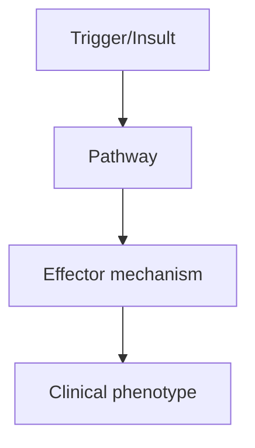
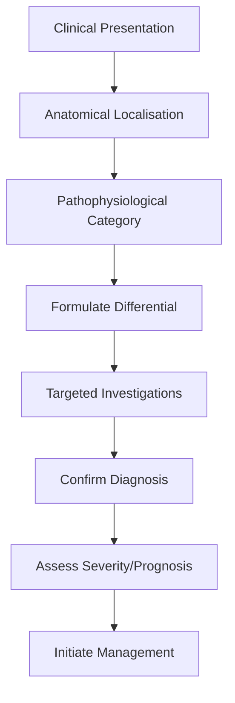
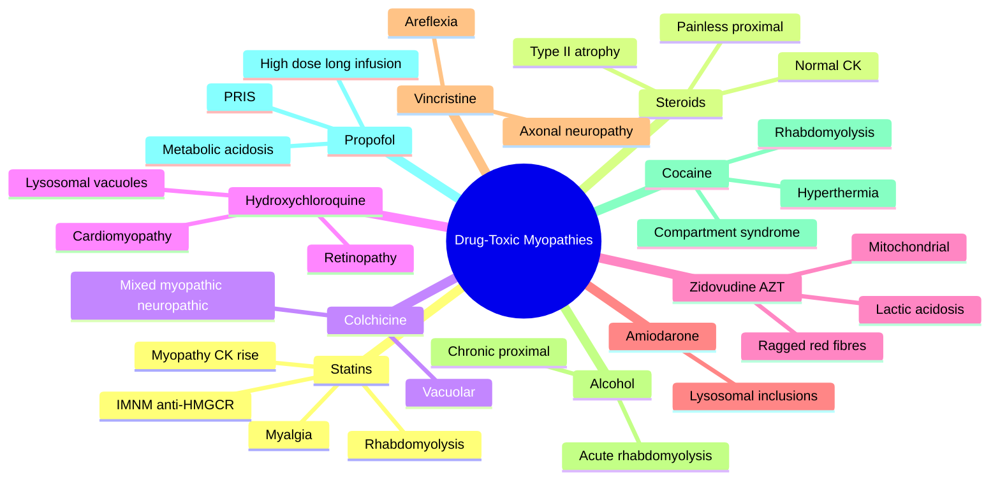

# Drug-Toxic Myopathies

> [!tip] **High-Yield Definition**
> Drug-induced myopathies: toxic damage to skeletal muscle from medications, toxins, drugs. Include statin myopathy, steroid myopathy, alcohol, colchicine, chloroquine, hydroxychloroquine, vincristine, zidovudine, amiodarone, penicillamine, beta-adrenergic agonists, beta-blockers, cocaine, heroin, propofol, immunosuppressants, immune checkpoint inhibitors, biologics, vitamin deficiencies (D, E), endocrine (thyroid, cortisol, parathyroid).

---

## 1. Definition / Epidemiology / Classification

### Definition
Drug-induced myopathies: toxic damage to skeletal muscle from medications, toxins, drugs. Include statin myopathy, steroid myopathy, alcohol, colchicine, chloroquine, hydroxychloroquine, vincristine, zidovudine, amiodarone, penicillamine, beta-adrenergic agonists, beta-blockers, cocaine, heroin, propofol, immunosuppressants, immune checkpoint inhibitors, biologics, vitamin deficiencies (D, E), endocrine (thyroid, cortisol, parathyroid).

### Epidemiology
Statins: 10-20% myalgia, 0.1% rhabdomyolysis. Steroid: 20-60% (chronic, dose-dependent). Alcohol: common. Colchicine: 5-10% (with renal impairment). Chemotherapy: variable (vincristine 30-50%, taxanes 60-80%). Varies by drug and patient factors.

### Classification
| Variant | Key Features | Prognosis |
|---------|-------------|-----------|
| | | |

---

## 2. Aetiology / Pathophysiology

### Aetiology
Statins: HMG-CoA reductase inhibition, myotoxicity (CoQ10, mitochondrial), immune-mediated necrotising myopathy (anti-HMGCR, severe, persists after statin stop). Steroid: type 2 fibre atrophy, anti-anabolic, dose-dependent. Alcohol: direct toxic, mitochondrial dysfunction, electrolyte disturbance. Colchicine: microtubule disruption, vacuolar myopathy (with renal impairment, statin). Chloroquine/Hydroxychloroquine: lysosomal accumulation, vacuolar myopathy (with retinopathy, cardiac). Vincristine: microtubule, neurogenic. Zidovudine: mitochondrial (with HIV). Amiodarone: lysosomal, demyelinating neuropathy. Penicillamine: autoimmune MG, myositis, neuromyotonia. Beta-adrenergic agonists (salbutamol, terbutaline): chronic use, myotonia-like. Beta-blockers: myotonia exacerbation. Cocaine, heroin, amphetamines: rhabdomyolysis, compartment syndrome. Propofol: propofol infusion syndrome (PRIS, high dose/prolonged). Immune checkpoint inhibitors (anti-PD-1, PD-L1, CTLA-4): myositis, myocarditis, myasthenia-like. Biologics (anti-TNF): myositis, demyelinating neuropathy. Vitamins: D (proximal), E (ataxia, myopathy). Endocrine: hypothyroidism, hyperthyroidism, Cushing, Addison, hyperparathyroidism.

### Pathophysiology

---

## 3. Clinical Features

### History
- **Onset/Duration:**
- **Progression:**
- **Key symptoms:**
- **Triggers:**
- **Systemic symptoms:**
- **Drug/Family/Social history:**

### Examination
| Domain | Key Findings | Localisation Value |
|--------|-------------|-------------------|
| | | |

### Specific Clinical Features
Variable. Myalgia: common. Weakness: proximal, symmetric, often gradual. CK: elevated (variable, often 3-10x, rhabdomyolysis >10x, often >50x). Myoglobinuria: dark urine, AKI (rhabdomyolysis). Statin: myalgia (10-20%), myopathy (0.1-0.5%), rhabdomyolysis (0.01%), IMNM (anti-HMGCR, severe, persists). Steroid: proximal, type 2 fibre, no CK elevation, Cushingoid features. Alcohol: acute (rhabdomyolysis, myoglobinuria), chronic (proximal, type 2). Colchicine: vacuolar, with statin, renal impairment, mimics inflammatory myopathy. Chloroquine: vacuolar, with retinopathy, cardiac. Vincristine: distal, sensory, neurogenic. Zidovudine: mitochondrial, with HIV. Amiodarone: neuromyopathy, with thyroid. Immune checkpoint: myositis, myocarditis, myasthenia-like (often severe).

---

## 4. Diagnostic Approach / Algorithm

---

## 5. Investigations

Clinical: drug history (statins, steroids, alcohol, chemotherapy, colchicine, chloroquine, etc.), timing, dose, renal function. Bloods: CK (elevated, often 3-10x, rhabdomyolysis >10x), U&Es (renal impairment, K+), LFTs, glucose, ESR, CRP, autoimmune, thyroid, cortisol, vitamin D, PTH. Urine: myoglobin (rhabdomyolysis), drug screen. EMG: myopathic (drugs, myositis), neurogenic (vincristine). Muscle biopsy: specific (vacuolar - colchicine, chloroquine; type 2 atrophy - steroid; necrosis - statin, alcohol; mitochondrial - zidovudine). Anti-HMGCR (statin IMNM). Genetic: rare, consider if persistent. Trial of drug withdrawal: improvement confirms diagnosis.

---

## 6. Differential Diagnosis

| Differential | Distinguishing Features | Key Test |
|--------------|------------------------|----------|
| | | |

---

## 7. Management

Stop offending drug (most important). Statin: stop, CK normalises in weeks, consider alternative (ezetimibe, PCSK9 inhibitor, bempedoic acid). IMNM: immunosuppression (steroids, IVIG, methotrexate, rituximab), anti-HMGCR persists despite statin stop. Steroid: reduce dose, alternate-day, exercise, vitamin D, calcium, bisphosphonate (osteoporosis). Alcohol: cessation, nutrition, thiamine. Colchicine: stop, avoid in renal impairment. Chloroquine: stop, monitor eyes, heart. Immune checkpoint: stop, immunosuppression (steroids, IVIG, infliximab), may be severe. Rhabdomyolysis: aggressive IV fluids (urine flow >2ml/kg/h, alkalinisation, monitor K+, CK, AKI), haemodialysis if severe, monitor compartment syndrome. Supportive: physiotherapy, OT, walking aids, exercise (after recovery). Multidisciplinary: neurology, rheumatology, oncology (chemotherapy), infectious diseases, endocrine, pharmacist, palliative, OT, PT, dietitian, social.

---

## 8. Drug Interactions / Contraindications / Comorbidity Cautions

| Drug | Interaction / Caution | Management |
|------|----------------------|------------|
| | | |

---

## 9. Procedures (if applicable)

### Procedure:
- **Indications:**
- **Contraindications:**
- **Preparation / Principle:**
- **Complications:**
- **Viva Pearls:**

---

## 10. Complications

| Complication | Frequency | Prevention / Monitoring | Management |
|--------------|-----------|------------------------|------------|
| | | | |

---

## 11. Red Flags / Emergencies

Rhabdomyolysis (CK >10x, dark urine, AKI, compartment syndrome), respiratory failure (severe, myositis, myasthenia-like), cardiac (myocarditis, arrhythmia), severe weakness (ICU, ventilation), anaphylaxis, severe drug reaction (SJS, DRESS), progressive despite stopping drug (consider IMNM, paraneoplastic, alternative diagnosis).

---

## 12. Prognosis

Depends on drug and severity. Most: full recovery after drug stop. Statin: usually resolves, IMNM may persist (immunosuppression). Steroid: gradual recovery, type 2 atrophy persists, exercise helps. Alcohol: reversible, nutrition, thiamine. Rhabdomyolysis: depends on severity, AKI (10-30% mortality without dialysis). Immune checkpoint: severe, may be fatal, often improves with immunosuppression. Multidisciplinary care essential. Drug avoidance. Long-term: avoid culprit drug, monitor for recurrence. Pharmacovigilance.

---

## 13. Topic Correlation

| Related Topic | Link | Key Overlap |
|---------------|------|-------------|
| | | |

---

## 14. Special Situations

| Situation | Consideration |
|-----------|---------------|
| **Pregnancy** | |
| **Lactation** | |
| **Paediatric** | |
| **Elderly / Frail** | |
| **Renal impairment** | |
| **Hepatic impairment** | |
| **Immunocompromised** | |
| **Perioperative** | |
| **Driving / DVLA** | |
| **Occupational** | |

---

## FCPS/MRCP High-Yield Summary

| Category | Key Points |
|----------|------------|
| **Definition** | Drug-induced myopathies: toxic damage to skeletal muscle from medications, toxins, drugs. Include statin myopathy, steroid myopathy, alcohol, colchicine, chloroquine, hydroxychloroquine, vincristine,  |
| **Epidemiology** | Statins: 10-20% myalgia, 0.1% rhabdomyolysis. Steroid: 20-60% (chronic, dose-dependent). Alcohol: common. Colchicine: 5-10% (with renal impairment). C |
| **Pathophysiology** | |
| **Clinical** | Variable. Myalgia: common. Weakness: proximal, symmetric, often gradual. CK: elevated (variable, often 3-10x, rhabdomyolysis >10x, often >50x). Myoglobinuria: dark urine, AKI (rhabdomyolysis). Statin: |
| **Diagnosis** | |
| **Investigations** | Clinical: drug history (statins, steroids, alcohol, chemotherapy, colchicine, chloroquine, etc.), timing, dose, renal function. Bloods: CK (elevated, often 3-10x, rhabdomyolysis >10x), U&Es (renal imp |
| **Management** | Stop offending drug (most important). Statin: stop, CK normalises in weeks, consider alternative (ezetimibe, PCSK9 inhibitor, bempedoic acid). IMNM: immunosuppression (steroids, IVIG, methotrexate, ri |
| **Complications** | |
| **Prognosis** | Depends on drug and severity. Most: full recovery after drug stop. Statin: usually resolves, IMNM may persist (immunosuppression). Steroid: gradual recovery, type 2 atrophy persists, exercise helps. A |
| **Viva Pearls** | |
| **Drug Doses** | |
| **Scoring Systems** | |
| **Genetics** | |
| **Imaging Signs** | |

---

## Viva Questions (PACES/FCPS Style)

1. **Q:** Define Drug-Toxic Myopathies and classify its variants.
   **A:** Based on the definition above.

2. **Q:** What are the key clinical features?
   **A:** Variable. Myalgia: common. Weakness: proximal, symmetric, often gradual. CK: elevated (variable, often 3-10x, rhabdomyolysis >10x, often >50x). Myoglobinuria: dark urine, AKI (rhabdomyolysis). Statin: myalgia (10-20%), myopathy (0.1-0.5%), rhabdomyolysis (0.01%), IMNM (anti-HMGCR, severe, persists).

3. **Q:** What is the first-line treatment?
   **A:** Based on the management section.

4. **Q:** What are the red flags requiring urgent referral?
   **A:** Rhabdomyolysis (CK >10x, dark urine, AKI, compartment syndrome), respiratory failure (severe, myositis, myasthenia-like), cardiac (myocarditis, arrhythmia), severe weakness (ICU, ventilation), anaphylaxis, severe drug reaction (SJS, DRESS), progressive despite stopping drug (consider IMNM, paraneopl

5. **Q:** What is the prognosis?
   **A:** Depends on drug and severity. Most: full recovery after drug stop. Statin: usually resolves, IMNM may persist (immunosuppression). Steroid: gradual recovery, type 2 atrophy persists, exercise helps. Alcohol: reversible, nutrition, thiamine. Rhabdomyolysis: depends on severity, AKI (10-30% mortality 

6. **Q:** How do you differentiate Drug-Toxic Myopathies from key differentials?
   **A:** Clinical features, investigations, and response to treatment.

7. **Q:** What investigations are most useful?
   **A:** Based on the investigations section.

8. **Q:** Describe the stepwise management approach.
   **A:** Based on the management algorithm.

9. **Q:** What are the emergency presentations?
   **A:** Based on the red flags section.

10. **Q:** How does management change in pregnancy/paediatrics/elderly?
    **A:** Special considerations per population.

---

## Common Confusions / Exam Traps

| Confusion | Clarification |
|-----------|---------------|
| | |

---

## Mnemonics

1. **"C-HIPS VAC-SA-Z"** = **C**hloroquine / hydroxychloroquine (vacuolar + retinopathy) · **H**MG-CoA reductase inhibitors (statins) · **I**diosyncratic (e.g. isotretinoin) · **P**ropofol infusion syndrome · **S**teroids (type II fibre atrophy) · **V**incristine (microtubule → neuropathy) · **A**lcohol · **C**ocaine (rhabdo, compartment syndrome) · **S**evere Zidovudine (mitochondrial). **Use:** Drug-induced myopathy differential.

2. **"Steroid = Type II, Painless, Proximal"** = Steroid myopathy = painless proximal weakness with **type II (fast-twitch) fibre atrophy** on biopsy and **normal/low CK**. **Use:** Distinguish steroid myopathy from inflammatory myositis (CK raised).

3. **"Statin Spectrum: Myalgia → Myopathy → Myositis → Rhabdo"** = Myalgia (no CK rise) → myopathy (symptoms + CK rise) → myositis (CK rise + active inflammation, can be immune-mediated necrotising myopathy) → rhabdomyolysis (very high CK + AKI). **Use:** Stratify statin adverse effects.

---

## Mind Map

---

## Spaced Repetition Trackers

| Topic | Day 1 | Day 3 | Day 7 | Day 14 | Day 30 | Day 90 |
|-------|-------|-------|-------|--------|--------|--------|
| Statin spectrum + IMNM (anti-HMGCR) | ☐ | ☐ | ☐ | ☐ | ☐ | ☐ |
| Steroid myopathy: type II, painless, normal CK | ☐ | ☐ | ☐ | ☐ | ☐ | ☐ |
| Colchicine: vacuolar + mixed features | ☐ | ☐ | ☐ | ☐ | ☐ | ☐ |
| Hydroxychloroquine: vacuolar + retinopathy | ☐ | ☐ | ☐ | ☐ | ☐ | ☐ |
| Zidovudine: mitochondrial + ragged red fibres | ☐ | ☐ | ☐ | ☐ | ☐ | ☐ |
| Vincristine vs myopathy: predominantly axonal neuropathy | ☐ | ☐ | ☐ | ☐ | ☐ | ☐ |
| Alcohol myopathy (acute rhabdo vs chronic proximal) | ☐ | ☐ | ☐ | ☐ | ☐ | ☐ |
| Propofol infusion syndrome (PRIS) | ☐ | ☐ | ☐ | ☐ | ☐ | ☐ |

---

## Self-Test Scorecard

| # | Topic | 1 | 2 | 3 | 4 | 5 | Score /5 |
|---|-------|---|---|---|---|---|----------|
| 1 | Classify statin spectrum | ☐ | ☐ | ☐ | ☐ | ☐ | /5 |
| 2 | Recognise steroid myopathy pattern | ☐ | ☐ | ☐ | ☐ | ☐ | /5 |
| 3 | Colchicine features and management | ☐ | ☐ | ☐ | ☐ | ☐ | /5 |
| 4 | Hydroxychloroquine myopathy + screening | ☐ | ☐ | ☐ | ☐ | ☐ | /5 |
| 5 | Zidovudine mitochondrial pattern | ☐ | ☐ | ☐ | ☐ | ☐ | /5 |
| 6 | Distinguish neuropathy from myopathy (vincristine) | ☐ | ☐ | ☐ | ☐ | ☐ | /5 |
| 7 | Alcohol myopathy phenotypes | ☐ | ☐ | ☐ | ☐ | ☐ | /5 |
| 8 | Rhabdomyolysis emergency management | ☐ | ☐ | ☐ | ☐ | ☐ | /5 |
| 9 | Propofol infusion syndrome triggers | ☐ | ☐ | ☐ | ☐ | ☐ | /5 |
| 10 | Drug cessation and rechallenge logic | ☐ | ☐ | ☐ | ☐ | ☐ | /5 |

---

## MCQs (10)

1. **Question:** A 62-year-old on high-intensity statin therapy presents with myalgia and CK of 12× upper limit of normal, with proximal weakness. Which of the following antibodies is associated with an immune-mediated necrotising myopathy that may persist after stopping the statin?
   **Options:** A. Anti-Jo-1 B. Anti-HMGCR C. Anti-Mi-2 D. Anti-SRP
   **Answer:** B
   **Explanation:** Anti-HMGCR antibodies define an immune-mediated necrotising myopathy that can occur with statin exposure and persists after statin cessation, requiring immunosuppression.

2. **Question:** Which fibre type is preferentially affected in chronic corticosteroid myopathy?
   **Options:** A. Type I (slow-twitch) B. Type II (fast-twitch) C. Cardiac-type fibres D. All fibre types equally
   **Answer:** B
   **Explanation:** Steroid myopathy causes selective atrophy of type II (fast-twitch, glycolytic) fibres, often with normal CK and painless proximal weakness.

3. **Question:** A 70-year-old on chronic colchicine for gout presents with proximal weakness, mildly elevated CK, and a biopsy showing vacuoles with autophagic material. Which mechanism best explains the myopathy?
   **Options:** A. Mitochondrial toxicity B. Inhibition of microtubule polymerisation C. Direct lysosomal rupture D. Immune complex deposition
   **Answer:** B
   **Explanation:** Colchicine binds tubulin and inhibits microtubule polymerisation, impairing autophagy and organelle trafficking; biopsy shows autophagic vacuoles, often with mild axonal features.

4. **Question:** A patient on long-term hydroxychloroquine for SLE presents with insidious proximal weakness. Which additional screening test is essential?
   **Options:** A. Audiometry B. Retinal (OCT + visual fields) examination C. ECG only D. DEXA scan only
   **Answer:** B
   **Explanation:** Hydroxychloroquine causes a vacuolar myopathy AND a characteristic retinopathy (bull's-eye maculopathy); annual ophthalmic screening with OCT/visual fields is mandatory.

5. **Question:** An HIV-positive patient on long-term zidovudine develops proximal weakness and exercise intolerance. Muscle biopsy shows ragged red fibres on Gomori trichrome. The mechanism is:
   **Options:** A. Microtubule inhibition B. Inhibition of mitochondrial DNA polymerase-γ C. Direct lysosomal toxicity D. Immune-mediated inflammation
   **Answer:** B
   **Explanation:** Zidovudine inhibits mitochondrial DNA polymerase-γ, causing mitochondrial myopathy with ragged red fibres and lactic acidosis.

6. **Question:** A patient on amiodarone for refractory arrhythmia develops proximal weakness. Biopsy shows cytoplasmic lamellar inclusions within lysosomes. The mechanism is:
   **Options:** A. Microtubule inhibition B. Lysosomal phospholipid accumulation C. Mitochondrial toxicity D. Immune-mediated inflammation
   **Answer:** B
   **Explanation:** Amiodarone is amphiphilic and inhibits lysosomal phospholipases, leading to phospholipid accumulation and autophagic vacuoles.

7. **Question:** A 58-year-old on vincristine for lymphoma develops distal sensory loss, areflexia, and mild distal weakness. The mechanism is:
   **Options:** A. Primary myopathy B. Length-dependent axonal neuropathy C. Demyelinating neuropathy D. Neuromuscular junction blockade
   **Answer:** B
   **Explanation:** Vincristine disrupts axonal microtubules causing a length-dependent, predominantly sensory axonal neuropathy with areflexia.

8. **Question:** A 30-year-old presents after cocaine use with severe muscle pain, tense swollen thighs, myoglobinuria, and CK of 80,000 U/L. The most likely acute complication to monitor for is:
   **Options:** A. Acute kidney injury from myoglobinuria B. Hepatic failure C. Pancreatitis D. Pulmonary embolism
   **Answer:** A
   **Explanation:** Cocaine causes rhabdomyolysis; the most important early complication is AKI from myoglobinuria, requiring aggressive fluid resuscitation.

9. **Question:** A patient in ICU on high-dose propofol infusion (>4 mg/kg/h for >48 hours) develops metabolic acidosis, hyperkalaemia, raised CK, and bradycardia with heart failure. The syndrome is:
   **Options:** A. Malignant hyperthermia B. Propofol infusion syndrome (PRIS) C. Neuroleptic malignant syndrome D. Serotonin syndrome
   **Answer:** B
   **Explanation:** PRIS presents with metabolic acidosis, rhabdomyolysis, hyperkalaemia, renal failure and cardiac dysfunction from impaired mitochondrial fatty-acid oxidation.

10. **Question:** Chronic alcohol misuse may cause a proximal myopathy with mildly raised CK that improves with abstinence and improved nutrition. The most likely additional finding is:
    **Options:** A. Ragged red fibres B. Type II fibre atrophy with subsarcolemmal glycogen and mild myopathic changes C. Rimmed vacuoles D. Inflammatory infiltrates with CD8+ T-cells
    **Answer:** B
    **Explanation:** Chronic alcoholic myopathy shows type II fibre atrophy with mild myopathic features, often coexisting with alcoholic neuropathy; it improves with abstinence.

---

## SBA Questions (10)

1. **Scenario:** A 67-year-old man on simvastatin 40 mg develops bilateral thigh pain and dark urine; CK is 35,000 U/L and creatinine is rising.
   **Question:** Which is the most appropriate immediate management?
   **Options:** A. Continue statin and arrange outpatient review B. Stop statin, IV fluids, monitor CK/renal function, urine output, consider urinary alkalinisation C. Switch statin to a higher dose D. Add fibrate to lower CK
   **Answer:** B
   **Explanation:** Statin-induced rhabdomyolysis: stop the statin, IV fluids (target urine output 200–300 mL/h), monitor CK/renal function; consider urinary alkalinisation; avoid fibrates due to interaction risk.

2. **Scenario:** A 54-year-old woman on long-term prednisone for SLE has painless proximal weakness with normal CK and a biopsy showing selective type II fibre atrophy.
   **Question:** Which intervention is most appropriate?
   **Options:** A. Increase prednisone dose B. Switch to high-dose IV methylprednisolone C. Reduce steroid dose if possible, structured exercise programme D. Start methotrexate immediately
   **Answer:** C
   **Explanation:** Steroid myopathy is dose-dependent; the most effective treatment is to reduce the steroid dose where possible combined with resistance exercise; CK is typically normal.

3. **Scenario:** A patient with HIV on zidovudine develops myalgia, raised CK, and ragged red fibres on biopsy.
   **Question:** Which management step is most appropriate?
   **Options:** A. Continue zidovudine and add carnitine B. Switch zidovudine to a non-nucleoside reverse transcriptase inhibitor and reassess C. Start high-dose steroids D. Add clofibrate
   **Answer:** B
   **Explanation:** AZT mitochondrial myopathy resolves after switching to a non-mitochondrial-toxic antiretroviral; L-carnitine may help but is not primary therapy.

4. **Scenario:** A patient on chronic colchicine for familial Mediterranean fever presents with proximal weakness; CK is mildly elevated and EMG shows myopathic units with reduced sensory amplitudes.
   **Question:** Which is the most appropriate next step?
   **Options:** A. Continue colchicine and start physiotherapy B. Reduce colchicine dose or stop it; reassess in 4–6 weeks C. Add statin therapy D. Add creatine supplementation
   **Answer:** B
   **Explanation:** Colchicine myopathy is dose-dependent and reversible; the priority is to reduce or stop the drug and reassess, especially in renal impairment.

5. **Scenario:** A 45-year-old patient in ICU for status epilepticus has been on propofol at 5 mg/kg/h for 60 hours. ABG shows pH 7.18, lactate 9 mmol/L, K⁺ 6.4, CK 18,000; ECG shows broad-complex bradycardia.
   **Question:** What is the most appropriate management?
   **Options:** A. Continue propofol and start haemodialysis B. Stop propofol immediately, supportive care (fluids, vasopressors, RRT, consider ECMO) C. Switch to midazolam and continue D. Add dantrolene and continue propofol
   **Answer:** B
   **Explanation:** PRIS: stop propofol, supportive care including fluids, vasopressors, renal replacement therapy, and ECMO if refractory cardiovascular collapse. Dantrolene is not effective for PRIS.

6. **Scenario:** A chronic alcoholic presents with 3 months of proximal weakness, no pain, CK mildly raised, normal sensory examination, no history of statin use.
   **Question:** Which is the most likely diagnosis and management?
   **Options:** A. Statin myopathy; stop statins B. Inflammatory myositis; start steroids C. Chronic alcoholic myopathy; abstinence, nutrition, and exercise programme D. Polymyositis; start methotrexate
   **Answer:** C
   **Explanation:** Chronic alcoholic myopathy improves with abstinence, improved nutrition and exercise; CK is mildly elevated and biopsy shows type II fibre atrophy.

7. **Scenario:** A 60-year-old on hydroxychloroquine 400 mg/day for 8 years has slowly progressive proximal weakness and difficulty climbing stairs. CK is mildly raised. Biopsy shows vacuolar myopathy with curvilinear bodies.
   **Question:** Which additional evaluation is essential?
   **Options:** A. Cardiac MRI B. Formal ophthalmic review with OCT and visual fields C. Nerve conduction studies D. Skeletal survey
   **Answer:** B
   **Explanation:** Hydroxychloroquine myopathy co-exists with retinopathy (bull's-eye maculopathy); long-term users require annual ophthalmic screening with OCT/visual fields; the drug should be reviewed with rheumatology for dose reduction or cessation.

8. **Scenario:** A patient on amiodarone for ventricular tachycardia presents with proximal weakness, elevated CK, and a biopsy showing lysosomal lamellar inclusions.
   **Question:** Which management step is most appropriate?
   **Options:** A. Increase amiodarone dose B. Continue amiodarone, add carnitine C. Stop amiodarole where possible; cardiac re-evaluation; consider alternative antiarrhythmic D. Add statin therapy
   **Answer:** C
   **Explanation:** Amiodarone myopathy is reversible after cessation; given the cardiac indication, alternative antiarrhythmic strategies (e.g. ICD, ablation, sotalol) should be considered by cardiology.

9. **Scenario:** A patient on vincristine develops numbness and tingling in toes and fingers with loss of ankle reflexes but only mild distal weakness.
   **Question:** Which is the most likely diagnosis?
   **Options:** A. Statin myopathy B. Vincristine-induced length-dependent axonal sensory neuropathy C. Polymyositis D. Myasthenia gravis
   **Answer:** B
   **Explanation:** Vincristine causes a length-dependent axonal sensory neuropathy with areflexia; primary myopathy is not the dominant feature.

10. **Scenario:** A 70-year-old on simvastatin develops severe proximal weakness, CK 18,000 U/L, and biopsy shows necrotic fibres with minimal inflammation. Anti-HMGCR antibodies are positive.
    **Question:** What is the most appropriate management?
    **Options:** A. Reassure and continue statin B. Stop statin only C. Stop statin and start immunosuppression (steroids ± methotrexate/IVIG) D. Add ezetimibe
    **Answer:** C
    **Explanation:** Anti-HMGCR IMNM persists after statin cessation and requires immunosuppression; steroids with methotrexate or IVIG are typical first-line.

---

## Tags

#neurology #muscle #toxicmyopathy #statin #steroidmyopathy #colchicine #hydroxychloroquine #zidovudine #propofolinfusionsyndrome #rhabdomyolysis #FCPS #MRCP #PACES

---

## Local Navigation
**Heading Hub:** [[../Hub]]  
**Chapter Hierarchy:** [[Davidson Chapter 25 - Neurology Hierarchy]]  
**Chapter MOC:** [[Neurology MOC]]  
**Drug Reference:** [[../00_Index/Neurology Drug Reference]]
