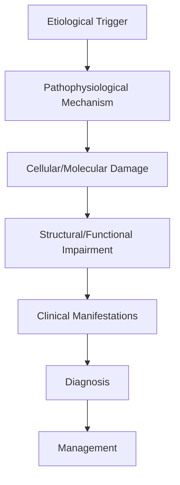
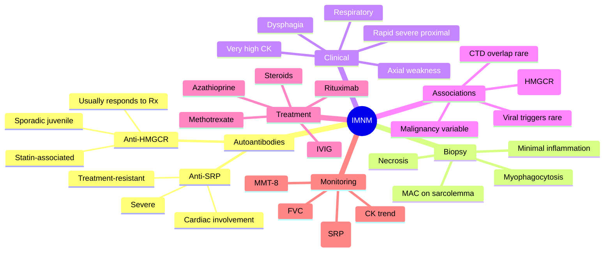

# Immune-Mediated Necrotising Myopathy

> [!tip] **High-Yield Definition**
> Comprehensive clinical note for Immune-Mediated Necrotising Myopathy covering definition, epidemiology, aetiology, pathophysiology, clinical features, investigations, differential diagnosis, management, drug interactions, procedures, complications, red flags, prognosis, topic correlation, and special situations for FCPS/MRCP examination preparation based on Davidson 24th Edition Chapter 25: Neurology.

---

## 1. Definition / Epidemiology / Classification

### Definition
Immune-Mediated Necrotising Myopathy is a neurological disorder within the 10 muscle disorders category. It is characterised by specific clinical, pathological, radiological, and laboratory features that allow differentiation from related conditions.

### Epidemiology
- **Incidence/Prevalence:** Variable depending on the specific condition.
- **Age:** Adult onset is most common, but paediatric and elderly presentations occur.
- **Sex:** Variable depending on the condition.
- **Geography:** Worldwide distribution, with higher prevalence in certain regions.
- **Risk Factors:** Genetic predisposition, environmental factors, comorbidities, family history.

### Classification
| Subtype | Key Features | Prognosis |
|---------|-------------|-----------|
| Mild/early | Subtle symptoms, preserved function | Best |
| Moderate | Clear symptoms, functional impairment | Variable |
| Severe | Significant disability, complications | Worst |

---

## 2. Aetiology / Pathophysiology

### Aetiology
- **Primary (idiopathic):** Most cases have no identifiable cause.
- **Genetic:** May be inherited (AD, AR, X-linked, mitochondrial, sporadic).
- **Autoimmune:** Autoantibodies, immune-mediated inflammation.
- **Infectious:** Viral, bacterial, fungal, parasitic.
- **Metabolic:** Electrolyte, endocrine, hepatic, renal, nutritional.
- **Toxic:** Drugs, alcohol, heavy metals, environmental toxins.
- **Vascular:** Ischaemia, haemorrhage, vasculitis.
- **Neoplastic:** Primary, secondary, paraneoplastic.
- **Traumatic:** Acute, chronic, repetitive.
- **Degenerative:** Neurodegeneration, protein misfolding.

### Pathophysiology


---

## 3. Clinical Features

### History
- **Onset/Duration:** Acute, subacute, or chronic.
- **Progression:** Static, progressive, relapsing-remitting, stepwise.
- **Key symptoms:** Specific to the condition.
- **Triggers:** Stress, infection, trauma, drugs, hormonal, environmental.
- **Systemic symptoms:** Constitutional features.
- **Drug/Family/Social history:** Relevant exposures, comorbidities.

### Examination
| Domain | Key Findings | Localisation Value |
|--------|-------------|-------------------|
| Higher function | Cognitive, behavioural | Cortical, subcortical, limbic |
| Cranial nerves | Pupils, eye movements, facial, bulbar | Brainstem, cranial nerve, NMJ |
| Motor | Weakness, tone, reflexes | UMN, LMN, NMJ, muscle |
| Sensory | All modalities, pattern | Peripheral, spinal, brainstem |
| Coordination | Ataxia, nystagmus, dysmetria | Cerebellar, sensory, vestibular |
| Gait | Spastic, ataxic, parkinsonian | Multiple |
| Autonomic | Orthostatic, sweating, GI, bladder | Autonomic, peripheral, central |

### Specific Clinical Features
The clinical features are determined by the underlying aetiology, location of pathology, and rate of progression. Patients typically present with a constellation of symptoms and signs that allow clinical localisation and subsequent targeted investigation.

---

## 4. Diagnostic Approach / Algorithm

```mermaid
flowchart TD
    A[Clinical Presentation] --> B[Anatomical Localisation]
    B --> C[Pathophysiological Category]
    C --> D[Formulate Differential]
    D --> E[Targeted Investigations]
    E --> F[Confirm Diagnosis]
    F --> G[Assess Severity/Prognosis]
    G --> H[Initiate Management]
    H --> I[Monitor Response]
    I --> J{Response?}
    J --> YES1 [Good - Continue]
    J --> NO1 [Poor - Escalate]
    YES1 --> K[Monitor]
    NO1 --> H
```

---

## 5. Investigations

### First-Line Investigations
- **Blood tests:** FBC, U&Es, LFTs, glucose, calcium, magnesium, ESR, CRP, autoimmune, infection.
- **Imaging:** CT/MRI brain/spine (essential for most neurological conditions).
- **Neurophysiology:** EEG, nerve conduction, EMG, evoked potentials.
- **CSF:** Cell count, protein, glucose, OCBs, PCR, culture.

### Second-Line Investigations
- **Genetic testing:** Gene panels, WES, WGS.
- **Antibody testing:** Antineuronal, autoimmune, paraneoplastic.
- **Biopsy:** Nerve, muscle, brain, skin.
- **Advanced imaging:** PET-CT, MR spectroscopy, fMRI.

### Specialised Investigations
- **Biomarkers:** Neurofilament light chain, tau, beta-amyloid, 14-3-3, RT-QuIC.
- **Autonomic testing:** Head-up tilt, sudomotor, QSART.
- **Neuropsychology:** Cognitive testing, behavioural assessment.
- **Genetic counselling:** Family screening, predictive testing.

---

## 6. Differential Diagnosis

| Differential | Distinguishing Features | Key Test |
|--------------|------------------------|----------|
| Vascular | Sudden onset, focal, vascular risk factors | MRI/CT, vessel imaging |
| Inflammatory | Subacute, multifocal, systemic | MRI, CSF, antibodies |
| Infectious | Fever, systemic, exposure | Bloods, CSF, imaging |
| Neoplastic | Progressive, mass effect | MRI, biopsy |
| Degenerative | Progressive, symmetric, hereditary | MRI, genetic |
| Toxic/Metabolic | Drug history, systemic, reversible | Bloods, toxicology |
| Autoimmune | Multifocal, antibodies, immunotherapy response | Antibodies, MRI, CSF |
| Functional | Inconsistent, distractible | Clinical, video, biomarkers |

---

## 7. Management

### Acute Management
- **Stabilisation:** ABCDE approach, emergency resuscitation.
- **Specific treatment:** Disease-specific interventions.
- **Symptomatic relief:** Pain, seizures, spasticity, autonomic dysfunction.
- **Prevention of complications:** DVT, pressure sores, infection.

### Disease-Modifying Treatment
- **Pharmacological:** First-line, second-line, escalation, maintenance.
- **Procedural:** Surgery, biopsy, drainage, ablation, stimulation.
- **Immunotherapy:** Steroids, IVIG, plasma exchange, immunosuppressants, biologics.
- **Rehabilitation:** Physiotherapy, OT, speech therapy.

### Long-Term Management
- **Monitoring:** Clinical, imaging, biomarkers, side effects.
- **Prevention:** Vaccinations, prophylaxis, lifestyle modification.
- **Supportive care:** Multidisciplinary team, social work, psychological support.
- **Palliative care:** Advanced care planning, end-of-life care, hospice.

---

## 8. Drug Interactions / Contraindications / Comorbidity Cautions

| Drug Class | Interaction / Caution | Management |
|------------|----------------------|------------|
| Antiseizure medications | Enzyme induction, teratogenicity | Monitor, supplement, switch |
| Immunosuppressants | Infection, malignancy, teratogenicity | Monitor, prophylaxis |
| Anticoagulants | Bleeding risk, drug interactions | Monitor INR, avoid combinations |
| Antihypertensives | Hypotension, falls | Monitor BP, adjust dose |
| Antibiotics | Nephrotoxicity, ototoxicity | Monitor renal |
| Antivirals | Nephrotoxicity, neuropsychiatric | Monitor renal, dose adjust |
| Steroids | DM, HTN, osteoporosis, infection | Monitor, prophylaxis, taper |
| Biologics | Infusion reactions, infection | Monitor, prophylaxis |

---

## 9. Procedures

### Common Procedures
- **Lumbar puncture:** Diagnostic, therapeutic (IIH, NPH). Contraindications: raised ICP, mass lesion, coagulopathy.
- **Nerve conduction studies/EMG:** Diagnostic, prognosis. Minor discomfort.
- **EEG:** Diagnostic, monitoring. No significant complications.
- **MRI brain/spine:** Diagnostic, monitoring. Contraindications: pacemaker, metallic implants.
- **CT head:** Emergency, rapid. Radiation exposure, contrast reactions.
- **Biopsy:** Stereotactic, open. Indications: diagnosis, molecular profiling.

---

## 10. Complications

| Complication | Frequency | Prevention | Management |
|--------------|-----------|------------|------------|
| Infection | Common | Hygiene, prophylaxis, vaccination | Antibiotics, antifungals |
| Thrombosis | Common | Prophylaxis, mobility | Anticoagulation |
| Pressure sores | Common | Positioning, nutrition | Wound care, surgery |
| Spasticity | Common | Positioning, stretching | Baclofen, BoNT |
| Contractures | Common | Passive movements, splints | Physiotherapy, surgery |
| Aspiration | Common | Swallow assessment | NGT, PEG, thickeners |
| Falls | Common | Environment, mobility | Walking aids |
| Fractures | Common | Bone health, prevention | Vitamin D, bisphosphonate |
| Depression | Common | Screening, support | Antidepressants, CBT |
| Cognitive decline | Variable | Monitoring, training | Rehabilitation |
| Autonomic dysfunction | Variable | Monitoring, hydration | Midodrine, fludrocortisone |
| Respiratory failure | Variable | Monitoring, supportive | Ventilation, NIV |
| Death | Variable | Monitoring, palliative | End-of-life care |

---

## 11. Red Flags / Emergencies

### Emergency Presentations
- **Rapid neurological deterioration:** New focal deficit, decreased consciousness, seizures.
- **Status epilepticus:** Continuous seizures >5 min.
- **Raised ICP:** Headache, vomiting, papilloedema, altered consciousness.
- **Respiratory failure:** Hypoxia, hypercapnia, ventilatory failure.
- **Cardiac arrest:** Arrhythmia, MI, pulmonary embolism.
- **Infection:** Sepsis, meningitis, abscess, encephalitis.
- **Drug toxicity:** Overdose, side effects, interactions.
- **Haemorrhage:** Intracranial, systemic, coagulopathy.

---

## 12. Prognosis

### Natural History
- **Acute:** May resolve with treatment, may progress, may be fatal.
- **Subacute:** Variable, depends on cause and treatment.
- **Chronic:** Often progressive, may be stable, may have relapses.
- **Recovery:** Variable, may be complete, partial, or none.

### Prognostic Factors
- **Favourable:** Young age, early treatment, mild disease, reversible cause, good premorbid function, family support.
- **Unfavourable:** Older age, delayed treatment, severe disease, irreversible cause, poor premorbid function, comorbidities.

---

## 13. Topic Correlation

| Related Topic | Link | Key Overlap |
|---------------|------|-------------|
| Davidson 24th Ed Chapter 25 | [[Davidson Chapter 25 - Neurology Hierarchy]] | Comprehensive neurology |
| Neurology MOC | [[Neurology MOC]] | All neurology topics |
| Drug Reference | [[../00_Index/Neurology Drug Reference]] | Medications |
| Local Hub | [[../10_Muscle_Disorders/Hub]] | Section-specific |
| Clinical Examination | [[../01_Fundamentals_Examination/Neurological History Taking]] | Clinical approach |
| Investigation | [[../01_Fundamentals_Examination/Neuroimaging (CT-MRI) Principles]] | Imaging |

---

## 14. Special Situations

| Situation | Consideration |
|-----------|---------------|
| **Pregnancy** | Pre-conception counselling, teratogenicity, drug safety, monitoring, delivery planning, breastfeeding. |
| **Lactation** | Drug safety, breastfeeding, monitoring, support. |
| **Paediatric** | Developmental considerations, drug dosing, school, family, vaccination, growth, puberty. |
| **Elderly / Frail** | Comorbidities, polypharmacy, falls, bone health, cognition, social, end-of-life. |
| **Renal impairment** | Drug dose adjustment, monitoring, dialysis, transplant. |
| **Hepatic impairment** | Drug dose adjustment, monitoring, transplant. |
| **Immunocompromised** | Infection prophylaxis, vaccination, drug interactions, malignancy screening. |
| **Perioperative** | Drug management, anaesthesia planning, VTE prophylaxis, infection prevention, monitoring. |
| **Driving / DVLA** | Fitness to drive, restrictions, notification, reassessment. |
| **Occupational** | Fitness for work, adaptations, rehabilitation, disability, return to work. |

---

## FCPS/MRCP High-Yield Summary

| Category | Key Points |
|----------|------------|
| **Definition** | Comprehensive definition with key diagnostic criteria |
| **Epidemiology** | Incidence, prevalence, age, sex, geography, risk factors |
| **Aetiology** | Primary causes, secondary causes, genetic, environmental |
| **Pathophysiology** | Mechanism of disease, cellular/molecular basis |
| **Clinical Features** | History, examination, key findings, variants |
| **Diagnosis** | Diagnostic criteria, classification, severity |
| **Investigations** | First-line, second-line, specialised, biomarkers |
| **Differential Diagnosis** | Key differentials, distinguishing features, tests |
| **Management** | Acute, disease-modifying, symptomatic, supportive |
| **Complications** | Common, serious, prevention, management |
| **Prognosis** | Natural history, prognostic factors, outcomes |
| **Viva Pearls** | Key examination points |
| **Drug Doses** | First-line, second-line, emergency |
| **Scoring Systems** | Specific scores used in management |
| **Genetics** | Inheritance, genes, mutations, family screening |
| **Imaging Signs** | Characteristic findings, differential |

---

## Viva Questions (PACES/FCPS Style)

1. **Q:** Define and classify its variants.
   **A:** Comprehensive definition with classification of subtypes based on aetiology, severity, and clinical features.

2. **Q:** What are the key clinical features?
   **A:** Specific symptoms and signs including onset, progression, key features, and associated findings.

3. **Q:** What is the first-line treatment?
   **A:** First-line pharmacological and non-pharmacological management based on current evidence.

4. **Q:** What are the red flags requiring urgent referral?
   **A:** Specific emergency presentations and complications requiring immediate intervention.

5. **Q:** What is the prognosis?
   **A:** Natural history, prognostic factors, and long-term outcomes.

6. **Q:** How do you differentiate from key differentials?
   **A:** Clinical features, investigations, and response to treatment that distinguish from alternative diagnoses.

7. **Q:** What investigations are most useful?
   **A:** First-line and second-line investigations including imaging, neurophysiology, CSF, and biomarkers.

8. **Q:** Describe the stepwise management approach.
   **A:** Stepwise escalation from first-line to second-line to third-line therapy with monitoring.

9. **Q:** What are the emergency presentations?
   **A:** Specific emergency scenarios and immediate management priorities.

10. **Q:** How does management change in pregnancy/paediatrics/elderly?
    **A:** Special considerations for each population including drug safety, monitoring, and support.

---

## Common Confusions / Exam Traps

| Confusion | Clarification |
|-----------|---------------|
| Similar presentation but different cause | Differentiate by history, examination, investigations |
| Treatment response vs natural history | Assess with objective measures, biomarkers |
| Drug interactions | Check each drug, monitor, adjust doses |
| Disease progression vs treatment failure | Monitor response, escalate appropriately |
| Functional vs organic | Inconsistent, distractible, disability greater than impairment |
| Acute vs chronic | Time course, progression, reversibility |
| Primary vs secondary | Underlying cause, contributing factors |
| Side effects vs symptoms | Temporal relationship, dose relationship |

---

## Mnemonics

1. **"HMG-SRP-Necrosis"** = **HMGCR** (anti-HMGCR, often statin-associated, also sporadic) and **SRP** (anti-signal recognition particle, severe, treatment-resistant) antibodies characterise immune-mediated necrotising myopathy (IMNM). **Use:** IMNM serology.

2. **"High CK, Low Inflammation"** = IMNM hallmark: CK usually >10× ULN (often 20–100×), with biopsy showing **myofibre necrosis, myophagocytosis, sarcolemmal MAC deposition, but sparse lymphocytic infiltrates** — distinguishing it from polymyositis/dermatomyositis. **Use:** Pathology clue at the bedside.

3. **"Triple Threat Rx"** = First-line: **high-dose corticosteroids + methotrexate (or azathioprine) + IVIG** (especially in anti-HMGCR). Refractory disease: **rituximab** (anti-CD20) or cyclophosphamide. **Use:** IMNM treatment ladder.

---

## Mind Map



---

## Spaced Repetition Trackers

| Topic | Day 1 | Day 3 | Day 7 | Day 14 | Day 30 | Day 90 |
|-------|-------|-------|-------|--------|--------|--------|
| Two main autoantibodies (HMGCR vs SRP) | ☐ | ☐ | ☐ | ☐ | ☐ | ☐ |
| Biopsy: necrosis, sparse inflammation | ☐ | ☐ | ☐ | ☐ | ☐ | ☐ |
| CK typically >10× ULN | ☐ | ☐ | ☐ | ☐ | ☐ | ☐ |
| Treatment ladder: steroids + MTX + IVIG ± rituximab | ☐ | ☐ | ☐ | ☐ | ☐ | ☐ |
| Distinguish from polymyositis | ☐ | ☐ | ☐ | ☐ | ☐ | ☐ |
| Distinguish from statin-toxic myopathy | ☐ | ☐ | ☐ | ☐ | ☐ | ☐ |
| Cardiac/respiratory monitoring | ☐ | ☐ | ☐ | ☐ | ☐ | ☐ |
| Prognosis & chronic course | ☐ | ☐ | ☐ | ☐ | ☐ | ☐ |

---

## Self-Test Scorecard

| # | Topic | 1 | 2 | 3 | 4 | 5 | Score /5 |
|---|-------|---|---|---|---|---|----------|
| 1 | Autoantibody associations | ☐ | ☐ | ☐ | ☐ | ☐ | /5 |
| 2 | Hallmark biopsy features | ☐ | ☐ | ☐ | ☐ | ☐ | /5 |
| 3 | Typical CK range | ☐ | ☐ | ☐ | ☐ | ☐ | /5 |
| 4 | Distinction from polymyositis | ☐ | ☐ | ☐ | ☐ | ☐ | ☐ | /5 |
| 5 | First-line treatment | ☐ | ☐ | ☐ | ☐ | ☐ | /5 |
| 6 | Refractory options (rituximab, IVIG) | ☐ | ☐ | ☐ | ☐ | ☐ | /5 |
| 7 | Statin-associated IMNM management | ☐ | ☐ | ☐ | ☐ | ☐ | /5 |
| 8 | Cardiac & respiratory monitoring | ☐ | ☐ | ☐ | ☐ | ☐ | /5 |
| 9 | Malignancy screening rationale | ☐ | ☐ | ☐ | ☐ | ☐ | /5 |
| 10 | Prognosis and chronicity | ☐ | ☐ | ☐ | ☐ | ☐ | /5 |

---

## MCQs (10)

1. **Question:** A 58-year-old previously on simvastatin develops subacute, severe proximal weakness and CK of 22,000 U/L. The weakness persists after stopping the statin. Which autoantibody is most specific?
   **Options:** A. Anti-HMGCR B. Anti-SRP C. Anti-Jo-1 D. Anti-Mi-2
   **Answer:** A
   **Explanation:** Anti-HMGCR antibodies define an immune-mediated necrotising myopathy that can be triggered by statins but persists after cessation and requires immunosuppression.

2. **Question:** Which autoantibody is associated with a particularly severe, treatment-resistant form of IMNM with frequent cardiac involvement?
   **Options:** A. Anti-HMGCR B. Anti-SRP C. Anti-Ro52 D. Anti-TIF1-γ
   **Answer:** B
   **Explanation:** Anti-SRP myopathy is severe, often treatment-resistant, with rapidly progressive weakness, very high CK, and a higher frequency of cardiac involvement than other subtypes.

3. **Question:** Which of the following biopsy features is most characteristic of IMNM rather than polymyositis?
   **Options:** A. Endomysial CD8+ T-cell infiltrate B. Scattered necrotic and regenerating fibres with myophagocytosis but sparse lymphocytic infiltrate C. Perifascicular atrophy D. Perivascular CD4+ T-cell infiltrate with complement on capillaries
   **Answer:** B
   **Explanation:** IMNM shows necrotic fibres, myophagocytosis and sarcolemmal MAC deposition with minimal inflammation, distinguishing it from the CD8+ T-cell infiltrate of polymyositis and perifascicular atrophy of dermatomyositis.

4. **Question:** Which is the typical CK range in IMNM at presentation?
   **Options:** A. Normal B. <2× ULN C. >10× ULN (often 20–100× ULN) D. Always >200× ULN
   **Answer:** C
   **Explanation:** CK is characteristically markedly elevated (commonly >10× ULN) and is useful for monitoring disease activity.

5. **Question:** Which first-line immunosuppressive regimen is most commonly used in IMNM?
   **Options:** A. High-dose corticosteroids with methotrexate or azathioprine, often combined with IVIG B. Azithromycin monotherapy C. Rituximab as first-line in all cases D. Plasma exchange only
   **Answer:** A
   **Explanation:** First-line treatment is high-dose corticosteroids with a steroid-sparing agent (methotrexate or azathioprine); IVIG is frequently added, particularly for anti-HMGCR IMNM.

6. **Question:** A patient with anti-HMGCR IMNM remains weak with CK >10,000 U/L after 8 weeks of high-dose steroids and methotrexate. Which next step is most appropriate?
   **Options:** A. Add IVIG or rituximab B. Stop all immunosuppression C. Increase methotrexate to maximum dose only D. Switch to antibiotics
   **Answer:** A
   **Explanation:** Refractory IMNM responds to IVIG and/or rituximab (anti-CD20); early escalation is associated with better outcomes.

7. **Question:** A 70-year-old presents with severe proximal weakness, very high CK, and biopsy showing necrotic fibres with minimal inflammation. He has never used statins. What is the most likely autoantibody status?
   **Options:** A. Anti-HMGCR positive (statin-independent cases occur) B. Anti-Mi-2 positive C. Anti-PL-7 positive D. Anti-SAE positive
   **Answer:** A
   **Explanation:** Anti-HMGCR IMNM also occurs in statin-naïve patients (particularly children and young adults); absence of statin exposure does not exclude the diagnosis.

8. **Question:** Which of the following best distinguishes statin-induced toxic myopathy from statin-induced IMNM?
   **Options:** A. Toxic myopathy resolves after stopping statin; IMNM persists with rising CK and autoantibodies B. Both are identical and require biopsy to differentiate C. Toxic myopathy shows inflammation on biopsy; IMNM does not D. IMNM is associated with low CK
   **Answer:** A
   **Explanation:** Statin-toxic myopathy improves within weeks of cessation; IMNM persists or progresses, with very high CK, myopathic EMG and anti-HMGCR antibodies, requiring immunosuppression.

9. **Question:** Compared with dermatomyositis, the strength of association between IMNM and malignancy is:
   **Options:** A. Stronger B. Equal C. Weaker and inconsistent D. IMNM is never associated with cancer
   **Answer:** C
   **Explanation:** IMNM has a weaker and more inconsistent association with malignancy than dermatomyositis (especially in anti-TIF1-γ positive cases); targeted screening is still often undertaken, particularly in older adults.

10. **Question:** Which serological marker is most associated with poor prognosis and treatment-resistant disease in IMNM?
    **Options:** A. Anti-SRP B. Anti-HMGCR C. Anti-Ro52 D. Anti-NXP2
    **Answer:** A
    **Explanation:** Anti-SRP IMNM is associated with severe weakness, very high CK, frequent cardiac involvement and a treatment-resistant course.

---

## SBA Questions (10)

1. **Scenario:** A 65-year-old previously on simvastatin presents with 3 months of progressive proximal weakness and CK of 28,000 U/L. Statin was stopped 2 months ago with no improvement. Muscle biopsy shows necrotic fibres with sparse lymphocytic infiltrate and sarcolemmal MAC deposition. Anti-HMGCR antibodies are positive.
   **Question:** What is the most appropriate next step in management?
   **Options:** A. Reassure and continue observation B. Restart statin at lower dose C. Start high-dose corticosteroids plus methotrexate, add IVIG, monitor response D. Add bezafibrate
   **Answer:** C
   **Explanation:** Anti-HMGCR IMNM persists despite statin cessation; first-line treatment is high-dose steroids with a steroid-sparing agent (methotrexate) plus IVIG, with close monitoring.

2. **Scenario:** A 52-year-old woman with rapidly progressive proximal and axial weakness, CK 35,000 U/L, and EMG showing florid myopathic units. Anti-SRP antibodies are positive.
   **Question:** What is the most appropriate initial treatment?
   **Options:** A. Reassure and repeat CK in 3 months B. High-dose corticosteroids + methotrexate, with early IVIG and consideration of rituximab C. Aspirin and statins D. Plasma exchange only
   **Answer:** B
   **Explanation:** Anti-SRP IMNM is severe and treatment-resistant; aggressive early combination therapy (steroids + methotrexate + IVIG ± rituximab) is recommended, with cardiac monitoring.

3. **Scenario:** A 45-year-old with biopsy-proven IMNM and anti-HMGCR antibodies is started on steroids and methotrexate but has CK 12,000 U/L and persistent MMT-8 <120/150 at 3 months.
   **Question:** Which next step is most appropriate?
   **Options:** A. Stop immunosuppression and observe B. Add IVIG and consider rituximab C. Increase methotrexate dose only D. Start statins
   **Answer:** B
   **Explanation:** Incomplete response at 3 months warrants escalation with IVIG and/or rituximab; both have evidence for efficacy in IMNM.

4. **Scenario:** A patient with IMNM on combination immunosuppression develops exertional dyspnoea; FVC is 55% predicted and overnight oximetry shows desaturations to 86%.
   **Question:** Which intervention is most appropriate?
   **Options:** A. Start nocturnal non-invasive ventilation B. Continue observation C. Reduce immunosuppression D. Stop physiotherapy
   **Answer:** A
   **Explanation:** Symptomatic nocturnal hypoventilation with FVC <60% and desaturation warrants nocturnal NIV in addition to active treatment of the underlying disease.

5. **Scenario:** A 68-year-old with IMNM is found to have mildly reduced left ventricular ejection fraction (45%) on echocardiography; he has anti-SRP antibodies.
   **Question:** Which statement is most accurate?
   **Options:** A. Cardiac involvement is rare and not seen in IMNM B. Anti-SRP IMNM has a recognised association with cardiac involvement, including cardiomyopathy C. Cardiac disease is only seen with statins D. Echo should be avoided
   **Answer:** B
   **Explanation:** Anti-SRP IMNM is particularly associated with cardiac involvement (cardiomyopathy, arrhythmias); baseline and serial cardiac evaluation (ECG, echo, troponin, NT-proBNP) is recommended.

6. **Scenario:** A 38-year-old woman with IMNM and anti-HMGCR antibodies wants to conceive.
   **Question:** Which immunosuppressive agent should be discontinued before conception?
   **Options:** A. Methotrexate (teratogenic) B. Prednisolone C. Azathioprine D. IVIG
   **Answer:** A
   **Explanation:** Methotrexate is teratogenic and must be stopped ≥3 months before conception; azathioprine, IVIG and steroids (lowest effective dose) are usually continued with obstetric input.

7. **Scenario:** A 60-year-old with IMNM on steroids and methotrexate remains weak with CK 8000 U/L after 6 months. His baseline EMG had florid myopathic changes. A repeat EMG is unchanged.
   **Question:** Which next-line agent is most evidence-supported?
   **Options:** A. Rituximab B. Colchicine C. Methotrexate escalation only D. Acetazolamide
   **Answer:** A
   **Explanation:** Rituximab (anti-CD20 B-cell depletion) is the most evidence-supported escalation therapy in refractory IMNM, particularly when conventional immunosuppression and IVIG have failed.

8. **Scenario:** A 50-year-old with IMNM and anti-SRP antibodies is started on high-dose steroids, methotrexate and IVIG. After 6 weeks, CK has fallen from 35,000 to 7000 U/L but MMT-8 has not improved.
   **Question:** What is the most appropriate action?
   **Options:** A. Stop all treatment as CK is improving B. Continue current regimen and add rituximab; reassess strength over months C. Add bezafibrate D. Add statin
   **Answer:** B
   **Explanation:** In IMNM, CK often improves faster than strength; continue immunosuppression and consider rituximab, with serial MMT-8 and CK monitoring over months.

9. **Scenario:** A 70-year-old presents with proximal weakness and CK 18,000 U/L; biopsy shows necrotic fibres, sparse inflammation and sarcolemmal MAC; myositis-specific antibody panel returns negative.
   **Question:** What is the most appropriate next step?
   **Options:** A. Reassure B. Repeat CK in 6 months C. Treat as seronegative IMNM with steroids + methotrexate ± IVIG D. Add statin
   **Answer:** C
   **Explanation:** Seronegative IMNM exists; biopsy features (necrosis with sparse inflammation and MAC) should drive treatment even if the antibody panel is negative.

10. **Scenario:** A 56-year-old with anti-HMGCR IMNM is in biochemical remission (CK 200 U/L) on low-dose steroids and methotrexate; MMT-8 is 142/150 and FVC 75%.
    **Question:** What is the most appropriate follow-up plan?
    **Options:** A. Stop all treatment immediately B. Continue immunosuppression for ≥1–2 years; slow taper with monitoring of CK and strength; relapse risk is high C. Switch to statin therapy D. Discharge from follow-up
    **Answer:** B
    **Explanation:** IMNM has a high relapse rate; maintenance immunosuppression is continued for at least 1–2 years with very slow taper and serial CK/MMT-8 monitoring.

---

## Tags

#neurology #muscle #IMNM #necrotisingmyopathy #antiHMGCR #antiSRP #statin #rhabdomyolysis #immunosuppression #FCPS #MRCP #PACES

---

## Local Navigation
**Heading Hub:** [[../Hub]]  
**Chapter Hierarchy:** [[Davidson Chapter 25 - Neurology Hierarchy]]  
**Chapter MOC:** [[Neurology MOC]]  
**Drug Reference:** [[../00_Index/Neurology Drug Reference]]

## PasTest Scenario SBAs (Clinical Vignettes)

> **Auto-generated PasTest/Mediscope-style scenario SBAs** grounded in the authored source. Each scenario tests a real clinical fact (triad, specific sign, contraindication, trial, first-line Rx) extracted from the topic. *Source: Ch 27: Neurology & Stroke — Immune-Mediated Necrotising Myopathy*

**Q1.** Which of the following features is most specific or characteristic of Immune-Mediated Necrotising Myopathy?

  - **A.** Key symptoms:
  - **B.** A feature common to many acute inflammatory conditions
  - **C.** A non-specific sign that does not localise the diagnosis
  - **D.** An investigation finding rather than a clinical feature

  > **Answer: A** — Key symptoms:
  >
  > *Source:* - **Key symptoms:** Specific to the condition

**Q2.** What is the most appropriate first-line therapy for Immune-Mediated Necrotising Myopathy?

  - **A.** Rehabilitation:
  - **B.** An advanced/surgical therapy reserved for refractory disease
  - **C.** Symptomatic treatment only, no disease-modifying therapy
  - **D.** Empiric broad-spectrum therapy without specific indication

  > **Answer: A** — Rehabilitation:
  >
  > *Source:* **Rehabilitation:** Physiotherapy, OT, speech therapy.

