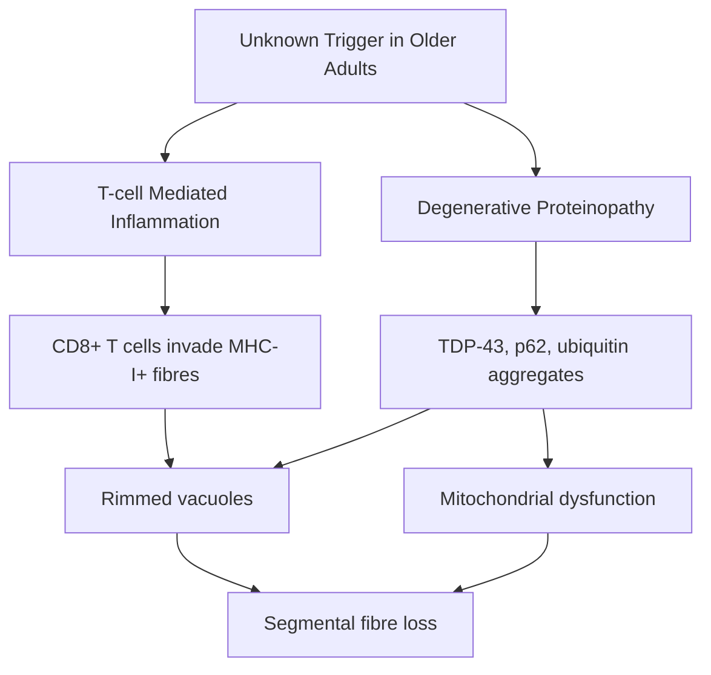

# Inclusion Body Myositis (IBM)

Related: [[Polymyositis]], [[Dermatomyositis]], [[Muscular Dystrophies]], [[Motor Neurone Disease]]

> [!tip] **High-Yield**
> IBM is the **most common acquired myopathy >50 yr** and the most commonly **misdiagnosed** (often mistaken for polymyositis, ALS, or treatment-resistant polymyositis). **Clinical triad:** (1) **finger flexor weakness** (key grip loss), (2) **quadriceps wasting** (buckling knees, falls), (3) **asymmetric/segmental** weakness; **dysphagia in 60%**. Pathology: **rimmed vacuoles**, **protein aggregates** (TDP-43, p62), endomysial CD8+ T cells. **Anti-cN1A (NT5C1A)** in 30-60%. **Refractory to steroids and most immunosuppression** — multidisciplinary care is mainstay.

## 1. Definition / Epidemiology / Classification

### Definition
A sporadic, slowly progressive, **asymmetric inflammatory myopathy** of older adults, combining **inflammatory** (T-cell mediated) and **degenerative** (protein aggregation) features. Distinct from polymyositis due to **distal/segmental involvement, age, and refractoriness**.

### Epidemiology
- **Prevalence:** 5-9/1,000,000 (rising in older age)
- **Most common acquired myopathy >50 yr**
- **M > F** (3:1)
- **Median onset age:** 60-65 yr (rare <50)
- **Diagnosis delay:** average 5-8 yr

### Classification (ENMC 2011)
| Category | Criteria |
|----------|----------|
| **Clinically defined IBM** | Finger flexor + quadriceps weakness + ≥1 of: ↑CK, EMG myopathic, MRI oedema; age >45; slow progression |
| **Probable IBM** | Clinically defined + biopsy with rimmed vacuoles OR protein aggregation (TDP-43, p62) |
| **Definite IBM** | Clinically defined + invasion of non-necrotic fibres + rimmed vacuoles + protein aggregates |

## 2. Pathophysiology

### Molecular / Genetic
- **Anti-cN1A (NT5C1A)** cytosolic 5'-nucleotidase 1A: 30-60% of IBM (specificity 90%+)
- **Protein aggregates:** TDP-43, p62, ubiquitin, amyloid-β, tau, α-synuclein
- **HLA-DR3, HLA-DRB1** associated
- **Mitochondrial DNA deletions**

## 3. Clinical Features

### Classic Triad
1. **Finger flexor weakness** (especially flexor digitorum profundus) — **loss of key grip, fine motor (buttoning, writing)**
2. **Quadriceps wasting** (vastus lateralis/medialis) — **buckling knees, falls, difficulty rising from chair, climbing stairs**
3. **Asymmetric** (often starts one side, contralateral within months-years)

### Other Features
- **Dysphagia** 60% (cricopharyngeal dysfunction)
- **Foot drop** (anterior tibial)
- **Wrist/finger extensors** also weak
- **Progression:** Slow (years-decades) — wheelchair 10-15 yr after diagnosis
- **Cardiac:** Rare
- **ILD:** Rare
- **No rash** (vs DM)
- **No extramuscular** features (SLE, SSc overlap rare)

## 4. Diagnostic Approach

### Diagnostic Criteria (ENMC 2011 — Lloyd/Griggs)
- **Clinically defined** = combination of:
  - **Finger flexor weakness** AND **quadriceps weakness**
  - **OR** finger flexor or quadriceps weakness + **≥1** of: ↑CK, EMG, MRI
  - Age >45 yr
  - Slow progression
- **Pathologically defined** = rimmed vacuoles + invasion of non-necrotic fibres + protein aggregates (TDP-43, p62)

## 5. Investigations

| Test | Indication | Finding |
|------|------------|---------|
| **CK** | All | Mild-moderate ↑ (often <10x); rarely >10x |
| **EMG** | Diagnostic uncertainty | Myopathic + fibrillations; can mimic MND |
| **MRI STIR** | Biopsy site, monitor | Asymmetric oedema + fatty replacement (esp. quadriceps, FDP) |
| **Muscle biopsy** | Diagnostic confirmation | **Rimmed vacuoles** (Gomori trichrome), endomysial CD8+ T cells, **TDP-43/p62 aggregates** |
| **Anti-cN1A (NT5C1A)** | Supportive | 30-60% (specificity high) |
| **Autoimmune panel** | Exclude overlap | ANA, Jo-1 (usually -ve) |
| **Swallow assessment** | Dysphagia | Cricopharyngeal dysfunction |

## 6. Differential Diagnosis
| Differential | Distinguishing | Test |
|--------------|----------------|------|
| **Polymyositis** | Symmetric, proximal, steroid-responsive | Biopsy (no rimmed vacuoles), Jo-1 |
| **ALS** | Mixed UMN+LMN, fasciculations, bulbar, hyperreflexia | EMG (denervation + reinnervation), clinical |
| **Limb-girdle muscular dystrophy** | Family history, younger, calpain/other gene | Genetic, biopsy |
| **Facioscapulohumeral MD** | Face, scapular winging, asymmetric | Genetic (D4Z4) |
| **IBM mimics (anti-synthetase)** | ILD, mechanics' hands, Jo-1 | Myositis Abs |
| **Cushing's myopathy** | Steroid use, central obesity | Cortisol |

## 7. Management

### Standard Approach
- **IBM is REFRACTORY to immunosuppression** — manage expectations
- **Multidisciplinary care** is mainstay:
  - **Physiotherapy:** Graded exercise, balance, falls prevention
  - **Occupational therapy:** Adaptive devices (jar openers, button hooks)
  - **Speech/swallow:** Cricopharyngeal myotomy, balloon dilation, PEG if severe
  - **Orthotics:** AFO for foot drop, knee-ankle-foot orthosis
  - **Falls prevention:** Home assessment, vitamin D, bone density
  - **Psychological support:** Depression common
  - **Cardiac/respiratory monitoring:** Rarely involved; baseline

### Immunomodulation (Limited Benefit)
- **Prednisolone** 1 mg/kg — may slow for months; not long-term
- **Methotrexate, azathioprine, MMF** — small trial benefit; often tried
- **IVIG** — equivocal; may help dysphagia
- **Rituximab** — small case series suggest benefit
- **Arimoclomol, follistatin gene therapy** — under investigation
- **Alemtuzumab** — limited data
- **Anti-TDP-43 therapies** — research

### Emerging / Investigational
- **Arimoclomol** (HSP inducer) — phase 2/3
- **Follistatin gene therapy** (FS344) — increased strength
- **Anti-IFN-γ (emapalumab)** — case reports
- **Anakinra (IL-1Ra)** — under study
- **Sirolimus (mTOR)** — case reports

## 8. Drug Cautions
- **Steroids** — long-term side effects outweigh benefits; avoid chronic use
- **Immunosuppression** — limited evidence; discuss benefit/harm
- **IVIG** — AKI, thrombosis; hydrate, slow infusion

## 9. Procedures
- **Muscle biopsy:** Open or needle — affected muscle (e.g., vastus lateralis, deltoid, FDP); shows **rimmed vacuoles** on Gomori trichrome + **TDP-43/p62** aggregates
- **Cricopharyngeal myotomy / dilation** — dysphagia
- **PEG** — severe dysphagia with aspiration

## 10. Complications
| Complication | Frequency | Management |
|--------------|-----------|-----------|
| **Falls** | 70-80% | PT, balance, orthotics, vitamin D |
| **Dysphagia/aspiration** | 60% | Swallow therapy, cricopharyngeal surgery, PEG |
| **Wheelchair dependence** | 50% at 10 yr | Mobility aids, home adaptation |
| **Disability (ADL loss)** | Progressive | OT, social support |
| **Depression** | 30-40% | Counselling, SSRIs |
| **Foot drop** | 30% | AFO |

## 11. Red Flags
| Red Flag | Action |
|----------|--------|
| **Rapid progression (weeks-months)** | Exclude necrotising myopathy, vasculitis |
| **Cardiac/respiratory involvement** | Cardiac echo, PFTs — atypical |
| **Marked ↑↑CK >10x** | Exclude IMNM (anti-SRP, HMGCR) |
| **Fasciculations + hyperreflexia** | Exclude ALS |
| **Family history** | Exclude hereditary myopathy |
| **Skin rash** | Exclude DM |

## 12. Prognosis
| Factor | Good | Poor |
|--------|------|------|
| **Onset age** | Younger | Older |
| **Progression** | Slow | Rapid |
| **Response to Rx** | Some | None |
| **Dysphagia** | Mild | Severe (PEG) |

- **Median time to wheelchair:** 10-15 yr
- **Median time to death:** 20-30 yr (often age-related)
- **Cause of death:** Often unrelated (aspiration pneumonia, falls, cardiovascular)

## 13. Topic Correlation
| Topic | Link | Overlap |
|-------|------|---------|
| **Polymyositis** | [[Polymyositis]] | Symmetric, proximal, steroid-responsive |
| **DM** | [[Dermatomyositis]] | Rash, perifascicular atrophy |
| **ALS** | [[Motor Neurone Disease]] | Asymmetric, bulbar, IBM mimics |
| **LGMD** | [[Muscular Dystrophies]] | Proximal weakness, family history |
| **Anti-synthetase** | [[Polymyositis]] | ILD, mechanics' hands |

## 14. Special Situations
| Situation | Consideration |
|-----------|---------------|
| **Pregnancy** | IBM rare <50; supportive care; no specific teratogenic concerns |
| **Paediatric** | **Not seen** — exclude other diagnoses |
| **Elderly** | Most common scenario; falls risk, polypharmacy, social isolation |
| **Renal** | No specific issue; IVIG hydrate |
| **Hepatic** | No specific issue |
| **Perioperative** | Anaesthesia: check respiratory muscle function, swallow |
| **Driving (DVLA)** | Mobility issues; report to DVLA if relevant |
| **Vaccination** | Standard; avoid live if on immunosuppression |

## FCPS/MRCP High-Yield Summary
| Category | Key Points |
|----------|------------|
| **Definition** | Sporadic, acquired, inflammatory + degenerative myopathy of older adults |
| **Epidemiology** | Most common acquired myopathy >50 yr; M>F (3:1); 5-9/1M |
| **Pathophysiology** | CD8+ T cell inflammation + protein aggregation (TDP-43, p62) |
| **Clinical** | **Finger flexor + quadriceps weakness**; asymmetric; dysphagia 60%; slow progression |
| **Diagnosis** | ENMC 2011: clinical (finger flexor + quadriceps) + biopsy (rimmed vacuoles, TDP-43) |
| **Antibody** | Anti-cN1A (NT5C1A) — 30-60%, high specificity |
| **Investigations** | CK mildly ↑, EMG myopathic, MRI oedema + fat, biopsy gold standard |
| **Management** | **REFRACTORY to steroids/IS**; MDT care, PT/OT, falls prevention, cricopharyngeal surgery |
| **Complications** | Falls (70-80%), dysphagia (60%), wheelchair (50% at 10 yr) |
| **Prognosis** | Wheelchair 10-15 yr; slow progression; not curable |
| **Viva** | "Most common acquired myopathy >50"; "finger flexor + quadriceps"; "rimmed vacuoles"; "refractory" |

## Viva Questions
1. **Q:** What is the classic clinical triad of IBM?
   **A:** **Finger flexor weakness** (loss of key grip) + **quadriceps wasting** (buckling knees, falls) + **asymmetric** weakness. Often associated with dysphagia (60%).
2. **Q:** What does muscle biopsy show in IBM?
   **A:** **Rimmed vacuoles** (Gomori trichrome), **endomysial CD8+ T cell invasion** of non-necrotic fibres, **protein aggregates** (TDP-43, p62, ubiquitin).
3. **Q:** Why is IBM refractory to treatment?
   **A:** Combination of **inflammatory** (T cell) and **degenerative** (proteinopathy) components. Most immunosuppressants target inflammation but the degenerative component progresses. Steroids may give transient mild improvement but don't change long-term outcome.
4. **Q:** What antibody is associated with IBM?
   **A:** **Anti-cN1A (anti-NT5C1A)** — cytosolic 5'-nucleotidase 1A. Present in 30-60% (specificity ~90%). Not routinely used for diagnosis but supportive.
5. **Q:** How do you differentiate IBM from polymyositis?
   **A:** **IBM:** older (>50), M>F, distal/segmental (finger flexors, quadriceps), asymmetric, slow, refractory, rimmed vacuoles, anti-cN1A. **PM:** younger, F>M, symmetric proximal, steroid-responsive, endomysial CD8+ T, anti-Jo-1.
6. **Q:** How do you differentiate IBM from ALS?
   **A:** **IBM:** no UMN, no fasciculations, no hyperreflexia, slowly progressive, myopathic EMG, ↑CK. **ALS:** mixed UMN+LMN, fasciculations, hyperreflexia, neurogenic EMG (denervation + reinnervation), normal CK.
7. **Q:** What is the most common complication of IBM?
   **A:** **Falls** (70-80% due to quadriceps weakness and foot drop). Dysphagia with aspiration (60%) is also significant.
8. **Q:** What is the role of physiotherapy in IBM?
   **A:** **Graded resistance exercise** improves/maintains strength and function; balance training; falls prevention. Avoid bed rest deconditioning.
9. **Q:** When is PEG indicated in IBM?
   **A:** Severe dysphagia with recurrent aspiration, weight loss, or unsafe swallow despite cricopharyngeal myotomy/dilation.
10. **Q:** What is the typical progression of IBM?
    **A:** Slow progression over decades; median time to wheelchair 10-15 years; median time to death 20-30 years (often age-related).

## Common Confusions
| Confusion | Clarification |
|-----------|---------------|
| IBM vs PM | IBM: distal/segmental, older, refractory, rimmed vacuoles; PM: symmetric proximal, younger, steroid-responsive |
| IBM vs ALS | IBM: no UMN, no fasciculations, ↓reflexia, myopathic EMG; ALS: UMN+LMN, fasciculations, hyperreflexia, neurogenic EMG |
| IBM vs LGMD | LGMD: family history, younger onset, genetic, biopsy dystrophic pattern |
| IBM mimics | Anti-synthetase syndrome, IMNM, drug-induced myopathy (statins) |
| Anti-cN1A specificity | High specificity (~90%) but sensitivity only 30-60% — not required for diagnosis |
| Steroid trial in IBM | Often tried but rarely helpful; don't continue if no benefit at 3-6 months |

## Mnemonics
1. **IBM = "I Ban Meds"** — refractory to immunosuppression
2. **3 Qs of IBM** — **Q**uad wasting, **Q**uite old, **Q**uery cause
3. **FINgers and FEet** — **F**inger flexors, **F**alls (quadriceps), **F**at replacement on MRI
4. **VACUOLES** — **V**acuoles (rimmed), **A**ggregates (TDP-43), **C**D8+ T, **U**biquitin, **O**lder (M>50), **L**ong progression, **E**ndomysial inflammation, **S**low

## One-Page Revision Card
| Topic | Inclusion Body Myositis |
|-------|--------------------------|
| **Definition** | Sporadic acquired inflammatory + degenerative myopathy of older adults |
| **Key Clinical** | **Finger flexor + quadriceps weakness**, asymmetric, dysphagia 60% |
| **Diagnosis** | ENMC 2011: clinical (finger flexor + quadriceps, age >45, slow) + biopsy (rimmed vacuoles, TDP-43) |
| **Antibody** | Anti-cN1A (NT5C1A) 30-60% |
| **Investigations** | CK mild-moderate ↑; EMG myopathic; MRI asymmetric oedema + fat; biopsy gold standard |
| **Management** | **Refractory to steroids/IS**; MDT care; PT/OT; falls prevention; cricopharyngeal surgery for dysphagia |
| **Prognosis** | Slow progression; wheelchair 10-15 yr; not curable |
| **Viva** | "Most common acquired myopathy >50"; "rimmed vacuoles"; "refractory" |

## Must Know / Should Know
- [ ] **Must:** Finger flexor + quadriceps triad; older age; rimmed vacuoles; refractory to steroids
- [ ] **Should:** Anti-cN1A, ENMC 2011 criteria, dysphagia (60%), falls (70-80%), MDT approach
- [ ] **Nice:** TDP-43 proteinopathy, emerging therapies (arimoclomol, follistatin gene therapy)

## MCQs (10)

1. **Question:** Which is the classic clinical pattern in inclusion body myositis?
   **Options:** A. Symmetric proximal weakness B. Asymmetric finger flexor and quadriceps weakness C. Distal lower limb only D. Bulbar symptoms only
   **Answer:** B
   **Explanation:** IBM is characterised by **asymmetric** weakness of **finger flexors** (loss of key grip) and **quadriceps** (buckling knees, falls), often with dysphagia. Symmetric proximal weakness is polymyositis.

2. **Question:** What is the characteristic muscle biopsy finding in IBM?
   **Options:** A. Perifascicular atrophy B. Rimmed vacuoles with protein aggregates (TDP-43) C. Endomysial CD8+ T cells only D. Necrotic fibres with macrophages
   **Answer:** B
   **Explanation:** **Rimmed vacuoles** (Gomori trichrome) + **TDP-43/p62 protein aggregates** + endomysial CD8+ T cells = IBM. Perifascicular atrophy = DM. Necrotic fibres with macrophages = IMNM.

3. **Question:** IBM typically responds to which treatment?
   **Options:** A. Prednisolone B. IVIG C. Methotrexate D. None — refractory
   **Answer:** D
   **Explanation:** IBM is **refractory to most immunosuppression** (steroids, methotrexate, IVIG). Multidisciplinary supportive care (PT, OT, falls prevention, swallow therapy) is mainstay. Some patients get short-term steroid benefit.

4. **Question:** Which antibody is most specific for IBM?
   **Options:** A. Anti-Jo-1 B. Anti-Mi-2 C. Anti-cN1A (NT5C1A) D. Anti-TIF1γ
   **Answer:** C
   **Explanation:** **Anti-cN1A (NT5C1A)** is present in 30-60% of IBM patients with high specificity (~90%). Anti-Jo-1 = antisynthetase, anti-Mi-2 = DM, anti-TIF1γ = cancer-associated DM.

5. **Question:** The typical demographic for IBM is:
   **Options:** A. Young females B. Older males (>50 yr) C. Children D. Middle-aged females
   **Answer:** B
   **Explanation:** IBM affects **older males** (M:F = 3:1), median age 60-65 years, rarely <50. Average diagnostic delay 5-8 years.

6. **Question:** Which feature is common in IBM but rare in polymyositis?
   **Options:** A. Symmetric weakness B. Steroid responsiveness C. Dysphagia (60%) D. Anti-Jo-1 antibody
   **Answer:** C
   **Explanation:** **Dysphagia** occurs in 60% of IBM (cricopharyngeal dysfunction) but is uncommon in PM. IBM is also asymmetric and refractory to steroids.

7. **Question:** What is the most common complication of IBM?
   **Options:** A. Cardiac involvement B. ILD C. Falls D. Malignancy
   **Answer:** C
   **Explanation:** **Falls** (70-80%) due to quadriceps weakness and foot drop are the most common complication. Dysphagia with aspiration (60%) is also significant. Cardiac and respiratory involvement are rare.

8. **Question:** What is the most useful imaging modality in IBM?
   **Options:** A. CT chest B. MRI STIR C. PET-CT D. Bone scan
   **Answer:** B
   **Explanation:** **MRI STIR/T2** shows asymmetric oedema (active) and fatty replacement (chronic) — typical pattern in quadriceps and finger flexors. Useful for biopsy site selection and disease monitoring.

9. **Question:** IBM is characterised by which of the following?
   **Options:** A. Pure inflammatory myopathy B. Pure degenerative myopathy C. Combination of inflammation and protein aggregation D. Mitochondrial inheritance
   **Answer:** C
   **Explanation:** IBM combines **inflammatory** (CD8+ T cells, MHC-I upregulation) and **degenerative** (TDP-43, p62, ubiquitin, amyloid-β) features. This dual pathology explains refractoriness to immunosuppression alone.

10. **Question:** Treatment of severe dysphagia in IBM includes:
    **Options:** A. Long-term steroids B. Cricopharyngeal myotomy or balloon dilation C. Tracheostomy D. Total parenteral nutrition
    **Answer:** B
    **Explanation:** **Cricopharyngeal myotomy** or **balloon dilation** is effective for dysphagia. PEG reserved for severe, refractory cases. Steroids are not effective long-term.

## SBA Questions (10)

1. **Scenario:** 70-year-old man with 5-year history of progressive hand weakness (key grip loss) and buckling knees. Falls 2-3x/month. CK 800. EMG myopathic with fibrillations. What is the most likely diagnosis?
   **Options:** A. Polymyositis B. Inclusion body myositis C. ALS D. Polymyalgia rheumatica
   **Answer:** B
   **Explanation:** Older male, **finger flexor + quadriceps weakness**, slowly progressive, falls, mildly ↑CK = IBM. ALS would have UMN signs, fasciculations, hyperreflexia.

2. **Scenario:** 65-year-old woman with IBM. What is the most appropriate initial treatment approach?
   **Options:** A. Prednisolone 1 mg/kg + MTX B. IVIG monthly C. Multidisciplinary supportive care (PT, OT, swallow) D. Rituximab
   **Answer:** C
   **Explanation:** IBM is **refractory to most immunosuppression**; MDT supportive care is the mainstay — PT (graded exercise, balance), OT (adaptive devices), swallow therapy, falls prevention.

3. **Scenario:** 68-year-old man with IBM, dysphagia, recurrent aspiration pneumonia, weight loss 8 kg. Swallow assessment shows cricopharyngeal dysfunction. What is the most appropriate intervention?
   **Options:** A. Increase oral intake B. Cricopharyngeal myotomy or balloon dilation C. Long-term steroids D. Tracheostomy
   **Answer:** B
   **Explanation:** **Cricopharyngeal myotomy** or endoscopic balloon dilation effectively treats cricopharyngeal dysfunction in IBM. PEG if aspiration persists. Steroids are ineffective for this complication.

4. **Scenario:** 72-year-old man with IBM, foot drop. Falls 3-4x/month. What intervention is most appropriate?
   **Options:** A. Wheelchair B. Ankle-foot orthosis (AFO), balance training, home assessment C. Steroids D. Hip replacement
   **Answer:** B
   **Explanation:** **AFO** stabilises foot drop; combined with balance training, home assessment (remove rugs, install grab bars), and PT — all reduce falls. Wheelchair is a last resort.

5. **Scenario:** 60-year-old man with suspected IBM. Anti-cN1A +. What does this antibody indicate?
   **Options:** A. Specific for polymyositis B. Supports IBM diagnosis (specificity ~90%) C. Cancer association D. Antisynthetase syndrome
   **Answer:** B
   **Explanation:** **Anti-cN1A (NT5C1A)** supports IBM diagnosis — specificity ~90%, sensitivity 30-60%. Not routinely diagnostic alone but supportive, especially in atypical cases.

6. **Scenario:** 65-year-old man with IBM and severe dysphagia, recurrent aspiration, weight loss. Failed cricopharyngeal dilation. What is the next step?
   **Options:** A. Cricopharyngeal myotomy B. PEG (percutaneous endoscopic gastrostomy) C. NJ tube D. Steroids
   **Answer:** B
   **Explanation:** Failed dilation → consider **PEG** for nutrition; myotomy may still be tried, but PEG prevents aspiration and maintains nutrition. Cricopharyngeal myotomy is an alternative if PEG declined.

7. **Scenario:** 68-year-old man with IBM. Wants to try a disease-modifying therapy. Which has the BEST evidence of efficacy?
   **Options:** A. Prednisolone B. Methotrexate C. None — IBM refractory; supportive care recommended D. IVIG
   **Answer:** C
   **Explanation:** No disease-modifying therapy has robust evidence. **MDT supportive care** is recommended. Experimental therapies (arimoclomol, follistatin gene therapy) are under investigation.

8. **Scenario:** 70-year-old man with IBM, ↑CK to 5x normal, no weakness progression. What is the most appropriate management?
   **Options:** A. Start methotrexate B. Continue monitoring + supportive care C. Start steroids D. Biopsy to confirm
   **Answer:** B
   **Explanation:** Stable IBM with mildly ↑CK: **continue supportive care, monitor**. Steroids/MTX not indicated unless clear progression. Biopsy may not be needed if clinical diagnosis is clear (ENMC criteria met).

9. **Scenario:** 65-year-old man with IBM develops aspiration pneumonia. After recovery, what is the most important long-term management?
   **Options:** A. Long-term steroids B. Swallow assessment + cricopharyngeal intervention if needed C. Tracheostomy D. Stop oral intake
   **Answer:** B
   **Explanation:** Aspiration in IBM = cricopharyngeal dysfunction. **Swallow assessment** + cricopharyngeal myotomy/dilation is mainstay. PEG if severe. Steroids ineffective.

10. **Scenario:** 70-year-old man with IBM, 5-year disease duration. What is the expected progression?
    **Options:** A. Wheelchair within 6 months B. Median time to wheelchair 10-15 years C. Remission with treatment D. Death within 1 year
    **Answer:** B
    **Explanation:** **Median time to wheelchair 10-15 years**; death 20-30 years after diagnosis (often age-related). Slow progression, not curable, but not rapidly fatal.

## Flashcards
- **Q:** Classic triad of IBM? **A:** Finger flexor + quadriceps weakness + asymmetric pattern
- **Q:** Muscle biopsy in IBM? **A:** Rimmed vacuoles + TDP-43/p62 aggregates + endomysial CD8+ T cells
- **Q:** Specific antibody for IBM? **A:** Anti-cN1A (NT5C1A)
- **Q:** Treatment of IBM? **A:** Refractory to immunosuppression; MDT supportive care
- **Q:** Dysphagia in IBM affects what %? **A:** 60%
- **Q:** Most common complication of IBM? **A:** Falls (70-80%)
- **Q:** Median time to wheelchair in IBM? **A:** 10-15 years
- **Q:** Differentiate IBM from PM? **A:** IBM: older M, distal/segmental, asymmetric, refractory; PM: younger F, proximal, symmetric, steroid-responsive
- **Q:** Treatment of cricopharyngeal dysfunction in IBM? **A:** Cricopharyngeal myotomy or balloon dilation
- **Q:** IBM pathophysiology? **A:** Inflammation (CD8+ T) + protein aggregation (TDP-43, p62)

## Answer Key

### MCQs
1. **B** — IBM: finger flexor + quadriceps weakness
2. **B** — Rimmed vacuoles + TDP-43
3. **D** — Refractory to immunosuppression
4. **C** — Anti-cN1A (NT5C1A) specific for IBM
5. **B** — Older males >50 yr
6. **C** — Dysphagia 60% in IBM
7. **C** — Falls most common complication
8. **B** — MRI STIR for diagnosis
9. **C** — Inflammation + protein aggregation
10. **B** — Cricopharyngeal myotomy/dilation

### SBAs
1. **B** — Older M, finger flexor + quadriceps, mild ↑CK = IBM
2. **C** — MDT supportive care
3. **B** — Cricopharyngeal myotomy for dysphagia
4. **B** — AFO + balance training for foot drop
5. **B** — Anti-cN1A supports IBM
6. **B** — PEG after failed dilation
7. **C** — IBM refractory; supportive care
8. **B** — Continue monitoring for stable disease
9. **B** — Swallow + cricopharyngeal intervention
10. **B** — Median time to wheelchair 10-15 yr

## Local Navigation
**Topic Hub:** [[Muscle Disorders Hub]]  
**Chapter MOC:** [[Neurology MOC]]  
**Related Topics:** [[Polymyositis]], [[Dermatomyositis]], [[Muscular Dystrophies]], [[Motor Neurone Disease]]
