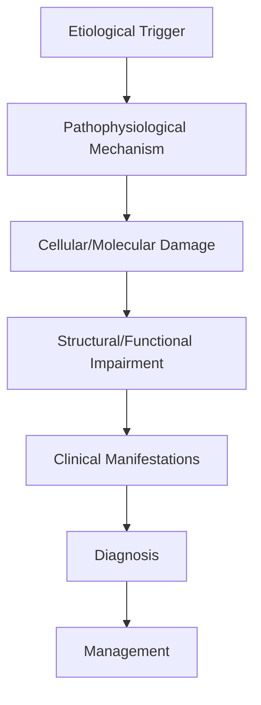
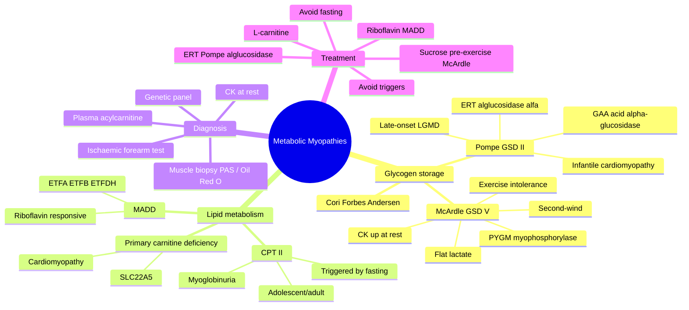

# Metabolic Myopathies

> [!tip] **High-Yield Definition**
> Comprehensive clinical note for Metabolic Myopathies covering definition, epidemiology, aetiology, pathophysiology, clinical features, investigations, differential diagnosis, management, drug interactions, procedures, complications, red flags, prognosis, topic correlation, and special situations for FCPS/MRCP examination preparation based on Davidson 24th Edition Chapter 25: Neurology.

---

## 1. Definition / Epidemiology / Classification

### Definition
Metabolic Myopathies is a neurological disorder within the 10 muscle disorders category. It is characterised by specific clinical, pathological, radiological, and laboratory features that allow differentiation from related conditions.

### Epidemiology
- **Incidence/Prevalence:** Variable depending on the specific condition.
- **Age:** Adult onset is most common, but paediatric and elderly presentations occur.
- **Sex:** Variable depending on the condition.
- **Geography:** Worldwide distribution, with higher prevalence in certain regions.
- **Risk Factors:** Genetic predisposition, environmental factors, comorbidities, family history.

### Classification
| Subtype | Key Features | Prognosis |
|---------|-------------|-----------|
| Mild/early | Subtle symptoms, preserved function | Best |
| Moderate | Clear symptoms, functional impairment | Variable |
| Severe | Significant disability, complications | Worst |

---

## 2. Aetiology / Pathophysiology

### Aetiology
- **Primary (idiopathic):** Most cases have no identifiable cause.
- **Genetic:** May be inherited (AD, AR, X-linked, mitochondrial, sporadic).
- **Autoimmune:** Autoantibodies, immune-mediated inflammation.
- **Infectious:** Viral, bacterial, fungal, parasitic.
- **Metabolic:** Electrolyte, endocrine, hepatic, renal, nutritional.
- **Toxic:** Drugs, alcohol, heavy metals, environmental toxins.
- **Vascular:** Ischaemia, haemorrhage, vasculitis.
- **Neoplastic:** Primary, secondary, paraneoplastic.
- **Traumatic:** Acute, chronic, repetitive.
- **Degenerative:** Neurodegeneration, protein misfolding.

### Pathophysiology


---

## 3. Clinical Features

### History
- **Onset/Duration:** Acute, subacute, or chronic.
- **Progression:** Static, progressive, relapsing-remitting, stepwise.
- **Key symptoms:** Specific to the condition.
- **Triggers:** Stress, infection, trauma, drugs, hormonal, environmental.
- **Systemic symptoms:** Constitutional features.
- **Drug/Family/Social history:** Relevant exposures, comorbidities.

### Examination
| Domain | Key Findings | Localisation Value |
|--------|-------------|-------------------|
| Higher function | Cognitive, behavioural | Cortical, subcortical, limbic |
| Cranial nerves | Pupils, eye movements, facial, bulbar | Brainstem, cranial nerve, NMJ |
| Motor | Weakness, tone, reflexes | UMN, LMN, NMJ, muscle |
| Sensory | All modalities, pattern | Peripheral, spinal, brainstem |
| Coordination | Ataxia, nystagmus, dysmetria | Cerebellar, sensory, vestibular |
| Gait | Spastic, ataxic, parkinsonian | Multiple |
| Autonomic | Orthostatic, sweating, GI, bladder | Autonomic, peripheral, central |

### Specific Clinical Features
The clinical features are determined by the underlying aetiology, location of pathology, and rate of progression. Patients typically present with a constellation of symptoms and signs that allow clinical localisation and subsequent targeted investigation.

---

## 4. Diagnostic Approach / Algorithm

```mermaid
flowchart TD
    A[Clinical Presentation] --> B[Anatomical Localisation]
    B --> C[Pathophysiological Category]
    C --> D[Formulate Differential]
    D --> E[Targeted Investigations]
    E --> F[Confirm Diagnosis]
    F --> G[Assess Severity/Prognosis]
    G --> H[Initiate Management]
    H --> I[Monitor Response]
    I --> J{Response?}
    J --> YES1 [Good - Continue]
    J --> NO1 [Poor - Escalate]
    YES1 --> K[Monitor]
    NO1 --> H
```

---

## 5. Investigations

### First-Line Investigations
- **Blood tests:** FBC, U&Es, LFTs, glucose, calcium, magnesium, ESR, CRP, autoimmune, infection.
- **Imaging:** CT/MRI brain/spine (essential for most neurological conditions).
- **Neurophysiology:** EEG, nerve conduction, EMG, evoked potentials.
- **CSF:** Cell count, protein, glucose, OCBs, PCR, culture.

### Second-Line Investigations
- **Genetic testing:** Gene panels, WES, WGS.
- **Antibody testing:** Antineuronal, autoimmune, paraneoplastic.
- **Biopsy:** Nerve, muscle, brain, skin.
- **Advanced imaging:** PET-CT, MR spectroscopy, fMRI.

### Specialised Investigations
- **Biomarkers:** Neurofilament light chain, tau, beta-amyloid, 14-3-3, RT-QuIC.
- **Autonomic testing:** Head-up tilt, sudomotor, QSART.
- **Neuropsychology:** Cognitive testing, behavioural assessment.
- **Genetic counselling:** Family screening, predictive testing.

---

## 6. Differential Diagnosis

| Differential | Distinguishing Features | Key Test |
|--------------|------------------------|----------|
| Vascular | Sudden onset, focal, vascular risk factors | MRI/CT, vessel imaging |
| Inflammatory | Subacute, multifocal, systemic | MRI, CSF, antibodies |
| Infectious | Fever, systemic, exposure | Bloods, CSF, imaging |
| Neoplastic | Progressive, mass effect | MRI, biopsy |
| Degenerative | Progressive, symmetric, hereditary | MRI, genetic |
| Toxic/Metabolic | Drug history, systemic, reversible | Bloods, toxicology |
| Autoimmune | Multifocal, antibodies, immunotherapy response | Antibodies, MRI, CSF |
| Functional | Inconsistent, distractible | Clinical, video, biomarkers |

---

## 7. Management

### Acute Management
- **Stabilisation:** ABCDE approach, emergency resuscitation.
- **Specific treatment:** Disease-specific interventions.
- **Symptomatic relief:** Pain, seizures, spasticity, autonomic dysfunction.
- **Prevention of complications:** DVT, pressure sores, infection.

### Disease-Modifying Treatment
- **Pharmacological:** First-line, second-line, escalation, maintenance.
- **Procedural:** Surgery, biopsy, drainage, ablation, stimulation.
- **Immunotherapy:** Steroids, IVIG, plasma exchange, immunosuppressants, biologics.
- **Rehabilitation:** Physiotherapy, OT, speech therapy.

### Long-Term Management
- **Monitoring:** Clinical, imaging, biomarkers, side effects.
- **Prevention:** Vaccinations, prophylaxis, lifestyle modification.
- **Supportive care:** Multidisciplinary team, social work, psychological support.
- **Palliative care:** Advanced care planning, end-of-life care, hospice.

---

## 8. Drug Interactions / Contraindications / Comorbidity Cautions

| Drug Class | Interaction / Caution | Management |
|------------|----------------------|------------|
| Antiseizure medications | Enzyme induction, teratogenicity | Monitor, supplement, switch |
| Immunosuppressants | Infection, malignancy, teratogenicity | Monitor, prophylaxis |
| Anticoagulants | Bleeding risk, drug interactions | Monitor INR, avoid combinations |
| Antihypertensives | Hypotension, falls | Monitor BP, adjust dose |
| Antibiotics | Nephrotoxicity, ototoxicity | Monitor renal |
| Antivirals | Nephrotoxicity, neuropsychiatric | Monitor renal, dose adjust |
| Steroids | DM, HTN, osteoporosis, infection | Monitor, prophylaxis, taper |
| Biologics | Infusion reactions, infection | Monitor, prophylaxis |

---

## 9. Procedures

### Common Procedures
- **Lumbar puncture:** Diagnostic, therapeutic (IIH, NPH). Contraindications: raised ICP, mass lesion, coagulopathy.
- **Nerve conduction studies/EMG:** Diagnostic, prognosis. Minor discomfort.
- **EEG:** Diagnostic, monitoring. No significant complications.
- **MRI brain/spine:** Diagnostic, monitoring. Contraindications: pacemaker, metallic implants.
- **CT head:** Emergency, rapid. Radiation exposure, contrast reactions.
- **Biopsy:** Stereotactic, open. Indications: diagnosis, molecular profiling.

---

## 10. Complications

| Complication | Frequency | Prevention | Management |
|--------------|-----------|------------|------------|
| Infection | Common | Hygiene, prophylaxis, vaccination | Antibiotics, antifungals |
| Thrombosis | Common | Prophylaxis, mobility | Anticoagulation |
| Pressure sores | Common | Positioning, nutrition | Wound care, surgery |
| Spasticity | Common | Positioning, stretching | Baclofen, BoNT |
| Contractures | Common | Passive movements, splints | Physiotherapy, surgery |
| Aspiration | Common | Swallow assessment | NGT, PEG, thickeners |
| Falls | Common | Environment, mobility | Walking aids |
| Fractures | Common | Bone health, prevention | Vitamin D, bisphosphonate |
| Depression | Common | Screening, support | Antidepressants, CBT |
| Cognitive decline | Variable | Monitoring, training | Rehabilitation |
| Autonomic dysfunction | Variable | Monitoring, hydration | Midodrine, fludrocortisone |
| Respiratory failure | Variable | Monitoring, supportive | Ventilation, NIV |
| Death | Variable | Monitoring, palliative | End-of-life care |

---

## 11. Red Flags / Emergencies

### Emergency Presentations
- **Rapid neurological deterioration:** New focal deficit, decreased consciousness, seizures.
- **Status epilepticus:** Continuous seizures >5 min.
- **Raised ICP:** Headache, vomiting, papilloedema, altered consciousness.
- **Respiratory failure:** Hypoxia, hypercapnia, ventilatory failure.
- **Cardiac arrest:** Arrhythmia, MI, pulmonary embolism.
- **Infection:** Sepsis, meningitis, abscess, encephalitis.
- **Drug toxicity:** Overdose, side effects, interactions.
- **Haemorrhage:** Intracranial, systemic, coagulopathy.

---

## 12. Prognosis

### Natural History
- **Acute:** May resolve with treatment, may progress, may be fatal.
- **Subacute:** Variable, depends on cause and treatment.
- **Chronic:** Often progressive, may be stable, may have relapses.
- **Recovery:** Variable, may be complete, partial, or none.

### Prognostic Factors
- **Favourable:** Young age, early treatment, mild disease, reversible cause, good premorbid function, family support.
- **Unfavourable:** Older age, delayed treatment, severe disease, irreversible cause, poor premorbid function, comorbidities.

---

## 13. Topic Correlation

| Related Topic | Link | Key Overlap |
|---------------|------|-------------|
| Davidson 24th Ed Chapter 25 | [[Davidson Chapter 25 - Neurology Hierarchy]] | Comprehensive neurology |
| Neurology MOC | [[Neurology MOC]] | All neurology topics |
| Drug Reference | [[../00_Index/Neurology Drug Reference]] | Medications |
| Local Hub | [[../10_Muscle_Disorders/Hub]] | Section-specific |
| Clinical Examination | [[../01_Fundamentals_Examination/Neurological History Taking]] | Clinical approach |
| Investigation | [[../01_Fundamentals_Examination/Neuroimaging (CT-MRI) Principles]] | Imaging |

---

## 14. Special Situations

| Situation | Consideration |
|-----------|---------------|
| **Pregnancy** | Pre-conception counselling, teratogenicity, drug safety, monitoring, delivery planning, breastfeeding. |
| **Lactation** | Drug safety, breastfeeding, monitoring, support. |
| **Paediatric** | Developmental considerations, drug dosing, school, family, vaccination, growth, puberty. |
| **Elderly / Frail** | Comorbidities, polypharmacy, falls, bone health, cognition, social, end-of-life. |
| **Renal impairment** | Drug dose adjustment, monitoring, dialysis, transplant. |
| **Hepatic impairment** | Drug dose adjustment, monitoring, transplant. |
| **Immunocompromised** | Infection prophylaxis, vaccination, drug interactions, malignancy screening. |
| **Perioperative** | Drug management, anaesthesia planning, VTE prophylaxis, infection prevention, monitoring. |
| **Driving / DVLA** | Fitness to drive, restrictions, notification, reassessment. |
| **Occupational** | Fitness for work, adaptations, rehabilitation, disability, return to work. |

---

## FCPS/MRCP High-Yield Summary

| Category | Key Points |
|----------|------------|
| **Definition** | Comprehensive definition with key diagnostic criteria |
| **Epidemiology** | Incidence, prevalence, age, sex, geography, risk factors |
| **Aetiology** | Primary causes, secondary causes, genetic, environmental |
| **Pathophysiology** | Mechanism of disease, cellular/molecular basis |
| **Clinical Features** | History, examination, key findings, variants |
| **Diagnosis** | Diagnostic criteria, classification, severity |
| **Investigations** | First-line, second-line, specialised, biomarkers |
| **Differential Diagnosis** | Key differentials, distinguishing features, tests |
| **Management** | Acute, disease-modifying, symptomatic, supportive |
| **Complications** | Common, serious, prevention, management |
| **Prognosis** | Natural history, prognostic factors, outcomes |
| **Viva Pearls** | Key examination points |
| **Drug Doses** | First-line, second-line, emergency |
| **Scoring Systems** | Specific scores used in management |
| **Genetics** | Inheritance, genes, mutations, family screening |
| **Imaging Signs** | Characteristic findings, differential |

---

## Viva Questions (PACES/FCPS Style)

1. **Q:** Define and classify its variants.
   **A:** Comprehensive definition with classification of subtypes based on aetiology, severity, and clinical features.

2. **Q:** What are the key clinical features?
   **A:** Specific symptoms and signs including onset, progression, key features, and associated findings.

3. **Q:** What is the first-line treatment?
   **A:** First-line pharmacological and non-pharmacological management based on current evidence.

4. **Q:** What are the red flags requiring urgent referral?
   **A:** Specific emergency presentations and complications requiring immediate intervention.

5. **Q:** What is the prognosis?
   **A:** Natural history, prognostic factors, and long-term outcomes.

6. **Q:** How do you differentiate from key differentials?
   **A:** Clinical features, investigations, and response to treatment that distinguish from alternative diagnoses.

7. **Q:** What investigations are most useful?
   **A:** First-line and second-line investigations including imaging, neurophysiology, CSF, and biomarkers.

8. **Q:** Describe the stepwise management approach.
   **A:** Stepwise escalation from first-line to second-line to third-line therapy with monitoring.

9. **Q:** What are the emergency presentations?
   **A:** Specific emergency scenarios and immediate management priorities.

10. **Q:** How does management change in pregnancy/paediatrics/elderly?
    **A:** Special considerations for each population including drug safety, monitoring, and support.

---

## Common Confusions / Exam Traps

| Confusion | Clarification |
|-----------|---------------|
| Similar presentation but different cause | Differentiate by history, examination, investigations |
| Treatment response vs natural history | Assess with objective measures, biomarkers |
| Drug interactions | Check each drug, monitor, adjust doses |
| Disease progression vs treatment failure | Monitor response, escalate appropriately |
| Functional vs organic | Inconsistent, distractible, disability greater than impairment |
| Acute vs chronic | Time course, progression, reversibility |
| Primary vs secondary | Underlying cause, contributing factors |
| Side effects vs symptoms | Temporal relationship, dose relationship |

---

## Mnemonics

1. **"POMPE-GAA"** = **P**ompe **O**nset (infantile cardiac / juvenile-adult limb-girdle) **M**yopathy **P**rogressive **E**nzyme replacement (**G**AA = acid α-glucosidase). **Use:** Recall GSD II pathology and ERT (alglucosidase alfa; avalglucosidase / cipaglucosidase newer).

2. **"McARDLE-5"** = **M**yophosphorylase deficiency → **G**lycogen **S**torage **D**isease **V**; CK ↑ at rest, "**5**" cardinal features: exercise intolerance, painful contracture, myoglobinuria, second-wind phenomenon, flat lactate on ischaemic forearm test. **Use:** Recognise McArdle disease.

3. **"CPT-II / CARNITINE"** = **CPT-II** deficiency (recurrent myoglobinuria after fasting/long exercise in adults) vs **C**arnitine transporter defect (**SLC22A5**, low free carnitine, cardiomyopathy responds to L-carnitine) vs MADD (multiple acyl-CoA dehydrogenase deficiency, **riboflavin-responsive**). **Use:** Lipid-storage myopathies.

---

## Mind Map



---

## Spaced Repetition Trackers

| Topic | Day 1 | Day 3 | Day 7 | Day 14 | Day 30 | Day 90 |
|-------|-------|-------|-------|--------|--------|--------|
| McArdle features (exercise intolerance, second wind, CK at rest, flat lactate) | ☐ | ☐ | ☐ | ☐ | ☐ | ☐ |
| Pompe disease (GAA, infantile vs late-onset) | ☐ | ☐ | ☐ | ☐ | ☐ | ☐ |
| Ischaemic forearm test interpretation | ☐ | ☐ | ☐ | ☐ | ☐ | ☐ |
| Lipid storage myopathies (CPT II, MADD, carnitine) | ☐ | ☐ | ☐ | ☐ | ☐ | ☐ |
| Enzyme replacement therapy (alglucosidase alfa) | ☐ | ☐ | ☐ | ☐ | ☐ | ☐ |
| Glycogen vs lipid biopsy findings (PAS / Oil Red O) | ☐ | ☐ | ☐ | ☐ | ☐ | ☐ |
| Trigger avoidance and dietary advice | ☐ | ☐ | ☐ | ☐ | ☐ | ☐ |

---

## Self-Test Scorecard

| # | Topic | 1 | 2 | 3 | 4 | 5 | Score /5 |
|---|-------|---|---|---|---|---|----------|
| 1 | McArdle disease (GSD V) features | ☐ | ☐ | ☐ | ☐ | ☐ | /5 |
| 2 | Pompe disease phenotypes and ERT | ☐ | ☐ | ☐ | ☐ | ☐ | /5 |
| 3 | Ischaemic forearm test interpretation | ☐ | ☐ | ☐ | ☐ | ☐ | /5 |
| 4 | Lipid storage myopathies (CPT II, MADD) | ☐ | ☐ | ☐ | ☐ | ☐ | /5 |
| 5 | Carnitine deficiency and acylcarnitine profile | ☐ | ☐ | ☐ | ☐ | ☐ | /5 |
| 6 | Muscle biopsy (PAS vs Oil Red O) | ☐ | ☐ | ☐ | ☐ | ☐ | /5 |
| 7 | CK pattern at rest vs post-exercise | ☐ | ☐ | ☐ | ☐ | ☐ | /5 |
| 8 | Trigger avoidance / dietary management | ☐ | ☐ | ☐ | ☐ | ☐ | /5 |
| 9 | Anaesthesia and statin risks | ☐ | ☐ | ☐ | ☐ | ☐ | /5 |
| 10 | Differential from inflammatory myopathy | ☐ | ☐ | ☐ | ☐ | ☐ | /5 |

---

## MCQs (10)

1. **Question:** A 25-year-old man develops severe muscle cramps and dark urine after 10 minutes of vigorous exercise; symptoms improve after a few minutes of rest and he can then resume activity ("second-wind"). Resting CK is 1,200 U/L. Which enzyme is deficient?
   **Options:** A. Acid α-glucosidase (GAA) B. Myophosphorylase C. Carnitine palmitoyltransferase II D. Phosphofructokinase
   **Answer:** B
   **Explanation:** Classic McArdle disease (GSD V) — myophosphorylase deficiency, "second-wind" phenomenon (fatty-acid oxidation kicks in), CK elevated at rest, painful contractures, exercise-induced myoglobinuria.

2. **Question:** A 3-month-old infant has hypotonia, macroglossia, hepatomegaly, and hypertrophic cardiomyopathy with short PR interval. Muscle biopsy shows PAS-positive vacuoles with deficient acid maltase activity. What is the diagnosis?
   **Options:** A. McArdle disease B. Infantile Pompe disease C. Cori disease D. CPT II deficiency
   **Answer:** B
   **Explanation:** Infantile Pompe (GSD II) — acid α-glucosidase (GAA) deficiency; cardiomyopathy, hypotonia, macroglossia; early ERT with alglucosidase alfa is critical.

3. **Question:** Which is the disease-specific enzyme replacement therapy for late-onset Pompe disease?
   **Options:** A. Agalsidase alfa B. Alglucosidase alfa C. Imiglucerase D. Laronidase
   **Answer:** B
   **Explanation:** Alglucosidase alfa (recombinant human GAA) is standard; avalglucosidase alfa and cipaglucosidase alfa are newer alternatives. Agalsidase = Fabry; imiglucerase = Gaucher; laronidase = Hurler (MPS I).

4. **Question:** The "second-wind phenomenon" is most characteristic of which metabolic myopathy?
   **Options:** A. Pompe disease B. McArdle disease C. CPT II deficiency D. MELAS
   **Answer:** B
   **Explanation:** After initial fatigue from blocked muscle glycogenolysis, fatty-acid oxidation provides alternative fuel and exercise tolerance improves.

5. **Question:** A fasting adult develops severe myalgia, dark urine, and CK 40,000 U/L after prolonged exercise in cold weather; recurrent similar episodes since adolescence. Between attacks CK is normal. Most likely diagnosis?
   **Options:** A. McArdle disease B. CPT II deficiency C. Polymyositis D. Duchenne muscular dystrophy
   **Answer:** B
   **Explanation:** CPT II deficiency presents in adolescents/adults with myoglobinuria triggered by prolonged exercise, fasting, cold, or fever; inter-attack CK often normal (in contrast to McArdle).

6. **Question:** On ischaemic forearm test, a flat lactate curve with a normal rise in ammonia is most consistent with:
   **Options:** A. McArdle disease B. CPT II deficiency C. Healthy control D. Mitochondrial myopathy
   **Answer:** A
   **Explanation:** Flat lactate with preserved ammonia rise = glycogenolysis defect (myophosphorylase, McArdle). In CPT II the lactate rises normally. Flat lactate AND flat ammonia = poor effort.

7. **Question:** The genetic defect in McArdle disease (GSD V) is in:
   **Options:** A. PYGM (muscle glycogen phosphorylase) B. GAA C. CPT2 D. AMPD1
   **Answer:** A
   **Explanation:** PYGM encodes muscle glycogen phosphorylase (myophosphorylase); autosomal recessive. AMPD1 deficiency causes myoadenylate deaminase deficiency (exercise intolerance but milder).

8. **Question:** Which lipid-storage myopathy typically responds to riboflavin (vitamin B2) supplementation?
   **Options:** A. Multiple acyl-CoA dehydrogenase deficiency (MADD / glutaric aciduria II) B. CPT II deficiency C. Primary carnitine deficiency D. McArdle disease
   **Answer:** A
   **Explanation:** MADD (ETFA, ETFB, ETFDH mutations) is a late-onset lipid storage myopathy frequently responsive to riboflavin and L-carnitine — important because it is treatable.

9. **Question:** Which organ involvement most clearly distinguishes infantile from late-onset Pompe disease?
   **Options:** A. Brain B. Heart (hypertrophic cardiomyopathy) C. Liver D. Kidney
   **Answer:** B
   **Explanation:** Infantile Pompe has severe hypertrophic cardiomyopathy and early death without ERT; late-onset (juvenile/adult) lacks significant cardiac involvement but has progressive limb-girdle and respiratory muscle weakness.

10. **Question:** Which intervention helps patients with McArdle disease tolerate exercise?
    **Options:** A. High-protein ketogenic diet B. Oral sucrose or glucose before exercise C. Strict fat restriction D. Vitamin D supplementation only
    **Answer:** B
    **Explanation:** Pre-exercise ingestion of sucrose (e.g., 75 g) or other simple carbohydrates provides exogenous glucose that bypasses the metabolic block, improving exercise tolerance and reducing rhabdomyolysis risk.

---

## SBA Questions (10)

1. **Scenario:** A 28-year-old man with recurrent painful muscle stiffness and dark urine after strenuous activity. Examination is normal between episodes. Resting CK is mildly elevated.
   **Question:** Most appropriate single next investigation?
   **Options:** A. Genetic testing for PYGM B. Anti-Jo-1 antibody C. EMG only D. Muscle MRI
   **Answer:** A
   **Explanation:** Clinical picture is McArdle disease; targeted PYGM genetic testing is now the diagnostic standard and has largely replaced muscle biopsy in typical cases.

2. **Scenario:** A 4-month-old with hypotonia, macroglossia, cardiomegaly, and short PR interval; biopsy shows vacuolar myopathy with PAS-positive material and acid-maltase deficiency.
   **Question:** What is the disease-specific treatment?
   **Options:** A. Alglucosidase alfa (recombinant GAA) B. High-protein diet C. Steroids D. Riboflavin
   **Answer:** A
   **Explanation:** Alglucosidase alfa enzyme replacement therapy is standard of care for Pompe disease (both infantile and late-onset).

3. **Scenario:** A 22-year-old with CPT II deficiency develops severe myalgia and dark urine during a 4-hour mountain hike after skipping lunch.
   **Question:** Most important preventive measure?
   **Options:** A. Avoid fasting and prolonged exercise; carbohydrate intake before/during exertion B. High-protein diet only C. Statins D. Bed rest for 1 week
   **Answer:** A
   **Explanation:** Avoiding fasting and prolonged exertion with carbohydrate supplementation before/during exercise prevents most CPT II attacks.

4. **Scenario:** A 30-year-old with progressive proximal weakness, lipid-laden vacuoles on biopsy, and abnormal plasma acylcarnitine profile.
   **Question:** Which supplement is most likely to improve symptoms?
   **Options:** A. Riboflavin (vitamin B2) B. Vitamin D C. Iron D. Copper
   **Answer:** A
   **Explanation:** Multiple acyl-CoA dehydrogenase deficiency (MADD) is a riboflavin-responsive lipid storage myopathy. Trial of riboflavin (and L-carnitine) is standard once diagnosed.

5. **Scenario:** A patient with known McArdle disease plans to start a graded gym programme.
   **Question:** Most appropriate advice?
   **Options:** A. Avoid all exercise; rest completely B. Light aerobic exercise with pre-exercise sucrose; gradual warm-up to access second wind C. Only weight training D. Fast before exercise
   **Answer:** B
   **Explanation:** Supervised aerobic conditioning with pre-exercise sucrose (~75 g) and gradual warm-up improves exercise capacity, may reduce injury, and accesses the second-wind phenomenon.

6. **Scenario:** A patient with a suspected glycogen storage disorder undergoes ischaemic forearm exercise testing.
   **Question:** Which lactate/ammonia pattern is diagnostic?
   **Options:** A. Flat lactate, normal ammonia rise B. Normal lactate, normal ammonia C. High lactate, high ammonia D. Flat lactate, flat ammonia
   **Answer:** A
   **Explanation:** Flat lactate with preserved ammonia rise = glycogenolysis block (myophosphorylase, McArdle). Flat lactate and flat ammonia together = inadequate effort.

7. **Scenario:** Newborn screening reveals low free carnitine with low acylcarnitine in an asymptomatic infant.
   **Question:** Most likely diagnosis?
   **Options:** A. Primary carnitine transporter deficiency (SLC22A5) B. McArdle disease C. MELAS D. Duchenne muscular dystrophy
   **Answer:** A
   **Explanation:** Primary carnitine deficiency (SLC22A5) presents with very low free carnitine; high-dose L-carnitine prevents cardiomyopathy, weakness, and hypoglycaemia.

8. **Scenario:** A 19-year-old with first-time 10-km run while on simvastatin develops myoglobinuria and CK 80,000 U/L.
   **Question:** Most appropriate immediate management?
   **Options:** A. Stop statin; aggressive IV fluids and urine alkalinisation B. Continue statin, oral fluids only C. Start high-dose steroids D. Plasmapheresis
   **Answer:** A
   **Explanation:** Statin-induced rhabdomyolysis — stop the drug, give aggressive IV crystalloid (target urine 200–300 mL/h), monitor renal function and electrolytes for myoglobinuric AKI.

9. **Scenario:** An infant with infantile Pompe is starting alglucosidase alfa infusions.
   **Question:** Which adverse effect requires most vigilance during early infusions?
   **Options:** A. Infusion reactions (fever, urticaria, anaphylaxis) and IgG antibody formation B. Hyperglycaemia C. Nephrogenic DI D. Aplastic anaemia
   **Answer:** A
   **Explanation:** Infusion-related reactions are common with ERT (especially infantile Pompe); premedication, slow infusion rates, and antibody monitoring are routine.

10. **Scenario:** A 45-year-old with known McArdle disease asks about long-term complications.
    **Question:** Most accurate statement?
    **Options:** A. Most patients develop fixed proximal weakness with age; renal monitoring is essential B. Always benign with full recovery C. Never develop renal failure D. Always fatal in childhood
    **Answer:** A
    **Explanation:** Fixed proximal weakness develops in many adult McArdle patients; recurrent myoglobinuria can cause chronic kidney disease, hence renal monitoring is essential.

---

## Tags

#neurology #muscle #metabolic #glycogen #lipid #Pompe #McArdle #CPT2 #MADD #FCPS #MRCP

---

## Local Navigation
**Heading Hub:** [[../Hub]]  
**Chapter Hierarchy:** [[Davidson Chapter 25 - Neurology Hierarchy]]  
**Chapter MOC:** [[Neurology MOC]]  
**Drug Reference:** [[../00_Index/Neurology Drug Reference]]  
