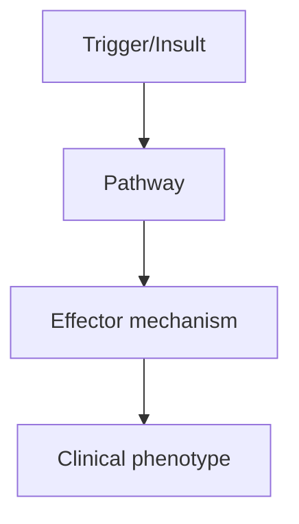
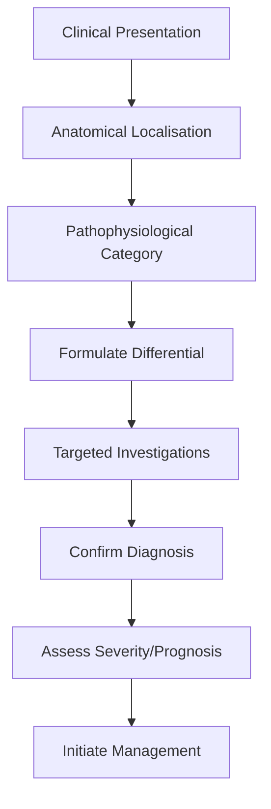
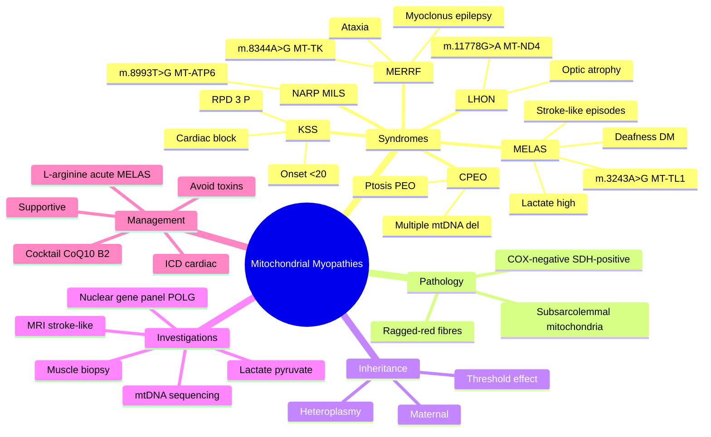

# Mitochondrial Myopathies

> [!tip] **High-Yield Definition**
> Mitochondrial myopathies: inherited disorders of mitochondrial DNA (mtDNA) or nuclear DNA (nDNA) affecting oxidative phosphorylation. Multisystem: muscle, CNS, eye, ear, endocrine, cardiac, GI, renal. MELAS, MERRF, KSS, CPEO, NARP, MILS, mitochondrial myopathy with multiple deletions, mitochondrial DNA depletion syndromes (TK2, DGUOK, POLG, TYMP).

---

## 1. Definition / Epidemiology / Classification

### Definition
Mitochondrial myopathies: inherited disorders of mitochondrial DNA (mtDNA) or nuclear DNA (nDNA) affecting oxidative phosphorylation. Multisystem: muscle, CNS, eye, ear, endocrine, cardiac, GI, renal. MELAS, MERRF, KSS, CPEO, NARP, MILS, mitochondrial myopathy with multiple deletions, mitochondrial DNA depletion syndromes (TK2, DGUOK, POLG, TYMP).

### Epidemiology
Prevalence: 1/5,000-1/10,000. mtDNA: 1/200 carrier frequency for common mutations (m.3243A>G MELAS, m.8344A>G MERRF, m.11778 LHON). Onset: any age. Maternal inheritance (mtDNA), autosomal (nDNA).

### Classification
| Variant | Key Features | Prognosis |
|---------|-------------|-----------|
| | | |

---

## 2. Aetiology / Pathophysiology

### Aetiology
mtDNA mutations (maternal): MELAS (m.3243A>G, tRNA-Leu, stroke-like episodes, lactic acidosis, deafness, DM), MERRF (m.8344A>G, tRNA-Lys, myoclonic epilepsy, ragged red fibres), KSS (large-scale deletions, ophthalmoplegia, retinopathy, heart block), CPEO (single large deletion, ptosis, ophthalmoplegia), LHON (m.11778, m.3460, m.14484, ND genes, optic neuropathy, young males), NARP (m.8993, ATP6, neuropathy, ataxia, retinitis pigmentosa), MILS (m.8993, maternally inherited Leigh), mtDNA depletion syndromes (TK2, DGUOK, POLG, TYMP). nDNA (autosomal): POLG (mtDNA depletion, multiple deletions, PEO, SANDO, MIRAS), TWNK (PEO, IOSCA), TYMP (MNGIE), POLG2, TACO1, others. Pathophysiology: oxidative phosphorylation defect, ATP depletion, ROS, apoptosis, heteroplasmy (variable load), threshold effect.

### Pathophysiology

---

## 3. Clinical Features

### History
- **Onset/Duration:**
- **Progression:**
- **Key symptoms:**
- **Triggers:**
- **Systemic symptoms:**
- **Drug/Family/Social history:**

### Examination
| Domain | Key Findings | Localisation Value |
|--------|-------------|-------------------|
| | | |

### Specific Clinical Features
Multisystem. Muscle: progressive external ophthalmoplegia (PEO, ptosis, ophthalmoplegia), proximal myopathy, exercise intolerance, myalgia, rhabdomyolysis, ragged red fibres, COX-negative fibres. CNS: stroke-like episodes (MELAS), seizures (MERRF, MELAS), ataxia, dementia, encephalopathy, Leigh syndrome (basal ganglia, brainstem lesions), migraine. Eye: PEO, optic neuropathy (LHON), pigmentary retinopathy, cataracts. Ear: sensorineural hearing loss. Endocrine: diabetes (MELAS, 30%), hypoparathyroidism, hypothyroidism, growth hormone deficiency. Cardiac: cardiomyopathy (hypertrophic, dilated, conduction block - WPW, heart block - KSS, sudden death). GI: dysmotility, dysphagia, pseudo-obstruction (MNGIE), liver (hepatomegaly, hepatic failure - DGUOK, POLG). Renal: tubulopathy, FSGS. Haematological: sideroblastic anaemia (Pearson). Skin: lipomas. Maternal inheritance pattern (mitochondrial). Heteroplasmy: variable load, different tissues.

---

## 4. Diagnostic Approach / Algorithm

---

## 5. Investigations

Bloods: lactate (elevated, especially post-exercise), pyruvate, CK (mild-moderate), U&Es, LFTs, glucose, HbA1c, thyroid, FBC, carnitine, acylcarnitine. Urine: organic acids, myoglobin (rhabdo). EMG: myopathic. ECG, echo (cardiomyopathy, conduction). MRI brain: stroke-like (MELAS, posterior), basal ganglia (Leigh, mitochondrial), white matter. MRS: lactate peak. Audiometry, ophthalmology (fundus, OCT, visual fields). Genetic testing: mtDNA common mutations (m.3243A>G, m.8344A>G, m.11778, large deletions), then mtDNA sequencing, nDNA panel (POLG, TWNK, TYMP, others). Muscle biopsy: ragged red fibres (Gomori trichrome), COX-negative, succinate dehydrogenase (SDH) hyperintense, electron microscopy (paracrystalline mitochondrial inclusions). Exercise testing: aerobic capacity, oxygen extraction. Mitochondrial disease criteria (Walker, Morava).

---

## 6. Differential Diagnosis

| Differential | Distinguishing Features | Key Test |
|--------------|------------------------|----------|
| | | |

---

## 7. Management

Supportive: exercise (aerobic, resistance - improves function, but careful with PEO, rhabdo risk), nutrition (avoid fasting, frequent meals, complex carbs, avoid alcohol), hydration, vitamin supplementation (CoQ10 100-300mg/day, riboflavin 50-100mg/day, L-carnitine 1000-2000mg/day, alpha-lipoic acid, vitamin C, E, K, B complex - evidence limited), avoid metformin (lactic acidosis), avoid valproate, aminoglycosides, linezolid (mitochondrial toxicity), avoid high-intensity exercise (rhabdo). Multidisciplinary: neurologist, geneticist, metabolic physician, cardiologist (WPW, heart block, ICD), ophthalmologist, audiologist, endocrinologist (DM, thyroid), renal physician, dietician, physiotherapist, OT, social, palliative, genetic counselling (maternal inheritance, 25% recurrence for mtDNA, AR for nDNA). Specific: dichloroacetate (Lactate, limited, peripheral neuropathy), EPI-743 (antioxidant, trial), idebenone (LHON, Friedreich's, mitochondrial, may improve visual). Avoid: alcohol, smoking, fasting, prolonged sun, extremes of temperature, uncooked foods (lactose-free diet for lactose intolerance, MNGIE - low protein, low fat).

---

## 8. Drug Interactions / Contraindications / Comorbidity Cautions

| Drug | Interaction / Caution | Management |
|------|----------------------|------------|
| | | |

---

## 9. Procedures (if applicable)

### Procedure:
- **Indications:**
- **Contraindications:**
- **Preparation / Principle:**
- **Complications:**
- **Viva Pearls:**

---

## 10. Complications

| Complication | Frequency | Prevention / Monitoring | Management |
|--------------|-----------|------------------------|------------|
| | | | |

---

## 11. Red Flags / Emergencies

Stroke-like episodes (MELAS), seizures, status epilepticus, respiratory failure, cardiac (heart block, arrhythmia, sudden death - KSS, WPW), metabolic (lactic acidosis, hypoglycaemia), renal failure, hepatic failure, rhabdomyolysis, anaesthesia (sensitive to volatile, propofol - avoid), pregnancy (metabolic decompensation), infection (precipitates crisis).

---

## 12. Prognosis

Variable. Heteroplasmy and tissue distribution determine severity. Most: progressive, multisystem. Severe childhood: death in infancy/childhood (Leigh, MILS). MELAS: stroke-like episodes, progressive, variable. KSS: progressive, cardiac complications, premature death. CPEO: stable, slowly progressive. LHON: variable, spontaneous recovery in some, idebenone may help. Treatable: cofactor supplementation, exercise, avoid triggers. Experimental: gene therapy, mitochondrial transfer, nucleoside bypass. Multidisciplinary care essential. Genetic counselling, prenatal testing (controversial for mtDNA, heteroplasmy variable).

---

## 13. Topic Correlation

| Related Topic | Link | Key Overlap |
|---------------|------|-------------|
| | | |

---

## 14. Special Situations

| Situation | Consideration |
|-----------|---------------|
| **Pregnancy** | |
| **Lactation** | |
| **Paediatric** | |
| **Elderly / Frail** | |
| **Renal impairment** | |
| **Hepatic impairment** | |
| **Immunocompromised** | |
| **Perioperative** | |
| **Driving / DVLA** | |
| **Occupational** | |

---

## FCPS/MRCP High-Yield Summary

| Category | Key Points |
|----------|------------|
| **Definition** | Mitochondrial myopathies: inherited disorders of mitochondrial DNA (mtDNA) or nuclear DNA (nDNA) affecting oxidative phosphorylation. Multisystem: muscle, CNS, eye, ear, endocrine, cardiac, GI, renal. |
| **Epidemiology** | Prevalence: 1/5,000-1/10,000. mtDNA: 1/200 carrier frequency for common mutations (m.3243A>G MELAS, m.8344A>G MERRF, m.11778 LHON). Onset: any age. Ma |
| **Pathophysiology** | |
| **Clinical** | Multisystem. Muscle: progressive external ophthalmoplegia (PEO, ptosis, ophthalmoplegia), proximal myopathy, exercise intolerance, myalgia, rhabdomyolysis, ragged red fibres, COX-negative fibres. CNS: |
| **Diagnosis** | |
| **Investigations** | Bloods: lactate (elevated, especially post-exercise), pyruvate, CK (mild-moderate), U&Es, LFTs, glucose, HbA1c, thyroid, FBC, carnitine, acylcarnitine. Urine: organic acids, myoglobin (rhabdo). EMG: m |
| **Management** | Supportive: exercise (aerobic, resistance - improves function, but careful with PEO, rhabdo risk), nutrition (avoid fasting, frequent meals, complex carbs, avoid alcohol), hydration, vitamin supplemen |
| **Complications** | |
| **Prognosis** | Variable. Heteroplasmy and tissue distribution determine severity. Most: progressive, multisystem. Severe childhood: death in infancy/childhood (Leigh, MILS). MELAS: stroke-like episodes, progressive, |
| **Viva Pearls** | |
| **Drug Doses** | |
| **Scoring Systems** | |
| **Genetics** | |
| **Imaging Signs** | |

---

## Viva Questions (PACES/FCPS Style)

1. **Q:** Define Mitochondrial Myopathies and classify its variants.
   **A:** Based on the definition above.

2. **Q:** What are the key clinical features?
   **A:** Multisystem. Muscle: progressive external ophthalmoplegia (PEO, ptosis, ophthalmoplegia), proximal myopathy, exercise intolerance, myalgia, rhabdomyolysis, ragged red fibres, COX-negative fibres. CNS: stroke-like episodes (MELAS), seizures (MERRF, MELAS), ataxia, dementia, encephalopathy, Leigh synd

3. **Q:** What is the first-line treatment?
   **A:** Based on the management section.

4. **Q:** What are the red flags requiring urgent referral?
   **A:** Stroke-like episodes (MELAS), seizures, status epilepticus, respiratory failure, cardiac (heart block, arrhythmia, sudden death - KSS, WPW), metabolic (lactic acidosis, hypoglycaemia), renal failure, hepatic failure, rhabdomyolysis, anaesthesia (sensitive to volatile, propofol - avoid), pregnancy (m

5. **Q:** What is the prognosis?
   **A:** Variable. Heteroplasmy and tissue distribution determine severity. Most: progressive, multisystem. Severe childhood: death in infancy/childhood (Leigh, MILS). MELAS: stroke-like episodes, progressive, variable. KSS: progressive, cardiac complications, premature death. CPEO: stable, slowly progressiv

6. **Q:** How do you differentiate Mitochondrial Myopathies from key differentials?
   **A:** Clinical features, investigations, and response to treatment.

7. **Q:** What investigations are most useful?
   **A:** Based on the investigations section.

8. **Q:** Describe the stepwise management approach.
   **A:** Based on the management algorithm.

9. **Q:** What are the emergency presentations?
   **A:** Based on the red flags section.

10. **Q:** How does management change in pregnancy/paediatrics/elderly?
    **A:** Special considerations per population.

---

## Common Confusions / Exam Traps

| Confusion | Clarification |
|-----------|---------------|
| | |

---

## Mnemonics

1. **"MELAS"** = **M**itochondrial **E**ncephalopathy, **L**actic **A**cidosis, **S**troke-like episodes; m.3243A>G in MT-TL1 (tRNA-Leu); maternal inheritance; also causes MIDD (maternally inherited diabetes and deafness).
2. **"MERRF"** = **M**yoclonic **E**pilepsy with **R**agged-**R**ed **F**ibres; m.8344A>G in MT-TK (tRNA-Lys); maternal; myoclonus, ataxia, sensorineural deafness.
3. **"CPEO / KSS / LHON / NARP"** = **C**hronic **P**rogressive **E**xternal **O**phthalmoplegia (multiple mtDNA deletions or single large-scale deletion); **K**earns-**S**ayre (onset <20, PEO + pigmentary retinopathy + cardiac block / cerebellar ataxia / ↑CSF protein); **L**eber **H**ereditary **O**ptic **N**europathy (m.11778G>A MT-ND4); **N**ARP (m.8993T>G MT-ATP6) = **N**europathy, **A**taxia, **R**etinitis **P**igmentosa.

---

## Mind Map

---

## Spaced Repetition Trackers

| Topic | Day 1 | Day 3 | Day 7 | Day 14 | Day 30 | Day 90 |
|-------|-------|-------|-------|--------|--------|--------|
| MELAS: m.3243A>G and stroke-like episodes | ☐ | ☐ | ☐ | ☐ | ☐ | ☐ |
| MERRF: m.8344A>G and ragged-red fibres | ☐ | ☐ | ☐ | ☐ | ☐ | ☐ |
| KSS: PEO + RPD + cardiac block | ☐ | ☐ | ☐ | ☐ | ☐ | ☐ |
| LHON: m.11778G>A painless optic neuropathy | ☐ | ☐ | ☐ | ☐ | ☐ | ☐ |
| NARP / MILS: m.8993T>G | ☐ | ☐ | ☐ | ☐ | ☐ | ☐ |
| Maternal inheritance and heteroplasmy | ☐ | ☐ | ☐ | ☐ | ☐ | ☐ |
| Biopsy: ragged-red, COX-negative, SDH-positive | ☐ | ☐ | ☐ | ☐ | ☐ | ☐ |
| L-arginine in acute MELAS, avoid valproate | ☐ | ☐ | ☐ | ☐ | ☐ | ☐ |

---

## Self-Test Scorecard

| # | Topic | 1 | 2 | 3 | 4 | 5 | Score /5 |
|---|-------|---|---|---|---|---|----------|
| 1 | MELAS clinical features and genetics | ☐ | ☐ | ☐ | ☐ | ☐ | /5 |
| 2 | MERRF clinical features and genetics | ☐ | ☐ | ☐ | ☐ | ☐ | /5 |
| 3 | KSS diagnostic criteria and cardiac risk | ☐ | ☐ | ☐ | ☐ | ☐ | /5 |
| 4 | LHON presentation and genetics | ☐ | ☐ | ☐ | ☐ | ☐ | /5 |
| 5 | NARP / MILS genetics | ☐ | ☐ | ☐ | ☐ | ☐ | /5 |
| 6 | Maternal inheritance and heteroplasmy | ☐ | ☐ | ☐ | ☐ | ☐ | /5 |
| 7 | Muscle biopsy interpretation (RRF, COX, SDH) | ☐ | ☐ | ☐ | ☐ | ☐ | /5 |
| 8 | Stroke-like episodes vs ischaemic stroke | ☐ | ☐ | ☐ | ☐ | ☐ | /5 |
| 9 | Drugs to avoid (valproate, linezolid, aminoglycosides) | ☐ | ☐ | ☐ | ☐ | ☐ | /5 |
| 10 | Anaesthesia and perioperative planning | ☐ | ☐ | ☐ | ☐ | ☐ | /5 |

---

## MCQs (10)

1. **Question:** A 22-year-old presents with seizures, myoclonus, cerebellar ataxia, sensorineural hearing loss, and a maternal family history of diabetes. Muscle biopsy shows ragged-red fibres. Most likely mutation?
   **Options:** A. m.3243A>G (MT-TL1) B. m.8344A>G (MT-TK) C. m.11778G>A (MT-ND4) D. Dystrophin gene deletion
   **Answer:** B
   **Explanation:** MERRF (myoclonic epilepsy with ragged-red fibres) is most often due to m.8344A>G in MT-TK. MELAS is m.3243A>G with stroke-like episodes.

2. **Question:** Which feature best distinguishes a MELAS stroke-like episode from a typical ischaemic stroke?
   **Options:** A. Stroke-like lesions cross vascular territories and may partially reverse B. Always in MCA territory C. Always haemorrhagic D. Only after trauma
   **Answer:** A
   **Explanation:** MELAS lesions typically involve parieto-occipital cortex, do not respect vascular boundaries, and may show cortical laminar necrosis with partial reversibility.

3. **Question:** The most common mtDNA mutation causing MELAS is:
   **Options:** A. m.3243A>G in MT-TL1 B. m.8344A>G in MT-TK C. m.8993T>G in MT-ATP6 D. Single large-scale deletion
   **Answer:** A
   **Explanation:** m.3243A>G accounts for ~80% of MELAS; the same mutation causes MIDD (maternally inherited diabetes and deafness).

4. **Question:** Kearns–Sayre syndrome characteristically includes all EXCEPT:
   **Options:** A. Onset before age 20 B. Pigmentary retinopathy C. Cardiac conduction block requiring pacing D. Stroke-like episodes
   **Answer:** D
   **Explanation:** KSS requires PEO + pigmentary retinopathy + onset <20 plus at least one of: cardiac block, cerebellar ataxia, raised CSF protein. Stroke-like episodes suggest MELAS.

5. **Question:** The histological hallmark of mitochondrial myopathy on modified Gomori trichrome staining is:
   **Options:** A. Ragged-red fibres B. Rimmed vacuoles C. Endomysial inflammation D. Central nuclei
   **Answer:** A
   **Explanation:** Ragged-red fibres reflect subsarcolemmal mitochondrial accumulation; COX-negative / SDH-positive fibres are also characteristic.

6. **Question:** Leber hereditary optic neuropathy (LHON) is most commonly caused by a mutation in:
   **Options:** A. MT-ND4 (m.11778G>A) B. MT-TL1 (m.3243A>G) C. DMD gene D. POLG
   **Answer:** A
   **Explanation:** LHON — m.11778G>A in MT-ND4 (Complex I) is the most common mutation; painless sequential optic neuropathy in young adult males.

7. **Question:** Mitochondrial disorders due to mtDNA mutations follow which inheritance pattern?
   **Options:** A. Maternal (transmitted only via oocytes) B. Autosomal dominant C. X-linked recessive D. Paternal
   **Answer:** A
   **Explanation:** mtDNA is maternally inherited; an affected father cannot transmit the disease but all children of an affected mother are at risk.

8. **Question:** Heteroplasmy in mitochondrial disease refers to:
   **Options:** A. Mixture of mutant and wild-type mtDNA within cells B. A nuclear modifier gene C. Mutations in ribosomal RNA only D. Two distinct mtDNA disorders in one family
   **Answer:** A
   **Explanation:** Heteroplasmy = coexistence of mutant and wild-type mtDNA; clinical expression depends on the proportion exceeding an energy-failure threshold in each tissue.

9. **Question:** Which medication should be avoided in patients with POLG-related mitochondrial disease?
   **Options:** A. Valproic acid B. Acetazolamide C. Aspirin D. Paracetamol
   **Answer:** A
   **Explanation:** Valproic acid inhibits mitochondrial β-oxidation and polymerase γ; it can precipitate fulminant hepatic failure and accelerate neurological decline in POLG disease (Alpers syndrome).

10. **Question:** MELAS stroke-like lesions on MRI most commonly involve:
    **Options:** A. Parieto-occipital cortex not respecting vascular territories B. Basal ganglia in artery of Percheron distribution C. Bilateral thalami symmetric D. Cerebellar hemispheres only
    **Answer:** A
    **Explanation:** MELAS lesions typically affect parieto-occipital cortex, cross arterial boundaries, and may show cortical laminar necrosis with partial reversibility on follow-up imaging.

---

## SBA Questions (10)

1. **Scenario:** A 19-year-old presents with painless sequential visual loss (right then left) over 3 months. Family history includes an affected maternal uncle; fundoscopy shows optic atrophy.
   **Question:** Most likely diagnosis?
   **Options:** A. LHON B. Optic neuritis C. KSS D. DOA
   **Answer:** A
   **Explanation:** Sequential painless optic neuropathy in a young adult with maternal inheritance is classic Leber hereditary optic neuropathy; mtDNA testing confirms (most often m.11778G>A).

2. **Scenario:** A 35-year-old woman has seizures, lactate 6 mmol/L, and MRI showing T2 hyperintensity in left parieto-occipital cortex crossing vascular territories.
   **Question:** Most likely genetic defect?
   **Options:** A. m.3243A>G B. m.8344A>G C. m.11778G>A D. m.8993T>G
   **Answer:** A
   **Explanation:** MELAS — m.3243A>G; stroke-like episodes with seizures and lactic acidosis.

3. **Scenario:** A 14-year-old with ptosis, chronic progressive external ophthalmoplegia, retinitis pigmentosa, and a PR interval of 280 ms on ECG.
   **Question:** Most appropriate intervention?
   **Options:** A. Permanent pacemaker B. Ptosis surgery only C. High-dose steroids D. Metformin
   **Answer:** A
   **Explanation:** KSS with PR prolongation / high-grade AV block requires permanent pacemaker placement to prevent sudden death — pacing is the standard of care.

4. **Scenario:** A child with developmental delay, ataxia, retinitis pigmentosa, and a maternal inheritance pattern; MRI shows cerebellar atrophy; mtDNA testing reveals m.8993T>G heteroplasmy of 80%.
   **Question:** Most likely phenotype?
   **Options:** A. NARP / MILS B. MELAS C. MERRF D. KSS
   **Answer:** A
   **Explanation:** NARP (Neuropathy, Ataxia, Retinitis Pigmentosa) — m.8993T>G in MT-ATP6; high heteroplasmy (>90%) typically causes MILS (maternally inherited Leigh syndrome).

5. **Scenario:** A 27-year-old with confirmed MELAS plans pregnancy.
   **Question:** Most accurate pre-conception counselling?
   **Options:** A. All children of an affected mother are at risk of inheriting the mtDNA mutation; heteroplasmy may vary B. No risk of transmission C. All children will be unaffected D. Only sons are affected
   **Answer:** A
   **Explanation:** mtDNA is maternally inherited; all offspring of an affected mother can inherit the mutation with variable heteroplasmy. Options include prenatal testing or mitochondrial donation.

6. **Scenario:** A patient with mitochondrial myopathy asks about alcohol and supplements.
   **Question:** Most appropriate advice?
   **Options:** A. Avoid alcohol and other mitochondrial toxins; trial of "mitochondrial cocktail" (CoQ10, riboflavin) B. Limit to 2 units/day C. No specific advice D. Increase B vitamins only
   **Answer:** A
   **Explanation:** Alcohol and many drugs impair mitochondrial function; avoidance plus a trial of coenzyme Q10 and riboflavin is standard supportive care.

7. **Scenario:** A patient with known MELAS develops status epilepticus with focal motor seizures and lactate 9 mmol/L.
   **Question:** Most appropriate initial management?
   **Options:** A. Standard antiepileptics; avoid valproate; consider IV L-arginine for stroke-like episode B. IV valproate only C. Thrombolysis D. Aspirin only
   **Answer:** A
   **Explanation:** Treat seizures with non-valproate agents; IV L-arginine during acute stroke-like episodes may improve endothelial NO signalling; avoid lactate-worsening drugs.

8. **Scenario:** A newborn of an affected mother is asymptomatic. Genetic testing shows 30% m.3243A>G heteroplasmy in blood.
   **Question:** Most accurate interpretation?
   **Options:** A. Heteroplasmy in blood does not reliably predict tissue burden or phenotype B. The child will definitely develop MELAS C. The child cannot transmit mtDNA D. mtDNA cannot be quantified
   **Answer:** A
   **Explanation:** Heteroplasmy differs across tissues; blood levels are not reliable predictors of muscle/brain involvement — repeat testing and clinical surveillance are needed.

9. **Scenario:** A 45-year-old with chronic progressive external ophthalmoplegia (CPEO) is found to have multiple mtDNA deletions in muscle.
   **Question:** Most appropriate nuclear gene screen?
   **Options:** A. POLG / TWNK / SLC25A4 (ANT1) B. DMD C. SMN1 D. CFTR
   **Answer:** A
   **Explanation:** Multiple mtDNA deletions suggest a nuclear gene defect (POLG, TWNK, ANT1, OPA1); autosomal dominant or recessive inheritance is possible and family screening is offered.

10. **Scenario:** A patient with mitochondrial myopathy is scheduled for general anaesthesia.
    **Question:** Most appropriate anaesthetic plan?
    **Options:** A. Avoid prolonged fasting, maintain normothermia and euglycaemia, careful fluid balance B. High-dose propofol infusion only C. Total IV fluids only D. Spinal anaesthetic only
    **Answer:** A
    **Explanation:** Patients with mitochondrial disease are sensitive to fasting, hypothermia, hypoxia, and anaesthetic agents; perioperative planning with avoidance of metabolic triggers is essential.

---

## Tags

#neurology #muscle #mitochondrial #MELAS #MERRF #KSS #LHON #NARP #FCPS #MRCP

---

## Local Navigation
**Heading Hub:** [[../Hub]]  
**Chapter Hierarchy:** [[Davidson Chapter 25 - Neurology Hierarchy]]  
**Chapter MOC:** [[Neurology MOC]]  
**Drug Reference:** [[../00_Index/Neurology Drug Reference]]  
