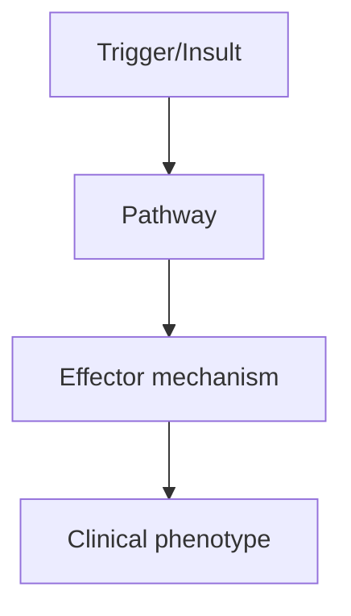
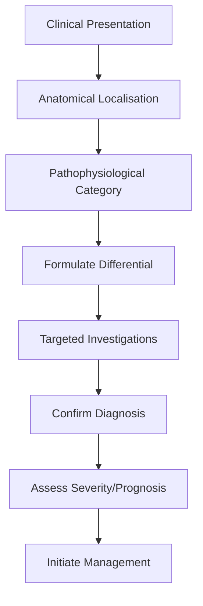

# Degenerative Cervical Myelopathy

> [!tip] **High-Yield Definition**
> Degenerative cervical myelopathy (DCM): cervical spinal cord dysfunction due to degenerative changes (spondylosis, disc, OPLL, ligamentum flavum hypertrophy, dynamic factors). Most common cause of spinal cord dysfunction in adults >55y. Slowly progressive, stepwise, may have acute deterioration. Distinct from radiculopathy (root compression).

---

## 1. Definition / Epidemiology / Classification

### Definition
Degenerative cervical myelopathy (DCM): cervical spinal cord dysfunction due to degenerative changes (spondylosis, disc, OPLL, ligamentum flavum hypertrophy, dynamic factors). Most common cause of spinal cord dysfunction in adults >55y. Slowly progressive, stepwise, may have acute deterioration. Distinct from radiculopathy (root compression).

### Epidemiology
Prevalence: radiographic changes 50% >50y, symptomatic 5-10% >60y. Most common cause of cervical myelopathy. Age 50-70y. Male predominance. Often asymptomatic or mild (underdiagnosed). Common: C5/6, C6/7 (most mobile).

### Classification
| Variant | Key Features | Prognosis |
|---------|-------------|-----------|
| | | |

---

## 2. Aetiology / Pathophysiology

### Aetiology
Cervical spondylosis: disc degeneration (loss of height, herniation), osteophyte formation (anterior, posterior), facet joint arthropathy, ligamentum flavum hypertrophy, OPLL (ossification posterior longitudinal ligament - common in East Asians, DISH). Pathogenesis: static (compression by osteophyte, disc, OPLL, ligamentum flavum), dynamic (instability, motion-induced compression, especially extension), vascular (ASA compression, ischemia, venous congestion), demyelination, axonal loss, neuronal death. Risk factors: age, manual labour, heavy lifting, vibration, smoking, congenital stenosis, Down syndrome, athetoid cerebral palsy. Acceleration: trauma (central cord, whiplash).

### Pathophysiology


---

## 3. Clinical Features

### History
- **Onset/Duration:**
- **Progression:**
- **Key symptoms:**
- **Triggers:**
- **Systemic symptoms:**
- **Drug/Family/Social history:**

### Examination
| Domain | Key Findings | Localisation Value |
|--------|-------------|-------------------|
| | | |

### Specific Clinical Features
Insidious onset, slowly progressive, stepwise (may have acute on chronic). Neck pain (less than radiculopathy, often absent), stiffness. Upper limb: clumsy hands, weakness (often C5-C7, myotomal, intrinsic hand, fine motor - buttoning, writing, coins), sensory loss, paresthesia. Lower limb: stiffness, spastic gait, scissor gait, weakness, sensory loss, balance disturbance, falls. Bladder: urgency, frequency, retention (late). Bowel: constipation (less). Reflexes: hyperreflexia (brisk, BCI, knee, ankle, +Babinski), Hoffmann, clonus, Lhermitte's. Gait: spastic, broad-based, unsteady. Exam: gait, Romberg, fine motor, reflexes, spasticity (mAS), sensation, proprioception. Severity: mJOA (modified Japanese Orthopaedic Association), Nurick grading. Differential: MS, NMO, MOG, cord compression (other causes), motor neuron disease, hereditary spastic paraplegia, B12 deficiency, copper deficiency, HTLV-1, transverse myelitis, paraneoplastic, sarcoid, vascular malformation (AVM, dural AVF).

---

## 4. Diagnostic Approach / Algorithm



---

## 5. Investigations

MRI cervical spine (essential, with T2, STIR, flexion-extension views): cord compression, signal change (T2 hyperintensity - myelomalacia, oedema, T1 - chronic, worse prognosis), disc herniation, osteophyte, OPLL, ligamentum flavum hypertrophy, dynamic compression. MRI brain: exclude demyelination, MS, NMO, motor cortex. NCS/EMG: often normal, exclude MND (no LMN, normal sensory, normal motor unit), peripheral neuropathy. CSF: usually normal, exclude inflammation, infection (CSF OCBs - MS). X-ray cervical: disc height, osteophytes, instability, OPLL (screening). CT: bone detail, OPLL, fracture, post-operative. CT myelogram: if MRI contraindicated. Genetic: hereditary spastic paraplegia (SPG4, SPG7), spinocerebellar ataxia, if young, family history. Bloods: FBC, U&Es, LFTs, B12, copper, ESR, CRP, autoimmune, syphilis, HIV, HTLV-1.

---

## 6. Differential Diagnosis

| Differential | Distinguishing Features | Key Test |
|--------------|------------------------|----------|
| | | |

---

## 7. Management

Surgical: anterior (ACDF, anterior cervical discectomy and fusion, corpectomy, disc replacement), posterior (laminectomy, laminoplasty, fusion), or combined. Indication: progressive neurological deficit, severe (mJOA <12, Nurick III-IV), intolerable pain, functional impairment, myelopathy + radiculopathy, instability. Best outcomes: surgery within 1 year, mJOA >12, younger, no severe cord signal change. Conservative: mild, stable, no functional impairment, high surgical risk, patient preference. Includes: observation, physiotherapy (cervical strengthening, ROM, posture, aerobic, low-impact, avoid high-impact), NSAIDs, neuropathic pain medications (gabapentin, pregabalin, amitriptyline, duloxetine), steroid injection (cervical transforaminal, facet, trigger point - temporary, may worsen, controversy), activity modification, fall prevention. Bracing: cervical collar (soft, rigid) - temporary, controversial, may help symptoms but not disease modification. Multidisciplinary: spinal surgery (neurosurgery, orthopaedic), neurology, rehabilitation, OT, PT, pain, social, palliative. Monitor: mJOA, Nurick, MRI (post-op, follow-up), complications. Avoid: manipulation, high-impact activity, heavy lifting, falls, smoking.

---

## 8. Drug Interactions / Contraindications / Comorbidity Cautions

| Drug | Interaction / Caution | Management |
|------|----------------------|------------|
| | | |

---

## 9. Procedures (if applicable)

### Procedure:
- **Indications:**
- **Contraindications:**
- **Preparation / Principle:**
- **Complications:**
- **Viva Pearls:**

---

## 10. Complications

| Complication | Frequency | Prevention / Monitoring | Management |
|--------------|-----------|------------------------|------------|
| | | | |

---

## 11. Red Flags / Emergencies

Rapid neurological deterioration (surgical emergency), acute trauma (central cord, especially with ankylosing spondylitis, OPLL, severe stenosis), worsening despite conservative, severe functional impairment (mJOA <12, wheelchair, walker), bladder/bowel dysfunction, myelopathy + radiculopathy, instability, severe cord signal change on MRI (T2 hyperintensity - worse prognosis, T1 - worse). Falls (spastic gait, proprioception loss, foot drop), aspiration, autonomic dysfunction (cervical - severe, bradycardia, hypotension), pressure sores, urinary retention, depression, suicide.

---

## 12. Prognosis

Variable. Surgical: 60-80% improve (mJOA), 20% stable, 20% progress slowly. Best: early surgery, mJOA >12, younger, mild signal change, no T1 signal. Worst: severe, prolonged, T1 signal, severe stenosis, advanced age, comorbidity. Conservative: 20-30% progress over 5-10 years. Recurrence: adjacent segment disease (5-10% over 5-10y, especially multilevel, ACDF). C5 palsy: 5% post-op, usually recovers. Complications: dysphagia (ACDF, 5-10%), hoarseness (RLN injury, 1-3%), hardware failure, infection, CSF leak, neurological deterioration. Multidisciplinary care essential. Long-term: monitor, recurrence, adjacent segment, function, quality of life.

---

## 13. Topic Correlation

| Related Topic | Link | Key Overlap |
|---------------|------|-------------|
| | | |

---

## 14. Special Situations

| Situation | Consideration |
|-----------|---------------|
| **Pregnancy** | |
| **Lactation** | |
| **Paediatric** | |
| **Elderly / Frail** | |
| **Renal impairment** | |
| **Hepatic impairment** | |
| **Immunocompromised** | |
| **Perioperative** | |
| **Driving / DVLA** | |
| **Occupational** | |

---

## FCPS/MRCP High-Yield Summary

| Category | Key Points |
|----------|------------|
| **Definition** | Degenerative cervical myelopathy (DCM): cervical spinal cord dysfunction due to degenerative changes (spondylosis, disc, OPLL, ligamentum flavum hypertrophy, dynamic factors). Most common cause of spi |
| **Epidemiology** | Prevalence: radiographic changes 50% >50y, symptomatic 5-10% >60y. Most common cause of cervical myelopathy. Age 50-70y. Male predominance. Often asym |
| **Pathophysiology** | |
| **Clinical** | Insidious onset, slowly progressive, stepwise (may have acute on chronic). Neck pain (less than radiculopathy, often absent), stiffness. Upper limb: clumsy hands, weakness (often C5-C7, myotomal, intr |
| **Diagnosis** | |
| **Investigations** | MRI cervical spine (essential, with T2, STIR, flexion-extension views): cord compression, signal change (T2 hyperintensity - myelomalacia, oedema, T1 - chronic, worse prognosis), disc herniation, oste |
| **Management** | Surgical: anterior (ACDF, anterior cervical discectomy and fusion, corpectomy, disc replacement), posterior (laminectomy, laminoplasty, fusion), or combined. Indication: progressive neurological defic |
| **Complications** | |
| **Prognosis** | Variable. Surgical: 60-80% improve (mJOA), 20% stable, 20% progress slowly. Best: early surgery, mJOA >12, younger, mild signal change, no T1 signal. Worst: severe, prolonged, T1 signal, severe stenos |
| **Viva Pearls** | |
| **Drug Doses** | |
| **Scoring Systems** | |
| **Genetics** | |
| **Imaging Signs** | |

---

## Viva Questions (PACES/FCPS Style)

1. **Q:** Define Degenerative Cervical Myelopathy and classify its variants.
   **A:** Based on the definition above.

2. **Q:** What are the key clinical features?
   **A:** Insidious onset, slowly progressive, stepwise (may have acute on chronic). Neck pain (less than radiculopathy, often absent), stiffness. Upper limb: clumsy hands, weakness (often C5-C7, myotomal, intrinsic hand, fine motor - buttoning, writing, coins), sensory loss, paresthesia. Lower limb: stiffnes

3. **Q:** What is the first-line treatment?
   **A:** Based on the management section.

4. **Q:** What are the red flags requiring urgent referral?
   **A:** Rapid neurological deterioration (surgical emergency), acute trauma (central cord, especially with ankylosing spondylitis, OPLL, severe stenosis), worsening despite conservative, severe functional impairment (mJOA <12, wheelchair, walker), bladder/bowel dysfunction, myelopathy + radiculopathy, insta

5. **Q:** What is the prognosis?
   **A:** Variable. Surgical: 60-80% improve (mJOA), 20% stable, 20% progress slowly. Best: early surgery, mJOA >12, younger, mild signal change, no T1 signal. Worst: severe, prolonged, T1 signal, severe stenosis, advanced age, comorbidity. Conservative: 20-30% progress over 5-10 years. Recurrence: adjacent s

6. **Q:** How do you differentiate Degenerative Cervical Myelopathy from key differentials?
   **A:** Clinical features, investigations, and response to treatment.

7. **Q:** What investigations are most useful?
   **A:** Based on the investigations section.

8. **Q:** Describe the stepwise management approach.
   **A:** Based on the management algorithm.

9. **Q:** What are the emergency presentations?
   **A:** Based on the red flags section.

10. **Q:** How does management change in pregnancy/paediatrics/elderly?
    **A:** Special considerations per population.

---

## Common Confusions / Exam Traps

| Confusion | Clarification |
|-----------|---------------|
| | |

---

## Mnemonics
1. ****DCM-ABC** = **A**ge (50-70y), **B**lunt hands (loss of dexterity), **C**ervical spondylosis (C5-6 most)**
2. ****mJOA** = mild (>15), moderate (12-14), severe (<12); surgical threshold often <12 or progressive**
3. ****DCM-RED FLAGS** = Rapid progression, bladder/bowel, gait loss = urgent surgery**

---

## Mind Map

```mermaid
mindmap
  root((Degenerative Cervical Myelopathy (DCM)))
    Definition
    Pathophysiology
    Clinical
    Investigations
    Differential
    Management
    Prognosis
```

---

## Spaced Repetition Trackers

| Day 1 | Day 3 | Day 7 | Day 14 | Day 30 | Day 90 |
|------|-------|-------|--------|--------|--------|
| | | | | | |

---

## Self-Test Scorecard

| Section | Score /5 |
|---------|----------|
| Definition | |
| Pathophysiology | |
| Clinical | |
| Investigations | |
| Differential | |
| Management | |
| Prognosis | |

---

## MCQs (10)

1. **Q:** 65-year-old with progressive gait disturbance, clumsy hands, urinary urgency. MRI: multilevel cervical spondylosis with cord compression and T2 hyperintensity. Diagnosis?
   **Options:** A. Degenerative cervical myelopathy B. MS C. ALS D. Stroke
   **Answer:** A
   **Explanation:** DCM: older patient, gait disturbance (corticospinal tracts), hand clumsiness (loss of dexterity, anterior horn cells), sphincter dysfunction, Lhermitte's. MRI: cord compression, T2 hyperintensity (myelomalacia).

2. **Q:** Most common level of cervical spondylotic myelopathy?
   **Options:** A. C5-C6 (most mobile segment) B. C1-C2 C. C7-T1 D. C2-C3
   **Answer:** A
   **Explanation:** C5-C6 most common level (most mobile). C4-C5, C6-C7 next. Multilevel common.

3. **Q:** First-line investigation for DCM?
   **Options:** A. MRI cervical spine (gold standard) B. CT cervical C. X-ray D. LP
   **Answer:** A
   **Explanation:** MRI cervical spine: gold standard. Shows cord compression, T2 hyperintensity (oedema/myelomalacia), canal stenosis, disc herniation/osteophytes. X-ray for dynamic instability. CT for surgical planning (bony anatomy).

4. **Q:** Most reliable sign on physical exam in DCM?
   **Options:** A. Hoffman's sign (upper limb UMN), hyperreflexia, gait ataxia; Lhermitte's sign; loss of dexterity B. Babinski only C. Sensory only D. Reflex loss
   **Answer:** A
   **Explanation:** DCM signs: upper limb UMN (Hoffman's, hyperreflexia, clonus), lower limb UMN (spasticity, Babinski, hyperreflexia), gait ataxia (spinocerebellar), Lhermitte's, hand clumsiness, sensory loss, sphincter (late).

5. **Q:** Conservative vs surgical management of DCM?
   **Options:** A. Surgical for moderate-severe (mJOA <12) or progressive; conservative for mild stable B. All surgical C. All conservative D. No treatment
   **Answer:** A
   **Explanation:** DCM: surgical for moderate-severe (mJOA <12) or progressive. Conservative (physio, analgesia, activity modification) for mild stable. Surgical options: ACDF (anterior cervical discectomy and fusion), laminoplasty, laminectomy, posterior cervical foraminotomy.

6. **Q:** Surgical approaches for DCM?
   **Options:** A. Anterior (ACDF, ACCF, cervical disc replacement) or posterior (laminoplasty, laminectomy) B. Always anterior C. Always posterior D. Conservative only
   **Answer:** A
   **Explanation:** Anterior approach: ACDF (1-2 levels, ventral compression), ACCF (corpectomy, multi-level), cervical disc replacement (preserves motion). Posterior: laminoplasty (multilevel, preserves motion), laminectomy (multilevel, falls back on cord). Choice: number of levels, alignment (kyphosis favours anterior).

7. **Q:** When is surgery urgent/emergent in DCM?
   **Options:** A. Rapid progression, severe deficit (mJOA <12), sphincter involvement, gait loss B. Always planned C. Never urgent D. After 6 months of conservative
   **Answer:** A
   **Explanation:** Urgent/emergent indications: rapid neurological deterioration, severe deficit (mJOA <12), sphincter dysfunction, gait loss, progressive symptoms despite conservative. Don't delay in moderate-severe disease.

8. **Q:** mJOA score interpretation?
   **Options:** A. 18 full; <12 severe; surgical threshold often B. 0-10 only C. Reversed D. 0-100
   **Answer:** A
   **Explanation:** mJOA: 0-18. 17-18 normal, 13-16 mild, 9-12 moderate, <9 severe. <12 surgical threshold often. Subscales: motor upper, motor lower, sensation upper, sensation lower, sphincter.

9. **Q:** Natural history of untreated DCM?
   **Options:** A. Progressive (often stepwise deterioration), may stabilise; 20-60% deteriorate over time B. Always improves C. No change D. Resolves
   **Answer:** A
   **Explanation:** DCM natural history: progressive (often stepwise deterioration), may stabilise. 20-60% deteriorate over 3-5 years. Earlier surgery = better outcome. Severe preoperative deficit = worse surgical outcome.

10. **Q:** MRI findings in DCM include all EXCEPT:
    **Options:** A. Cord compression and T2 hyperintensity B. Cord atrophy C. Cord enhancement D. CSF flow void
    **Answer:** D
    **Explanation:** MRI: cord compression, T2 hyperintensity (oedema early, myelomalacia late), cord atrophy (late, irreversible), focal enhancement (active inflammation). CSF flow void on T2: present in stenosis, indicates dynamic compression.

---

## SBA Questions (10)

1. **Scenario:** 70-year-old with progressive gait disturbance, hand clumsiness, sphincter dysfunction over 18 months. MRI: C4-5, C5-6 spondylosis with cord compression, T2 hyperintensity.
   **Question:** Best management?
   **Options:** A. Surgical decompression (anterior ACDF or posterior laminoplasty); mJOA 8 (severe) B. Conservative only C. Watch D. Steroids
   **Answer:** A
   **Explanation:** Severe DCM (mJOA 8) with progressive symptoms, sphincter dysfunction: surgical. Choice depends on alignment, levels.

2. **Scenario:** 55-year-old with DCM, mJOA 15, mild symptoms. MRI: C5-6 single level compression.
   **Question:** Approach?
   **Options:** A. Discuss options: conservative vs surgical (ACDF); patient preference; close follow-up if conservative B. Surgery only C. Conservative only D. Wait
   **Answer:** A
   **Explanation:** Mild DCM (mJOA 15), single level: shared decision. Conservative: physio, analgesia, activity modification.

3. **Scenario:** Post-ACDF for DCM, day 1. Hoarse voice, difficulty swallowing. Cause?
   **Options:** A. RLN injury, soft tissue swelling, haematoma; urgent CT if haematoma, ENT/swallow B. Stroke C. Cardiac D. Reassure
   **Answer:** A
   **Explanation:** Post-ACDF complications: RLN injury (hoarseness), SLN (voice fatigue), soft tissue swelling (dysphagia), haematoma (urgent evacuation if airway compromise).

4. **Scenario:** 50-year-old with DCM and significant cervical kyphosis. MRI: C3-4, C4-5, C5-6 stenosis with cord compression.
   **Question:** Surgical approach?
   **Options:** A. Anterior approach preferred (kyphosis, multi-level, ventral compression); ACCF or skip corpectomy B. Posterior only C. Conservative D. No surgery
   **Answer:** A
   **Explanation:** Cervical kyphosis + multi-level + ventral compression: anterior approach preferred. ACCF or skip corpectomy for 3+ levels.

5. **Scenario:** 60-year-old with DCM. MRI: C4-7 multi-level stenosis. Maintains cervical lordosis.
   **Question:** Surgical approach?
   **Options:** A. Posterior approach (laminoplasty or laminectomy) - falls back on cord, preserves lordosis B. Anterior only C. Conservative D. Watch
   **Answer:** A
   **Explanation:** Multi-level DCM with preserved lordosis: posterior approach. Laminoplasty or laminectomy.

6. **Scenario:** 60-year-old with DCM 3 months post-op, gait improving but hand clumsiness persists.
   **Question:** Prognosis?
   **Options:** A. Variable - gait often improves first; hand/clumsiness may take longer; 6-12 months for max recovery B. Full recovery always C. No recovery D. Worsens
   **Answer:** A
   **Explanation:** DCM surgical outcome: gait often improves first; hand clumsiness takes longer. 6-12 months for max recovery.

7. **Scenario:** 75-year-old with severe DCM (mJOA 6), unable to walk, multiple comorbidities.
   **Question:** Management?
   **Options:** A. Risk-benefit discussion; surgery may prevent further decline; shared decision B. No surgery C. Palliate D. Aggressive multi-level surgery regardless
   **Answer:** A
   **Explanation:** Severe DCM + elderly + comorbidities: risk-benefit. Surgery may halt progression but recovery limited.

8. **Scenario:** 65-year-old with DCM, MRI shows cord atrophy at C5-6.
   **Question:** Prognosis?
   **Options:** A. Poor - cord atrophy indicates irreversible neuronal loss; surgery may halt progression B. Excellent C. Same as without atrophy D. Surgery not indicated
   **Answer:** A
   **Explanation:** Cord atrophy on MRI: irreversible neuronal loss. Surgery may halt progression but limited recovery.

---

## Tags
**Tags:** #neurology #DCM #cervical-myelopathy #spondylosis #mJOA #ACDF #laminoplasty #cord-compression #FCPS #MRCP

---

## Local Navigation
**Heading Hub:** [[../Hub]]  
**Chapter Hierarchy:** [[Davidson Chapter 25 - Neurology Hierarchy]]  
**Chapter MOC:** [[Neurology MOC]]  
**Drug Reference:** [[../00_Index/Neurology Drug Reference]]  
