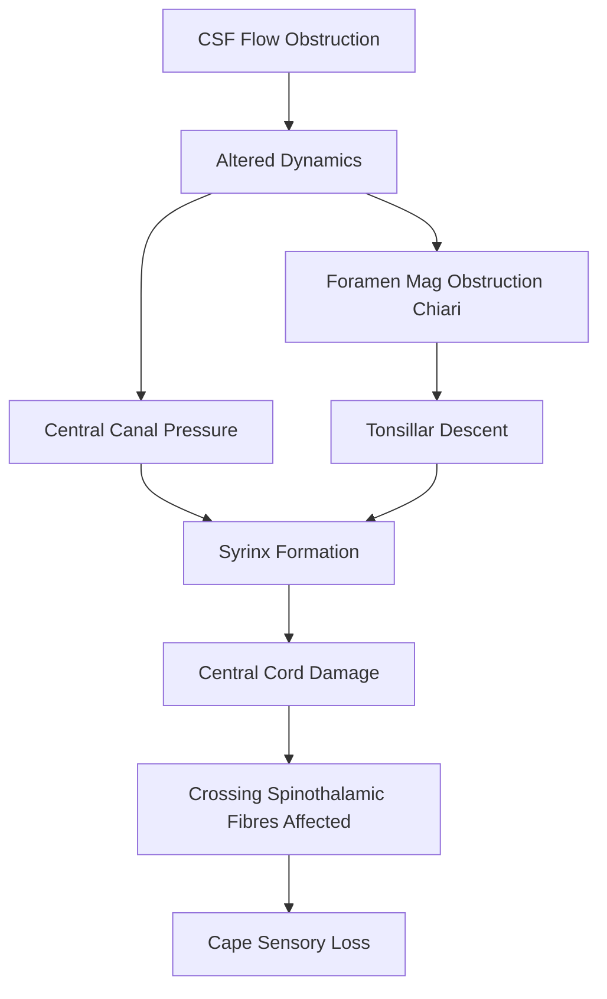
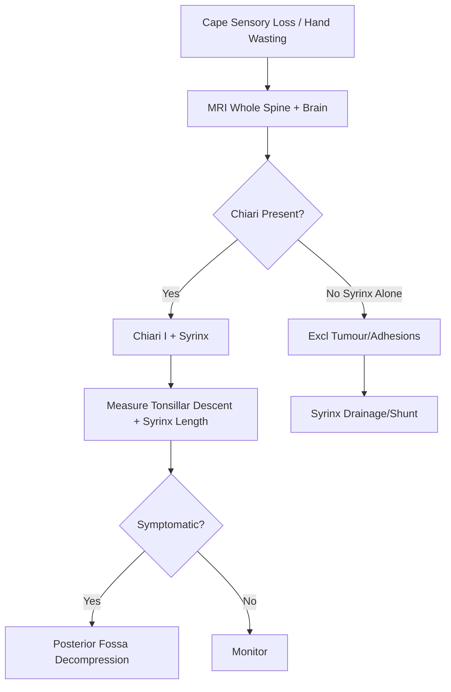

# Syringomyelia & Chiari Malformation

> [!tip] **Definition**
> **Syringomyelia** = fluid-filled cavity (syrinx) within the spinal cord; **Hydromyelia** = dilatation of central canal. **Chiari malformations** = hindbrain herniation through foramen magnum; Chiari I = cerebellar tonsil descent, often with syrinx; Chiari II = cerebellar/brainstem descent with myelomeningocele.

> [!tip] **Cape sensory loss** = dissociated sensory loss (loss of pain/temperature, preserved touch) in C4-T2 distribution due to crossing spinothalamic tract interruption at central cord.

## 1. Definition / Epidemiology / Classification

### Definition
**Syringomyelia:** longitudinal fluid cavity within cord; communicates with central canal (hydromyelic) or isolated.
**Chiari I:** Tonsillar descent ≥5mm below foramen magnum.
**Chiari II:** Cerebellar vermis, brainstem, 4th ventricle descend; associated with myelomeningocele.

### Epidemiology
- **Syringomyelia:** 8/100,000; 50-70% associated with Chiari I
- **Chiari I:** 0.5-1% prevalence (often asymptomatic); ♀>♂; adult presentation
- **Chiari II:** 1/1000 live births; always with myelomeningocele
- **Risk factors:** Posterior fossa abnormalities, scoliosis, basal invagination, trauma, tumour

### Classification
| Type | Features |
|------|----------|
| **Communicating** | Communicates with 4th ventricle; post-traumatic, post-meningitic, Chiari |
| **Non-communicating** | Isolated cavity; tumour, trauma |
| **Hydromyelia** | Central canal dilatation |
| **Chiari I** | Tonsillar descent ≥5mm; syrinx 30-60% |
| **Chiari II** | Hindbrain herniation + myelomeningocele |
| **Chiari III** | Hindbrain + encephalocele (rare) |
| **Chiari IV** | Cerebellar hypoplasia |

## 2. Aetiology / Pathophysiology

### Aetiology
- **Congenital:** Chiari malformations, basilar invagination, scoliosis
- **Acquired:** Trauma (10-30%), post-meningitic, post-haemorrhagic, intramedullary tumours (ependymoma, hemangioblastoma), arachnoiditis

### Pathophysiology

### Molecular Basis
- **CSF dynamic theory:** Tonsillar descent obstructs CSF flow at foramen magnum → pulsatile pressure → syrinx formation
- **Gardner's theory:** Failed perforation of obex → CSF enters central canal
- **Olden's theory:** Syrinx fluid from extracellular fluid accumulation
- **Altered compliance:** Loss of cord compliance with cavitation

## 3. Clinical Features

### History
- **Onset:** Insidious (Chiari); subacute (acquired)
- **Cape distribution sensory loss:** Pain/temperature loss in C4-T2; preserved light touch (dissociated)
- **Pain:** Dull, deep; often at level of syrinx
- **Motor:** Weakness, wasting of small muscles of hand, then proximal arm; lower limbs spared early
- **Scoliosis:** Common in children
- **Brainstem features:** Dysphagia, dysphonia, sleep apnoea, nystagmus, drop attacks (Chiari)
- **Valsalva-induced symptoms:** Cough/sneeze headache (Chiari)

### Examination
| Domain | Findings | Localisation |
|--------|---------|--------------|
| **Motor** | Wasting (small hand muscles), flaccid weakness UL, spastic LL (late) | Anterior horn + CST |
| **Sensory** | **Cape distribution** loss of pain/temp; preserved touch, vibration | Crossing spinothalamic fibres at central cord |
| **Reflexes** | Absent biceps/supinator (LMN) + brisk triceps, knees (UMN) | Mixed |
| **Brainstem** | Nystagmus, lower CN palsies, tongue wasting | Chiari |
| **Skull/Spine** | Short neck, low hairline, scoliosis | Craniocervical junction |

### Specific Syndromes
| Syndrome | Features | Localisation |
|----------|---------|--------------|
| **Cape sensory loss** | Dissociated sensory loss C4-T2 | Central cord |
| **Syringobulbia** | Brainstem extension: tongue wasting, nystagmus, dysphagia | Medulla |
| **Horner's syndrome** | Ptosis, miosis, anhidrosis | Lateral horn (C8-T2) |
| **Charcot joint** | Painless joint destruction | Spinothalamic loss |
| **Charcot-Marie-Tooth disease mimic** | Hand wasting | Anterior horn |
| **Syringomyelia + scoliosis** | Childhood onset | Often Chiari I |

## 4. Diagnostic Approach

### Diagnostic Criteria
- **Chiari I:** Tonsillar descent ≥5mm below foramen magnum (≥3mm in children)
- **Syrinx:** CSF-signal cavity within cord
- **Hydromyelia:** Central canal >4mm

### Severity Assessment
- **Bebin grading:** Mild/moderate/severe based on cavity size
- **Samii classification:** Pre-syrinx state, frank syrinx

## 5. Investigations

### First-Line
| Investigation | Indication |
|---------------|------------|
| **MRI whole spine + brain** | All - syrinx, Chiari, hydrocephalus |
| **Cine flow MRI** | CSF flow at foramen magnum |
| **CT craniocervical junction** | Bony anatomy, basilar invagination |

### Imaging
| Modality | Findings |
|----------|----------|
| **MRI T2** | CSF-signal cavity within cord; Chiari tonsillar descent |
| **MRI with contrast** | Exclude tumour (ependymoma, hemangioblastoma) |
| **Cine phase-contrast MRI** | Reduced/absent CSF flow at foramen magnum in Chiari I |
| **CT** | Bony anomalies, basilar invagination, segmentation anomalies |

### Other
- **CSF:** Often normal; exclude meningitis
- **Sleep study:** Chiari with sleep apnoea
- **Swallow study:** Brainstem involvement

## 6. Differential Diagnosis
| Differential | Distinguishing | Test |
|--------------|---------------|------|
| **ALS/MND** | Combined UMN + LMN, no sensory loss | EMG, MRI normal |
| **Cervical spondylotic myelopathy** | Older, neck pain, neck movement-related | MRI |
| **Multiple sclerosis** | Short-segment, brain lesions, OCB | MRI |
| **Intramedullary tumour** | Mass, enhancement, oedema | MRI + gadolinium |
| **NMOSD** | LETM, optic neuritis, AQP4+ | AQP4-IgG |
| **Leprosy** | Painless ulnar/median neuropathy, travel | Slit skin smear |
| **Hirayama disease** | Young male, asymmetric distal wasting, dynamic MRI | Flexion MRI |
| **CIDP** | Symmetric, distal, demyelinating | NCS, CSF |

## 7. Management

### Emergency
| Situation | Action | Time |
|-----------|--------|------|
| **Acute hydrocephalus** | External ventricular drain (EVD), VP shunt | <24h |
| **Acute brainstem compression** | Posterior fossa decompression | <24-48h |
| **Rapid neurological decline** | Urgent surgical decompression | <24-48h |

### Disease-Modifying / Surgical
| Procedure | Indication | Outcome |
|-----------|------------|---------|
| **Posterior fossa decompression (PFDD)** | Chiari I with syrinx/symptoms | 70-90% improvement |
| **PFDD + C1 laminectomy ± duraplasty** | Standard | 80% syrinx reduction |
| **Fourth ventricle stent (rare)** | Recurrent syrinx | Limited use |
| **Syringo-subarachnoid shunt** | Isolated syrinx | 50-80% effective |
| **Syringo-pleural/peritoneal shunt** | Failed SAS shunt | Variable |
| **Tumour resection** | Tumour-related syrinx | Resolves syrinx |
| **Arachnoidolysis** | Arachnoiditis | Limited evidence |

### Conservative
- Asymptomatic Chiari I: monitor (6-12 monthly MRI)
- Mild symptoms: pain management, physio

### Symptomatic
| Symptom | Rx |
|---------|-----|
| **Pain** | NSAIDs, gabapentinoids, TCAs |
| **Spasticity** | Baclofen, tizanidine |
| **Neuropathic** | Duloxetine, pregabalin |
| **Sleep apnoea** | CPAP, weight loss, surgical |
| **Bladder** | ISC if retention |

## 8. Drug Interactions / Contraindications
| Drug | Caution | Management |
|------|---------|-----------|
| **Gabapentinoids** | Sedation, falls | Slow titration |
| **Baclofen** | Withdrawal syndrome on stop | Slow titration, gradual discontinuation |
| **Opioids** | Dependence, constipation | Short courses |
| **TCAs** | Anticholinergic, QTc | Avoid in elderly/arrhythmia |

## 9. Procedures
### Posterior Fossa Decompression
- **Indications:** Symptomatic Chiari I, syrinx, brainstem compression
- **Technique:** Suboccipital craniectomy, C1 (±C2) laminectomy, duraplasty; arachnoid preservation
- **Complications:** CSF leak, pseudomeningocele, infection, cerebellar ptosis, reoperation 5-15%
- **Outcome:** 70-90% symptom improvement; syrinx reduction in 80%

### Shunt Procedures
- **Syringo-subarachnoid (SAS)** shunt for isolated syrinx
- **Syringo-pleural** for failed SAS
- **VP shunt** if hydrocephalus present

## 10. Complications
| Complication | Frequency | Management |
|--------------|-----------|-----------|
| **CSF leak** | 5-15% (post-op) | Lumbar drain, re-suture |
| **Pseudomeningocele** | 5-10% | Compression, drain |
| **Wound infection** | 2-5% | Antibiotics, debridement |
| **Syrinx recurrence** | 10-20% | Re-decompression, shunt |
| **Hydrocephalus** | 5% | VP shunt |
| **Reoperation** | 5-15% | Tailored approach |
| **Pressure sores** | Common | 2-hourly turning |
| **Charcot joints** | Long-term | Orthotics, surgery |

## 11. Red Flags / Emergencies
| Red Flag | Action | Window |
|----------|--------|--------|
| **Acute hydrocephalus** | EVD / VP shunt | <24h |
| **Acute brainstem compression** | PFDD | <24-48h |
| **Syrinx haemorrhage** | Urgent MRI, surgical decompression | <24-48h |
| **Wound CSF leak** | Lumbar drain, surgical repair | <24-48h |
| **Sepsis (wound/meningitis)** | Antibiotics, source control | <1h |
| **Cord compression (kyphoscoliosis)** | Stabilisation, decompression | <24-48h |

## 12. Prognosis
- **Asymptomatic Chiari I:** 50% remain asymptomatic; 20-30% progress
- **Surgical PFDD:** 70-90% symptom improvement; syrinx reduction 80%
- **Long-term:** 10-20% reoperation; functional outcome generally good
- **Poor:** Delayed diagnosis, severe deficit, post-traumatic syrinx, tumour recurrence
- **Mortality:** Low (<1% in experienced centres)

## 13. Topic Correlation
| Topic | Link | Overlap |
|-------|------|---------|
| **Tethered Cord** | [[Tethered Cord Syndrome]] | Occult spinal dysraphism |
| **Spinal Tumours** | [[Spinal Cord Tumours]] | Tumour-related syrinx |
| **Cervical Myelopathy** | [[Degenerative Cervical Myelopathy]] | Differential |
| **Hydrocephalus** | [[Hydrocephalus]] | Chiari + hydrocephalus |

## 14. Special Situations
| Situation | Consideration |
|-----------|---------------|
| **Pregnancy** | Watch for symptomatic worsening; vaginal delivery usually safe |
| **Paediatric** | Scoliosis early sign; monitor growth, growth-friendly surgery |
| **Elderly** | Higher surgical risk; conservative if minimal symptoms |
| **Prior decompression** | Re-operation; consider shunt, dynamic MRI |
| **Hydrocephalus** | Always treat hydrocephalus first |
| **Chari II (paediatric)** | Often needs VP shunt, PFDD, myelomeningocele repair |

## FCPS/MRCP High-Yield Summary
- **Syringomyelia:** Central cord cavity; cape sensory loss (pain/temp ↓, touch ↑)
- **Chiari I:** Tonsillar descent ≥5mm; syrinx 30-60%
- **Chiari II:** With myelomeningocele; presents in infancy
- **Pathophysiology:** Altered CSF flow at foramen magnum
- **Imaging:** MRI whole spine + brain; cine flow for Chiari
- **Treatment:** PFDD + C1 laminectomy ± duraplasty; syrinx shunts if isolated
- **Viva:** Cape sensory loss = syrinx; dissociated sensory loss; Charcot joint

## Viva Questions
1. **Q:** Define Chiari malformations.
   **A:** I: tonsillar descent ≥5mm below foramen magnum; II: cerebellar vermis, brainstem, 4th ventricle herniation + myelomeningocele; III: with encephalocele; IV: cerebellar hypoplasia.
2. **Q:** What is cape sensory loss?
   **A:** Dissociated sensory loss in C4-T2 distribution (pain/temp loss with preserved light touch, vibration, proprioception) due to damage of crossing spinothalamic fibres in central cord.
3. **Q:** Pathophysiology of syrinx in Chiari I?
   **A:** Tonsillar descent obstructs CSF flow at foramen magnum → altered pulsatile pressure → syrinx formation.
4. **Q:** First-line investigation?
   **A:** MRI whole spine + brain with cine phase-contrast to assess CSF flow.
5. **Q:** Management of symptomatic Chiari I with syrinx?
   **A:** Posterior fossa decompression (suboccipital craniectomy + C1 laminectomy + duraplasty) ± arachnoid preservation.
6. **Q:** What is Charcot joint in syringomyelia?
   **A:** Painless joint destruction (often shoulder, elbow) due to loss of pain sensation; orthotics, surgery if severe.
7. **Q:** Difference between syringomyelia and hydromyelia?
   **A:** Syringomyelia: cavity separate from central canal; Hydromyelia: dilatation of central canal.
8. **Q:** Asymptomatic Chiari I - management?
   **A:** Monitor with 6-12 monthly MRI; no surgery.
9. **Q:** When is syrinx shunt considered?
   **A:** Isolated syrinx without Chiari, or persistent syrinx after PFDD.
10. **Q:** Why does Chiari I cause sleep apnoea?
    **A:** Brainstem (medullary respiratory centres) compression by tonsils; sleep study + CPAP.
11. **Q:** Scoliosis in syringomyelia?
    **A:** Common in childhood; should image cord in young scoliosis patients; treated with syrinx decompression + bracing/scoliosis surgery.
12. **Q:** What is the role of cine flow MRI?
    **A:** Phase-contrast MRI assesses CSF flow dynamics at foramen magnum; useful in selecting patients for PFDD.

## Common Confusions / Exam Traps
| Confusion | Clarification |
|-----------|---------------|
| **Cape sensory loss vs glove/stocking** | Cape = central cord, dissociated; glove/stocking = peripheral |
| **Syringomyelia vs ALS** | Syrinx = sensory loss; ALS = NO sensory loss |
| **Chiari I vs II** | Chiari I = isolated; Chiari II = with myelomeningocele |
| **Syrinx vs tumour** | Tumour: enhancement, mass; syrinx: CSF signal, no enhancement |
| **Hydrocephalus treatment order** | Treat hydrocephalus first in Chiari with both |

## Mnemonics
1. **SYRINX** — **S**ensory cape, **Y**oung adult, **R**eflexes mixed, **I**ntramedullary, **N**o enhancement, **X** central cord
2. **CHIARI** — **C**erebellar tonsil descent, **H**indbrain hernia, **I**nferior, **A**rrested at foramen, **R**are
3. **CAPE** — **C**entral cord, **A**nterior commissure crossing, **P**ain/temp, **E**xpect dissociated sensory
4. **CHARCOT** — **C**ord syrinx, **H**and wasting, **A**bsent pain, **R**eflex loss, **C**ompression, **O**rthopaedics, **T**emperature

## One-Page Revision Card
| Topic | Syringomyelia & Chiari |
|-------|----------------------|
| **Definition** | Cord cavity (syrinx) ± tonsillar descent (Chiari) |
| **Clinical** | Cape sensory loss, hand wasting, Charcot joints, scoliosis |
| **Diagnosis** | MRI whole spine + brain; cine flow for Chiari |
| **Management** | PFDD + C1 laminectomy + duraplasty for symptomatic Chiari I; syrinx shunt if isolated |
| **Prognosis** | 70-90% symptom improvement post-PFDD |
| **Red Flag** | Acute hydrocephalus, brainstem compression |

## Must Know / Should Know / Nice to Know
- **Must:** Cape sensory loss, Chiari I vs II, PFDD
- **Should:** Cine flow MRI, syrinx shunt, scoliosis
- **Nice:** Charcot joint, syringobulbia, scoliosis in children

## MCQs (10)
1. **Q:** Chiari I is defined as?
   **Options:** A. Tonsillar descent ≥5mm B. Tonsillar descent ≥10mm C. Cerebellar vermis herniation D. Brainstem only
   **Answer:** A
2. **Q:** Cape sensory loss in syringomyelia is due to?
   **Options:** A. Dorsal column damage B. Crossing spinothalamic tract interruption at central cord C. Anterior horn D. Root damage
   **Answer:** B
3. **Q:** Chiari II is associated with?
   **Options:** A. Dandy-Walker B. Myelomeningocele C. Klippel-Feil D. Achondroplasia
   **Answer:** B
4. **Q:** First-line imaging for syrinx?
   **Options:** A. CT spine B. MRI whole spine + brain C. Myelography D. X-ray
   **Answer:** B
5. **Q:** Standard surgery for symptomatic Chiari I with syrinx?
   **Options:** A. VP shunt B. PFDD + C1 laminectomy + duraplasty C. Laminectomy alone D. Cordectomy
   **Answer:** B
6. **Q:** Charcot joint in syringomyelia is due to?
   **Options:** A. Motor weakness B. Loss of pain sensation C. Spasticity D. Tremor
   **Answer:** B
7. **Q:** Hydromyelia is?
   **Options:** A. Cavity within cord B. Dilatation of central canal C. Subarachnoid cyst D. Arachnoiditis
   **Answer:** B
8. **Q:** Scoliosis is a common presentation in?
   **Options:** A. Adult Chiari II B. Paediatric syringomyelia C. Spinal cord injury D. Disc herniation
   **Answer:** B
9. **Q:** Asymptomatic Chiari I management?
   **Options:** A. Urgent surgery B. Monitor with 6-12 monthly MRI C. VP shunt D. RT
   **Answer:** B
10. **Q:** What is the most common cause of acquired syringomyelia?
    **Options:** A. Chiari I B. Trauma C. Tumour D. Idiopathic
    **Answer:** B

## SBA Questions (10)
1. **Scenario:** 35-year-old with shoulder pain, painless burn on forearm, weak hands. MRI: cervical syrinx C2-T1, tonsillar descent 8mm. Diagnosis?
   **Options:** A. MS B. Chiari I + syrinx C. ALS D. Brachial plexitis
   **Answer:** B
2. **Scenario:** 8-year-old with scoliosis, no neurology. Whole spine MRI shows cervical syrinx, tonsils 6mm below foramen magnum. Next step?
   **Options:** A. Brace only B. PFDD C. Monitor only D. RT
   **Answer:** B
3. **Scenario:** Chiari I decompression 6 months ago, persistent syrinx, no CSF leak. Best next step?
   **Options:** A. Repeat decompression B. Syringo-subarachnoid shunt C. RT D. Shunt revision
   **Answer:** B
4. **Scenario:** Patient with known Chiari II, presents with progressive headache, vomiting, papilloedema. Diagnosis?
   **Options:** A. Migraine B. Hydrocephalus C. Syrinx D. Chiari worsening
   **Answer:** B
5. **Scenario:** 40-year-old with syrinx, examination shows right Horner's syndrome. Localisation?
   **Options:** A. C5-C6 B. C8-T2 (lateral horn) C. Brainstem D. T10
   **Answer:** B
6. **Scenario:** PFDD 5 days post-op, wound swelling, clear fluid leak, no fever. Diagnosis?
   **Options:** A. Infection B. CSF leak C. Pseudomeningocele D. Haematoma
   **Answer:** B
7. **Scenario:** Syringobulbia would cause?
   **Options:** A. Hand wasting B. Tongue wasting, dysphagia C. Cauda equina D. Foot drop
   **Answer:** B
8. **Scenario:** Paediatric Chiari I, asymptomatic, 4mm tonsillar descent. What is the next step?
   **Options:** A. Surgery B. Annual MRI follow-up C. RT D. Chemo
   **Answer:** B
9. **Scenario:** 30-year-old with intramedullary tumour at C3, syrinx above and below. Best Rx?
   **Options:** A. RT only B. Surgical resection of tumour C. Shunt only D. Steroids
   **Answer:** B
10. **Scenario:** Most common presenting symptom of Chiari I in adults?
    **Options:** A. Sleep apnoea B. Suboccipital headache (Valsalva-induced) C. Seizure D. Visual loss
    **Answer:** B

## Flashcards
- **Q:** Chiari I definition? **A:** Tonsillar descent ≥5mm below foramen magnum
- **Q:** Cape sensory loss? **A:** C4-T2 pain/temp loss, preserved touch
- **Q:** Chiari II association? **A:** Myelomeningocele
- **Q:** Syringobulbia? **A:** Brainstem extension - tongue wasting, dysphagia
- **Q:** First-line surgery Chiari I? **A:** PFDD + C1 laminectomy + duraplasty
- **Q:** Hydromyelia? **A:** Central canal dilatation
- **Q:** Charcot joint cause? **A:** Loss of pain sensation
- **Q:** Asymptomatic Chiari I Rx? **A:** Monitor with 6-12 monthly MRI
- **Q:** Cine flow MRI? **A:** CSF flow dynamics at foramen magnum
- **Q:** Scoliosis in childhood? **A:** Image cord - syrinx, Chiari

## Answer Key
### MCQs
1. A  2. B  3. B  4. B  5. B  6. B  7. B  8. B  9. B  10. B

### SBAs
1. B  2. B  3. B  4. B  5. B  6. B  7. B  8. B  9. B  10. B

## Summary
**Syringomyelia** is a fluid cavity within the cord; **Chiari I** (tonsillar descent ≥5mm) is the most common association. **Cape sensory loss** (dissociated pain/temp loss C4-T2 with preserved touch) is pathognomonic, due to central cord damage of crossing spinothalamic fibres. Hand wasting, Charcot joints, scoliosis, and brainstem features (Chiari) are common. **MRI whole spine + brain** with cine flow imaging is diagnostic. **Posterior fossa decompression + C1 laminectomy + duraplasty** is standard for symptomatic Chiari I. Asymptomatic Chiari is monitored. Syrinx shunts are used for isolated or persistent syrinx. Prognosis post-surgery is good (70-90% improvement).
