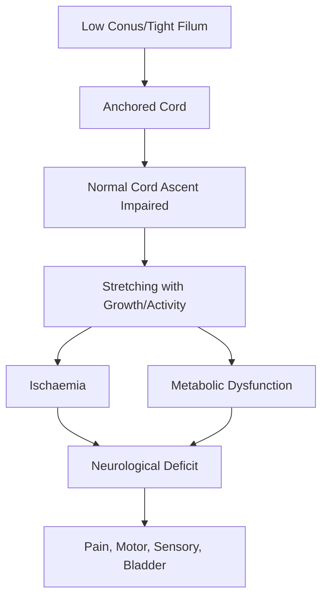
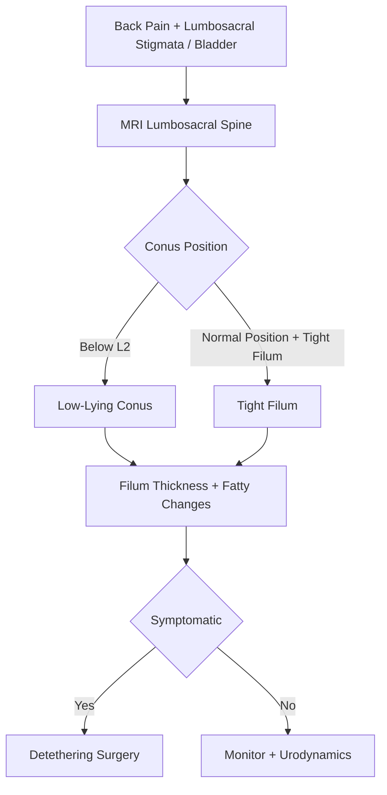

# Tethered Cord Syndrome

> [!tip] **Definition**
> **Tethered cord syndrome (TCS)** = abnormal fixation/stretching of the spinal cord (low-lying conus or tight filum) causing neurological, urological, orthopaedic, and pain symptoms from traction.

> [!tip] **Normal conus position:** ≥L1 in newborns, ≥L2 in adults. **Low conus = below L2**; filum >2mm thick = **tight filum terminale**.

## 1. Definition / Epidemiology / Classification

### Definition
Spectrum of disorders where conus medullaris is fixed at abnormally low position, often with tight or thickened filum, causing traction-related symptoms.

### Epidemiology
- **Incidence:** 0.05-0.25/1000 live births (with spina bifida occulta)
- **Age:** Bimodal - childhood (1st decade) and adult (30-50y)
- **Sex:** ♀>♂ (3:1)
- **Risk factors:** Spina bifida occulta, prior myelomeningocele repair, scoliosis, anorectal malformations, VACTERL

### Classification
| Type | Features |
|------|----------|
| **Tight filum terminale** | Filum >2mm, low conus, minimal fat |
| **Filum lipoma** | Fatty infiltration of filum |
| **Lipomyelomeningocele** | Subcutaneous lipoma + cord lipoma |
| **Dermal sinus tract** | Skin dimple/track to dura |
| **Meningocele manque** | Adhesion bands |
| **Terminal myelocystocele** | Cystic dilatation of distal cord |
| **Adult TCS** | Late onset, often after trauma or pregnancy |

## 2. Aetiology / Pathophysiology

### Aetiology
- **Congenital:** Failure of secondary neurulation; spinal dysraphism
- **Acquired:** Post-operative scar (post-myelomeningocele repair), tumour, trauma

### Pathophysiology

### Molecular Basis
- **Filum:** >2mm thick, fibrofatty infiltration
- **Conus:** Position below L2 (adult) or L1 (infant)
- **Stretch-induced:** Oxidative stress, impaired mitochondrial function, altered blood flow
- **Children:** Symptoms worsen with growth spurts

## 3. Clinical Features

### History
- **Onset:** Childhood (often with growth); adult often precipitated by trauma, pregnancy, scoliosis progression
- **Pain:** Low back, leg, perineal - worse with activity, flexion
- **Motor:** Weakness (especially foot/leg), gait difficulty
- **Sensory:** Saddle/perineal numbness, leg paraesthesia
- **Bladder:** Frequency, urgency, retention, recurrent UTI
- **Bowel:** Constipation, incontinence
- **Orthopaedic:** Foot deformities (pes cavus, equinus, hammer toes), leg length discrepancy, scoliosis, hip dysplasia

### Examination
| Domain | Findings | Localisation |
|--------|---------|--------------|
| **Skin** | Lumbosacral dimple, hair patch, lipoma, hemangioma, sinus, asymmetric gluteal cleft | Site of dysraphism |
| **Motor** | Distal weakness, foot deformity, peroneal weakness, gait disturbance | L4-S2 |
| **Sensory** | Saddle/perineal loss | S2-S4 |
| **Reflexes** | Absent ankle jerk, brisk knee jerk | Mixed LMN/UMN |
| **Orthopaedic** | Pes cavus, equinus, scoliosis, hip dysplasia | Long-term effect |
| **Urological** | Bladder dysfunction, retention | S2-S4 |

### Specific Signs
- **Lumbosacral stigmata:** Dimple, hair tuft, lipoma, sinus, hemangioma
- **Foot deformities:** Pes cavus, equinovarus
- **Gait:** Foot drop, Trendelenburg
- **Spine:** Scoliosis, kyphosis
- **Adult:** Often post-trauma or pregnancy onset

## 4. Diagnostic Approach

### Diagnostic Criteria
- **Conus position:** Below L2 (adults) or L1 (infants)
- **Filum thickness:** >2mm on axial MRI
- **Filum signal:** Fatty infiltration (T1 hyperintense)
- **Symptoms consistent:** Pain, motor, sensory, bladder, orthopaedic

### Severity Assessment
- **Andar et al. classification:** Mild (pain/orthopaedic), moderate (bladder), severe (neurological)
- **Yamada TCS grading:** I (orthopaedic) - V (severe)
- **Bladder:** Urodynamics, post-void residual

## 5. Investigations

### First-Line
| Investigation | Indication |
|---------------|------------|
| **MRI lumbosacral spine (with and without contrast)** | All - conus position, filum, lipoma, sinus, tumour |
| **MRI whole spine** | Exclude other lesions, syrinx |
| **MRI brain** | Chiari II, hydrocephalus |
| **Urodynamics (UDS)** | Bladder dysfunction baseline/follow-up |
| **Plain X-ray spine** | Scoliosis, segmentation anomalies |

### Imaging
| Modality | Findings |
|----------|----------|
| **MRI T1/T2** | Low conus, thick filum, lipoma (T1 hyperintense), sinus, occult dysraphism |
| **MRI prone** | Cord movement assessment (research) |
| **Ultrasound (infant <3 mo)** | Alternative before ossification |

### Other Tests
- **Urodynamics:** Detrusor overactivity, dyssynergia
- **EMG/NCS:** LMN changes
- **Somatosensory evoked potentials:** Cord function

## 6. Differential Diagnosis
| Differential | Distinguishing | Test |
|--------------|---------------|------|
| **Spinal cord tumour** | Mass, enhancement, no tethering | MRI |
| **Cauda equina syndrome** | Acute, sacral sensory loss, retention | MRI |
| **Disc herniation** | Single level, radiculopathy | MRI |
| **MS** | Short-segment, brain lesions | MRI, OCB |
| **Chiari malformation** | Tonsillar descent, brainstem features | MRI brain |
| **Peripheral neuropathy** | Length-dependent, no cord signs | NCS |
| **Idiopathic scoliosis** | No tethering stigmata | MRI |
| **Bladder outlet obstruction** | Urethral/prostate cause | Urodynamics |

## 7. Management

### Emergency
- Acute neurological deterioration (rare): urgent MRI + surgical detethering
- Symptomatic retethering (post-op): urgent MRI

### Disease-Modifying / Surgical
| Procedure | Indication | Outcome |
|-----------|------------|---------|
| **Filum sectioning** | Tight filum, low conus | 80-90% stabilisation/improvement |
| **Detethering + lipoma resection** | Lipomyelomeningocele | Variable |
| **Detethering + sinus excision** | Dermal sinus | Resolves infection risk |
| **Tumour resection** | Tumour-related | Resolves traction |
| **Spinal fusion (long-term)** | Scoliosis, instability | Orthopaedic |

### Surgical Principles
- **Early intervention** for symptomatic patients (especially children)
- **Release tension** (filum section, lipoma debulking)
- **Preserve neural elements**
- **Prevent retethering:** duraplasty, grafts
- **Monitor cord function** intra-op with neurophysiology

### Symptomatic / Supportive
| Symptom | Rx |
|---------|-----|
| **Pain** | NSAIDs, gabapentinoids, physio |
| **Spasticity** | Baclofen, physio |
| **Bladder** | Anticholinergics, ISC, botulinum |
| **Bowel** | Laxatives, bowel programme |
| **Scoliosis** | Bracing, growth-friendly surgery |
| **Foot deformity** | Orthotics, tenotomy |

## 8. Drug Interactions / Contraindications
| Drug | Caution | Management |
|------|---------|-----------|
| **Gabapentinoids** | Sedation, falls | Slow titration |
| **Baclofen** | Withdrawal | Slow titration |
| **Anticholinergics (oxybutynin)** | Cognitive, dry mouth | Avoid elderly |
| **Botulinum toxin** | Spread, weakness | Specialist admin |

## 9. Procedures
### Detethering Surgery
- **Indications:** Symptomatic TCS, progressive deficit
- **Technique:** L1-L2 laminectomy, intradural exploration, filum sectioning, lipoma debulking
- **Complications:** CSF leak, infection, retethering (5-50%), neurological injury, pseudomeningocele
- **Outcome:** 80-90% pain relief; 50% bladder improvement; less reliable for motor

### Urodynamic Studies
- **Indications:** Baseline, follow-up
- **Findings:** Detrusor overactivity, poor compliance, dyssynergia

## 10. Complications
| Complication | Frequency | Management |
|--------------|-----------|-----------|
| **Retethering** | 5-50% (long-term) | Re-operation |
| **CSF leak** | 5-10% | Lumbar drain, re-suture |
| **Wound infection/meningitis** | 2-5% | Antibiotics, drain |
| **Pseudomeningocele** | 5-10% | Compression, drain |
| **Progressive scoliosis** | Common | Bracing, fusion |
| **Neurogenic bladder/UTI** | Common | ISC, monitoring |
| **Pressure sores** | Common | 2-hourly turning |
| **Hydrocephalus (in complex cases)** | Variable | VP shunt |

## 11. Red Flags / Emergencies
| Red Flag | Action | Window |
|----------|--------|--------|
| **Acute neurological deterioration** | Urgent MRI + detethering | <24-48h |
| **Meningitis (dermal sinus)** | IV antibiotics, surgical excision | <1h antibiotics, <24h surgery |
| **Acute bladder retention** | Catheterisation, urodynamic assessment | <1h |
| **CSF leak post-op** | Lumbar drain, surgical repair | <24-48h |
| **Sepsis (UTI/wound)** | Antibiotics, source control | <1h |

## 12. Prognosis
- **Children detethered early:** 80-90% stabilisation/improvement
- **Adults:** Better pain outcomes; less reliable motor/bladder recovery
- **Retethering:** 5-50% long-term, especially with lipoma
- **Bladder:** Best in young, deteriorating; poor if chronic
- **Scoliosis:** Stabilisation after detethering in young; surgical correction if severe
- **Mortality:** Very low

## 13. Topic Correlation
| Topic | Link | Overlap |
|-------|------|---------|
| **Spinal Dysraphism** | [[Spina Bifida]] | Spectrum |
| **Chiari Malformation** | [[Syringomyelia & Chiari Malformation]] | Chiari II |
| **Syringomyelia** | [[Syringomyelia & Chiari Malformation]] | Cord pathology |
| **Spina Bifida** | [[Spina Bifida]] | Myelomeningocele |
| **Neurogenic Bladder** | [[Neurogenic Bladder]] | Urological care |

## 14. Special Situations
| Situation | Consideration |
|-----------|---------------|
| **Pregnancy** | Watch for worsening (weight, posture); vaginal delivery if stable |
| **Paediatric** | Symptomatic worsening with growth spurts; early surgery |
| **Elderly** | Higher surgical risk; conservative if stable |
| **Prior myelomeningocele repair** | High retethering risk; monitor |
| **Meningocele** | Treat before tethered symptoms |
| **VACTERL** | Multidisciplinary approach (renal, anal, cardiac) |

## FCPS/MRCP High-Yield Summary
- **Definition:** Low conus (below L2) or tight filum (>2mm) causing traction symptoms
- **Stigmata:** Lumbosacral dimple, hair patch, lipoma, sinus, hemangioma, asymmetric gluteal cleft
- **Clinical:** Back/leg pain, weakness, sensory loss (saddle), bladder/bowel, foot deformities, scoliosis
- **Diagnosis:** MRI lumbosacral (conus position, filum, lipoma)
- **Treatment:** Detethering surgery (filum section ± lipoma debulking); early intervention
- **Prognosis:** 80-90% pain relief; less reliable for motor/bladder
- **Viva:** Lumbosacral stigmata + symptoms = MRI; filum >2mm = tight

## Viva Questions
1. **Q:** What is tethered cord syndrome?
   **A:** Abnormal fixation/stretching of cord due to low-lying conus or tight filum causing traction-related neurological, urological, orthopaedic symptoms.
2. **Q:** Normal conus position?
   **A:** ≥L1 in newborns, ≥L2 in adults.
3. **Q:** What is tight filum terminale?
   **A:** Filum >2mm thick, often with fatty infiltration; restricts cord movement.
4. **Q:** Lumbosacral stigmata of spinal dysraphism?
   **A:** Dimple (above gluteal fold), hair patch, lipoma, dermal sinus, hemangioma, asymmetric gluteal cleft, pigmented naevus.
5. **Q:** First-line investigation?
   **A:** MRI lumbosacral spine (T1/T2 with and without contrast).
6. **Q:** Indication for surgery in TCS?
   **A:** Symptomatic (pain, neurological, bladder, orthopaedic) or progressive. Asymptomatic is monitored.
7. **Q:** Best timing of surgery in children?
   **A:** Early - before irreversible deficit; especially with growth spurts and progressive scoliosis.
8. **Q:** Why does adult TCS present late?
   **A:** Compensated state with slow cord stretch; precipitated by trauma, pregnancy, scoliosis progression, weight gain.
9. **Q:** What is retethering?
   **A:** Recurrence of symptoms due to post-operative scar/fat adherence to cord; 5-50% long-term.
10. **Q:** What is lipomyelomeningocele?
    **A:** Subcutaneous lipoma extending through spina bifida to cord lipoma; treatment: detethering + lipoma debulking.
11. **Q:** Role of urodynamics?
    **A:** Baseline and follow-up of bladder dysfunction; detrusor overactivity, dyssynergia.
12. **Q:** Why is infection important in dermal sinus?
    **A:** Sinus tract can transmit organisms to dura causing meningitis; surgical excision recommended.

## Common Confusions / Exam Traps
| Confusion | Clarification |
|-----------|---------------|
| **TCS vs cauda equina** | TCS = chronic, conus; CES = acute, mass |
| **Asymptomatic TCS** | Monitor; surgery only if symptomatic/progressive |
| **Filum thickness** | >2mm = thick; criteria varies by age |
| **Adult vs child TCS** | Adult often post-trauma; child with growth |
| **Retethering** | Recurrence post-op; need re-operation |

## Mnemonics
1. **TETHERED** — **T**raction, **E**mbryology defect, **T**hin filum, **H**air patch, **E**xamine skin, **R**etethering, **E**arly surgery, **D**ysraphism
2. **SKIN** — **S**inus, **K**inky hair, **I**nclusion mass, **N**aevus
3. **SPLINT** — **S**ymptoms (pain/weakness), **P**rogressive, **L**ow conus, **I**ntradural exploration, **N**europhysiology, **T**hick filum
4. **LOW CONUS** — **L**ow position, **O**ccult dysraphism, **W**asting of feet, **C**ord fixation, **O**rthopaedic, **N**eurogenic bladder, **U**rgent surgery if progression, **S**tigmata

## One-Page Revision Card
| Topic | Tethered Cord Syndrome |
|-------|-----------------------|
| **Definition** | Low conus (below L2) or tight filum (>2mm) |
| **Stigmata** | Dimple, hair patch, lipoma, sinus, hemangioma |
| **Clinical** | Back/leg pain, weakness, saddle sensory loss, bladder, foot deformities, scoliosis |
| **Diagnosis** | MRI lumbosacral |
| **Treatment** | Detethering surgery (filum section ± lipoma debulking) |
| **Prognosis** | 80-90% pain relief; 50% bladder |
| **Red Flag** | Acute deficit, meningitis (sinus) |

## Must Know / Should Know / Nice to Know
- **Must:** Conus position, filum thickness, lumbosacral stigmata, surgery indication
- **Should:** Retethering, lipomyelomeningocele, urodynamic findings
- **Nice:** VACTERL, intra-op neurophysiology, prone MRI

## MCQs (10)
1. **Q:** Normal conus position in adults?
   **Options:** A. T12 B. L1 C. L2 or above D. L4
   **Answer:** C
2. **Q:** Tight filum thickness is defined as?
   **Options:** A. >1mm B. >2mm C. >5mm D. >10mm
   **Answer:** B
3. **Q:** Lumbosacral stigmata include?
   **Options:** A. Dimple above gluteal fold, hair patch, lipoma B. Café-au-lait only C. Scoliosis only D. None
   **Answer:** A
4. **Q:** Most common adult TCS precipitant?
   **Options:** A. Cold weather B. Trauma or pregnancy C. Sleep D. Vaccination
   **Answer:** B
5. **Q:** First-line surgery for tight filum?
   **Options:** A. Cordectomy B. Filum sectioning C. Laminectomy alone D. Fusion
   **Answer:** B
6. **Q:** Asymptomatic TCS in child - next step?
   **Options:** A. Urgent surgery B. Monitor with MRI + UDS C. RT D. Chemo
   **Answer:** B
7. **Q:** Retethering rate is highest in?
   **Options:** A. Filum sectioning B. Lipoma surgery C. Diagnostic LP D. Monitoring
   **Answer:** B
8. **Q:** Dermal sinus tract can lead to?
   **Options:** A. Tumour B. Recurrent meningitis C. Stroke D. MI
   **Answer:** B
9. **Q:** Most useful investigation?
   **Options:** A. CT B. X-ray C. MRI lumbosacral D. PET
   **Answer:** C
10. **Q:** What does not improve post-detethering?
   **Options:** A. Pain B. Bladder function C. Pre-existing severe motor deficit D. Orthopaedic
    **Answer:** C

## SBA Questions (10)
1. **Scenario:** 6-year-old with recurrent UTIs, hair patch over L4, foot deformity. MRI: conus at L4, filum 4mm. Diagnosis?
   **Options:** A. Cerebral palsy B. Tethered cord syndrome C. Guillain-Barré D. Discitis
   **Answer:** B
2. **Scenario:** 35-year-old woman, new onset back pain, leg weakness, urinary retention 2 months postpartum. MRI: low conus, thick filum. Diagnosis?
   **Options:** A. Disc herniation B. Adult TCS C. CES D. MS
   **Answer:** B
3. **Scenario:** Newborn with lumbosacral lipoma extending into spinal canal. Best management?
   **Options:** A. Monitor B. Early surgical detethering + lipoma resection C. RT D. Steroids
   **Answer:** B
4. **Scenario:** Child post-detethering surgery 5 years ago, now progressive back pain, leg weakness. Diagnosis?
   **Options:** A. Recurrence of original B. Retethering C. MS D. Disc herniation
   **Answer:** B
5. **Scenario:** Dermal sinus at S2, child develops fever, neck stiffness. Most appropriate Rx?
   **Options:** A. Antibiotics alone B. IV antibiotics + surgical excision C. Lumbar puncture D. Steroids
   **Answer:** B
6. **Scenario:** 12-year-old with progressive scoliosis, MRI shows tethered cord. Best approach?
   **Options:** A. Bracing only B. Detethering first then scoliosis correction C. Scoliosis correction first D. RT
   **Answer:** B
7. **Scenario:** Adult with low conus, asymptomatic. What to monitor?
   **Options:** A. MRI + UDS B. CT C. PET D. No follow-up
   **Answer:** A
8. **Scenario:** Tethered cord post-op, wound swelling, clear fluid leak. Diagnosis?
   **Options:** A. Infection B. CSF leak C. Haematoma D. Tumour
   **Answer:** B
9. **Scenario:** 8-year-old with low conus, MRI reveals meningocele. Next step?
   **Options:** A. Monitor B. Treat meningocele first then detethering C. Shunt only D. RT
   **Answer:** B
10. **Scenario:** What is the role of intra-op neurophysiology in detethering?
    **Options:** A. Cosmetic B. To monitor cord function and reduce injury C. Pain control D. Anaesthesia
    **Answer:** B

## Flashcards
- **Q:** Normal conus adult? **A:** ≥L2
- **Q:** Tight filum thickness? **A:** >2mm
- **Q:** Lumbosacral stigmata? **A:** Dimple, hair patch, lipoma, sinus, hemangioma
- **Q:** First-line imaging? **A:** MRI lumbosacral
- **Q:** First-line surgery? **A:** Filum sectioning
- **Q:** Retethering rate? **A:** 5-50% (highest with lipoma)
- **Q:** Dermal sinus complication? **A:** Recurrent meningitis
- **Q:** Symptom of adult TCS? **A:** Pain + bladder + neurological
- **Q:** Asymptomatic TCS management? **A:** Monitor
- **Q:** Order of treatment with meningocele? **A:** Meningocele first

## Answer Key
### MCQs
1. C  2. B  3. A  4. B  5. B  6. B  7. B  8. B  9. C  10. C

### SBAs
1. B  2. B  3. B  4. B  5. B  6. B  7. A  8. B  9. B  10. B

## Summary
**Tethered cord syndrome** is a spectrum of disorders where the conus is fixed at an abnormally low position (below L2) or the filum is thickened (>2mm), causing traction-related symptoms. **Lumbosacral stigmata** (dimple, hair patch, lipoma, sinus) are key clinical clues. Presentation includes back/leg pain, distal weakness, saddle sensory loss, bladder dysfunction, foot deformities, and scoliosis. **MRI lumbosacral spine** is diagnostic. **Detethering surgery** (filum section ± lipoma debulking) is indicated for symptomatic or progressive cases; asymptomatic cases are monitored with serial MRI and urodynamics. **Retethering** is a long-term risk (5-50%), especially with lipoma.
