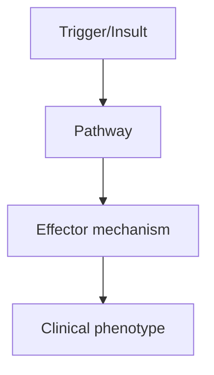
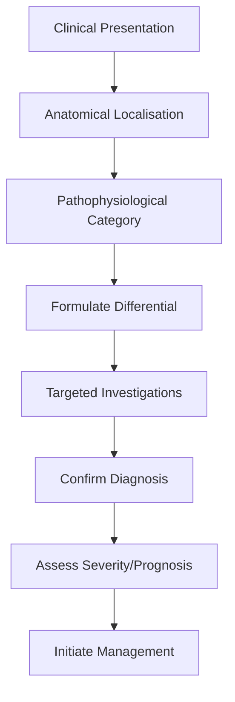
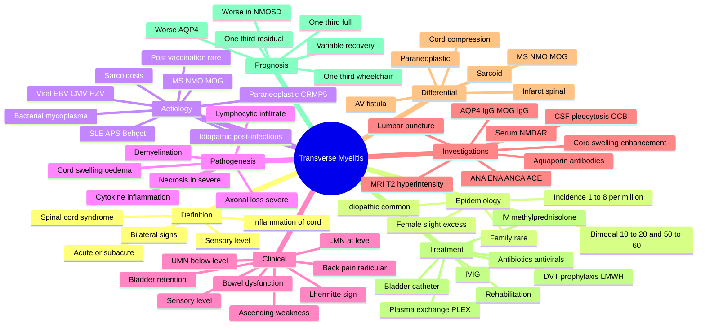

# Transverse Myelitis

> [!tip] **High-Yield Definition**
> Acute transverse myelitis (ATM): acute, inflammatory demyelinating disorder of spinal cord, motor + sensory + autonomic dysfunction with sensory level. Acute myelopathy excluding compressive, vascular, metabolic causes. May be idiopathic or associated with MS, NMOSD, MOGAD, infection, paraneoplastic, sarcoid, SLE, APS.

---

## 1. Definition / Epidemiology / Classification

### Definition
Acute transverse myelitis (ATM): acute, inflammatory demyelinating disorder of spinal cord, motor + sensory + autonomic dysfunction with sensory level. Acute myelopathy excluding compressive, vascular, metabolic causes. May be idiopathic or associated with MS, NMOSD, MOGAD, infection, paraneoplastic, sarcoid, SLE, APS.

### Epidemiology
Incidence: 1-8/100,000/year. Bimodal: 10-20y, 30-40y. Causes: MS (15-30%), NMOSD (AQP4, 20-30%), MOGAD (10-20%), idiopathic (15-30%), infection (viral, bacterial, TB, Mycoplasma), post-infectious, paraneoplastic, sarcoid, SLE, APS, Behcet's. 50% idiopathic.

### Classification
| Variant | Key Features | Prognosis |
|---------|-------------|-----------|
| | | |

---

## 2. Aetiology / Pathophysiology

### Aetiology
MS: partial, short-segment (<3 VB), asymmetric, often posterior. NMOSD (AQP4): LETM (>=3 VB), central, severe, optic neuritis history. MOGAD: LETM, conus, often post-infectious, good recovery. Infection: direct (HTLV-1, HIV, syphilis, Lyme, Mycoplasma, TB, schistosomiasis), post-infectious autoimmune. Sarcoidosis: longitudinally extensive, meningeal enhancement, systemic features. Paraneoplastic: anti-CRMP5, anti-amphiphysin, anti-GAD, anti-NMDA. Idiopathic: 15-30%.

### Pathophysiology

---

## 3. Clinical Features

### History
- **Onset/Duration:**
- **Progression:**
- **Key symptoms:**
- **Triggers:**
- **Systemic symptoms:**
- **Drug/Family/Social history:**

### Examination
| Domain | Key Findings | Localisation Value |
|--------|-------------|-------------------|
| | | |

### Specific Clinical Features
Acute (hours-days) or subacute (days-weeks). Motor: weakness (paraparesis, quadriparesis), UMN signs, spasticity, hyperreflexia. Sensory: paraesthesia, sensory level (often thoracic), pain (radicular, deep, severe - 50%), Lhermitte's. Autonomic: bladder (retention, urgency), bowel (constipation, incontinence), sexual dysfunction. Severity: ASIA A-E (A=complete, E=normal). Spinal shock: flaccid, areflexic, autonomic dysfunction (hypotension, bradycardia, ileus).

---

## 4. Diagnostic Approach / Algorithm

---

## 5. Investigations

EMERGENCY MRI spine with gadolinium: exclude compressive, identify lesion (T2 hyperintensity, swelling, enhancement, length - short segment <3VB vs LETM, central vs peripheral, conus involvement). MRI brain: look for MS lesions, ADEM, NMO, demyelination. CSF: pleocytosis (lymphocytic/neutrophilic), protein, OCBs (MS), anti-AQP4, anti-MOG (serum preferred - cell-based assay). Bloods: FBC, U&Es, LFTs, ESR, CRP, ANA, ANCA, ENA, RF, anti-CCP, ACE, AQP4, MOG, paraneoplastic, B12, copper, folate, infection screen. ASIA scoring for severity.

---

## 6. Differential Diagnosis

| Differential | Distinguishing Features | Key Test |
|--------------|------------------------|----------|
| | | |

---

## 7. Management

EMERGENCY: high-dose IV methylprednisolone 1g/day x 3-5 days. If poor response: plasma exchange (5 exchanges over 7-10 days, severe/refractory), IVIG 2g/kg over 2-5 days. Specific: NMOSD (long-term immunotherapy), MOGAD (azathioprine, MMF, rituximab if relapsing), MS (DMT). Supportive: bladder, bowel, DVT prophylaxis, pressure area care, physiotherapy, OT, spasticity, pain. Rehabilitation: critical. Multidisciplinary: neurologist, rheumatologist, rehabilitation, OT, PT, SLT, dietitian, urology, social, psychology. Monitor: ASIA score, MRI (3 months), bladder, spasticity, pain, DVT, pressure areas, psychological.

---

## 8. Drug Interactions / Contraindications / Comorbidity Cautions

| Drug | Interaction / Caution | Management |
|------|----------------------|------------|
| | | |

---

## 9. Procedures (if applicable)

### Procedure:
- **Indications:**
- **Contraindications:**
- **Preparation / Principle:**
- **Complications:**
- **Viva Pearls:**

---

## 10. Complications

| Complication | Frequency | Prevention / Monitoring | Management |
|--------------|-----------|------------------------|------------|
| | | | |

---

## 11. Red Flags / Emergencies

Respiratory failure (high cervical), autonomic dysreflexia, urinary retention, pressure sores, DVT/PE, spasticity, chronic pain, depression, suicide, infection.

---

## 12. Prognosis

Variable. MS: usually good recovery. NMOSD: poor recovery. MOGAD: moderate recovery. Idiopathic: 30-50% complete recovery. Worse: severe, rapid, LETM, AQP4+, older, no steroid response. Long-term: bladder, spasticity, pain, mobility, psychological. Multidisciplinary care essential.

---

## 13. Topic Correlation

| Related Topic | Link | Key Overlap |
|---------------|------|-------------|
| | | |

---

## 14. Special Situations

| Situation | Consideration |
|-----------|---------------|
| **Pregnancy** | |
| **Lactation** | |
| **Paediatric** | |
| **Elderly / Frail** | |
| **Renal impairment** | |
| **Hepatic impairment** | |
| **Immunocompromised** | |
| **Perioperative** | |
| **Driving / DVLA** | |
| **Occupational** | |

---

## FCPS/MRCP High-Yield Summary

| Category | Key Points |
|----------|------------|
| **Definition** | Acute transverse myelitis (ATM): acute, inflammatory demyelinating disorder of spinal cord, motor + sensory + autonomic dysfunction with sensory level. Acute myelopathy excluding compressive, vascular |
| **Epidemiology** | Incidence: 1-8/100,000/year. Bimodal: 10-20y, 30-40y. Causes: MS (15-30%), NMOSD (AQP4, 20-30%), MOGAD (10-20%), idiopathic (15-30%), infection (viral |
| **Pathophysiology** | |
| **Clinical** | Acute (hours-days) or subacute (days-weeks). Motor: weakness (paraparesis, quadriparesis), UMN signs, spasticity, hyperreflexia. Sensory: paraesthesia, sensory level (often thoracic), pain (radicular, |
| **Diagnosis** | |
| **Investigations** | EMERGENCY MRI spine with gadolinium: exclude compressive, identify lesion (T2 hyperintensity, swelling, enhancement, length - short segment <3VB vs LETM, central vs peripheral, conus involvement). MRI |
| **Management** | EMERGENCY: high-dose IV methylprednisolone 1g/day x 3-5 days. If poor response: plasma exchange (5 exchanges over 7-10 days, severe/refractory), IVIG 2g/kg over 2-5 days. Specific: NMOSD (long-term im |
| **Complications** | |
| **Prognosis** | Variable. MS: usually good recovery. NMOSD: poor recovery. MOGAD: moderate recovery. Idiopathic: 30-50% complete recovery. Worse: severe, rapid, LETM, AQP4+, older, no steroid response. Long-term: bla |
| **Viva Pearls** | |
| **Drug Doses** | |
| **Scoring Systems** | |
| **Genetics** | |
| **Imaging Signs** | |

---

## Viva Questions (PACES/FCPS Style)

1. **Q:** Define Transverse Myelitis and classify its variants.
   **A:** Based on the definition above.

2. **Q:** What are the key clinical features?
   **A:** Acute (hours-days) or subacute (days-weeks). Motor: weakness (paraparesis, quadriparesis), UMN signs, spasticity, hyperreflexia. Sensory: paraesthesia, sensory level (often thoracic), pain (radicular, deep, severe - 50%), Lhermitte's. Autonomic: bladder (retention, urgency), bowel (constipation, inc

3. **Q:** What is the first-line treatment?
   **A:** Based on the management section.

4. **Q:** What are the red flags requiring urgent referral?
   **A:** Respiratory failure (high cervical), autonomic dysreflexia, urinary retention, pressure sores, DVT/PE, spasticity, chronic pain, depression, suicide, infection.

5. **Q:** What is the prognosis?
   **A:** Variable. MS: usually good recovery. NMOSD: poor recovery. MOGAD: moderate recovery. Idiopathic: 30-50% complete recovery. Worse: severe, rapid, LETM, AQP4+, older, no steroid response. Long-term: bladder, spasticity, pain, mobility, psychological. Multidisciplinary care essential.

6. **Q:** How do you differentiate Transverse Myelitis from key differentials?
   **A:** Clinical features, investigations, and response to treatment.

7. **Q:** What investigations are most useful?
   **A:** Based on the investigations section.

8. **Q:** Describe the stepwise management approach.
   **A:** Based on the management algorithm.

9. **Q:** What are the emergency presentations?
   **A:** Based on the red flags section.

10. **Q:** How does management change in pregnancy/paediatrics/elderly?
    **A:** Special considerations per population.

---

## Common Confusions / Exam Traps

| Confusion | Clarification |
|-----------|---------------|
| | |

---

## Mnemonics

1. **Transverse Myelitis Mnemonic — "SHARK BITES"** — **S**ensory level (well-defined, dermatomal); **H**yperacute/subacute progression (hours to days); **A**symmetric or symmetric weakness (paraplegia/quadriplegia); **R**espiratory failure if high cervical; **K**idney/bladder dysfunction (urgency, retention); **B**owel dysfunction (constipation, incontinence); **I**nfectious trigger (viral, post-viral, post-vaccine); **T**2 hyperintensity on MRI cord; **E**xclude compression (MRI first); **S**teroids + PLEX.

2. **TM Causes Mnemonic "MAIMS-NMO"** — **M**ultiple Sclerosis (short segment <2 vertebral bodies); **A**utoimmune (SLE, antiphospholipid, Sjögren, Behçet, sarcoid); **I**diopathic (acute transverse myelitis, post-infectious); **M**OG antibody disease (MOGAD); **S**ystemic — connective tissue disease; **N**MO (AQP4-IgG, longitudinally extensive); **O**ther (paraneoplastic, post-radiation, drug-induced).

3. **LETM vs Short-Segment TM "LEMN"** — **L**ongitudinally extensive (≥3 vertebral segments): NMOSD (AQP4-IgG), MOGAD, sarcoid, neoplasm; **M**edium 1–2 segments: idiopathic, post-infectious, **S**hort <1 segment: MS. **N**MO Spectrum Disorder/AQP4-IgG testing is essential in LETM.

---

## Mind Map

---

## Spaced Repetition Trackers

| Topic | Day 1 | Day 3 | Day 7 | Day 14 | Day 30 | Day 90 |
|-------|-------|-------|-------|-------|--------|--------|
| Definition: acute/subacute spinal cord syndrome | ☐ | ☐ | ☐ | ☐ | ☐ | ☐ |
| Sensory level + UMN signs below | ☐ | ☐ | ☐ | ☐ | ☐ | ☐ |
| MRI T2 hyperintensity ± cord swelling & enhancement | ☐ | ☐ | ☐ | ☐ | ☐ | ☐ |
| LETM (≥3 segments) vs short-segment disease | ☐ | ☐ | ☐ | ☐ | ☐ | ☐ |
| AQP4-IgG & MOG-IgG testing importance | ☐ | ☐ | ☐ | ☐ | ☐ | ☐ |
| Causes: idiopathic, MS, NMOSD, MOGAD, SLE, sarcoid | ☐ | ☐ | ☐ | ☐ | ☐ | ☐ |
| Treatment: IV methylpred 1 g × 3–5 days | ☐ | ☐ | ☐ | ☐ | ☐ | ☐ |
| PLEX for steroid-refractory disease | ☐ | ☐ | ☐ | ☐ | ☐ | ☐ |
| Bladder management (catheterisation, urodynamics) | ☐ | ☐ | ☐ | ☐ | ☐ | ☐ |
| DVT prophylaxis, rehab, prognosis | ☐ | ☐ | ☐ | ☐ | ☐ | ☐ |

---

## Self-Test Scorecard

| Domain | Score (/5) |
|--------|-----------|
| Definition / Epidemiology / Classification | /5 |
| Aetiology / Pathophysiology | /5 |
| Clinical Features | /5 |
| Diagnostic Approach / Algorithm | /5 |
| Investigations | /5 |
| Differential Diagnosis | /5 |
| Management | /5 |
| Complications | /5 |
| Red Flags / Emergencies | /5 |
| Prognosis | /5 |
| **Total** | **/50** |

---

## MCQs (10)

1. **Question:** A 28-year-old woman presents with 4 days of progressive leg weakness, urinary retention, and a T6 sensory level. MRI spine shows a T2 hyperintense lesion spanning T2–T8 with mild cord swelling and patchy post-contrast enhancement. Brain MRI is normal. Which is the MOST appropriate next investigation?
   **Options:** A. Serum anti-AQP4 (aquaporin-4) and anti-MOG antibodies B. CT chest, abdomen, pelvis only C. Anti-NMDA receptor antibodies D. CSF 14-3-3 protein
   **Answer:** A
   **Explanation:** A longitudinally extensive transverse myelitis (LETM, ≥3 vertebral segments) in a young woman should prompt testing for anti-AQP4 (NMOSD) and anti-MOG (MOGAD) antibodies. Brain MRI helps distinguish MS (where brain lesions are usually present). AQP4 testing is essential as LETM is a hallmark of NMOSD.

2. **Question:** First-line treatment for acute idiopathic transverse myelitis is:
   **Options:** A. Oral prednisolone 1 mg/kg/day for 2 weeks B. IV methylprednisolone 1 g daily for 3–5 days C. Plasmapheresis D. IV cyclophosphamide
   **Answer:** B
   **Explanation:** Acute transverse myelitis is treated with **high-dose IV methylprednisolone** (typically 1 g daily for 3–5 days), followed by an oral prednisolone taper. Steroids reduce cord oedema, modulate inflammation, and may shorten duration of deficit. PLEX is reserved for severe or steroid-refractory cases (especially NMOSD).

3. **Question:** A 35-year-old man presents with TM, and anti-MOG antibodies are positive. What is the most likely diagnosis?
   **Options:** A. Multiple sclerosis B. Neuromyelitis optica spectrum disorder C. MOG antibody-associated disease (MOGAD) D. Acute disseminated encephalomyelitis
   **Answer:** C
   **Explanation:** MOGAD (MOG antibody-associated disease) presents with LETM, optic neuritis, brainstem encephalitis, and ADEM-like syndromes. Anti-MOG antibodies (cell-based assay) distinguish MOGAD from MS and NMOSD (AQP4-IgG positive). MOGAD TM often has good recovery but high relapse risk.

4. **Question:** Which of the following is the most important reason to obtain MRI of the whole spine and brain in suspected transverse myelitis?
   **Options:** A. To exclude cord compression and identify MS lesions B. To plan radiotherapy C. To monitor for hydrocephalus D. To assess for cervical rib
   **Answer:** A
   **Explanation:** MRI whole spine is essential to **exclude compressive myelopathy** (tumour, disc, abscess, haematoma) before diagnosing inflammatory myelitis. Brain MRI helps identify demyelinating lesions consistent with MS or NMOSD (e.g., area postrema, periependymal lesions) and supports aetiology. Other answers are unrelated.

5. **Question:** Which clinical feature best differentiates transverse myelitis from spinal cord compression?
   **Options:** A. Bilateral vs unilateral weakness B. Time course and the presence/absence of back pain C. Age at onset D. Reflex changes
   **Answer:** B
   **Explanation:** Time course and clinical context help: cord compression typically has prominent back pain, with progressive or stepwise deficit; TM often has subacute progression over hours-to-days, may follow infection/vaccination, with prominent sphincter involvement early. Both can have similar motor/sensory findings; MRI is the definitive discriminator.

6. **Question:** Plasmapheresis (PLEX) in transverse myelitis is most effective when:
   **Options:** A. Used as first-line therapy B. Used early (within days) in severe or steroid-refractory disease C. Used months after onset D. Used in chronic progressive disease
   **Answer:** B
   **Explanation:** PLEX is reserved for **severe, steroid-refractory TM** (especially NMOSD), ideally initiated early (within the first 1–2 weeks). It removes pathogenic antibodies (e.g., AQP4-IgG) and inflammatory mediators. Trials show benefit when started within 2 weeks of onset. It is not used chronically.

7. **Question:** A 45-year-old patient with acute LETM has negative AQP4-IgG, positive MOG-IgG, normal brain MRI. What is the FIRST-line immunotherapy for relapse prevention?
   **Options:** A. Interferon-β B. Glatiramer acetate C. Oral prednisolone taper + maintenance low-dose steroids / steroid-sparing agent (e.g., azathioprine, mycophenolate, or rituximab) D. Natalizumab
   **Answer:** C
   **Explanation:** MOGAD relapse prevention typically involves oral prednisolone taper over 3–6 months, with maintenance low-dose steroids or steroid-sparing immunosuppression (azathioprine, mycophenolate mofetil, or rituximab). Disease-modifying MS therapies (interferon-β, glatiramer, natalizumab) are **not effective** in MOGAD or AQP4-positive NMOSD.

8. **Question:** Which bladder management strategy is appropriate in the acute phase of transverse myelitis with urinary retention?
   **Options:** A. Encourage oral fluids only B. Intermittent self-catheterisation or indwelling catheter C. Avoid catheterisation at all costs D. Antimuscarinics only
   **Answer:** B
   **Explanation:** Acute urinary retention in TM is best managed with intermittent catheterisation (every 4–6 hours) or, if not feasible, an indwelling catheter. Untreated retention leads to overdistension, UTI, and upper tract damage. Antimuscarinics (e.g., oxybutynin, solifenacin) are added for detrusor overactivity later.

9. **Question:** A patient with TM develops a swollen, painful right calf on day 7 of admission. What is the most likely diagnosis?
   **Options:** A. Cellulitis B. Deep vein thrombosis C. Ruptured Baker's cyst D. Compartment syndrome
   **Answer:** B
   **Explanation:** Bedbound patients with acute TM are at very high risk of DVT and PE due to immobility, hypercoagulability, and venous stasis. Mechanical prophylaxis (intermittent pneumatic compression) should start immediately, and pharmacological prophylaxis (LMWH) once bleeding risk is acceptable (usually after 24–48 h and no contraindications).

10. **Question:** What is the typical long-term prognosis of acute idiopathic transverse myelitis?
    **Options:** A. Always fatal within 5 years B. ~1/3 recover completely, ~1/3 have moderate residual deficit, ~1/3 remain wheelchair-dependent C. All patients become permanently paralysed D. Prognosis is uniformly poor
    **Answer:** B
    **Explanation:** Long-term outcomes of acute TM are variable. Approximately one-third recover fully, one-third have residual deficits (spasticity, sphincter dysfunction, sensory symptoms), and one-third have severe disability. Better prognosis is associated with shorter lesion, younger age, less severe deficit at nadir, and absence of AQP4-IgG. NMOSD and spinal cord infarction have worse outcomes.

---

## SBA Questions (10)

1. **Scenario:** A 24-year-old woman develops urinary retention, bilateral leg weakness, and a T4 sensory level over 3 days following a flu-like illness. MRI shows a T2 hyperintense lesion from T2 to T7 with mild cord swelling. AQP4-IgG and MOG-IgG are pending.
   **Question:** What is the most appropriate INITIAL management?
   **Options:** A. IV methylprednisolone 1 g daily for 3–5 days B. Oral doxycycline C. Surgical decompression D. Lumbar puncture before MRI E. Plasma exchange only
   **Answer:** A
   **Explanation:** First-line treatment is **high-dose IV methylprednisolone** (1 g daily × 3–5 days), started empirically once compressive causes are excluded by MRI. PLEX is added if no response within 3–5 days or if AQP4-IgG positive. Lumbar puncture is performed for diagnostic workup but is not the initial intervention.

2. **Scenario:** A patient with LETM at T4 is AQP4-IgG positive. Despite 5 days of IV methylprednisolone, she remains paraplegic.
   **Question:** What is the most appropriate next step?
   **Options:** A. Continue the same steroid for another week B. Stop steroids; start plasma exchange (PLEX), 5–7 exchanges over 10–14 days C. Surgical decompression D. IV antibiotics E. No further treatment
   **Answer:** B
   **Explanation:** Steroid-refractory NMOSD acute attacks are treated with **plasma exchange** (PLEX, 5–7 exchanges over 10–14 days), which removes AQP4-IgG and inflammatory cytokines. PLEX improves outcomes when started early (within 2 weeks). IVIG is not standard for NMOSD.

3. **Scenario:** A 30-year-old patient with MOGAD-associated LETM is being discharged after IV methylprednisolone.
   **Question:** Most appropriate relapse-prevention strategy?
   **Options:** A. Interferon-β 44 mcg thrice weekly B. Glatiramer acetate C. Oral prednisolone taper over 3–6 months ± maintenance azathioprine, mycophenolate, or rituximab D. No relapse prevention needed E. Natalizumab
   **Answer:** C
   **Explanation:** MOGAD relapse prevention involves oral prednisolone taper (3–6 months) with maintenance immunosuppression (azathioprine, mycophenolate mofetil, or rituximab) for high-risk patients. Disease-modifying MS therapies (interferon-β, glatiramer, natalizumab) are NOT effective in MOGAD or NMOSD.

4. **Scenario:** A patient with TM has persistent urinary retention 2 weeks after onset despite conservative management.
   **Question:** What is the most appropriate bladder management strategy?
   **Options:** A. Permanent indwelling catheter only B. Intermittent self-catheterisation (ISC) ± urodynamic evaluation and anticholinergics C. Suprapubic catheter D. Observation; bladder will recover spontaneously E. Diuretics
   **Answer:** B
   **Explanation:** After 2 weeks of retention in TM, intermittent self-catheterisation (ISC) is the standard for neurogenic bladder, with urodynamic evaluation to determine detrusor overactivity (treated with antimuscarinics) or underactivity (timed voiding, ISC). Permanent indwelling catheter is a last resort due to UTI risk.

5. **Scenario:** A 40-year-old man with TM at T6 is bedbound. On day 3 he develops shortness of breath, pleuritic chest pain, and hypoxia. CT pulmonary angiogram shows bilateral pulmonary emboli.
   **Question:** Most appropriate initial anticoagulation?
   **Options:** A. Warfarin with heparin bridge B. Apixaban or rivaroxaban (DOAC) once bleeding risk acceptable, or LMWH if ongoing acute risk C. Aspirin D. No anticoagulation due to spinal pathology E. Thrombolysis with alteplase
   **Answer:** B
   **Explanation:** Acute PE in the setting of TM is treated with therapeutic anticoagulation. Choice of agent depends on bleeding risk, renal function, and recent procedures. LMWH (e.g., enoxaparin 1 mg/kg BD) is commonly used acutely; transition to DOAC (apixaban, rivaroxaban) or warfarin for 3–6 months. Thrombolysis is reserved for haemodynamic instability.

6. **Scenario:** A patient with TM at T6 develops severe spasticity 6 weeks into rehabilitation. Stretching and positioning are insufficient.
   **Question:** What is the most appropriate first-line pharmacological treatment?
   **Options:** A. Oral baclofen titrated from 5 mg TDS B. Intrathecal baclofen pump C. Tizanidine 24 mg TDS D. Botulinum toxin injections E. Dantrolene
   **Answer:** A
   **Explanation:** Oral baclofen (start 5 mg TDS, titrate to 30–75 mg/day in divided doses) is first-line for spinal spasticity. Tizanidine, dantrolene, and benzodiazepines are alternatives. Intrathecal baclofen is reserved for severe refractory cases after a successful trial.

7. **Scenario:** A patient with TM develops severe autonomic dysreflexia during physiotherapy with hypertension 200/110 mmHg, sweating, and flushing above the lesion.
   **Question:** What is the IMMEDIATE first step?
   **Options:** A. IV antihypertensives B. Sit the patient up, remove tight clothing, and check for noxious stimulus (e.g., blocked catheter, faecal loading) C. Lumbar puncture D. MRI whole spine E. Continue physiotherapy
   **Answer:** B
   **Explanation:** Autonomic dysreflexia (AD) in TM (especially above T6) is a medical emergency. Immediate steps: sit the patient upright, loosen clothing/constrictive devices, identify and remove the noxious stimulus (full bladder, blocked catheter, faecal impaction, skin pressure, tight clothing). Pharmacological treatment (nifedipine, captopril, labetalol) is added if BP remains elevated.

8. **Scenario:** A 22-year-old patient with TM has a negative AQP4-IgG, negative MOG-IgG, and brain MRI showing multiple ovoid periventricular lesions perpendicular to the lateral ventricles.
   **Question:** Most likely underlying diagnosis?
   **Options:** A. Multiple sclerosis B. NMOSD C. MOGAD D. Sarcoidosis E. Acute disseminated encephalomyelitis
   **Answer:** A
   **Explanation:** The combination of acute myelitis (short-segment) with **periventricular ovoid lesions perpendicular to the ventricles (Dawson's fingers)** strongly suggests multiple sclerosis. The negative AQP4 and MOG antibodies, and the typical brain MRI pattern, support MS over NMOSD/MOGAD.

9. **Scenario:** A patient with TM develops severe constipation and abdominal distension 1 week after onset. Examination shows a palpable, loaded rectum.
   **Question:** Most appropriate bowel management?
   **Options:** A. Oral loperamide only B. High-fibre diet only C. Digital rectal evacuation, then bowel programme (stimulants, softeners, suppositories, scheduled toileting) D. Total parenteral nutrition E. Surgical colostomy
   **Answer:** C
   **Explanation:** Acute neurogenic bowel in TM requires digital rectal evacuation of faecal loading, followed by a structured bowel programme: stool softeners (docusate), osmotic laxatives (macrogol), stimulant laxatives (senna, bisacodyl), and scheduled toileting after meals. Loperamide is for diarrhoea, not constipation.

10. **Scenario:** A patient with acute TM asks about recovery timelines.
    **Question:** Which statement is MOST accurate?
    **Options:** A. Most recovery occurs after 2 years B. Most neurological recovery occurs within the first 3–6 months, with smaller gains up to 2 years C. Recovery is complete in 2 weeks D. Recovery is impossible
    **Answer:** B
    **Explanation:** In acute TM, the **majority of neurological recovery occurs within the first 3–6 months**, with smaller gains up to 1–2 years. Rehabilitation is most intensive in this early window. Outcome depends on severity at nadir, lesion length, antibody status (AQP4 worse), and access to rehab.

---

## Tags

#neurology #FCPS #MRCP #transverse_myelitis #TM #LETM #spinal_cord #MRI #T2_hyperintensity #AQP4 #MOG #NMOSD #MOGAD #methylprednisolone #PLEX #DVT #bladder_management #autonomic_dysreflexia #rehabilitation #spasticity

## Local Navigation
**Heading Hub:** [[../Hub]]  
**Chapter Hierarchy:** [[Davidson Chapter 25 - Neurology Hierarchy]]  
**Chapter MOC:** [[Neurology MOC]]  
**Drug Reference:** [[../00_Index/Neurology Drug Reference]]  
