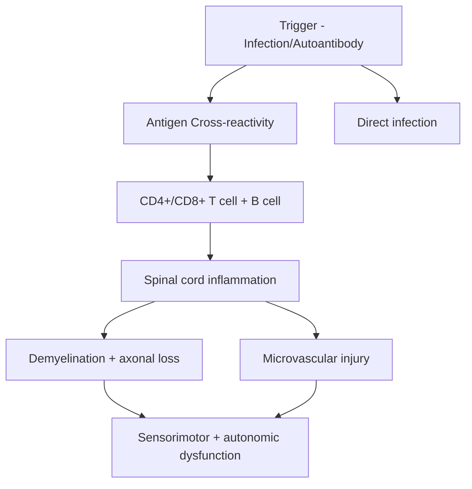

# Transverse Myelitis (TM)

Related: [[Multiple Sclerosis]], [[NMOSD]], [[MOGAD]], [[Spinal Cord Compression]], [[Infectious Myelitis]]

> [!tip] **High-Yield**
> TM is **inflammation of the spinal cord** causing motor, sensory, and autonomic dysfunction. **Sensory level** is the cardinal sign. **Aetiology determines prognosis and treatment**: idiopathic, MS, **NMOSD (AQP4-IgG, longitudinally extensive ≥3 vertebral segments LETM)**, **MOGAD (anti-MOG, conus + LETM)**, post-infectious, paraneoplastic, systemic autoimmune (SLE, Sjögren, Behçet, sarcoidosis). **MRI + CSF + serum antibodies (AQP4, MOG)** are mandatory. **High-dose IV methylprednisolone 1g ×3-5d** is first-line; **PLEX** for severe/refractory.

## 1. Definition / Epidemiology / Classification

### Definition
Inflammatory disorder of the spinal cord causing bilateral motor, sensory, and autonomic dysfunction below a defined sensory level. Acute (hours-days) or subacute (days-weeks).

### Epidemiology
- **Incidence:** 1-8/1,000,000/year
- **Bimodal:** 10-19 yr and 30-39 yr
- **All ages**, both sexes
- **Idiopathic** accounts for ~30-50%; rest = secondary (MS, NMOSD, MOGAD, systemic, infection)

### Classification
| Type | Features |
|------|----------|
| **Acute complete TM (ATM)** | Severe motor + sensory + autonomic; symmetric, well-defined level |
| **Partial TM** | Asymmetric, incomplete; often MS-associated |
| **Longitudinally Extensive TM (LETM)** | Lesion ≥3 contiguous vertebral segments — **NMOSD, MOGAD, sarcoidosis** |
| **Short TM** | <1 vertebral segment — typical MS |
| **Idiopathic TM** | After exclusion of secondary causes |
| **Post-infectious / post-vaccination** | ADEM-like |

## 2. Pathophysiology

### Molecular / Antibodies
- **AQP4-IgG** (NMOSD) — aquaporin-4 astrocytopathy
- **MOG-IgG** (MOGAD) — myelin oligodendrocyte glycoprotein
- **Anti-GFAP** (meningoencephalomyelitis) — autoimmune GFAP astrocytopathy
- **ANA, dsDNA, anti-SSA/SSB, ANCA** — systemic autoimmune
- **Paraneoplastic:** anti-Hu, anti-CRMP5, anti-amphiphysin

## 3. Clinical Features

### Cardinal
- **Bilateral motor:** Weakness, increased tone, hyperreflexia (UMN) below level; flaccid initially
- **Bilateral sensory:** Paraesthesia, numbness, pain — **sensory level** on trunk
- **Autonomic:** Bladder (retention > incontinence), bowel (constipation), sexual dysfunction

### Specific Patterns
- **Cervical:** Quadriparesis, respiratory failure (high C3-5), diaphragm weakness
- **Thoracic:** Paraparesis, sensory level on trunk, sphincter dysfunction
- **Lumbar:** Lower limb weakness, early sphincter
- **Conus medullaris:** Saddle anaesthesia, sphincter, mixed UMN/LMN
- **LET M (NMOSD/MOGAD):** Severe, often painful tonic spasms, optic neuritis (separate)

### Associated Symptoms
- **Lhermitte's sign** (cervical)
- **Radicular pain** at level
- **Tonic spasms** (NMOSD)
- **Fever, malaise** (post-infectious)

## 4. Diagnostic Approach

### Diagnostic Criteria (TMCWG 2002)
**Inclusion:** Bilateral sensory/motor/autonomic dysfunction + sensory level + neurogenic bladder
**Exclusion:** Compressive, radiation, vascular (anterior spinal artery), metabolic, neoplastic

### Aetiology Workup
1. **MRI whole spine + brain** (gadolinium) — exclude cord compression; lesion pattern (length, location, enhancement)
2. **CSF:** cells, protein, OCB, viral PCR, ACE
3. **Serum:** AQP4-IgG, MOG-IgG, ANA, ENA, ANCA, ACE, paraneoplastic (anti-Hu, CRMP5)
4. **Infection screen:** Viral (HSV, VZV, EBV, CMV, HIV, enterovirus, West Nile, Zika), bacterial, TB, Lyme, Mycoplasma, syphilis
5. **Systemic:** CXR, HRCT chest (sarcoid), CT CAP (paraneoplastic), Schirmer test, salivary gland biopsy (Sjögren)
6. **OCT** (optic nerve — NMOSD/MOGAD)

## 5. Investigations

| Test | Indication | Finding |
|------|------------|---------|
| **MRI spine (T2, STIR, T1+Gd)** | All | Central hyperintensity; LETM (≥3 segments) NMOSD; short (1-2 segments) MS; conus MOGAD |
| **MRI brain** | All | Demyelination (MS), NMO, ADEM, sarcoid |
| **CSF** | All | ↑WCC (lymphocytes), ↑protein, OCB (MS), specific PCR |
| **AQP4-IgG (serum)** | All | Positive = NMOSD (CBA most specific) |
| **MOG-IgG (serum)** | All | Positive = MOGAD |
| **ANA, ENA, ANCA** | Systemic | Connective tissue disease |
| **ACE, IL-2R** | Sarcoidosis | ↑ |
| **Viral PCR** | CSF | HSV, VZV, EBV, CMV, enterovirus |
| **Anti-Hu, CRMP5, amphiphysin** | Paraneoplastic | Lung, breast, lymphoma |
| **Ophthalmology/OCT** | Visual symptoms | Optic neuritis |

## 6. Differential Diagnosis
| Differential | Distinguishing | Test |
|--------------|----------------|------|
| **Spinal cord compression** | Trauma, metastasis, abscess; no fever; MRI diagnostic | MRI |
| **Spinal cord infarct (ASA)** | Sudden onset, pain, anterior 2/3, T4-level, no inflammatory CSF | MRI DWI, CSF |
| **MS** | Partial, asymmetric, short lesion, brain lesions | MRI, OCB |
| **NMOSD** | LETM, optic neuritis, area postrema syndrome | AQP4-IgG |
| **MOGAD** | LETM, conus, ADEM-like, optic neuritis | MOG-IgG |
| **ADEM** | Post-infectious, encephalopathy, multifocal | MRI brain, MOG |
| **SLE/Sjögren myelitis** | Vasculitis, LETM | ANA, anti-SSA |
| **Sarcoidosis** | LETM, leptomeningeal enhancement | ACE, HRCT, biopsy |
| **Behçet's** | Oral/genital ulcers, uveitis | Pathergy test |
| **Paraneoplastic** | Older, subacute, pain | Anti-Hu, CT CAP |
| **Infectious (viral, TB, Lyme)** | Fever, travel, immune status | PCR, serology |
| **B12 deficiency** | Dorsal column + lateral corticospinal, macrocytosis | B12, MMA |
| **HTLV-1** | Slowly progressive, spastic | HTLV-1 serology |
| **NMO spectrum** | AQP4-IgG | AQP4-IgG |

## 7. Management

### Acute (All Types)
| Agent | Dose | Duration |
|-------|------|----------|
| **Methylprednisolone IV** | **1 g/day** | **3-5 days** |
| → **Prednisolone PO taper** | 1 mg/kg → taper | 4-8 weeks |

- **PLEX (5-7 exchanges over 1-2 weeks)** — if no response to steroids at day 5-7, severe (NMOSD, severe ATM)
- **IVIG 2 g/kg** — alternative if PLEX unavailable, refractory

### Disease-Specific
| Condition | First-line | Maintenance |
|-----------|-----------|-------------|
| **MS** | Steroids | DMT (interferon, glatiramer, ocrelizumab, etc.) |
| **NMOSD (AQP4-IgG)** | Steroids + PLEX | **Rituximab** (anti-CD20) first-line; eculizumab, satralizumab, tocilizumab |
| **MOGAD** | Steroids (often good response) | Steroid taper over 3-6 months; consider azathioprine, MMF, rituximab |
| **SLE/Sjögren** | Steroids + cyclophosphamide/MMF | MMF, azathioprine, rituximab |
| **Sarcoidosis** | Steroids + methotrexate/MTX/infliximab | Methotrexate, azathioprine, infliximab |
| **Behçet's** | Steroids + azathioprine/colchicine | Azathioprine, anti-TNF |
| **Paraneoplastic** | Treat tumour + immunotherapy | — |
| **Infectious** | Acyclovir (HSV/VZV), antibiotics, anti-TB | — |

### Supportive
- **DVT prophylaxis** (LMWH, stockings) — immobile patients
- **Bladder:** Intermittent catheterisation; **urinary retention** common (post-void residual)
- **Bowel:** Laxatives, suppositories, enemas
- **Pressure area care** — 2-hourly turns
- **Physiotherapy, OT** — early mobilisation
- **Respiratory** (cervical): Spirometry, FVC, consider NIV/intubation
- **Spasticity:** Baclofen, tizanidine, gabapentin
- **Pain:** Gabapentinoids, amitriptyline, duloxetine
- **Psychological support**

## 8. Drug Cautions
| Drug | Caution |
|------|---------|
| **Methylprednisolone** | Glucose, BP, mood, infection, GI (PPI cover) |
| **PLEX** | Bleeding, hypocalcaemia, infection, hypovolaemia |
| **Rituximab** | HBV reactivation, PML, infusion reactions |
| **Eculizumab** | Meningococcal vaccination, PJP prophylaxis |
| **Cyclophosphamide** | Haemorrhagic cystitis, marrow, fertility |
| **Azathioprine** | Marrow, hepatic; check TPMT |

## 9. Procedures
- **Lumbar puncture** — after MRI (exclude mass lesion/raised ICP)
- **Diagnostic LP with manometry** — CSF pressure
- **Plasma exchange** — central line

## 10. Complications
| Complication | Frequency | Management |
|--------------|-----------|-----------|
| **Permanent weakness** | 30-50% | PT, mobility aids |
| **Bladder dysfunction** | 50% (chronic) | Intermittent self-catheterisation |
| **Spasticity** | 40-60% | Baclofen, tizanidine, gabapentin |
| **Pressure sores** | Variable | 2-hourly turns, pressure mattress |
| **DVT/PE** | High | LMWH prophylaxis |
| **Respiratory failure** | Cervical | FVC monitoring, NIV |
| **Chronic pain** | 30-50% | Gabapentinoids, TCAs |
| **Sexual dysfunction** | Common | Counselling, PDE5-i |
| **Relapse (NMOSD)** | 60-90% if untreated | Maintenance immunosuppression |

## 11. Red Flags
| Red Flag | Action |
|----------|--------|
| **Progressive despite steroids at 5-7d** | **PLEX** |
| **Cervical lesion with respiratory failure** | ICU, FVC monitoring, intubation |
| **Severe bladder retention** | Catheterisation; urology if chronic |
| **Optic neuritis (separate episode)** | AQP4-IgG, MOG-IgG (NMOSD/MOGAD) |
| **Recurrent TM** | AQP4-IgG, MOG-IgG (often negative initially; repeat) |
| **Painful tonic spasms** | NMOSD — AQP4-IgG |
| **Conus medullaris syndrome** | MOGAD |
| **Fever, immunocompromised** | Infectious cause — broad antimicrobial |

## 12. Prognosis
| Factor | Good | Poor |
|--------|------|------|
| **Aetiology** | Post-infectious, MOGAD | NMOSD, paraneoplastic |
| **Severity** | Mild | Severe (wheelchair) |
| **MRI** | Short lesion, no necrosis | LETM with cavitation, atrophy |
| **Response** | Rapid steroid response | Steroid-refractory |
| **Antibody** | MOG-IgG | AQP4-IgG (relapse) |

- **Idiopathic:** 50-70% recover ambulation
- **MS-associated:** Variable; many recover
- **NMOSD:** Worse outcome; 30% permanent disability
- **MOGAD:** Better recovery but monophasic or relapsing
- **Paraneoplastic:** Depends on tumour

## 13. Topic Correlation
| Topic | Link | Overlap |
|-------|------|---------|
| **MS** | [[Multiple Sclerosis]] | Partial TM, short lesions, OCB |
| **NMOSD** | [[NMOSD]] | LETM, AQP4-IgG, optic neuritis |
| **MOGAD** | [[MOGAD]] | Conus, LETM, ADEM-like |
| **Spinal cord compression** | [[Spinal Cord Compression]] | Surgical emergency to exclude |
| **Infectious myelitis** | [[Infectious Myelitis]] | Viral, TB, Lyme, Mycoplasma |

## 14. Special Situations
| Situation | Consideration |
|-----------|---------------|
| **Pregnancy** | NMOSD risk postpartum; AQP4-IgG; rituximab caution; IVIG, eculizumab safer |
| **Paediatric** | ADEM common, MOG-IgG often +ve; outcomes better |
| **Elderly** | Less likely MS, more likely paraneoplastic, vascular, NMOSD |
| **Immunocompromised** | CMV, HSV, VZV, HIV, PML, TB; aggressive workup |
| **Post-vaccination** | Rare; mostly yellow fever, influenza; usually self-limiting |
| **DVLA** | Permanent disability may require report |
| **Occupational** | Mobility, bladder, sexual dysfunction — work capacity assessment |

## FCPS/MRCP High-Yield Summary
| Category | Key Points |
|----------|------------|
| **Definition** | Inflammation of spinal cord; sensory level + motor + autonomic |
| **Epidemiology** | 1-8/1M/yr; bimodal; idiopathic 30-50% |
| **Pathophysiology** | CD4+/CD8+ T cell + B cell, demyelination, axonal loss |
| **Clinical** | Bilateral sensorimotor + autonomic below level; bladder retention common |
| **Aetiology** | Idiopathic, MS, NMOSD (AQP4), MOGAD (MOG), systemic, post-infectious, paraneoplastic |
| **Diagnosis** | MRI (LETM, short), CSF, AQP4-IgG, MOG-IgG, exclude compression |
| **LETM ≥3 segments** | NMOSD, MOGAD, sarcoid, paraneoplastic |
| **Treatment** | **IV methylprednisolone 1g ×3-5d**; PLEX if severe/refractory; treat cause |
| **NMOSD** | Rituximab maintenance; relapse prevention critical |
| **MOGAD** | Often monophasic; better recovery; steroids 3-6 mo |
| **Complications** | Spasticity, bladder, pressure sores, DVT, chronic pain |
| **Viva** | "Sensory level"; "AQP4-IgG = NMOSD"; "MOG = conus + optic neuritis"; "PLEX for steroid-refractory" |

## Viva Questions
1. **Q:** What is the diagnostic hallmark of transverse myelitis?
   **A:** **Sensory level** on the trunk (bilateral) with motor and autonomic dysfunction below — indicates spinal cord segmental involvement.
2. **Q:** What is LETM and what does it suggest?
   **A:** **Longitudinally Extensive Transverse Myelitis** = lesion ≥3 contiguous vertebral segments. Suggests **NMOSD (AQP4-IgG)**, MOGAD, sarcoidosis, paraneoplastic — not typical MS.
3. **Q:** First-line treatment of transverse myelitis?
   **A:** **IV methylprednisolone 1 g/day for 3-5 days**, followed by oral prednisolone taper. **PLEX (5-7 exchanges)** if no response at day 5-7 or severe (especially NMOSD).
4. **Q:** How does NMOSD differ from MS?
   **A:** **NMOSD:** LETM (≥3 segments), optic neuritis (often bilateral), area postrema syndrome, AQP4-IgG+, more severe attacks, **NO brain lesions typical of MS**. **MS:** short lesions, partial TM, brain periventricular/juxtacortical, OCB+.
5. **Q:** What is MOGAD?
   **A:** **MOG-IgG-associated disease** — distinct from MS and NMOSD. Conus involvement, LETM, optic neuritis (often bilateral), ADEM-like presentation (children), brainstem involvement, often monophasic. Better recovery than NMOSD.
6. **Q:** When is PLEX indicated in TM?
   **A:** **Severe** (wheelchair-bound, respiratory), **no response to steroids at day 5-7**, **NMOSD attack** (early PLEX improves outcome). 5-7 exchanges over 1-2 weeks.
7. **Q:** How do you prevent NMOSD relapses?
   **A:** **Rituximab** (anti-CD20) is first-line. Alternatives: eculizumab (anti-C5), satralizumab (anti-IL-6R), tocilizumab, mycophenolate, azathioprine. **Avoid** IFNβ, fingolimod (worsen).
8. **Q:** What is area postrema syndrome?
   **A:** **Intractable hiccups, nausea, vomiting** (>48h, unexplained) — characteristic of NMOSD, due to AQP4 expression in area postrema of dorsal medulla.
9. **Q:** How do you differentiate spinal cord compression from TM?
   **A:** **Compression:** trauma, metastasis, abscess; no fever; MRI diagnostic; surgical emergency. **TM:** inflammatory, often post-infectious; MRI contrast + CSF inflammatory.
10. **Q:** What bladder management is needed in TM?
    **A:** **Intermittent self-catheterisation** (post-void residual monitoring); anticholinergics for overactive bladder (oxybutynin); urology referral for chronic retention.

## Common Confusions
| Confusion | Clarification |
|-----------|---------------|
| TM vs MS | TM is clinical syndrome (inflammation of cord); MS is aetiology of partial TM with brain lesions |
| NMOSD vs MS | NMOSD: LETM, AQP4-IgG, optic neuritis; MS: short lesions, brain lesions, OCB |
| MOGAD vs NMOSD | MOGAD: MOG-IgG, conus, often monophasic, better recovery; NMOSD: AQP4-IgG, worse prognosis, relapsing |
| LETM causes | NMOSD, MOGAD, sarcoidosis, paraneoplastic, infectious (TB, viral), SLE |
| AQP4-IgG test | Cell-based assay (CBA) most specific; serum > CSF; can be negative initially (repeat) |
| PLEX timing | Early PLEX (within days) improves outcomes in NMOSD/severe TM |
| Steroid taper | Slow taper in MOGAD (3-6 mo) reduces relapse risk |

## Mnemonics
1. **M-S-LA-D-SA** — aetiology: **M**S, **S**ystemic, **L**ongitudinal (NMOSD/MOG), **A**utoimmune, **D**rug/vaccine, **S**arcoid, **A**cute disseminated
2. **AQP4 = Aqua-4-sides** — optic neuritis, area postrema, acute myelitis, brain
3. **MOG = My-Optic-Good** — optic neuritis (often bilateral), good recovery, conus
4. **LETM ≥3 = Not MS** — think NMOSD/MOGAD/sarcoid

## One-Page Revision Card
| Topic | Transverse Myelitis |
|-------|---------------------|
| **Definition** | Inflammation of spinal cord — sensory level + motor + autonomic |
| **Key Clinical** | Bilateral sensorimotor + autonomic below level; bladder retention; Lhermitte's |
| **Aetiology** | Idiopathic, MS, NMOSD (AQP4), MOGAD (MOG), systemic, post-infectious, paraneoplastic |
| **Diagnosis** | MRI (LETM ≥3 vs short), CSF, AQP4-IgG, MOG-IgG, exclude compression |
| **Treatment** | **IV methylprednisolone 1g ×3-5d**; PLEX if severe/refractory; treat cause |
| **NMOSD** | LETM, optic neuritis, area postrema, AQP4-IgG; rituximab maintenance |
| **MOGAD** | Conus, LETM, optic neuritis, ADEM-like; better recovery; steroids 3-6 mo |
| **Complications** | Spasticity, bladder, pressure sores, DVT, chronic pain |
| **Viva** | "Sensory level"; "AQP4 = NMOSD"; "PLEX for steroid-refractory" |

## Must Know / Should Know
- [ ] **Must:** Sensory level, IV methylprednisolone, AQP4/MOG, exclude compression
- [ ] **Should:** LETM, NMOSD vs MS, MOGAD, PLEX, rituximab
- [ ] **Nice:** Area postrema syndrome, ADEM, sarcoidosis myelitis, GFAP astrocytopathy

## MCQs (10)

1. **Question:** The cardinal clinical hallmark of transverse myelitis is:
   **Options:** A. Hyperreflexia B. Sensory level on the trunk C. Bladder dysfunction D. Pain
   **Answer:** B
   **Explanation:** **Sensory level** on the trunk (bilateral) is the diagnostic hallmark of TM, indicating the spinal cord segment involved. Motor and autonomic dysfunction occur below this level.

2. **Question:** What is the first-line treatment of acute transverse myelitis?
   **Options:** A. IVIG B. IV methylprednisolone 1 g/day ×3-5 days C. Cyclophosphamide D. Plasma exchange
   **Answer:** B
   **Explanation:** **IV methylprednisolone 1 g/day for 3-5 days** is first-line, followed by oral prednisolone taper. PLEX is added if no response or severe (especially NMOSD).

3. **Question:** A longitudinally extensive transverse myelitis (LETM) of ≥3 vertebral segments is most characteristic of:
   **Options:** A. Multiple sclerosis B. NMOSD (AQP4-IgG) C. Vascular malformation D. Disc herniation
   **Answer:** B
   **Explanation:** LETM (≥3 segments) is characteristic of **NMOSD (AQP4-IgG)**, also seen in MOGAD, sarcoidosis, paraneoplastic. MS typically causes short (1-2 segment) lesions.

4. **Question:** Which antibody is associated with MOG antibody disease (MOGAD)?
   **Options:** A. Anti-AQP4 B. Anti-MOG C. Anti-NMDA D. Anti-GFAP
   **Answer:** B
   **Explanation:** **Anti-MOG (myelin oligodendrocyte glycoprotein)** is the antibody in MOGAD. Anti-AQP4 = NMOSD. Anti-NMDA = encephalitis. Anti-GFAP = autoimmune GFAP astrocytopathy.

5. **Question:** What is the most common bladder problem in acute TM?
   **Options:** A. Incontinence B. Retention C. Frequency D. UTI
   **Answer:** B
   **Explanation:** **Urinary retention** is the most common bladder issue (spinal shock); requires intermittent catheterisation. Incontinence may develop later (UMN bladder).

6. **Question:** When is plasma exchange indicated in TM?
   **Options:** A. First-line for all B. After 5-7 days without steroid response, or severe NMOSD C. Only for MOGAD D. Only if contraindicated to steroids
   **Answer:** B
   **Explanation:** **PLEX** is indicated after 5-7 days without steroid response, severe attacks (especially NMOSD), or as adjunct to steroids in severe cases. 5-7 exchanges over 1-2 weeks.

7. **Question:** Which feature distinguishes NMOSD from MS on MRI spine?
   **Options:** A. MS has LETM, NMOSD has short lesions B. MS has short lesions, NMOSD has LETM C. Both identical D. NMOSD has no lesions
   **Answer:** B
   **Explanation:** **MS:** short (1-2 segment), partial, peripheral cord lesions, brain lesions. **NMOSD:** LETM (≥3 segments), central cord, often necrotic. Brain typically normal in NMOSD (vs MS).

8. **Question:** Area postrema syndrome in NMOSD presents with:
   **Options:** A. Visual loss B. Intractable hiccups, nausea, vomiting C. Seizures D. Hemiparesis
   **Answer:** B
   **Explanation:** **Area postrema syndrome** = intractable hiccups, nausea, vomiting (>48h, unexplained) — characteristic of NMOSD due to AQP4 expression in dorsal medulla. Often misdiagnosed as GI disease.

9. **Question:** First-line maintenance therapy for NMOSD to prevent relapses is:
   **Options:** A. Interferon-beta B. Glatiramer acetate C. Rituximab D. Methotrexate
   **Answer:** C
   **Explanation:** **Rituximab** (anti-CD20) is first-line maintenance for NMOSD. Alternatives: eculizumab, satralizumab, tocilizumab, mycophenolate, azathioprine. **Avoid IFN-β, fingolimod** (worsen NMOSD).

10. **Question:** MOGAD often involves which part of the spinal cord?
    **Options:** A. Cervical B. Thoracic C. Conus medullaris D. Diffuse
    **Answer:** C
    **Explanation:** **Conus medullaris** is classically involved in MOGAD (along with LETM and optic neuritis). Distinguishing feature from NMOSD and MS.

## SBA Questions (10)

1. **Scenario:** 35-year-old woman with 2-week history of bilateral leg weakness, sensory level at T6, urinary retention. MRI shows LETM T2-T9. CSF: 30 lymphocytes, protein 0.8. AQP4-IgG +ve. What is the diagnosis?
   **Options:** A. Multiple sclerosis B. NMOSD C. MOGAD D. Idiopathic TM
   **Answer:** B
   **Explanation:** LETM + AQP4-IgG +ve = **NMOSD**. Treatment: IV methylprednisolone 1g ×3-5d + early PLEX + maintenance rituximab.

2. **Scenario:** 8-year-old boy with fever, encephalopathy, bilateral optic neuritis, and LETM. MRI brain shows bilateral thalamic lesions. Anti-MOG +ve. What is the diagnosis?
   **Options:** A. NMOSD B. ADEM (MOGAD) C. MS D. Viral encephalitis
   **Answer:** B
   **Explanation:** Acute disseminated encephalomyelitis (ADEM) with MOG-IgG — MOGAD spectrum. Children with ADEM, optic neuritis, LETM, brainstem, deep grey matter lesions.

3. **Scenario:** 30-year-old woman with TM. No response to 5 days of IV methylprednisolone. NMOSD suspected. What is the next step?
   **Options:** A. Continue steroids for 2 more days B. Plasma exchange (5-7 exchanges) C. Add cyclophosphamide D. Add methotrexate
   **Answer:** B
   **Explanation:** Steroid-refractory TM (especially NMOSD): **PLEX** (5-7 exchanges over 1-2 weeks) is indicated. Early PLEX improves outcomes.

4. **Scenario:** 25-year-old man with TM, 1-year follow-up. Diagnosed NMOSD, AQP4-IgG +. What maintenance therapy is most appropriate?
   **Options:** A. Interferon-beta B. Glatiramer acetate C. Rituximab D. No treatment needed
   **Answer:** C
   **Explanation:** **Rituximab** (anti-CD20) is first-line maintenance for NMOSD to prevent relapses. Relapse rate is 60-90% if untreated. Avoid IFNβ, fingolimod (worsen NMOSD).

5. **Scenario:** 40-year-old man with TM, Behçet's disease (oral/genital ulcers, uveitis). MRI shows LETM. What is the most appropriate long-term treatment?
   **Options:** A. Rituximab B. Azathioprine + colchicine C. Methotrexate D. Cyclophosphamide
   **Answer:** B
   **Explanation:** Behçet's myelitis: **azathioprine + colchicine** for long-term immunosuppression. Cyclophosphamide for severe acute. Interferon-α or anti-TNF for refractory.

6. **Scenario:** 50-year-old man with TM, MRI LETM, AQP4-IgG -ve, MOG-IgG -ve. ANA +ve, anti-SSA +ve, dry eyes, dry mouth. What is the most likely diagnosis?
   **Options:** A. Sjögren-associated myelitis B. NMOSD C. MS D. Idiopathic TM
   **Answer:** A
   **Explanation:** Sjögren's can cause LETM (vasculitis). Negative AQP4/MOG but positive ANA/SSA, sicca symptoms. Treatment: steroids + cyclophosphamide/MMF for severe disease.

7. **Scenario:** 30-year-old man with TM, fever, recent diarrhoeal illness, MRI LETM. CSF: 50 lymphocytes, protein 1.0, viral PCR -ve. What is the most appropriate initial treatment?
   **Options:** A. Acyclovir B. IV methylprednisolone + consider acyclovir empirically C. Cyclophosphamide D. PLEX
   **Answer:** B
   **Explanation:** Post-infectious TM: IV methylprednisolone 1g ×3-5d. Empiric acyclovir if viral suspected. Antibiotics if bacterial suspected. PLEX if severe/refractory.

8. **Scenario:** 28-year-old woman with TM, NMOSD, AQP4-IgG +ve. 6 months post-treatment, off immunosuppression. What is the relapse risk?
   **Options:** A. 5% B. 25% C. 60-90% D. 100%
   **Answer:** C
   **Explanation:** Untreated NMOSD has **60-90% relapse risk**. Maintenance immunosuppression (rituximab, eculizumab, satralizumab) is essential. Even on treatment, relapses can occur.

9. **Scenario:** 35-year-old man with TM, MRI LETM, AQP4-IgG +ve, MOG-IgG -ve. On rituximab. What clinical feature would suggest relapse?
   **Options:** A. Headache B. Painful tonic spasms, new optic neuritis C. Urinary retention only D. Mild sensory symptoms
   **Answer:** B
   **Explanation:** **Painful tonic spasms** (5-30s of intense limb pain/contracture) and **optic neuritis** are characteristic NMOSD relapses. New sensory or motor symptoms should also prompt evaluation.

10. **Scenario:** 40-year-old woman with TM, MOG-IgG +ve, conus involvement, optic neuritis. What is the expected response to steroids?
    **Options:** A. Refractory B. Often good response, but relapses common if steroids tapered quickly C. No response D. Permanent disability
    **Answer:** B
    **Explanation:** **MOGAD** typically has good acute response to steroids, but **relapses are common if steroids tapered too quickly** (3-6 month taper recommended). Maintenance may be needed for relapsing disease.

## Flashcards
- **Q:** Hallmark of TM? **A:** Sensory level on trunk (bilateral)
- **Q:** LETM ≥3 segments suggests? **A:** NMOSD, MOGAD, sarcoidosis, paraneoplastic
- **Q:** First-line treatment of TM? **A:** IV methylprednisolone 1g ×3-5d
- **Q:** PLEX indication? **A:** Steroid-refractory at 5-7d, severe NMOSD
- **Q:** AQP4-IgG = ? **A:** NMOSD
- **Q:** MOG-IgG = ? **A:** MOGAD (conus, optic neuritis, ADEM)
- **Q:** NMOSD maintenance? **A:** Rituximab (anti-CD20) first-line
- **Q:** Area postrema syndrome? **A:** Intractable hiccups, nausea, vomiting
- **Q:** MS vs NMOSD MRI spine? **A:** MS: short (1-2 seg); NMOSD: LETM (≥3 seg)
- **Q:** NMOSD avoided drugs? **A:** IFNβ, fingolimod (worsen)

## Answer Key

### MCQs
1. **B** — Sensory level on trunk
2. **B** — IV methylprednisolone 1g ×3-5d
3. **B** — LETM = NMOSD (AQP4)
4. **B** — Anti-MOG = MOGAD
5. **B** — Urinary retention in acute TM
6. **B** — PLEX for steroid-refractory/severe NMOSD
7. **B** — MS: short; NMOSD: LETM
8. **B** — Area postrema = NMOSD
9. **C** — Rituximab maintenance
10. **C** — Conus = MOGAD

### SBAs
1. **B** — LETM + AQP4 = NMOSD
2. **B** — MOG-IgG + ADEM features = MOGAD
3. **B** — PLEX for steroid-refractory
4. **C** — Rituximab maintenance
5. **B** — Behçet's = azathioprine + colchicine
6. **A** — Sjögren's LETM
7. **B** — Steroids ± acyclovir empirically
8. **C** — 60-90% relapse if untreated
9. **B** — Painful tonic spasms = NMOSD relapse
10. **B** — MOGAD = good response, slow taper

## Local Navigation
**Topic Hub:** [[Spinal Cord Disorders Hub]]  
**Chapter MOC:** [[Neurology MOC]]  
**Related Topics:** [[Multiple Sclerosis]], [[NMOSD]], [[MOGAD]], [[Spinal Cord Compression]], [[Infectious Myelitis]]
