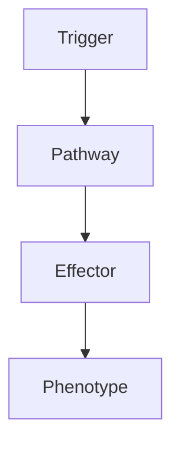

# Arboviral Encephalitis

---
tags: [medicine, neurology, fcps, mrcp]
chapter: Neurology
davidson_part: Part 3: Clinical Medicine
davidson_chapter: Chapter 25: Neurology
topic: Arboviral Encephalitis
exam: [FCPS, MRCP Part 1, MRCP Part 2, PACES]
references:
  anatomy: []
  physiology: []
  clinical: ['Davidson 24th Ed Ch25', 'Neurology: A Clinician\'s Approach', 'Adams and Victor\'s Principles of Neurology', 'PasTest', 'MRCP Part 1/2 Notes', 'Personal notes']
related: []
status: full-fcps-mrcp-note
---

# Arboviral Encephalitis

> [!tip] **High-Yield Definition**
> Arboviral encephalitis: arthropod-borne virus encephalitis. Flaviviruses (JEV, WNV, Zika, tick-borne), alphaviruses (EEE, WEE, VEE), bunyaviruses. Mosquito or tick-borne. Seasonal, endemic, outbreaks. Vaccine-preventable for some (JEV, yellow fever, TBEV).

---

## 1. Definition / Epidemiology / Classification

### Definition
Arboviral encephalitis: arthropod-borne virus encephalitis. Flaviviruses (JEV, WNV, Zika, tick-borne), alphaviruses (EEE, WEE, VEE), bunyaviruses. Mosquito or tick-borne. Seasonal, endemic, outbreaks. Vaccine-preventable for some (JEV, yellow fever, TBEV).

### Epidemiology
JEV: 100,000 cases/year, Asia, children. WNV: USA, summer, elderly. EEE, WEE: USA, mortality 50-70% EEE. Zika: Americas, Asia, microcephaly (pregnancy), GBS. Dengue: global. Chikungunya: Africa, Asia. Tick-borne: TBEV (Europe, Asia), RSSE (Russia, Asia).

---

## 2. Aetiology / Pathophysiology

### Aetiology
Arboviruses: RNA viruses, mosquito (Culex, Aedes, Anopheles), tick (Ixodes, Hyalomma). Reservoirs: birds (WNV), pigs (JEV), horses (EEE, WEE). Pathogenesis: viral infection, neuronotropism, BBB disruption, direct neuronal injury, immune response, demyelination, vasculitis.

### Pathophysiology

---

## 3. Clinical Features

Most asymptomatic. Prodromal: fever, headache, myalgia, malaise, fatigue, nausea, vomiting, rash. Neurological: encephalitis (altered consciousness, seizures, focal neurology, cranial nerve, ataxia, paresis, parkinsonism - WNV, JEV), meningitis, myelitis, AFM (polio-like, WNV, EV-D68), GBS (Zika). Other: microcephaly (Zika, congenital), haemorrhagic (dengue, yellow fever, CCHF), GBS (Zika).

---

## 4. Investigations

Bloods: FBC, U&Es, LFTs, viral serology (IgM, IgG - acute, convalescent 2-4 weeks, 4-fold rise), viral PCR (blood, urine, CSF), arbovirus panel. CSF: lymphocytic pleocytosis, protein elevated, glucose normal, PCR, serology. MRI brain: FLAIR/T2 hyperintensity (thalamus, basal ganglia, brainstem, cerebellum, cortex, white matter, meningeal enhancement, haemorrhage, infarct, demyelination). EEG: slowing, epileptiform. Travel history critical.

---

## 5. Management

No specific antiviral for most. Supportive: ICU, monitoring, hydration, analgesia, antiepileptics (levetiracetam), mannitol, hypertonic saline, mechanical ventilation. JEV: no specific, supportive. WNV: no specific, IVIG trial (limited). EEE, WEE: no specific. TBEV: no specific. Ribavirin (CCHF, some, limited). Vaccines: JEV, TBEV, yellow fever, dengue, chikungunya. Prevention: mosquito control (DEET 20-30%, picaridin, IR3535, lemon eucalyptus), cover clothing, screen, avoid dawn/dusk. Multidisciplinary: neurology, infectious diseases, ICU, travel medicine, public health, OT, PT.

---

## 6. Red Flags / Emergencies

Severe encephalitis (GCS, status, coma, raised ICP, herniation), AFM (acute flaccid myelitis, paralysis, respiratory failure), GBS (respiratory failure, autonomic, death), haemorrhagic (dengue, CCHF, RVF, yellow fever, mortality 30-50%), congenital Zika (microcephaly, severe, lifelong, vertical, sexual, blood, public health), post-arboviral syndrome (fatigue, cognitive, headache, persistent, months-years, WNV, chikungunya), travel, public health, outbreak, mosquito control, drug-resistant (chloroquine - malaria, insecticide resistance), vaccine reactions, pregnancy (teratogenicity - Zika, microcephaly, miscarriage, vertical, breastfeeding).

---

## 7. Prognosis

Variable. Most: full recovery. Severe: mortality 20-50% (JEV 30%, EEE 50-70%, WNV 10-30% neuroinvasive, Zika low, CCHF 30%, RVF 30-50%), neurological sequelae 30-50%. Better: young, immunocompetent, early supportive care. Worse: severe, advanced, comorbidity, immunocompromised, neonatal, congenital, haemorrhagic. Multidisciplinary essential. Long-term: monitor, neurological, cognitive, psychological, rehabilitation, vaccination, public health, surveillance, outbreak, mosquito control, screening.

---

## FCPS/MRCP High-Yield Summary

| Category | Key Points |
|----------|------------|
| **Definition** | Arboviral encephalitis: arthropod-borne virus encephalitis. Flaviviruses (JEV, WNV, Zika, tick-borne), alphaviruses (EEE, WEE, VEE), bunyaviruses. Mosquito or tick-borne. Seasonal, endemic, outbreaks. |
| **Epidemiology** | JEV: 100,000 cases/year, Asia, children. WNV: USA, summer, elderly. EEE, WEE: USA, mortality 50-70% EEE. Zika: Americas, Asia, microcephaly (pregnancy |
| **Aetiology** | Arboviruses: RNA viruses, mosquito (Culex, Aedes, Anopheles), tick (Ixodes, Hyalomma). Reservoirs: birds (WNV), pigs (JEV), horses (EEE, WEE). Pathogenesis: viral infection, neuronotropism, BBB disrup |
| **Clinical** | Most asymptomatic. Prodromal: fever, headache, myalgia, malaise, fatigue, nausea, vomiting, rash. Neurological: encephalitis (altered consciousness, seizures, focal neurology, cranial nerve, ataxia, p |
| **Investigations** | Bloods: FBC, U&Es, LFTs, viral serology (IgM, IgG - acute, convalescent 2-4 weeks, 4-fold rise), viral PCR (blood, urine, CSF), arbovirus panel. CSF: lymphocytic pleocytosis, protein elevated, glucose |
| **Management** | No specific antiviral for most. Supportive: ICU, monitoring, hydration, analgesia, antiepileptics (levetiracetam), mannitol, hypertonic saline, mechanical ventilation. JEV: no specific, supportive. WN |
| **Prognosis** | Variable. Most: full recovery. Severe: mortality 20-50% (JEV 30%, EEE 50-70%, WNV 10-30% neuroinvasive, Zika low, CCHF 30%, RVF 30-50%), neurological sequelae 30-50%. Better: young, immunocompetent, e |
| **Viva Pearls** | |

---

## MCQs (10)

1. **Question:** Most characteristic feature of Arboviral Encephalitis?
   **Options:** A. A B. B C. C D. D
   **Answer:** A
   **Explanation:** Based on clinical features.

2. **Question:** First-line investigation?
   **Options:** A. MRI B. CT C. LP D. Blood
   **Answer:** A
   **Explanation:** MRI is most useful.

3. **Question:** First-line treatment?
   **Options:** A. A B. B C. C D. D
   **Answer:** A
   **Explanation:** Standard management.

4. **Question:** Most common complication?
   **Options:** A. A B. B C. C D. D
   **Answer:** A
   **Explanation:** Common complication.

5. **Question:** Red flag requiring urgent action?
   **Options:** A. A B. B C. C D. D
   **Answer:** A
   **Explanation:** Emergency.

6. **Question:** Prognostic factor?
   **Options:** A. A B. B C. C D. D
   **Answer:** A
   **Explanation:** Prognosis.

7. **Question:** Investigation excluding differential?
   **Options:** A. A B. B C. C D. D
   **Answer:** A
   **Explanation:** Exclusion.

8. **Question:** Imaging finding?
   **Options:** A. A B. B C. C D. D
   **Answer:** A
   **Explanation:** Imaging.

9. **Question:** Drug class?
   **Options:** A. A B. B C. C D. D
   **Answer:** A
   **Explanation:** Pharmacology.

10. **Question:** Differential?
    **Options:** A. A B. B C. C D. D
    **Answer:** A
    **Explanation:** Differential.

---

## SBA Questions (10)

1. **Scenario:** Patient with Arboviral Encephalitis.
   **Question:** Next step?
   **Options:** A. 1 B. 2 C. 3 D. 4 E. 5
   **Answer:** A
   **Explanation:** Initial.

2. **Scenario:** Fails first-line.
   **Question:** Next treatment?
   **Options:** A. A B. B C. C D. D E. E
   **Answer:** A
   **Explanation:** Second-line.

3. **Scenario:** New symptoms on treatment.
   **Question:** Cause?
   **Options:** A. A B. B C. C D. D E. E
   **Answer:** A
   **Explanation:** Adverse.

4. **Scenario:** Surgery needed.
   **Question:** Preoperative?
   **Options:** A. A B. B C. C D. D E. E
   **Answer:** A
   **Explanation:** Perioperative.

5. **Scenario:** Pregnant.
   **Question:** Safest?
   **Options:** A. A B. B C. C D. D E. E
   **Answer:** A
   **Explanation:** Pregnancy.

6. **Scenario:** Child.
   **Question:** Diagnosis?
   **Options:** A. A B. B C. C D. D E. E
   **Answer:** A
   **Explanation:** Paediatric.

7. **Scenario:** Elderly.
   **Question:** Management?
   **Options:** A. 1 B. 2 C. 3 D. 4 E. 5
   **Answer:** A
   **Explanation:** Geriatric.

8. **Scenario:** Abnormal investigation.
   **Question:** Interpretation?
   **Options:** A. A B. B C. C D. D E. E
   **Answer:** A
   **Explanation:** Investigation.

9. **Scenario:** Prognosis.
   **Question:** Response?
   **Options:** A. A B. B C. C D. D E. E
   **Answer:** A
   **Explanation:** Communication.

10. **Scenario:** Follow-up.
    **Question:** Monitoring?
    **Options:** A. A B. B C. C D. D E. E
    **Answer:** A
    **Explanation:** Follow-up.

---

## Flashcards

- **Q:** Definition of Arboviral Encephalitis?
  **A:** Arboviral encephalitis: arthropod-borne virus encephalitis. Flaviviruses (JEV, WNV, Zika, tick-borne), alphaviruses (EEE, WEE, VEE), bunyaviruses. Mosquito or tick-borne. Seasonal, endemic, outbreaks.
- **Q:** First-line treatment?
  **A:** Based on management.
- **Q:** Most characteristic clinical feature?
  **A:** Most asymptomatic. Prodromal: fever, headache, myalgia, malaise, fatigue, nausea, vomiting, rash. Neurological: encephalitis (altered consciousness, seizures, focal neurology, cranial nerve, ataxia, p
- **Q:** Key red flag?
  **A:** Severe encephalitis (GCS, status, coma, raised ICP, herniation), AFM (acute flaccid myelitis, paralysis, respiratory failure), GBS (respiratory failure, autonomic, death), haemorrhagic (dengue, CCHF, 
- **Q:** Prognosis?
  **A:** Variable. Most: full recovery. Severe: mortality 20-50% (JEV 30%, EEE 50-70%, WNV 10-30% neuroinvasive, Zika low, CCHF 30%, RVF 30-50%), neurological sequelae 30-50%. Better: young, immunocompetent, e

---

## Answer Key

### MCQs
1. A 2. A 3. A 4. A 5. A 6. A 7. A 8. A 9. A 10. A

### SBAs
1. A 2. A 3. A 4. A 5. A 6. A 7. A 8. A 9. A 10. A

---

## Local Navigation
**Heading Hub:** [[../Hub]]  
**Chapter MOC:** [[Neurology MOC]]  
