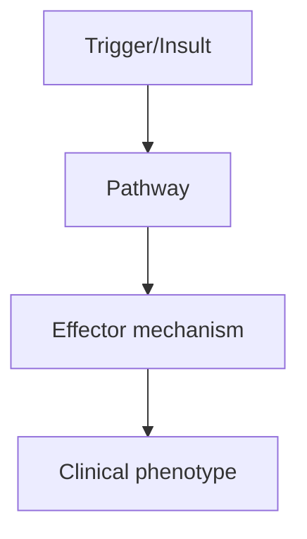
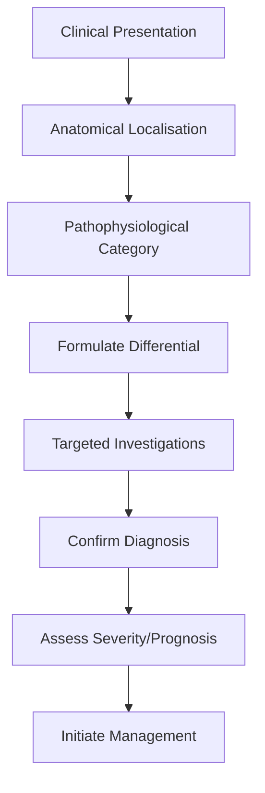
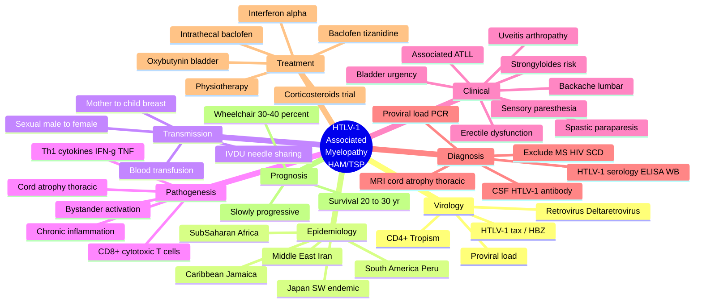

# HTLV-1 Associated Myelopathy

> [!tip] **High-Yield Definition**
> HTLV-1 associated myelopathy/tropical spastic paraparesis (HAM/TSP): chronic progressive spastic paraparesis due to HTLV-1 (human T-lymphotropic virus type 1, retrovirus). Endemic areas (Japan, Caribbean, West Africa, South America, Iran). Adult onset. Slow progression. No curative treatment.

---

## 1. Definition / Epidemiology / Classification

### Definition
HTLV-1 associated myelopathy/tropical spastic paraparesis (HAM/TSP): chronic progressive spastic paraparesis due to HTLV-1 (human T-lymphotropic virus type 1, retrovirus). Endemic areas (Japan, Caribbean, West Africa, South America, Iran). Adult onset. Slow progression. No curative treatment.

### Epidemiology
Prevalence: 20-30 million HTLV-1 carriers worldwide. HAM/TSP: 1-5% of carriers. Endemic: Japan (1-2/100,000), Caribbean, West Africa, South America, Iran, Melanesia. F:M 2-3:1. Adult onset (mean 40-50y). Transmission: breastfeeding, sexual, blood transfusion, IVDU.

### Classification
| Variant | Key Features | Prognosis |
|---------|-------------|-----------|
| | | |

---

## 2. Aetiology / Pathophysiology

### Aetiology
HTLV-1: retrovirus, CD4+ T cell tropism, proviral integration. Endemic: Japan, Caribbean, West Africa, South America, Melanesia, Iran. Transmission: mother-to-child (breastfeeding), sexual (M to F > F to M), blood transfusion, IVDU. Pathogenesis: chronic immune activation, CD8+ T cell response, cytokine release (IFN-gamma, TNF-alpha), bystander damage, HTLV-1 tax and HBZ proteins, immune-mediated myelopathy, predominantly thoracic cord, chronic inflammation, demyelination, axonal loss. Differentiate: MS, NMO, MOG, hereditary spastic paraplegia, motor neuron disease, B12 deficiency, cord compression, HIV vacuolar myelopathy, neurosyphilis, schistosomiasis, brucellosis, HTLV-2 (similar, less common).

### Pathophysiology

---

## 3. Clinical Features

### History
- **Onset/Duration:**
- **Progression:**
- **Key symptoms:**
- **Triggers:**
- **Systemic symptoms:**
- **Drug/Family/Social history:**

### Examination
| Domain | Key Findings | Localisation Value |
|--------|-------------|-------------------|
| | | |

### Specific Clinical Features
Insidious onset, slowly progressive (years), symmetric spastic paraparesis (lower limbs, often asymmetric onset), hyperreflexia, Babinski, spasticity, gait disturbance, falls. Bladder: urgency, frequency, retention (early, common, 90%). Bowel: constipation. Sensory: paraesthesia (50%), hyperaesthesia, often subjective, usually not severe. Lumbar pain (50%). Cognitive: cognitive impairment, frontal, subcortical, mild (30%). Skin: xerosis, eczema, acquired ichthyosis (Caribbean, 30-50%), palmoplantar hyperkeratosis. Other: arthritis, uveitis, lymphocytic alveolitis, Sjögren-like. Other infections: strongyloidiasis (chronic, severe, hyperinfection in immunosuppression, screening recommended in endemic areas).

---

## 4. Diagnostic Approach / Algorithm

---

## 5. Investigations

Serology: HTLV-1 antibody (ELISA, confirmatory Western blot, line immunoassay), HTLV-1 proviral load (PCR - high in HAM/TSP). CSF: HTLV-1 antibody, lymphocytic pleocytosis, elevated protein. Bloods: FBC, U&Es, LFTs, ESR, CRP, autoimmune, infectious (HIV, syphilis, hepatitis, schistosomiasis, strongyloidiasis - screen in endemic). MRI spine: thoracic cord atrophy, T2 hyperintensity, no enhancement (early), exclude compressive, demyelination. MRI brain: may have periventricular white matter changes (vs MS, careful). Nerve conduction: usually normal. Bladder: post-void residual, urodynamic. Exclude: MS (MRI, OCBs, McDonald), NMO (anti-AQP4), MOG (anti-MOG), B12 deficiency, copper deficiency, hereditary spastic paraplegia, HIV (vacuolar myelopathy), syphilis, schistosomiasis.

---

## 6. Differential Diagnosis

| Differential | Distinguishing Features | Key Test |
|--------------|------------------------|----------|
| | | |

---

## 7. Management

No curative treatment. Disease-modifying: IFN-alpha (3 million units SC 3x/week - some benefit, may reduce proviral load), corticosteroids (short-term, may help, doesn't change long-term outcome), plasmapheresis (limited, severe), zidovudine + lamivudine (limited). Symptomatic: spasticity (baclofen, tizanidine, gabapentin, intrathecal baclofen, BoNT, stretching, exercise), bladder (oxybutynin, mirabegron, intermittent self-catheterisation, suprapubic), pain (gabapentin, pregabalin, duloxetine, TCAs), constipation (laxatives, enemas), sexual dysfunction (PDE5 inhibitors). Supportive: physiotherapy, OT, walking aids, ankle-foot orthosis, falls prevention, social, psychological. Multidisciplinary: neurologist, infectious diseases, rehabilitation, OT, PT, urology, social, palliative. Monitor: clinical (spasticity, gait, bladder, pain), proviral load, MRI, complications. Strongyloidiasis screening: treat before immunosuppression. Avoid: immunosuppression if possible (worsens, reactivation). Blood/organ donation: contraindicated.

---

## 8. Drug Interactions / Contraindications / Comorbidity Cautions

| Drug | Interaction / Caution | Management |
|------|----------------------|------------|
| | | |

---

## 9. Procedures (if applicable)

### Procedure:
- **Indications:**
- **Contraindications:**
- **Preparation / Principle:**
- **Complications:**
- **Viva Pearls:**

---

## 10. Complications

| Complication | Frequency | Prevention / Monitoring | Management |
|--------------|-----------|------------------------|------------|
| | | | |

---

## 11. Red Flags / Emergencies

Strongyloidiasis hyperinfection (immunosuppression, severe, mortality 80-100%, emergency, screen in endemic areas), rapid progression, severe spasticity, contractures, pressure sores, urinary retention, infection, falls, fractures, respiratory failure (cervical, severe), aspiration, autonomic dysfunction, suicide, depression, transmission (sexual, blood, breastfeeding - counselling).

---

## 12. Prognosis

Slowly progressive. Median survival 20-30 years from diagnosis. Most remain ambulant, 30-40% require wheelchair. Worse: older onset, rapid progression, high proviral load, female, severe spasticity, bladder, complications. Multidisciplinary care essential. Genetic: not inherited (acquired infection). Counselling: transmission, family, blood/organ, sexual. Quality of life: depends on disability, spasticity, bladder, social. Research: antivirals, monoclonal antibodies, vaccines.

---

## 13. Topic Correlation

| Related Topic | Link | Key Overlap |
|---------------|------|-------------|
| | | |

---

## 14. Special Situations

| Situation | Consideration |
|-----------|---------------|
| **Pregnancy** | |
| **Lactation** | |
| **Paediatric** | |
| **Elderly / Frail** | |
| **Renal impairment** | |
| **Hepatic impairment** | |
| **Immunocompromised** | |
| **Perioperative** | |
| **Driving / DVLA** | |
| **Occupational** | |

---

## FCPS/MRCP High-Yield Summary

| Category | Key Points |
|----------|------------|
| **Definition** | HTLV-1 associated myelopathy/tropical spastic paraparesis (HAM/TSP): chronic progressive spastic paraparesis due to HTLV-1 (human T-lymphotropic virus type 1, retrovirus). Endemic areas (Japan, Caribb |
| **Epidemiology** | Prevalence: 20-30 million HTLV-1 carriers worldwide. HAM/TSP: 1-5% of carriers. Endemic: Japan (1-2/100,000), Caribbean, West Africa, South America, I |
| **Pathophysiology** | |
| **Clinical** | Insidious onset, slowly progressive (years), symmetric spastic paraparesis (lower limbs, often asymmetric onset), hyperreflexia, Babinski, spasticity, gait disturbance, falls. Bladder: urgency, freque |
| **Diagnosis** | |
| **Investigations** | Serology: HTLV-1 antibody (ELISA, confirmatory Western blot, line immunoassay), HTLV-1 proviral load (PCR - high in HAM/TSP). CSF: HTLV-1 antibody, lymphocytic pleocytosis, elevated protein. Bloods: F |
| **Management** | No curative treatment. Disease-modifying: IFN-alpha (3 million units SC 3x/week - some benefit, may reduce proviral load), corticosteroids (short-term, may help, doesn't change long-term outcome), pla |
| **Complications** | |
| **Prognosis** | Slowly progressive. Median survival 20-30 years from diagnosis. Most remain ambulant, 30-40% require wheelchair. Worse: older onset, rapid progression, high proviral load, female, severe spasticity, b |
| **Viva Pearls** | |
| **Drug Doses** | |
| **Scoring Systems** | |
| **Genetics** | |
| **Imaging Signs** | |

---

## Viva Questions (PACES/FCPS Style)

1. **Q:** Define HTLV-1 Associated Myelopathy and classify its variants.
   **A:** Based on the definition above.

2. **Q:** What are the key clinical features?
   **A:** Insidious onset, slowly progressive (years), symmetric spastic paraparesis (lower limbs, often asymmetric onset), hyperreflexia, Babinski, spasticity, gait disturbance, falls. Bladder: urgency, frequency, retention (early, common, 90%). Bowel: constipation. Sensory: paraesthesia (50%), hyperaesthesi

3. **Q:** What is the first-line treatment?
   **A:** Based on the management section.

4. **Q:** What are the red flags requiring urgent referral?
   **A:** Strongyloidiasis hyperinfection (immunosuppression, severe, mortality 80-100%, emergency, screen in endemic areas), rapid progression, severe spasticity, contractures, pressure sores, urinary retention, infection, falls, fractures, respiratory failure (cervical, severe), aspiration, autonomic dysfun

5. **Q:** What is the prognosis?
   **A:** Slowly progressive. Median survival 20-30 years from diagnosis. Most remain ambulant, 30-40% require wheelchair. Worse: older onset, rapid progression, high proviral load, female, severe spasticity, bladder, complications. Multidisciplinary care essential. Genetic: not inherited (acquired infection)

6. **Q:** How do you differentiate HTLV-1 Associated Myelopathy from key differentials?
   **A:** Clinical features, investigations, and response to treatment.

7. **Q:** What investigations are most useful?
   **A:** Based on the investigations section.

8. **Q:** Describe the stepwise management approach.
   **A:** Based on the management algorithm.

9. **Q:** What are the emergency presentations?
   **A:** Based on the red flags section.

10. **Q:** How does management change in pregnancy/paediatrics/elderly?
    **A:** Special considerations per population.

---

## Common Confusions / Exam Traps

| Confusion | Clarification |
|-----------|---------------|
| | |

---

## Mnemonics

1. **HTLV-1 HAM/TSP — "HAMburg TROPICAL"** — **H**TLV-1 retrovirus; **A**symmetric spastic paraparesis (slowly progressive); **M**RI cord atrophy thoracic; **T**ropical regions (Japan, Caribbean, sub-Saharan Africa, South America); **R**etrovirus CD8⁺ cytotoxic T-cell bystander damage; **O**veractive bladder (urgency, frequency); **P**roviral load correlates with severity; **I**nterferon-α/β trials; **C**orticosteroids for relapses; **A**TLL association (4-5% lifetime risk); **L**ifelong transmission (mother→child via breastfeeding, sexual, blood).

2. **HAM/TSP Diagnostic Criteria (WHO/Osame)** — **"SPIDERS"** — **S**pastic paraparesis, slowly progressive; **P**ositive HTLV-1 serology (ELISA + WB/PCR); **I**ntrathecal HTLV-1 antibody synthesis (CSF/serum ratio); **D**orsal column + corticospinal tract involvement; **E**xclude other causes (MS, HIV vacuolar myelopathy, CM, SCD, compressive); **R**elapsing/remitting or chronic progressive course; **S**ymmetric (or asymmetric) UMN signs.

3. **HAM/TSP Differential "MP3-MS"** — **M**ultiple Sclerosis (usually asymmetric, brain lesions, OCB); **P**araparesis from compression/tumour (MRI diagnostic); **P**araneoplastic (anti-CRMP5, anti-amphiphysin); **M**egaloblastic — SCD (B12 ↓, hypersegmented neutrophils); **M**otor neuron disease (no sensory, no sphincter early); **H**IV vacuolar myelopathy (AIDS, identical histology but HTLV-neg); **S**yphilis tabes dorsalis (VDRL+, lancinating pains, Argyll-Robertson).

---

## Mind Map

---

## Spaced Repetition Trackers

| Topic | Day 1 | Day 3 | Day 7 | Day 14 | Day 30 | Day 90 |
|-------|-------|-------|-------|--------|--------|--------|
| HTLV-1 retrovirus & endemic regions | ☐ | ☐ | ☐ | ☐ | ☐ | ☐ |
| Transmission routes (vertical, sexual, blood) | ☐ | ☐ | ☐ | ☐ | ☐ | ☐ |
| Clinical: spastic paraparesis + bladder dysfunction | ☐ | ☐ | ☐ | ☐ | ☐ | ☐ |
| MRI findings (cord atrophy, thoracic predominance) | ☐ | ☐ | ☐ | ☐ | ☐ | ☐ |
| HTLV-1 serology + CSF antibody testing | ☐ | ☐ | ☐ | ☐ | ☐ | ☐ |
| Differential: MS, HIV myelopathy, SCD | ☐ | ☐ | ☐ | ☐ | ☐ | ☐ |
| Spasticity management (baclofen, tizanidine) | ☐ | ☐ | ☐ | ☐ | ☐ | ☐ |
| Interferon-α + intrathecal baclofen options | ☐ | ☐ | ☐ | ☐ | ☐ | ☐ |
| Associated conditions (ATLL, uveitis, myositis) | ☐ | ☐ | ☐ | ☐ | ☐ | ☐ |
| Strongyloides hyperinfection risk on immunosuppression | ☐ | ☐ | ☐ | ☐ | ☐ | ☐ |

---

## Self-Test Scorecard

| Domain | Score (/5) |
|--------|-----------|
| Definition / Epidemiology / Classification | /5 |
| Aetiology / Pathophysiology | /5 |
| Clinical Features | /5 |
| Diagnostic Approach / Algorithm | /5 |
| Investigations | /5 |
| Differential Diagnosis | /5 |
| Management | /5 |
| Complications | /5 |
| Red Flags / Emergencies | /5 |
| Prognosis | /5 |
| **Total** | **/50** |

---

## MCQs (10)

1. **Question:** A 55-year-old Jamaican woman presents with a 3-year history of progressive difficulty walking, leg stiffness, urinary urgency, and lower back pain. Examination reveals spastic paraparesis with hyperreflexia, bilateral Babinski signs, and reduced vibration sense in the feet. MRI shows thoracic cord atrophy. Which investigation is most likely to confirm the diagnosis?
   **Options:** A. Anti-AQP4 antibodies B. Serum HTLV-1 ELISA with Western blot confirmation C. Anti-MOG antibodies D. CSF oligoclonal bands
   **Answer:** B
   **Explanation:** The clinical picture (chronic progressive spastic paraparesis, bladder dysfunction, thoracic cord atrophy, Caribbean origin) is classic for HTLV-1 associated myelopathy/tropical spastic paraparesis (HAM/TSP). HTLV-1 ELISA screening with confirmatory Western blot (or PCR) is the diagnostic test. Anti-AQP4 (NMOSD) and anti-MOG (MOGAD) usually cause longitudinally extensive optic neuritis or area postrema syndrome; OCBs suggest MS (which would show brain/cord lesions).

2. **Question:** HTLV-1 is endemic in all of the following regions EXCEPT:
   **Options:** A. Southern Japan (Okinawa, Kyushu) B. The Caribbean (Jamaica, Martinique) C. Sub-Saharan Africa D. Northern Europe and North America (low prevalence)
   **Answer:** D
   **Explanation:** HTLV-1 has focal endemic clusters in southwestern Japan, the Caribbean, sub-Saharan Africa, parts of South America (Peru, Brazil), Iran, and Melanesia. Northern Europe and North America have very low seroprevalence (<0.1%) except in immigrant populations and IVDU clusters.

3. **Question:** Which of the following is the proposed pathogenic mechanism of HAM/TSP?
   **Options:** A. Direct cytolysis of motor neurons by HTLV-1 B. CD8⁺ cytotoxic T-cell-mediated "bystander" damage to spinal cord in response to HTLV-1 tax/HBZ antigens C. Autoimmune demyelination triggered by molecular mimicry with myelin basic protein D. Opportunistic infection of macrophages in immunocompromised hosts
   **Answer:** B
   **Explanation:** HTLV-1 infects CD4⁺ T cells, but the dominant pathogenic mechanism in HAM/TSP is a chronic immune-mediated bystander injury. HTLV-1-specific CD8⁺ cytotoxic T lymphocytes (CTLs) and Th1 cytokines (IFN-γ, TNF-α) attack HTLV-1-expressing lymphocytes that have infiltrated the cord, leading to bystander inflammation, predominantly in the thoracic cord, with preferential damage to the lateral columns (corticospinal tracts) and dorsal columns.

4. **Question:** First-line pharmacological therapy for spasticity in a patient with HAM/TSP is:
   **Options:** A. Oral baclofen or tizanidine B. IV methylprednisolone 1 g daily for 5 days C. Plasmapheresis D. Intravenous cyclophosphamide
   **Answer:** A
   **Explanation:** Spasticity in HAM/TSP is managed with oral antispasmodics: baclofen (GABA-B agonist, start 5 mg TDS, up to 100 mg/day), tizanidine (α2-agonist), dantrolene, or benzodiazepines. Severe refractory spasticity may need intrathecal baclofen pump. Steroids and PLEX are not standard long-term therapy (only short trials in some protocols).

5. **Question:** A patient with HAM/TSP is being considered for immunosuppressive therapy. Which parasitic infection MUST be screened for and treated before immunosuppression?
   **Options:** A. Toxoplasma gondii B. Strongyloides stercoralis C. Schistosoma mansoni D. Trypanosoma cruzi
   **Answer:** B
   **Explanation:** HTLV-1 carriers have markedly increased risk of Strongyloides stercoralis infection and, on immunosuppression, may develop Strongyloides hyperinfection syndrome (mortality 80–100%). All HTLV-1 patients should be screened (stool, serology, duodenal aspirate) and treated empirically with ivermectin before immunosuppression.

6. **Question:** A 60-year-old HTLV-1-positive patient develops rapidly enlarging lymphadenopathy, hepatosplenomegaly, lytic bone lesions, and hypercalcaemia. The most likely diagnosis is:
   **Options:** A. Hodgkin lymphoma B. Adult T-cell leukaemia/lymphoma (ATLL) C. Sarcoidosis D. Tuberculous lymphadenitis
   **Answer:** B
   **Explanation:** HTLV-1 carriers have a 4–5% lifetime risk of ATLL, an aggressive mature CD4⁺ T-cell malignancy. ATLL subtypes: acute (leukaemic, hypercalcaemia, lytic lesions), lymphoma, chronic, and smouldering. The combination of HTLV-1 + hypercalcaemia + lytic lesions is highly characteristic.

7. **Question:** Which MRI finding is most characteristic of HAM/TSP?
   **Options:** A. Longitudinally extensive (>3 vertebral segments) T2 hyperintensity B. Patchy thoracic cord atrophy without active enhancement C. Ring-enhancing lesion at conus D. Diffuse cord expansion with enhancement
   **Answer:** B
   **Explanation:** MRI in HAM/TSP is often normal or shows mild thoracic cord atrophy with subtle, non-enhancing T2 hyperintensity of the lateral columns (corticospinal tracts). Active gadolinium enhancement is uncommon in chronic disease, helping distinguish it from NMOSD (LETM, enhancement) or MS (short-segment, brain lesions). LETM favours NMOSD.

8. **Question:** Routes of HTLV-1 transmission include all of the following EXCEPT:
   **Options:** A. Mother-to-child via breastfeeding B. Sexual intercourse (more efficient male→female) C. Contaminated blood transfusion D. Casual household contact or respiratory droplets
   **Answer:** D
   **Explanation:** HTLV-1 is transmitted via cell-associated routes: vertical (mother→child, predominantly through breastfeeding containing infected lymphocytes), sexual (cell-associated, more efficient male→female), blood transfusion (now screened in many countries), and needle sharing in IVDU. It is NOT transmitted by casual contact, respiratory droplets, or saliva.

9. **Question:** The CSF in HAM/TSP characteristically shows:
   **Options:** A. Elevated protein with HTLV-1-specific intrathecal antibody synthesis B. Marked pleocytosis with eosinophils C. Low glucose with positive viral PCR for CMV D. Oligoclonal bands identical to MS pattern
   **Answer:** A
   **Explanation:** CSF in HAM/TSP typically shows mild lymphocytic pleocytosis, mildly elevated protein, and crucially intrathecal synthesis of HTLV-1-specific antibodies (raised CSF/serum antibody index). OCBs may be present but are not specific. HTLV-1 proviral load can be quantified by PCR.

10. **Question:** Which of the following diseases is HTLV-1 NOT associated with?
    **Options:** A. Tropical spastic paraparesis B. Adult T-cell leukaemia/lymphoma C. HTLV-1-associated uveitis and infective dermatitis D. Multiple sclerosis
    **Answer:** D
    **Explanation:** HTLV-1 causes or is associated with: HAM/TSP, ATLL, HTLV-1-associated uveitis, infective dermatitis of children, polymyositis, and chronic lung disease (bronchiectasis, alveolitis). It is NOT associated with MS, which has a different epidemiology and immunopathogenesis (EBV-linked).

---

## SBA Questions (10)

1. **Scenario:** A 48-year-old woman from the Caribbean with chronic progressive spastic paraparesis tests positive for HTLV-1 on ELISA and confirmatory Western blot. CSF shows lymphocytic pleocytosis with intrathecal HTLV-1 antibody synthesis.
   **Question:** Which is the most appropriate first-line management of her spastic gait?
   **Options:** A. Oral baclofen titrated from 5 mg TDS B. Intrathecal baclofen pump insertion C. Plasmapheresis weekly D. Interferon-α 3 million units thrice weekly E. Long-term prednisolone 1 mg/kg
   **Answer:** A
   **Explanation:** First-line for spasticity in HAM/TSP is oral antispasmodics (baclofen, tizanidine, dantrolene). Intrathecal baclofen is reserved for severe refractory cases. PLEX/IFN-α have limited trial evidence. Long-term steroids are not standard due to side effects.

2. **Scenario:** A 60-year-old man with known HAM/TSP is admitted with fever, cough, dyspnoea, abdominal pain, and Gram-negative bacteraemia. He had been started on oral prednisolone 30 mg daily by another physician 3 weeks earlier.
   **Question:** What is the most likely diagnosis?
   **Options:** A. Tuberculosis reactivation B. Pneumocystis jirovecii pneumonia C. Strongyloides stercoralis hyperinfection syndrome D. Bacterial pneumonia E. Cytomegalovirus pneumonitis
   **Answer:** C
   **Explanation:** HTLV-1 carriers are at high risk of Strongyloides infection; on immunosuppression they may develop Strongyloides hyperinfection with Gram-negative bacteraemia from gut flora, respiratory failure, and meningitis. Mortality is 80–100% if untreated. Empiric ivermectin is needed.

3. **Scenario:** A 30-year-old Jamaican woman who is HTLV-1 positive plans to breastfeed her newborn.
   **Question:** What is the most appropriate advice?
   **Options:** A. Encourage exclusive breastfeeding for 6 months B. Avoid breastfeeding to reduce vertical transmission risk C. Breastfeeding is safe if on antiretroviral prophylaxis D. Breastfeed only for the first 2 weeks then switch E. Pasteurise expressed breast milk
   **Answer:** B
   **Explanation:** Mother-to-child transmission of HTLV-1 occurs predominantly via breastfeeding. In HTLV-1-positive mothers, bottle-feeding is recommended (especially in endemic areas). Unlike HIV, no prophylaxis reduces breastfeeding transmission risk.

4. **Scenario:** A 55-year-old man with HAM/TSP has severe spasticity unresponsive to maximum oral baclofen, tizanidine, and dantrolene.
   **Question:** What is the most appropriate next step?
   **Options:** A. Add gabapentin B. Intrathecal baclofen pump trial C. Selective dorsal rhizotomy D. High-dose oral steroids E. Botulinum toxin to all leg muscles
   **Answer:** B
   **Explanation:** Intrathecal baclofen (ITB), delivered via an implanted pump, is effective for severe refractory spinal spasticity in HAM/TSP after a successful screening trial. ITB provides continuous CSF baclofen with fewer systemic side effects than high oral doses.

5. **Scenario:** A patient with HAM/TSP is enrolled in a clinical trial and receives interferon-α 3 million units subcutaneously thrice weekly.
   **Question:** What is the rationale for using interferon-α in HAM/TSP?
   **Options:** A. Direct antiviral effect against HTLV-1 B. Immunomodulation reducing HTLV-1 proviral load and CD8⁺ T-cell activation C. Replaces vitamin B12 deficiency D. Antispasmodic effect on spinal neurons E. Inhibits tumour necrosis factor only
   **Answer:** B
   **Explanation:** Interferon-α has immunomodulatory and antiviral activity; trials in HAM/TSP show reduction in HTLV-1 proviral load and clinical improvement in some patients. It is not standard-of-care but remains a trial option for refractory disease.

6. **Scenario:** A 50-year-old man with progressive spastic paraparesis is found to have HTLV-1 antibodies in serum. MRI brain and spinal cord are normal except for mild thoracic cord atrophy. CSF shows 8 lymphocytes/mm³, protein 0.6 g/L, and intrathecal HTLV-1 antibody synthesis.
   **Question:** Which is the most likely diagnosis?
   **Options:** A. Multiple sclerosis B. Neuromyelitis optica C. HAM/TSP D. Amyotrophic lateral sclerosis E. Subacute combined degeneration
   **Answer:** C
   **Explanation:** The combination of progressive spastic paraparesis, thoracic cord atrophy, intrathecal HTLV-1 antibody synthesis, and absence of brain/cord lesions typical of MS or NMOSD confirms HAM/TSP.

7. **Scenario:** A 45-year-old patient with HAM/TSP has severe urinary urgency and urge incontinence despite timed voiding.
   **Question:** Most appropriate pharmacotherapy?
   **Options:** A. Bethanechol (muscarinic agonist) B. Oxybutynin or tolterodine (antimuscarinic) C. Tamsulosin (α1-blocker) D. Desmopressin E. Imipramine
   **Answer:** B
   **Explanation:** Detrusor overactivity in HAM/TSP is treated with antimuscarinics (oxybutynin, tolterodine, solifenacin). Tamsulosin is used for outflow obstruction (BPH); bethanechol is for underactive bladder; desmopressin for nocturnal polyuria; imipramine rarely used.

8. **Scenario:** An asymptomatic HTLV-1 carrier from an endemic area is reviewed in clinic. She has no neurological symptoms.
   **Question:** What is the most appropriate management?
   **Options:** A. Start zidovudine/lamivudine B. Screen and treat Strongyloides; advise against blood/tissue donation and breastfeeding if future pregnancy C. Annual MRI brain and spine D. Start interferon-α prophylaxis E. Six-monthly plasmapheresis
   **Answer:** B
   **Explanation:** Asymptomatic carriers need counselling: avoid blood/organ donation, screen for Strongyloides (and treat if positive), avoid breastfeeding if HTLV-1 positive (in endemic areas), and use barrier protection for sexual transmission. No antiviral prophylaxis is proven to prevent progression to HAM/TSP.

9. **Scenario:** A patient with HAM/TSP develops new faecal incontinence and pressure sores.
   **Question:** What is the most important next step?
   **Options:** A. MRI whole spine to exclude superimposed pathology B. Loperamide high dose B. Steroid pulse therapy C. Total parenteral nutrition D. Surgical faecal diversion
   **Answer:** A
   **Explanation:** New bowel/bladder dysfunction or worsening in HAM/TSP warrants repeat MRI to exclude concurrent pathology (compression, syrinx, NMOSD). Pressure sore prevention requires turning, pressure-relieving mattresses, nutrition. Steroids are not standard for bowel/bladder symptoms.

10. **Scenario:** A patient with HAM/TSP is being assessed for prognosis. Proviral load is high (10⁵ copies/10⁶ PBMCs), age 65, female, with rapid progression over 2 years.
    **Question:** What is the most accurate prognostic indicator?
    **Options:** A. Age alone B. High HTLV-1 proviral load and rapid early progression C. MRI lesion length D. CSF protein level E. Blood group
    **Answer:** B
    **Explanation:** Poor prognostic factors in HAM/TSP include high HTLV-1 proviral load, older age at onset, female sex, rapid early progression, severe baseline spasticity, and bladder involvement. MRI findings and CSF protein are less predictive.

---

## Tags

#neurology #FCPS #MRCP #spinal_cord #myelopathy #HTLV-1 #HAM/TSP #retrovirus #tropical_neurology #spastic_paraparesis #cord_atrophy #ATLL #Strongyloides #interferon #baclofen #endemic #Caribbean #Japan

## Local Navigation
**Heading Hub:** [[../Hub]]  
**Chapter Hierarchy:** [[Davidson Chapter 25 - Neurology Hierarchy]]  
**Chapter MOC:** [[Neurology MOC]]  
**Drug Reference:** [[../00_Index/Neurology Drug Reference]]

## PasTest Scenario SBAs (Clinical Vignettes)

> **Auto-generated PasTest/Mediscope-style scenario SBAs** grounded in the authored source. Each scenario tests a real clinical fact (triad, specific sign, contraindication, trial, first-line Rx) extracted from the topic. *Source: Ch 27: Neurology & Stroke — HTLV-1 Associated Myelopathy*

**Q1.** Which of the following features is most specific or characteristic of HTLV-1 Associated Myelopathy?

  - **A.** HAM/TSP Differential "MP3-MS"
  - **B.** A feature common to many acute inflammatory conditions
  - **C.** A non-specific sign that does not localise the diagnosis
  - **D.** An investigation finding rather than a clinical feature

  > **Answer: A** — HAM/TSP Differential "MP3-MS"
  >
  > *Source:* **HAM/TSP Differential "MP3-MS"** — **M**ultiple Sclerosis (usually asymmetric, brain lesions, OCB); **P**araparesis from compression/tumour (MRI diagnostic); **P**araneoplastic (anti-CRMP5, anti-amph

