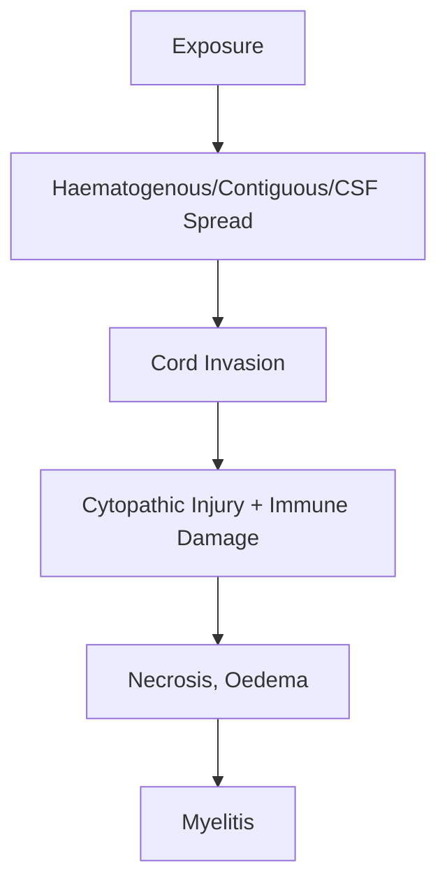
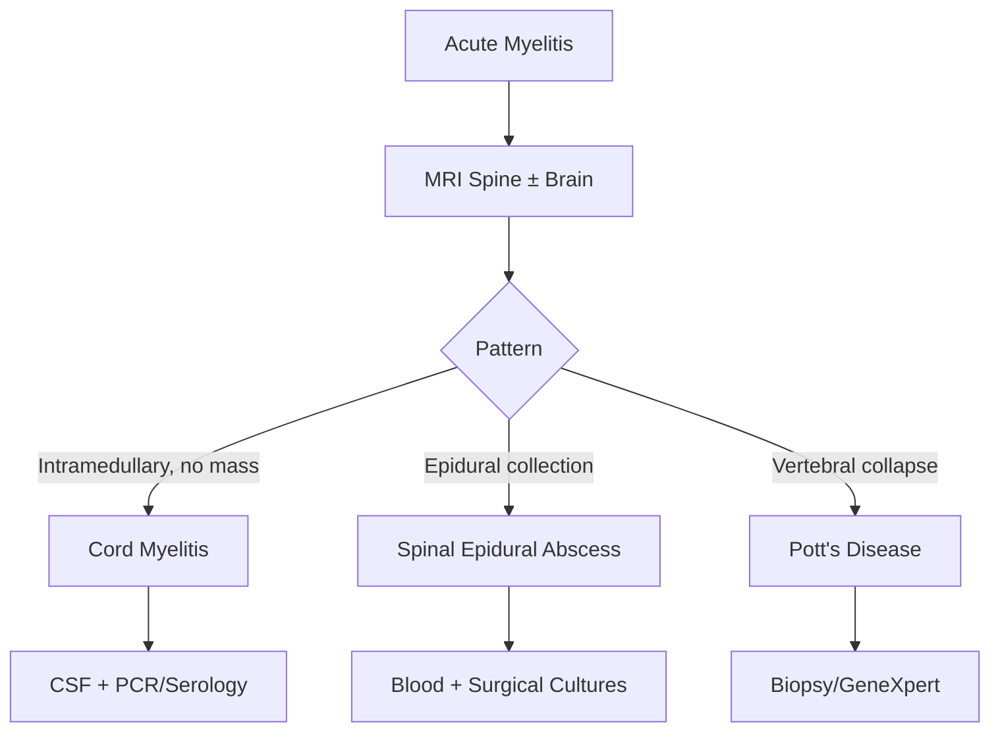

# Infectious Myelitis

> [!tip] **Infectious myelitis** = cord inflammation from direct microbial invasion (viral, bacterial, mycobacterial, fungal, parasitic). Distinct from post-infectious autoimmune myelitis (ADEM).

## 1. Definition / Epidemiology / Classification

### Definition
Inflammatory cord disorder of infectious aetiology producing motor, sensory, autonomic dysfunction via direct invasion or immune reaction.

### Epidemiology
- **Viral:** 1-5/100,000/year; bimodal (children, young adults)
- **Bacterial epidural abscess:** 0.5-2.5/10,000 admissions; ↑IVDU, diabetes, immunosuppressed
- **TB (Pott's):** endemic South Asia, sub-Saharan Africa
- **Schistosomal:** most common parasitic CNS infection globally
- **Risk factors:** immunocompromise, IVDU, travel, exotic exposure

### Classification
| Type | Key Features |
|------|-------------|
| **Viral (direct)** | HSV-2, VZV, EBV, CMV, enterovirus (polio, EV-D68/71), WNV, HTLV-1, HIV |
| **Viral (post-infectious)** | ADEM, post-influenza |
| **Bacterial** | Pyogenic epidural abscess, Lyme, neurosyphilis, TB |
| **Fungal** | Cryptococcus, Aspergillus, Histoplasma, Coccidioides |
| **Parasitic** | Schistosoma, Gnathostoma, cysticercosis, Toxocara |

## 2. Aetiology / Pathophysiology

### Aetiology
- **Viral:** HSV-1/2, VZV, EBV, CMV, HHV-6, enterovirus, WNV, JE, HTLV-1, HIV
- **Bacterial:** *S. aureus* (epidural abscess), *Streptococcus*, MTB, *T. pallidum*, *B. burgdorferi*, *Brucella*, *Nocardia*
- **Fungal:** *Cryptococcus*, *Aspergillus*, *Histoplasma*, *Coccidioides*
- **Parasitic:** *Schistosoma mansoni/japonicum*, *Gnathostoma*, *T. solium*, *Toxocara*

### Pathophysiology

### Molecular Mechanisms
- **HSV-2:** retroaxonal spread; recurrent Mollaret's meningitis
- **HTLV-1:** chronic demyelination (TSP/HAM)
- **HIV vacuolar myelopathy:** macrophage/microglia infection → SCD-like picture
- **Schistosoma:** egg deposition in lower cord → granulomatous reaction

## 3. Clinical Features

### History
- **Onset:** hours-days (viral), days-weeks (bacterial, TB), weeks-months (fungal, parasitic)
- **Symptoms:** back/radicular pain, ascending weakness, sensory level, bladder/bowel dysfunction
- **Triggers:** recent viral illness, fresh water (schistosomiasis), IVDU, tick bite
- **Systemic:** fever, weight loss, night sweats, rash, cough

### Examination
| Domain | Findings | Localisation |
|--------|---------|--------------|
| **Motor** | Flaccid (acute) → spastic, hyperreflexia, Babinski | Anterior horn + CST |
| **Sensory** | Level, radicular pain | Posterior column + spinothalamic |
| **Autonomic** | Bladder retention, ileus, postural hypotension | Lateral horn |
| **Spinal tenderness** | Focal = abscess, Pott's | Structural |

### Syndromes
| Syndrome | Features | Localisation |
|----------|---------|--------------|
| **Anterior spinal syndrome (viral)** | Motor + pain/temp loss; preserved dorsal columns | Anterior 2/3 |
| **Poliomyelitis** | Asymmetric flaccid weakness, no sensory loss | Anterior horn |
| **TSP (HTLV-1)** | Slowly progressive spastic paraparesis | Lateral CST |
| **Tabes dorsalis** | Lightning pains, ataxia, Argyll Robertson pupils, Charcot joints | Dorsal columns |
| **Schistosomal** | Conus/cauda equina, swimmers | Lower cord |
| **Pott's** | Chronic pain, gibbus, compression | Extramedullary |

## 4. Diagnostic Approach

### Severity Scales
- **ASIA Impairment Scale** A-E
- **Aminoff-Logue** 0-22
- **Barthel Index** 0-100

## 5. Investigations

### First-Line
| Investigation | Indication |
|---------------|------------|
| **MRI spine + gadolinium** | All - cord swelling, T2 hyperintensity, enhancement |
| **CSF** | All (after MRI) - cell count, protein, glucose, PCR, culture |
| **Bloods** | FBC, CRP, ESR, U&E, LFT, glucose, blood cultures |

### CSF
| Parameter | Viral | Bacterial | TB | Schistosomal |
|-----------|-------|-----------|-----|--------------|
| **WCC** | 10-500 (lymph) | 100-5000 (PMN) | 50-500 (lymph) | 50-500 (±eosinophils) |
| **Protein** | Mild ↑ | Markedly ↑ | Markedly ↑ | Moderate ↑ |
| **Glucose** | Normal | ↓ | ↓ | Normal |

### Serology
- **Viral:** HSV/VZV/EBV/CMV PCR, WNV IgM, HTLV-1, HIV
- **Bacterial:** VDRL/TPHA, Lyme, Brucella, Quantiferon
- **Parasitic:** Schistosoma serology
- **Fungal:** Cryptococcal Ag

## 6. Differential Diagnosis
| Differential | Distinguishing | Test |
|--------------|---------------|------|
| **Idiopathic TM** | No pathogen, AQP4/MOG neg | Exclusion |
| **NMOSD (AQP4)** | LETM ≥3 segments, optic neuritis | AQP4-IgG |
| **MOG** | Conus, ADEM-like | MOG-IgG |
| **MS** | Short segment, brain lesions | McDonald |
| **Compression** | Mass lesion | MRI |
| **SCD** | B12 deficiency | B12, MMA |
| **Cord infarct** | Sudden onset | MRI DWI |

## 7. Management

### Emergency
| Situation | Action | Time |
|-----------|--------|------|
| **Epidural abscess** | MRI + surgical decompression; vancomycin + ceftriaxone | <24h |
| **TB compression** | Dexamethasone 8mg IV TDS + ATT + surgery if severe | <48-72h |
| **Acute viral (HSV/VZV)** | IV aciclovir 10mg/kg TDS ×14-21d | Hours |
| **Bacterial abscess** | IV antibiotics + drainage | <24h |

### Specific Antimicrobial Therapy
| Agent | Indication | Dose | Duration |
|-------|------------|------|----------|
| **Aciclovir IV** | HSV, VZV | 10mg/kg TDS | 14-21d |
| **Ganciclovir** | CMV | 5mg/kg BD | 14-21d |
| **Ceftriaxone** | Lyme | 2g IV OD | 14-28d |
| **Benzylpenicillin** | Neurosyphilis | 18-24 MU/d IV | 14-18d |
| **RIPE** | TB | Standard | 9-12 mo |
| **Praziquantel** | Schistosoma | 40-60mg/kg stat | Single |
| **Albendazole** | Cysticercosis, gnathostoma | 400mg BD | 14-28d |
| **Ampho B + flucytosine** | Crypto | Induction | 2 wk → flucon |

### Symptomatic
- **Neuropathic pain:** Gabapentin, pregabalin, amitriptyline
- **Spasticity:** Baclofen, tizanidine, benzodiazepines
- **Bladder:** Intermittent self-catheterisation, oxybutynin
- **DVT prophylaxis:** LMWH + stockings

## 8. Drug Interactions / Contraindications
| Drug | Caution | Management |
|------|---------|-----------|
| **Aciclovir** | Nephrotoxicity | Hydration, renal adjust |
| **INH** | Hepatotoxicity, neuropathy | Pyridoxine 25-50mg |
| **Praziquantel** | CNS symptoms in heavy infection | Steroid cover |
| **Ampho B** | Nephrotoxicity, hypokalaemia | Pre-hydration |
| **Rifampicin** | CYP inducer | Avoid OCP, warfarin |

## 9. Procedures
### Lumbar Puncture
- **Indications:** All suspected infectious myelitis
- **Precaution:** After MRI (exclude mass)
- **Send:** Cell count, protein, glucose, Gram stain, culture, viral PCR, OCB, AQP4/MOG, VDRL, Crypto Ag, AFB, GeneXpert

## 10. Complications
| Complication | Frequency | Management |
|--------------|-----------|-----------|
| **Respiratory failure (cervical)** | 10-20% | Monitor FVC, intubate if <15-20ml/kg |
| **Pressure sores** | Common | 2-hourly turning |
| **DVT/PE** | 5-10% | LMWH, stockings |
| **Neuropathic pain** | 30-50% | Gabapentinoids |
| **Spasticity** | Common | Physio, baclofen |
| **Bladder dysfunction/UTI** | 40-60% | ISC, monitoring |
| **Autonomic dysreflexia** | High cervical | Trigger ID, BP control |

## 11. Red Flags / Emergencies
| Red Flag | Action | Window |
|----------|--------|--------|
| **Cervical with FVC <1L** | ICU, intubate | Immediate |
| **Progression on Rx** | Re-image, drain | <24h |
| **Septic shock** | Resus, broad-spectrum | <1h |
| **Pott's with paraplegia** | Steroids, surgery | <48h |

## 12. Prognosis
- **Viral (HSV/VZV):** 50-70% recovery with prompt Rx
- **Bacterial abscess:** 5-15% mortality; 30-50% deficit
- **TB:** 50-80% recovery with ATT ± surgery
- **Schistosomal:** Good with early Rx
- **HIV vacuolar:** Progressive
- **Poor:** Late presentation, high cervical, complete lesion, immunocompromised

## 13. Topic Correlation
| Topic | Link | Overlap |
|-------|------|---------|
| **Transverse Myelitis** | [[Transverse Myelitis]] | AQP4/MOG |
| **Epidural Abscess** | [[Spinal Cord Compression]] | Surgical emergency |
| **Pott's** | [[Spinal Cord Compression]] | TB |
| **HTLV-1** | [[Tropical Myeloneuropathies]] | TSP |
| **Schistosomiasis** | [[CNS Infections]] | Travel/exposure |

## 14. Special Situations
| Situation | Consideration |
|-----------|---------------|
| **Pregnancy** | ATT safe (INH/RIF/EMB); avoid praziquantel 1st trimester |
| **Paediatric** | EV-D68/A71 → AFM |
| **Elderly** | Higher mortality epidural abscess |
| **HIV** | Broader differential (CMV, JC, fungal) |
| **IVDU** | S. aureus, Pseudomonas |
| **Travel** | Schistosoma, cysticercosis, gnathostomiasis |

## FCPS/MRCP High-Yield Summary
- **Definition:** Cord inflammation by direct microbial invasion
- **Causes:** Viral (HSV/VZV/EBV/WNV/HTLV-1), bacterial (S. aureus abscess, TB, syphilis), fungal (Crypto), parasitic (Schistosoma)
- **Clinical:** Acute/subacute weakness, sensory level, autonomic dysfunction, ± fever, exposure
- **Diagnosis:** MRI spine + CSF (PCR, serology, cultures)
- **Management:** Aciclovir (HSV/VZV), ATT (TB), benzylpen (syphilis), praziquantel (Schistosoma) ± surgical decompression
- **Red Flags:** Cervical, epidural abscess, Pott's with compression
- **Pearls:** Mollaret's = HSV-2; Pott's gibbus; Schistosoma eosinophils in CSF; HIV vacuolar = SCD-like

## Viva Questions
1. **Q:** Classify infectious myelitis by aetiology.
   **A:** Viral (HSV-2, VZV, EBV, WNV, HTLV-1, HIV), bacterial (pyogenic, TB, syphilis, Lyme), fungal (Crypto, Aspergillus), parasitic (Schistosoma, cysticercosis, gnathostoma).
2. **Q:** Schistosomal myelitis features and treatment?
   **A:** Fresh water exposure, conus/cauda equina, CSF eosinophils, positive serology. Praziquantel 40-60mg/kg + steroids.
3. **Q:** MRI findings in acute viral myelitis?
   **A:** Cord expansion, T2/STIR hyperintensity, patchy enhancement.
4. **Q:** Management of suspected spinal epidural abscess?
   **A:** Urgent MRI; IV vancomycin + ceftriaxone ± metronidazole; surgical decompression.
5. **Q:** Pott's vs pyogenic vertebral osteomyelitis?
   **A:** TB chronic, gibbus, paravertebral abscess, caseating, anterior body; pyogenic acute, severe pain, fever, S. aureus.
6. **Q:** Most common parasitic spinal cord infection?
   **A:** Schistosomiasis (S. mansoni/japonicum/haematobium).
7. **Q:** HTLV-1 myelopathy name and features?
   **A:** Tropical spastic paraparesis (TSP/HAM) - chronic progressive spastic paraparesis, urinary dysfunction.
8. **Q:** HIV vacuolar myelopathy mechanism?
   **A:** Direct HIV infection of macrophages/microglia → SCD-like picture.
9. **Q:** Cryptococcal myelitis induction Rx?
   **A:** Amphotericin B + flucytosine ×2 weeks → fluconazole consolidation/maintenance.
10. **Q:** What is Mollaret's meningitis?
    **A:** Recurrent benign lymphocytic meningitis (HSV-2); may have myelitis; valaciclovir suppression.
11. **Q:** When is surgery indicated in Pott's?
    **A:** Neurological deficit, instability, severe kyphosis, failed medical Rx.
12. **Q:** Role of steroids in TB myelitis?
    **A:** Adjunctive dexamethasone reduces cord oedema, improves outcomes.

## Common Confusions / Exam Traps
| Confusion | Clarification |
|-----------|---------------|
| **Infectious vs post-infectious** | Direct invasion vs ADEM-like |
| **Pott's vs pyogenic** | TB chronic + gibbus; pyogenic acute |
| **HTLV-1 vs MS** | Older onset, no brain lesions, HTLV-1 serology+ |
| **Schistosomal vs TM** | Travel, eosinophils, praziquantel |
| **Cord abscess vs tumour** | Fever, CRP, ring enhancement |

## Mnemonics
1. **SPINAL — Viral Myelitis** — **S**chistosoma, **P**olio, **I**nfluenza, **N**ile (WNV), **A**ciclovir, **L**ymphocytic
2. **TRIP — HTLV-1** — **T**ropical, **R**etrovirus, **I**ndolent, **P**rogressive
3. **ABCDE — Epidural Abscess** — **A**ntibiotics, **B**ack pain, **C**ord compression, **D**ecompress, **E**scalate
4. **MOLLARET** — **M**ild, **O**ccasional, **L**ymphocytic, **L**ong, **A**ciclovir, **R**ecurrent, **E**ncephalitis (rare), **T**emp

## One-Page Revision Card
| Topic | Infectious Myelitis |
|-------|--------------------|
| **Definition** | Cord inflammation by direct microbial invasion |
| **Key Causes** | HSV/VZV/WNV/HTLV-1, S. aureus abscess, TB, Schistosoma |
| **Clinical** | Acute/subacute weakness, sensory level, autonomic dysfunction |
| **Diagnosis** | MRI spine + CSF (PCR, serology, cultures) |
| **Management** | Aciclovir (HSV/VZV), ATT (TB), benzylpen (syphilis), praziquantel (Schistosoma) ± surgical decompression |
| **Red Flag** | Cervical, epidural abscess, Pott's with compression |
| **Prognosis** | Variable; early Rx = better |

## Must Know / Should Know / Nice to Know
- **Must:** HSV/VZV, TB, epidural abscess, Schistosoma
- **Should:** HTLV-1 TSP, HIV vacuolar, neurosyphilis
- **Nice:** Gnathostomiasis, AFM (EV-D68)

## MCQs (10)
1. **Q:** Most common parasitic myelitis worldwide?
   **Options:** A. Cysticercosis B. Schistosomiasis C. Gnathostomiasis D. Toxocariasis
   **Answer:** B
2. **Q:** IVDU with fever, back pain, paraparesis, epidural collection. Empirical antibiotics?
   **Options:** A. Amoxicillin B. Vancomycin + ceftriaxone C. Azithromycin D. Meropenem only
   **Answer:** B
3. **Q:** Schistosomal myelitis affects which cord region?
   **Options:** A. Cervical B. Thoracic C. Conus/lower cord D. Anterior horn
   **Answer:** C
4. **Q:** CSF in viral myelitis shows?
   **Options:** A. Neutrophilic pleocytosis, low glucose B. Lymphocytic, normal glucose C. Eosinophils, normal glucose D. Markedly low glucose
   **Answer:** B
5. **Q:** HTLV-1 associated myelopathy is?
   **Options:** A. Tropical spastic paraparesis B. Anterior horn disease C. Acute flaccid paralysis D. Cauda equina
   **Answer:** A
6. **Q:** First-line Rx for HSV-2 myelitis?
   **Options:** A. Oral valaciclovir B. IV aciclovir 10mg/kg TDS C. Foscarnet D. Ganciclovir
   **Answer:** B
7. **Q:** MRI of Pott's disease shows?
   **Options:** A. Long segment cord oedema B. Vertebral collapse with paravertebral abscess C. Ring-enhancing cord lesion D. Cord haemorrhage
   **Answer:** B
8. **Q:** Mollaret's meningitis is caused by?
   **Options:** A. HSV-1 B. HSV-2 C. VZV D. EBV
   **Answer:** B
9. **Q:** Neurosyphilis treatment?
   **Options:** A. Doxycycline B. IV ceftriaxone C. IV benzylpenicillin 18-24 MU/d D. Oral amoxicillin
   **Answer:** C
10. **Q:** Cryptococcal myelitis induction Rx?
    **Options:** A. Fluconazole alone B. Amphotericin B + flucytosine C. Voriconazole D. Itraconazole
    **Answer:** B

## SBA Questions (10)
1. **Scenario:** 28-year-old, Lake Malawi, saddle anaesthesia, urinary retention, conus T2 hyperintensity, CSF 30% eosinophils. Diagnosis?
   **Options:** A. Bacterial abscess B. Schistosomal myelitis C. TB myelitis D. Idiopathic TM
   **Answer:** B
2. **Scenario:** Diabetic, fever, back pain, paraplegia, epidural collection. Management?
   **Options:** A. IV antibiotics alone B. Surgical decompression + IV antibiotics C. Oral antibiotics D. Repeat MRI in 1 week
   **Answer:** B
3. **Scenario:** HIV (CD4 50), subacute paraparesis, intramedullary ring-enhancing lesion, CSF crypto Ag+. Diagnosis?
   **Options:** A. Toxoplasmosis B. PCNSL C. Cryptococcal myelitis D. PML
   **Answer:** C
4. **Scenario:** Born in Okinawa, progressive spastic paraparesis, urinary urgency, HTLV-1+. Diagnosis?
   **Options:** A. MS B. HTLV-1 myelopathy (TSP/HAM) C. ALS D. Cervical myelopathy
   **Answer:** B
5. **Scenario:** TB with gibbus, paraplegia, T6 collapse + paravertebral abscess. First step?
   **Options:** A. ATT only B. IV dexamethasone + ATT C. Surgery only D. Repeat MRI
   **Answer:** B
6. **Scenario:** Mollaret's meningitis, HSV-2 PCR+. Long-term Rx?
   **Options:** A. Intermittent aciclovir B. Suppressive valaciclovir C. No Rx D. Foscarnet
   **Answer:** B
7. **Scenario:** Post respiratory illness, acute flaccid paralysis, EV-D68 PCR+. Diagnosis?
   **Options:** A. ADEM B. Acute flaccid myelitis C. MS D. NMOSD
   **Answer:** B
8. **Scenario:** TB on RIPE, peripheral neuropathy. Which drug?
   **Options:** A. Rifampicin B. Isoniazid C. Pyrazinamide D. Ethambutol
   **Answer:** B
9. **Scenario:** Gnathostomiasis, raw fish, cord haemorrhage. Rx?
   **Options:** A. Praziquantel B. Albendazole + steroids C. Ivermectin D. Amphotericin
   **Answer:** B
10. **Scenario:** HIV, spastic paraparesis, B12/MMA normal, dorsal column signal. Cause?
    **Options:** A. B12 deficiency B. HIV vacuolar myelopathy C. PML D. Neurosyphilis
    **Answer:** B

## Flashcards
- **Q:** Most common parasitic myelitis? **A:** Schistosomiasis
- **Q:** Schistosomal myelitis Rx? **A:** Praziquantel + steroids
- **Q:** Epidural abscess empirical antibiotics? **A:** Vancomycin + ceftriaxone ± metronidazole
- **Q:** Pott's MRI? **A:** Vertebral collapse + paravertebral abscess
- **Q:** HTLV-1 disease? **A:** Tropical spastic paraparesis / HAM
- **Q:** HIV vacuolar myelopathy resembles? **A:** Subacute combined degeneration
- **Q:** Cryptococcal induction Rx? **A:** Amphotericin B + flucytosine ×2 weeks
- **Q:** Neurosyphilis Rx? **A:** IV benzylpenicillin 18-24 MU/d ×14-18d
- **Q:** Mollaret's meningitis cause? **A:** HSV-2
- **Q:** Acute flaccid myelitis in children? **A:** EV-D68 / EV-A71

## Answer Key
### MCQs
1. B  2. B  3. C  4. B  5. A  6. B  7. B  8. B  9. C  10. B

### SBAs
1. B  2. B  3. C  4. B  5. B  6. B  7. B  8. B  9. B  10. B

## Summary
Infectious myelitis includes viral, bacterial, mycobacterial, fungal, and parasitic causes of cord inflammation. **Spinal epidural abscess is a surgical emergency** requiring urgent decompression and IV vancomycin + ceftriaxone. **Schistosomiasis** is the most common parasitic cause (conus, CSF eosinophilia, praziquantel). **HIV vacuolar myelopathy** mimics B12 deficiency. Early recognition and pathogen-specific therapy determine prognosis.
