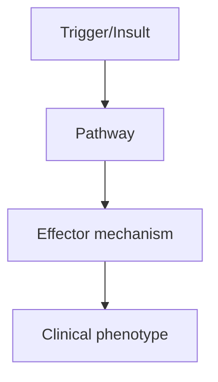
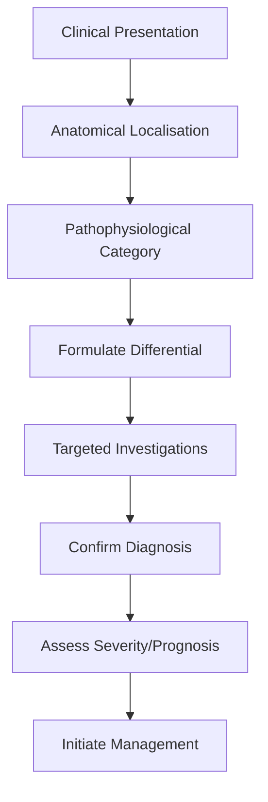
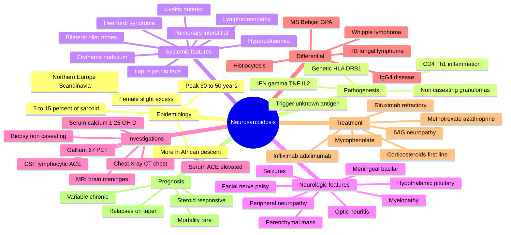

# Neurosarcoidosis

> [!tip] **High-Yield Definition**
> Neurosarcoidosis: granulomatous inflammation of nervous system due to sarcoidosis (systemic granulomatous disease, non-caseating granulomas, multisystem). 5-10% of sarcoidosis patients. Affects any part of CNS, PNS. Cranial neuropathies, meningeal, hypothalamic, spinal cord, peripheral nerve, muscle. Diagnosis of exclusion. Treatable with immunosuppression.

---

## 1. Definition / Epidemiology / Classification

### Definition
Neurosarcoidosis: granulomatous inflammation of nervous system due to sarcoidosis (systemic granulomatous disease, non-caseating granulomas, multisystem). 5-10% of sarcoidosis patients. Affects any part of CNS, PNS. Cranial neuropathies, meningeal, hypothalamic, spinal cord, peripheral nerve, muscle. Diagnosis of exclusion. Treatable with immunosuppression.

### Epidemiology
Sarcoidosis: 10-40/100,000 (varies by ethnicity, highest in African, Caribbean, Scandinavian). Neurosarcoidosis: 5-10% of sarcoidosis. Adult onset (20-50y). Female predominance in some series. 30% have only neurosarcoidosis (no systemic).

### Classification
| Variant | Key Features | Prognosis |
|---------|-------------|-----------|
| | | |

---

## 2. Aetiology / Pathophysiology

### Aetiology
Sarcoidosis: non-caseating granulomas, CD4+ Th1 mediated, unknown cause (genetic, environmental, infection - mycobacteria, propionibacteria). Genetic: HLA-DRB1*04, HLA-DRB1*15, BTNL2. Neurosarcoidosis: granulomatous infiltration of nervous system. Sites: leptomeninges (50%, basilar, cranial nerves, hypothalamus), cranial nerves (VII most common, II, VIII, V, others), hypothalamus-pituitary (DI, hormonal), spinal cord (intramedullary, extramedullary, meningeal), peripheral nerve, muscle. Pathology: non-caseating granulomas, lymphocytes, multinucleated giant cells, epithelioid cells, fibrosis (chronic).

### Pathophysiology

---

## 3. Clinical Features

### History
- **Onset/Duration:**
- **Progression:**
- **Key symptoms:**
- **Triggers:**
- **Systemic symptoms:**
- **Drug/Family/Social history:**

### Examination
| Domain | Key Findings | Localisation Value |
|--------|-------------|-------------------|
| | | |

### Specific Clinical Features
Cranial neuropathies (50-75%): VII (Bell's palsy, bilateral - characteristic, recurrent), II (optic neuropathy, papilloedema, visual loss, chiasmal), VIII (hearing loss, vertigo), V, others. Meningeal: aseptic meningitis, headache, meningism. Hypothalamic-pituitary: diabetes insipidus (DI, central, polyuria, polydipsia), anterior pituitary (hyperprolactinaemia, hypogonadism, hypothyroidism, adrenal insufficiency), SIADH, hyperphagia, obesity, temperature dysregulation, sleep, somnolence. Spinal cord: longitudinally extensive, meningeal enhancement, intramedullary, paraparesis, sensory level, bladder. Cerebral: parenchymal mass, seizures, encephalopathy, cognitive, psychiatric. Peripheral nerve: mononeuritis multiplex, polyneuropathy, radiculopathy. Muscle: nodules, proximal myopathy, asymptomatic. Constitutional: fatigue, fever, weight loss. Systemic: erythema nodosum, lupus pernio, uveitis, arthritis, hilar lymphadenopathy, pulmonary, cardiac, hepatic, renal, skin.

---

## 4. Diagnostic Approach / Algorithm

---

## 5. Investigations

CSF: lymphocytic pleocytosis, elevated protein, low glucose, OCBs (often), ACE (elevated in 30-50%, not specific, false negatives, false positives), lysozyme, beta-2 microglobulin, CD4:CD8 ratio (elevated, may reflect CNS). Bloods: FBC, U&Es, LFTs, calcium (hypercalcaemia 10%), ACE (systemic sarcoidosis 60%), ESR, CRP, autoimmune, vasculitis, infection (TB, Lyme, syphilis, HIV, hepatitis, fungal, exclude). Imaging: MRI brain + spine with gadolinium - leptomeningeal enhancement (basilar, cranial nerves, hypothalamus, pituitary, spinal cord), parenchymal mass, T2 hyperintensity, spinal cord (LETM, meningeal, intramedullary), hypothalamic-pituitary. Chest X-ray, CT chest (bilateral hilar lymphadenopathy, pulmonary infiltrates, fibrosis). Whole body PET-CT: systemic sarcoidosis, FDG-avid lesions (hilar, mediastinal, lung, skin, lymph nodes). Tissue: biopsy (skin, lymph node, lung, conjunctiva, salivary gland, Kveim test - historical), meningeal (if accessible), nerve, muscle, brain (rarely). Biopsy: non-caseating granulomas, no infection, no foreign material. Exclude: TB (AFB, culture, QuantiFERON), fungal, sarcoid-like (Behçet's, Whipple's, lymphoma, IgG4).

---

## 6. Differential Diagnosis

| Differential | Distinguishing Features | Key Test |
|--------------|------------------------|----------|
| | | |

---

## 7. Management

First-line: corticosteroids (prednisolone 0.5-1mg/kg/day, IV methylprednisolone 500-1000mg ×3 days for severe, life-threatening). Taper slowly. Second-line: immunosuppressants (methotrexate 15-25mg/week + folic acid 5mg/week, azathioprine 2-3mg/kg/day after TPMT testing, MMF 1-1.5g BD, cyclophosphamide IV for severe, refractory, rituximab, infliximab 5mg/kg, anti-TNF, especially for refractory). Third-line: IVIG 2g/kg over 2-5 days (refractory, infection). Neurosarcoidosis: aggressive (steroids, immunosuppressant, often combination), life-threatening, refractory (40-50%), may need biological. Symptomatic: cranial neuropathy (facial palsy, hearing, vision), hypothalamic (DI - desmopressin, hormonal replacement, fertility, growth, thyroid, adrenal), seizures (ASM), psychiatric (antidepressants, antipsychotics), bladder, spasticity, pain, fatigue, exercise. Multidisciplinary: neurologist, rheumatologist, pulmonologist, ophthalmologist, dermatologist, endocrinologist, OT, PT, SLT, dietitian, social, palliative. Monitor: clinical, MRI, bloods, lung function, hormone levels, ACE, side effects, infections, malignancy. Long-term: relapse 30-50%, taper slowly, may require lifelong immunosuppression.

---

## 8. Drug Interactions / Contraindications / Comorbidity Cautions

| Drug | Interaction / Caution | Management |
|------|----------------------|------------|
| | | |

---

## 9. Procedures (if applicable)

### Procedure:
- **Indications:**
- **Contraindications:**
- **Preparation / Principle:**
- **Complications:**
- **Viva Pearls:**

---

## 10. Complications

| Complication | Frequency | Prevention / Monitoring | Management |
|--------------|-----------|------------------------|------------|
| | | | |

---

## 11. Red Flags / Emergencies

Severe neurosarcoidosis (cranial neuropathy, meningitis, hypothalamic, spinal cord, parenchymal mass, hydrocephalus), respiratory (pulmonary fibrosis, infection), cardiac (arrhythmia, conduction, sudden death, cardiomyopathy, 25% of sarcoidosis deaths), hypercalcaemia (renal, neuropsychiatric), renal failure, hepatic failure, ocular (uveitis, glaucoma, vision loss), severe fatigue, depression, suicide, infection (immunosuppression), malignancy, drug side effects (steroids, immunosuppressants, anti-TNF - reactivation TB, hepatitis B, opportunistic, PML).

---

## 12. Prognosis

Variable. Neurosarcoidosis: 5-10% mortality, 30-50% relapse, 40-50% chronic. Most: stabilise or improve. Worse: severe, refractory, parenchymal, hydrocephalus, cardiac, renal, multi-organ. Sarcoidosis: 5-year survival 95%, 10-year 90%, 20-year 70%. Cardiac sarcoidosis: poor, 25% of deaths. Multidisciplinary care essential. Long-term: monitor, relapse, organ involvement, treatment side effects, malignancy, infection. Genetic: HLA associations, family screening limited. Quality of life: depends on organ involvement, fatigue, treatment burden. Research: biologics, anti-TNF, JAK inhibitors.

---

## 13. Topic Correlation

| Related Topic | Link | Key Overlap |
|---------------|------|-------------|
| | | |

---

## 14. Special Situations

| Situation | Consideration |
|-----------|---------------|
| **Pregnancy** | |
| **Lactation** | |
| **Paediatric** | |
| **Elderly / Frail** | |
| **Renal impairment** | |
| **Hepatic impairment** | |
| **Immunocompromised** | |
| **Perioperative** | |
| **Driving / DVLA** | |
| **Occupational** | |

---

## FCPS/MRCP High-Yield Summary

| Category | Key Points |
|----------|------------|
| **Definition** | Neurosarcoidosis: granulomatous inflammation of nervous system due to sarcoidosis (systemic granulomatous disease, non-caseating granulomas, multisystem). 5-10% of sarcoidosis patients. Affects any pa |
| **Epidemiology** | Sarcoidosis: 10-40/100,000 (varies by ethnicity, highest in African, Caribbean, Scandinavian). Neurosarcoidosis: 5-10% of sarcoidosis. Adult onset (20 |
| **Pathophysiology** | |
| **Clinical** | Cranial neuropathies (50-75%): VII (Bell's palsy, bilateral - characteristic, recurrent), II (optic neuropathy, papilloedema, visual loss, chiasmal), VIII (hearing loss, vertigo), V, others. Meningeal |
| **Diagnosis** | |
| **Investigations** | CSF: lymphocytic pleocytosis, elevated protein, low glucose, OCBs (often), ACE (elevated in 30-50%, not specific, false negatives, false positives), lysozyme, beta-2 microglobulin, CD4:CD8 ratio (elev |
| **Management** | First-line: corticosteroids (prednisolone 0.5-1mg/kg/day, IV methylprednisolone 500-1000mg ×3 days for severe, life-threatening). Taper slowly. Second-line: immunosuppressants (methotrexate 15-25mg/we |
| **Complications** | |
| **Prognosis** | Variable. Neurosarcoidosis: 5-10% mortality, 30-50% relapse, 40-50% chronic. Most: stabilise or improve. Worse: severe, refractory, parenchymal, hydrocephalus, cardiac, renal, multi-organ. Sarcoidosis |
| **Viva Pearls** | |
| **Drug Doses** | |
| **Scoring Systems** | |
| **Genetics** | |
| **Imaging Signs** | |

---

## Viva Questions (PACES/FCPS Style)

1. **Q:** Define Neurosarcoidosis and classify its variants.
   **A:** Based on the definition above.

2. **Q:** What are the key clinical features?
   **A:** Cranial neuropathies (50-75%): VII (Bell's palsy, bilateral - characteristic, recurrent), II (optic neuropathy, papilloedema, visual loss, chiasmal), VIII (hearing loss, vertigo), V, others. Meningeal: aseptic meningitis, headache, meningism. Hypothalamic-pituitary: diabetes insipidus (DI, central, 

3. **Q:** What is the first-line treatment?
   **A:** Based on the management section.

4. **Q:** What are the red flags requiring urgent referral?
   **A:** Severe neurosarcoidosis (cranial neuropathy, meningitis, hypothalamic, spinal cord, parenchymal mass, hydrocephalus), respiratory (pulmonary fibrosis, infection), cardiac (arrhythmia, conduction, sudden death, cardiomyopathy, 25% of sarcoidosis deaths), hypercalcaemia (renal, neuropsychiatric), rena

5. **Q:** What is the prognosis?
   **A:** Variable. Neurosarcoidosis: 5-10% mortality, 30-50% relapse, 40-50% chronic. Most: stabilise or improve. Worse: severe, refractory, parenchymal, hydrocephalus, cardiac, renal, multi-organ. Sarcoidosis: 5-year survival 95%, 10-year 90%, 20-year 70%. Cardiac sarcoidosis: poor, 25% of deaths. Multidisc

6. **Q:** How do you differentiate Neurosarcoidosis from key differentials?
   **A:** Clinical features, investigations, and response to treatment.

7. **Q:** What investigations are most useful?
   **A:** Based on the investigations section.

8. **Q:** Describe the stepwise management approach.
   **A:** Based on the management algorithm.

9. **Q:** What are the emergency presentations?
   **A:** Based on the red flags section.

10. **Q:** How does management change in pregnancy/paediatrics/elderly?
    **A:** Special considerations per population.

---

## Common Confusions / Exam Traps

| Confusion | Clarification |
|-----------|---------------|
| | |

---

## Mnemonics

1. **Neurosarcoidosis — "GRANULAR"** — **G**ranulomas non-caseating (epithelioid + giant cells); **R**espiratory (BHL bilateral hilar lymphadenopathy); **A**CE elevated (serum, 60% sensitive, non-specific); **N**eurologic (CN VII palsy most common, any cranial nerve); **U**veitis + skin (lupus pernio, erythema nodosum); **L**ymph nodes + hypercalcaemia (1α-hydroxylase); **A**nergy on TB skin test (PPD negative despite exposure); **R**esponse to steroids; **B**iopsy = gold standard (lymph node, nerve, meninges, muscle).

2. **Neurosarcoidosis Patterns "3P-MN"** — **P**arenchymal (granulomas in brain/spine, mass-like or diffuse); **P**ituitary/hypothalamic (DI, galactorrhoea, panhypopituitarism); **P**eripheral neuropathy (mononeuritis multiplex, small-fibre); **M**eningeal (leptomeningeal enhancement, basal meningitis); **N**euro-ophthalmic (CN palsies VII, II, VIII, optic neuritis).

3. **Sarcoidosis Hypercalcaemia Mechanism "Macrophage 1α"** — Activated sarcoid macrophages in granulomas express **1α-hydroxylase**, converting 25-OH-vitamin D → 1,25-(OH)₂-vitamin D (calcitriol) **ectopically**, causing hypercalcaemia + hypercalciuria, nephrolithiasis, nephrocalcinosis.

---

## Mind Map

---

## Spaced Repetition Trackers

| Topic | Day 1 | Day 3 | Day 7 | Day 14 | Day 30 | Day 90 |
|-------|-------|-------|-------|-------|--------|--------|
| Non-caseating granuloma pathology | ☐ | ☐ | ☐ | ☐ | ☐ | ☐ |
| CN VII palsy as most common cranial neuropathy | ☐ | ☐ | ☐ | ☐ | ☐ | ☐ |
| Serum ACE (sensitivity, non-specificity) | ☐ | ☐ | ☐ | ☐ | ☐ | ☐ |
| Hypercalcaemia from macrophage 1α-hydroxylase | ☐ | ☐ | ☐ | ☐ | ☐ | ☐ |
| MRI: leptomeningeal & hypothalamic enhancement | ☐ | ☐ | ☐ | ☐ | ☐ | ☐ |
| Treatment ladder: steroids → MTX → anti-TNF | ☐ | ☐ | ☐ | ☐ | ☐ | ☐ |
| Heerfordt syndrome (uveitis, parotid, VII palsy, fever) | ☐ | ☐ | ☐ | ☐ | ☐ | ☐ |
| Differential diagnosis (TB, MS, lymphoma, Behçet) | ☐ | ☐ | ☐ | ☐ | ☐ | ☐ |
| Biopsy: where to biopsy (node, muscle, nerve) | ☐ | ☐ | ☐ | ☐ | ☐ | ☐ |
| Gallium-67 / FDG-PET for systemic staging | ☐ | ☐ | ☐ | ☐ | ☐ | ☐ |

---

## Self-Test Scorecard

| Domain | Score (/5) |
|--------|-----------|
| Definition / Epidemiology / Classification | /5 |
| Aetiology / Pathophysiology | /5 |
| Clinical Features | /5 |
| Diagnostic Approach / Algorithm | /5 |
| Investigations | /5 |
| Differential Diagnosis | /5 |
| Management | /5 |
| Complications | /5 |
| Red Flags / Emergencies | /5 |
| Prognosis | /5 |
| **Total** | **/50** |

---

## MCQs (10)

1. **Question:** A 38-year-old Black woman presents with bilateral facial weakness, painful red eyes, and parotid swelling. Examination reveals bilateral CN VII palsy, anterior uveitis, and bilateral parotid enlargement. Chest X-ray shows bilateral hilar lymphadenopathy. Which syndrome is this?
   **Options:** A. Sjögren syndrome B. Heerfordt syndrome (uveoparotid fever) C. Behçet disease D. Wegener granulomatosis
   **Answer:** B
   **Explanation:** Heerfordt syndrome is a rare manifestation of sarcoidosis characterised by the triad (or tetrad) of: anterior uveitis, parotid gland enlargement, facial nerve palsy (usually unilateral but can be bilateral), and low-grade fever. The chest X-ray finding of bilateral hilar lymphadenopathy confirms sarcoidosis.

2. **Question:** The most common cranial neuropathy in neurosarcoidosis is:
   **Options:** A. Optic nerve (CN II) B. Trigeminal nerve (CN V) C. Facial nerve (CN VII) D. Vestibulocochlear nerve (CN VIII)
   **Answer:** C
   **Explanation:** Facial nerve palsy (CN VII), unilateral or bilateral, is the most common cranial neuropathy in neurosarcoidosis, often reflecting basilar leptomeningeal granulomatous inflammation. Optic neuropathy and trigeminal involvement are also common but less so than VII.

3. **Question:** Which serum marker is classically elevated in sarcoidosis, although it has limited sensitivity and specificity?
   **Options:** A. Angiotensin-converting enzyme (ACE) B. Anti-dsDNA C. Anti-neutrophil cytoplasmic antibody (ANCA) D. Rheumatoid factor
   **Answer:** A
   **Explanation:** Serum ACE is produced by epithelioid cells in granulomas and is elevated in ~60% of sarcoidosis patients. It is not specific (also raised in TB, fungal infections, Gaucher, silicosis). It may help monitor disease activity. ANCA, anti-dsDNA, and RF are unrelated.

4. **Question:** Hypercalcaemia in sarcoidosis results from:
   **Options:** A. Parathyroid adenoma B. Ectopic calcitriol (1,25-OH vitamin D) production by activated macrophages in granulomas C. Bone metastases D. Vitamin D dietary excess
   **Answer:** B
   **Explanation:** Activated macrophages within sarcoid granulomas express 1α-hydroxylase, converting 25-OH vitamin D to 1,25-(OH)₂ vitamin D (calcitriol) ectopically, independent of PTH. This causes hypercalcaemia and hypercalciuria. (Note: PTH is suppressed in sarcoid hypercalcaemia, unlike primary hyperparathyroidism.)

5. **Question:** Which MRI brain finding is most suggestive of neurosarcoidosis?
   **Options:** A. Periventricular ovoid lesions perpendicular to ventricles B. Leptomeningeal enhancement at the base of the brain, with hypothalamic/pituitary involvement C. Tumefactive demyelination D. Hot-cross-bun sign in pons
   **Answer:** B
   **Explanation:** Neurosarcoidosis classically shows **basilar leptomeningeal enhancement** on post-contrast MRI, often with involvement of the hypothalamus, infundibulum, pituitary, and cranial nerves. Parenchymal granulomas appear as enhancing mass lesions. Periventricular ovoid lesions are typical of MS; hot-cross-bun sign is MSA-C.

6. **Question:** Histopathology of sarcoidosis classically shows:
   **Options:** A. Caseating granulomas with Langhans giant cells B. Non-caseating epithelioid granulomas with multinucleated giant cells C. Vasculitis with fibrinoid necrosis D. Lymphocytic infiltrate without granulomas
   **Answer:** B
   **Explanation:** Sarcoidosis is defined by **non-caseating epithelioid granulomas**: tightly formed collections of epithelioid macrophages and multinucleated giant cells (Langhans or foreign body type), surrounded by CD4⁺ T lymphocytes, with **no necrosis**. Caseating granulomas suggest TB; vasculitis with fibrinoid necrosis suggests ANCA-vasculitis.

7. **Question:** First-line treatment for symptomatic neurosarcoidosis is:
   **Options:** A. IV cyclophosphamide B. Oral corticosteroids (e.g., prednisolone 0.5–1 mg/kg/day) C. Plasmapheresis D. IVIG monotherapy
   **Answer:** B
   **Explanation:** First-line therapy for symptomatic neurosarcoidosis is oral corticosteroids (prednisolone 0.5–1 mg/kg/day for 4–6 weeks, then slow taper over 6–12 months). Steroid-sparing agents (methotrexate, azathioprine, mycophenolate mofetil) are added for relapse or steroid toxicity. Refractory disease may need infliximab or adalimumab.

8. **Question:** Which refractory neurosarcoidosis treatment has the strongest evidence for benefit?
   **Options:** A. Plasmapheresis B. Anti-TNF agents (infliximab, adalimumab) C. IVIG D. Total lymphoid irradiation
   **Answer:** B
   **Explanation:** Anti-TNF monoclonal antibodies (infliximab 5 mg/kg; adalimumab) are the best-evidenced therapy for refractory neurosarcoidosis, with multiple case series and RCT signals, especially for parenchymal and spinal disease. PLEX/IVIG are not standard.

9. **Question:** A patient with neurosarcoidosis on steroids develops worsening peripheral neuropathy and pulmonary infiltrates despite prednisolone 40 mg daily. What is the most appropriate next step?
   **Options:** A. Add a steroid-sparing immunosuppressant (e.g., methotrexate or mycophenolate) B. Stop steroids immediately C. Add aciclovir D. Refer for bilateral lung transplant
   **Answer:** A
   **Explanation:** For steroid-refractory or steroid-dependent neurosarcoidosis, methotrexate (15 mg weekly + folic acid), azathioprine, or mycophenolate mofetil is added. Anti-TNF (infliximab) is reserved for refractory cases after failure of these agents.

10. **Question:** Which of the following is NOT in the differential diagnosis of neurosarcoidosis?
    **Options:** A. Tuberculous meningitis B. Fungal meningitis (cryptococcal, histoplasma) C. Neurosyphilis D. Primary CNS lymphoma
    **Answer:** C
    **Explanation:** Neurosarcoidosis mimics include TB, fungal infections (cryptococcus, histoplasma), primary CNS lymphoma, MS, Behçet disease, GPA (Wegener), and IgG4-related disease. Neurosyphilis typically presents as tabes dorsalis, general paresis, or meningitis — not as basilar granulomatous meningitis or mass lesions.

---

## SBA Questions (10)

1. **Scenario:** A 35-year-old Black man presents with bilateral facial weakness, dry eyes, and bilateral hilar lymphadenopathy on CXR. Serum ACE is elevated. CSF shows lymphocytic pleocytosis with elevated protein.
   **Question:** What is the most appropriate first-line treatment?
   **Options:** A. Oral prednisolone 0.5–1 mg/kg/day B. IV cyclophosphamide 500 mg/m² C. Plasmapheresis D. Anti-TB therapy (RIPE) E. No treatment; observe
   **Answer:** A
   **Explanation:** Symptomatic neurosarcoidosis (CN VII palsy, systemic disease) requires corticosteroids. Prednisolone 0.5–1 mg/kg/day is the standard first-line therapy, followed by slow taper. Observation alone is reserved for asymptomatic, isolated, or mild disease.

2. **Scenario:** A 42-year-old woman with biopsy-proven sarcoidosis presents with polydipsia, polyuria (5 L/day), and amenorrhoea. Sodium is 152 mmol/L; serum osmolality 320; urine osmolality 180.
   **Question:** What is the most likely diagnosis?
   **Options:** A. SIADH from pulmonary sarcoidosis B. Central diabetes insipidus from hypothalamic-pituitary sarcoid involvement C. Primary hyperparathyroidism D. Psychogenic polydipsia E. Renal tubular acidosis
   **Answer:** B
   **Explanation:** Hypothalamic-pituitary sarcoidosis can cause central diabetes insipidus (low ADH) with hypernatraemia, high serum osmolality, and inappropriately dilute urine. It may also cause hypopituitarism (amenorrhoea, secondary hypothyroidism, adrenal insufficiency). Water deprivation test confirms.

3. **Scenario:** A 30-year-old man with neurosarcoidosis on tapering steroids presents with worsening gait, urinary retention, and a T6 sensory level. MRI shows longitudinally extensive T2 hyperintensity with patchy enhancement from T4–T8.
   **Question:** What is the most appropriate next step?
   **Options:** A. Plasmapheresis B. High-dose IV methylprednisolone 1 g/day for 3–5 days C. Antibiotics for epidural abscess D. Surgical decompression E. Anticoagulation
   **Answer:** B
   **Explanation:** Acute spinal neurosarcoidosis flare is treated with high-dose IV methylprednisolone (1 g/day × 3–5 days), then oral taper + steroid-sparing agent. PLEX/IVIG may be considered for steroid-refractory disease.

4. **Scenario:** A patient with neurosarcoidosis presents with painful red eye, photophobia, and blurred vision. Slit-lamp shows anterior chamber cells ("mutton-fat" keratic precipitates).
   **Question:** What is the diagnosis?
   **Options:** A. Conjunctivitis B. Anterior uveitis (sarcoid-related) C. Acute angle-closure glaucoma D. Retinal detachment E. Optic neuritis
   **Answer:** B
   **Explanation:** Anterior uveitis is the most common ocular sarcoid manifestation (also intermediate, posterior, panuveitis). Slit-lamp findings include keratic precipitates (mutton-fat KPs) and anterior chamber inflammatory cells. Urgent ophthalmology referral for topical/systemic steroids is needed.

5. **Scenario:** A 28-year-old woman has a cervical lymph node biopsy showing non-caseating granulomas. ACE 80 U/L (normal <40). CXR: bilateral hilar lymphadenopathy. She is asymptomatic.
   **Question:** What is the most appropriate management?
   **Options:** A. Prednisolone 1 mg/kg/day for 6 weeks B. Observation only with monitoring (Stage I asymptomatic) C. Infliximab D. Methotrexate + folic acid E. IV cyclophosphamide
   **Answer:** B
   **Explanation:** Asymptomatic Stage I sarcoidosis (BHL only, no parenchymal lung disease, no symptoms) is generally observed, as ~60–90% of such cases spontaneously remit. Treatment is reserved for symptomatic, progressive, or extrapulmonary disease.

6. **Scenario:** A patient with neurosarcoidosis and persistent disease despite methotrexate and azathioprine is being considered for biologic therapy.
   **Question:** Which biologic agent has the strongest evidence in refractory neurosarcoidosis?
   **Options:** A. Rituximab (anti-CD20) B. Infliximab (anti-TNF-α) C. Tocilizumab (anti-IL-6) D. Eculizumab (anti-C5) E. Natalizumab (anti-α4-integrin)
   **Answer:** B
   **Explanation:** Infliximab (anti-TNF-α monoclonal antibody) has the best evidence for refractory neurosarcoidosis, with case series and small RCTs showing benefit in CNS and systemic disease. Adalimumab is an alternative.

7. **Scenario:** A 45-year-old Black woman with sarcoidosis on steroids presents with bilateral hilar lymphadenopathy, erythema nodosum on the shins, and arthritis of both ankles.
   **Question:** What syndrome is this?
   **Options:** A. Heerfordt syndrome B. Löfgren syndrome C. Mikulicz syndrome D. Sjögren syndrome E. Behçet disease
   **Answer:** B
   **Explanation:** **Löfgren syndrome** is acute sarcoidosis with the triad of: erythema nodosum, bilateral hilar lymphadenopathy, and polyarthritis/arthralgia (typically ankles). It carries an excellent prognosis (>90% remission within 2 years), especially in young White women.

8. **Scenario:** A patient with suspected neurosarcoidosis requires tissue confirmation. Which biopsy site is LEAST appropriate as a first choice?
   **Options:** A. Accessible peripheral lymph node B. Skin lesion (lupus pernio) C. Random brain biopsy of normal cortex D. Minor salivary gland (lip biopsy) E. Conjunctival/uveal biopsy
   **Answer:** C
   **Explanation:** Biopsy should target **easily accessible, clinically involved tissue**: peripheral lymph node, skin lesion (lupus pernio), lacrimal/salivary gland, conjunctiva, or transbronchial lung biopsy. Random brain biopsy of normal-appearing cortex is not indicated. If meningeal/parenchymal biopsy is needed, it should target enhancing lesions.

9. **Scenario:** A patient with neurosarcoidosis on long-term steroids (prednisolone 15 mg/day for 2 years) develops worsening proximal weakness, easy bruising, and a normal potassium.
   **Question:** What is the most likely diagnosis?
   **Options:** A. Polymyositis B. Steroid myopathy C. Inclusion body myositis C. Statin myopathy D. Cushing-related osteoporosis
   **Answer:** B
   **Explanation:** Steroid (corticosteroid) myopathy classically causes painless, symmetric proximal muscle weakness with normal CK and EMG, in patients on chronic high-dose steroids. Cushingoid features (bruising, central obesity, striae) support the diagnosis. Treatment involves steroid dose reduction.

10. **Scenario:** A patient with neurosarcoidosis is being counselled about prognosis.
    **Question:** Which of the following is the MOST accurate statement about prognosis?
    **Options:** A. Neurosarcoidosis is universally fatal within 5 years B. Most patients respond to steroids but relapse is common on taper; mortality is low but disability accumulates C. Once in remission, the disease never recurs D. Prognosis is unrelated to ethnicity E. CNS involvement has the same prognosis as pulmonary disease
    **Answer:** B
    **Explanation:** Most neurosarcoidosis patients respond to corticosteroids, but relapses on taper are common (~25%). Steroid-sparing agents and biologics are often required. Mortality is low overall, but chronic disability (vision loss, paralysis, cognitive impairment) accumulates in refractory disease. African descent and CNS involvement are adverse prognostic factors.

---

## Tags

#neurology #FCPS #MRCP #neurosarcoidosis #granuloma #non-caseating #CN_VII #bilateral_hilar_nodes #ACE #hypercalcaemia #Heerfordt #Löfgren #uveitis #hypothalamic #leptomeningeal_enhancement #infliximab #steroids #methotrexate #sarcoidosis

## Local Navigation
**Heading Hub:** [[../Hub]]  
**Chapter Hierarchy:** [[Davidson Chapter 25 - Neurology Hierarchy]]  
**Chapter MOC:** [[Neurology MOC]]  
**Drug Reference:** [[../00_Index/Neurology Drug Reference]]  
