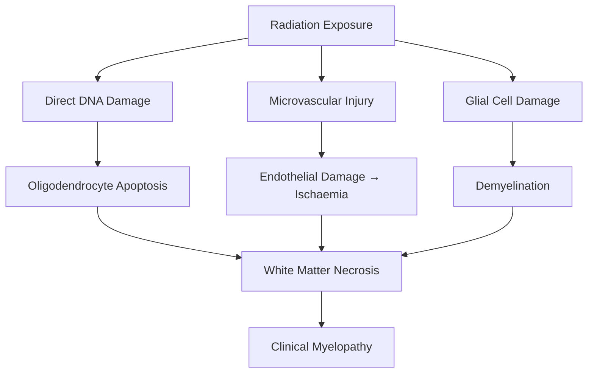
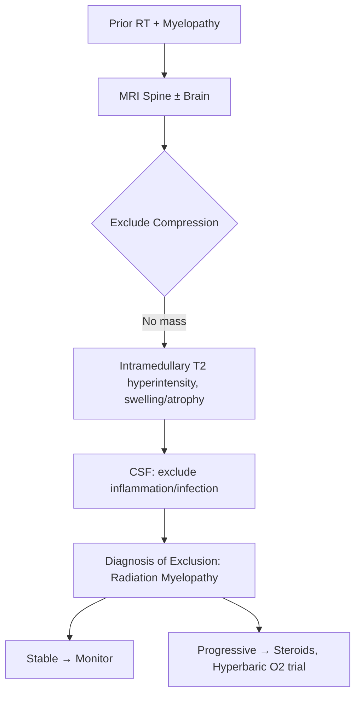

# Radiation Myelopathy

> [!tip] **Definition**
> **Radiation myelopathy** = spinal cord injury following ionising radiation exposure to the cord; two main types — **early transient** (delayed, recovers) and **late chronic/delayed** (irreversible, severe).

> [!tip] **Dose tolerance:** Cord tolerance ≈ 45-50 Gy in conventional fractionation (1.8-2 Gy/fraction); risk rises steeply >55 Gy.

## 1. Definition / Epidemiology / Classification

### Definition
Neurological dysfunction of the spinal cord caused by ionising radiation; latency varies from weeks to years.

### Epidemiology
- **Incidence:** 1-5% with conventional doses; 5-15% with doses >60 Gy
- **Risk factors:** Total dose >45-50 Gy, dose per fraction >2 Gy, large field, prior radiation, chemotherapy (especially intrathecal methotrexate, cisplatin, actinomycin D)
- **Risk per dose:** 0.2% at 50 Gy, 5% at 60 Gy, 50% at 70 Gy (approximate)

### Classification
| Type | Onset | Features | Prognosis |
|------|-------|---------|-----------|
| **Early Transient** | 1-6 months post-RT | Lhermitte's, paresthesiae, no deficit | Full recovery (months) |
| **Delayed/Chronic** | 6 months-many years | Progressive myelopathy | Often irreversible |

## 2. Aetiology / Pathophysiology

### Aetiology
- **Radiotherapy:** Head/neck, thoracic, abdominal, total body irradiation
- **Concurrent chemo (radiosensitisers):** Methotrexate, cisplatin, actinomycin D, bleomycin, cytarabine
- **Risk factors:** Smoking, hypertension, diabetes, advanced age, prior cord insult

### Pathophysiology

### Molecular Basis
- **Early:** Transient demyelination, oligodendrocyte dysfunction, blood-spinal-cord barrier disruption
- **Late:** Vascular endothelial damage (mineralisation, hyalinisation), coagulative necrosis of white matter, astrocytosis
- **Cytokine release:** TNF-α, IL-1, IL-6 promote inflammation
- **Reactive oxygen species:** Lipid peroxidation, DNA damage

## 3. Clinical Features

### History
- **Early transient:** Lhermitte's sign (electric shock down spine on neck flexion), mild paresthesiae, no motor weakness
- **Delayed/chronic:** Progressive weakness, sensory loss, bowel/bladder dysfunction
- **Latency:** Early = 1-6 months; Delayed = 6 months-20 years (median 12-24 months)
- **No pain** (distinguishes from recurrence/compression)

### Examination
| Domain | Early Transient | Late Delayed |
|--------|----------------|--------------|
| **Motor** | Normal | Spastic weakness below level (CST) |
| **Sensory** | Lhermitte's | Spinothalamic + dorsal column loss |
| **Autonomic** | Normal | Bladder/bowel dysfunction |
| **Cranial** | Normal | Normal (helps differentiate) |

### Specific Features
- **Lhermitte's sign:** Electric shock sensation down spine/limbs on neck flexion (regenerates posterior columns)
- **Subacute progressive:** Ascending paralysis (Brown-Séquard-like)
- **Transverse:** Complete cord syndrome

## 4. Diagnostic Approach

### Diagnostic Criteria
- **Prior radiation** to spine including cord
- **Dose** typically >40 Gy
- **Latency** appropriate (early 1-6 mo, late >6 mo)
- **MRI** consistent (cord swelling/T2 hyperintensity, focal enhancement, later atrophy)
- **Exclusion** of compression, recurrence, paraneoplastic, infection

### Severity Assessment
- **ASIA Impairment Scale** A-E
- **Frankel grade** A-E

## 5. Investigations

### First-Line
| Investigation | Indication |
|---------------|------------|
| **MRI spine + gadolinium** | All - exclude compression/recur; shows cord oedema, enhancement, atrophy |
| **MRI brain** | If brain symptoms - exclude mets, leucoencephalopathy |
| **CSF** | Exclude infection, carcinomatous meningitis (cytology, OCB, ACE) |

### MRI Findings
| Phase | Findings |
|-------|----------|
| **Early transient** | Usually normal; may show subtle cord oedema |
| **Delayed (acute)** | Cord swelling, T2/STIR hyperintensity, focal/patchy enhancement |
| **Delayed (chronic)** | Cord atrophy, T2 hyperintensity, ring/haemorrhagic enhancement |
| **Late** | Focal cord atrophy, "pancake" enhancement, cyst formation |

### Laboratory
- Routine: FBC, ESR, CRP, U&E, LFT
- Autoimmune: ANA, ENA, AQP4, MOG (exclude)
- Infection: HIV, syphilis, Lyme
- Paraneoplastic: Anti-Hu, anti-Yo, anti-CRMP5
- CSF: OCB, cytology, ACE

## 6. Differential Diagnosis
| Differential | Distinguishing | Test |
|--------------|---------------|------|
| **Tumour recurrence / mets** | Mass, enhancement, clinical history | MRI, biopsy |
| **Paraneoplastic myelopathy** | Anti-Hu/CRMP5, rapid progression | Antibodies, primary |
| **Transverse myelitis** | Acute, inflammatory, AQP4/MOG | MRI, antibodies |
| **Epidural abscess** | Fever, raised CRP | MRI, cultures |
| **Cord infarct** | Sudden onset, anterior spinal | MRI DWI |
| **SCD** | B12 deficiency, dorsal + CST | B12, MMA |
| **NMOSD** | LETM, optic neuritis | AQP4-IgG |

## 7. Management

### Emergency
- No specific emergency Rx for radiation myelopathy
- **Exclude compression** urgently
- Consider dexamethasone if diagnostic uncertainty or acute progression

### Disease-Modifying
| Strategy | Indication | Evidence |
|----------|-----------|----------|
| **Corticosteroids** (IV methylpred 1g/d ×3-5d) | Acute progression | Variable; used empirically |
| **Hyperbaric oxygen** | Early/late progressive | Mixed; some benefit |
| **Bevacizumab (anti-VEGF)** | Refractory cases (similar to radiation necrosis brain) | Case reports |
| **Heparin/anticoagulation** | Theoretical benefit (microvascular) | Limited evidence |
| **Pentoxifylline + vitamin E** | Antioxidant; mixed evidence | Trial basis |

### Symptomatic
| Symptom | Rx |
|---------|-----|
| **Neuropathic pain** | Gabapentin, pregabalin, amitriptyline |
| **Spasticity** | Baclofen, tizanidine, benzodiazepines |
| **Bladder** | ISC, oxybutynin |
| **Bowel** | Laxatives, bowel programme |
| **DVT prophylaxis** | LMWH, stockings |

### Rehabilitation
- Early physio, OT
- Mobility aids, home modifications
- Psychological support
- Vocational rehab

## 8. Drug Interactions / Contraindications
| Drug | Caution | Management |
|------|---------|-----------|
| **Corticosteroids** | Hyperglycaemia, infection, mood | PPI cover, monitor |
| **Gabapentin** | Sedation, falls | Slow titration |
| **Baclofen** | Sedation, withdrawal on stop | Slow titration |
| **Bevacizumab** | Haemorrhage, hypertension, fistula | Hold pre-surgery |

## 9. Procedures
### Lumbar Puncture
- **Indication:** Exclude carcinomatous meningitis, infection
- **Caution:** With raised ICP or mass effect

### Hyperbaric Oxygen Therapy
- **Indication:** Selected early/late progressive cases
- **Regime:** 2-2.5 ATA ×90-120 min, 30-40 sessions
- **Contraindications:** Untreated pneumothorax, certain chemo drugs (bleomycin, doxorubicin)

## 10. Complications
| Complication | Frequency | Management |
|--------------|-----------|-----------|
| **Permanent paralysis** | 30-50% delayed | Rehab, supportive |
| **Bladder dysfunction** | 30-40% | ISC, monitoring |
| **Pressure sores** | Common | 2-hourly turning |
| **DVT/PE** | 5-10% | LMWH prophylaxis |
| **Spasticity/contractures** | Common | Physio, baclofen |
| **Neuropathic pain** | 30-50% | Gabapentinoids |
| **Respiratory failure** (cervical) | 10-20% | FVC monitoring, intubate |

## 11. Red Flags / Emergencies
| Red Flag | Action | Window |
|----------|--------|--------|
| **New myelopathy post-RT** | Urgent MRI - exclude compression/recur | <24h |
| **Respiratory failure (cervical)** | ICU, intubate | Immediate |
| **Autonomic dysreflexia** | Trigger ID, BP control | Immediate |
| **Sepsis (UTI, pressure sore)** | Antibiotics, source control | <1h |
| **Hypercalcaemia** (concurrent bony mets) | IV fluids, bisphosphonates | <24h |

## 12. Prognosis
- **Early transient:** Excellent - full recovery in 2-9 months
- **Delayed:** Poor - 50% become wheelchair-bound; mortality up to 30% in severe cases
- **Steroid-responsive:** Better outcome
- **Stable at 1 year:** Likely permanent deficit
- **Recovery plateau:** ~18-24 months

## 13. Topic Correlation
| Topic | Link | Overlap |
|-------|------|---------|
| **Spinal Cord Tumours** | [[Spinal Cord Tumours]] | RT indication |
| **Radiation Necrosis (brain)** | [[Radiation Necrosis]] | Similar biology |
| **Transverse Myelitis** | [[Transverse Myelitis]] | AQP4/MOG differential |
| **Paraneoplastic** | [[Paraneoplastic]] | Anti-Hu, anti-CRMP5 |

## 14. Special Situations
| Situation | Consideration |
|-----------|---------------|
| **Pregnancy** | Avoid further RT; MRI without gadolinium |
| **Paediatric** | Higher radiosensitivity; lifelong cancer risk |
| **Elderly** | Lower threshold; consider conservative |
| **Prior cord compression** | Higher risk - careful RT planning |
| **Concurrent chemo** | Methotrexate, cisplatin, actinomycin D increase risk |
| **Re-irradiation** | Cumulative dose <50 Gy; careful planning |

## FCPS/MRCP High-Yield Summary
- **Types:** Early transient (1-6 mo, Lhermitte's, recovery) vs Late delayed (6 mo-20y, irreversible)
- **Tolerance:** Cord ~45-50 Gy conventional; steep rise >55 Gy
- **Mechanism:** Oligodendrocyte apoptosis + vascular endothelial damage + white matter necrosis
- **Clinical:** Lhermitte's (early), progressive myelopathy (late), no pain
- **Diagnosis:** Exclusion - MRI consistent, exclude compression/recur/paraneoplastic
- **Management:** Steroids (acute), hyperbaric O2 trial, bevacizumab (refractory), symptomatic
- **Prognosis:** Early = good; Late = 50% wheelchair-bound
- **Viva:** Cord tolerance 45-50 Gy; Lhermitte's = early; no pain = differentiate from compression

## Viva Questions
1. **Q:** Classify radiation myelopathy.
   **A:** Early transient (1-6 mo, Lhermitte's, recovery) and Late delayed (6 mo-20y, progressive, irreversible).
2. **Q:** Spinal cord radiation tolerance dose.
   **A:** ~45-50 Gy in 1.8-2 Gy fractions; >55 Gy steep risk rise.
3. **Q:** Mechanism of late radiation myelopathy?
   **A:** Vascular endothelial damage + oligodendrocyte apoptosis → white matter necrosis.
4. **Q:** Lhermitte's sign - cause and significance?
   **A:** Electric shock on neck flexion; demyelination of dorsal columns; early radiation myelopathy, also seen in MS, B12 deficiency, cord compression.
5. **Q:** MRI findings in delayed radiation myelopathy?
   **A:** Cord swelling, T2 hyperintensity, focal enhancement (acute) → cord atrophy, focal enhancement, cyst (chronic).
6. **Q:** Why is radiation myelopathy painless?
   **A:** No mass effect or root irritation; differentiates from cord compression and tumour recurrence.
7. **Q:** Management of progressive radiation myelopathy?
   **A:** High-dose steroids, hyperbaric oxygen, bevacizumab (case basis), supportive; prevention is key (dose limitation).
8. **Q:** Risk factors for radiation myelopathy?
   **A:** High total dose, large fraction size, prior cord compression, concurrent chemo (methotrexate, cisplatin), smoking, diabetes, advanced age.
9. **Q:** Differential of myelopathy after radiation?
   **A:** Tumour recurrence, paraneoplastic myelopathy (anti-Hu, anti-CRMP5), transverse myelitis, NMOSD, infection, cord infarct, SCD.
10. **Q:** Is re-irradiation safe?
    **A:** With careful planning; cumulative dose <50 Gy; usually for radiosensitive tumours (lymphoma, germ cell).
11. **Q:** When is hyperbaric oxygen used?
    **A:** Selected early/late progressive cases; mixed evidence; needs specialist centre.
12. **Q:** Bevacizumab in radiation myelopathy?
    **A:** Anti-VEGF; case reports/series show benefit; mechanism similar to radiation necrosis in brain.

## Common Confusions / Exam Traps
| Confusion | Clarification |
|-----------|---------------|
| **Radiation myelopathy vs recurrence** | No pain, focal cord change; exclude compression urgently |
| **Lhermitte's sign** | Non-specific; MS, B12, cord compression, RT all cause |
| **Early vs late prognosis** | Early = good; Late = often permanent |
| **Cord tolerance** | Total dose matters; per-fraction size critical |
| **Concurrent chemo** | Methotrexate, cisplatin, actinomycin D radiosensitise |

## Mnemonics
1. **RADIATE** — **R**adiation, **A**bsent pain, **D**elay, **I**rreversible, **A**trophy, **T**olerance 45 Gy, **E**xclude others
2. **SLOW** — **S**pinal tolerance, **L**ate effects, **O**ligodendrocyte loss, **W**hite matter necrosis
3. **LHERMITTE** — **L**ate, **H**yperexcitable, **E**lectric shock, **R**egenerating posterior columns, **M**yelopathy, **I**n RT, **T**ransient, **T**est flexion, **E**arly sign

## One-Page Revision Card
| Topic | Radiation Myelopathy |
|-------|----------------------|
| **Types** | Early transient (1-6 mo, recovery) vs Late delayed (6 mo-20y, irreversible) |
| **Tolerance** | ~45-50 Gy conventional; >55 Gy = steep risk |
| **Mechanism** | Oligodendrocyte + endothelial damage → white matter necrosis |
| **Clinical** | Lhermitte's (early), progressive myelopathy (late), no pain |
| **Diagnosis** | Exclusion: MRI consistent + rule out compression/recurrence |
| **Management** | Steroids, hyperbaric O2 trial, bevacizumab, supportive |
| **Prognosis** | Early = full recovery; Late = 50% wheelchair-bound |

## Must Know / Should Know / Nice to Know
- **Must:** Two types, cord tolerance dose, Lhermitte's, no pain
- **Should:** Mechanism (vascular + glial), MRI phases, hyperbaric O2
- **Nice:** Bevacizumab, re-irradiation, concurrent chemo sensitizers

## MCQs (10)
1. **Q:** Spinal cord tolerance dose (conventional fractionation)?
   **Options:** A. 20-30 Gy B. 45-50 Gy C. 70-80 Gy D. >100 Gy
   **Answer:** B
2. **Q:** Lhermitte's sign in early radiation myelopathy is due to?
   **Options:** A. Anterior horn B. Corticospinal tract C. Dorsal column demyelination D. Spinothalamic
   **Answer:** C
3. **Q:** Common latency of delayed radiation myelopathy?
   **Options:** A. 1-2 weeks B. 1-6 months C. 6 months-2 years (median 12-24 mo) D. >10 years
   **Answer:** C
4. **Q:** Is pain a feature of radiation myelopathy?
   **Options:** A. Yes, always B. No (helps distinguish from recurrence) C. Only in cervical D. Only in late
   **Answer:** B
5. **Q:** Chemotherapy that radiosensitises the cord?
   **Options:** A. 5-FU B. Methotrexate C. Cyclophosphamide D. Vincristine
   **Answer:** B
6. **Q:** MRI of late chronic radiation myelopathy shows?
   **Options:** A. Cord swelling with oedema B. Cord atrophy with focal enhancement/cyst C. Mass lesion D. Haemorrhage
   **Answer:** B
7. **Q:** First-line treatment of acute progressive radiation myelopathy?
   **Options:** A. Aspirin B. IV methylprednisolone 1g/d C. Plasmapheresis D. IVIG
   **Answer:** B
8. **Q:** Radiation myelopathy is mainly due to damage of?
   **Options:** A. Neurons B. Oligodendrocytes + vascular endothelium C. Schwann cells D. Astrocytes alone
   **Answer:** B
9. **Q:** Bevacizumab in radiation myelopathy acts as?
   **Options:** A. Cytotoxic B. Anti-VEGF (targets vascular injury) C. Anti-inflammatory D. Antioxidant
   **Answer:** B
10. **Q:** Best prevention of radiation myelopathy?
    **Options:** A. Limit total dose to cord <45-50 Gy B. Give steroids C. Hyperbaric O2 D. Avoid chemo
    **Answer:** A

## SBA Questions (10)
1. **Scenario:** Patient had mantle field RT for lymphoma 18 months ago. Now progressive paraparesis, sensory level, no pain. MRI: cord swelling, T2 hyperintensity, patchy enhancement. Diagnosis?
   **Options:** A. Tumour recurrence B. Transverse myelitis C. Radiation myelopathy D. NMOSD
   **Answer:** C
2. **Scenario:** 2 months post neck RT, electric shock sensation on neck flexion. Examination normal. Diagnosis?
   **Options:** A. Delayed radiation myelopathy B. Early transient radiation myelopathy C. Tumour recurrence D. MS
   **Answer:** B
3. **Scenario:** 50-year-old with lung cancer, 50 Gy to mediastinum, 14 months post-RT progressive myelopathy. MRI: focal T2 hyperintensity, no mass. First step?
   **Options:** A. Re-irradiate B. Start steroids + exclude recurrence C. IVIG D. Chemotherapy
   **Answer:** B
4. **Scenario:** Child with medulloblastoma, craniospinal RT 36 Gy, presents 6 years later with progressive myelopathy. Risk factor?
   **Options:** A. Hypothyroidism B. Total dose + chemotherapy sensitiser C. Smoking D. Diabetes
   **Answer:** B
5. **Scenario:** 60-year-old, rectal cancer, pre-op RT 50.4 Gy, 2 years later progressive myelopathy, MRI shows cord atrophy. Most appropriate Rx?
   **Options:** A. Steroids B. Hyperbaric O2 trial + rehab C. Re-irradiation D. Surgery
   **Answer:** B
6. **Scenario:** Patient 3 years post-RT, refractory radiation myelopathy, not responding to steroids. Next trial Rx?
   **Options:** A. IVIG B. Plasmapheresis C. Bevacizumab D. More RT
   **Answer:** C
7. **Scenario:** Cord compression vs radiation myelopathy - which feature favours compression?
   **Options:** A. No pain B. Lhermitte's C. Pain + progressive focal deficit D. Latency >1 year
   **Answer:** C
8. **Scenario:** Nasopharyngeal cancer, 70 Gy to nasopharynx + nodes. 18 months later cervical myelopathy. Why is risk high?
   **Options:** A. Total dose >60 Gy B. Patient age C. Female sex D. Use of steroids
   **Answer:** A
9. **Scenario:** Patient with radiation myelopathy, develops urinary retention, BP 200/110, bradycardia, sweating below lesion. Diagnosis?
   **Options:** A. Sepsis B. Autonomic dysreflexia C. PE D. MI
   **Answer:** B
10. **Scenario:** What cumulative cord dose should limit re-irradiation?
    **Options:** A. 25 Gy B. <50 Gy C. 60 Gy D. 70 Gy
    **Answer:** B

## Flashcards
- **Q:** Cord tolerance? **A:** ~45-50 Gy conventional
- **Q:** Early radiation myelopathy? **A:** 1-6 mo, Lhermitte's, full recovery
- **Q:** Late radiation myelopathy latency? **A:** Median 12-24 mo (6 mo-20 y)
- **Q:** Lhermitte's sign? **A:** Electric shock on neck flexion - dorsal column demyelination
- **Q:** Pain in radiation myelopathy? **A:** No (helps distinguish from compression)
- **Q:** Mechanism? **A:** Oligodendrocyte + endothelial damage → white matter necrosis
- **Q:** First-line Rx acute progressive? **A:** IV methylprednisolone
- **Q:** MRI late chronic? **A:** Cord atrophy + focal enhancement/cyst
- **Q:** Chemo radiosensitiser? **A:** Methotrexate, cisplatin, actinomycin D
- **Q:** Bevacizumab mechanism? **A:** Anti-VEGF for vascular injury

## Answer Key
### MCQs
1. B  2. C  3. C  4. B  5. B  6. B  7. B  8. B  9. B  10. A

### SBAs
1. C  2. B  3. B  4. B  5. B  6. C  7. C  8. A  9. B  10. B

## Summary
**Radiation myelopathy** has two forms: **early transient** (1-6 mo, Lhermitte's, recovers) and **late delayed** (6 mo-20y, irreversible, often progressive). **Cord tolerance** is ~45-50 Gy conventional; risk rises steeply above 55 Gy. Mechanism involves oligodendrocyte and vascular endothelial damage. Diagnosis is one of exclusion - exclude compression, recurrence, paraneoplastic, infection. **Management:** IV methylprednisolone (acute), hyperbaric O2 trial, bevacizumab (refractory), supportive. Prevention through careful RT planning is paramount. Early type has good prognosis; late type has 50% chance of permanent deficit.
