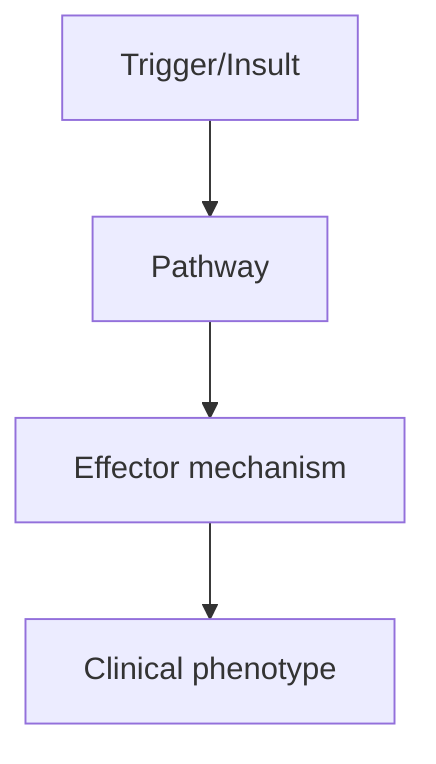
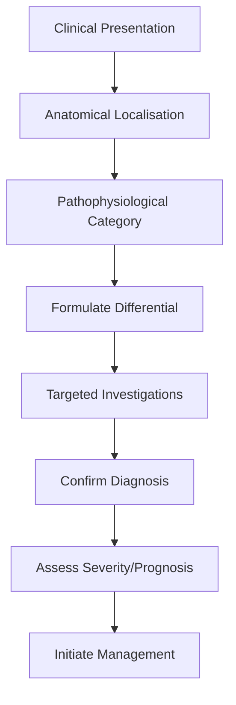
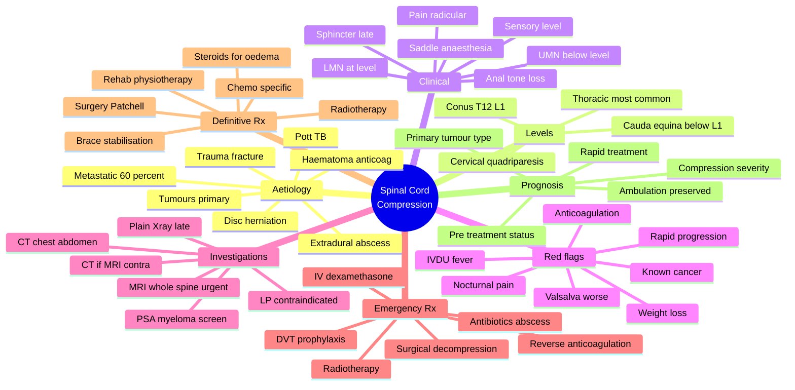

# Spinal Cord Compression

> [!tip] **High-Yield Definition**
> Spinal cord compression: extrinsic compression of spinal cord by mass, causing myelopathy. EMERGENCY - time-critical to prevent permanent neurological deficit. Causes: metastatic (most common, vertebral, epidural), trauma, degenerative (cervical spondylotic myelopathy, disc, OPLL), tumour (primary, ependymoma, meningioma, schwannoma), abscess (epidural, subdural), haematoma (epidural, subdural), cyst (synovial, Tarlov, arachnoid), vascular (AVM, dural AVF).

---

## 1. Definition / Epidemiology / Classification

### Definition
Spinal cord compression: extrinsic compression of spinal cord by mass, causing myelopathy. EMERGENCY - time-critical to prevent permanent neurological deficit. Causes: metastatic (most common, vertebral, epidural), trauma, degenerative (cervical spondylotic myelopathy, disc, OPLL), tumour (primary, ependymoma, meningioma, schwannoma), abscess (epidural, subdural), haematoma (epidural, subdural), cyst (synovial, Tarlov, arachnoid), vascular (AVM, dural AVF).

### Epidemiology
Common. Metastatic: 5-10% of cancer patients (lung, breast, prostate, melanoma, renal, thyroid, multiple myeloma, lymphoma). Degenerative: cervical spondylotic myelopathy (CSM, most common, >60y, 5-10% symptomatic). Trauma: 1-3% of trauma, cervical most common. Epidural abscess: 0.2-2/10,000 hospital admissions, increasing (IV drug use, immunocompromised).

### Classification
| Variant | Key Features | Prognosis |
|---------|-------------|-----------|
| | | |

---

## 2. Aetiology / Pathophysiology

### Aetiology
Metastatic: vertebral body (most common, 85%, breast, lung, prostate, renal, thyroid, multiple myeloma), paravertebral (Pancoast, lymphoma), epidural (lymphoma, prostate, breast, lung), intradural extramedullary (meningioma, schwannoma, ependymoma), intramedullary (ependymoma, astrocytoma, metastasis - rare). Degenerative: cervical spondylosis, disc herniation (acute, large, central, cervical > lumbar), OPLL (ossification posterior longitudinal ligament), DISH (diffuse idiopathic skeletal hyperostosis), degenerative scoliosis, kyphosis. Inflammatory: epidural abscess (Staph aureus 60%, TB, fungal), granulomatous (TB, sarcoid). Traumatic: fracture (compression, burst, dislocation, subluxation), haematoma (epidural - often post-procedural, anticoagulation, spontaneous). Vascular: AVM, dural AVF. Congenital: Chiari malformation, syringomyelia, achondroplasia, mucopolysaccharidosis, Down syndrome. Pathogenesis: mechanical compression, vascular compromise (ASA syndrome, venous congestion), inflammation, demyelination, oedema, ischemia, neuronal death.

### Pathophysiology

---

## 3. Clinical Features

### History
- **Onset/Duration:**
- **Progression:**
- **Key symptoms:**
- **Triggers:**
- **Systemic symptoms:**
- **Drug/Family/Social history:**

### Examination
| Domain | Key Findings | Localisation Value |
|--------|-------------|-------------------|
| | | |

### Specific Clinical Features
Local: back/neck pain (worse at night, mechanical, radicular, tenderness, deformity - kyphosis, scoliosis). Radicular: dermatomal pain, paraesthesia, sensory loss, myotomal weakness. Myelopathic: UMN signs (spasticity, hyperreflexia, Babinski, clonus, spastic gait), sensory level (below lesion, ascending, dissociated sensory loss - syrinx), bladder/bowel dysfunction, sexual dysfunction, gait disturbance, Lhermitte's, paraesthesia. Severity: ASIA A-E. Acute (trauma, haematoma, abscess), subacute (metastasis, abscess), chronic (degenerative, tumour). Cord syndromes: anterior (motor, pain, temperature, posterior spared - vibration, proprioception - ASA syndrome), central (cape - syrinx, dissociated, suspended sensory loss), Brown-Sequard (hemisection, ipsilateral UMN + posterior, contralateral pain/temperature, ipsilateral LMN at level), conus (L1 - mixed UMN/LMN, early bladder/bowel), cauda equina (below L1 - LMN, saddle anaesthesia, bladder, late). Constitutional: weight loss, fever (abscess, malignancy).

---

## 4. Diagnostic Approach / Algorithm

---

## 5. Investigations

EMERGENCY MRI spine with gadolinium (essential, within 24h, ideally sooner): compression, level, severity, cause (epidural, intradural extramedullary, intramedullary, bone, disc), cord signal (myelomalacia, oedema - T2 hyperintensity), enhancement. MRI brain: exclude brain metastases, leptomeningeal. CT spine: if MRI not available, faster, bone detail, fracture. CT chest/abdomen/pelvis: primary (if metastatic unknown). Whole body PET-CT: staging, primary, metastases. Bone scan: metastases, multiple lesions. PSA, CA-125, CA 19-9, AFP, immunoglobulins, SPEP, IFE, urinary Bence Jones: tumour markers. CBC, ESR, CRP, blood cultures: infection (abscess). Coagulation: if haematoma, antiplatelet/anticoagulant history. NCS/EMG: not routine, may help (conus, cauda). Lumbar puncture: CONTRAINDICATED (risk of herniation, can worsen). Exclude: compressive (MRI), vascular (cord infarction, ASA syndrome - MRI may be normal early, follow-up, anterior spinal artery).

---

## 6. Differential Diagnosis

| Differential | Distinguishing Features | Key Test |
|--------------|------------------------|----------|
| | | |

---

## 7. Management

EMERGENCY: high-dose IV dexamethasone 10mg bolus, then 4mg q6h (vasogenic oedema, especially tumour, abscess, disc). Urgent surgical decompression: anterior approach (corpectomy, discectomy, fusion), posterior (laminectomy, fusion), or combined. Best outcomes: surgery within 24-48h, especially for trauma, abscess, haematoma, rapidly progressive. Radiotherapy: emergency for radiosensitive tumours (lymphoma, myeloma, germ cell, small cell lung, breast), stereotactic radiosurgery (SRS) for solitary metastases, conventional external beam (multiple). Chemotherapy: for chemosensitive (lymphoma, germ cell, breast, small cell lung), hormonal (prostate, breast), immunotherapy. Antibiotics: empirical for abscess (ceftriaxone + metronidazole, or vancomycin + ceftriaxone + metronidazole, or ampicillin for Listeria in elderly/immunocompromised, then adjust to culture, TB if endemic, fungal if immunocompromised), 6-8 weeks IV, then oral, may need surgical drainage. Bracing: immobilisation (cervical collar, thoracic brace), may not be definitive. Rehabilitation: critical, intensive, multidisciplinary, physiotherapy, OT, walking aids, bladder (intermittent self-catheterisation), bowel, spasticity (baclofen, tizanidine, gabapentin, intrathecal baclofen, BoNT), pain (gabapentin, pregabalin, amitriptyline, duloxetine), pressure area care, DVT prophylaxis, nutrition. Multidisciplinary: neurosurgery, orthopaedic/spinal surgery, oncology, radiotherapy, infectious diseases, neurology, rehabilitation, OT, PT, SLT, dietitian, urology, palliative, pain, social, psychology. Monitor: ASIA score, MRI, neurological, bladder, bowel, spasticity, pain, pressure areas, DVT, psychological, primary disease.

---

## 8. Drug Interactions / Contraindications / Comorbidity Cautions

| Drug | Interaction / Caution | Management |
|------|----------------------|------------|
| | | |

---

## 9. Procedures (if applicable)

### Procedure:
- **Indications:**
- **Contraindications:**
- **Preparation / Principle:**
- **Complications:**
- **Viva Pearls:**

---

## 10. Complications

| Complication | Frequency | Prevention / Monitoring | Management |
|--------------|-----------|------------------------|------------|
| | | | |

---

## 11. Red Flags / Emergencies

EMERGENCY: rapidly progressive weakness, bladder/bowel dysfunction, sensory level, saddle anaesthesia, constitutional (weight loss, fever). Cord compression is a surgical/radiotherapy emergency - TIME = NEUROLOGICAL FUNCTION. Delay >24-48h = permanent deficit. Urgent MRI spine. Neurological deterioration during treatment: urgent re-imaging, surgery, radiotherapy. Complications: DVT/PE, pressure sores, urinary retention, infection (UTI, pneumonia, line), spasticity, autonomic dysreflexia (above T6, life-threatening), respiratory failure (high cervical, C3-5),

---

## 12. Prognosis

Variable. Pre-treatment: ASIA A (complete) = poor recovery (10-20% regain ambulation). ASIA D-E = better (70-90%). Outcome depends on: pre-treatment neurology, aetiology, time to treatment (decompression within 24h optimal), spinal level, age, comorbidities. Metastatic: median survival 3-12 months (depends on primary). Abscess: mortality 5-15%, depends on timing. Degenerative (CSM): good with surgery (60-80% improve), prevent progression. Rehabilitation: critical for recovery. Multidisciplinary care essential. Genetic counselling: hereditary spastic paraplegia, FTD, motor neuron disease (mimics). Patient and family support. Quality of life depends on neurological outcome.

---

## 13. Topic Correlation

| Related Topic | Link | Key Overlap |
|---------------|------|-------------|
| | | |

---

## 14. Special Situations

| Situation | Consideration |
|-----------|---------------|
| **Pregnancy** | |
| **Lactation** | |
| **Paediatric** | |
| **Elderly / Frail** | |
| **Renal impairment** | |
| **Hepatic impairment** | |
| **Immunocompromised** | |
| **Perioperative** | |
| **Driving / DVLA** | |
| **Occupational** | |

---

## FCPS/MRCP High-Yield Summary

| Category | Key Points |
|----------|------------|
| **Definition** | Spinal cord compression: extrinsic compression of spinal cord by mass, causing myelopathy. EMERGENCY - time-critical to prevent permanent neurological deficit. Causes: metastatic (most common, vertebr |
| **Epidemiology** | Common. Metastatic: 5-10% of cancer patients (lung, breast, prostate, melanoma, renal, thyroid, multiple myeloma, lymphoma). Degenerative: cervical sp |
| **Pathophysiology** | |
| **Clinical** | Local: back/neck pain (worse at night, mechanical, radicular, tenderness, deformity - kyphosis, scoliosis). Radicular: dermatomal pain, paraesthesia, sensory loss, myotomal weakness. Myelopathic: UMN  |
| **Diagnosis** | |
| **Investigations** | EMERGENCY MRI spine with gadolinium (essential, within 24h, ideally sooner): compression, level, severity, cause (epidural, intradural extramedullary, intramedullary, bone, disc), cord signal (myeloma |
| **Management** | EMERGENCY: high-dose IV dexamethasone 10mg bolus, then 4mg q6h (vasogenic oedema, especially tumour, abscess, disc). Urgent surgical decompression: anterior approach (corpectomy, discectomy, fusion),  |
| **Complications** | |
| **Prognosis** | Variable. Pre-treatment: ASIA A (complete) = poor recovery (10-20% regain ambulation). ASIA D-E = better (70-90%). Outcome depends on: pre-treatment neurology, aetiology, time to treatment (decompress |
| **Viva Pearls** | |
| **Drug Doses** | |
| **Scoring Systems** | |
| **Genetics** | |
| **Imaging Signs** | |

---

## Viva Questions (PACES/FCPS Style)

1. **Q:** Define Spinal Cord Compression and classify its variants.
   **A:** Based on the definition above.

2. **Q:** What are the key clinical features?
   **A:** Local: back/neck pain (worse at night, mechanical, radicular, tenderness, deformity - kyphosis, scoliosis). Radicular: dermatomal pain, paraesthesia, sensory loss, myotomal weakness. Myelopathic: UMN signs (spasticity, hyperreflexia, Babinski, clonus, spastic gait), sensory level (below lesion, asce

3. **Q:** What is the first-line treatment?
   **A:** Based on the management section.

4. **Q:** What are the red flags requiring urgent referral?
   **A:** EMERGENCY: rapidly progressive weakness, bladder/bowel dysfunction, sensory level, saddle anaesthesia, constitutional (weight loss, fever). Cord compression is a surgical/radiotherapy emergency - TIME = NEUROLOGICAL FUNCTION. Delay >24-48h = permanent deficit. Urgent MRI spine. Neurological deterior

5. **Q:** What is the prognosis?
   **A:** Variable. Pre-treatment: ASIA A (complete) = poor recovery (10-20% regain ambulation). ASIA D-E = better (70-90%). Outcome depends on: pre-treatment neurology, aetiology, time to treatment (decompression within 24h optimal), spinal level, age, comorbidities. Metastatic: median survival 3-12 months (

6. **Q:** How do you differentiate Spinal Cord Compression from key differentials?
   **A:** Clinical features, investigations, and response to treatment.

7. **Q:** What investigations are most useful?
   **A:** Based on the investigations section.

8. **Q:** Describe the stepwise management approach.
   **A:** Based on the management algorithm.

9. **Q:** What are the emergency presentations?
   **A:** Based on the red flags section.

10. **Q:** How does management change in pregnancy/paediatrics/elderly?
    **A:** Special considerations per population.

---

## Common Confusions / Exam Traps

| Confusion | Clarification |
|-----------|---------------|
| | |

---

## Mnemonics

1. **Acute Cord Compression — "RED FLAGS"** — **R**apid onset pain (worse lying, Valsalva); **E**xamine back in anyone with neurology; **D**examethasone before imaging; **F**ever/IVDU = abscess; **L**evel (sensory level + UMN below); **A**nal tone/saddle anaesthesia (cauda equina); **G**irdle pain, nocturnal pain; **S**urgical emergency if progressive.

2. **Causes by Location "BENT METS"** — **B**one (metastases >50%, breast, lung, prostate, kidney, thyroid, myeloma); **E**pidural abscess (Staph aureus, IVDU); **N**eurofibroma, meningioma, ependymoma; **T**rauma (fracture-dislocation); **M**ultiple myeloma, lymphoma; **E**pidural haematoma (anticoagulation, LP); **T**uberculosis (Pott's spine); **S**pondylotic myelopathy (degenerative, central disc).

3. **Malignant Cord Compression Mnemonic "METS"** — **M**etastases (most common); **E**pidural extension from vertebral body; **T**horacic 70% (small canal); **S**pine MRI whole within 24 h if suspected.

---

## Mind Map

---

## Spaced Repetition Trackers

| Topic | Day 1 | Day 3 | Day 7 | Day 14 | Day 30 | Day 90 |
|-------|-------|-------|-------|-------|--------|--------|
| Red flags: pain, sensory level, sphincter, IVDU | ☐ | ☐ | ☐ | ☐ | ☐ | ☐ |
| MRI whole spine as the diagnostic gold standard | ☐ | ☐ | ☐ | ☐ | ☐ | ☐ |
| IV dexamethasone loading & maintenance dosing | ☐ | ☐ | ☐ | ☐ | ☐ | ☐ |
| Cauda equina vs conus medullaris vs cord lesion | ☐ | ☐ | ☐ | ☐ | ☐ | ☐ |
| Metastatic disease: breast/prostate/lung/myeloma | ☐ | ☐ | ☐ | ☐ | ☐ | ☐ |
| Patchell trial: surgery + RT vs RT alone | ☐ | ☐ | ☐ | ☐ | ☐ | ☐ |
| Epidural abscess: Staph aureus + IVDU + emergency | ☐ | ☐ | ☐ | ☐ | ☐ | ☐ |
| Anticoagulation-related epidural haematoma | ☐ | ☐ | ☐ | ☐ | ☐ | ☐ |
| DVT prophylaxis & bladder/bowel care | ☐ | ☐ | ☐ | ☐ | ☐ | ☐ |
| Prognosis: pre-treatment ambulation is key | ☐ | ☐ | ☐ | ☐ | ☐ | ☐ |

---

## Self-Test Scorecard

| Domain | Score (/5) |
|--------|-----------|
| Definition / Epidemiology / Classification | /5 |
| Aetiology / Pathophysiology | /5 |
| Clinical Features | /5 |
| Diagnostic Approach / Algorithm | /5 |
| Investigations | /5 |
| Differential Diagnosis | /5 |
| Management | /5 |
| Complications | /5 |
| Red Flags / Emergencies | /5 |
| Prognosis | /5 |
| **Total** | **/50** |

---

## MCQs (10)

1. **Question:** A 62-year-old woman with known breast cancer presents with 2 weeks of escalating mid-back pain worse at night and on lying flat. Examination reveals a T6 sensory level, brisk knee reflexes, and bilateral Babinski signs. What is the MOST appropriate next investigation?
   **Options:** A. Lumbar puncture B. Whole-spine MRI with gadolinium C. CT myelography D. Plain thoracolumbar X-ray
   **Answer:** B
   **Explanation:** Urgent whole-spine MRI (with gadolinium) is the gold-standard investigation for suspected malignant spinal cord compression. It identifies the level(s) of compression, distinguishes epidural from intradural/extramedullary, and helps plan surgery/radiotherapy. Plain X-ray and bone scan are inadequate. LP is contraindicated (risk of herniation, obstruction) before decompression.

2. **Question:** Which initial pharmacotherapy should be given empirically in suspected malignant cord compression while awaiting MRI?
   **Options:** A. IV methylprednisolone 1 g daily B. IV dexamethasone 10 mg loading then 4 mg 6-hourly C. IV mannitol 0.5 g/kg D. IV heparin
   **Answer:** B
   **Explanation:** High-dose IV dexamethasone (typically 10 mg IV bolus, then 4 mg every 6 hours, or weight-based 1.5–2 mg/kg loading) reduces vasogenic oedema, may transiently improve neurology, and is started immediately on clinical suspicion of cord compression, even before imaging confirmation (especially if MRI is delayed).

3. **Question:** A patient with known metastatic prostate cancer has MRI showing multi-level thoracic vertebral metastases with cord compression at T7, but no neurological deficit. He is fully ambulant. What is the best management strategy?
   **Options:** A. Best supportive care only B. High-dose dexamethasone plus urgent surgical decompression followed by radiotherapy (Patchell approach) C. Radiotherapy alone D. Chemotherapy only E. Long-term steroids alone
   **Answer:** B
   **Explanation:** The landmark **Patchell trial (Lancet, 2005)** showed that in patients with metastatic epidural spinal cord compression, **direct decompressive surgery + radiotherapy** is superior to radiotherapy alone for preserving ambulation (84% vs 57%) and continence. Even in ambulant patients, surgery improves outcomes for radioresistant tumours (renal, lung, colon, melanoma, sarcoma) or mechanical instability.

4. **Question:** The Patchell randomised controlled trial (2005) demonstrated that in metastatic spinal cord compression:
   **Options:** A. Steroids alone are curative B. Surgery plus radiotherapy is superior to radiotherapy alone for preserving ambulation C. Radiotherapy alone is superior to surgery plus radiotherapy D. Chemotherapy is the most effective modality
   **Answer:** B
   **Explanation:** The Patchell trial randomised patients with MSCC to decompressive surgery + postoperative radiotherapy (30 Gy/10 fractions) vs radiotherapy alone. The combined-modality group had significantly higher rates of post-treatment ambulation (84% vs 57%), maintained continence, and better functional outcomes.

5. **Question:** A 35-year-old IV drug user presents with fever, severe back pain, progressive leg weakness, and urinary retention over 48 hours. Blood cultures are pending. MRI shows an epidural collection from T9–T11 with cord compression. What is the most appropriate immediate management?
   **Options:** A. IV antibiotics + urgent surgical decompression B. Oral flucloxacillin only C. Wait for blood culture results D. Lumbar puncture E. Steroids alone
   **Answer:** A
   **Explanation:** Spinal epidural abscess is a **neurosurgical emergency**. Empiric broad-spectrum IV antibiotics (e.g., ceftriaxone + vancomycin ± metronidazole; cover Staph aureus including MRSA, plus Gram-negatives) and **urgent surgical decompression + drainage** are the standard of care. Delay leads to irreversible paralysis and sepsis. Psoas/posterior abscess may be drained percutaneously in selected cases.

6. **Question:** A 70-year-old man on warfarin for atrial fibrillation develops sudden severe back pain, leg weakness, and urinary retention over 2 hours after a fall. INR is 4.2. MRI confirms epidural haematoma at T10. What is the most appropriate initial management?
   **Options:** A. Continue warfarin and observe B. Reverse anticoagulation urgently (vitamin K, PCC, IV fluids) and refer for urgent surgical decompression C. Lumbar puncture D. Aspirin and physiotherapy E. High-dose methylprednisolone alone
   **Answer:** B
   **Explanation:** Spontaneous or traumatic epidural haematoma causing cord compression is a **neurosurgical emergency**. Anticoagulation must be reversed urgently (IV vitamin K + 4-factor prothrombin complex concentrate [PCC] for warfarin; idarucizumab for dabigatran; andexanet alfa or PCC for rivaroxaban/apixaban). Surgical decompression within hours improves outcome, especially if neurology is incomplete.

7. **Question:** Which of the following is the cardinal clinical feature distinguishing cauda equina syndrome from conus medullaris syndrome?
   **Options:** A. Saddle anaesthesia B. Areflexia and LMN weakness without UMN signs in cauda equina C. Sensory level D. Bladder dysfunction
   **Answer:** B
   **Explanation:** Cauda equina syndrome (compression below L1/2 of lumbosacral nerve roots) presents with **LMN signs only**: flaccid weakness, reduced/absent reflexes (areflexia), saddle anaesthesia, sphincter dysfunction, and radicular pain. **Conus medullaris syndrome** (T12–L2) has a **mixed UMN + LMN** picture (UMN signs in legs, LMN in sacral segments) with early sphincter dysfunction, less severe pain, and symmetrical sensory loss.

8. **Question:** A 60-year-old man with newly diagnosed multiple myeloma presents with sudden paraplegia and a sensory level at T8. MRI shows vertebral collapse with retropulsed bone compressing the cord. What is the BEST treatment strategy?
   **Options:** A. Surgical decompression + stabilisation followed by radiotherapy and systemic myeloma therapy B. Chemotherapy alone C. Long-term steroids only D. Vertebroplasty alone E. Hospice care
   **Answer:** A
   **Explanation:** Acute cord compression from myeloma vertebral collapse requires **urgent surgical decompression and spinal stabilisation** (e.g., posterior pedicle screw fixation), followed by radiotherapy to residual disease and initiation of systemic anti-myeloma therapy (e.g., bortezomib-based regimen). Steroids (dexamethasone) and analgesia are adjuncts.

9. **Question:** Spinal cord compression at the conus medullaris (T12–L2) is most likely to produce:
   **Options:** A. Pure UMN signs in legs with preserved reflexes B. Mixed UMN + LMN signs with early urinary retention/overflow and symmetric saddle sensory loss C. Pure LMN signs without sphincter involvement D. Quadriparesis with diaphragmatic weakness
   **Answer:** B
   **Explanation:** The conus medullaris contains the sacral cord segments (S2–S5) responsible for bladder, bowel, and sexual function. Compression produces a **mixed UMN (legs, brisk reflexes) + LMN (sacral areflexia)** picture, **early** sphincter dysfunction (retention then overflow incontinence), symmetric perianal anaesthesia, and relatively mild pain compared with cauda equina syndrome.

10. **Question:** A patient with known metastatic breast cancer develops painless progressive leg weakness over 4 weeks, with MRI showing cord compression at T4 from vertebral metastasis. She remains ambulant with one crutch. What is her prognosis?
    **Options:** A. All malignant cord compression patients become permanently paralysed B. Pre-treatment ambulatory status is the strongest predictor of post-treatment ambulation C. Patchell trial excludes ambulant patients D. MRI is not useful for prognostication
    **Answer:** B
    **Explanation:** The most important prognostic factor in malignant spinal cord compression is the **neurological status at the time of treatment**: ambulant patients before treatment usually remain ambulant; paraplegic patients rarely recover ambulation. Other prognostic factors: primary tumour (better for breast, prostate, myeloma; worse for lung, renal, melanoma), speed of onset, and duration of deficit.

---

## SBA Questions (10)

1. **Scenario:** A 68-year-old man with known lung cancer presents with severe thoracic back pain, bilateral leg weakness, and urinary retention developing over 24 hours. On examination, power is 2/5 in both legs, tone increased, reflexes brisk, Babinski present bilaterally, sensory level at T8.
   **Question:** What is the most appropriate immediate action before MRI?
   **Options:** A. Lumbar puncture B. Urgent IV dexamethasone (10 mg bolus, then 4 mg q6h) C. IV heparin D. Oral morphine only E. No action; wait for MRI
   **Answer:** B
   **Explanation:** High-dose IV dexamethasone should be started immediately on clinical suspicion of cord compression, before imaging, to reduce vasogenic oedema and preserve neurology. LP is contraindicated; heparin could worsen any epidural bleed.

2. **Scenario:** A 40-year-old man on apixaban for atrial fibrillation presents with sudden paraplegia after coughing. INR 1.3; apixaban level measurable. MRI confirms epidural haematoma T6–T8.
   **Question:** Most appropriate immediate treatment?
   **Options:** A. Continue apixaban B. Reverse apixaban (andexanet alfa or 4-factor PCC) and refer for urgent surgical decompression C. Aspirin D. High-dose steroids only E. Lumbar puncture
   **Answer:** B
   **Explanation:** For direct factor Xa inhibitors (apixaban, rivaroxaban), reversal is with andexanet alfa (where available) or 4-factor PCC. Surgical decompression within 6–12 hours maximises recovery before irreversible cord ischaemia.

3. **Scenario:** A 50-year-old man has MRI showing a dumbbell-shaped schwannoma at L1–L2 compressing the cauda equina, with no neurological deficit.
   **Question:** What is the most appropriate management?
   **Options:** A. Observation only B. Urgent surgical resection of the schwannoma C. Radiotherapy only D. Chemotherapy only E. High-dose steroids only
   **Answer:** B
   **Explanation:** A dumbbell schwannoma compressing the cauda equina, even if asymptomatic, should be resected surgically to prevent progression to cauda equina syndrome. Radiotherapy is reserved for malignant or residual disease.

4. **Scenario:** A 70-year-old woman with known osteoporosis presents with sudden severe back pain after lifting. MRI shows L1 vertebral collapse with retropulsed bone compressing the conus medullaris, but no neurological deficit.
   **Question:** What is the BEST management?
   **Options:** A. Conservative analgesia and brace B. IV antibiotics C. Urgent surgical decompression and stabilisation (vertebroplasty/kyphoplasty if no neurology) D. Chemotherapy E. Observation
   **Answer:** C
   **Explanation:** Acute vertebral collapse with retropulsed fragment compressing the conus, even without deficit, is unstable. Surgical decompression + instrumented stabilisation (with or without vertebroplasty/kyphoplasty) is indicated. Early surgery prevents progression to permanent deficit.

5. **Scenario:** A 32-year-old IVDU presents with fever, severe back pain, and rapidly progressive paraparesis. MRI shows epidural abscess from T9–T11, cord compression.
   **Question:** What is the most appropriate empirical IV antibiotic regimen?
   **Options:** A. IV ceftriaxone + vancomycin ± metronidazole (cover Staph aureus MRSA + Gram-negatives) B. Oral flucloxacillin alone C. IV aciclovir D. IV amoxicillin alone E. Antifungal
   **Answer:** A
   **Explanation:** Empirical IV antibiotics for spinal epidural abscess must cover Staph aureus (including MRSA in IVDU) and Gram-negative organisms. Standard: ceftriaxone 2 g IV daily + vancomycin (trough 15–20 mg/L) ± metronidazole if anaerobes suspected. Antibiotics should be given preoperatively but must NOT delay surgical decompression.

6. **Scenario:** A patient with metastatic breast cancer is on therapeutic low-molecular-weight heparin (enoxaparin 1 mg/kg BD) for VTE. She develops progressive leg weakness over 3 days. MRI shows vertebral metastases with epidural compression at T5.
   **Question:** Most appropriate next step?
   **Options:** A. Continue enoxaparin and arrange surgery B. Stop enoxaparin, reverse with protamine if needed, start IV dexamethasone, and proceed to surgical decompression C. Increase enoxaparin dose D. Lumbar puncture E. Add aspirin
   **Answer:** B
   **Explanation:** In patients on therapeutic anticoagulation with epidural compression, the anticoagulant should be withheld (and reversed with protamine if urgent surgery needed) to reduce risk of epidural haematoma. IV dexamethasone is started, and urgent surgical decompression is performed.

7. **Scenario:** A 55-year-old man with newly diagnosed lung cancer develops painless progressive weakness, numbness, and urinary retention over 2 weeks, with MRI showing a paravertebral mass extending into the spinal canal at T4, compressing the cord.
   **Question:** Best management?
   **Options:** A. Surgical decompression + postoperative radiotherapy B. Observation C. Antibiotics D. Anticoagulation E. Lumbar puncture
   **Answer:** A
   **Explanation:** Malignant epidural compression from paravertebral tumour extension requires surgical decompression (where feasible) plus postoperative radiotherapy. Surgery within 24 hours of paraplegia onset offers the best chance of recovery; radiotherapy alone is reserved for inoperable cases or radiosensitive tumours (lymphoma, myeloma).

8. **Scenario:** A patient with known MSCC from breast cancer becomes paraplegic and incontinent 48 hours ago. She has been on dexamethasone since admission. MRI confirms persistent compression at T6.
   **Question:** What is the most appropriate treatment approach?
   **Options:** A. Surgical decompression is unlikely to restore ambulation; offer palliative radiotherapy and supportive care B. Immediate surgery to reverse paraplegia C. Higher-dose steroids only D. Hyperbaric oxygen E. Lumbar puncture
   **Answer:** A
   **Explanation:** Once paraplegia has been established for >24–48 hours, the chance of meaningful recovery with surgery is very low (<10%). Management shifts to palliative radiotherapy, analgesia, bladder/bowel care, DVT prophylaxis, and supportive care. Early surgery (before paraplegia) is far more effective.

9. **Scenario:** A 75-year-old woman with known breast cancer and MSCC at T4 is admitted for back pain. She is on apixaban, and the on-call team requests 4-hourly neurological observations while awaiting MRI.
   **Question:** Which of the following statements is MOST accurate?
   **Options:** A. Observation is the most appropriate action; MRI can wait B. Clinical suspicion of cord compression requires IMMEDIATE MRI and high-dose dexamethasone while awaiting imaging C. Spinal x-rays are adequate D. Lumbar puncture should be performed urgently E. No intervention needed
   **Answer:** B
   **Explanation:** Spinal cord compression is a clinical emergency. Any patient with suspected cord compression should receive **immediate high-dose IV dexamethasone** and **urgent MRI** (whole spine) without delay. Neurological observations alone are inadequate.

10. **Scenario:** A patient with cord compression develops a painless swollen left calf 5 days after admission.
    **Question:** What is the most appropriate diagnostic test?
    **Options:** A. D-dimer alone B. Compression duplex ultrasound of the leg veins C. MRI whole spine D. CT brain E. Lumbar puncture
    **Answer:** B
    **Explanation:** Bedbound patients with acute cord compression are at very high VTE risk. A painless swollen calf should be evaluated with **compression duplex ultrasound** (first-line for proximal DVT). D-dimer is non-specific. Mechanical prophylaxis (intermittent pneumatic compression) should be started; pharmacologic prophylaxis once bleeding risk is acceptable (usually 24–48 h post-op).

---

## Tags

#neurology #FCPS #MRCP #spinal_cord_compression #MSCC #metastases #MRI #dexamethasone #Patchell #cauda_equina #conus_medullaris #epidural_abscess #haematoma #IVDU #Staph_aureus #radiotherapy #surgical_decompression #myeloma #breast_cancer #lung_cancer

## Local Navigation
**Heading Hub:** [[../Hub]]  
**Chapter Hierarchy:** [[Davidson Chapter 25 - Neurology Hierarchy]]  
**Chapter MOC:** [[Neurology MOC]]  
**Drug Reference:** [[../00_Index/Neurology Drug Reference]]  
