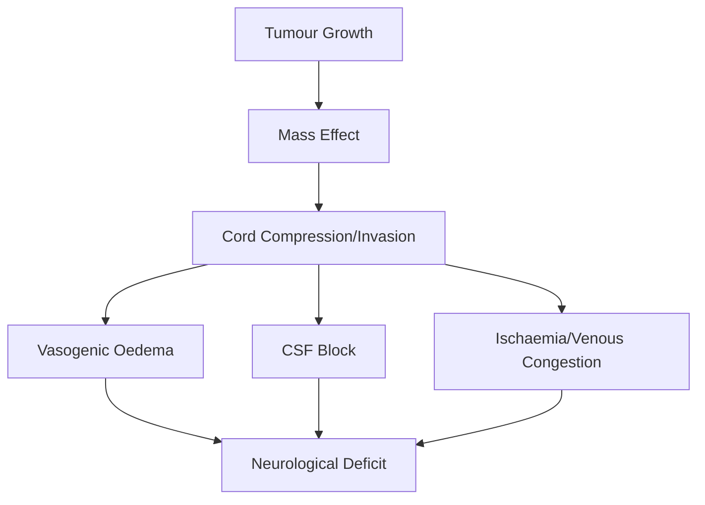
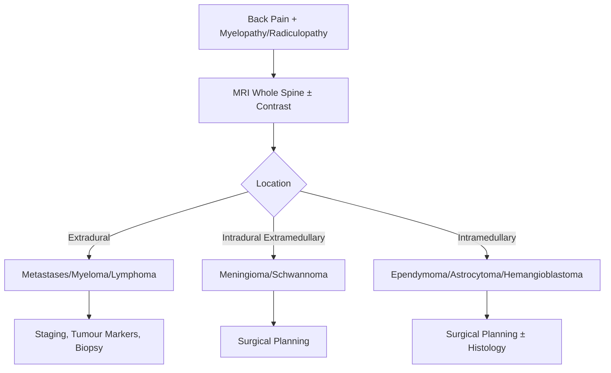

# Spinal Cord Tumours

> [!tip] **Definition**
> **Spinal cord tumours** = neoplasms within (intramedullary), around (intradural extramedullary), or compressing (extradural) the cord. Most are benign; **metastases are common extradural lesions**; intramedullary tumours are rare.

## 1. Definition / Epidemiology / Classification

### Definition
Neoplasms affecting the spinal cord and its coverings; may be primary or secondary.

### Epidemiology
- **Primary CNS tumours:** 0.5-2.5/100,000/year; 5-10% of CNS tumours
- **Metastases:** Most common extradural tumour (50-70%); 5-10% cancer patients develop spinal mets
- **Age:** Ependymoma 30-50y; Astrocytoma bimodal (children + 50-60y); Meningioma 40-70y (♀>>♂); Mets 40-70y; Schwannoma 30-60y
- **Risk factors:** NF1, NF2, VHL, Li-Fraumeni, prior cancer, smoking

### Classification
| Location | Type | Key Features |
|----------|------|-------------|
| **Extradural (epidural)** | Metastases (lung, breast, prostate, kidney, thyroid), myeloma, lymphoma | Most common |
| **Intradural extramedullary** | Meningioma, Schwannoma, Neurofibroma | Slow-growing, well-defined |
| **Intramedullary** | Ependymoma, Astrocytoma, Hemangioblastoma, Metastasis | Cord expansion, central |

## 2. Aetiology / Pathophysiology

### Aetiology
- **Genetic:** NF1 (neurofibroma, astrocytoma), NF2 (meningioma, ependymoma, schwannoma), VHL (hemangioblastoma), Li-Fraumeni (astrocytoma), Turcot (medulloblastoma + polyposis)
- **Environmental:** Prior radiation, chemical exposure
- **Metastatic:** Lung, breast, prostate, renal, thyroid, melanoma, lymphoma, myeloma

### Pathophysiology

### Molecular Basis
- **Ependymoma:** NF2 mutation; chromosome 22 loss
- **Astrocytoma:** IDH1/2 mutations; BRAF in pilocytic
- **Meningioma:** NF2, TRAF7, KLF4, AKT1 mutations
- **Hemangioblastoma:** VHL gene
- **Schwannoma:** NF2 (chromosome 22)
- **Metastases:** TP53, Rb alterations

## 3. Clinical Features

### History
- **Onset:** Slow progressive (benign), subacute (malignant, mets)
- **Pain:** Most common; worse at night, on lying down, on Valsalva (mechanical)
- **Motor:** Progressive weakness, gait disturbance
- **Sensory:** Sensory level, paraesthesia, Lhermitte's sign (cervical)
- **Autonomic:** Bladder/bowel dysfunction (late)
- **Radicular symptoms:** Intradural extramedullary

### Examination
| Domain | Findings | Localisation |
|--------|---------|--------------|
| **Motor** | Spastic weakness below level, UMN signs | CST compression |
| **Sensory** | Level, suspended sensory loss (intramedullary) | Posterior + spinothalamic |
| **Autonomic** | Bladder retention, incontinence | Lateral horn |
| **Spinal tenderness** | Focal = mets, infection | Bone involvement |

### Specific Syndromes
| Syndrome | Features | Tumour |
|----------|---------|--------|
| **Brown-Séquard** | Ipsilateral CST + dorsal; contralateral spinothalamic | Intradural extramedullary |
| **Cape sensory loss** | Spinothalamic loss with preserved dorsal columns | Intramedullary (syrinx, central tumours) |
| **Conus medullaris** | Early sphincter, perianal sensory loss, mixed UMN/LMN | T12-L2 tumours |
| **Cauda equina** | LMN pattern, radicular pain, late sphincter | Below L1-L2 |
| **Foramen magnum** | Suboccipital pain, "around the clock" progression, tongue/UL weakness | Meningioma |

## 4. Diagnostic Approach

### Severity Assessment
- **ASIA A-E** Impairment Scale
- **McCormick** Scale (I-V) - functional status for intramedullary tumours
- **NOMS framework** for metastatic spine (Neurologic, Oncologic, Mechanical, Systemic)

## 5. Investigations

### First-Line
| Investigation | Indication |
|---------------|------------|
| **MRI whole spine + gadolinium** | All - lesion localisation, enhancement pattern |
| **MRI brain** | Suspected mets, drop mets |
| **CT chest/abdomen/pelvis** | Staging for primary/metastatic |
| **PSA, CA 15-3, AFP, βHCG, calcitonin** | Tumour markers |
| **Serum/urine immunofixation** | Myeloma |
| **Whole body PET-CT** | Unknown primary |

### Imaging Findings
| Tumour | MRI Features |
|--------|--------------|
| **Meningioma** | Dural-based, broad attachment, homogeneous enhancement, dural tail, calcification (CT) |
| **Schwannoma** | Ovoid, well-defined, heterogeneous, cyst formation, "dumbbell" through foramen, target sign |
| **Ependymoma** | Central, well-defined, T2 hyperintense, "cap sign" (hypointense haemosiderin) |
| **Astrocytoma** | Eccentric, infiltrative, ill-defined, patchy enhancement, multisegmental |
| **Hemangioblastoma** | Cyst with mural nodule, intensely enhancing nodule, flow voids |
| **Metastasis** | Extradural, vertebral body involvement, soft tissue extension |

### CSF
- Cytology (meningeal carcinomatosis, lymphoma)
- Often contraindicated if obstructive (raised CSF protein - Froin's syndrome)

## 6. Differential Diagnosis
| Differential | Distinguishing | Test |
|--------------|---------------|------|
| **Epidural abscess** | Fever, raised CRP, ring enhancement | Cultures, MRI |
| **Pott's disease** | Gibbus, paravertebral abscess, TB exposure | MRI, GeneXpert |
| **Pachymeningitis** | Multiple dural thickening | IgG4, sarcoidosis |
| **Disc herniation** | Single level, radiculopathy, no myelopathy | MRI |
| **AVM/dural fistula** | Foix-Alajouanine, T2 flow voids | MRA, spinal angiography |
| **Multiple sclerosis** | Short-segment, brain lesions, OCB | MRI |
| **SCD/myelonecrosis** | B12 deficiency, dorsal + CST | B12, MMA |

## 7. Management

### Emergency
| Situation | Action | Time |
|-----------|--------|------|
| **Malignant cord compression** | Dexamethasone 10mg IV bolus → 4mg QDS + urgent MRI + oncology + neurosurgery | <24h |
| **Rapidly progressive deficit** | Urgent surgical decompression ± radiotherapy | <24h |

### Tumour-Specific Management
| Tumour | Primary Rx | Outcome |
|--------|-----------|---------|
| **Meningioma** | Surgical resection (Simpson grade I-II) | 90-100% recurrence-free at 10y |
| **Schwannoma** | Surgical resection | 90% good outcome |
| **Ependymoma** | Surgical resection; radiotherapy if residual/high-grade | 80-90% 5y survival (benign) |
| **Astrocytoma** | Surgical biopsy/debulking + radiotherapy ± chemo | Worse prognosis (infiltrative) |
| **Hemangioblastoma** | Surgical resection (often curative) | Excellent if isolated |
| **Metastasis** | Dexamethasone + radiotherapy (conventional/SBRT) ± surgical decompression (NOMS) | Depends on primary |

### Surgical Approaches
| Approach | Indication |
|----------|------------|
| **Anterior cervical discectomy/corpectomy** | Ventral cervical tumours |
| **Posterior laminectomy/decompression** | Dorsal/lateral tumours, multilevel |
| **Costotransversectomy** | Thoracic ventrolateral |
| **Lateral extracavitary** | Thoracolumbar |
| **En bloc spondylectomy** | Solitary vertebral mets |

### Symptomatic
| Symptom | Rx |
|---------|-----|
| **Pain** | NSAIDs, opioids, gabapentinoids, steroids |
| **Spasticity** | Baclofen, tizanidine |
| **Bladder** | ISC, oxybutynin |
| **DVT prophylaxis** | LMWH, stockings |
| **Constipation** | Laxatives, bowel programme |

## 8. Drug Interactions / Contraindications
| Drug | Caution | Management |
|------|---------|-----------|
| **Dexamethasone** | Hyperglycaemia, mood, osteoporosis, infection | PPI cover, lowest dose |
| **Gabapentin** | Sedation, falls | Slow titration |
| **Methotrexate** | Myelosuppression, hepatotoxicity, mucositis | Folate rescue, monitor LFT/FBC |
| **Bevacizumab** | Haemorrhage, fistula, hypertension | Hold pre-surgery |
| **Temozolomide** | Myelosuppression, pneumonitis | FBC, monitor |

## 9. Procedures
### Spinal Surgery
- **Indications:** Progressive deficit, intractable pain, biopsy, decompression
- **Contraindications:** Poor medical fitness, widespread mets, severe comorbidity
- **Complications:** CSF leak, infection, instability, neurological injury, hardware failure

### Spinal Angiography
- **Indications:** Suspected AVM, pre-operative embolisation of hypervascular tumours (renal cell, thyroid mets)

### Vertebroplasty/Kyphoplasty
- **Indications:** Painful vertebral compression fractures (metastases, myeloma)

## 10. Complications
| Complication | Frequency | Management |
|--------------|-----------|-----------|
| **Post-operative neurological deficit** | 2-5% | Early re-exploration, steroids |
| **CSF leak** | 5-10% | Lumbar drain, re-suture |
| **Wound infection** | 2-5% | Antibiotics, debridement |
| **Spinal instability** | 2-10% | Stabilisation, fusion |
| **Radiation myelitis** | 1-3% (dose-dependent) | Limit dose (<50 Gy to cord) |
| **DVT/PE** | 5-10% | LMWH prophylaxis |
| **Pressure sores** | Common | 2-hourly turning |
| **Autonomic dysfunction** | Common | Bladder/bowel programme |

## 11. Red Flags / Emergencies
| Red Flag | Action | Window |
|----------|--------|--------|
| **Acute cord compression (mets)** | Dexamethasone + MRI + RT/surgery | <24h |
| **Rapid neurological decline** | Urgent surgical decompression | <24h |
| **Pathological fracture with cord compression** | Surgical stabilisation + RT | <24-48h |
| **Suspected meningeal carcinomatosis** | LP cytology, intrathecal chemo | <72h |
| **Hypercalcaemia (mets)** | IV fluids, bisphosphonates, calcitonin | <24h |

## 12. Prognosis
- **Meningioma:** 90% RFS at 10y
- **Schwannoma:** 90% good outcome
- **Ependymoma (benign):** 80-90% 5y survival
- **Astrocytoma (intramedullary):** 50% 5y survival (high-grade worse)
- **Metastases:** Median survival 3-12 months (depends on primary, ambulation, visceral mets)
- **Good:** Ambulatory, single lesion, slow growth, no visceral mets
- **Poor:** Paraplegic, multiple lesions, rapid progression, poor systemic disease

## 13. Topic Correlation
| Topic | Link | Overlap |
|-------|------|---------|
| **Spinal Cord Compression** | [[Spinal Cord Compression]] | Surgical emergency |
| **Degenerative Cervical Myelopathy** | [[Degenerative Cervical Myelopathy]] | Differential |
| **Ependymoma** | [[Ependymoma]] | Most common intramedullary adult |
| **Astrocytoma** | [[Astrocytoma]] | Most common intramedullary child |
| **Multiple Myeloma** | [[Multiple Myeloma]] | Extradural mass |
| **NF2** | [[NF2]] | Schwannoma, meningioma, ependymoma |

## 14. Special Situations
| Situation | Consideration |
|-----------|---------------|
| **Pregnancy** | Meningioma may grow (progesterone receptors); surgery if symptomatic |
| **Paediatric** | Astrocytoma most common; consider NF1; avoid radiation if possible |
| **Elderly** | Higher perioperative risk; consider SBRT for mets |
| **Renal failure** | Avoid nephrotoxic chemo; adjust contrast |
| **Immunocompromised** | CNS lymphoma; consider toxoplasmosis |
| **Prior irradiation** | Avoid re-irradiation; surgery for recurrence |
| **DVLA** | Depends on deficit; usually restricted until stable |

## FCPS/MRCP High-Yield Summary
- **Extradural:** Metastases (lung, breast, prostate, kidney, thyroid) - most common
- **Intradural Extramedullary:** Meningioma (♀>>♂, NF2), Schwannoma (NF2)
- **Intramedullary:** Ependymoma (most common adult, cap sign), Astrocytoma (most common child, NF1, infiltrative), Hemangioblastoma (VHL, cyst + nodule)
- **Presentation:** Pain (worse at night), progressive myelopathy, sensory level
- **Diagnosis:** MRI whole spine + gadolinium
- **Management:** Dexamethasone for compression, surgery for accessible, RT for mets
- **Red Flag:** Malignant cord compression = <24h Rx window
- **Viva:** Ependymoma cap sign; Hemangioblastoma cyst + nodule; Mets NOMS framework

## Viva Questions
1. **Q:** Classify spinal cord tumours by location.
   **A:** Extradural (mets, myeloma, lymphoma), Intradural extramedullary (meningioma, schwannoma), Intramedullary (ependymoma, astrocytoma, hemangioblastoma).
2. **Q:** Most common intramedullary tumour in adults?
   **A:** Ependymoma (myxopapillary at conus/filum); cap sign (haemosiderin) characteristic.
3. **Q:** Most common intramedullary tumour in children?
   **A:** Astrocytoma (often low-grade, pilocytic).
4. **Q:** Spinal meningioma associations and imaging?
   **A:** NF2, females, thoracic; dural-based, broad attachment, homogeneous enhancement, dural tail, calcification.
5. **Q:** Hemangioblastoma features and associations?
   **A:** Cyst with enhancing mural nodule, T2 flow voids; VHL, polycythaemia.
6. **Q:** Management of malignant cord compression?
   **A:** Dexamethasone 10mg IV bolus → 4mg QDS, urgent MRI, oncology + neurosurgery, radiotherapy ± surgical decompression (NOMS).
7. **Q:** NOMS framework for spinal metastases?
   **A:** **N**eurologic (deficit), **O**ncologic (radiosensitivity), **M**echanical (instability, SINS score), **S**ystemic (medical fitness).
8. **Q:** SINS score components?
   **A:** Location, pain, bone lesion type, alignment, vertebral body collapse, posterolateral involvement (0-18; ≥7 unstable).
9. **Q:** What is the cap sign?
   **A:** Hypointense haemosiderin rim at the margins of ependymoma on T2/gradient echo MRI.
10. **Q:** Surgical Simpson grading for meningioma?
    **A:** I (complete + dural attachment), II (complete + coagulation), III (complete + no dural Rx), IV (subtotal), V (biopsy).
11. **Q:** When is surgery indicated for spinal metastases?
    **A:** Isolated lesion, intact neurology, mechanically unstable, radio-resistant, acute compression with patent vertebra.
12. **Q:** McCormick scale for intramedullary tumours?
    **A:** I (normal gait) to V (paraplegic); guides functional status and surgical decision.

## Common Confusions / Exam Traps
| Confusion | Clarification |
|-----------|---------------|
| **Ependymoma vs astrocytoma (MRI)** | Ependymoma central, well-defined, cap sign; astrocytoma eccentric, infiltrative |
| **Meningioma vs schwannoma** | Meningioma: broad dural base, ♀; Schwannoma: ovoid, foraminal, target sign |
| **Mets vs multiple myeloma** | Myeloma: lytic lesions, M-band, Bence-Jones; Mets: solid tumour primary |
| **Extradural mets vs discitis** | Discitis: disc-centred, endplate erosion; Mets: body-centred, pedicle |
| **Brown-Séquard vs hemicord** | Brown-Séquard = cord hemisection (extramedullary); central cord syrinx = suspended sensory loss |

## Mnemonics
1. **EMS — Spinal Tumour Locations** — **E**xtradural (mets), **M**eningioma, **S**chwannoma (intradural extramedullary)
2. **EAT ME — Intramedullary Tumours** — **E**pendymoma, **A**strocytoma, **T**eratoma, **M**etastasis, **E**pendymoma
3. **HEMANGIOBLASTOMA** — **H**ighly vascular, **E**rythrocytosis, **M**ural nodule, **A**ssociated VHL, **N**o recurrence if complete
4. **NOMS** — **N**eurologic, **O**ncologic, **M**echanical, **S**ystemic (spinal mets)
5. **SINS** — **S**pinal **I**nstability **N**eoplastic **S**core

## One-Page Revision Card
| Topic | Spinal Cord Tumours |
|-------|---------------------|
| **Extradural** | Mets (lung/breast/prostate), myeloma, lymphoma |
| **Intradural Extramedullary** | Meningioma (♀, NF2, dural tail), Schwannoma (NF2, target sign) |
| **Intramedullary** | Ependymoma (cap sign, central), Astrocytoma (eccentric, infiltrative), Hemangioblastoma (VHL, cyst + nodule) |
| **Clinical** | Pain (night), progressive myelopathy, sensory level |
| **Diagnosis** | MRI whole spine + gadolinium |
| **Management** | Dexamethasone + surgery/RT, NOMS for mets |
| **Red Flag** | Malignant compression = <24h |

## Must Know / Should Know / Nice to Know
- **Must:** Ependymoma, meningioma, mets, NOMS, dexamethasone for compression
- **Should:** Astrocytoma, schwannoma, hemangioblastoma, SINS, McCormick
- **Nice:** Pilocytic astrocytoma, VHL, molecular markers, en bloc spondylectomy

## MCQs (10)
1. **Q:** Most common intramedullary cord tumour in adults?
   **Options:** A. Astrocytoma B. Ependymoma C. Hemangioblastoma D. Lymphoma
   **Answer:** B
2. **Q:** Spinal meningioma is most common in?
   **Options:** A. Cervical B. Thoracic C. Lumbar D. Conus
   **Answer:** B
3. **Q:** "Cap sign" on MRI is characteristic of?
   **Options:** A. Astrocytoma B. Ependymoma C. Meningioma D. Schwannoma
   **Answer:** B
4. **Q:** Hemangioblastoma is associated with?
   **Options:** A. NF1 B. NF2 C. VHL D. Li-Fraumeni
   **Answer:** C
5. **Q:** Cyst with enhancing mural nodule in cord suggests?
   **Options:** A. Ependymoma B. Astrocytoma C. Hemangioblastoma D. Metastasis
   **Answer:** C
6. **Q:** First medical Rx for malignant cord compression?
   **Options:** A. Morphine B. Dexamethasone 10mg IV bolus C. Gabapentin D. Paracetamol
   **Answer:** B
7. **Q:** SINS score ≥7 indicates?
   **Options:** A. Stable spine B. Unstable spine C. Metastatic disease D. Cord compression
   **Answer:** B
8. **Q:** NOMS framework stands for?
   **Options:** A. Neuro, Onco, Mechanical, Systemic B. Nerve, Outcome, Motor, Spine C. New, Old, Malignant, Stable D. None
   **Answer:** A
9. **Q:** Target sign on MRI of nerve sheath tumour is?
   **Options:** A. Central high, peripheral low signal B. Central low, peripheral high signal C. Homogeneous enhancement D. No enhancement
   **Answer:** A
10. **Q:** Most common extradural spinal tumour?
    **Options:** A. Meningioma B. Schwannoma C. Metastasis D. Lymphoma
    **Answer:** C

## SBA Questions (10)
1. **Scenario:** 40-year-old woman, progressive paraparesis, sensory level T8. MRI: well-defined intradural extramedullary mass at T7, dural tail, homogeneous enhancement. Diagnosis?
   **Options:** A. Ependymoma B. Meningioma C. Schwannoma D. Metastasis
   **Answer:** B
2. **Scenario:** 50-year-old man with von Hippel-Lindau, new back pain. MRI: cyst with enhancing mural nodule in cervical cord. Diagnosis?
   **Options:** A. Astrocytoma B. Ependymoma C. Hemangioblastoma D. Metastasis
   **Answer:** C
3. **Scenario:** 60-year-old, known lung cancer, sudden paraplegia, T5 sensory level. First drug?
   **Options:** A. Morphine B. Dexamethasone 10mg IV C. Mannitol D. Heparin
   **Answer:** B
4. **Scenario:** 35-year-old, myxopapillary tumour at conus, well-defined, central. Diagnosis?
   **Options:** A. Astrocytoma B. Ependymoma C. Hemangioblastoma D. Meningioma
   **Answer:** B
5. **Scenario:** 25-year-old with NF2, multiple intradural extramedullary masses, bilateral vestibular schwannomas. Most likely diagnosis of cord lesion?
   **Options:** A. Meningioma B. Schwannoma C. Ependymoma D. All of the above
   **Answer:** D
6. **Scenario:** 8-year-old child, intramedullary cord lesion, eccentric, ill-defined, patchy enhancement. Diagnosis?
   **Options:** A. Ependymoma B. Astrocytoma C. Hemangioblastoma D. Metastasis
   **Answer:** B
7. **Scenario:** 65-year-old with breast cancer, mechanical back pain, no neurology. CT: lytic lesion L1, no soft tissue. SINS 8. Management?
   **Options:** A. Conservative B. Vertebroplasty/SBRT C. Surgery D. Chemo only
   **Answer:** B
8. **Scenario:** Spinal meningioma, surgical resection, WHO grade I. What is the recurrence rate at 10 years with complete resection?
   **Options:** A. 0-5% B. 10-20% C. 30-40% D. >50%
   **Answer:** A
9. **Scenario:** 45-year-old, foot drop, palpable mass in popliteal fossa, MRI confirms sciatic nerve sheath tumour. NF1 patient. Tumour type?
   **Options:** A. Meningioma B. Schwannoma C. Neurofibroma D. Sarcoma
   **Answer:** C
10. **Scenario:** Post-operative MRI shows residual ependymoma at T-spine. Next step?
    **Options:** A. Observation B. Adjuvant radiotherapy C. Chemotherapy only D. Re-surgery only
    **Answer:** B

## Flashcards
- **Q:** Most common intramedullary adult? **A:** Ependymoma (cap sign)
- **Q:** Most common intramedullary child? **A:** Astrocytoma (often low-grade)
- **Q:** Spinal meningioma associations? **A:** NF2, females, thoracic
- **Q:** Hemangioblastoma associations? **A:** VHL, polycythaemia, cyst + nodule
- **Q:** First drug for malignant cord compression? **A:** Dexamethasone 10mg IV
- **Q:** NOMS framework? **A:** Neurologic, Oncologic, Mechanical, Systemic
- **Q:** SINS score unstable? **A:** ≥7
- **Q:** McCormick scale? **A:** I-V for intramedullary functional status
- **Q:** Cap sign? **A:** Haemosiderin rim in ependymoma
- **Q:** Target sign? **A:** Central high, peripheral low signal in schwannoma

## Answer Key
### MCQs
1. B  2. B  3. B  4. C  5. C  6. B  7. B  8. A  9. A  10. C

### SBAs
1. B  2. C  3. B  4. B  5. D  6. B  7. B  8. A  9. C  10. B

## Summary
Spinal cord tumours are classified as **extradural** (mets - most common), **intradural extramedullary** (meningioma, schwannoma), or **intramedullary** (ependymoma - adult; astrocytoma - child). Presentation is progressive myelopathy with night pain. **MRI whole spine + gadolinium** is diagnostic. Management depends on location and type: surgery for accessible, RT for mets, **dexamethasone** for cord compression. **NOMS framework** guides metastatic spinal disease. Prognosis varies from 90% cure (meningioma) to <12 months (metastases).
