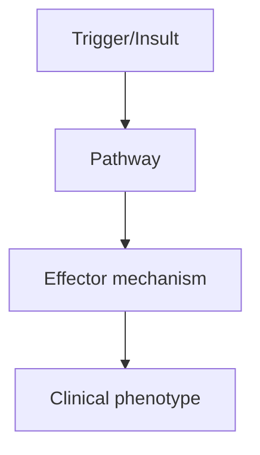
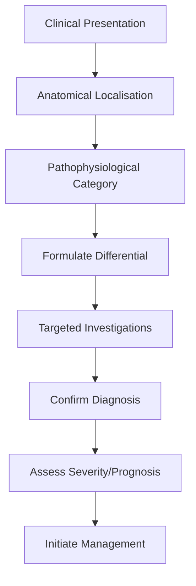
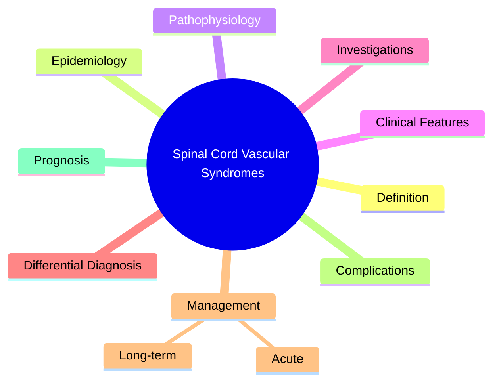

# Spinal Cord Vascular Syndromes

> [!tip] **High-Yield Definition**
> Spinal cord vascular syndromes: disorders of spinal cord vasculature. Spinal cord infarction (ASA syndrome, hyperacute flaccid paralysis), AVM (arteriovenous malformation), dural AVF (dural arteriovenous fistula, Foix-Alajouanine), cavernoma, spinal epidural/subdural haematoma, venous congestion, hypotensive myelopathy. Distinct from compressive, inflammatory, demyelinating causes.

---

## 1. Definition / Epidemiology / Classification

### Definition
Spinal cord vascular syndromes: disorders of spinal cord vasculature. Spinal cord infarction (ASA syndrome, hyperacute flaccid paralysis), AVM (arteriovenous malformation), dural AVF (dural arteriovenous fistula, Foix-Alajouanine), cavernoma, spinal epidural/subdural haematoma, venous congestion, hypotensive myelopathy. Distinct from compressive, inflammatory, demyelinating causes.

### Epidemiology
Spinal cord infarction: 1-2/100,000/year. <1% of all strokes. ASA (anterior spinal artery) syndrome: most common. Causes: aortic (aneurysm, dissection, surgery, atheroma - 30-50%), cardiac (emboli, hypoperfusion), vertebral, fibrocartilaginous embolism (rare, severe, young), hypercoagulable, vasculitis, decompression sickness, scoliosis surgery, cocaine, hypotension. Dural AVF: rare (1-2/100,000/year), most common spinal vascular malformation, 50-60y, M:F 5:1.

### Classification
| Variant | Key Features | Prognosis |
|---------|-------------|-----------|
| | | |

---

## 2. Aetiology / Pathophysiology

### Aetiology
Spinal cord infarction: ASA supplies anterior 2/3 of cord, posterior spinal arteries supply posterior 1/3. ASA occlusion: anterior 2/3 infarct, motor + pain/temperature loss, posterior spared (vibration, proprioception). Causes: aortic (aneurysm, dissection, repair - thoracoabdominal aortic aneurysm repair, endovascular, 5-10% spinal cord ischaemia, atheroma, emboli, hypoperfusion, hypotension), cardiac (AF, endocarditis, valvular, paradoxical), vertebral, hypercoagulable, vasculitis, fibrocartilaginous (disc material emboli, young, severe, Valsalva), iatrogenic (aortic surgery, spinal surgery, scoliosis correction, regional anaesthesia, anticoagulation), cocaine, decompression sickness, vasculitis, sickle cell. Dural AVF: abnormal connection between dural artery and radicular vein, venous hypertension, oedema, hypoperfusion, congestion, cord damage. AVM: abnormal connection, can bleed, mass effect. Cavernoma: low-flow, can bleed. Spinal cord haemorrhage: epidural, subdural, subarachnoid, intramedullary - rare, anticoagulation, AVM, cavernoma, trauma, surgery.

### Pathophysiology

---

## 3. Clinical Features

### History
- **Onset/Duration:**
- **Progression:**
- **Key symptoms:**
- **Triggers:**
- **Systemic symptoms:**
- **Drug/Family/Social history:**

### Examination
| Domain | Key Findings | Localisation Value |
|--------|-------------|-------------------|
| | | |

### Specific Clinical Features
ASA syndrome: hyperacute (minutes, severe), anterior 2/3 infarct, motor (paraplegia, quadriplegia) + pain/temperature loss below level, posterior spared (vibration, proprioception preserved), urinary retention, areflexia (spinal shock, then spasticity, hyperreflexia, Babinski - UMN). Posterior: rare, dorsal column, vibration, proprioception loss. Central: sulcal artery, central cord, bilateral spinothalamic (cape), motor, sacral sparing (corticospinal tract periphery). Venous congestion: insidious, progressive, subacute, mixed UMN/LMN. AVF, dural AVF: progressive myelopathy, sensory, motor, bladder, often elderly, Foix-Alajouanine (necrotising myelopathy). AVM: acute pain, haemorrhage, mass effect. Cavernoma: episodes of bleeding, stepwise.

---

## 4. Diagnostic Approach / Algorithm

---

## 5. Investigations

EMERGENCY MRI spine with gadolinium: T2 hyperintensity, cord swelling, diffusion restriction (DWI, may be limited - cardiac gating, dedicated sequences), 'snake eyes' or 'owl eyes' (central T2 hyperintensity, ASA), 'pencil-shaped' (longitudinal), enhancement, atrophy (chronic), exclude compressive, demyelination. DWI critical (early ischaemia). MRI brain: exclude brain stroke. MRA/CTA aorta: aortic aneurysm, dissection, atheroma. CSF: usually normal early, exclude infection, inflammation. Coagulation, thrombophilia screen, antiphospholipid, ESR, CRP, vasculitis. Echocardiogram: embolic source, AF, valvular. Carotid Doppler, vertebral. Holter. Angiography: spinal angiogram (AVM, dural AVF - gold standard, but invasive). Myelogram: if MRI contraindicated. Vertebral angiogram: feeders, drainage.

---

## 6. Differential Diagnosis

| Differential | Distinguishing Features | Key Test |
|--------------|------------------------|----------|
| | | |

---

## 7. Management

Supportive, no specific treatment. Aortic: urgent aortic repair (dissection, aneurysm, may paradoxically worsen cord ischaemia - spinal drain, CSF pressure monitoring, prevent hypotension, MAP 80-90 mmHg, vasopressors, permissive hypertension, lumbar drain, steroids controversial). Spinal cord ischaemia: maintain MAP 80-100, avoid hypotension, oxygen, ventilation, haemodynamic support, vasopressors, spinal drain (lumbar, CSF pressure <10-15 mmHg, controversial, may prevent), steroids (controversial, may help vasogenic oedema). Dural AVF: endovascular embolisation (first-line, 60-80% success), surgical disconnection (if endovascular fails, or large), stereotactic radiosurgery (smaller, slower). AVM: endovascular, surgical, SRS, combined. Cavernoma: surgical if symptomatic, accessible, progressive. Anticoagulation: controversial, may worsen, often withheld initially (haemorrhagic conversion). Antiplatelet: controversial, may be safe, often continued. Supportive: bladder, bowel, pressure area care, DVT prophylaxis, spasticity, pain, rehabilitation, multidisciplinary. Multidisciplinary: spinal surgery, interventional neuroradiology, vascular surgery, neurology, rehabilitation, OT, PT, SLT, dietitian, urology, social, palliative. Monitor: neurological (ASIA), MRI, bladder, bowel, spasticity, pain, pressure areas, DVT, psychological.

---

## 8. Drug Interactions / Contraindications / Comorbidity Cautions

| Drug | Interaction / Caution | Management |
|------|----------------------|------------|
| | | |

---

## 9. Procedures (if applicable)

### Procedure:
- **Indications:**
- **Contraindications:**
- **Preparation / Principle:**
- **Complications:**
- **Viva Pearls:**

---

## 10. Complications

| Complication | Frequency | Prevention / Monitoring | Management |
|--------------|-----------|------------------------|------------|
| | | | |

---

## 11. Red Flags / Emergencies

EMERGENCY: hyperacute severe myelopathy, ASA syndrome, aortic dissection, aortic surgery (intraoperative spinal cord ischaemia), progressive neurological deterioration, autonomic dysfunction, respiratory failure (high cervical), severe pain, urinary retention, infection. Time-critical: spinal cord ischaemia is a STROKE EQUIVALENT, minutes matter for salvage.

---

## 12. Prognosis

Variable. Spinal cord infarction: poor, 40-50% regain ambulation, depends on severity, time, level. ASA: poor (paraplegia, bladder, respiratory if high). PSA: better (motor preserved, dorsal column). Central: variable. Duraral AVF: treatable, 60-80% improve, may stabilise. AVM: haemorrhage (30-40%, recurrent, morbidity), treatable. Cavernoma: stepwise, episodic, surgical outcome variable. Multidisciplinary care essential. Long-term: monitor, recurrence, function, bladder, spasticity, pain, quality of life. Rehabilitation: critical. Genetic: hereditary haemorrhagic telangiectasia (AVM), CADASIL, sickle cell, coagulopathy.

---

## 13. Topic Correlation

| Related Topic | Link | Key Overlap |
|---------------|------|-------------|
| | | |

---

## 14. Special Situations

| Situation | Consideration |
|-----------|---------------|
| **Pregnancy** | |
| **Lactation** | |
| **Paediatric** | |
| **Elderly / Frail** | |
| **Renal impairment** | |
| **Hepatic impairment** | |
| **Immunocompromised** | |
| **Perioperative** | |
| **Driving / DVLA** | |
| **Occupational** | |

---

## FCPS/MRCP High-Yield Summary

| Category | Key Points |
|----------|------------|
| **Definition** | Spinal cord vascular syndromes: disorders of spinal cord vasculature. Spinal cord infarction (ASA syndrome, hyperacute flaccid paralysis), AVM (arteriovenous malformation), dural AVF (dural arterioven |
| **Epidemiology** | Spinal cord infarction: 1-2/100,000/year. <1% of all strokes. ASA (anterior spinal artery) syndrome: most common. Causes: aortic (aneurysm, dissection |
| **Pathophysiology** | |
| **Clinical** | ASA syndrome: hyperacute (minutes, severe), anterior 2/3 infarct, motor (paraplegia, quadriplegia) + pain/temperature loss below level, posterior spared (vibration, proprioception preserved), urinary  |
| **Diagnosis** | |
| **Investigations** | EMERGENCY MRI spine with gadolinium: T2 hyperintensity, cord swelling, diffusion restriction (DWI, may be limited - cardiac gating, dedicated sequences), 'snake eyes' or 'owl eyes' (central T2 hyperin |
| **Management** | Supportive, no specific treatment. Aortic: urgent aortic repair (dissection, aneurysm, may paradoxically worsen cord ischaemia - spinal drain, CSF pressure monitoring, prevent hypotension, MAP 80-90 m |
| **Complications** | |
| **Prognosis** | Variable. Spinal cord infarction: poor, 40-50% regain ambulation, depends on severity, time, level. ASA: poor (paraplegia, bladder, respiratory if high). PSA: better (motor preserved, dorsal column).  |
| **Viva Pearls** | |
| **Drug Doses** | |
| **Scoring Systems** | |
| **Genetics** | |
| **Imaging Signs** | |

---

## Viva Questions (PACES/FCPS Style)

1. **Q:** Define Spinal Cord Vascular Syndromes and classify its variants.
   **A:** Based on the definition above.

2. **Q:** What are the key clinical features?
   **A:** ASA syndrome: hyperacute (minutes, severe), anterior 2/3 infarct, motor (paraplegia, quadriplegia) + pain/temperature loss below level, posterior spared (vibration, proprioception preserved), urinary retention, areflexia (spinal shock, then spasticity, hyperreflexia, Babinski - UMN). Posterior: rare

3. **Q:** What is the first-line treatment?
   **A:** Based on the management section.

4. **Q:** What are the red flags requiring urgent referral?
   **A:** EMERGENCY: hyperacute severe myelopathy, ASA syndrome, aortic dissection, aortic surgery (intraoperative spinal cord ischaemia), progressive neurological deterioration, autonomic dysfunction, respiratory failure (high cervical), severe pain, urinary retention, infection. Time-critical: spinal cord i

5. **Q:** What is the prognosis?
   **A:** Variable. Spinal cord infarction: poor, 40-50% regain ambulation, depends on severity, time, level. ASA: poor (paraplegia, bladder, respiratory if high). PSA: better (motor preserved, dorsal column). Central: variable. Duraral AVF: treatable, 60-80% improve, may stabilise. AVM: haemorrhage (30-40%, 

6. **Q:** How do you differentiate Spinal Cord Vascular Syndromes from key differentials?
   **A:** Clinical features, investigations, and response to treatment.

7. **Q:** What investigations are most useful?
   **A:** Based on the investigations section.

8. **Q:** Describe the stepwise management approach.
   **A:** Based on the management algorithm.

9. **Q:** What are the emergency presentations?
   **A:** Based on the red flags section.

10. **Q:** How does management change in pregnancy/paediatrics/elderly?
    **A:** Special considerations per population.

---

## Common Confusions / Exam Traps

| Confusion | Clarification |
|-----------|---------------|
| | |

---

## Mnemonics
1. **ASA SYNDROME** — Anterior spinal artery occlusion: bilateral motor + pain/temp loss, dorsal columns SPARED
1. **PSAL** — Posterior spinal artery (rare): dorsal column + dorsal horn (proprioception + deep pain)
1. **AVM/DAVF** — Arteriovenous malformation / dural AV fistula: progressive myelopathy, T2 hyperintensity with flow voids

---

## Mind Map

---

## Spaced Repetition Trackers

| Review Interval | Date | Score (0-5) | Notes |
|-----------------|------|-------------|-------|
| Day 1 | | | |
| Day 3 | | | |
| Day 7 | | | |
| Day 14 | | | |
| Day 30 | | | |
| Day 90 | | | |

---

## Self-Test Scorecard

| Section | Score /5 | Last Attempt |
|---------|----------|--------------|
| Definition & Epidemiology | | |
| Pathophysiology | | |
| Clinical Features | | |
| Investigations | | |
| Differential Diagnosis | | |
| Management | | |
| Complications & Prognosis | | |
| Viva Questions | | |
| MCQs | | |
| SBAs | | |

---

## MCQs (10)

1. **Question:** Anterior spinal artery syndrome features:
   **Options:** A. Bilateral motor + pain/temperature loss; dorsal columns spared B. All sensory + motor C. Dorsal column only D. Brown-Sequard
   **Answer:** A
   **Explanation:** ASA: bilateral corticospinal (motor below level) + spinothalamic (pain/temp) loss. Dorsal columns SPARED. Posterior column preserved.

2. **Question:** ASA territory:
   **Options:** A. Anterior 2/3 of spinal cord (corticospinal + spinothalamic) B. Posterior 1/3 (dorsal column) C. Central cord D. Entire cord
   **Answer:** A
   **Explanation:** ASA supplies anterior 2/3 (corticospinal tracts, spinothalamic tracts, anterior horn cells). Posterior 1/3 supplied by PSAs.

3. **Question:** ASA occlusion most common cause:
   **Options:** A. Aortic surgery (cross-clamp, thoracoabdominal aneurysm repair), aortic dissection, hypotension B. Vertebral fracture C. Infection D. Tumour
   **Answer:** A
   **Explanation:** ASA occlusion: aortic surgery (thoracoabdominal aneurysm, IAA repair, aortic dissection), severe hypotension. Less common: embolus, vasculitis.

4. **Question:** Spinal cord AVM/DAVF features:
   **Options:** A. Progressive myelopathy (Foix-Alajouanine), T2 hyperintensity with flow voids, subarachnoid haemorrhage B. Acute onset C. Sensory only D. Genetic
   **Answer:** A
   **Explanation:** Spinal DAVF: most common spinal vascular malformation. Progressive myelopathy (Foix-Alajouanine). MRI: T2 hyperintensity with prominent flow voids (serpentine).

5. **Question:** Spinal DAVF treatment:
   **Options:** A. Embolisation (endovascular) or surgical disconnection B. Steroids C. Aspirin D. Anticoagulation
   **Answer:** A
   **Explanation:** Spinal DAVF: endovascular embolisation OR surgical disconnection. Aim to interrupt fistula. Steroids and anticoagulation not effective.

6. **Question:** Spinal cord stroke onset:
   **Options:** A. Hyperacute (minutes), severe pain (aortic), bilateral motor B. Slow (weeks) C. Subacute D. Asymptomatic
   **Answer:** A
   **Explanation:** Spinal cord infarct: hyperacute onset (minutes), severe pain, bilateral motor (paraplegia or quadriplegia), often with initial spinal shock (flaccid, areflexic).

7. **Question:** Spinal DAVF MRI findings:
   **Options:** A. T2 hyperintensity + flow voids (serpentine) on cord surface, engorged veins B. Normal C. Tumour D. Cyst
   **Answer:** A
   **Explanation:** Spinal DAVF: T2 hyperintensity (oedema), flow voids (serpentine) on cord surface, intramedullary enhancement. Often mimics tumour.

8. **Question:** PSAL (posterior spinal artery lesion) is:
   **Options:** A. Rare; dorsal column + posterior horn (proprioception, deep pain) B. Common C. Motor only D. Sensory only
   **Answer:** A
   **Explanation:** PSA: rare. Dorsal column (proprioception, vibration) + posterior horn (deep pain). Spares corticospinal and spinothalamic.

---

## SBA Questions (10)

1. **Scenario:** 60y post-thoracoabdominal aneurysm repair, paraplegia, sensory level T8, loss pain/temp, vibration preserved. Diagnosis?
   **Options:** A. Anterior spinal artery syndrome B. Epidural haematoma C. Compressive myelopathy D. Transverse myelitis E. Syringomyelia
   **Answer:** A
   **Explanation:** ASA syndrome: motor + pain/temp loss, dorsal columns spared. Common after aortic surgery.

2. **Scenario:** 60y progressive myelopathy, MRI: thoracic cord T2 hyperintensity with serpiginous flow voids. Diagnosis?
   **Options:** A. Spinal DAVF (dural AV fistula) B. Transverse myelitis C. Tumour D. Syringomyelia E. MS
   **Answer:** A
   **Explanation:** Spinal DAVF: progressive myelopathy, T2 hyperintensity + flow voids (serpentine). Urgent treatment: embolisation or surgery.

3. **Scenario:** Spinal cord infarct, paraplegia, spinal shock. Management?
   **Options:** A. Supportive: DVT prophylaxis, bladder, BP support, rehab B. Surgery C. Stereotactic radiation D. Plasma exchange E. Nothing
   **Answer:** A
   **Explanation:** Spinal cord infarct: supportive. DVT prophylaxis, bladder care, blood pressure, rehab. Some recovery in 30-50%.

---

## Tags

**Tags:** #neurology #spinal-cord #vascular #ASA #DAVF #myelopathy #infarct #FCPS #MRCP

---

## Local Navigation
**Heading Hub:** [[../Compressive & Structural Hub]]
**Chapter Hierarchy:** [[../../Davidson Chapter 25 - Neurology Hierarchy]]
**Chapter MOC:** [[../../Neurology MOC]]
**Drug Reference:** [[../../00_Index/Neurology Drug Reference]]