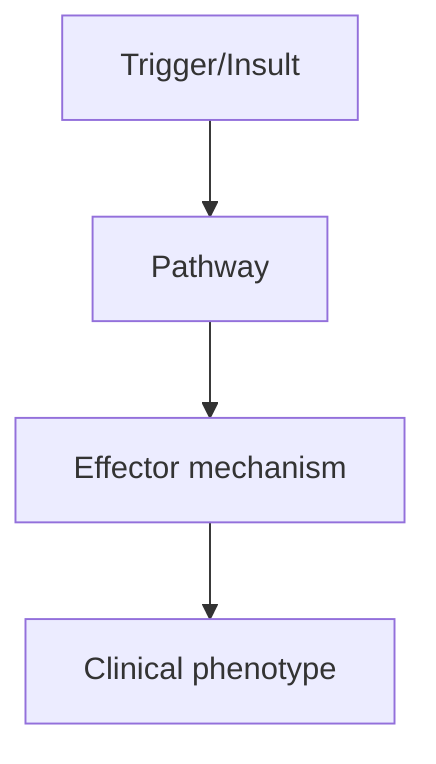
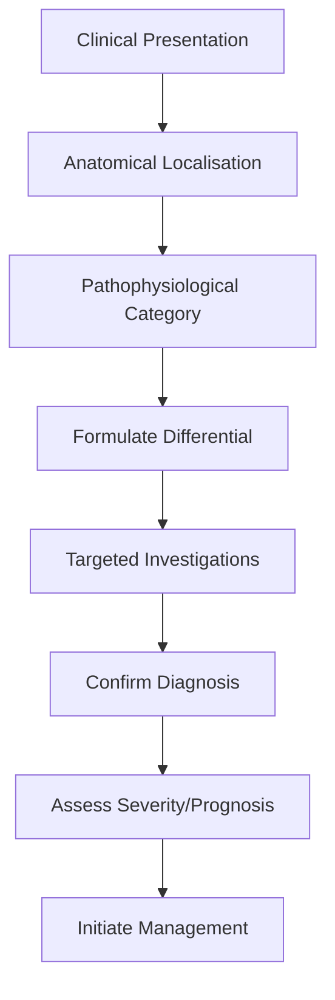

# Subacute Combined Degeneration

> [!tip] **High-Yield Definition**
> Subacute combined degeneration (SCD): B12 deficiency causing demyelination of dorsal columns (sensory ataxia, vibration, proprioception loss) and corticospinal tracts (spastic paraparesis, hyperreflexia, Babinski). Also: spinocerebellar tracts, peripheral nerves (peripheral neuropathy), optic nerves, brain (cognitive, mood). Reversible with treatment if early, irreversible if late.

---

## 1. Definition / Epidemiology / Classification

### Definition
Subacute combined degeneration (SCD): B12 deficiency causing demyelination of dorsal columns (sensory ataxia, vibration, proprioception loss) and corticospinal tracts (spastic paraparesis, hyperreflexia, Babinski). Also: spinocerebellar tracts, peripheral nerves (peripheral neuropathy), optic nerves, brain (cognitive, mood). Reversible with treatment if early, irreversible if late.

### Epidemiology
B12 deficiency: 5-20% of elderly (>65y). SCD: rare, B12 deficiency severe, prolonged. Causes: pernicious anaemia (most common, autoimmune, intrinsic factor antibodies), dietary (vegan, strict, elderly, alcohol), malabsorption (Crohn's, coeliac, ileal resection, pancreatic insufficiency, H. pylori, bacterial overgrowth), drugs (PPIs, metformin, H2 blockers, nitrous oxide - abuse, surgical, recreational - causes functional B12 deficiency). Nitrous oxide abuse: increasing, severe, B12 inactivated, often young, recreational, abuse.

### Classification
| Variant | Key Features | Prognosis |
|---------|-------------|-----------|
| | | |

---

## 2. Aetiology / Pathophysiology

### Aetiology
B12 (cobalamin): cofactor for methionine synthase (homocysteine to methionine, folate metabolism, DNA synthesis) and methylmalonyl-CoA mutase (methylmalonyl-CoA to succinyl-CoA, fatty acid metabolism). Deficiency: impaired methylation (myelin), accumulation of methylmalonic acid and homocysteine (toxic). Demyelination: dorsal columns, corticospinal tracts, spinocerebellar tracts, optic nerves, peripheral nerves, brain. Reversible with treatment if early, irreversible if late (axonal loss, neuronal death).

### Pathophysiology


---

## 3. Clinical Features

### History
- **Onset/Duration:**
- **Progression:**
- **Key symptoms:**
- **Triggers:**
- **Systemic symptoms:**
- **Drug/Family/Social history:**

### Examination
| Domain | Key Findings | Localisation Value |
|--------|-------------|-------------------|
| | | |

### Specific Clinical Features
Insidious onset, progressive. Dorsal columns: sensory ataxia (Romberg+, high-stepping gait, falls), loss of vibration and joint position sense, positive Romberg, pseudoathetosis, paraesthesia (hands, feet). Corticospinal tracts: spastic paraparesis (lower limbs), hyperreflexia, Babinski, spasticity, gait disturbance. Spinocerebellar: ataxia. Peripheral neuropathy: distal, symmetric, sensory > motor. Optic: optic atrophy, visual loss, centrocecal scotoma, RAPD. Brain: cognitive decline, dementia, mood (depression, irritability, psychosis, rare - megaloblastic madness). Autonomic: bladder, bowel (less). Haematological: megaloblastic anaemia (MCV >100, hypersegmented neutrophils, pancytopenia), but SCD may occur without anaemia (50%). Glossitis, angular cheilitis. Other: PML, infertility.

---

## 4. Diagnostic Approach / Algorithm



---

## 5. Investigations

Bloods: FBC (macrocytosis MCV >100, hypersegmented neutrophils, pancytopenia, but normal MCV in 30%), blood film, serum B12 (low <200 ng/L, may be 'low normal' 200-400 with symptoms - check MMA, homocysteine), MMA (methylmalonic acid - elevated in true B12 deficiency, not folate), homocysteine (elevated in B12 and folate deficiency, non-specific), serum folate, RBC folate (better tissue marker), ferritin, iron studies (concurrent iron deficiency masks macrocytosis), LFTs, TFTs, parietal cell antibodies, intrinsic factor antibodies (pernicious anaemia, specific but insensitive), anti-tTG (coeliac). Haematology: blood film, BMA (megaloblastic changes, ring sideroblasts if co-existing iron). Neurological: MRI brain + spine (dorsal column T2 hyperintensity, 'inverted V' sign, posterior column enhancement, no cord swelling, exclude compressive, demyelination, MS). Nerve conduction: axonal neuropathy. Visual evoked potentials: delayed P100 (optic). Gastric: intrinsic factor, parietal cell antibodies, Schilling test (historical), gastrin (atrophic gastritis).

---

## 6. Differential Diagnosis

| Differential | Distinguishing Features | Key Test |
|--------------|------------------------|----------|
| | | |

---

## 7. Management

EMERGENCY if neurological: IV hydroxocobalamin 1mg alternate days x 2 weeks (or 5 doses), then IM 1mg every 3 months (lifelong, if neurological). Loading: IM hydroxocobalamin 1mg alternate days x 2 weeks (5 doses), then 1mg every 3 months (if neurological - maintain higher, if dietary - adjust). Oral cyanocobalamin 1-2mg/day - alternative if IM not possible, sublingual. Treat underlying: pernicious anaemia (lifelong, parenteral), dietary (oral supplementation, B12-fortified foods, balance vegan, dairy, eggs), malabsorption (lifelong), drugs (review - PPIs, metformin, H2 blockers - consider alternative, balance, supplement), nitrous oxide (abstinence, B12 supplementation, may not reverse). Folate: only if deficient, do NOT supplement folate without B12 (worsens neurological). Monitor: B12 (every 6-12 months), FBC, MCV, clinical (neurological - often lags haematological, slow, incomplete if prolonged, may not reverse), MMA, homocysteine. Diet: B12-rich foods (meat, fish, eggs, dairy, fortified - vegans need supplement or fortified). Multidisciplinary: neurologist, haematologist, gastroenterologist, dietitian, pharmacist, primary care. Genetic counselling: pernicious anaemia (familial, autoimmune), genetic B12 malabsorption (Imerslund-Grasbeck, cblC - MMA, homocystinuria), MTHFR (controversial).

---

## 8. Drug Interactions / Contraindications / Comorbidity Cautions

| Drug | Interaction / Caution | Management |
|------|----------------------|------------|
| | | |

---

## 9. Procedures (if applicable)

### Procedure:
- **Indications:**
- **Contraindications:**
- **Preparation / Principle:**
- **Complications:**
- **Viva Pearls:**

---

## 10. Complications

| Complication | Frequency | Prevention / Monitoring | Management |
|--------------|-----------|------------------------|------------|
| | | | |

---

## 11. Red Flags / Emergencies

Severe neurological deficit (dorsal column, corticospinal, optic, cognitive - may be irreversible if prolonged), respiratory failure (rare, severe, cervical), autonomic dysfunction, falls, fractures, suicidal ideation (megaloblastic madness), pancytopenia (severe, infection, bleeding), gastric cancer (pernicious anaemia - 2-3x risk, surveillance), pregnancy (B12 deficiency - neural tube defect, infant B12 deficiency, maternal deficiency, breastfeeding).

---

## 12. Prognosis

Variable. Reversible if treated early, often incomplete if prolonged. Neurological: 50% improve with treatment, 25% partial, 25% no improvement (long-standing, axonal loss, neuronal death). Haematological: rapid recovery (RBC in 1 week, MCV 2 months, neurological 6-12 months - slow, often incomplete). Better prognosis: short duration, young, no axonal loss. Worse: prolonged, severe, elderly, optic, cognitive. Lifelong treatment: pernicious anaemia, malabsorption. Monitor: clinical, B12, FBC, MCV, neurological. Multidisciplinary care essential. Patient education: lifelong, B12-rich diet, recognition of symptoms, surveillance (gastric, breast - pernicious anaemia, malabsorption).

---

## 13. Topic Correlation

| Related Topic | Link | Key Overlap |
|---------------|------|-------------|
| | | |

---

## 14. Special Situations

| Situation | Consideration |
|-----------|---------------|
| **Pregnancy** | |
| **Lactation** | |
| **Paediatric** | |
| **Elderly / Frail** | |
| **Renal impairment** | |
| **Hepatic impairment** | |
| **Immunocompromised** | |
| **Perioperative** | |
| **Driving / DVLA** | |
| **Occupational** | |

---

## FCPS/MRCP High-Yield Summary

| Category | Key Points |
|----------|------------|
| **Definition** | Subacute combined degeneration (SCD): B12 deficiency causing demyelination of dorsal columns (sensory ataxia, vibration, proprioception loss) and corticospinal tracts (spastic paraparesis, hyperreflex |
| **Epidemiology** | B12 deficiency: 5-20% of elderly (>65y). SCD: rare, B12 deficiency severe, prolonged. Causes: pernicious anaemia (most common, autoimmune, intrinsic f |
| **Pathophysiology** | |
| **Clinical** | Insidious onset, progressive. Dorsal columns: sensory ataxia (Romberg+, high-stepping gait, falls), loss of vibration and joint position sense, positive Romberg, pseudoathetosis, paraesthesia (hands,  |
| **Diagnosis** | |
| **Investigations** | Bloods: FBC (macrocytosis MCV >100, hypersegmented neutrophils, pancytopenia, but normal MCV in 30%), blood film, serum B12 (low <200 ng/L, may be 'low normal' 200-400 with symptoms - check MMA, homoc |
| **Management** | EMERGENCY if neurological: IV hydroxocobalamin 1mg alternate days x 2 weeks (or 5 doses), then IM 1mg every 3 months (lifelong, if neurological). Loading: IM hydroxocobalamin 1mg alternate days x 2 we |
| **Complications** | |
| **Prognosis** | Variable. Reversible if treated early, often incomplete if prolonged. Neurological: 50% improve with treatment, 25% partial, 25% no improvement (long-standing, axonal loss, neuronal death). Haematolog |
| **Viva Pearls** | |
| **Drug Doses** | |
| **Scoring Systems** | |
| **Genetics** | |
| **Imaging Signs** | |

---

## Viva Questions (PACES/FCPS Style)

1. **Q:** Define Subacute Combined Degeneration and classify its variants.
   **A:** Based on the definition above.

2. **Q:** What are the key clinical features?
   **A:** Insidious onset, progressive. Dorsal columns: sensory ataxia (Romberg+, high-stepping gait, falls), loss of vibration and joint position sense, positive Romberg, pseudoathetosis, paraesthesia (hands, feet). Corticospinal tracts: spastic paraparesis (lower limbs), hyperreflexia, Babinski, spasticity,

3. **Q:** What is the first-line treatment?
   **A:** Based on the management section.

4. **Q:** What are the red flags requiring urgent referral?
   **A:** Severe neurological deficit (dorsal column, corticospinal, optic, cognitive - may be irreversible if prolonged), respiratory failure (rare, severe, cervical), autonomic dysfunction, falls, fractures, suicidal ideation (megaloblastic madness), pancytopenia (severe, infection, bleeding), gastric cance

5. **Q:** What is the prognosis?
   **A:** Variable. Reversible if treated early, often incomplete if prolonged. Neurological: 50% improve with treatment, 25% partial, 25% no improvement (long-standing, axonal loss, neuronal death). Haematological: rapid recovery (RBC in 1 week, MCV 2 months, neurological 6-12 months - slow, often incomplete

6. **Q:** How do you differentiate Subacute Combined Degeneration from key differentials?
   **A:** Clinical features, investigations, and response to treatment.

7. **Q:** What investigations are most useful?
   **A:** Based on the investigations section.

8. **Q:** Describe the stepwise management approach.
   **A:** Based on the management algorithm.

9. **Q:** What are the emergency presentations?
   **A:** Based on the red flags section.

10. **Q:** How does management change in pregnancy/paediatrics/elderly?
    **A:** Special considerations per population.

---

## Common Confusions / Exam Traps

| Confusion | Clarification |
|-----------|---------------|
| | |

---

## Mnemonics
1. **SCD = B12 deficiency cord disease** — Dorsal column + lateral corticospinal tract demyelination
1. **CAUSES** — Pernicious anaemia (autoimmune, anti-IF), vegan, gastric surgery, metformin, PPIs, metformin, terminal ileum disease (Crohn)
1. **TREATMENT** — IM hydroxocobalamin 1mg alternate days × 2 weeks, then 1mg every 2-3 months

---

## Mind Map

```mermaid
mindmap
  root((Subacute Combined Degeneration (SCD)))
    Definition
    Epidemiology
    Pathophysiology
    Clinical Features
    Investigations
    Differential Diagnosis
    Management
      Acute
      Long-term
    Complications
    Prognosis
```

---

## Spaced Repetition Trackers

| Review Interval | Date | Score (0-5) | Notes |
|-----------------|------|-------------|-------|
| Day 1 | | | |
| Day 3 | | | |
| Day 7 | | | |
| Day 14 | | | |
| Day 30 | | | |
| Day 90 | | | |

---

## Self-Test Scorecard

| Section | Score /5 | Last Attempt |
|---------|----------|--------------|
| Definition & Epidemiology | | |
| Pathophysiology | | |
| Clinical Features | | |
| Investigations | | |
| Differential Diagnosis | | |
| Management | | |
| Complications & Prognosis | | |
| Viva Questions | | |
| MCQs | | |
| SBAs | | |

---

## MCQs (10)

1. **Question:** Subacute combined degeneration affects:
   **Options:** A. Dorsal columns + lateral corticospinal tracts (posterior + lateral columns) B. Anterior horn cells C. Dorsal root ganglia D. Anterior commissure
   **Answer:** A
   **Explanation:** SCD: dorsal column (proprioception, vibration) + lateral corticospinal tract (UMN signs) + sometimes spinothalamic. Spastic paraparesis + sensory ataxia.

2. **Question:** Commonest cause of B12 deficiency in UK:
   **Options:** A. Pernicious anaemia (autoimmune, anti-intrinsic factor) B. Vegan diet C. Gastric surgery D. Metformin
   **Answer:** A
   **Explanation:** UK: pernicious anaemia (autoimmune, anti-IF antibodies) is the most common cause. Anti-parietal cell also positive.

3. **Question:** B12 deficiency neurological features:
   **Options:** A. SCD, peripheral neuropathy, optic atrophy, cognitive impairment, autonomic B. Motor only C. Sensory only D. Cerebellar only
   **Answer:** A
   **Explanation:** B12 neuropathy: SCD (dorsal column + corticospinal), peripheral neuropathy (axonal), optic atrophy, dementia, autonomic.

4. **Question:** MCV in B12 deficiency:
   **Options:** A. Macrocytic (high MCV >100 fL) - megaloblastic B. Microcytic C. Normocytic D. Variable
   **Answer:** A
   **Explanation:** B12 deficiency: macrocytic (MCV >100). B12/folate deficiency → impaired DNA synthesis → megaloblastic. May have pancytopenia.

5. **Question:** B12 deficiency without anaemia:
   **Options:** A. Possible (neurological first in 25-30%) B. Never C. Always anaemia D. Only with iron
   **Answer:** A
   **Explanation:** B12 deficiency: neurological features can occur WITHOUT anaemia (25-30% of neurological cases). Always check B12 if suspicious.

6. **Question:** Holo-TC (holotranscobalamin) vs B12:
   **Options:** A. Holo-TC = active form; better marker of cellular B12 status B. Same C. B12 better D. Not useful
   **Answer:** A
   **Explanation:** Holo-TC: active B12 form taken up by cells. Better marker of tissue B12 (especially when borderline).

7. **Question:** Methylmalonic acid (MMA) and homocysteine in B12 deficiency:
   **Options:** A. Both elevated in B12; only homocysteine elevated in folate deficiency B. Only MMA C. Only homocysteine D. Both normal
   **Answer:** A
   **Explanation:** B12: ↑ MMA AND ↑ homocysteine. Folate: ↑ homocysteine only (MMA normal). Differentiates.

8. **Question:** Treatment of SCD:
   **Options:** A. IM hydroxocobalamin 1mg alternate days × 2 weeks, then 1mg every 2-3 months lifelong B. Oral B12 only C. Single IM dose D. Transfuse
   **Answer:** A
   **Explanation:** SCD: IM hydroxocobalamin 1mg alternate days × 2 weeks (loading), then 1mg every 2-3 months lifelong. Monitor for hypokalaemia (K+ drop with B12).

9. **Question:** Neurological recovery after B12 replacement:
   **Options:** A. Variable; better if early; neurological may not fully reverse B. Always complete C. Never D. Progressive
   **Answer:** A
   **Explanation:** SCD recovery: variable. Better if treated early (<6 months). Long-standing SCD may not fully reverse. Haematological recovery always.

---

## SBA Questions (10)

1. **Scenario:** 60y, progressive spastic paraparesis + sensory ataxia, MCV 110, Hb 9.0. Cause?
   **Options:** A. B12 deficiency (SCD) B. MS C. Compressive myelopathy D. HSP E. MND
   **Answer:** A
   **Explanation:** SCD: B12 deficiency. Macrocytosis + anaemia + dorsal column + corticospinal signs. Check B12, anti-IF, MMA, homocysteine.

2. **Scenario:** B12 deficiency treatment - why IM not oral?
   **Options:** A. Pernicious anaemia has no intrinsic factor; oral B12 poorly absorbed; IM bypasses B. Cheaper C. Faster D. No reason E. Patient preference
   **Answer:** A
   **Explanation:** Pernicious anaemia: no intrinsic factor → oral B12 not absorbed (B12 needs IF for ileal absorption). IM bypasses gut.

3. **Scenario:** Patient on metformin 5 years, MCV rising, B12 borderline. Action?
   **Options:** A. Add oral calcium + B12 supplementation OR switch (consider B12 IM if symptomatic) B. Stop metformin C. No action D. Iron E. Folic acid only
   **Answer:** A
   **Explanation:** Metformin: ↓ B12 absorption (calcium-dependent). Long-term use: B12 deficiency risk. Consider calcium + B12 supplement or B12 monitoring/IM.

---

## Tags

**Tags:** #neurology #spinal-cord #B12 #pernicious-anaemia #SCD #megaloblastic #hydroxocobalamin #FCPS #MRCP

---

## Local Navigation
**Heading Hub:** [[../Inflammatory Infectious & Metabolic Hub]]
**Chapter Hierarchy:** [[../../Davidson Chapter 25 - Neurology Hierarchy]]
**Chapter MOC:** [[../../Neurology MOC]]
**Drug Reference:** [[../../00_Index/Neurology Drug Reference]]