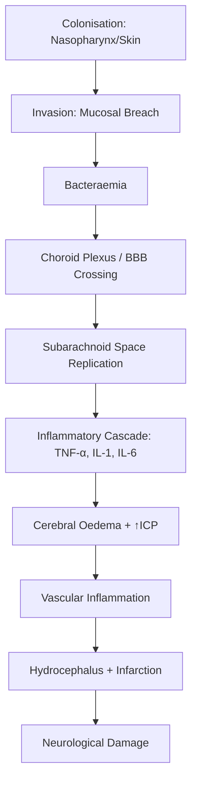
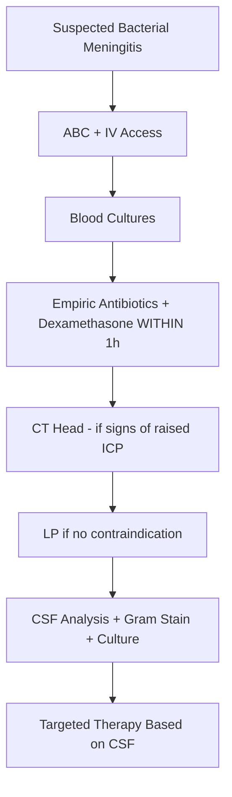
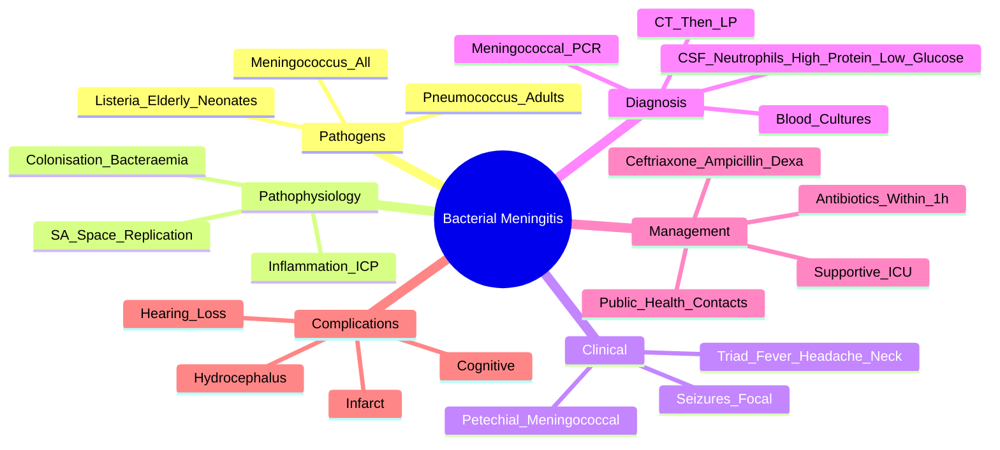

# Acute Bacterial Meningitis

> [!tip] **Bacterial meningitis = medical emergency: headache + fever + meningism ± altered consciousness**
> **Empiric antibiotics WITHIN 1 HOUR**: **Ceftriaxone 2g IV q12h + Dexamethasone 10mg IV q6h** (before/with antibiotics)
> **Listeria (>50y)**: add **Ampicillin/Amoxicillin 2g IV q4h**

## 1. Definition / Epidemiology / Classification

### Definition
Acute bacterial infection of the meninges and subarachnoid space, presenting with meningeal irritation, systemic infection, and CSF pleocytosis.

### Epidemiology
- **Incidence:** 1-3/100,000/year (developed); higher in low-income
- **Case fatality:** 10-30% (developed countries); up to 50% in low-income
- **Sequelae:** 30-50% survivors have neurological deficits (hearing loss, cognitive, seizures)
- **Age:** Bimodal (infants + young adults + elderly)

### Pathogens by Age/Risk
| Group | Common Pathogens |
|-------|------------------|
| **Neonates (0-3m)** | Group B Streptococcus, E. coli, Listeria monocytogenes |
| **Infants/Children (3m-6y)** | **N. meningitidis, S. pneumoniae, H. influenzae** |
| **Adults 6-50y** | **S. pneumoniae, N. meningitidis** |
| **Elderly (>50y)** | **S. pneumoniae, N. meningitidis, Listeria**, Gram-negatives |
| **Immunocompromised** | Listeria, Gram-negatives, Cryptococcus, TB, CMV |
| **Post-neurosurgery/trauma** | S. aureus, S. epidermidis, Gram-negatives, S. pneumoniae |
| **CSF shunt** | S. epidermidis, S. aureus |

### Classification
| Type | Features |
|------|----------|
| **Community-acquired** | Most common; pneumococcal/meningococcal |
| **Nosocomial** | Post-surgical, shunt; S. aureus, Gram-negatives |
| **Recurrent** | Anatomical defect (skull base fracture), complement deficiency, asplenia |

---

## 2. Aetiology / Pathophysiology

### Aetiology / Risk Factors
- **Meningococcus (N. meningitidis):** Young adults, outbreaks, close contact (dorms, military)
- **Pneumococcus (S. pneumoniae):** All ages, elderly, alcohol, splenectomy, complement deficiency
- **Listeria:** Elderly, neonates, pregnancy, immunocompromised (steroids, transplant)
- **H. influenzae type b:** Now rare (Hib vaccine); unimmunised children
- **M. tuberculosis:** See TB meningitis chapter

### Pathophysiology

### Pathology
- **Acute:** Purulent exudate over convexity (pneumococcal) or base (TB, Listeria, meningococcal)
- **Cerebral oedema, ventriculitis, vasculitis, infarcts**
- **Hydrocephalus** (acute obstructive or chronic communicating)

---

## 3. Clinical Features

### Classic Triad — **All 3 in only ~50%**
- **Fever** (>38°C)
- **Headache** (severe, generalised)
- **Meningism** (neck stiffness ± photophobia)

### Other Features
- **Altered consciousness** (lethargy → coma)
- **Nausea/vomiting**
- **Seizures** (20-30%)
- **Focal neurology** (cranial nerve, hemiparesis) — vascular complication
- **Rash** — **petechial/purpuric** (N. meningitidis)
- **Septic shock** (fulminant meningococcaemia)

### Specific Signs
| Sign | Description |
|------|-------------|
| **Neck stiffness** | Resistance to passive neck flexion |
| **Kernig's sign** | Resistance/pain on knee extension with hip flexed to 90° |
| **Brudzinski's sign** | Hip/knee flexion on passive neck flexion |
| **Bulging fontanelle** | Infants |

### Septicaemia Features (Meningococcal)
- **Petechial rash** (non-blanching)
- **Hypotension, shock**
- **DIC, multi-organ failure**
- **Waterhouse-Friderichsen syndrome:** Adrenal haemorrhage (fulminant meningococcaemia)

---

## 4. Diagnostic Approach / Algorithm

### Indications for CT Before LP (NICE NG240)
**CT BEFORE LP if:**
- **Immunocompromised**
- **History of CNS disease** (tumour, stroke, focal infection)
- **New-onset seizure** (within 1 week)
- **Papilloedema**
- **Abnormal level of consciousness**
- **Focal neurological deficit**
- **Severe headache + vomiting**

**If CT delayed:** Empiric antibiotics + dexamethasone IMMEDIATELY

---

## 5. Investigations

### Immediate
| Test | Indication | Expected Finding |
|------|------------|------------------|
| **Blood cultures** | All (before antibiotics if possible) | Organism identification |
| **FBC, U&E, CRP, lactate, glucose** | All | ↑WCC, ↑CRP, ↑lactate, glucose for ratio |
| **Clotting** | DIC risk (petechiae) | Platelets, PT/APTT |
| **Meningococcal PCR (blood)** | Petechial rash | N. meningitidis DNA |

### Lumbar Puncture (CSF)
| Parameter | Normal | Bacterial | Viral | TB/Fungal |
|-----------|--------|-----------|-------|-----------|
| **Opening pressure** | 6-20 cmH₂O | ↑↑ (>30) | ↑ (≤25) | ↑↑ |
| **Appearance** | Clear | **Turbid/purulent** | Clear | Clear/viscous |
| **WCC (cells/μL)** | <5 | **>1000** (neutrophils) | 10-500 (lymphs) | 100-500 (lymphs) |
| **Protein (g/L)** | 0.15-0.45 | **>1.0** | 0.5-1.0 | 1-5 |
| **CSF:Serum glucose** | >0.6 | **<0.4** | >0.6 | <0.3 |
| **Lactate** | <2 mmol/L | **>4 mmol/L** | <2.5 | Variable |

### CSF Special Tests
- **Gram stain:** Rapid (positive in 80%)
- **Bacterial culture:** Gold standard for sensitivity
- **Bacterial PCR:** 16S rRNA, meningococcal/pneumococcal
- **Antigen detection:** Latex agglutination (rarely used)

### Imaging
- **CT Head:** Before LP if signs of raised ICP (above); also for focal neurology
- **MRI Brain:** If complications suspected (cerebritis, abscess, infarct)

---

## 6. Differential Diagnosis
| Condition | Distinguishing Feature |
|-----------|----------------------|
| **Viral meningitis** | Less severe; lymphocytic CSF; self-limiting |
| **Encephalitis** (HSV) | Altered consciousness, focal features, seizures; CSF PCR |
| **Subarachnoid haemorrhage** | Sudden onset, "thunderclap", xanthochromia |
| **Brain abscess** | Focal neurology, ↑ICP, ring-enhancing lesion |
| **TB meningitis** | Subacute, basal meningeal enhancement, lymphocytic CSF |
| **Cryptococcal meningitis** | HIV, indolent, lymphocytic CSF, India ink |
| **Autoimmune encephalitis** | Subacute, psychiatric, NMDA-R antibodies |
| **Cerebral venous thrombosis** | Headache, seizures, focal deficits, MRV/CTV |
| **Acute confusional state** | No meningism; rule out meningitis |

---

## 7. Management

### Emergency — **First Hour Critical**
| Action | Timing | Detail |
|--------|--------|--------|
| **ABCs** | Immediate | Airway, breathing, circulation |
| **IV access** | Immediate | Two large-bore cannulae |
| **Blood cultures** | Immediate | Before antibiotics if possible (don't delay) |
| **Empiric antibiotics** | **Within 1 hour** | See dosing below |
| **Dexamethasone** | **Before/with antibiotics** | ↓ mortality and hearing loss (esp. pneumococcal) |
| **CT Head** | Before LP if any indications | |
| **LP** | After CT if needed; do NOT delay antibiotics | Send CSF for analysis |
| **Notify public health** | If meningococcal | Prophylaxis for contacts |

### Empiric Antibiotic Therapy (BTS 2016 / NICE NG240)
| Group | Antibiotics | Dose |
|-------|-------------|------|
| **Adults 18-50y** | **Ceftriaxone** | 2g IV q12h |
| **Adults >50y OR immunocompromised** | **Ceftriaxone + Ampicillin/Amoxicillin** (Listeria cover) | Ceftriaxone 2g q12h + Ampicillin 2g IV q4h |
| **Penicillin-allergic** | Chloramphenicol + Vancomycin (or Meropenem if severe) | |
| **Post-neurosurgery/trauma/shunt** | **Vancomycin + Meropenem/Ceftazidime** | Vancomycin + Meropenem 2g IV q8h |
| **Very severe (penicillin + cephalosporin allergy)** | Meropenem + Vancomycin | |
| **Pregnancy** | Ceftriaxone (avoid chloramphenicol in 3rd trimester) | |

### Dexamethasone
- **Dose:** **10mg IV q6h** for 4 days
- **Timing:** **Before or WITH first antibiotic dose** (reduces inflammatory cascade)
- **Benefit:** ↓ mortality (pneumococcal), ↓ hearing loss, ↓ neurological sequelae
- **Continue if:** Pneumococcal confirmed; STOP if Listerella, mycobacterial, viral

### Targeted Therapy (Once Organism Known)
| Organism | First-line | Alternative |
|----------|-----------|-------------|
| **N. meningitidis** | Benzylpenicillin 2.4g IV q4h OR Ceftriaxone | Chloramphenicol |
| **S. pneumoniae** (sensitive) | Benzylpenicillin OR Ceftriaxone | Vancomycin + Ceftriaxone if resistant |
| **S. pneumoniae (resistant)** | Vancomycin + Ceftriaxone | Meropenem |
| **L. monocytogenes** | **Ampicillin + Gentamicin** | Meropenem |
| **H. influenzae** | Ceftriaxone | Chloramphenicol |
| **S. aureus (MSSA)** | Flucloxacillin | Vancomycin |
| **S. aureus (MRSA)** | Vancomycin | Linezolid |
| **Gram-negatives** | Ceftriaxone | Meropenem |

### Duration
- **N. meningitidis:** 7 days
- **H. influenzae:** 7-10 days
- **S. pneumoniae:** 10-14 days
- **Listeria:** 21 days
- **Gram-negatives:** 21 days

### Supportive Care
- **IV fluids:** Cautious (↑ICP risk; isotonic preferred)
- **Seizures:** Anticonvulsants (levetiracetam, phenytoin)
- **Hyponatraemia:** SIADH common; fluid restriction; avoid hypotonic fluids
- **Acetazolamide / Mannitol:** For ↑ICP
- **DVT prophylaxis**
- **ICU:** Severe cases, ventilation

### Public Health (Meningococcal)
- **Notify:** Public Health England / local health authority (statutory)
- **Close contact prophylaxis:**
  - **Ciprofloxacin 500mg PO single dose** (adults)
  - **Rifampicin 600mg PO q12h ×2 days**
  - **Ceftriaxone 250mg IM single dose** (pregnancy)
- **Vaccination:** ACWY + B (UK schedule); outbreak response

### Complications Management
| Complication | Management |
|--------------|------------|
| **Hydrocephalus** | Shunting (VP shunt) |
| **Cerebral infarct** | Supportive; consider vascular imaging |
| **Subdural empyema** | Neurosurgical drainage |
| **Hearing loss** | Audiometry; cochlear implant consideration |
| **Seizures** | Anticonvulsants |

---

## 8. Drug Interactions / Cautions
- **Ceftriaxone + Calcium (IV):** Precipitate (do not co-administer)
- **Gentamicin:** Nephrotoxicity, ototoxicity; monitor levels
- **Vancomycin:** Nephrotoxicity; trough monitoring (15-20 mg/L)
- **Dexamethasone + quinolones:** ↑ Tendon rupture
- **Pregnancy:** Avoid chloramphenicol (3rd trimester - grey baby)

---

## 9. Procedures
### Lumbar Puncture
- **Indication:** Suspected meningitis (after CT if needed)
- **Timing:** After blood cultures; do not delay antibiotics
- **Contraindications:** Raised ICP signs (above), coagulopathy, thrombocytopenia, spinal lesion
- **Complications:** Post-LP headache (10-30%), infection, bleed, herniation (if ↑ICP)

### CT Head
- **Indication:** Indications for CT before LP; complications (infarct, abscess, hydrocephalus)
- **Findings:** May be normal early; effacement of sulci, ventricular enlargement (late)

### Hearing Assessment
- **Indication:** All survivors (esp. pneumococcal)
- **Test:** Audiometry, ABR if needed

---

## 10. Complications
| Complication | Frequency | Prevention/Management |
|--------------|-----------|----------------------|
| **Hearing loss** | 10-30% (esp. pneumococcal) | Dexamethasone; audiology |
| **Cognitive impairment** | 20-30% | Rehabilitation |
| **Seizures** | 20-30% (acute), 5-10% (chronic) | Anticonvulsants |
| **Hydrocephalus** | 5-10% | Shunt |
| **Cerebral infarct** | 10-20% | Supportive |
| **Subdural empyema** | 2-5% | Drainage |
| **Death** | 10-30% | Early antibiotics |

---

## 11. Red Flags
| Red Flag | Consider |
|----------|----------|
| **Petechial rash + fever** | Meningococcal; treat IMMEDIATELY (don't wait for LP) |
| **Rapid deterioration** | Fulminant meningococcaemia; ICU |
| **GCS <8 / coma** | ICU; intubation |
| **Focal neurology** | Abscess, empyema, infarct |
| **Seizures** | ↑ICP; specific therapy |
| **Age <3m or >50y** | Listeria; adjust empiric |
| **Immunocompromised** | Atypical organisms |

---

## 12. Prognosis
| Factor | Good | Poor |
|--------|------|------|
| **Organism** | Meningococcal | Pneumococcal, Listeria, Gram-negatives |
| **Age** | Children, young | Neonates, elderly |
| **Onset to treatment** | <2 hours | >6 hours |
| **GCS at admission** | 13-15 | <8 |
| **Complications** | None | Infarct, hydrocephalus, abscess |

- **Mortality:** 10-30% (developed); up to 50% (low-income)
- **Sequelae:** 30-50% (hearing loss, cognitive, seizures)

---

## 13. Topic Correlation
| Topic | Overlap |
|-------|---------|
| **Viral meningitis** | Enteroviruses; lymphocytic; self-limiting |
| **TB meningitis** | Subacute; basal meningeal; lymphocytic CSF |
| **Encephalitis** | HSV; altered consciousness; aciclovir |
| **Brain abscess** | Focal, ring-enhancing, drainage |
| **Meningococcal disease** | Public health; close contact prophylaxis |

---

## 14. Special Situations
- **Pregnancy:** Listeria risk; ceftriaxone safe; avoid chloramphenicol (3rd trimester); avoid gentamicin if possible
- **Paediatric:** Neonates: GBS, E. coli, Listeria; children: N. meningitidis, S. pneumoniae
- **Elderly:** Listeria; broader cover (ampicillin); higher mortality
- **Immunocompromised:** Add Listeria, fungal cover; consider TB
- **Post-surgery/shunt:** Vancomycin + meropenem; ID/staph; CSF shunt infection
- **Travel:** Consider meningococcal outbreaks, tick-borne (Lyme)
- **Contacts:** Ciprofloxacin/rifampicin prophylaxis for close contacts
- **Vaccination:** Hib, PCV, MenACWY, MenB (UK schedule)

---

## FCPS/MRCP High-Yield Summary
| Category | Key Points |
|----------|------------|
| **Pathogens** | Adults: pneumococcus, meningococcus; >50y: add Listeria; neonates: GBS, E. coli, Listeria |
| **Empiric (<50y)** | **Ceftriaxone 2g IV q12h + Dexamethasone 10mg IV q6h** |
| **Empiric (>50y)** | **Ceftriaxone + Ampicillin 2g IV q4h (Listeria cover)** |
| **Timing** | **Antibiotics + Dexamethasone within 1 HOUR** |
| **CSF** | ↑WCC (>1000 neutrophils), ↑protein, ↓CSF:serum glucose, turbid, ↑lactate (>4 mmol/L) |
| **CT before LP** | Immunocompromised, focal signs, seizure, GCS ↓, papilloedema |
| **Dexamethasone** | Before/with antibiotics; ↓ mortality, hearing loss (pneumococcal) |
| **Public Health** | Notify if meningococcal; close contact prophylaxis (ciprofloxacin) |
| **Complications** | Hearing loss, seizures, hydrocephalus, infarct |
| **Mortality** | 10-30%; pneumococcal worse |

---

## Viva Questions
1. **Empiric antibiotics for adult bacterial meningitis?**
   **A:** Ceftriaxone 2g IV q12h + Dexamethasone 10mg IV q6h (before/with antibiotics). Add Ampicillin if >50y (Listeria).

2. **Why dexamethasone before antibiotics?**
   **A:** Reduces inflammatory cascade from bacterial lysis → ↓ ICP, ↓ hearing loss, ↓ mortality (esp. pneumococcal).

3. **Indications for CT before LP?**
   **A:** Immunocompromised, focal neurology, seizure, GCS ↓, papilloedema, history of CNS disease.

4. **CSF in bacterial meningitis?**
   **A:** ↑WCC (>1000 neutrophils), ↑protein, ↓glucose, turbid, ↑opening pressure, ↑lactate.

5. **Listeria risk groups?**
   **A:** Elderly (>50y), neonates, pregnancy, immunocompromised.

6. **Petechial rash in meningitis?**
   **A:** N. meningitidis (meningococcal); treat immediately; public health notification.

7. **Close contact prophylaxis?**
   **A:** Ciprofloxacin 500mg single dose OR Rifampicin 600mg BD ×2 days.

8. **Duration of treatment?**
   **A:** Meningococcal 7d; Pneumococcal 10-14d; Listeria 21d.

9. **Dexamethasone dose and duration?**
   **A:** 10mg IV q6h ×4 days; before/with antibiotics.

10. **Most common cause of bacterial meningitis in adults?**
    **A:** S. pneumoniae (followed by N. meningitidis).

---

## Common Confusions
| Confusion | Clarification |
|-----------|---------------|
| **Bacterial vs viral CSF** | Bacterial: neutrophilic, ↑protein, ↓glucose; Viral: lymphocytic, mild protein, normal glucose |
| **Antibiotics + dexamethasone timing** | Both within 1 hour; dexamethasone BEFORE or WITH antibiotics |
| **Listeria cover** | >50y, neonates, immunocompromised, pregnancy |
| **CT before LP** | Don't delay antibiotics while awaiting CT |
| **Meningococcal prophylaxis** | All close contacts (household, kissing, mouth-to-mouth) |
| **Ceftriaxone + calcium** | Precipitate; avoid co-administration |
| **Dexamethasone stop** | If Listerella/TB/viral — STOP |

---

## Mnemonics
1. **Listeria groups:** "**50, Newborn, Pregnant, Immunocompromised**"
2. **CSF bacterial:** "**Hot, High, High, Low**" — ↑Pressure, ↑WCC, ↑Protein, ↓Glucose
3. **Empiric:** "**Cef** + **Dex**" within 1 hour; **Ampicillin** if at-risk
4. **Meningococcal prophylaxis:** "**Cipro, Rifampicin, Ceftriaxone (pregnancy)**"

---

## Mind Map

---

## One-Page Revision Card
| **Topic** | **Bacterial Meningitis** |
|-----------|-------------------------|
| **Triad** | Fever + headache + neck stiffness (50% all three) |
| **Pathogens** | Pneumococcus + meningococcus (adults); + Listeria (>50y, neonates, immunocomp) |
| **Empiric (adults)** | **Ceftriaxone 2g IV q12h + Dexamethasone 10mg IV q6h** |
| **Empiric (>50y/immunocomp)** | Ceftriaxone + Ampicillin 2g IV q4h (Listeria) |
| **Timing** | Antibiotics + dexamethasone within 1 HOUR |
| **Dexamethasone** | Before/with antibiotics; ↓ mortality + hearing loss |
| **CT before LP** | Immunocompromised, focal, seizure, ↓GCS, papilloedema |
| **CSF** | ↑WCC neutrophils, ↑protein, ↓glucose, turbid, ↑lactate |
| **Public health** | Notify meningococcal; cipro/rifampicin prophylaxis |
| **Mortality** | 10-30% |

---

## MCQs (10)

1. **First-line empiric antibiotic for bacterial meningitis in a 40-year-old:**
   A. Benzylpenicillin B. **Ceftriaxone 2g IV q12h + Dexamethasone** C. Vancomycin D. Chloramphenicol alone
   *Answer: B*

2. **Dexamethasone should be given:**
   A. After antibiotics B. **Before or with the first antibiotic dose** C. Only if Listeria D. Only in adults
   *Answer: B*

3. **Most common pathogen in adults (community-acquired):**
   A. N. meningitidis B. **S. pneumoniae** C. L. monocytogenes D. H. influenzae
   *Answer: B*

4. **Listeria cover is needed in:**
   A. All adults B. **>50y, neonates, immunocompromised** C. Children only D. Post-surgery
   *Answer: B*

5. **CT before LP is NOT needed in:**
   A. Immunocompromised patient B. Focal neurology C. **Young immunocompetent with no focal signs** D. New-onset seizure
   *Answer: C*

6. **CSF finding in bacterial meningitis:**
   A. Lymphocytic pleocytosis B. **Neutrophilic pleocytosis + ↓glucose + ↑protein** C. Normal D. ↑Glucose
   *Answer: B*

7. **Close contact prophylaxis for meningococcal disease:**
   A. No prophylaxis needed B. **Ciprofloxacin 500mg single dose** C. Amoxicillin 1g ×3 days D. IV ceftriaxone 5 days
   *Answer: B*

8. **Petechial rash in meningitis suggests:**
   A. Pneumococcus B. Listeria C. **Meningococcus** D. H. influenzae
   *Answer: C*

9. **Duration of treatment for pneumococcal meningitis:**
   A. 7 days B. **10-14 days** C. 21 days D. 28 days
   *Answer: B*

10. **Dexamethasone should be STOPPED if:**
    A. Pneumococcal meningitis B. **Listeria meningitis** C. Meningococcal D. All confirmed bacterial
    *Answer: B*

---

## SBAs (10)

1. **A 30-year-old man has fever, severe headache, neck stiffness, and photophobia. No focal signs. GCS 15. Next step?**
   A. CT head then LP B. **Blood cultures + Ceftriaxone 2g IV + Dexamethasone 10mg IV; LP without CT** C. Wait and see D. Lumbar puncture only
   *Answer: B* — No contraindications to LP; treat first, then LP.

2. **A 60-year-old with fever, headache, and confusion. A focal seizure occurs. Best approach?**
   A. LP immediately B. **CT head first, then LP if no contraindication; antibiotics + dexamethasone started** C. No LP needed D. Wait 24 hours
   *Answer: B* — Focal seizure = CT before LP; antibiotics should NOT be delayed.

3. **A 25-year-old student has fever, headache, and petechial rash on legs. Best immediate action?**
   A. Wait for LP B. **Immediate IV ceftriaxone 2g + dexamethasone; notify public health** C. Topical antibiotics D. Send home
   *Answer: B* — Meningococcal; treat immediately, notify.

4. **CSF in bacterial meningitis shows:**
   A. ↑ Lymphocytes, normal protein B. **↑ Neutrophils, ↑ protein, ↓ glucose** C. Normal D. ↓ Protein
   *Answer: B*

5. **A 70-year-old with bacterial meningitis is on ceftriaxone but develops Listeria. What should have been added?**
   A. Vancomycin B. **Ampicillin** C. Gentamicin D. Rifampicin
   *Answer: B* — Listeria cover = ampicillin.

6. **Post-meningitis, a child has hearing loss. This is most common with:**
   A. Meningococcal B. **Pneumococcal** C. Listeria D. H. influenzae
   *Answer: B* — Pneumococcal meningitis has highest hearing loss rate.

7. **Duration of treatment for Listeria meningitis:**
   A. 7 days B. 10 days C. **21 days** D. 28 days
   *Answer: C*

8. **CSF:serum glucose ratio in bacterial meningitis:**
   A. >0.6 B. **<0.4** C. Normal D. 0.5
   *Answer: B*

9. **Dexamethasone dose in bacterial meningitis:**
   A. 4mg IV q6h B. **10mg IV q6h ×4 days** C. 8mg PO daily D. 1g IV
   *Answer: B*

10. **A patient with suspected bacterial meningitis is allergic to penicillin AND cephalosporin. Alternative empiric therapy?**
    A. Ceftriaxone only B. **Meropenem + Vancomycin** C. Gentamicin only D. Penicillin desensitisation
    *Answer: B* — Severe penicillin + cephalosporin allergy: meropenem (or chloramphenicol) + vancomycin.

---

## Flashcards

- **Q:** Empiric adult bacterial meningitis?
  **A:** Ceftriaxone 2g IV q12h + Dexamethasone 10mg IV q6h
- **Q:** Add for Listeria?
  **A:** Ampicillin 2g IV q4h (>50y, neonates, immunocompromised)
- **Q:** Dexamethasone timing?
  **A:** Before or with antibiotics
- **Q:** Dexamethasone benefit?
  **A:** ↓ mortality + hearing loss (esp. pneumococcal)
- **Q:** Indications for CT before LP?
  **A:** Immunocompromised, focal neurology, seizure, ↓GCS, papilloedema
- **Q:** CSF bacterial?
  **A:** Neutrophilic ↑WCC, ↑protein, ↓glucose, turbid, ↑lactate
- **Q:** Listeria groups?
  **A:** >50y, neonates, pregnancy, immunocompromised
- **Q:** Close contact prophylaxis?
  **A:** Ciprofloxacin 500mg single dose
- **Q:** Meningococcal rash?
  **A:** Petechial/purpuric
- **Q:** Treatment durations?
  **A:** Meningococcal 7d, Pneumococcal 10-14d, Listeria 21d

---

## Answer Key

### MCQs
1. **B** — Ceftriaxone + Dexa
2. **B** — Before/with antibiotics
3. **B** — S. pneumoniae most common
4. **B** — >50y, neonates, immunocomp
5. **C** — Young immunocompetent no CT
6. **B** — Bacterial CSF
7. **B** — Cipro for prophylaxis
8. **C** — Meningococcal = petechial
9. **B** — Pneumococcal 10-14d
10. **B** — Stop dex in Listeria

### SBAs
1. **B** — Treat first, then LP
2. **B** — CT first + start antibiotics
3. **B** — Treat immediately + notify
4. **B** — Bacterial CSF
5. **B** — Add ampicillin for Listeria
6. **B** — Pneumococcal = hearing loss
7. **C** — Listeria 21 days
8. **B** — CSF:serum glucose <0.4
9. **B** — 10mg q6h ×4 days
10. **B** — Meropenem + vancomycin

---

## Local Navigation
**Heading Hub:** [[12_CNS_Infections/CNS Infections Hub]]
**Topic-Group Hub:** [[12_CNS_Infections/CNS Infections MOC]]
**Chapter Hierarchy:** [[Davidson Chapter 25 - Neurology Hierarchy]]
