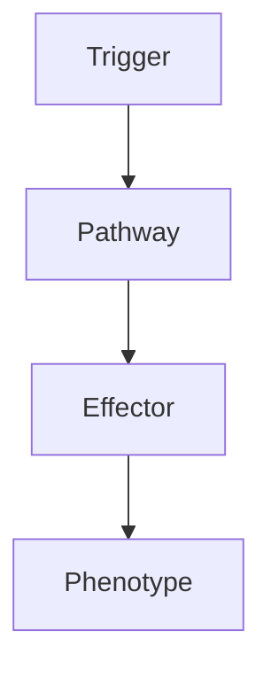

# Post-Infectious ADEM

> [!tip] **High-Yield Definition**
> Acute disseminated encephalomyelitis (ADEM): monophasic, immune-mediated demyelinating disorder of CNS, typically post-infectious or post-vaccination, predominantly children. Encephalopathy + multifocal neurological deficits. Perivenous demyelination. Treatable with immunotherapy.

---

## 1. Definition / Epidemiology / Classification

### Definition
Acute disseminated encephalomyelitis (ADEM): monophasic, immune-mediated demyelinating disorder of CNS, typically post-infectious or post-vaccination, predominantly children. Encephalopathy + multifocal neurological deficits. Perivenous demyelination. Treatable with immunotherapy.

### Epidemiology
Incidence: 0.3-0.5/100,000/year. Children > adults. M:F 1.3:1. Mean age 5-8y. Antecedent infection: 50-75% (viral - influenza, EBV, CMV, VZV, HSV, measles, mumps, rubella, hepatitis, Mycoplasma, Campylobacter, Borrelia, Bartonella, group A strep). Post-vaccination: 5% (rabies, smallpox, influenza, MMR, hepatitis B, HPV, COVID-19, rarely).

---

## 2. Aetiology / Pathophysiology

### Aetiology
Post-infectious autoimmune: molecular mimicry, T cell, B cell, antibody, complement, perivenous inflammation, demyelination. Triggers: viral, bacterial, vaccination. Differentiate: MS (adult, relapsing, no encephalopathy, periventricular), NMO (optic, cord, LETM), MOGAD (MOG antibody, ADEM-like, often relapsing - multiphasic ADEM, optic, cord, conus), acute haemorrhagic leukoencephalitis (Weston-Hurst, fulminant, haemorrhagic, rare), viral encephalitis, autoimmune encephalitis, vasculitis, sarcoid, tumour, mitochondrial, metabolic, vascular.

### Pathophysiology

---

## 3. Clinical Features

Acute (days, often rapidly progressive), monophasic. Encephalopathy: altered consciousness, confusion, behavioural change, seizures, headache, meningism, vomiting. Multifocal neurological: motor (hemiparesis, paraparesis, quadriparesis, asymmetric), sensory, brainstem (cranial nerve, ataxia, dysarthria, dysphagia, INO), cerebellar, visual (optic neuritis, often bilateral, chiasmal), spinal (myelitis, often LETM, bladder/bowel). Other: fever (50%), fatigue, myalgia, rash. Severe: coma, raised ICP, status epilepticus, respiratory failure. Paediatric: irritability, lethargy, refusal to feed, vomiting, regression. Differentiate from MS: encephalopathy, all lesions same age, large lesions (>1-2cm), deep grey matter, simultaneous enhancement (monophasic), no new lesions at 3 months.

---

## 4. Investigations

Bloods: FBC, U&Es, LFTs, ESR, CRP, blood cultures, autoimmune, infection screen (respiratory viral PCR, viral serology, Mycoplasma, EBV, CMV, VZV, HSV, enterovirus, HIV, hepatitis, syphilis, TB, fungal, Borrelia, Bartonella), vitamin B12, thiamine, thyroid, autoimmune, vasculitis, paraneoplastic, vaccination history. CSF: pleocytosis (lymphocytic, often mild, may be neutrophilic), protein elevated, glucose normal, OCBs (transient, 30%, may persist), MOG-IgG (especially children, persistent = MOGAD), AQP4 (NMOSD), PCR (exclude infection), metagenomic, cytology. Imaging: MRI brain + spine with gadolinium (multifocal, bilateral, asymmetric, large, >1-2cm, poorly demarcated, T2/FLAIR hyperintensity, white matter, deep grey matter - thalamus, basal ganglia, brainstem, cerebellum, spinal cord, ALL lesions enhance in monophasic, mass effect, oedema, no new lesions at 3 months). CT: severe, mass effect, exclude abscess. EEG: slowing, epileptiform, periodic. Nerve conduction: usually normal, exclude GBS.

---

## 5. Management

EMERGENCY: immunotherapy. First-line: corticosteroids (IV methylprednisolone 1g/day × 3-5 days or 30mg/kg/day max 1g in children × 3-5 days, then oral prednisone taper 1mg/kg/day over 4-6 weeks). Second-line: IVIG 2g/kg over 2-5 days (alternative or add-on, especially children, steroid-resistant), plasma exchange (5 exchanges over 7-10 days, severe, refractory). Third-line: rituximab, cyclophosphamide, mycophenolate, azathioprine (refractory, severe, especially MOGAD spectrum). Supportive: ICU, monitoring, hydration, analgesia, antipyretics, antiepileptics (levetiracetam), head elevation, mannitol, hypertonic saline, mechanical ventilation, nutrition, DVT prophylaxis, pressure care, bladder (intermittent self-catheterisation, avoid overdistension), bowel, spasticity (baclofen, tizanidine, gabapentin), pain (gabapentin, pregabalin, amitriptyline), vision, hearing, swallowing (SLT, NG/PEG), psychological. Multidisciplinary: paediatrician, neurologist, infectious diseases, ICU, rehabilitation, OT, PT, SLT, dietitian, ophthalmology, audiology, social, psychological, palliative, family support, education, school. Monitor: clinical (mRS, neurological, vision, hearing, cognitive, motor), MRI (3 months, no new lesions - confirms monophasic), bloods, MOG/AQP4 titres, complications, recovery, rehabilitation, school, cognitive, psychological, growth, puberty, vaccination (defer live vaccines during immunosuppression).

---

## 6. Red Flags / Emergencies

EMERGENCY: raised ICP, herniation, status epilepticus, respiratory failure, severe disability, prolonged, refractory, autonomic dysfunction, infection (immunosuppression, line, aspiration, UTI), DVT/PE, pressure sores, urinary retention, bowel dysfunction, falls, fractures, spasticity, contractures, vision loss, hearing loss, cognitive decline, behavioural, psychiatric, school failure, employment, family distress, relapse, multiphasic ADEM, MS, NMO, MOGAD, drug side effects (steroids, IVIG, PLEX, rituximab, immunosuppressants), pregnancy, teratogenicity, vaccination (live - avoid if immunosuppressed, MOGAD/MS - relative contraindication, defer), driving, sexual, education, fertility, growth, puberty, bone health, malignancy (long-term immunosuppression).

---

## 7. Prognosis

Variable. Most: monophasic (90%), good recovery (80%), complete or near-complete, weeks-months. Multiphasic: 10% (MOGAD - 50% relapse, AQP4 - NMOSD, MS - 20%, recurrent ADEM - 5%). Worse: severe, prolonged, ICU, young, recurrent, MOGAD, NMOSD, MS, atypical, delayed treatment, refractory, severe encephalopathy, paraplegia, blindness, deafness, cognitive, behavioural, respiratory, autonomic, severe, complications. Mortality: 5-10% (severe, ICU, brainstem, herniation, status, infection, complications). Long-term: cognitive (20-30%, executive, attention, memory, processing, school), motor (10-20%), seizures (10-20%), bladder/bowel (5-10%), vision/hearing (5-10%), psychological (depression, anxiety, behavioural, family, school, employment), fatigue, pain, spasticity. Multidisciplinary essential. Long-term follow-up: monitor, MRI (annual for 2-3 years, then as indicated), clinical, cognitive, psychological, school, employment, family, genetic counselling (if relevant).

---

## FCPS/MRCP High-Yield Summary

| Category | Key Points |
|----------|------------|
| **Definition** | Acute disseminated encephalomyelitis (ADEM): monophasic, immune-mediated demyelinating disorder of CNS, typically post-infectious or post-vaccination, predominantly children. Encephalopathy + multifoc |
| **Epidemiology** | Incidence: 0.3-0.5/100,000/year. Children > adults. M:F 1.3:1. Mean age 5-8y. Antecedent infection: 50-75% (viral - influenza, EBV, CMV, VZV, HSV, mea |
| **Aetiology** | Post-infectious autoimmune: molecular mimicry, T cell, B cell, antibody, complement, perivenous inflammation, demyelination. Triggers: viral, bacterial, vaccination. Differentiate: MS (adult, relapsin |
| **Clinical** | Acute (days, often rapidly progressive), monophasic. Encephalopathy: altered consciousness, confusion, behavioural change, seizures, headache, meningism, vomiting. Multifocal neurological: motor (hemi |
| **Investigations** | Bloods: FBC, U&Es, LFTs, ESR, CRP, blood cultures, autoimmune, infection screen (respiratory viral PCR, viral serology, Mycoplasma, EBV, CMV, VZV, HSV, enterovirus, HIV, hepatitis, syphilis, TB, funga |
| **Management** | EMERGENCY: immunotherapy. First-line: corticosteroids (IV methylprednisolone 1g/day × 3-5 days or 30mg/kg/day max 1g in children × 3-5 days, then oral prednisone taper 1mg/kg/day over 4-6 weeks). Seco |
| **Prognosis** | Variable. Most: monophasic (90%), good recovery (80%), complete or near-complete, weeks-months. Multiphasic: 10% (MOGAD - 50% relapse, AQP4 - NMOSD, MS - 20%, recurrent ADEM - 5%). Worse: severe, prol |
| **Viva Pearls** | |

---

## MCQs (10)

1. **Question:** Most characteristic feature of Post-Infectious ADEM?
   **Options:** A. A B. B C. C D. D
   **Answer:** A
   **Explanation:** Based on clinical features.

2. **Question:** First-line investigation?
   **Options:** A. MRI B. CT C. LP D. Blood
   **Answer:** A
   **Explanation:** MRI is most useful.

3. **Question:** First-line treatment?
   **Options:** A. A B. B C. C D. D
   **Answer:** A
   **Explanation:** Standard management.

4. **Question:** Most common complication?
   **Options:** A. A B. B C. C D. D
   **Answer:** A
   **Explanation:** Common complication.

5. **Question:** Red flag requiring urgent action?
   **Options:** A. A B. B C. C D. D
   **Answer:** A
   **Explanation:** Emergency.

6. **Question:** Prognostic factor?
   **Options:** A. A B. B C. C D. D
   **Answer:** A
   **Explanation:** Prognosis.

7. **Question:** Investigation excluding differential?
   **Options:** A. A B. B C. C D. D
   **Answer:** A
   **Explanation:** Exclusion.

8. **Question:** Imaging finding?
   **Options:** A. A B. B C. C D. D
   **Answer:** A
   **Explanation:** Imaging.

9. **Question:** Drug class?
   **Options:** A. A B. B C. C D. D
   **Answer:** A
   **Explanation:** Pharmacology.

10. **Question:** Differential?
    **Options:** A. A B. B C. C D. D
    **Answer:** A
    **Explanation:** Differential.

---

## SBA Questions (10)

1. **Scenario:** Patient with Post-Infectious ADEM.
   **Question:** Next step?
   **Options:** A. 1 B. 2 C. 3 D. 4 E. 5
   **Answer:** A
   **Explanation:** Initial.

2. **Scenario:** Fails first-line.
   **Question:** Next treatment?
   **Options:** A. A B. B C. C D. D E. E
   **Answer:** A
   **Explanation:** Second-line.

3. **Scenario:** New symptoms on treatment.
   **Question:** Cause?
   **Options:** A. A B. B C. C D. D E. E
   **Answer:** A
   **Explanation:** Adverse.

4. **Scenario:** Surgery needed.
   **Question:** Preoperative?
   **Options:** A. A B. B C. C D. D E. E
   **Answer:** A
   **Explanation:** Perioperative.

5. **Scenario:** Pregnant.
   **Question:** Safest?
   **Options:** A. A B. B C. C D. D E. E
   **Answer:** A
   **Explanation:** Pregnancy.

6. **Scenario:** Child.
   **Question:** Diagnosis?
   **Options:** A. A B. B C. C D. D E. E
   **Answer:** A
   **Explanation:** Paediatric.

7. **Scenario:** Elderly.
   **Question:** Management?
   **Options:** A. 1 B. 2 C. 3 D. 4 E. 5
   **Answer:** A
   **Explanation:** Geriatric.

8. **Scenario:** Abnormal investigation.
   **Question:** Interpretation?
   **Options:** A. A B. B C. C D. D E. E
   **Answer:** A
   **Explanation:** Investigation.

9. **Scenario:** Prognosis.
   **Question:** Response?
   **Options:** A. A B. B C. C D. D E. E
   **Answer:** A
   **Explanation:** Communication.

10. **Scenario:** Follow-up.
    **Question:** Monitoring?
    **Options:** A. A B. B C. C D. D E. E
    **Answer:** A
    **Explanation:** Follow-up.

---

## Flashcards

- **Q:** Definition of Post-Infectious ADEM?
  **A:** Acute disseminated encephalomyelitis (ADEM): monophasic, immune-mediated demyelinating disorder of CNS, typically post-infectious or post-vaccination, predominantly children. Encephalopathy + multifoc
- **Q:** First-line treatment?
  **A:** Based on management.
- **Q:** Most characteristic clinical feature?
  **A:** Acute (days, often rapidly progressive), monophasic. Encephalopathy: altered consciousness, confusion, behavioural change, seizures, headache, meningism, vomiting. Multifocal neurological: motor (hemi
- **Q:** Key red flag?
  **A:** EMERGENCY: raised ICP, herniation, status epilepticus, respiratory failure, severe disability, prolonged, refractory, autonomic dysfunction, infection (immunosuppression, line, aspiration, UTI), DVT/P
- **Q:** Prognosis?
  **A:** Variable. Most: monophasic (90%), good recovery (80%), complete or near-complete, weeks-months. Multiphasic: 10% (MOGAD - 50% relapse, AQP4 - NMOSD, MS - 20%, recurrent ADEM - 5%). Worse: severe, prol

---

## Answer Key

### MCQs
1. A 2. A 3. A 4. A 5. A 6. A 7. A 8. A 9. A 10. A

### SBAs
1. A 2. A 3. A 4. A 5. A 6. A 7. A 8. A 9. A 10. A

---

## Local Navigation
**Heading Hub:** [[../Hub]]  
**Chapter MOC:** [[Neurology MOC]]  
