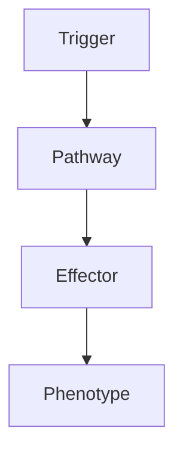

# Oligodendroglioma

---
tags: [medicine, neurology, fcps, mrcp]
chapter: Neurology
davidson_part: Part 3: Clinical Medicine
davidson_chapter: Chapter 25: Neurology
topic: Oligodendroglioma
exam: [FCPS, MRCP Part 1, MRCP Part 2, PACES]
references:
  anatomy: []
  physiology: []
  clinical: ['Davidson 24th Ed Ch25', 'Neurology: A Clinician\'s Approach', 'Adams and Victor\'s Principles of Neurology', 'PasTest', 'MRCP Part 1/2 Notes', 'Personal notes']
related: []
status: full-fcps-mrcp-note
---

# Oligodendroglioma

> [!tip] **High-Yield Definition**
> Oligodendroglioma: diffuse glioma from oligodendrocytes, often frontal, calcifications. IDH-mutant, 1p/19q co-deleted (diagnostic). Better prognosis. WHO grade 2 (low), grade 3 (anaplastic). Chemosensitive.

---

## 1. Definition / Epidemiology / Classification

### Definition
Oligodendroglioma: diffuse glioma from oligodendrocytes, often frontal, calcifications. IDH-mutant, 1p/19q co-deleted (diagnostic). Better prognosis. WHO grade 2 (low), grade 3 (anaplastic). Chemosensitive.

### Epidemiology
Incidence: 0.3/100,000/year. 5-20% of gliomas. Adult onset (40-50y). Frontal > temporal. Calcifications (70-90%). 1p/19q co-deletion 60-90%.

---

## 2. Aetiology / Pathophysiology

### Aetiology
IDH mutation (80-90%), 1p/19q co-deletion (60-90%, diagnostic, prognostic, predictive - better response to PCV, temozolomide), TERT promoter mutation (70-80%), CIC mutation (30-50%), FUBP1 mutation, MGMT methylation. Pathogenesis: IDH mutation produces 2-HG, DNA hypermethylation, slow growth, chemosensitivity.

### Pathophysiology

---

## 3. Clinical Features

Seizures (80-90%, most common). Headache (50%, raised ICP). Focal neurological deficit (30-50%, hemiparesis, aphasia, hemianopia, cognitive, behavioural). Cognitive, behavioural (frontal). Asymptomatic (20-30%). Slow progression.

---

## 4. Investigations

MRI brain with gadolinium: heterogeneous, frontal, T2/FLAIR hyperintense, calcifications (70-90%), minimal oedema, heterogeneous enhancement, cortical-subcortical, T2-FLAIR mismatch sign. CT: hypodense, calcifications (90%). MRS: 2-HG. Genetic: 1p/19q co-deletion, IDH1/2, TERT, MGMT. Histology: oligodendroglial morphology (fried egg, chicken wire capillary, calcifications, microcysts), IHC: IDH1 R132H, ATRX retained, p53 wild type, Ki-67. Exclude: astrocytoma, glioblastoma, other gliomas, metastasis, lymphoma, demyelinating.

---

## 5. Management

Surgery: maximal safe resection. Radiotherapy: adjuvant, anaplastic, residual, progressive, recurrence. Chemotherapy: PCV (anaplastic, 1p/19q, RTOG 9402, EORTC 26951 - survival benefit), temozolomide (alternative, oral, less toxic, CODEL, similar efficacy), 6-12 cycles. IDH inhibitors: vorasidenib (INDIGO trial, PFS benefit, approved for IDH-mutant grade 2 astrocytoma and oligodendroglioma). Symptomatic: seizures, oedema, VTE prophylaxis, rehabilitation, psychological, palliative, clinical trials. Multidisciplinary: neuro-oncology, neurosurgery, radiation oncology, neurology, neuroradiology, pathology, OT, PT, SLT, dietitian, neuropsychology, social, palliative. Monitor: MRI, clinical, seizures, neurocognitive, KPS, treatment toxicity, molecular, clinical trials.

---

## 6. Red Flags / Emergencies

Progression, transformation to higher grade, recurrence, leptomeningeal (rare), extracranial metastasis (rare), late effects of treatment (radiation necrosis, cognitive decline, secondary tumours, vasculopathy, hypopituitarism, optic neuropathy, hearing loss, stroke, moyamoya, leukoencephalopathy, VTE, seizures, hydrocephalus, pseudoprogression vs true progression, treatment failure, drug side effects (chemotherapy - myelosuppression, neutropenic sepsis, fatigue, nausea, liver, lung, kidney, fertility, teratogenicity; IDH inhibitors - differentiation syndrome, QT, leukocytosis, arthralgia, GI, fatigue; immunotherapy - irAEs, colitis, hepatitis, pneumonitis, thyroiditis, hypophysitis, hypopituitarism, DM, myositis, myocarditis, neuropathy, skin, severe, life-threatening; steroids - DM, HTN, osteoporosis, infection, mood, adrenal, myopathy, cataracts, glaucoma; antiepileptics - levetiracetam behavioural, valproate hepatic, weight, teratogenic; enzyme-inducing - interactions, OCP, warfarin, DOACs, ART, chemotherapy), pregnancy (teratogenicity), end-of-life, palliative, hospice, family, advanced care planning, driving, work, quality of life, clinical trials.

---

## 7. Prognosis

Variable. Best glioma prognosis. 1p/19q co-deleted + IDH-mutant: best. Median survival: grade 2 (10-20y), grade 3 (8-15y), anaplastic treated with PCV (10-15y), IDH-mutant only or 1p/19q only (5-10y), CDKN2A/B homozygous deletion (3-5y, similar to glioblastoma). Better: young, complete resection, 1p/19q, IDH, KPS, no neurological deficit, calcification, frontal. Worse: older, incomplete, neurological deficit, IDH-wildtype, 1p/19q intact, CDKN2A/B. Multidisciplinary essential. Long-term: monitor, recurrence, treatment toxicity, transformation, cognitive, psychological, family, quality of life, clinical trials. Genetic: IDH, 1p/19q, TERT, CDKN2A/B, MGMT. Family: rare, familial syndromes (rare).

---

## FCPS/MRCP High-Yield Summary

| Category | Key Points |
|----------|------------|
| **Definition** | Oligodendroglioma: diffuse glioma from oligodendrocytes, often frontal, calcifications. IDH-mutant, 1p/19q co-deleted (diagnostic). Better prognosis. WHO grade 2 (low), grade 3 (anaplastic). Chemosens |
| **Epidemiology** | Incidence: 0.3/100,000/year. 5-20% of gliomas. Adult onset (40-50y). Frontal > temporal. Calcifications (70-90%). 1p/19q co-deletion 60-90%. |
| **Aetiology** | IDH mutation (80-90%), 1p/19q co-deletion (60-90%, diagnostic, prognostic, predictive - better response to PCV, temozolomide), TERT promoter mutation (70-80%), CIC mutation (30-50%), FUBP1 mutation, M |
| **Clinical** | Seizures (80-90%, most common). Headache (50%, raised ICP). Focal neurological deficit (30-50%, hemiparesis, aphasia, hemianopia, cognitive, behavioural). Cognitive, behavioural (frontal). Asymptomati |
| **Investigations** | MRI brain with gadolinium: heterogeneous, frontal, T2/FLAIR hyperintense, calcifications (70-90%), minimal oedema, heterogeneous enhancement, cortical-subcortical, T2-FLAIR mismatch sign. CT: hypodens |
| **Management** | Surgery: maximal safe resection. Radiotherapy: adjuvant, anaplastic, residual, progressive, recurrence. Chemotherapy: PCV (anaplastic, 1p/19q, RTOG 9402, EORTC 26951 - survival benefit), temozolomide  |
| **Prognosis** | Variable. Best glioma prognosis. 1p/19q co-deleted + IDH-mutant: best. Median survival: grade 2 (10-20y), grade 3 (8-15y), anaplastic treated with PCV (10-15y), IDH-mutant only or 1p/19q only (5-10y), |
| **Viva Pearls** | |

---

## MCQs (10)

1. **Question:** Most characteristic feature of Oligodendroglioma?
   **Options:** A. A B. B C. C D. D
   **Answer:** A
   **Explanation:** Based on clinical features.

2. **Question:** First-line investigation?
   **Options:** A. MRI B. CT C. LP D. Blood
   **Answer:** A
   **Explanation:** MRI is most useful.

3. **Question:** First-line treatment?
   **Options:** A. A B. B C. C D. D
   **Answer:** A
   **Explanation:** Standard management.

4. **Question:** Most common complication?
   **Options:** A. A B. B C. C D. D
   **Answer:** A
   **Explanation:** Common complication.

5. **Question:** Red flag requiring urgent action?
   **Options:** A. A B. B C. C D. D
   **Answer:** A
   **Explanation:** Emergency.

6. **Question:** Prognostic factor?
   **Options:** A. A B. B C. C D. D
   **Answer:** A
   **Explanation:** Prognosis.

7. **Question:** Investigation excluding differential?
   **Options:** A. A B. B C. C D. D
   **Answer:** A
   **Explanation:** Exclusion.

8. **Question:** Imaging finding?
   **Options:** A. A B. B C. C D. D
   **Answer:** A
   **Explanation:** Imaging.

9. **Question:** Drug class?
   **Options:** A. A B. B C. C D. D
   **Answer:** A
   **Explanation:** Pharmacology.

10. **Question:** Differential?
    **Options:** A. A B. B C. C D. D
    **Answer:** A
    **Explanation:** Differential.

---

## SBA Questions (10)

1. **Scenario:** Patient with Oligodendroglioma.
   **Question:** Next step?
   **Options:** A. 1 B. 2 C. 3 D. 4 E. 5
   **Answer:** A
   **Explanation:** Initial.

2. **Scenario:** Fails first-line.
   **Question:** Next treatment?
   **Options:** A. A B. B C. C D. D E. E
   **Answer:** A
   **Explanation:** Second-line.

3. **Scenario:** New symptoms on treatment.
   **Question:** Cause?
   **Options:** A. A B. B C. C D. D E. E
   **Answer:** A
   **Explanation:** Adverse.

4. **Scenario:** Surgery needed.
   **Question:** Preoperative?
   **Options:** A. A B. B C. C D. D E. E
   **Answer:** A
   **Explanation:** Perioperative.

5. **Scenario:** Pregnant.
   **Question:** Safest?
   **Options:** A. A B. B C. C D. D E. E
   **Answer:** A
   **Explanation:** Pregnancy.

6. **Scenario:** Child.
   **Question:** Diagnosis?
   **Options:** A. A B. B C. C D. D E. E
   **Answer:** A
   **Explanation:** Paediatric.

7. **Scenario:** Elderly.
   **Question:** Management?
   **Options:** A. 1 B. 2 C. 3 D. 4 E. 5
   **Answer:** A
   **Explanation:** Geriatric.

8. **Scenario:** Abnormal investigation.
   **Question:** Interpretation?
   **Options:** A. A B. B C. C D. D E. E
   **Answer:** A
   **Explanation:** Investigation.

9. **Scenario:** Prognosis.
   **Question:** Response?
   **Options:** A. A B. B C. C D. D E. E
   **Answer:** A
   **Explanation:** Communication.

10. **Scenario:** Follow-up.
    **Question:** Monitoring?
    **Options:** A. A B. B C. C D. D E. E
    **Answer:** A
    **Explanation:** Follow-up.

---

## Flashcards

- **Q:** Definition of Oligodendroglioma?
  **A:** Oligodendroglioma: diffuse glioma from oligodendrocytes, often frontal, calcifications. IDH-mutant, 1p/19q co-deleted (diagnostic). Better prognosis. WHO grade 2 (low), grade 3 (anaplastic). Chemosens
- **Q:** First-line treatment?
  **A:** Based on management.
- **Q:** Most characteristic clinical feature?
  **A:** Seizures (80-90%, most common). Headache (50%, raised ICP). Focal neurological deficit (30-50%, hemiparesis, aphasia, hemianopia, cognitive, behavioural). Cognitive, behavioural (frontal). Asymptomati
- **Q:** Key red flag?
  **A:** Progression, transformation to higher grade, recurrence, leptomeningeal (rare), extracranial metastasis (rare), late effects of treatment (radiation necrosis, cognitive decline, secondary tumours, vas
- **Q:** Prognosis?
  **A:** Variable. Best glioma prognosis. 1p/19q co-deleted + IDH-mutant: best. Median survival: grade 2 (10-20y), grade 3 (8-15y), anaplastic treated with PCV (10-15y), IDH-mutant only or 1p/19q only (5-10y),

---

## Answer Key

### MCQs
1. A 2. A 3. A 4. A 5. A 6. A 7. A 8. A 9. A 10. A

### SBAs
1. A 2. A 3. A 4. A 5. A 6. A 7. A 8. A 9. A 10. A

---

## Local Navigation
**Heading Hub:** [[../Hub]]  
**Chapter MOC:** [[Neurology MOC]]  
