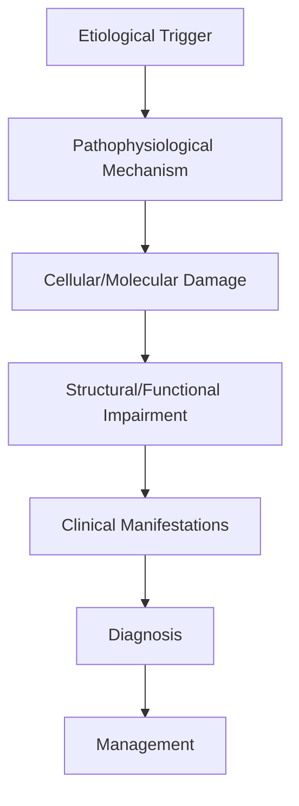

# Prion Disease

> [!tip] **High-Yield Definition**
> Comprehensive clinical note for Prion Disease covering definition, epidemiology, aetiology, pathophysiology, clinical features, investigations, differential diagnosis, management, drug interactions, procedures, complications, red flags, prognosis, topic correlation, and special situations for FCPS/MRCP examination preparation based on Davidson 24th Edition Chapter 25: Neurology.

---

## 1. Definition / Epidemiology / Classification

### Definition
Prion Disease is a neurological disorder within the 12 cns infections category. It is characterised by specific clinical, pathological, radiological, and laboratory features that allow differentiation from related conditions.

### Epidemiology
- **Incidence/Prevalence:** Variable depending on the specific condition.
- **Age:** Adult onset is most common, but paediatric and elderly presentations occur.
- **Sex:** Variable depending on the condition.
- **Geography:** Worldwide distribution, with higher prevalence in certain regions.
- **Risk Factors:** Genetic predisposition, environmental factors, comorbidities, family history.

### Classification
| Subtype | Key Features | Prognosis |
|---------|-------------|-----------|
| Mild/early | Subtle symptoms, preserved function | Best |
| Moderate | Clear symptoms, functional impairment | Variable |
| Severe | Significant disability, complications | Worst |

---

## 2. Aetiology / Pathophysiology

### Aetiology
- **Primary (idiopathic):** Most cases have no identifiable cause.
- **Genetic:** May be inherited (AD, AR, X-linked, mitochondrial, sporadic).
- **Autoimmune:** Autoantibodies, immune-mediated inflammation.
- **Infectious:** Viral, bacterial, fungal, parasitic.
- **Metabolic:** Electrolyte, endocrine, hepatic, renal, nutritional.
- **Toxic:** Drugs, alcohol, heavy metals, environmental toxins.
- **Vascular:** Ischaemia, haemorrhage, vasculitis.
- **Neoplastic:** Primary, secondary, paraneoplastic.
- **Traumatic:** Acute, chronic, repetitive.
- **Degenerative:** Neurodegeneration, protein misfolding.

### Pathophysiology


---

## 3. Clinical Features

### History
- **Onset/Duration:** Acute, subacute, or chronic.
- **Progression:** Static, progressive, relapsing-remitting, stepwise.
- **Key symptoms:** Specific to the condition.
- **Triggers:** Stress, infection, trauma, drugs, hormonal, environmental.
- **Systemic symptoms:** Constitutional features.
- **Drug/Family/Social history:** Relevant exposures, comorbidities.

### Examination
| Domain | Key Findings | Localisation Value |
|--------|-------------|-------------------|
| Higher function | Cognitive, behavioural | Cortical, subcortical, limbic |
| Cranial nerves | Pupils, eye movements, facial, bulbar | Brainstem, cranial nerve, NMJ |
| Motor | Weakness, tone, reflexes | UMN, LMN, NMJ, muscle |
| Sensory | All modalities, pattern | Peripheral, spinal, brainstem |
| Coordination | Ataxia, nystagmus, dysmetria | Cerebellar, sensory, vestibular |
| Gait | Spastic, ataxic, parkinsonian | Multiple |
| Autonomic | Orthostatic, sweating, GI, bladder | Autonomic, peripheral, central |

### Specific Clinical Features
The clinical features are determined by the underlying aetiology, location of pathology, and rate of progression. Patients typically present with a constellation of symptoms and signs that allow clinical localisation and subsequent targeted investigation.

---

## 4. Diagnostic Approach / Algorithm

```mermaid
flowchart TD
    A[Clinical Presentation] --> B[Anatomical Localisation]
    B --> C[Pathophysiological Category]
    C --> D[Formulate Differential]
    D --> E[Targeted Investigations]
    E --> F[Confirm Diagnosis]
    F --> G[Assess Severity/Prognosis]
    G --> H[Initiate Management]
    H --> I[Monitor Response]
    I --> J{Response?}
    J --> YES1 [Good - Continue]
    J --> NO1 [Poor - Escalate]
    YES1 --> K[Monitor]
    NO1 --> H
```

---

## 5. Investigations

### First-Line Investigations
- **Blood tests:** FBC, U&Es, LFTs, glucose, calcium, magnesium, ESR, CRP, autoimmune, infection.
- **Imaging:** CT/MRI brain/spine (essential for most neurological conditions).
- **Neurophysiology:** EEG, nerve conduction, EMG, evoked potentials.
- **CSF:** Cell count, protein, glucose, OCBs, PCR, culture.

### Second-Line Investigations
- **Genetic testing:** Gene panels, WES, WGS.
- **Antibody testing:** Antineuronal, autoimmune, paraneoplastic.
- **Biopsy:** Nerve, muscle, brain, skin.
- **Advanced imaging:** PET-CT, MR spectroscopy, fMRI.

### Specialised Investigations
- **Biomarkers:** Neurofilament light chain, tau, beta-amyloid, 14-3-3, RT-QuIC.
- **Autonomic testing:** Head-up tilt, sudomotor, QSART.
- **Neuropsychology:** Cognitive testing, behavioural assessment.
- **Genetic counselling:** Family screening, predictive testing.

---

## 6. Differential Diagnosis

| Differential | Distinguishing Features | Key Test |
|--------------|------------------------|----------|
| Vascular | Sudden onset, focal, vascular risk factors | MRI/CT, vessel imaging |
| Inflammatory | Subacute, multifocal, systemic | MRI, CSF, antibodies |
| Infectious | Fever, systemic, exposure | Bloods, CSF, imaging |
| Neoplastic | Progressive, mass effect | MRI, biopsy |
| Degenerative | Progressive, symmetric, hereditary | MRI, genetic |
| Toxic/Metabolic | Drug history, systemic, reversible | Bloods, toxicology |
| Autoimmune | Multifocal, antibodies, immunotherapy response | Antibodies, MRI, CSF |
| Functional | Inconsistent, distractible | Clinical, video, biomarkers |

---

## 7. Management

### Acute Management
- **Stabilisation:** ABCDE approach, emergency resuscitation.
- **Specific treatment:** Disease-specific interventions.
- **Symptomatic relief:** Pain, seizures, spasticity, autonomic dysfunction.
- **Prevention of complications:** DVT, pressure sores, infection.

### Disease-Modifying Treatment
- **Pharmacological:** First-line, second-line, escalation, maintenance.
- **Procedural:** Surgery, biopsy, drainage, ablation, stimulation.
- **Immunotherapy:** Steroids, IVIG, plasma exchange, immunosuppressants, biologics.
- **Rehabilitation:** Physiotherapy, OT, speech therapy.

### Long-Term Management
- **Monitoring:** Clinical, imaging, biomarkers, side effects.
- **Prevention:** Vaccinations, prophylaxis, lifestyle modification.
- **Supportive care:** Multidisciplinary team, social work, psychological support.
- **Palliative care:** Advanced care planning, end-of-life care, hospice.

---

## 8. Drug Interactions / Contraindications / Comorbidity Cautions

| Drug Class | Interaction / Caution | Management |
|------------|----------------------|------------|
| Antiseizure medications | Enzyme induction, teratogenicity | Monitor, supplement, switch |
| Immunosuppressants | Infection, malignancy, teratogenicity | Monitor, prophylaxis |
| Anticoagulants | Bleeding risk, drug interactions | Monitor INR, avoid combinations |
| Antihypertensives | Hypotension, falls | Monitor BP, adjust dose |
| Antibiotics | Nephrotoxicity, ototoxicity | Monitor renal |
| Antivirals | Nephrotoxicity, neuropsychiatric | Monitor renal, dose adjust |
| Steroids | DM, HTN, osteoporosis, infection | Monitor, prophylaxis, taper |
| Biologics | Infusion reactions, infection | Monitor, prophylaxis |

---

## 9. Procedures

### Common Procedures
- **Lumbar puncture:** Diagnostic, therapeutic (IIH, NPH). Contraindications: raised ICP, mass lesion, coagulopathy.
- **Nerve conduction studies/EMG:** Diagnostic, prognosis. Minor discomfort.
- **EEG:** Diagnostic, monitoring. No significant complications.
- **MRI brain/spine:** Diagnostic, monitoring. Contraindications: pacemaker, metallic implants.
- **CT head:** Emergency, rapid. Radiation exposure, contrast reactions.
- **Biopsy:** Stereotactic, open. Indications: diagnosis, molecular profiling.

---

## 10. Complications

| Complication | Frequency | Prevention | Management |
|--------------|-----------|------------|------------|
| Infection | Common | Hygiene, prophylaxis, vaccination | Antibiotics, antifungals |
| Thrombosis | Common | Prophylaxis, mobility | Anticoagulation |
| Pressure sores | Common | Positioning, nutrition | Wound care, surgery |
| Spasticity | Common | Positioning, stretching | Baclofen, BoNT |
| Contractures | Common | Passive movements, splints | Physiotherapy, surgery |
| Aspiration | Common | Swallow assessment | NGT, PEG, thickeners |
| Falls | Common | Environment, mobility | Walking aids |
| Fractures | Common | Bone health, prevention | Vitamin D, bisphosphonate |
| Depression | Common | Screening, support | Antidepressants, CBT |
| Cognitive decline | Variable | Monitoring, training | Rehabilitation |
| Autonomic dysfunction | Variable | Monitoring, hydration | Midodrine, fludrocortisone |
| Respiratory failure | Variable | Monitoring, supportive | Ventilation, NIV |
| Death | Variable | Monitoring, palliative | End-of-life care |

---

## 11. Red Flags / Emergencies

### Emergency Presentations
- **Rapid neurological deterioration:** New focal deficit, decreased consciousness, seizures.
- **Status epilepticus:** Continuous seizures >5 min.
- **Raised ICP:** Headache, vomiting, papilloedema, altered consciousness.
- **Respiratory failure:** Hypoxia, hypercapnia, ventilatory failure.
- **Cardiac arrest:** Arrhythmia, MI, pulmonary embolism.
- **Infection:** Sepsis, meningitis, abscess, encephalitis.
- **Drug toxicity:** Overdose, side effects, interactions.
- **Haemorrhage:** Intracranial, systemic, coagulopathy.

---

## 12. Prognosis

### Natural History
- **Acute:** May resolve with treatment, may progress, may be fatal.
- **Subacute:** Variable, depends on cause and treatment.
- **Chronic:** Often progressive, may be stable, may have relapses.
- **Recovery:** Variable, may be complete, partial, or none.

### Prognostic Factors
- **Favourable:** Young age, early treatment, mild disease, reversible cause, good premorbid function, family support.
- **Unfavourable:** Older age, delayed treatment, severe disease, irreversible cause, poor premorbid function, comorbidities.

---

## 13. Topic Correlation

| Related Topic | Link | Key Overlap |
|---------------|------|-------------|
| Davidson 24th Ed Chapter 25 | [[Davidson Chapter 25 - Neurology Hierarchy]] | Comprehensive neurology |
| Neurology MOC | [[Neurology MOC]] | All neurology topics |
| Drug Reference | [[../00_Index/Neurology Drug Reference]] | Medications |
| Local Hub | [[../12_CNS_Infections/Hub]] | Section-specific |
| Clinical Examination | [[../01_Fundamentals_Examination/Neurological History Taking]] | Clinical approach |
| Investigation | [[../01_Fundamentals_Examination/Neuroimaging (CT-MRI) Principles]] | Imaging |

---

## 14. Special Situations

| Situation | Consideration |
|-----------|---------------|
| **Pregnancy** | Pre-conception counselling, teratogenicity, drug safety, monitoring, delivery planning, breastfeeding. |
| **Lactation** | Drug safety, breastfeeding, monitoring, support. |
| **Paediatric** | Developmental considerations, drug dosing, school, family, vaccination, growth, puberty. |
| **Elderly / Frail** | Comorbidities, polypharmacy, falls, bone health, cognition, social, end-of-life. |
| **Renal impairment** | Drug dose adjustment, monitoring, dialysis, transplant. |
| **Hepatic impairment** | Drug dose adjustment, monitoring, transplant. |
| **Immunocompromised** | Infection prophylaxis, vaccination, drug interactions, malignancy screening. |
| **Perioperative** | Drug management, anaesthesia planning, VTE prophylaxis, infection prevention, monitoring. |
| **Driving / DVLA** | Fitness to drive, restrictions, notification, reassessment. |
| **Occupational** | Fitness for work, adaptations, rehabilitation, disability, return to work. |

---

## FCPS/MRCP High-Yield Summary

| Category | Key Points |
|----------|------------|
| **Definition** | Comprehensive definition with key diagnostic criteria |
| **Epidemiology** | Incidence, prevalence, age, sex, geography, risk factors |
| **Aetiology** | Primary causes, secondary causes, genetic, environmental |
| **Pathophysiology** | Mechanism of disease, cellular/molecular basis |
| **Clinical Features** | History, examination, key findings, variants |
| **Diagnosis** | Diagnostic criteria, classification, severity |
| **Investigations** | First-line, second-line, specialised, biomarkers |
| **Differential Diagnosis** | Key differentials, distinguishing features, tests |
| **Management** | Acute, disease-modifying, symptomatic, supportive |
| **Complications** | Common, serious, prevention, management |
| **Prognosis** | Natural history, prognostic factors, outcomes |
| **Viva Pearls** | Key examination points |
| **Drug Doses** | First-line, second-line, emergency |
| **Scoring Systems** | Specific scores used in management |
| **Genetics** | Inheritance, genes, mutations, family screening |
| **Imaging Signs** | Characteristic findings, differential |

---

## Viva Questions (PACES/FCPS Style)

1. **Q:** Define and classify its variants.
   **A:** Comprehensive definition with classification of subtypes based on aetiology, severity, and clinical features.

2. **Q:** What are the key clinical features?
   **A:** Specific symptoms and signs including onset, progression, key features, and associated findings.

3. **Q:** What is the first-line treatment?
   **A:** First-line pharmacological and non-pharmacological management based on current evidence.

4. **Q:** What are the red flags requiring urgent referral?
   **A:** Specific emergency presentations and complications requiring immediate intervention.

5. **Q:** What is the prognosis?
   **A:** Natural history, prognostic factors, and long-term outcomes.

6. **Q:** How do you differentiate from key differentials?
   **A:** Clinical features, investigations, and response to treatment that distinguish from alternative diagnoses.

7. **Q:** What investigations are most useful?
   **A:** First-line and second-line investigations including imaging, neurophysiology, CSF, and biomarkers.

8. **Q:** Describe the stepwise management approach.
   **A:** Stepwise escalation from first-line to second-line to third-line therapy with monitoring.

9. **Q:** What are the emergency presentations?
   **A:** Specific emergency scenarios and immediate management priorities.

10. **Q:** How does management change in pregnancy/paediatrics/elderly?
    **A:** Special considerations for each population including drug safety, monitoring, and support.

---

## Common Confusions / Exam Traps

| Confusion | Clarification |
|-----------|---------------|
| Similar presentation but different cause | Differentiate by history, examination, investigations |
| Treatment response vs natural history | Assess with objective measures, biomarkers |
| Drug interactions | Check each drug, monitor, adjust doses |
| Disease progression vs treatment failure | Monitor response, escalate appropriately |
| Functional vs organic | Inconsistent, distractible, disability greater than impairment |
| Acute vs chronic | Time course, progression, reversibility |
| Primary vs secondary | Underlying cause, contributing factors |
| Side effects vs symptoms | Temporal relationship, dose relationship |

---

## Mnemonics
1. **CJD Triad** = Rapidly progressive dementia + Myoclonus + Periodic sharp wave complexes on EEG (use: sCJD)
2. **14-3-3** = 14-3-3 protein in CSF (sensitive but not specific) + RT-QuIC (highly specific) (use: CSF biomarkers)
3. **Pulvinar Sign** = Bilateral symmetric pulvinar hyperintensity on MRI (DWI > FLAIR) - 90% specific for vCJD (use: MRI vCJD)

---

## Mind Map

```mermaid
mindmap
  root((Prion Disease (CJD)))
    Definition
    Epidemiology
    Pathophysiology
    Clinical
    Investigations
    Differential
    Management
    Complications
    Prognosis
    Cortical ribboning
    Pulvinar sign
```

---

## Spaced Repetition Trackers

| Review Interval | Date | Score (0-5) | Notes |
|-----------------|------|-------------|-------|
| Day 1 | | | |
| Day 3 | | | |
| Day 7 | | | |
| Day 14 | | | |
| Day 30 | | | |
| Day 90 | | | |

---

## Self-Test Scorecard

| Section | Score /5 | Last Attempt |
|---------|----------|--------------|
| Definition & Epidemiology | | | |
| Pathophysiology | | | |
| Clinical Features | | | |
| Investigations | | | |
| Differential | | | |
| Management | | | |
| Complications | | | |
| Viva Questions | | | |
| MCQs | | | |
| SBAs | | | |

---

## MCQs (10)

1. **Classic triad of sporadic CJD?**
   **Options:** A. Dementia + myoclonus + PSWCs on EEG B. Dementia + ataxia + spasticity C. Dementia + seizures + psychosis D. Dementia + insomnia + dysautonomia
   **Answer:** A
   **Explanation:** sCJD triad: rapidly progressive dementia (weeks-months), myoclonus (startle-induced), periodic sharp wave complexes (1-2 Hz) on EEG.

2. **Most sensitive CSF biomarker for sCJD?**
   **Options:** A. 14-3-3 protein B. RT-QuIC (real-time quaking-induced conversion) C. Tau D. Aβ42
   **Answer:** B
   **Explanation:** RT-QuIC is most specific (~98%) and sensitive (~85%) for sCJD; replaces 14-3-3 in most centres.

3. **MRI finding characteristic of vCJD?**
   **Options:** A. Cortical ribboning B. Pulvinar sign (bilateral symmetric pulvinar hyperintensity) C. Hippocampal atrophy D. Cerebellar atrophy
   **Answer:** B
   **Explanation:** Pulvinar sign = bilateral symmetric pulvinar hyperintensity on T2/FLAIR, >90% specific for vCJD.

4. **Cortical ribboning in sCJD?**
   **Options:** A. No MRI finding B. DWI/FLAIR hyperintensity in cortical gyri (cingulate, frontal, parietal, temporal) C. Basal ganglia only D. Cerebellum only
   **Answer:** B
   **Explanation:** Cortical ribboning = DWI/FLAIR hyperintensity in cortical ribbon (especially frontal, parietal, cingulate, temporal) - characteristic sCJD.

5. **Most common human prion disease?**
   **Options:** A. vCJD B. sCJD (85% of cases) C. Familial CJD D. Fatal familial insomnia
   **Answer:** B
   **Explanation:** Sporadic CJD (sCJD) accounts for ~85% of human prion disease.

6. **Prion disease caused by bovine spongiform encephalopathy?**
   **Options:** A. sCJD B. vCJD (variant CJD) C. Familial CJD D. GSS
   **Answer:** B
   **Explanation:** vCJD = linked to BSE-contaminated beef; younger patients (median 28y), psychiatric onset, longer course (~14 mo).

7. **Prion protein gene (PRNP) mutation in familial CJD?**
   **Options:** A. Not genetic B. PRNP codon 200 (E200K) most common; codon 178, 210 also C. APP D. MAPT
   **Answer:** B
   **Explanation:** PRNP E200K (glutamate→lysine at 200) most common; 178 (D178N with methionine at 129 = FFI); 210.

8. **Fatal familial insomnia (FFI) - what is it?**
   **Options:** A. Sleep disorder only B. PRNP D178N with methionine at codon 129: thalamic degeneration, insomnia, dysautonomia, dementia C. Same as sCJD D. Viral
   **Answer:** B
   **Explanation:** FFI = PRNP D178N + methionine at codon 129; selective thalamic degeneration; insomnia + dysautonomia + ataxia + dementia.

9. **Gerstmann-Sträussler-Scheinker (GSS) syndrome?**
   **Options:** A. Acute CJD variant B. PRNP mutation (often P102L); cerebellar ataxia + dementia, slow course (years) C. Same as FFI D. Bacterial
   **Answer:** B
   **Explanation:** GSS = familial prion disease, P102L most common; cerebellar ataxia, slow progression (years), spastic paraparesis, dementia.

10. **Infection control for suspected CJD?**
   **Options:** A. Standard precautions B. Special precautions: disposable instruments, no LP if possible, quarantined surgical instruments C. Negative pressure only D. Droplet only
   **Answer:** B
   **Explanation:** CJD = prion resistant to standard sterilisation. Use disposable instruments; incinerate; quarantine neurosurgical instruments.

---

## SBA Questions (10)

1. **Scenario:** 68-year-old with rapidly progressive dementia (4 months), startle myoclonus, gait ataxia. EEG shows periodic 1Hz sharp waves.
   **Question:** Most likely diagnosis?
   **Options:** A. Alzheimer's B. Sporadic CJD (sCJD) C. Lewy body dementia D. Frontotemporal dementia
   **Answer:** B
   **Explanation:** Rapid weeks-months, myoclonus, ataxia, PSWCs on EEG = classic sCJD.

2. **Scenario:** Suspected sCJD. Best confirmatory CSF test?
   **Question:** Best test?
   **Options:** A. 14-3-3 protein B. RT-QuIC (real-time quaking-induced conversion) C. Tau alone D. Aβ42
   **Answer:** B
   **Explanation:** RT-QuIC (sensitivity ~85%, specificity ~98%) is best CSF test for sCJD.

3. **Scenario:** 36-year-old with behavioural change, sensory disturbance, ataxia, dementia over 14 months. MRI shows pulvinar sign.
   **Question:** Most likely diagnosis?
   **Options:** A. sCJD B. vCJD C. HIV dementia D. Wernicke
   **Answer:** B
   **Explanation:** Young patient, psychiatric/sensory onset, slow course, pulvinar sign on MRI = vCJD (BSE-linked).

4. **Scenario:** Genetic counselling for family of CJD patient?
   **Question:** Best approach?
   **Options:** A. Routine B. Test for PRNP mutation if family history of early dementia/ataxia/insomnia (genetic counselling essential first) C. No role D. Test all family
   **Answer:** B
   **Explanation:** If familial pattern: PRNP testing with pre-test genetic counselling. Autosomal dominant.

5. **Scenario:** sCJD patient with rapidly progressive ataxia but no myoclonus yet, MRI DWI showing cortical ribboning.
   **Question:** Significance of MRI?
   **Options:** A. Not specific B. Cortical ribboning on DWI is supportive of sCJD (90%+ specific when combined with clinical) C. Suggests stroke D. Suggests encephalitis
   **Answer:** B
   **Explanation:** Cortical ribboning (DWI > FLAIR hyperintensity in cortex) + basal ganglia involvement = highly specific MRI for sCJD.

6. **Scenario:** Prion disease patient requiring surgery. Instrument handling?
   **Question:** Best practice?
   **Options:** A. Standard sterilisation B. Single-use disposable instruments, incinerate; quarantine reusable; NaOH 1N for surfaces C. Autoclave only D. Bleach only
   **Answer:** B
   **Explanation:** Prions resistant to standard autoclave; use NaOH 1N, sodium hypochlorite 20,000 ppm, or incinerate.

7. **Scenario:** Prion disease treatment?
   **Question:** Available therapy?
   **Options:** A. Highly effective ASMs B. No curative treatment; symptomatic (myoclonus: clonazepam/valproate; spasticity: baclofen; supportive) C. Steroids D. Antibiotics
   **Answer:** B
   **Explanation:** No curative treatment. Symptomatic: myoclonus (clonazepam, valproate, levetiracetam); spasticity (baclofen); supportive care; death typically 6-12 mo (sCJD).

8. **Scenario:** Patient with rapidly progressive dementia, negative RT-QuIC, normal MRI. Next step?
   **Question:** Best approach?
   **Options:** A. Discharge with reassurance B. Repeat LP and MRI in 3-6 months; consider autoimmune encephalitis (NMDAR, LGI1), paraneoplastic, CJD re-test C. Steroids only D. Antivirals
   **Answer:** B
   **Explanation:** Repeat workup. Common mimickers: autoimmune encephalitis, paraneoplastic, Hashimoto, vitamin deficiencies.

9. **Scenario:** Family of sCJD patient asks about transmission risk.
   **Question:** Best advice?
   **Options:** A. Avoid all contact B. Standard hygiene; not contagious person-to-person; rare iatrogenic (corneal transplants, dura mater grafts, neurosurgery pre-1992) C. Quarantine patient D. Prophylactic treatment
   **Answer:** B
   **Explanation:** sCJD not contagious person-to-person. Iatrogenic risk: corneal transplants, dura mater (pre-1992), growth hormone (cadaveric, pre-1985).

10. **Scenario:** FFI (fatal familial insomnia) - what does polysomnography show?
   **Question:** PSG finding?
   **Options:** A. Normal sleep B. Severe loss of slow-wave sleep; absent REM; reduced total sleep time; disrupted circadian C. Central sleep apnoea D. Obstructive sleep apnoea
   **Answer:** B
   **Explanation:** FFI PSG: severe insomnia, loss of slow-wave (N3) sleep, absent REM, fragmentation. PET: thalamic hypometabolism.

---

## Tags
**Tags:** #neurology #prion #CJD #vCJD #FFI #GSS #RT-QuIC #pulvinar #cortical-ribboning #PSWCs #14-3-3 #FCPS #MRCP

---

## Local Navigation
**Heading Hub:** [[../Hub]]  
**Chapter Hierarchy:** [[Davidson Chapter 25 - Neurology Hierarchy]]  
**Chapter MOC:** [[Neurology MOC]]  
**Drug Reference:** [[../00_Index/Neurology Drug Reference]]

## PasTest Scenario SBAs (Clinical Vignettes)

> **Auto-generated PasTest/Mediscope-style scenario SBAs** grounded in the authored source. Each scenario tests a real clinical fact (triad, specific sign, contraindication, trial, first-line Rx) extracted from the topic. *Source: Ch 27: Neurology & Stroke — Prion Disease*

**Q1.** Which of the following features is most specific or characteristic of Prion Disease?

  - **A.** Key symptoms:
  - **B.** A feature common to many acute inflammatory conditions
  - **C.** A non-specific sign that does not localise the diagnosis
  - **D.** An investigation finding rather than a clinical feature

  > **Answer: A** — Key symptoms:
  >
  > *Source:* - **Key symptoms:** Specific to the condition

**Q2.** What is the most appropriate first-line therapy for Prion Disease?

  - **A.** Rehabilitation:
  - **B.** An advanced/surgical therapy reserved for refractory disease
  - **C.** Symptomatic treatment only, no disease-modifying therapy
  - **D.** Empiric broad-spectrum therapy without specific indication

  > **Answer: A** — Rehabilitation:
  >
  > *Source:* **Rehabilitation:** Physiotherapy, OT, speech therapy.

