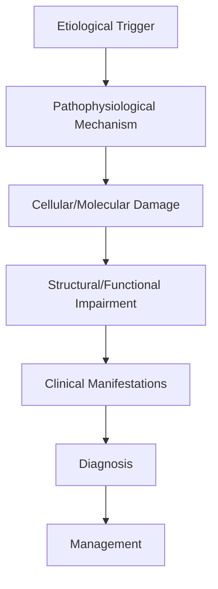
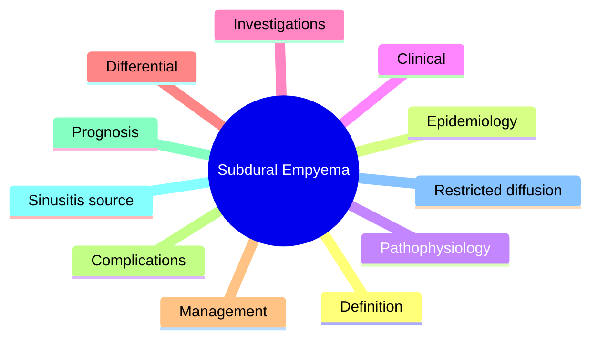

# Subdural Empyema

> [!tip] **High-Yield Definition**
> Comprehensive clinical note for Subdural Empyema covering definition, epidemiology, aetiology, pathophysiology, clinical features, investigations, differential diagnosis, management, drug interactions, procedures, complications, red flags, prognosis, topic correlation, and special situations for FCPS/MRCP examination preparation based on Davidson 24th Edition Chapter 25: Neurology.

---

## 1. Definition / Epidemiology / Classification

### Definition
Subdural Empyema is a neurological disorder within the 12 cns infections category. It is characterised by specific clinical, pathological, radiological, and laboratory features that allow differentiation from related conditions.

### Epidemiology
- **Incidence/Prevalence:** Variable depending on the specific condition.
- **Age:** Adult onset is most common, but paediatric and elderly presentations occur.
- **Sex:** Variable depending on the condition.
- **Geography:** Worldwide distribution, with higher prevalence in certain regions.
- **Risk Factors:** Genetic predisposition, environmental factors, comorbidities, family history.

### Classification
| Subtype | Key Features | Prognosis |
|---------|-------------|-----------|
| Mild/early | Subtle symptoms, preserved function | Best |
| Moderate | Clear symptoms, functional impairment | Variable |
| Severe | Significant disability, complications | Worst |

---

## 2. Aetiology / Pathophysiology

### Aetiology
- **Primary (idiopathic):** Most cases have no identifiable cause.
- **Genetic:** May be inherited (AD, AR, X-linked, mitochondrial, sporadic).
- **Autoimmune:** Autoantibodies, immune-mediated inflammation.
- **Infectious:** Viral, bacterial, fungal, parasitic.
- **Metabolic:** Electrolyte, endocrine, hepatic, renal, nutritional.
- **Toxic:** Drugs, alcohol, heavy metals, environmental toxins.
- **Vascular:** Ischaemia, haemorrhage, vasculitis.
- **Neoplastic:** Primary, secondary, paraneoplastic.
- **Traumatic:** Acute, chronic, repetitive.
- **Degenerative:** Neurodegeneration, protein misfolding.

### Pathophysiology


---

## 3. Clinical Features

### History
- **Onset/Duration:** Acute, subacute, or chronic.
- **Progression:** Static, progressive, relapsing-remitting, stepwise.
- **Key symptoms:** Specific to the condition.
- **Triggers:** Stress, infection, trauma, drugs, hormonal, environmental.
- **Systemic symptoms:** Constitutional features.
- **Drug/Family/Social history:** Relevant exposures, comorbidities.

### Examination
| Domain | Key Findings | Localisation Value |
|--------|-------------|-------------------|
| Higher function | Cognitive, behavioural | Cortical, subcortical, limbic |
| Cranial nerves | Pupils, eye movements, facial, bulbar | Brainstem, cranial nerve, NMJ |
| Motor | Weakness, tone, reflexes | UMN, LMN, NMJ, muscle |
| Sensory | All modalities, pattern | Peripheral, spinal, brainstem |
| Coordination | Ataxia, nystagmus, dysmetria | Cerebellar, sensory, vestibular |
| Gait | Spastic, ataxic, parkinsonian | Multiple |
| Autonomic | Orthostatic, sweating, GI, bladder | Autonomic, peripheral, central |

### Specific Clinical Features
The clinical features are determined by the underlying aetiology, location of pathology, and rate of progression. Patients typically present with a constellation of symptoms and signs that allow clinical localisation and subsequent targeted investigation.

---

## 4. Diagnostic Approach / Algorithm

```mermaid
flowchart TD
    A[Clinical Presentation] --> B[Anatomical Localisation]
    B --> C[Pathophysiological Category]
    C --> D[Formulate Differential]
    D --> E[Targeted Investigations]
    E --> F[Confirm Diagnosis]
    F --> G[Assess Severity/Prognosis]
    G --> H[Initiate Management]
    H --> I[Monitor Response]
    I --> J{Response?}
    J --> YES1 [Good - Continue]
    J --> NO1 [Poor - Escalate]
    YES1 --> K[Monitor]
    NO1 --> H
```

---

## 5. Investigations

### First-Line Investigations
- **Blood tests:** FBC, U&Es, LFTs, glucose, calcium, magnesium, ESR, CRP, autoimmune, infection.
- **Imaging:** CT/MRI brain/spine (essential for most neurological conditions).
- **Neurophysiology:** EEG, nerve conduction, EMG, evoked potentials.
- **CSF:** Cell count, protein, glucose, OCBs, PCR, culture.

### Second-Line Investigations
- **Genetic testing:** Gene panels, WES, WGS.
- **Antibody testing:** Antineuronal, autoimmune, paraneoplastic.
- **Biopsy:** Nerve, muscle, brain, skin.
- **Advanced imaging:** PET-CT, MR spectroscopy, fMRI.

### Specialised Investigations
- **Biomarkers:** Neurofilament light chain, tau, beta-amyloid, 14-3-3, RT-QuIC.
- **Autonomic testing:** Head-up tilt, sudomotor, QSART.
- **Neuropsychology:** Cognitive testing, behavioural assessment.
- **Genetic counselling:** Family screening, predictive testing.

---

## 6. Differential Diagnosis

| Differential | Distinguishing Features | Key Test |
|--------------|------------------------|----------|
| Vascular | Sudden onset, focal, vascular risk factors | MRI/CT, vessel imaging |
| Inflammatory | Subacute, multifocal, systemic | MRI, CSF, antibodies |
| Infectious | Fever, systemic, exposure | Bloods, CSF, imaging |
| Neoplastic | Progressive, mass effect | MRI, biopsy |
| Degenerative | Progressive, symmetric, hereditary | MRI, genetic |
| Toxic/Metabolic | Drug history, systemic, reversible | Bloods, toxicology |
| Autoimmune | Multifocal, antibodies, immunotherapy response | Antibodies, MRI, CSF |
| Functional | Inconsistent, distractible | Clinical, video, biomarkers |

---

## 7. Management

### Acute Management
- **Stabilisation:** ABCDE approach, emergency resuscitation.
- **Specific treatment:** Disease-specific interventions.
- **Symptomatic relief:** Pain, seizures, spasticity, autonomic dysfunction.
- **Prevention of complications:** DVT, pressure sores, infection.

### Disease-Modifying Treatment
- **Pharmacological:** First-line, second-line, escalation, maintenance.
- **Procedural:** Surgery, biopsy, drainage, ablation, stimulation.
- **Immunotherapy:** Steroids, IVIG, plasma exchange, immunosuppressants, biologics.
- **Rehabilitation:** Physiotherapy, OT, speech therapy.

### Long-Term Management
- **Monitoring:** Clinical, imaging, biomarkers, side effects.
- **Prevention:** Vaccinations, prophylaxis, lifestyle modification.
- **Supportive care:** Multidisciplinary team, social work, psychological support.
- **Palliative care:** Advanced care planning, end-of-life care, hospice.

---

## 8. Drug Interactions / Contraindications / Comorbidity Cautions

| Drug Class | Interaction / Caution | Management |
|------------|----------------------|------------|
| Antiseizure medications | Enzyme induction, teratogenicity | Monitor, supplement, switch |
| Immunosuppressants | Infection, malignancy, teratogenicity | Monitor, prophylaxis |
| Anticoagulants | Bleeding risk, drug interactions | Monitor INR, avoid combinations |
| Antihypertensives | Hypotension, falls | Monitor BP, adjust dose |
| Antibiotics | Nephrotoxicity, ototoxicity | Monitor renal |
| Antivirals | Nephrotoxicity, neuropsychiatric | Monitor renal, dose adjust |
| Steroids | DM, HTN, osteoporosis, infection | Monitor, prophylaxis, taper |
| Biologics | Infusion reactions, infection | Monitor, prophylaxis |

---

## 9. Procedures

### Common Procedures
- **Lumbar puncture:** Diagnostic, therapeutic (IIH, NPH). Contraindications: raised ICP, mass lesion, coagulopathy.
- **Nerve conduction studies/EMG:** Diagnostic, prognosis. Minor discomfort.
- **EEG:** Diagnostic, monitoring. No significant complications.
- **MRI brain/spine:** Diagnostic, monitoring. Contraindications: pacemaker, metallic implants.
- **CT head:** Emergency, rapid. Radiation exposure, contrast reactions.
- **Biopsy:** Stereotactic, open. Indications: diagnosis, molecular profiling.

---

## 10. Complications

| Complication | Frequency | Prevention | Management |
|--------------|-----------|------------|------------|
| Infection | Common | Hygiene, prophylaxis, vaccination | Antibiotics, antifungals |
| Thrombosis | Common | Prophylaxis, mobility | Anticoagulation |
| Pressure sores | Common | Positioning, nutrition | Wound care, surgery |
| Spasticity | Common | Positioning, stretching | Baclofen, BoNT |
| Contractures | Common | Passive movements, splints | Physiotherapy, surgery |
| Aspiration | Common | Swallow assessment | NGT, PEG, thickeners |
| Falls | Common | Environment, mobility | Walking aids |
| Fractures | Common | Bone health, prevention | Vitamin D, bisphosphonate |
| Depression | Common | Screening, support | Antidepressants, CBT |
| Cognitive decline | Variable | Monitoring, training | Rehabilitation |
| Autonomic dysfunction | Variable | Monitoring, hydration | Midodrine, fludrocortisone |
| Respiratory failure | Variable | Monitoring, supportive | Ventilation, NIV |
| Death | Variable | Monitoring, palliative | End-of-life care |

---

## 11. Red Flags / Emergencies

### Emergency Presentations
- **Rapid neurological deterioration:** New focal deficit, decreased consciousness, seizures.
- **Status epilepticus:** Continuous seizures >5 min.
- **Raised ICP:** Headache, vomiting, papilloedema, altered consciousness.
- **Respiratory failure:** Hypoxia, hypercapnia, ventilatory failure.
- **Cardiac arrest:** Arrhythmia, MI, pulmonary embolism.
- **Infection:** Sepsis, meningitis, abscess, encephalitis.
- **Drug toxicity:** Overdose, side effects, interactions.
- **Haemorrhage:** Intracranial, systemic, coagulopathy.

---

## 12. Prognosis

### Natural History
- **Acute:** May resolve with treatment, may progress, may be fatal.
- **Subacute:** Variable, depends on cause and treatment.
- **Chronic:** Often progressive, may be stable, may have relapses.
- **Recovery:** Variable, may be complete, partial, or none.

### Prognostic Factors
- **Favourable:** Young age, early treatment, mild disease, reversible cause, good premorbid function, family support.
- **Unfavourable:** Older age, delayed treatment, severe disease, irreversible cause, poor premorbid function, comorbidities.

---

## 13. Topic Correlation

| Related Topic | Link | Key Overlap |
|---------------|------|-------------|
| Davidson 24th Ed Chapter 25 | [[Davidson Chapter 25 - Neurology Hierarchy]] | Comprehensive neurology |
| Neurology MOC | [[Neurology MOC]] | All neurology topics |
| Drug Reference | [[../00_Index/Neurology Drug Reference]] | Medications |
| Local Hub | [[../12_CNS_Infections/Hub]] | Section-specific |
| Clinical Examination | [[../01_Fundamentals_Examination/Neurological History Taking]] | Clinical approach |
| Investigation | [[../01_Fundamentals_Examination/Neuroimaging (CT-MRI) Principles]] | Imaging |

---

## 14. Special Situations

| Situation | Consideration |
|-----------|---------------|
| **Pregnancy** | Pre-conception counselling, teratogenicity, drug safety, monitoring, delivery planning, breastfeeding. |
| **Lactation** | Drug safety, breastfeeding, monitoring, support. |
| **Paediatric** | Developmental considerations, drug dosing, school, family, vaccination, growth, puberty. |
| **Elderly / Frail** | Comorbidities, polypharmacy, falls, bone health, cognition, social, end-of-life. |
| **Renal impairment** | Drug dose adjustment, monitoring, dialysis, transplant. |
| **Hepatic impairment** | Drug dose adjustment, monitoring, transplant. |
| **Immunocompromised** | Infection prophylaxis, vaccination, drug interactions, malignancy screening. |
| **Perioperative** | Drug management, anaesthesia planning, VTE prophylaxis, infection prevention, monitoring. |
| **Driving / DVLA** | Fitness to drive, restrictions, notification, reassessment. |
| **Occupational** | Fitness for work, adaptations, rehabilitation, disability, return to work. |

---

## FCPS/MRCP High-Yield Summary

| Category | Key Points |
|----------|------------|
| **Definition** | Comprehensive definition with key diagnostic criteria |
| **Epidemiology** | Incidence, prevalence, age, sex, geography, risk factors |
| **Aetiology** | Primary causes, secondary causes, genetic, environmental |
| **Pathophysiology** | Mechanism of disease, cellular/molecular basis |
| **Clinical Features** | History, examination, key findings, variants |
| **Diagnosis** | Diagnostic criteria, classification, severity |
| **Investigations** | First-line, second-line, specialised, biomarkers |
| **Differential Diagnosis** | Key differentials, distinguishing features, tests |
| **Management** | Acute, disease-modifying, symptomatic, supportive |
| **Complications** | Common, serious, prevention, management |
| **Prognosis** | Natural history, prognostic factors, outcomes |
| **Viva Pearls** | Key examination points |
| **Drug Doses** | First-line, second-line, emergency |
| **Scoring Systems** | Specific scores used in management |
| **Genetics** | Inheritance, genes, mutations, family screening |
| **Imaging Signs** | Characteristic findings, differential |

---

## Viva Questions (PACES/FCPS Style)

1. **Q:** Define and classify its variants.
   **A:** Comprehensive definition with classification of subtypes based on aetiology, severity, and clinical features.

2. **Q:** What are the key clinical features?
   **A:** Specific symptoms and signs including onset, progression, key features, and associated findings.

3. **Q:** What is the first-line treatment?
   **A:** First-line pharmacological and non-pharmacological management based on current evidence.

4. **Q:** What are the red flags requiring urgent referral?
   **A:** Specific emergency presentations and complications requiring immediate intervention.

5. **Q:** What is the prognosis?
   **A:** Natural history, prognostic factors, and long-term outcomes.

6. **Q:** How do you differentiate from key differentials?
   **A:** Clinical features, investigations, and response to treatment that distinguish from alternative diagnoses.

7. **Q:** What investigations are most useful?
   **A:** First-line and second-line investigations including imaging, neurophysiology, CSF, and biomarkers.

8. **Q:** Describe the stepwise management approach.
   **A:** Stepwise escalation from first-line to second-line to third-line therapy with monitoring.

9. **Q:** What are the emergency presentations?
   **A:** Specific emergency scenarios and immediate management priorities.

10. **Q:** How does management change in pregnancy/paediatrics/elderly?
    **A:** Special considerations for each population including drug safety, monitoring, and support.

---

## Common Confusions / Exam Traps

| Confusion | Clarification |
|-----------|---------------|
| Similar presentation but different cause | Differentiate by history, examination, investigations |
| Treatment response vs natural history | Assess with objective measures, biomarkers |
| Drug interactions | Check each drug, monitor, adjust doses |
| Disease progression vs treatment failure | Monitor response, escalate appropriately |
| Functional vs organic | Inconsistent, distractible, disability greater than impairment |
| Acute vs chronic | Time course, progression, reversibility |
| Primary vs secondary | Underlying cause, contributing factors |
| Side effects vs symptoms | Temporal relationship, dose relationship |

---

## Mnemonics
1. **SDE Triad** = Fever + Headache + Focal neurological deficit (use: SDE)
2. **Sinusitis Source** = Frontal/ethmoidal sinusitis → frontal SDE; mastoiditis → temporal/posterior fossa (use: SDE)
3. **NEVER LP** = Risk of herniation; CT/MRI first (use: SDE)

---

## Mind Map



---

## Spaced Repetition Trackers

| Review Interval | Date | Score (0-5) | Notes |
|-----------------|------|-------------|-------|
| Day 1 | | | |
| Day 3 | | | |
| Day 7 | | | |
| Day 14 | | | |
| Day 30 | | | |
| Day 90 | | | |

---

## Self-Test Scorecard

| Section | Score /5 | Last Attempt |
|---------|----------|--------------|
| Definition & Epidemiology | | | |
| Pathophysiology | | | |
| Clinical Features | | | |
| Investigations | | | |
| Differential | | | |
| Management | | | |
| Complications | | | |
| Viva Questions | | | |
| MCQs | | | |
| SBAs | | | |

---

## MCQs (10)

1. **Most common source of subdural empyema?**
   **Options:** A. Otitis media B. Sinusitis (frontal/ethmoidal) - most common, then otogenic C. Trauma D. Dental
   **Answer:** B
   **Explanation:** Paranasal sinusitis (frontal, ethmoidal) is the most common source (50-80%); otogenic source 10-20%; trauma 5-10%.

2. **Pathogens in subdural empyema?**
   **Options:** A. Only S. aureus B. Streptococci (incl S. milleri), anaerobes, staphylococci, gram-negatives C. Only viruses D. Only fungi
   **Answer:** B
   **Explanation:** Polymicrobial common: streptococci (S. milleri, S. pneumoniae), anaerobes (Bacteroides, Peptostreptococcus), S. aureus, gram-negatives.

3. **Contraindication to LP in suspected subdural empyema?**
   **Options:** A. Always safe B. ABSOLUTE contraindication - risk of herniation; CT/MRI first C. Only if elderly D. Only in immunocompromised
   **Answer:** B
   **Explanation:** LP contraindicated - raised ICP + risk of herniation. Always CT/MRI first, then neurosurgical drainage.

4. **Imaging modality of choice for subdural empyema?**
   **Options:** A. CT without contrast B. MRI with contrast (or CT with contrast) - shows rim-enhancing extra-axial collection C. Skull X-ray D. EEG
   **Answer:** B
   **Explanation:** MRI with contrast (or CT with contrast): crescentic extra-axial collection, rim enhancement, restricted diffusion centrally.

5. **First-line treatment of subdural empyema?**
   **Options:** A. Antibiotics only B. Urgent neurosurgical drainage + empirical broad-spectrum antibiotics C. Observation D. Steroids only
   **Answer:** B
   **Explanation:** Surgical emergency: craniotomy (or craniectomy) for drainage + empirical antibiotics.

6. **Empirical antibiotics for subdural empyema?**
   **Options:** A. Amoxicillin only B. Ceftriaxone (or cefotaxime) + metronidazole + vancomycin (or anti-staph) C. Acyclovir D. Fluconazole
   **Answer:** B
   **Explanation:** Empirical: 3rd-gen cephalosporin + metronidazole (anaerobes) + vancomycin (MRSA risk in trauma/post-op).

7. **Mortality of untreated subdural empyema?**
   **Options:** A. <5% B. 100% if untreated; 10-20% with treatment C. 50% if untreated D. Always benign
   **Answer:** B
   **Explanation:** Untreated: 100% mortality. With treatment: 10-20% mortality; 30% neurological sequelae.

8. **Most common complication of subdural empyema?**
   **Options:** A. Hydrocephalus B. Venous sinus thrombosis (cortical vein thrombosis), cerebritis, abscess C. Diabetes insipidus D. Aphasia only
   **Answer:** B
   **Explanation:** Cortical vein/sinus thrombosis (~10%), cerebritis/abscess, ventriculitis, raised ICP/herniation.

9. **Differential of subdural empyema?**
   **Options:** A. Only abscess B. Subdural haematoma, empyema, effusion, chronic meningitis, cerebral abscess C. Meningitis only D. Stroke only
   **Answer:** B
   **Explanation:** Differential: chronic subdural haematoma, subdural effusion (meningitis), cerebral abscess, meningitis, septic thrombophlebitis.

10. **MRI signal of subdural empyema?**
   **Options:** A. T1 hyperintense only B. T1 iso/hypo, T2 hyperintense, restricted diffusion centrally, rim enhancement C. No signal D. Only oedema
   **Answer:** B
   **Explanation:** SDE: T1 iso/hypointense, T2 hyperintense, restricted diffusion centrally (vs chronic haematoma), rim enhancement.

---

## SBA Questions (10)

1. **Scenario:** 24-year-old with frontal sinusitis 2 weeks, presents with fever, severe headache, vomiting, new right hemiparesis, seizures.
   **Question:** Most likely diagnosis?
   **Options:** A. Brain abscess B. Subdural empyema C. Meningitis only D. Stroke
   **Answer:** B
   **Explanation:** Sinusitis + fever + focal deficit = subdural empyema until proven otherwise.

2. **Scenario:** Suspected subdural empyema. First imaging?
   **Question:** Best first step?
   **Options:** A. LP B. Urgent CT or MRI brain with contrast C. Skull X-ray D. EEG
   **Answer:** B
   **Explanation:** CT/MRI with contrast is first-line. LP contraindicated (raised ICP, herniation risk).

3. **Scenario:** MRI shows crescentic extra-axial collection with rim enhancement and restricted diffusion. Diagnosis?
   **Question:** Most likely diagnosis?
   **Options:** A. Chronic subdural haematoma B. Subdural empyema C. Epidural abscess D. Meningioma
   **Answer:** B
   **Explanation:** Rim-enhancing crescentic extra-axial collection with restricted diffusion = subdural empyema.

4. **Scenario:** SDE confirmed. Next management step?
   **Question:** Best next step?
   **Options:** A. Antibiotics only B. Urgent neurosurgical drainage + empirical broad-spectrum antibiotics C. Observation D. Steroids
   **Answer:** B
   **Explanation:** Surgical emergency: craniotomy for drainage + empirical antibiotics.

5. **Scenario:** Empirical antibiotics for SDE from sinus source?
   **Question:** Best empirical regimen?
   **Options:** A. Amoxicillin only B. Ceftriaxone + metronidazole + vancomycin C. Acyclovir D. Fluconazole
   **Answer:** B
   **Explanation:** Empirical: 3rd-gen cephalosporin + metronidazole + vancomycin.

6. **Scenario:** SDE patient with new focal seizures 48h post-op.
   **Question:** Best next step?
   **Options:** A. Stop antibiotics B. Continue antibiotics, add ASM (levetiracetam), repeat imaging for new collection C. Burr hole only D. Discharge
   **Answer:** B
   **Explanation:** New seizures: add ASM, repeat imaging to exclude new/recurrent collection, continue antibiotics.

7. **Scenario:** Cortical vein thrombosis develops in SDE patient.
   **Question:** Best management?
   **Options:** A. Aspirin only B. Anticoagulation (heparin) once bleeding excluded, treat underlying infection, monitor closely C. No anticoagulation ever D. Aspirin + mannitol
   **Answer:** B
   **Explanation:** Cortical vein/sinus thrombosis: anticoagulate with heparin once no significant haemorrhage; treat infection.

8. **Scenario:** Surgical approach for parafalcine SDE?
   **Question:** Best surgical approach?
   **Options:** A. Burr hole only B. Craniotomy (parasagittal) for drainage and washout C. Lobectomy D. No surgery
   **Answer:** B
   **Explanation:** Parafalcine SDE: parasagittal craniotomy for drainage + washout. Burr hole alone inadequate.

9. **Scenario:** SDE patient responding to antibiotics + drainage, but persistently febrile 7d. Next step?
   **Question:** Best next step?
   **Options:** A. Stop antibiotics B. Repeat imaging (MRI), look for residual/recurrent collection, undrained pus, distant site C. Discharge D. Steroids
   **Answer:** B
   **Explanation:** Persistent fever: repeat imaging (residual collection, subdural reaccumulation), undrained locules, distant site.

10. **Scenario:** SDE patient 6 months post-treatment, well. Long-term prognosis?
   **Question:** Long-term outcome?
   **Options:** A. Full recovery always B. 30% neurological sequelae (seizures, hemiparesis, cognitive); 10-20% mortality despite treatment C. Always fatal D. Always full recovery
   **Answer:** B
   **Explanation:** Despite treatment: 10-20% mortality, 30% neurological sequelae (seizures 30%, hemiparesis, cognitive impairment).

---

## Tags
**Tags:** #neurology #CNS-infection #SDE #subdural-empyema #sinusitis #craniotomy #ceftriaxone #metronidazole #vancomycin #FCPS #MRCP

---

## Local Navigation
**Heading Hub:** [[../Hub]]  
**Chapter Hierarchy:** [[Davidson Chapter 25 - Neurology Hierarchy]]  
**Chapter MOC:** [[Neurology MOC]]  
**Drug Reference:** [[../00_Index/Neurology Drug Reference]]  
