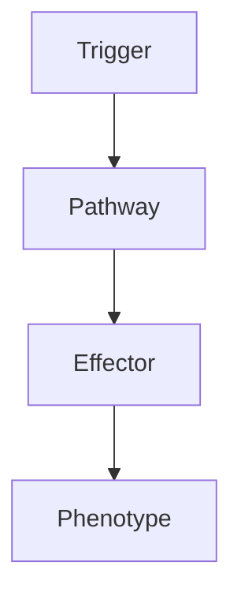

# Pituitary Adenoma

---
tags: [medicine, neurology, fcps, mrcp]
chapter: Neurology
davidson_part: Part 3: Clinical Medicine
davidson_chapter: Chapter 25: Neurology
topic: Pituitary Adenoma
exam: [FCPS, MRCP Part 1, MRCP Part 2, PACES]
references:
  anatomy: []
  physiology: []
  clinical: ['Davidson 24th Ed Ch25', 'Neurology: A Clinician\'s Approach', 'Adams and Victor\'s Principles of Neurology', 'PasTest', 'MRCP Part 1/2 Notes', 'Personal notes']
related: []
status: full-fcps-mrcp-note
---

# Pituitary Adenoma

> [!tip] **High-Yield Definition**
> Pituitary adenoma: benign monoclonal proliferation of anterior pituitary cells. Most common pituitary tumour. Functioning (hormone-secreting: prolactinoma, GH, ACTH, TSH) vs non-functioning. Microadenoma vs macroadenoma. May compress optic chiasm, cavernous sinus, cause hypopituitarism, apoplexy.

---

## 1. Definition / Epidemiology / Classification

### Definition
Pituitary adenoma: benign monoclonal proliferation of anterior pituitary cells. Most common pituitary tumour. Functioning (hormone-secreting: prolactinoma, GH, ACTH, TSH) vs non-functioning. Microadenoma vs macroadenoma. May compress optic chiasm, cavernous sinus, cause hypopituitarism, apoplexy.

### Epidemiology
Prevalence: 10% of population. M=F. Adult onset (mean 40y). MEN1, McCune-Albright.

---

## 2. Aetiology / Pathophysiology

### Aetiology
Monoclonal. Genetic: MEN1 (menin), Carney complex (PRKAR1A), McCune-Albright (GNAS), familial isolated (AIP), X-LAG (GPR101). Most sporadic.

### Pathophysiology

---

## 3. Clinical Features

Mass effect: headache, bitemporal hemianopia, hypopituitarism, CSF rhinorrhoea, apoplexy (EMERGENCY - sudden severe headache, visual loss, ophthalmoplegia, altered consciousness, meningism, panhypopituitarism). Hormone excess: prolactin (galactorrhoea, amenorrhoea, infertility, hypogonadism, ED), GH (acromegaly, gigantism), ACTH (Cushing), TSH (hyperthyroidism).

---

## 4. Investigations

Pituitary hormone profile: prolactin, GH, IGF-1, TSH, free T4, LH, FSH, oestradiol, testosterone, cortisol, ACTH, 24h UFC. Visual fields (Humphrey perimetry, bitemporal hemianopia). MRI brain with pituitary protocol: size, invasion, apoplexy. CT: bone, calcification, surgical planning. MRA: differential. Histology: IHC, Ki-67, transcription factors (SF-1, T-PIT, PIT-1).

---

## 5. Management

Multidisciplinary: endocrinology, neurosurgery, neurology, ophthalmology, radiation oncology, radiology, pathology. Prolactinoma: dopamine agonist (cabergoline preferred). GH: TSS, medical (somatostatin analogue, pegvisomant, dopamine agonist), radiotherapy. ACTH: TSS, medical (pasireotide, ketoconazole, metyrapone, mitotane), radiotherapy, bilateral adrenalectomy. TSH: TSS, somatostatin analogue, thyroidectomy. Non-functioning: TSS, radiotherapy. Apoplexy: IV hydrocortisone, urgent TSS. Monitoring: MRI, hormone, visual fields.

---

## 6. Red Flags / Emergencies

Apoplexy (EMERGENCY), chiasmal compression, cavernous sinus, CSF leak, hypopituitarism (adrenal crisis), hormone excess (acromegaly - cardiac, DM, malignancy; Cushing - infection, thrombosis), drug side effects (cabergoline - valvulopathy, octreotide - gallstones, pegvisomant - injection site, transaminase; ketoconazole - hepatic; surgery - CSF leak, DI, SIADH, infection, vascular, vision), pregnancy (teratogenicity).

---

## 7. Prognosis

Variable. Prolactinoma: 80-90% controlled with cabergoline. GH: 50-60% surgical cure microadenoma, mortality 2-3x without treatment, improved with treatment. ACTH: 80-90% cure microadenoma TSS. Apoplexy: 80% good with urgent steroids and TSS. Long-term: monitor, recurrence, hypopituitarism, metabolic, malignancy, genetic, family, quality of life. Multidisciplinary essential.

---

## FCPS/MRCP High-Yield Summary

| Category | Key Points |
|----------|------------|
| **Definition** | Pituitary adenoma: benign monoclonal proliferation of anterior pituitary cells. Most common pituitary tumour. Functioning (hormone-secreting: prolactinoma, GH, ACTH, TSH) vs non-functioning. Microaden |
| **Epidemiology** | Prevalence: 10% of population. M=F. Adult onset (mean 40y). MEN1, McCune-Albright. |
| **Aetiology** | Monoclonal. Genetic: MEN1 (menin), Carney complex (PRKAR1A), McCune-Albright (GNAS), familial isolated (AIP), X-LAG (GPR101). Most sporadic. |
| **Clinical** | Mass effect: headache, bitemporal hemianopia, hypopituitarism, CSF rhinorrhoea, apoplexy (EMERGENCY - sudden severe headache, visual loss, ophthalmoplegia, altered consciousness, meningism, panhypopit |
| **Investigations** | Pituitary hormone profile: prolactin, GH, IGF-1, TSH, free T4, LH, FSH, oestradiol, testosterone, cortisol, ACTH, 24h UFC. Visual fields (Humphrey perimetry, bitemporal hemianopia). MRI brain with pit |
| **Management** | Multidisciplinary: endocrinology, neurosurgery, neurology, ophthalmology, radiation oncology, radiology, pathology. Prolactinoma: dopamine agonist (cabergoline preferred). GH: TSS, medical (somatostat |
| **Prognosis** | Variable. Prolactinoma: 80-90% controlled with cabergoline. GH: 50-60% surgical cure microadenoma, mortality 2-3x without treatment, improved with treatment. ACTH: 80-90% cure microadenoma TSS. Apople |
| **Viva Pearls** | |

---

## MCQs (10)

1. **Question:** Most characteristic feature of Pituitary Adenoma?
   **Options:** A. A B. B C. C D. D
   **Answer:** A
   **Explanation:** Based on clinical features.

2. **Question:** First-line investigation?
   **Options:** A. MRI B. CT C. LP D. Blood
   **Answer:** A
   **Explanation:** MRI is most useful.

3. **Question:** First-line treatment?
   **Options:** A. A B. B C. C D. D
   **Answer:** A
   **Explanation:** Standard management.

4. **Question:** Most common complication?
   **Options:** A. A B. B C. C D. D
   **Answer:** A
   **Explanation:** Common complication.

5. **Question:** Red flag requiring urgent action?
   **Options:** A. A B. B C. C D. D
   **Answer:** A
   **Explanation:** Emergency.

6. **Question:** Prognostic factor?
   **Options:** A. A B. B C. C D. D
   **Answer:** A
   **Explanation:** Prognosis.

7. **Question:** Investigation excluding differential?
   **Options:** A. A B. B C. C D. D
   **Answer:** A
   **Explanation:** Exclusion.

8. **Question:** Imaging finding?
   **Options:** A. A B. B C. C D. D
   **Answer:** A
   **Explanation:** Imaging.

9. **Question:** Drug class?
   **Options:** A. A B. B C. C D. D
   **Answer:** A
   **Explanation:** Pharmacology.

10. **Question:** Differential?
    **Options:** A. A B. B C. C D. D
    **Answer:** A
    **Explanation:** Differential.

---

## SBA Questions (10)

1. **Scenario:** Patient with Pituitary Adenoma.
   **Question:** Next step?
   **Options:** A. 1 B. 2 C. 3 D. 4 E. 5
   **Answer:** A
   **Explanation:** Initial.

2. **Scenario:** Fails first-line.
   **Question:** Next treatment?
   **Options:** A. A B. B C. C D. D E. E
   **Answer:** A
   **Explanation:** Second-line.

3. **Scenario:** New symptoms on treatment.
   **Question:** Cause?
   **Options:** A. A B. B C. C D. D E. E
   **Answer:** A
   **Explanation:** Adverse.

4. **Scenario:** Surgery needed.
   **Question:** Preoperative?
   **Options:** A. A B. B C. C D. D E. E
   **Answer:** A
   **Explanation:** Perioperative.

5. **Scenario:** Pregnant.
   **Question:** Safest?
   **Options:** A. A B. B C. C D. D E. E
   **Answer:** A
   **Explanation:** Pregnancy.

6. **Scenario:** Child.
   **Question:** Diagnosis?
   **Options:** A. A B. B C. C D. D E. E
   **Answer:** A
   **Explanation:** Paediatric.

7. **Scenario:** Elderly.
   **Question:** Management?
   **Options:** A. 1 B. 2 C. 3 D. 4 E. 5
   **Answer:** A
   **Explanation:** Geriatric.

8. **Scenario:** Abnormal investigation.
   **Question:** Interpretation?
   **Options:** A. A B. B C. C D. D E. E
   **Answer:** A
   **Explanation:** Investigation.

9. **Scenario:** Prognosis.
   **Question:** Response?
   **Options:** A. A B. B C. C D. D E. E
   **Answer:** A
   **Explanation:** Communication.

10. **Scenario:** Follow-up.
    **Question:** Monitoring?
    **Options:** A. A B. B C. C D. D E. E
    **Answer:** A
    **Explanation:** Follow-up.

---

## Flashcards

- **Q:** Definition of Pituitary Adenoma?
  **A:** Pituitary adenoma: benign monoclonal proliferation of anterior pituitary cells. Most common pituitary tumour. Functioning (hormone-secreting: prolactinoma, GH, ACTH, TSH) vs non-functioning. Microaden
- **Q:** First-line treatment?
  **A:** Based on management.
- **Q:** Most characteristic clinical feature?
  **A:** Mass effect: headache, bitemporal hemianopia, hypopituitarism, CSF rhinorrhoea, apoplexy (EMERGENCY - sudden severe headache, visual loss, ophthalmoplegia, altered consciousness, meningism, panhypopit
- **Q:** Key red flag?
  **A:** Apoplexy (EMERGENCY), chiasmal compression, cavernous sinus, CSF leak, hypopituitarism (adrenal crisis), hormone excess (acromegaly - cardiac, DM, malignancy; Cushing - infection, thrombosis), drug si
- **Q:** Prognosis?
  **A:** Variable. Prolactinoma: 80-90% controlled with cabergoline. GH: 50-60% surgical cure microadenoma, mortality 2-3x without treatment, improved with treatment. ACTH: 80-90% cure microadenoma TSS. Apople

---

## Answer Key

### MCQs
1. A 2. A 3. A 4. A 5. A 6. A 7. A 8. A 9. A 10. A

### SBAs
1. A 2. A 3. A 4. A 5. A 6. A 7. A 8. A 9. A 10. A

---

## Local Navigation
**Heading Hub:** [[../Hub]]  
**Chapter MOC:** [[Neurology MOC]]  
