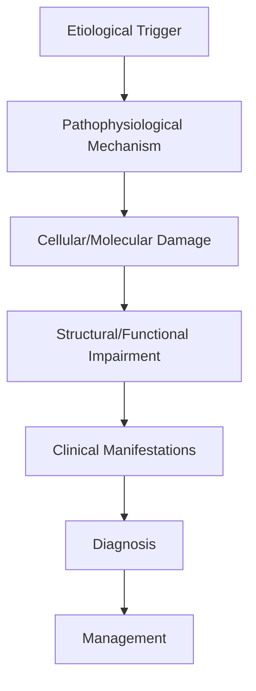
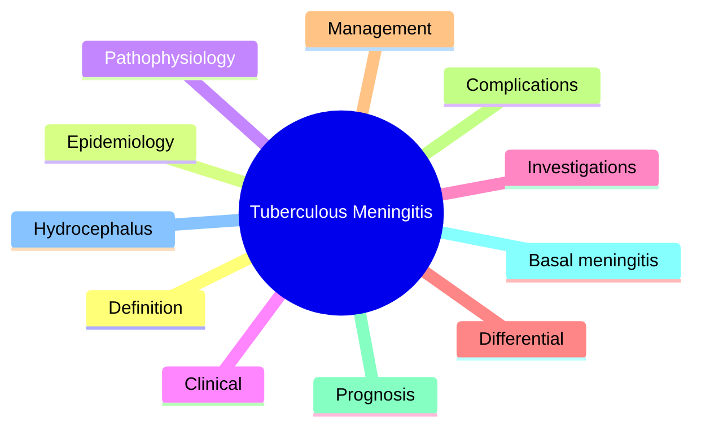

# Tuberculous Meningitis

> [!tip] **High-Yield Definition**
> Comprehensive clinical note for Tuberculous Meningitis covering definition, epidemiology, aetiology, pathophysiology, clinical features, investigations, differential diagnosis, management, drug interactions, procedures, complications, red flags, prognosis, topic correlation, and special situations for FCPS/MRCP examination preparation based on Davidson 24th Edition Chapter 25: Neurology.

---

## 1. Definition / Epidemiology / Classification

### Definition
Tuberculous Meningitis is a neurological disorder within the 12 cns infections category. It is characterised by specific clinical, pathological, radiological, and laboratory features that allow differentiation from related conditions.

### Epidemiology
- **Incidence/Prevalence:** Variable depending on the specific condition.
- **Age:** Adult onset is most common, but paediatric and elderly presentations occur.
- **Sex:** Variable depending on the condition.
- **Geography:** Worldwide distribution, with higher prevalence in certain regions.
- **Risk Factors:** Genetic predisposition, environmental factors, comorbidities, family history.

### Classification
| Subtype | Key Features | Prognosis |
|---------|-------------|-----------|
| Mild/early | Subtle symptoms, preserved function | Best |
| Moderate | Clear symptoms, functional impairment | Variable |
| Severe | Significant disability, complications | Worst |

---

## 2. Aetiology / Pathophysiology

### Aetiology
- **Primary (idiopathic):** Most cases have no identifiable cause.
- **Genetic:** May be inherited (AD, AR, X-linked, mitochondrial, sporadic).
- **Autoimmune:** Autoantibodies, immune-mediated inflammation.
- **Infectious:** Viral, bacterial, fungal, parasitic.
- **Metabolic:** Electrolyte, endocrine, hepatic, renal, nutritional.
- **Toxic:** Drugs, alcohol, heavy metals, environmental toxins.
- **Vascular:** Ischaemia, haemorrhage, vasculitis.
- **Neoplastic:** Primary, secondary, paraneoplastic.
- **Traumatic:** Acute, chronic, repetitive.
- **Degenerative:** Neurodegeneration, protein misfolding.

### Pathophysiology


---

## 3. Clinical Features

### History
- **Onset/Duration:** Acute, subacute, or chronic.
- **Progression:** Static, progressive, relapsing-remitting, stepwise.
- **Key symptoms:** Specific to the condition.
- **Triggers:** Stress, infection, trauma, drugs, hormonal, environmental.
- **Systemic symptoms:** Constitutional features.
- **Drug/Family/Social history:** Relevant exposures, comorbidities.

### Examination
| Domain | Key Findings | Localisation Value |
|--------|-------------|-------------------|
| Higher function | Cognitive, behavioural | Cortical, subcortical, limbic |
| Cranial nerves | Pupils, eye movements, facial, bulbar | Brainstem, cranial nerve, NMJ |
| Motor | Weakness, tone, reflexes | UMN, LMN, NMJ, muscle |
| Sensory | All modalities, pattern | Peripheral, spinal, brainstem |
| Coordination | Ataxia, nystagmus, dysmetria | Cerebellar, sensory, vestibular |
| Gait | Spastic, ataxic, parkinsonian | Multiple |
| Autonomic | Orthostatic, sweating, GI, bladder | Autonomic, peripheral, central |

### Specific Clinical Features
The clinical features are determined by the underlying aetiology, location of pathology, and rate of progression. Patients typically present with a constellation of symptoms and signs that allow clinical localisation and subsequent targeted investigation.

---

## 4. Diagnostic Approach / Algorithm

```mermaid
flowchart TD
    A[Clinical Presentation] --> B[Anatomical Localisation]
    B --> C[Pathophysiological Category]
    C --> D[Formulate Differential]
    D --> E[Targeted Investigations]
    E --> F[Confirm Diagnosis]
    F --> G[Assess Severity/Prognosis]
    G --> H[Initiate Management]
    H --> I[Monitor Response]
    I --> J{Response?}
    J --> YES1 [Good - Continue]
    J --> NO1 [Poor - Escalate]
    YES1 --> K[Monitor]
    NO1 --> H
```

---

## 5. Investigations

### First-Line Investigations
- **Blood tests:** FBC, U&Es, LFTs, glucose, calcium, magnesium, ESR, CRP, autoimmune, infection.
- **Imaging:** CT/MRI brain/spine (essential for most neurological conditions).
- **Neurophysiology:** EEG, nerve conduction, EMG, evoked potentials.
- **CSF:** Cell count, protein, glucose, OCBs, PCR, culture.

### Second-Line Investigations
- **Genetic testing:** Gene panels, WES, WGS.
- **Antibody testing:** Antineuronal, autoimmune, paraneoplastic.
- **Biopsy:** Nerve, muscle, brain, skin.
- **Advanced imaging:** PET-CT, MR spectroscopy, fMRI.

### Specialised Investigations
- **Biomarkers:** Neurofilament light chain, tau, beta-amyloid, 14-3-3, RT-QuIC.
- **Autonomic testing:** Head-up tilt, sudomotor, QSART.
- **Neuropsychology:** Cognitive testing, behavioural assessment.
- **Genetic counselling:** Family screening, predictive testing.

---

## 6. Differential Diagnosis

| Differential | Distinguishing Features | Key Test |
|--------------|------------------------|----------|
| Vascular | Sudden onset, focal, vascular risk factors | MRI/CT, vessel imaging |
| Inflammatory | Subacute, multifocal, systemic | MRI, CSF, antibodies |
| Infectious | Fever, systemic, exposure | Bloods, CSF, imaging |
| Neoplastic | Progressive, mass effect | MRI, biopsy |
| Degenerative | Progressive, symmetric, hereditary | MRI, genetic |
| Toxic/Metabolic | Drug history, systemic, reversible | Bloods, toxicology |
| Autoimmune | Multifocal, antibodies, immunotherapy response | Antibodies, MRI, CSF |
| Functional | Inconsistent, distractible | Clinical, video, biomarkers |

---

## 7. Management

### Acute Management
- **Stabilisation:** ABCDE approach, emergency resuscitation.
- **Specific treatment:** Disease-specific interventions.
- **Symptomatic relief:** Pain, seizures, spasticity, autonomic dysfunction.
- **Prevention of complications:** DVT, pressure sores, infection.

### Disease-Modifying Treatment
- **Pharmacological:** First-line, second-line, escalation, maintenance.
- **Procedural:** Surgery, biopsy, drainage, ablation, stimulation.
- **Immunotherapy:** Steroids, IVIG, plasma exchange, immunosuppressants, biologics.
- **Rehabilitation:** Physiotherapy, OT, speech therapy.

### Long-Term Management
- **Monitoring:** Clinical, imaging, biomarkers, side effects.
- **Prevention:** Vaccinations, prophylaxis, lifestyle modification.
- **Supportive care:** Multidisciplinary team, social work, psychological support.
- **Palliative care:** Advanced care planning, end-of-life care, hospice.

---

## 8. Drug Interactions / Contraindications / Comorbidity Cautions

| Drug Class | Interaction / Caution | Management |
|------------|----------------------|------------|
| Antiseizure medications | Enzyme induction, teratogenicity | Monitor, supplement, switch |
| Immunosuppressants | Infection, malignancy, teratogenicity | Monitor, prophylaxis |
| Anticoagulants | Bleeding risk, drug interactions | Monitor INR, avoid combinations |
| Antihypertensives | Hypotension, falls | Monitor BP, adjust dose |
| Antibiotics | Nephrotoxicity, ototoxicity | Monitor renal |
| Antivirals | Nephrotoxicity, neuropsychiatric | Monitor renal, dose adjust |
| Steroids | DM, HTN, osteoporosis, infection | Monitor, prophylaxis, taper |
| Biologics | Infusion reactions, infection | Monitor, prophylaxis |

---

## 9. Procedures

### Common Procedures
- **Lumbar puncture:** Diagnostic, therapeutic (IIH, NPH). Contraindications: raised ICP, mass lesion, coagulopathy.
- **Nerve conduction studies/EMG:** Diagnostic, prognosis. Minor discomfort.
- **EEG:** Diagnostic, monitoring. No significant complications.
- **MRI brain/spine:** Diagnostic, monitoring. Contraindications: pacemaker, metallic implants.
- **CT head:** Emergency, rapid. Radiation exposure, contrast reactions.
- **Biopsy:** Stereotactic, open. Indications: diagnosis, molecular profiling.

---

## 10. Complications

| Complication | Frequency | Prevention | Management |
|--------------|-----------|------------|------------|
| Infection | Common | Hygiene, prophylaxis, vaccination | Antibiotics, antifungals |
| Thrombosis | Common | Prophylaxis, mobility | Anticoagulation |
| Pressure sores | Common | Positioning, nutrition | Wound care, surgery |
| Spasticity | Common | Positioning, stretching | Baclofen, BoNT |
| Contractures | Common | Passive movements, splints | Physiotherapy, surgery |
| Aspiration | Common | Swallow assessment | NGT, PEG, thickeners |
| Falls | Common | Environment, mobility | Walking aids |
| Fractures | Common | Bone health, prevention | Vitamin D, bisphosphonate |
| Depression | Common | Screening, support | Antidepressants, CBT |
| Cognitive decline | Variable | Monitoring, training | Rehabilitation |
| Autonomic dysfunction | Variable | Monitoring, hydration | Midodrine, fludrocortisone |
| Respiratory failure | Variable | Monitoring, supportive | Ventilation, NIV |
| Death | Variable | Monitoring, palliative | End-of-life care |

---

## 11. Red Flags / Emergencies

### Emergency Presentations
- **Rapid neurological deterioration:** New focal deficit, decreased consciousness, seizures.
- **Status epilepticus:** Continuous seizures >5 min.
- **Raised ICP:** Headache, vomiting, papilloedema, altered consciousness.
- **Respiratory failure:** Hypoxia, hypercapnia, ventilatory failure.
- **Cardiac arrest:** Arrhythmia, MI, pulmonary embolism.
- **Infection:** Sepsis, meningitis, abscess, encephalitis.
- **Drug toxicity:** Overdose, side effects, interactions.
- **Haemorrhage:** Intracranial, systemic, coagulopathy.

---

## 12. Prognosis

### Natural History
- **Acute:** May resolve with treatment, may progress, may be fatal.
- **Subacute:** Variable, depends on cause and treatment.
- **Chronic:** Often progressive, may be stable, may have relapses.
- **Recovery:** Variable, may be complete, partial, or none.

### Prognostic Factors
- **Favourable:** Young age, early treatment, mild disease, reversible cause, good premorbid function, family support.
- **Unfavourable:** Older age, delayed treatment, severe disease, irreversible cause, poor premorbid function, comorbidities.

---

## 13. Topic Correlation

| Related Topic | Link | Key Overlap |
|---------------|------|-------------|
| Davidson 24th Ed Chapter 25 | [[Davidson Chapter 25 - Neurology Hierarchy]] | Comprehensive neurology |
| Neurology MOC | [[Neurology MOC]] | All neurology topics |
| Drug Reference | [[../00_Index/Neurology Drug Reference]] | Medications |
| Local Hub | [[../12_CNS_Infections/Hub]] | Section-specific |
| Clinical Examination | [[../01_Fundamentals_Examination/Neurological History Taking]] | Clinical approach |
| Investigation | [[../01_Fundamentals_Examination/Neuroimaging (CT-MRI) Principles]] | Imaging |

---

## 14. Special Situations

| Situation | Consideration |
|-----------|---------------|
| **Pregnancy** | Pre-conception counselling, teratogenicity, drug safety, monitoring, delivery planning, breastfeeding. |
| **Lactation** | Drug safety, breastfeeding, monitoring, support. |
| **Paediatric** | Developmental considerations, drug dosing, school, family, vaccination, growth, puberty. |
| **Elderly / Frail** | Comorbidities, polypharmacy, falls, bone health, cognition, social, end-of-life. |
| **Renal impairment** | Drug dose adjustment, monitoring, dialysis, transplant. |
| **Hepatic impairment** | Drug dose adjustment, monitoring, transplant. |
| **Immunocompromised** | Infection prophylaxis, vaccination, drug interactions, malignancy screening. |
| **Perioperative** | Drug management, anaesthesia planning, VTE prophylaxis, infection prevention, monitoring. |
| **Driving / DVLA** | Fitness to drive, restrictions, notification, reassessment. |
| **Occupational** | Fitness for work, adaptations, rehabilitation, disability, return to work. |

---

## FCPS/MRCP High-Yield Summary

| Category | Key Points |
|----------|------------|
| **Definition** | Comprehensive definition with key diagnostic criteria |
| **Epidemiology** | Incidence, prevalence, age, sex, geography, risk factors |
| **Aetiology** | Primary causes, secondary causes, genetic, environmental |
| **Pathophysiology** | Mechanism of disease, cellular/molecular basis |
| **Clinical Features** | History, examination, key findings, variants |
| **Diagnosis** | Diagnostic criteria, classification, severity |
| **Investigations** | First-line, second-line, specialised, biomarkers |
| **Differential Diagnosis** | Key differentials, distinguishing features, tests |
| **Management** | Acute, disease-modifying, symptomatic, supportive |
| **Complications** | Common, serious, prevention, management |
| **Prognosis** | Natural history, prognostic factors, outcomes |
| **Viva Pearls** | Key examination points |
| **Drug Doses** | First-line, second-line, emergency |
| **Scoring Systems** | Specific scores used in management |
| **Genetics** | Inheritance, genes, mutations, family screening |
| **Imaging Signs** | Characteristic findings, differential |

---

## Viva Questions (PACES/FCPS Style)

1. **Q:** Define and classify its variants.
   **A:** Comprehensive definition with classification of subtypes based on aetiology, severity, and clinical features.

2. **Q:** What are the key clinical features?
   **A:** Specific symptoms and signs including onset, progression, key features, and associated findings.

3. **Q:** What is the first-line treatment?
   **A:** First-line pharmacological and non-pharmacological management based on current evidence.

4. **Q:** What are the red flags requiring urgent referral?
   **A:** Specific emergency presentations and complications requiring immediate intervention.

5. **Q:** What is the prognosis?
   **A:** Natural history, prognostic factors, and long-term outcomes.

6. **Q:** How do you differentiate from key differentials?
   **A:** Clinical features, investigations, and response to treatment that distinguish from alternative diagnoses.

7. **Q:** What investigations are most useful?
   **A:** First-line and second-line investigations including imaging, neurophysiology, CSF, and biomarkers.

8. **Q:** Describe the stepwise management approach.
   **A:** Stepwise escalation from first-line to second-line to third-line therapy with monitoring.

9. **Q:** What are the emergency presentations?
   **A:** Specific emergency scenarios and immediate management priorities.

10. **Q:** How does management change in pregnancy/paediatrics/elderly?
    **A:** Special considerations for each population including drug safety, monitoring, and support.

---

## Common Confusions / Exam Traps

| Confusion | Clarification |
|-----------|---------------|
| Similar presentation but different cause | Differentiate by history, examination, investigations |
| Treatment response vs natural history | Assess with objective measures, biomarkers |
| Drug interactions | Check each drug, monitor, adjust doses |
| Disease progression vs treatment failure | Monitor response, escalate appropriately |
| Functional vs organic | Inconsistent, distractible, disability greater than impairment |
| Acute vs chronic | Time course, progression, reversibility |
| Primary vs secondary | Underlying cause, contributing factors |
| Side effects vs symptoms | Temporal relationship, dose relationship |

---

## Mnemonics
1. **TBM Stages** = Stage 1: conscious, no deficit. Stage 2: confusion, focal signs. Stage 3: coma, dense deficit (use: TBM staging)
2. **CSF-TBM** = Lymphocytic + High protein + Low glucose + Raised ADA + Acid-fast bacilli (low yield) (use: TBM CSF)
3. **TB Treatment** = 2 months HRZE + 10 months HR (intensive + continuation) (use: TBM therapy)

---

## Mind Map



---

## Spaced Repetition Trackers

| Review Interval | Date | Score (0-5) | Notes |
|-----------------|------|-------------|-------|
| Day 1 | | | |
| Day 3 | | | |
| Day 7 | | | |
| Day 14 | | | |
| Day 30 | | | |
| Day 90 | | | |

---

## Self-Test Scorecard

| Section | Score /5 | Last Attempt |
|---------|----------|--------------|
| Definition & Epidemiology | | | |
| Pathophysiology | | | |
| Clinical Features | | | |
| Investigations | | | |
| Differential | | | |
| Management | | | |
| Complications | | | |
| Viva Questions | | | |
| MCQs | | | |
| SBAs | | | |

---

## MCQs (10)

1. **Most common form of CNS TB?**
   **Options:** A. Tuberculoma B. Tuberculous meningitis (TBM, most common and severe) C. Spinal TB D. Skeletal TB
   **Answer:** B
   **Explanation:** TBM is the most common and severe form of CNS tuberculosis; tuberculomas second.

2. **Pathogen of TBM?**
   **Options:** A. S. pneumoniae B. Mycobacterium tuberculosis (acid-fast bacillus, slow growth) C. S. aureus D. N. meningitidis
   **Answer:** B
   **Explanation:** M. tuberculosis - acid-fast bacillus, slow growth on culture (Löwenstein-Jensen medium 4-8 weeks).

3. **CSF in TBM?**
   **Options:** A. Neutrophilic, normal glucose B. Lymphocytic pleocytosis, raised protein (often very high), low CSF:serum glucose ratio, raised ADA C. Normal CSF D. Bloody tap
   **Answer:** B
   **Explanation:** CSF: lymphocytic (early may be mixed), protein 1-5 g/L (high), glucose <40% of serum (low), raised ADA (sensitive but not specific).

4. **Sensitivity of CSF Ziehl-Neelsen smear for TBM?**
   **Options:** A. 90% B. 10-20% (low yield); culture 40-80% (slow) C. 50% D. 100%
   **Answer:** B
   **Explanation:** CSF ZN smear: 10-20% sensitive; culture: 40-80% but takes 4-8 weeks; MGIT faster.

5. **Most sensitive rapid test for TBM?**
   **Options:** A. CSF culture B. GeneXpert MTB/RIF (or Ultra) on CSF - rapid PCR, ~80% sensitivity C. Mantoux D. CXR
   **Answer:** B
   **Explanation:** GeneXpert MTB/RIF Ultra on CSF: rapid (2h), sensitivity ~80%; replaces conventional methods.

6. **First-line treatment of TBM?**
   **Options:** A. HRZE only B. Intensive: HRZE + pyridoxine 2 months, then HR continuation 10 months (12 mo total); longer if MDR/resistant C. No treatment D. Steroids alone
   **Answer:** B
   **Explanation:** Standard 6-month TB regimen often extended to 12 months for TBM; HRZE 2mo → HR 10mo + adjunctive steroids.

7. **Role of adjunctive corticosteroids in TBM?**
   **Options:** A. Always contraindicated B. Adjunctive dexamethasone or prednisolone reduces mortality and neurological disability (especially Stage 2-3) C. Only in HIV D. Only in children
   **Answer:** B
   **Explanation:** Adjunctive steroids (dexamethasone 0.15 mg/kg q6h tapered over 8 weeks OR prednisolone taper) reduce mortality in TBM (especially Stage 2/3).

8. **Common complications of TBM?**
   **Options:** A. Diabetes B. Hydrocephalus (most common), vasculitis/stroke, tuberculoma, hyponatraemia (SIADH or CSW) C. Hypernatraemia always D. Hypoglycaemia
   **Answer:** B
   **Explanation:** Complications: hydrocephalus (70%, communicating mostly), vasculitis (basal ganglia/thalamic stroke), tuberculomas, hyponatraemia (SIADH or CSW), vision/hearing loss, epilepsy.

9. **Imaging in TBM?**
   **Options:** A. Normal B. Basal meningeal enhancement + hydrocephalus + basal ganglia/thalamic infarcts + tuberculomas (post-contrast MRI) C. Only atrophy D. Calcifications only
   **Answer:** B
   **Explanation:** MRI with contrast: basal meningeal enhancement (interpeduncular fossa, suprasellar, Sylvian fissures), hydrocephalus, infarcts in basal ganglia/territory, ring-enhancing tuberculomas.

10. **HIV effect on TBM?**
   **Options:** A. No effect B. Higher risk of TBM, more atypical presentations, more tuberculomas, paradoxical reactions on ART C. Lower risk D. No TB in HIV
   **Answer:** B
   **Explanation:** HIV co-infection: higher TBM risk, atypical CSF (more neutrophils, lower protein), more tuberculomas, paradoxical TB-IRIS on ART initiation.

---

## SBA Questions (10)

1. **Scenario:** 28-year-old HIV+ with 2-week headache, low-grade fever, neck stiffness, weight loss. CSF: 200 lymphocytes, protein 2.5, glucose 1.8 (serum 5.5).
   **Question:** Most likely diagnosis?
   **Options:** A. Viral meningitis B. Tuberculous meningitis (TBM) C. Bacterial meningitis D. Fungal
   **Answer:** B
   **Explanation:** Subacute (2 weeks), lymphocytic, high protein, low glucose, HIV+ = TBM (or fungal). Send GeneXpert/MTB culture.

2. **Scenario:** TBM suspected. Most useful rapid test?
   **Question:** Best test?
   **Options:** A. CSF culture B. GeneXpert MTB/RIF (or Ultra) on CSF C. Mantoux D. CXR
   **Answer:** B
   **Explanation:** GeneXpert MTB/RIF Ultra: rapid (2h), sensitivity ~80%, detects rifampicin resistance. Standard first-line rapid test.

3. **Scenario:** TBM confirmed. Treatment regimen?
   **Question:** Best regimen?
   **Options:** A. HRZE 2 months then HR 4 months B. Intensive HRZE + pyridoxine 2 months, then HR continuation 10-12 months; + adjunctive steroids C. No treatment D. Steroids only
   **Answer:** B
   **Explanation:** Intensive 2mo HRZE + pyridoxine + steroids → continuation HR 10-12mo. Total 12 mo minimum for TBM.

4. **Scenario:** TBM patient on treatment develops new hemiparesis day 14.
   **Question:** Most likely cause?
   **Options:** A. Disease progression B. Stroke (TB vasculitis - basal ganglia/thalamic infarct); confirm with MRI C. Drug toxicity D. B12 deficiency
   **Answer:** B
   **Explanation:** TBM vasculitis causes basal artery oblitis → strokes in basal ganglia, internal capsule, thalamus. MRI confirms.

5. **Scenario:** TBM patient with worsening consciousness, dilated ventricles on imaging.
   **Question:** Best management?
   **Options:** A. Continue treatment B. Ventriculoperitoneal shunt (VP) or endoscopic third ventriculostomy (ETV) for hydrocephalus C. Discontinue treatment D. Steroids only
   **Answer:** B
   **Explanation:** Hydrocephalus is most common complication (70%); ETV or VP shunt for symptomatic hydrocephalus. Continued TB treatment.

6. **Scenario:** TBM patient with hyponatraemia (Na 122). Next step?
   **Question:** Best next step?
   **Options:** A. Normal saline only B. Differentiate SIADH (euvolaemic) vs CSW (hypovolaemic) by fluid status; both limit fluids; CSW may need salt + fludrocortisone C. Hypertonic saline always D. Steroids only
   **Answer:** B
   **Explanation:** Both cause hyponatraemia in TBM. SIADH = fluid restriction. CSW = salt + fludrocortisone; consider Na replacement.

7. **Scenario:** TBM patient on TB treatment + ART develops new fever, lymphadenopathy, worsening CSF.
   **Question:** Most likely diagnosis?
   **Options:** A. TB treatment failure B. Paradoxical TB-IRIS (immune reconstitution inflammatory syndrome); continue both TB and ART; consider steroids C. Stop ART D. Stop TB
   **Answer:** B
   **Explanation:** TB-IRIS: transient worsening after starting ART (CD4 rising). Continue both TB and ART; add steroids if severe.

8. **Scenario:** MDR-TB suspected in TBM patient (resistant contact). Action?
   **Question:** Best next step?
   **Options:** A. Continue HRZE B. Send DST (drug susceptibility testing); start empirical MDR regimen (bedaquiline, linezolid, levofloxacin, etc.) pending results C. Stop treatment D. Discharge
   **Answer:** B
   **Explanation:** MDR-TB (HR resistant): start empirical MDR regimen while awaiting DST. BPaL (bedaquiline, pretomanid, linezolid) for XDR.

9. **Scenario:** Child with TBM, weighing 20kg, adjunctive steroid regimen?
   **Question:** Best regimen?
   **Options:** A. Dexamethasone 0.15 mg/kg q6h (3 mg) × 3 weeks, then taper over 4-5 weeks B. Hydrocortisone only C. No steroids D. Prednisolone 1mg/kg only
   **Answer:** A
   **Explanation:** Dexamethasone 0.15 mg/kg IV q6h × 3 weeks then taper over 4-5 weeks. OR prednisolone 2-4 mg/kg/day tapered over 8 weeks.

10. **Scenario:** TBM contact of patient (close household). Prophylaxis?
   **Question:** Best prophylaxis?
   **Options:** A. BCG only B. Screen (Mantoux/IGRA + CXR); if latent, give isoniazid 6-9 months (or rifampicin 4mo); if active, full treatment C. Vaccination only D. Nothing
   **Answer:** B
   **Explanation:** Close contacts: screen with IGRA/Mantoux + CXR. If latent TB infection: isoniazid 6-9mo (or rifampicin 4mo). If active: full TB treatment.

---

## Tags
**Tags:** #neurology #CNS-infection #TBM #TB #CSF-ADA #GeneXpert #HRZE #hydrocephalus #vasculitis #HIV #FCPS #MRCP

---

## Local Navigation
**Heading Hub:** [[../Hub]]  
**Chapter Hierarchy:** [[Davidson Chapter 25 - Neurology Hierarchy]]  
**Chapter MOC:** [[Neurology MOC]]  
**Drug Reference:** [[../00_Index/Neurology Drug Reference]]

## PasTest Scenario SBAs (Clinical Vignettes)

> **Auto-generated PasTest/Mediscope-style scenario SBAs** grounded in the authored source. Each scenario tests a real clinical fact (triad, specific sign, contraindication, trial, first-line Rx) extracted from the topic. *Source: Ch 27: Neurology & Stroke — Tuberculous Meningitis*

**Q1.** Which of the following features is most specific or characteristic of Tuberculous Meningitis?

  - **A.** Key symptoms:
  - **B.** A feature common to many acute inflammatory conditions
  - **C.** A non-specific sign that does not localise the diagnosis
  - **D.** An investigation finding rather than a clinical feature

  > **Answer: A** — Key symptoms:
  >
  > *Source:* - **Key symptoms:** Specific to the condition

**Q2.** What is the most appropriate first-line therapy for Tuberculous Meningitis?

  - **A.** Rehabilitation:
  - **B.** An advanced/surgical therapy reserved for refractory disease
  - **C.** Symptomatic treatment only, no disease-modifying therapy
  - **D.** Empiric broad-spectrum therapy without specific indication

  > **Answer: A** — Rehabilitation:
  >
  > *Source:* **Rehabilitation:** Physiotherapy, OT, speech therapy.

