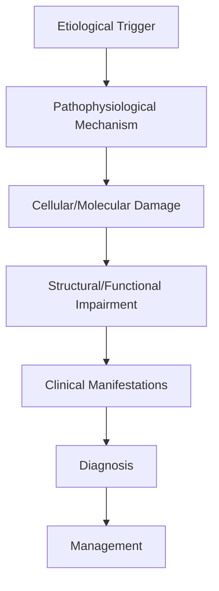
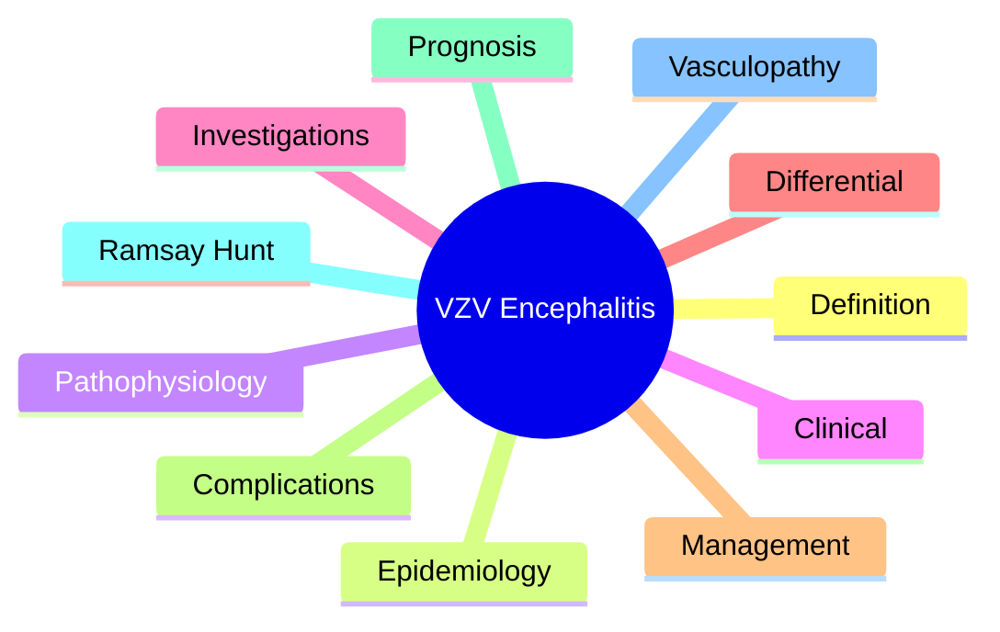

# VZV Encephalitis

> [!tip] **High-Yield Definition**
> Comprehensive clinical note for VZV Encephalitis covering definition, epidemiology, aetiology, pathophysiology, clinical features, investigations, differential diagnosis, management, drug interactions, procedures, complications, red flags, prognosis, topic correlation, and special situations for FCPS/MRCP examination preparation based on Davidson 24th Edition Chapter 25: Neurology.

---

## 1. Definition / Epidemiology / Classification

### Definition
VZV Encephalitis is a neurological disorder within the 12 cns infections category. It is characterised by specific clinical, pathological, radiological, and laboratory features that allow differentiation from related conditions.

### Epidemiology
- **Incidence/Prevalence:** Variable depending on the specific condition.
- **Age:** Adult onset is most common, but paediatric and elderly presentations occur.
- **Sex:** Variable depending on the condition.
- **Geography:** Worldwide distribution, with higher prevalence in certain regions.
- **Risk Factors:** Genetic predisposition, environmental factors, comorbidities, family history.

### Classification
| Subtype | Key Features | Prognosis |
|---------|-------------|-----------|
| Mild/early | Subtle symptoms, preserved function | Best |
| Moderate | Clear symptoms, functional impairment | Variable |
| Severe | Significant disability, complications | Worst |

---

## 2. Aetiology / Pathophysiology

### Aetiology
- **Primary (idiopathic):** Most cases have no identifiable cause.
- **Genetic:** May be inherited (AD, AR, X-linked, mitochondrial, sporadic).
- **Autoimmune:** Autoantibodies, immune-mediated inflammation.
- **Infectious:** Viral, bacterial, fungal, parasitic.
- **Metabolic:** Electrolyte, endocrine, hepatic, renal, nutritional.
- **Toxic:** Drugs, alcohol, heavy metals, environmental toxins.
- **Vascular:** Ischaemia, haemorrhage, vasculitis.
- **Neoplastic:** Primary, secondary, paraneoplastic.
- **Traumatic:** Acute, chronic, repetitive.
- **Degenerative:** Neurodegeneration, protein misfolding.

### Pathophysiology


---

## 3. Clinical Features

### History
- **Onset/Duration:** Acute, subacute, or chronic.
- **Progression:** Static, progressive, relapsing-remitting, stepwise.
- **Key symptoms:** Specific to the condition.
- **Triggers:** Stress, infection, trauma, drugs, hormonal, environmental.
- **Systemic symptoms:** Constitutional features.
- **Drug/Family/Social history:** Relevant exposures, comorbidities.

### Examination
| Domain | Key Findings | Localisation Value |
|--------|-------------|-------------------|
| Higher function | Cognitive, behavioural | Cortical, subcortical, limbic |
| Cranial nerves | Pupils, eye movements, facial, bulbar | Brainstem, cranial nerve, NMJ |
| Motor | Weakness, tone, reflexes | UMN, LMN, NMJ, muscle |
| Sensory | All modalities, pattern | Peripheral, spinal, brainstem |
| Coordination | Ataxia, nystagmus, dysmetria | Cerebellar, sensory, vestibular |
| Gait | Spastic, ataxic, parkinsonian | Multiple |
| Autonomic | Orthostatic, sweating, GI, bladder | Autonomic, peripheral, central |

### Specific Clinical Features
The clinical features are determined by the underlying aetiology, location of pathology, and rate of progression. Patients typically present with a constellation of symptoms and signs that allow clinical localisation and subsequent targeted investigation.

---

## 4. Diagnostic Approach / Algorithm

```mermaid
flowchart TD
    A[Clinical Presentation] --> B[Anatomical Localisation]
    B --> C[Pathophysiological Category]
    C --> D[Formulate Differential]
    D --> E[Targeted Investigations]
    E --> F[Confirm Diagnosis]
    F --> G[Assess Severity/Prognosis]
    G --> H[Initiate Management]
    H --> I[Monitor Response]
    I --> J{Response?}
    J --> YES1 [Good - Continue]
    J --> NO1 [Poor - Escalate]
    YES1 --> K[Monitor]
    NO1 --> H
```

---

## 5. Investigations

### First-Line Investigations
- **Blood tests:** FBC, U&Es, LFTs, glucose, calcium, magnesium, ESR, CRP, autoimmune, infection.
- **Imaging:** CT/MRI brain/spine (essential for most neurological conditions).
- **Neurophysiology:** EEG, nerve conduction, EMG, evoked potentials.
- **CSF:** Cell count, protein, glucose, OCBs, PCR, culture.

### Second-Line Investigations
- **Genetic testing:** Gene panels, WES, WGS.
- **Antibody testing:** Antineuronal, autoimmune, paraneoplastic.
- **Biopsy:** Nerve, muscle, brain, skin.
- **Advanced imaging:** PET-CT, MR spectroscopy, fMRI.

### Specialised Investigations
- **Biomarkers:** Neurofilament light chain, tau, beta-amyloid, 14-3-3, RT-QuIC.
- **Autonomic testing:** Head-up tilt, sudomotor, QSART.
- **Neuropsychology:** Cognitive testing, behavioural assessment.
- **Genetic counselling:** Family screening, predictive testing.

---

## 6. Differential Diagnosis

| Differential | Distinguishing Features | Key Test |
|--------------|------------------------|----------|
| Vascular | Sudden onset, focal, vascular risk factors | MRI/CT, vessel imaging |
| Inflammatory | Subacute, multifocal, systemic | MRI, CSF, antibodies |
| Infectious | Fever, systemic, exposure | Bloods, CSF, imaging |
| Neoplastic | Progressive, mass effect | MRI, biopsy |
| Degenerative | Progressive, symmetric, hereditary | MRI, genetic |
| Toxic/Metabolic | Drug history, systemic, reversible | Bloods, toxicology |
| Autoimmune | Multifocal, antibodies, immunotherapy response | Antibodies, MRI, CSF |
| Functional | Inconsistent, distractible | Clinical, video, biomarkers |

---

## 7. Management

### Acute Management
- **Stabilisation:** ABCDE approach, emergency resuscitation.
- **Specific treatment:** Disease-specific interventions.
- **Symptomatic relief:** Pain, seizures, spasticity, autonomic dysfunction.
- **Prevention of complications:** DVT, pressure sores, infection.

### Disease-Modifying Treatment
- **Pharmacological:** First-line, second-line, escalation, maintenance.
- **Procedural:** Surgery, biopsy, drainage, ablation, stimulation.
- **Immunotherapy:** Steroids, IVIG, plasma exchange, immunosuppressants, biologics.
- **Rehabilitation:** Physiotherapy, OT, speech therapy.

### Long-Term Management
- **Monitoring:** Clinical, imaging, biomarkers, side effects.
- **Prevention:** Vaccinations, prophylaxis, lifestyle modification.
- **Supportive care:** Multidisciplinary team, social work, psychological support.
- **Palliative care:** Advanced care planning, end-of-life care, hospice.

---

## 8. Drug Interactions / Contraindications / Comorbidity Cautions

| Drug Class | Interaction / Caution | Management |
|------------|----------------------|------------|
| Antiseizure medications | Enzyme induction, teratogenicity | Monitor, supplement, switch |
| Immunosuppressants | Infection, malignancy, teratogenicity | Monitor, prophylaxis |
| Anticoagulants | Bleeding risk, drug interactions | Monitor INR, avoid combinations |
| Antihypertensives | Hypotension, falls | Monitor BP, adjust dose |
| Antibiotics | Nephrotoxicity, ototoxicity | Monitor renal |
| Antivirals | Nephrotoxicity, neuropsychiatric | Monitor renal, dose adjust |
| Steroids | DM, HTN, osteoporosis, infection | Monitor, prophylaxis, taper |
| Biologics | Infusion reactions, infection | Monitor, prophylaxis |

---

## 9. Procedures

### Common Procedures
- **Lumbar puncture:** Diagnostic, therapeutic (IIH, NPH). Contraindications: raised ICP, mass lesion, coagulopathy.
- **Nerve conduction studies/EMG:** Diagnostic, prognosis. Minor discomfort.
- **EEG:** Diagnostic, monitoring. No significant complications.
- **MRI brain/spine:** Diagnostic, monitoring. Contraindications: pacemaker, metallic implants.
- **CT head:** Emergency, rapid. Radiation exposure, contrast reactions.
- **Biopsy:** Stereotactic, open. Indications: diagnosis, molecular profiling.

---

## 10. Complications

| Complication | Frequency | Prevention | Management |
|--------------|-----------|------------|------------|
| Infection | Common | Hygiene, prophylaxis, vaccination | Antibiotics, antifungals |
| Thrombosis | Common | Prophylaxis, mobility | Anticoagulation |
| Pressure sores | Common | Positioning, nutrition | Wound care, surgery |
| Spasticity | Common | Positioning, stretching | Baclofen, BoNT |
| Contractures | Common | Passive movements, splints | Physiotherapy, surgery |
| Aspiration | Common | Swallow assessment | NGT, PEG, thickeners |
| Falls | Common | Environment, mobility | Walking aids |
| Fractures | Common | Bone health, prevention | Vitamin D, bisphosphonate |
| Depression | Common | Screening, support | Antidepressants, CBT |
| Cognitive decline | Variable | Monitoring, training | Rehabilitation |
| Autonomic dysfunction | Variable | Monitoring, hydration | Midodrine, fludrocortisone |
| Respiratory failure | Variable | Monitoring, supportive | Ventilation, NIV |
| Death | Variable | Monitoring, palliative | End-of-life care |

---

## 11. Red Flags / Emergencies

### Emergency Presentations
- **Rapid neurological deterioration:** New focal deficit, decreased consciousness, seizures.
- **Status epilepticus:** Continuous seizures >5 min.
- **Raised ICP:** Headache, vomiting, papilloedema, altered consciousness.
- **Respiratory failure:** Hypoxia, hypercapnia, ventilatory failure.
- **Cardiac arrest:** Arrhythmia, MI, pulmonary embolism.
- **Infection:** Sepsis, meningitis, abscess, encephalitis.
- **Drug toxicity:** Overdose, side effects, interactions.
- **Haemorrhage:** Intracranial, systemic, coagulopathy.

---

## 12. Prognosis

### Natural History
- **Acute:** May resolve with treatment, may progress, may be fatal.
- **Subacute:** Variable, depends on cause and treatment.
- **Chronic:** Often progressive, may be stable, may have relapses.
- **Recovery:** Variable, may be complete, partial, or none.

### Prognostic Factors
- **Favourable:** Young age, early treatment, mild disease, reversible cause, good premorbid function, family support.
- **Unfavourable:** Older age, delayed treatment, severe disease, irreversible cause, poor premorbid function, comorbidities.

---

## 13. Topic Correlation

| Related Topic | Link | Key Overlap |
|---------------|------|-------------|
| Davidson 24th Ed Chapter 25 | [[Davidson Chapter 25 - Neurology Hierarchy]] | Comprehensive neurology |
| Neurology MOC | [[Neurology MOC]] | All neurology topics |
| Drug Reference | [[../00_Index/Neurology Drug Reference]] | Medications |
| Local Hub | [[../12_CNS_Infections/Hub]] | Section-specific |
| Clinical Examination | [[../01_Fundamentals_Examination/Neurological History Taking]] | Clinical approach |
| Investigation | [[../01_Fundamentals_Examination/Neuroimaging (CT-MRI) Principles]] | Imaging |

---

## 14. Special Situations

| Situation | Consideration |
|-----------|---------------|
| **Pregnancy** | Pre-conception counselling, teratogenicity, drug safety, monitoring, delivery planning, breastfeeding. |
| **Lactation** | Drug safety, breastfeeding, monitoring, support. |
| **Paediatric** | Developmental considerations, drug dosing, school, family, vaccination, growth, puberty. |
| **Elderly / Frail** | Comorbidities, polypharmacy, falls, bone health, cognition, social, end-of-life. |
| **Renal impairment** | Drug dose adjustment, monitoring, dialysis, transplant. |
| **Hepatic impairment** | Drug dose adjustment, monitoring, transplant. |
| **Immunocompromised** | Infection prophylaxis, vaccination, drug interactions, malignancy screening. |
| **Perioperative** | Drug management, anaesthesia planning, VTE prophylaxis, infection prevention, monitoring. |
| **Driving / DVLA** | Fitness to drive, restrictions, notification, reassessment. |
| **Occupational** | Fitness for work, adaptations, rehabilitation, disability, return to work. |

---

## FCPS/MRCP High-Yield Summary

| Category | Key Points |
|----------|------------|
| **Definition** | Comprehensive definition with key diagnostic criteria |
| **Epidemiology** | Incidence, prevalence, age, sex, geography, risk factors |
| **Aetiology** | Primary causes, secondary causes, genetic, environmental |
| **Pathophysiology** | Mechanism of disease, cellular/molecular basis |
| **Clinical Features** | History, examination, key findings, variants |
| **Diagnosis** | Diagnostic criteria, classification, severity |
| **Investigations** | First-line, second-line, specialised, biomarkers |
| **Differential Diagnosis** | Key differentials, distinguishing features, tests |
| **Management** | Acute, disease-modifying, symptomatic, supportive |
| **Complications** | Common, serious, prevention, management |
| **Prognosis** | Natural history, prognostic factors, outcomes |
| **Viva Pearls** | Key examination points |
| **Drug Doses** | First-line, second-line, emergency |
| **Scoring Systems** | Specific scores used in management |
| **Genetics** | Inheritance, genes, mutations, family screening |
| **Imaging Signs** | Characteristic findings, differential |

---

## Viva Questions (PACES/FCPS Style)

1. **Q:** Define and classify its variants.
   **A:** Comprehensive definition with classification of subtypes based on aetiology, severity, and clinical features.

2. **Q:** What are the key clinical features?
   **A:** Specific symptoms and signs including onset, progression, key features, and associated findings.

3. **Q:** What is the first-line treatment?
   **A:** First-line pharmacological and non-pharmacological management based on current evidence.

4. **Q:** What are the red flags requiring urgent referral?
   **A:** Specific emergency presentations and complications requiring immediate intervention.

5. **Q:** What is the prognosis?
   **A:** Natural history, prognostic factors, and long-term outcomes.

6. **Q:** How do you differentiate from key differentials?
   **A:** Clinical features, investigations, and response to treatment that distinguish from alternative diagnoses.

7. **Q:** What investigations are most useful?
   **A:** First-line and second-line investigations including imaging, neurophysiology, CSF, and biomarkers.

8. **Q:** Describe the stepwise management approach.
   **A:** Stepwise escalation from first-line to second-line to third-line therapy with monitoring.

9. **Q:** What are the emergency presentations?
   **A:** Specific emergency scenarios and immediate management priorities.

10. **Q:** How does management change in pregnancy/paediatrics/elderly?
    **A:** Special considerations for each population including drug safety, monitoring, and support.

---

## Common Confusions / Exam Traps

| Confusion | Clarification |
|-----------|---------------|
| Similar presentation but different cause | Differentiate by history, examination, investigations |
| Treatment response vs natural history | Assess with objective measures, biomarkers |
| Drug interactions | Check each drug, monitor, adjust doses |
| Disease progression vs treatment failure | Monitor response, escalate appropriately |
| Functional vs organic | Inconsistent, distractible, disability greater than impairment |
| Acute vs chronic | Time course, progression, reversibility |
| Primary vs secondary | Underlying cause, contributing factors |
| Side effects vs symptoms | Temporal relationship, dose relationship |

---

## Mnemonics
1. **VZV-CNS** = Vasculopathy + Ramsay Hunt syndrome + Encephalitis (immunocompromised) (use: VZV CNS)
2. **Ramsay Hunt** = Ear pain + Facial palsy + Vesicles (EAV triad) + Hearing loss/vertigo (CN VIII) (use: VZV reactivation)
3. **VZV Vaso** = Stroke after VZV (large or small vessel); treat with IV aciclovir ± steroids (use: VZV vasculopathy)

---

## Mind Map



---

## Spaced Repetition Trackers

| Review Interval | Date | Score (0-5) | Notes |
|-----------------|------|-------------|-------|
| Day 1 | | | |
| Day 3 | | | |
| Day 7 | | | |
| Day 14 | | | |
| Day 30 | | | |
| Day 90 | | | |

---

## Self-Test Scorecard

| Section | Score /5 | Last Attempt |
|---------|----------|--------------|
| Definition & Epidemiology | | | |
| Pathophysiology | | | |
| Clinical Features | | | |
| Investigations | | | |
| Differential | | | |
| Management | | | |
| Complications | | | |
| Viva Questions | | | |
| MCQs | | | |
| SBAs | | | |

---

## MCQs (10)

1. **VZV encephalitis risk factors?**
   **Options:** A. Only elderly B. Immunocompromised (HIV, transplant, steroids), advanced age, primary varicella in adults C. Only children D. Only healthy
   **Answer:** B
   **Explanation:** VZV encephalitis: immunocompromised (HIV, transplant, steroids), elderly; less common than HSV encephalitis.

2. **CSF in VZV encephalitis?**
   **Options:** A. Neutrophilic, normal glucose B. Lymphocytic pleocytosis, raised protein, may have low glucose; PCR for VZV DNA diagnostic C. Normal D. Bloody
   **Answer:** B
   **Explanation:** CSF: lymphocytic, raised protein, may have low glucose; PCR for VZV DNA in CSF is diagnostic.

3. **VZV vasculopathy presentation?**
   **Options:** A. Only seizures B. Stroke (ischaemic or haemorrhagic) after VZV reactivation, often in immunocompromised; large or small vessel C. Meningitis only D. Cranial nerve only
   **Answer:** B
   **Explanation:** VZV vasculopathy: stroke (granulomatous arteritis, large/small vessel); may be unifocal or multifocal; treat with IV aciclovir + steroids.

4. **Ramsay Hunt syndrome features?**
   **Options:** A. Ear pain only B. Ear pain + lower motor neuron facial palsy + vesicles in ear/mouth/palate + CN VIII (hearing loss, vertigo) C. Hemiparesis D. Vision loss
   **Answer:** B
   **Explanation:** Ramsay Hunt = VZV reactivation in geniculate ganglion. Triad: ear pain + LMN facial palsy + vesicles. CN VIII often involved.

5. **VZV PCR sensitivity in CSF?**
   **Options:** A. 10% B. 80-95% for VZV encephalitis; less in vasculopathy (50%) C. 100% D. 30%
   **Answer:** B
   **Explanation:** CSF VZV PCR: 80-95% sensitive in VZV encephalitis; ~50% in vasculopathy (may need to test multiple samples).

6. **Treatment of VZV encephalitis?**
   **Options:** A. Oral aciclovir B. IV aciclovir 10-15 mg/kg q8h × 14-21 days; ± corticosteroids (vasculopathy) C. No treatment D. Steroids only
   **Answer:** B
   **Explanation:** IV aciclovir 10-15 mg/kg q8h × 14-21 days for VZV encephalitis. Vasculopathy: add steroids.

7. **VZV vasculopathy imaging?**
   **Options:** A. Normal B. Ischaemic or haemorrhagic stroke in cortical/subcortical regions, often multiple; may involve small deep perforators C. Only oedema D. Only calcification
   **Answer:** B
   **Explanation:** VZV vasculopathy MRI: ischaemic stroke (deep or cortical), haemorrhagic stroke; MRA may show segmental narrowing.

8. **Postherpetic neuralgia (PHN) risk?**
   **Options:** A. Rare B. Common in elderly (>50y), severe prodromal pain, severe rash; persists >3 months after rash C. Only in immunocompromised D. Only in children
   **Answer:** B
   **Explanation:** PHN: pain persisting >3 months after rash, common in >50y, severe prodromal pain, severe rash; vaccines reduce risk.

9. **VZV vaccine in adults?**
   **Options:** A. Not available B. Recombinant zoster vaccine (RZV, Shingrix) >50y - 90% efficacy against zoster and PHN C. MMR D. HPV
   **Answer:** B
   **Explanation:** Recombinant zoster vaccine (RZV/Shingrix) >50y: 90% effective against shingles and PHN; 2 doses 2-6 months apart.

10. **VZV reactivation in pregnancy?**
   **Options:** A. No effect B. Maternal chickenpox (varicella) or shingles; foetal varicella syndrome (1st/2nd trimester); neonatal varicella (maternal rash 5 days before/after delivery) C. Only in third trimester D. Always mild
   **Answer:** B
   **Explanation:** Maternal varicella in 1st/2nd trimester → foetal varicella syndrome (limb hypoplasia, ocular, CNS, skin). Maternal rash 5d before to 2d after delivery → severe neonatal varicella (VZIG for baby).

---

## SBA Questions (10)

1. **Scenario:** 55-year-old on chemotherapy for lymphoma, presents with fever, headache, seizures, altered mental status. CSF: 100 lymphocytes, protein 1.2, glucose normal. PCR pending.
   **Question:** Best empirical treatment?
   **Options:** A. Ceftriaxone + vancomycin B. IV aciclovir 10 mg/kg q8h + ceftriaxone + ampicillin (cover HSV/VZV + bacterial until PCR) C. Steroids only D. Antibiotics only
   **Answer:** B
   **Explanation:** Immunocompromised, encephalitis: cover HSV (acyclovir) + bacteria (3rd gen ceph + ampicillin for Listeria) empirically until PCR.

2. **Scenario:** CSF PCR returns positive for VZV DNA. Diagnosis?
   **Question:** Diagnosis?
   **Options:** A. HSV encephalitis B. VZV encephalitis (or vasculopathy) C. CMV D. EBV
   **Answer:** B
   **Explanation:** VZV DNA in CSF = VZV encephalitis (or vasculopathy if stroke presentation).

3. **Scenario:** VZV encephalitis treatment duration?
   **Question:** Best duration?
   **Options:** A. 5 days IV B. 14-21 days IV aciclovir 10-15 mg/kg q8h C. Oral only D. Single dose
   **Answer:** B
   **Explanation:** IV aciclovir 10-15 mg/kg q8h × 14-21 days for VZV encephalitis.

4. **Scenario:** VZV vasculopathy patient with stroke. Add to treatment?
   **Question:** Add what?
   **Options:** A. Nothing B. Corticosteroids (prednisolone 1mg/kg tapered) - reduces inflammatory vasculitis C. Aspirin only D. Anticoagulation always
   **Answer:** B
   **Explanation:** VZV vasculopathy: add corticosteroids (prednisolone 1 mg/kg/day tapered) to aciclovir; reduces vessel wall inflammation.

5. **Scenario:** Ramsay Hunt syndrome. Best treatment?
   **Question:** Best regimen?
   **Options:** A. Oral aciclovir B. IV aciclovir 10 mg/kg q8h + prednisolone 1mg/kg × 7-10 days, then taper C. Steroids only D. Observation
   **Answer:** B
   **Explanation:** Ramsay Hunt: IV aciclovir + corticosteroids (prednisolone 1mg/kg) started within 72h improves facial nerve recovery.

6. **Scenario:** VZV encephalitis with AKI on treatment. Action?
   **Question:** Best next step?
   **Options:** A. Stop aciclovir B. Dose-reduce aciclovir based on CrCl, monitor levels if available; switch to foscarnet if severe C. Continue same dose D. Switch to oral
   **Answer:** B
   **Explanation:** Aciclovir is nephrotoxic. Dose-reduce in renal impairment. Foscarnet if severe AKI or aciclovir-resistant VZV.

7. **Scenario:** VZV vaccine in immunocompromised?
   **Question:** Can it be given?
   **Options:** A. Live vaccine contraindicated B. Recombinant (Shingrix) is non-live and safe in immunocompromised; check with oncology C. Live vaccine OK D. No vaccine
   **Answer:** B
   **Explanation:** Recombinant zoster vaccine (Shingrix) is non-live and safe (and recommended) in immunocompromised; live vaccine (Zostavax) is contraindicated.

8. **Scenario:** Herpes zoster ophthalmicus (H1 dermatome) - serious risk?
   **Question:** Most important complication?
   **Options:** A. Skin scarring B. Vision loss (keratitis, uveitis); Hutchinson sign (nasal tip vesicles) = nasociliary involvement = high risk of eye disease C. Hearing loss D. Speech loss
   **Answer:** B
   **Explanation:** Herpes zoster ophthalmicus (HZO): Hutchinson sign (vesicles on nasal tip = nasociliary branch of V1) = high risk of eye involvement (keratitis, uveitis, retinal necrosis). Urgent ophthalmology.

9. **Scenario:** VZV vasculopathy MRI: multiple cortical infarcts. Confirm diagnosis?
   **Question:** Best confirmatory test?
   **Options:** A. CSF culture B. CSF VZV PCR (50% sensitive in vasculopathy) + serum VZV IgG (intrathecal synthesis) C. EEG D. CXR
   **Answer:** B
   **Explanation:** VZV vasculopathy: CSF PCR (~50% sensitive, may need repeat); serum VZV IgG + albumin ratio to confirm intrathecal synthesis.

10. **Scenario:** VZV in pregnancy - maternal varicella 4 days before delivery. Action?
   **Question:** Best management?
   **Options:** A. No action B. Give VZIG to newborn; isolate baby from other neonates; treat mother with aciclovir C. BCG D. Steroids
   **Answer:** B
   **Explanation:** Maternal varicella 5d before to 2d after delivery → severe neonatal varicella (high mortality). VZIG for newborn, aciclovir for mother, isolation.

---

## Tags
**Tags:** #neurology #CNS-infection #VZV #varicella #shingles #Ramsay-Hunt #vasculopathy #aciclovir #FCPS #MRCP

---

## Local Navigation
**Heading Hub:** [[../Hub]]  
**Chapter Hierarchy:** [[Davidson Chapter 25 - Neurology Hierarchy]]  
**Chapter MOC:** [[Neurology MOC]]  
**Drug Reference:** [[../00_Index/Neurology Drug Reference]]  
