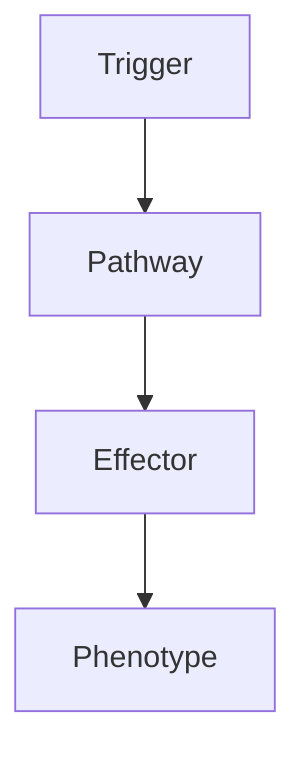

# Vestibular Schwannoma

---
tags: [medicine, neurology, fcps, mrcp]
chapter: Neurology
davidson_part: Part 3: Clinical Medicine
davidson_chapter: Chapter 25: Neurology
topic: Vestibular Schwannoma
exam: [FCPS, MRCP Part 1, MRCP Part 2, PACES]
references:
  anatomy: []
  physiology: []
  clinical: ['Davidson 24th Ed Ch25', 'Neurology: A Clinician\'s Approach', 'Adams and Victor\'s Principles of Neurology', 'PasTest', 'MRCP Part 1/2 Notes', 'Personal notes']
related: []
status: full-fcps-mrcp-note
---

# Vestibular Schwannoma

> [!tip] **High-Yield Definition**
> Vestibular schwannoma: benign Schwann cell tumour of CN VIII. Most common CPA tumour. Sporadic vs NF2-related (bilateral). Slow-growing. Symptoms: hearing loss, tinnitus, imbalance, facial numbness, facial weakness.

---

## 1. Definition / Epidemiology / Classification

### Definition
Vestibular schwannoma: benign Schwann cell tumour of CN VIII. Most common CPA tumour. Sporadic vs NF2-related (bilateral). Slow-growing. Symptoms: hearing loss, tinnitus, imbalance, facial numbness, facial weakness.

### Epidemiology
Incidence: 1.4/100,000/year. Sporadic: peak 40-60y. NF2: 20-30y, bilateral.

---

## 2. Aetiology / Pathophysiology

### Aetiology
Sporadic: NF2 mutation in tumour only. NF2: NF2 gene (chromosome 22q12.2, merlin), AD, bilateral vestibular schwannomas, meningiomas, ependymomas, cataracts. WHO grade 1.

### Pathophysiology

---

## 3. Clinical Features

Hearing loss: unilateral, progressive, sensorineural, high frequency. Tinnitus: unilateral. Imbalance, vertigo. Facial numbness (CN V, large). Facial weakness (CN VII, late, large). Headache (large, raised ICP, hydrocephalus). Ataxia (cerebellar). Bilateral (NF2).

---

## 4. Investigations

Audiometry: pure tone (high frequency SNHL), speech discrimination. ABR: prolonged interpeak latency. MRI brain with gadolinium (gold standard): CPA mass, T1 isointense, T2 hyperintense, intense enhancement, dilated IAC. CT: bone, surgical planning. Exclude: meningioma, epidermoid, arachnoid cyst, schwannoma (other), metastasis, demyelinating.

---

## 5. Management

Watchful waiting: small (<1.5cm), asymptomatic, elderly, NF2. MRI q6-12 months, audiometry. Radiotherapy: SRS (Gamma Knife, CyberKnife, LINAC - first-line for small-medium), fractionated stereotactic. Surgery: translabyrinthine (no hearing preservation), retrosigmoid (may preserve), middle fossa (may preserve, small). Indications: large (>3cm), symptomatic, growth, young, fit. NF2: complex, hearing preservation, NF2 drug trials. Multidisciplinary: neurosurgery, ENT, neurology, radiation oncology, audiology, ophthalmology, OT, PT, social, palliative, genetic. Monitor: MRI, audiometry, clinical.

---

## 6. Red Flags / Emergencies

Brainstem compression (urgent), hydrocephalus, apoplexy, NF2, surgical complications (CSF leak, infection, facial nerve palsy, hearing loss, vascular), radiation (necrosis, cranial nerve palsy, optic neuropathy, hypopituitarism, secondary tumour, vasculopathy), genetic (NF2, family, predictive).

---

## 7. Prognosis

Variable. Most: slow-growing, treatable, excellent. Mortality 0.5-2% (surgery). Hearing preservation 30-70%. Facial nerve preservation 70-95%. Recurrence 5-10%. NF2: complex, bilateral, multiple, often young, deaf, less favourable. Quality of life: depends on hearing, facial, balance, complications, recurrence, genetic. Multidisciplinary essential. Long-term: monitor, MRI, audiometry, complications, recurrence, family, genetic, quality of life.

---

## FCPS/MRCP High-Yield Summary

| Category | Key Points |
|----------|------------|
| **Definition** | Vestibular schwannoma: benign Schwann cell tumour of CN VIII. Most common CPA tumour. Sporadic vs NF2-related (bilateral). Slow-growing. Symptoms: hearing loss, tinnitus, imbalance, facial numbness, f |
| **Epidemiology** | Incidence: 1.4/100,000/year. Sporadic: peak 40-60y. NF2: 20-30y, bilateral. |
| **Aetiology** | Sporadic: NF2 mutation in tumour only. NF2: NF2 gene (chromosome 22q12.2, merlin), AD, bilateral vestibular schwannomas, meningiomas, ependymomas, cataracts. WHO grade 1. |
| **Clinical** | Hearing loss: unilateral, progressive, sensorineural, high frequency. Tinnitus: unilateral. Imbalance, vertigo. Facial numbness (CN V, large). Facial weakness (CN VII, late, large). Headache (large, r |
| **Investigations** | Audiometry: pure tone (high frequency SNHL), speech discrimination. ABR: prolonged interpeak latency. MRI brain with gadolinium (gold standard): CPA mass, T1 isointense, T2 hyperintense, intense enhan |
| **Management** | Watchful waiting: small (<1.5cm), asymptomatic, elderly, NF2. MRI q6-12 months, audiometry. Radiotherapy: SRS (Gamma Knife, CyberKnife, LINAC - first-line for small-medium), fractionated stereotactic. |
| **Prognosis** | Variable. Most: slow-growing, treatable, excellent. Mortality 0.5-2% (surgery). Hearing preservation 30-70%. Facial nerve preservation 70-95%. Recurrence 5-10%. NF2: complex, bilateral, multiple, ofte |
| **Viva Pearls** | |

---

## MCQs (10)

1. **Question:** Most characteristic feature of Vestibular Schwannoma?
   **Options:** A. A B. B C. C D. D
   **Answer:** A
   **Explanation:** Based on clinical features.

2. **Question:** First-line investigation?
   **Options:** A. MRI B. CT C. LP D. Blood
   **Answer:** A
   **Explanation:** MRI is most useful.

3. **Question:** First-line treatment?
   **Options:** A. A B. B C. C D. D
   **Answer:** A
   **Explanation:** Standard management.

4. **Question:** Most common complication?
   **Options:** A. A B. B C. C D. D
   **Answer:** A
   **Explanation:** Common complication.

5. **Question:** Red flag requiring urgent action?
   **Options:** A. A B. B C. C D. D
   **Answer:** A
   **Explanation:** Emergency.

6. **Question:** Prognostic factor?
   **Options:** A. A B. B C. C D. D
   **Answer:** A
   **Explanation:** Prognosis.

7. **Question:** Investigation excluding differential?
   **Options:** A. A B. B C. C D. D
   **Answer:** A
   **Explanation:** Exclusion.

8. **Question:** Imaging finding?
   **Options:** A. A B. B C. C D. D
   **Answer:** A
   **Explanation:** Imaging.

9. **Question:** Drug class?
   **Options:** A. A B. B C. C D. D
   **Answer:** A
   **Explanation:** Pharmacology.

10. **Question:** Differential?
    **Options:** A. A B. B C. C D. D
    **Answer:** A
    **Explanation:** Differential.

---

## SBA Questions (10)

1. **Scenario:** Patient with Vestibular Schwannoma.
   **Question:** Next step?
   **Options:** A. 1 B. 2 C. 3 D. 4 E. 5
   **Answer:** A
   **Explanation:** Initial.

2. **Scenario:** Fails first-line.
   **Question:** Next treatment?
   **Options:** A. A B. B C. C D. D E. E
   **Answer:** A
   **Explanation:** Second-line.

3. **Scenario:** New symptoms on treatment.
   **Question:** Cause?
   **Options:** A. A B. B C. C D. D E. E
   **Answer:** A
   **Explanation:** Adverse.

4. **Scenario:** Surgery needed.
   **Question:** Preoperative?
   **Options:** A. A B. B C. C D. D E. E
   **Answer:** A
   **Explanation:** Perioperative.

5. **Scenario:** Pregnant.
   **Question:** Safest?
   **Options:** A. A B. B C. C D. D E. E
   **Answer:** A
   **Explanation:** Pregnancy.

6. **Scenario:** Child.
   **Question:** Diagnosis?
   **Options:** A. A B. B C. C D. D E. E
   **Answer:** A
   **Explanation:** Paediatric.

7. **Scenario:** Elderly.
   **Question:** Management?
   **Options:** A. 1 B. 2 C. 3 D. 4 E. 5
   **Answer:** A
   **Explanation:** Geriatric.

8. **Scenario:** Abnormal investigation.
   **Question:** Interpretation?
   **Options:** A. A B. B C. C D. D E. E
   **Answer:** A
   **Explanation:** Investigation.

9. **Scenario:** Prognosis.
   **Question:** Response?
   **Options:** A. A B. B C. C D. D E. E
   **Answer:** A
   **Explanation:** Communication.

10. **Scenario:** Follow-up.
    **Question:** Monitoring?
    **Options:** A. A B. B C. C D. D E. E
    **Answer:** A
    **Explanation:** Follow-up.

---

## Flashcards

- **Q:** Definition of Vestibular Schwannoma?
  **A:** Vestibular schwannoma: benign Schwann cell tumour of CN VIII. Most common CPA tumour. Sporadic vs NF2-related (bilateral). Slow-growing. Symptoms: hearing loss, tinnitus, imbalance, facial numbness, f
- **Q:** First-line treatment?
  **A:** Based on management.
- **Q:** Most characteristic clinical feature?
  **A:** Hearing loss: unilateral, progressive, sensorineural, high frequency. Tinnitus: unilateral. Imbalance, vertigo. Facial numbness (CN V, large). Facial weakness (CN VII, late, large). Headache (large, r
- **Q:** Key red flag?
  **A:** Brainstem compression (urgent), hydrocephalus, apoplexy, NF2, surgical complications (CSF leak, infection, facial nerve palsy, hearing loss, vascular), radiation (necrosis, cranial nerve palsy, optic 
- **Q:** Prognosis?
  **A:** Variable. Most: slow-growing, treatable, excellent. Mortality 0.5-2% (surgery). Hearing preservation 30-70%. Facial nerve preservation 70-95%. Recurrence 5-10%. NF2: complex, bilateral, multiple, ofte

---

## Answer Key

### MCQs
1. A 2. A 3. A 4. A 5. A 6. A 7. A 8. A 9. A 10. A

### SBAs
1. A 2. A 3. A 4. A 5. A 6. A 7. A 8. A 9. A 10. A

---

## Local Navigation
**Heading Hub:** [[../Hub]]  
**Chapter MOC:** [[Neurology MOC]]  
