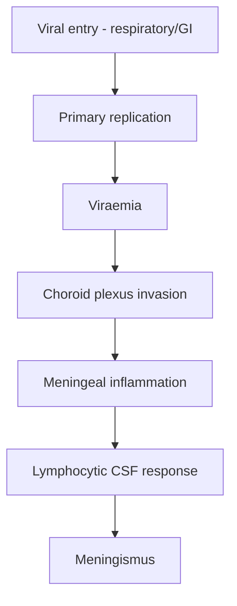
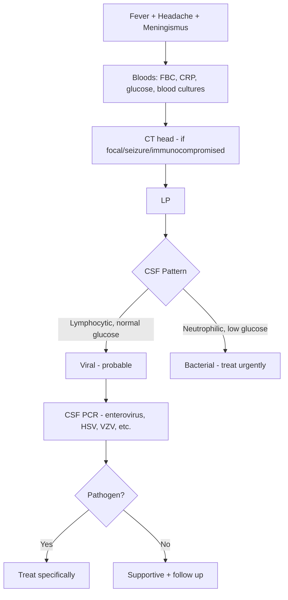

# Viral Meningitis (Aseptic Meningitis)

> [!tip] **Definition:** Acute meningeal inflammation due to viruses — lymphocytic CSF pleocytosis, normal glucose, self-limiting.
> **FCPS Pearl:** Enterovirus = #1 cause (85-95%). Empirical antibiotics ± acyclovir started until bacterial excluded.

## 1. Definition / Epidemiology / Classification

### Definition
Inflammation of the leptomeninges caused by viral infection, with CSF lymphocytic pleocytosis, normal glucose, mildly elevated protein, and negative bacterial/fungal cultures.

### Epidemiology
- **Incidence:** ~10-20/100,000/year
- **Age:** Bimodal — <5 yr, young adults 15-35 yr
- **Seasonality:** Enterovirus = summer/autumn; Mumps = late winter/spring
- **Sex:** Slight male predominance (enterovirus); HSV-2 more in women

### Classification
| Category | Common Pathogens |
|----------|------------------|
| **Enteroviruses (~85-95%)** | Echovirus, Coxsackie A/B, EV-D68/71 |
| **Herpesviruses** | HSV-2 (Mollaret's), HSV-1, VZV, EBV, CMV, HHV-6 |
| **Arboviruses** | West Nile, Japanese encephalitis, TBEV, Zika |
| **Other** | Mumps, HIV, LCMV, adenovirus, influenza |

## 2. Aetiology / Pathophysiology

### Aetiology by Context
| Context | Common Pathogens |
|---------|------------------|
| **Neonates** | HSV-2, enterovirus, parechovirus, CMV |
| **Children** | Enterovirus, HHV-6, mumps, adenovirus |
| **Adults** | Enterovirus, HSV-2, HIV, VZV |
| **Immunocompromised** | CMV, HSV, VZV, EBV, HHV-6 |
| **Travel/mosquito** | Arboviruses (WNV, JEV) |
| **Rodent contact** | LCMV |

### Pathophysiology

### Molecular Basis
- **Tropism:** Enteroviruses bind **CAR receptor** (coxsackie-adenovirus receptor)
- **Host response:** **Type I IFN (α/β)**, CD8+ T-cells clear infection
- **Mollaret's cells:** Large mononuclear "ghost cells" — pathognomonic of HSV-2 recurrent meningitis

## 3. Clinical Features

### History
- **Prodrome (1-7 d):** Fever, malaise, URI/GI symptoms
- **Headache:** Universal, severe, frontal/retro-orbital
- **Photophobia, nausea/vomiting, neck stiffness**
- **Systemic:** Rash (enterovirus), herpangina, parotitis (mumps), orchitis
- **NO altered consciousness** (distinguishes from encephalitis)
- **Past history:** Recurrent episodes (Mollaret's), travel, animal contact

### Examination
| Domain | Findings | Localisation |
|--------|----------|--------------|
| **Higher cortical** | Normal (no encephalopathy) | Distinguishes from encephalitis |
| **Cranial nerves** | Photophobia, otherwise normal | Pure meningeal disease |
| **Motor/Sensory** | Normal | No parenchymal disease |
| **Neck** | Nuchal rigidity (Brudzinski, Kernig) | Meningeal irritation |
| **Systemic** | Fever, rash, pharyngitis | Systemic viral infection |

### Specific Syndromes
| Syndrome | Features | Pathogen |
|----------|----------|----------|
| **Mollaret's** | Recurrent (3-10 episodes), self-limiting 2-7 d, "Mollaret's cells" | HSV-2 |
| **HIV seroconversion** | Fever, rash, lymphadenopathy, ulcers | HIV |
| **Hand-foot-mouth** | Vesicular rash + meningitis | Coxsackie A16, EV-71 |
| **Mumps meningoencephalitis** | Parotitis + meningitis | Mumps |

## 4. Diagnostic Approach

## 5. Investigations

### First-Line
| Test | Indication | Expected Finding |
|------|------------|------------------|
| **FBC, CRP** | All | Mild leucopenia/leucocytosis, mild ↑CRP |
| **Blood cultures** | All | Negative (excludes bacterial) |
| **LP** | All (unless contraindicated) | See below |

### CSF Analysis
| Parameter | Normal | Viral Meningitis |
|-----------|--------|------------------|
| **Opening pressure** | 5-20 cm H2O | Normal/mild ↑ |
| **WCC** | <5/μL | 10-500/μL |
| **Differential** | — | **Lymphocytic** (early may be neutrophilic) |
| **Protein** | 0.15-0.45 g/L | Mildly ↑ (0.5-1.0) |
| **Glucose** | 2/3 serum | **Normal** |
| **Gram stain/culture** | Negative | Negative |
| **PCR** | — | Enterovirus, HSV-1/2, VZV, EBV, CMV |

> [!warning] **Early Neutrophilic Phase:** Up to 30% viral meningitis has CSF neutrophilia in first 24-48 h → **always treat as bacterial until culture negative**.

### Specific Tests
- **Enterovirus PCR:** Rapid, high sensitivity
- **HSV-1/2, VZV, EBV, CMV PCR:** If clinically suspected
- **HIV:** Acute seroconversion — HIV RNA if antibody negative
- **Arbovirus PCR/serology:** Travel history (WNV, JEV, TBEV)

## 6. Differential Diagnosis
| Differential | Distinguishing Features | Key Test |
|--------------|--------------------------|----------|
| **Bacterial meningitis** | Rapid onset, high fever, ↓consciousness, neutrophilic CSF, low glucose | CSF Gram stain/culture |
| **TB meningitis** | Subacute (weeks), basal signs, hydrocephalus, very low glucose | CSF AFB, TB PCR, ADA |
| **Fungal meningitis** | Immunocompromised, ↑opening pressure, low glucose | India ink, cryptococcal Ag |
| **Autoimmune encephalitis** | Altered consciousness, seizures, dyskinesias | NMDA-R Ab, MRI |
| **Partially treated bacterial** | Recent antibiotics, atypical CSF | History, CSF PCR |
| **Drug-induced** | NSAIDs, TMP-SMX, IVIG; resolves on withdrawal | History, CSF eosinophils |

## 7. Management

### Empirical Treatment (Until Bacterial Excluded)
| Situation | Action |
|-----------|--------|
| **All suspected meningitis** | Ceftriaxone 2g IV q12h + Dexamethasone 0.15mg/kg q6h × 4 d |
| **HSV encephalitis suspected** | Add **Acyclovir 10mg/kg IV q8h** |
| **Severe headache** | IV fluids, paracetamol, antiemetics |

### Specific Antiviral Therapy
| Pathogen | Treatment | Duration |
|----------|-----------|----------|
| **HSV-1/2 (Mollaret's)** | Acyclovir 400-800mg PO 5×/d OR Valaciclovir 1g PO TDS | 7-14 d acute; chronic suppression for recurrent |
| **VZV** | Acyclovir 10-15mg/kg IV q8h | 7-10 d |
| **CMV (immunocompromised)** | Ganciclovir 5mg/kg IV q12h | 2-3 weeks |
| **HIV acute** | ART initiation | Long-term |
| **Influenza** | Oseltamivir 75mg PO BD | 5 d |
| **Enterovirus** | Supportive | Self-limiting |

### Supportive
- **Hydration:** Oral/IV
- **Analgesia:** Paracetamol, NSAIDs
- **Antiemetics:** Ondansetron 4-8mg
- **Bed rest** during acute phase
- **Isolation:** Enteric precautions (enterovirus)

## 8. Drug Cautions
| Drug | Caution | Management |
|------|---------|------------|
| **Acyclovir** | Nephrotoxic (crystalluria), neurotoxic in renal failure | Hydrate; dose adjust CrCl |
| **Ganciclovir** | Myelosuppression | Monitor FBC; avoid pregnancy |
| **NSAIDs** | Renal/GI in dehydration | Avoid if dehydrated |

## 9. Procedures

### Lumbar Puncture
- **Indications:** Suspected meningitis/encephalitis (after CT if signs of raised ICP)
- **Contraindications:** Raised ICP signs, coagulopathy, spinal infection
- **Complications:** Post-LP headache (10-30%), herniation (if raised ICP)

## 10. Complications
| Complication | Frequency | Management |
|--------------|-----------|------------|
| **Post-viral fatigue** | 10-20% | Graded exercise, CBT |
| **Seizures** | <5% (children > adults) | AED if recurrent |
| **Hydrocephalus** (mumps) | Rare | Neurosurgical review |
| **Encephalitis** | Rare (HSV) | MRI, EEG, acyclovir |
| **SIADH** | Rare | Fluid restriction |

## 11. Red Flags
| Red Flag | Action |
|----------|--------|
| **Altered consciousness/seizures** | Encephalitis — MRI, EEG, acyclovir |
| **Focal signs** | Urgent CT before LP |
| **Immunocompromised** | HIV test, CMV/VZV/EBV PCR |
| **CSF neutrophilia** | Treat as bacterial until proven |
| **No improvement 48-72 h** | Re-image, repeat LP |

## 12. Prognosis
- **Most cases:** Self-limiting, full recovery 7-10 d
- **Mollaret's:** Recurrent but self-limiting
- **Mortality:** <1% in immunocompetent
- **Morbidity:** Post-viral fatigue most common

## 13. Topic Correlation
| Related Topic | Key Overlap |
|---------------|-------------|
| Acute Bacterial Meningitis | Must exclude first |
| Encephalitis (HSV) | HSV can cause both; encephalitis has parenchymal disease |
| Chronic Meningitis | Subacute viral (HIV, LCMV) |
| CSF Analysis | CSF interpretation |

## 14. Special Situations
| Situation | Consideration |
|-----------|---------------|
| **Pregnancy** | Acyclovir/valaciclovir safe; avoid ganciclovir |
| **Neonates** | HSV-2 high risk; IV acyclovir 20mg/kg IV q8h |
| **Immunocompromised** | Broader PCR panel; lower threshold for antivirals |
| **Elderly** | Exclude bacterial/TB rigorously |
| **Travel-related** | Arbovirus serology/PCR; notify public health |

---

## FCPS/MRCP High-Yield Summary
| Category | Key Points |
|----------|------------|
| **Definition** | Acute meningeal inflammation due to virus; lymphocytic CSF; self-limiting |
| **Epidemiology** | Enterovirus #1 (85-95%); bimodal age; summer/autumn peak |
| **Pathophysiology** | Viraemia → choroid plexus → meningeal inflammation |
| **Clinical** | Headache, photophobia, meningismus; NO encephalopathy |
| **Diagnosis** | LP: lymphocytic CSF, normal glucose; PCR for virus |
| **Management** | Supportive; acyclovir for HSV/VZV; empirical antibiotics until bacterial excluded |
| **Complications** | Post-viral fatigue (10-20%); seizures rare |
| **Prognosis** | Excellent in immunocompetent |
| **Viva Pearls** | "Mollaret's cells" = HSV-2; early CSF may be neutrophilic; HIV seroconversion mimics |

## Viva Questions
1. **Q:** Define viral meningitis. **A:** Acute meningeal inflammation due to virus with lymphocytic CSF and self-limiting course.
2. **Q:** Most common cause? **A:** Enterovirus (echovirus, coxsackie) — 85-95%.
3. **Q:** CSF findings? **A:** Lymphocytic pleocytosis (10-500/μL), normal glucose, mild ↑protein.
4. **Q:** What is Mollaret's meningitis? **A:** Recurrent lymphocytic meningitis due to HSV-2; CSF shows "Mollaret's cells."
5. **Q:** Empirical treatment? **A:** Ceftriaxone 2g IV q12h + dexamethasone; add acyclovir if HSV suspected.
6. **Q:** Why early neutrophilic CSF? **A:** First 24-48 h can be neutrophilic; always treat as bacterial until proven.
7. **Q:** HIV and viral meningitis? **A:** Acute seroconversion can present as aseptic meningitis.
8. **Q:** Red flag for encephalitis? **A:** Altered consciousness, focal signs, seizures.
9. **Q:** Post-viral complications? **A:** Fatigue syndrome (10-20%); seizures rarely.
10. **Q:** Partially treated bacterial meningitis? **A:** Recent antibiotics → atypical CSF; PCR helps.

## Common Confusions
| Confusion | Clarification |
|-----------|---------------|
| Viral vs bacterial CSF | Bacterial = neutrophilic + low glucose; viral = lymphocytic + normal glucose |
| Early viral vs bacterial | Up to 30% viral has neutrophilia; treat as bacterial until culture negative |
| Mollaret's cells vs lymphoma | Mollaret's = large mononuclear; lymphoma = clonal B-cells |
| Recurrent meningitis | Mollaret's, CSF leak, parameningeal focus, Behçet's |

## Mnemonics
1. **"ENTER-O"** = **E**nterovirus, **N**ormal glucose, **T**hin CSF, **E**xcellent prognosis, **R**ecurrent = HSV-2; **O**ctober peak
2. **"VIRAL CSF"** = **V**ery low WCC, **I**ncreased protein (mild), **R**educed glucose = NO, **A**symptomatic encephalopathy, **L**ymphocytes
3. **"MOLARET"** = **M**ollaret's = **H**SV-2 (recurrent, Mononuclear, Lymphocytic, Aseptic, Recurrent Episodes, Episodes self-limiting, 2-7 days)
4. **"SUMMER"** = Enterovirus peak (**S**chools close, **U**psurge; **M**umps, **M**eningitis; **E**chovirus, Coxsackie; **R**ecurrent = HSV-2)

## MCQs (10)
1. **Question:** Most common cause of viral meningitis in adults:
   **Options:** A. HSV-2 B. Enteroviruses C. Mumps D. HIV
   **Answer:** B
2. **Question:** Characteristic CSF finding in viral meningitis:
   **Options:** A. Neutrophilic pleocytosis, low glucose B. Lymphocytic pleocytosis, normal glucose C. High protein, low glucose D. Frank blood
   **Answer:** B
3. **Question:** Mollaret's meningitis is caused by:
   **Options:** A. Enterovirus B. HSV-1 C. HSV-2 D. EBV
   **Answer:** C
4. **Question:** Empirical treatment pending pathogen ID:
   **Options:** A. Acyclovir alone B. Ceftriaxone + dexamethasone ± acyclovir C. Vancomycin D. Supportive only
   **Answer:** B
5. **Question:** What proportion of viral meningitis has early neutrophilic CSF?
   **Options:** A. <1% B. 5% C. 10-30% D. 50%
   **Answer:** C
6. **Question:** 30-year-old with fever, headache, neck stiffness, maculopapular rash in late summer. CSF: 200 lymphocytes, protein 0.8, glucose 3.5/6.0. Most likely:
   **Options:** A. Bacterial B. TB C. Enteroviral D. Fungal
   **Answer:** C
7. **Question:** Acute HIV seroconversion can present as:
   **Options:** A. Bacterial B. Aseptic C. SAH D. Abscess
   **Answer:** B
8. **Question:** Indication for empirical acyclovir:
   **Options:** A. All B. Suspected HSV encephalitis C. Children only D. Never
   **Answer:** B
9. **Question:** Most common complication in adults:
   **Options:** A. Seizures B. Hydrocephalus C. Post-viral fatigue D. Death
   **Answer:** C
10. **Question:** CSF opening pressure in viral meningitis is usually:
    **Options:** A. >40 B. Normal/mild ↑ C. Very low D. Unmeasurable
    **Answer:** B

## SBA Questions (10)
1. **Scenario:** 25-year-old, 5-day fever, severe headache, photophobia, neck stiffness. Rash on palms/soles. CSF: 150 lymphocytes, protein 0.7, glucose 3.0/6.0.
   **Question:** Most likely pathogen and management?
   **Options:** A. HSV-2; acyclovir IV B. Enterovirus; supportive C. S. pneumoniae; ceftriaxone D. TB; RIPE
   **Answer:** B
2. **Scenario:** 32-year-old with 4 episodes of aseptic meningitis over 2 years, each self-limiting 5 d. CSF with "ghost cells."
   **Question:** Diagnosis and chronic management?
   **Options:** A. TB; RIPE B. Mollaret's (HSV-2); valaciclovir suppression C. Migraine; propranolol D. Behçet's; colchicine
   **Answer:** B
3. **Scenario:** 28-year-old returns from SE Asia with fever, headache, meningismus 1 week after mosquito bites. CSF: 300 lymphocytes, normal glucose.
   **Question:** Next best investigation?
   **Options:** A. MRI B. CSF arbovirus PCR/serology C. Brain biopsy D. ANCA
   **Answer:** B
4. **Scenario:** Neonate (2 weeks) with fever, irritability, bulging fontanelle. CSF: 200 cells, mixed, protein 1.0, glucose 1.5.
   **Question:** Most likely pathogen and treatment?
   **Options:** A. Enterovirus B. HSV-2; acyclovir 20mg/kg IV q8h C. GBS D. E. coli
   **Answer:** B
5. **Scenario:** 35-year-old with fever, headache, maculopapular rash, mouth ulcers, lymphadenopathy 3 weeks after unprotected sex. CSF: 100 lymphocytes.
   **Question:** Most likely cause?
   **Options:** A. Syphilis B. Acute HIV C. HSV-2 D. EBV
   **Answer:** B
6. **Scenario:** Immunocompromised transplant patient, fever, headache, CSF 200 lymphocytes, low glucose. CMV PCR positive.
   **Question:** Treatment?
   **Options:** A. Acyclovir B. Ganciclovir 5mg/kg IV q12h C. Ceftriaxone D. Foscarnet alone
   **Answer:** B
7. **Scenario:** Post-LP headache 24 h later, worse upright.
   **Options:** A. Rebound meningitis B. Post-LP headache (low pressure) C. SAH D. Encephalitis
   **Answer:** B
8. **Scenario:** Day 3 viral meningitis → confusion, seizures. MRI left temporal oedema.
   **Question:** Diagnosis and treatment?
   **Options:** A. Abscess B. HSV-1 encephalitis; acyclovir 10mg/kg IV q8h C. Tumour D. Stroke
   **Answer:** B
9. **Scenario:** Recurrent meningitis after nasal polyp surgery. β-2 transferrin positive.
   **Question:** Diagnosis and treatment?
   **Options:** A. Mollaret's B. CSF leak; surgical repair C. TB D. Migraine
   **Answer:** B
10. **Scenario:** 20-year-old with fever, headache, neck stiffness, parotid swelling, contact with mumps.
    **Question:** Likely diagnosis and management?
    **Options:** A. Bacterial B. Mumps; supportive, notify public health C. Sjögren's D. Sarcoidosis
    **Answer:** B

## Flashcards
- **Q:** Most common cause of viral meningitis? **A:** Enterovirus (85-95%).
- **Q:** CSF in viral meningitis? **A:** Lymphocytic, normal glucose, mild ↑protein, negative culture.
- **Q:** Mollaret's cause? **A:** HSV-2; recurrent, "Mollaret's cells."
- **Q:** Empirical treatment? **A:** Ceftriaxone + dexamethasone; add acyclovir if HSV.
- **Q:** HIV seroconversion CSF? **A:** Aseptic meningitis; HIV RNA positive.
- **Q:** Neonatal meningitis virus? **A:** HSV-2; acyclovir 20mg/kg IV q8h.
- **Q:** Post-LP headache? **A:** Orthostatic; caffeine/blood patch.
- **Q:** Red flag encephalitis? **A:** Altered consciousness, focal signs, seizures.
- **Q:** HSV encephalitis drug? **A:** Acyclovir 10mg/kg IV q8h × 14-21 d.
- **Q:** Recurrent meningitis causes? **A:** Mollaret's, CSF leak, Behçet's, parameningeal.

## Answer Key with Explanations
**MCQs:**
1. **B** — Enterovirus = #1 cause (85-95% of identified cases)
2. **B** — Lymphocytic pleocytosis + normal glucose = viral
3. **C** — Mollaret's = recurrent HSV-2 meningitis with "Mollaret's cells"
4. **B** — Empirical antibiotics ± acyclovir until bacterial excluded
5. **C** — Up to 30% have early neutrophilia; always treat as bacterial first
6. **C** — Summer + lymphocytic CSF + rash = enterovirus
7. **B** — Acute retroviral syndrome can mimic aseptic meningitis
8. **B** — Add acyclovir if HSV encephalitis suspected (focal signs, seizures)
9. **C** — Post-viral fatigue = most common adult complication (10-20%)
10. **B** — Normal or mildly elevated; markedly raised suggests bacterial/fungal

**SBAs:**
1. **B** — Hand-foot-mouth = enterovirus (coxsackie); supportive after bacterial excluded
2. **B** — Recurrent + Mollaret's cells = HSV-2; valaciclovir suppression
3. **B** — SE Asia + mosquito = arbovirus (JEV); CSF PCR/serology
4. **B** — Neonatal HSV-2 meningitis; high-dose acyclovir 20mg/kg IV q8h
5. **B** — Acute HIV seroconversion (fever, rash, ulcers, lymphadenopathy)
6. **B** — CMV meningitis in immunocompromised = ganciclovir
7. **B** — Post-LP headache is orthostatic; treat with caffeine/blood patch
8. **B** — HSV-1 encephalitis (temporal lobe); start acyclovir immediately
9. **B** — CSF leak (β-2 transferrin); surgical repair
10. **B** — Mumps meningoencephalitis; supportive + notifiable disease
