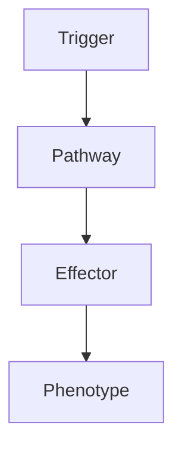

# Autoimmune Encephalitis

> [!tip] **High-Yield Definition**
> Autoimmune encephalitis: immune-mediated inflammation of brain against neuronal antigens. Antibodies target cell surface (treatable, often paraneoplastic) or intracellular (often poor prognosis, often cancer). Anti-NMDA (most common), LGI1, CASPR2, GABA-B, AMPA, DPPX, mGluR5, anti-Ma2, anti-Hu, anti-Yo, anti-CV2/CRMP5, anti-amphiphysin, anti-GAD, anti-GFAP, anti-IgLON5.

---

## 1. Definition / Epidemiology / Classification

### Definition
Autoimmune encephalitis: immune-mediated inflammation of brain against neuronal antigens. Antibodies target cell surface (treatable, often paraneoplastic) or intracellular (often poor prognosis, often cancer). Anti-NMDA (most common), LGI1, CASPR2, GABA-B, AMPA, DPPX, mGluR5, anti-Ma2, anti-Hu, anti-Yo, anti-CV2/CRMP5, anti-amphiphysin, anti-GAD, anti-GFAP, anti-IgLON5.

### Epidemiology
Incidence: 1-2/100,000/year. Anti-NMDA: young women (20-40y), often paraneoplastic (ovarian teratoma 30-50%). LGI1: middle-aged men, faciobrachial dystonic seizures, hyponatraemia. CASPR2: older men, Morvan syndrome, thymoma 20%.

---

## 2. Aetiology / Pathophysiology

### Aetiology
Cell surface (receptor, channel, synaptic) - usually treatable, often paraneoplastic: anti-NMDA, LGI1, CASPR2, GABA-B, AMPA, DPPX, mGluR5, D2R, IgLON5. Intracellular (onconeural, T cell, often poor) - usually paraneoplastic: anti-Hu, Yo, CV2/CRMP5, amphiphysin, Ri, GAD.

### Pathophysiology

---

## 3. Clinical Features

Anti-NMDA: psychiatric (first), cognitive, seizures, movement (orofacial dyskinesias, choreoathetoid, dystonia, stereotypies, opisthotonus, catatonia, rigidity, myoclonus), autonomic (hyperthermia, BP, HR, hypoventilation, central apnoea, ileus, SIADH), decreased consciousness, coma, hypoventilation, ICU. LGI1: faciobrachial dystonic seizures (FBDS - characteristic, brief, dystonic, arm, ipsilateral face, 100x/day), seizures, cognitive, psychiatric, sleep, hyponatraemia (60%, SIADH), pain, autonomic, bradycardia. CASPR2: limbic, Morvan (neuromyotonia, insomnia, encephalopathy, autonomic, pain). GABA-B: limbic, SCLC 50%. AMPA: limbic, thymoma, breast, lung 50%. DPPX: encephalitis, GI, PERM, dysautonomia. mGluR5: limbic, Hodgkin 50%. Anti-Ma2: limbic, diencephalic, brainstem, cerebellar, testicular (young men), lung, breast. Anti-Hu: sensory neuropathy, limbic, SCLC 80%. Anti-Yo: cerebellar, breast, ovary. Anti-CV2/CRMP5: chorea, uveitis, optic neuritis. Anti-amphiphysin: SPS, breast, SCLC. Anti-GAD: SPS, limbic, cerebellar, T1DM. Anti-GFAP: meningoencephalomyelitis, autonomic. Anti-IgLON5: sleep (NREM/REM parasomnia, OSA, stridor), bulbar, gait, hyperkinetic movements.

---

## 4. Investigations

Bloods: FBC, U&Es, LFTs, ESR, CRP, autoimmune, infection screen (HIV, hepatitis, syphilis, TB, fungal, viral, Mycoplasma, Lyme), vitamin, thyroid, cortisol. Serum antibody panel: anti-NMDA, LGI1, CASPR2, GABA-B, AMPA, DPPX, mGluR1/5, D2R, IgLON5, neurexin-3α, Ma1/2, Hu, Yo, CV2/CRMP5, Ri, amphiphysin, GAD, GFAP, VGCC. CSF: cell count (lymphocytic), protein, glucose (may be low - anti-NMDA), OCBs, antibody panel, PCR (exclude infection), metagenomic, cytology. MRI brain: FLAIR/T2 hyperintensity (limbic - medial temporal, frontal, parietal, basal ganglia, brainstem, cerebellum), meningeal enhancement, sometimes normal (anti-NMDA). EEG: slowing, epileptiform, periodic (NCSE - anti-NMDA, LGI1, GABA-B), extreme delta brush (anti-NMDA, characteristic). Tumour screen: CT chest/abdomen/pelvis, mammogram, testicular ultrasound (anti-NMDA, Ma2), ovarian, PET-CT, cancer markers.

---

## 5. Management

EMERGENCY: immunotherapy (start empirical if high suspicion, while waiting for results). First-line: corticosteroids (IV methylprednisolone 1g/day × 3-5 days, then oral prednisolone 1mg/kg/day), IVIG 2g/kg over 2-5 days, plasma exchange (5 exchanges). Second-line: rituximab 1g × 2 (anti-CD20), cyclophosphamide 500-1000mg/m² IV (monthly), mycophenolate mofetil 1-1.5g BD, azathioprine 2-3mg/kg/day, methotrexate. Third-line: tocilizumab 8mg/kg IV monthly, bortezomib, tofacitinib. Treat underlying tumour: resection, chemo, RT, immunotherapy. Symptomatic: seizures (ASM - levetiracetam, lacosamide, valproate, avoid PHT), movement disorders (tetrabenazine, clonazepam, valproate, BoNT, baclofen, trihexyphenidyl, levodopa trial), autonomic (labile BP, bradycardia, ileus, hypoventilation, central apnoea, hyperthermia - supportive, ICU, cooling, vasopressors, inotropes, glycopyrrolate, scopolamine, midodrine, fludrocortisone), psychiatric (antipsychotics - OLZ, RIS, QTP - LOW dose, AVOID typical - severe sensitivity, SSRIs, benzodiazepines), sleep (melatonin, low-dose trazodone, clonazepam), pain, spasticity, fatigue, cognitive, behavioural, speech, swallow. Multidisciplinary: neurology, autoimmune neurology, oncology, ICU, psychiatry, immunology, OT, PT, SLT, dietitian, palliative, social, psychology, chaplaincy, family support. Monitor: clinical (mRS, cognitive, seizures, movement, autonomic, psychiatric, sleep, fatigue), antibody titres, MRI, EEG, tumour, side effects. Vaccination: avoid live vaccines (immunosuppression).

---

## 6. Red Flags / Emergencies

EMERGENCY: status epilepticus, NCSE, autonomic instability (BP, HR, temperature, hypoventilation, central apnoea, cardiac arrest), severe movement disorders (orofacial, dystonia, status dystonicus, rhabdomyolysis), psychiatric (suicide, aggression, NMS with antipsychotics), ICU, ventilation, status, malignancy (paraneoplastic, screen, monitor), treatment side effects (steroids: DM, HTN, osteoporosis, fractures, infection, mood, myopathy, adrenal; IVIG: thrombosis, aseptic meningitis, renal, anaphylaxis; rituximab: PML, hepatitis B reactivation, infusion reactions, neutropenia; cyclophosphamide: haemorrhagic cystitis, malignancy, infertility, myelosuppression; azathioprine: myelosuppression, hepatotoxicity, pancreatitis, TPMT; MMF: GI, myelosuppression; methotrexate: hepatotoxicity, pneumonitis, myelosuppression; tocilizumab: infection, neutropenia, hepatotoxicity), pregnancy (teratogenicity, breastfeeding), infection (immunosuppression, PML, opportunistic), relapse, drug interactions.

---

## 7. Prognosis

Variable. Anti-NMDA: 80% good outcome, 20% mortality, 80% substantial recovery (months-years), 20% persistent, relapse 15-25%. LGI1: 70-80% good outcome, relapse 15-20%. CASPR2: 70% good, Morvan refractory. GABA-B: 50% paraneoplastic (SCLC), variable. AMPA: 70-80% good. Anti-Ma2: 30-50% good (testicular - better, young). Anti-Hu, Yo, CV2: poor (intracellular, T cell, irreversible neuronal loss, paraneoplastic, often cancer, median survival 1-2 years, refractory). Better: cell surface, early treatment, tumour removal, young, no malignancy. Worse: intracellular, paraneoplastic, advanced, delayed treatment, ICU, prolonged ventilation, autonomic instability, severe. Multidisciplinary essential. Long-term: monitor, relapse, chronic, rehabilitation, quality of life, family support.

---

## FCPS/MRCP High-Yield Summary

| Category | Key Points |
|----------|------------|
| **Definition** | Autoimmune encephalitis: immune-mediated inflammation of brain against neuronal antigens. Antibodies target cell surface (treatable, often paraneoplastic) or intracellular (often poor prognosis, often |
| **Epidemiology** | Incidence: 1-2/100,000/year. Anti-NMDA: young women (20-40y), often paraneoplastic (ovarian teratoma 30-50%). LGI1: middle-aged men, faciobrachial dys |
| **Aetiology** | Cell surface (receptor, channel, synaptic) - usually treatable, often paraneoplastic: anti-NMDA, LGI1, CASPR2, GABA-B, AMPA, DPPX, mGluR5, D2R, IgLON5. Intracellular (onconeural, T cell, often poor) - |
| **Clinical** | Anti-NMDA: psychiatric (first), cognitive, seizures, movement (orofacial dyskinesias, choreoathetoid, dystonia, stereotypies, opisthotonus, catatonia, rigidity, myoclonus), autonomic (hyperthermia, BP |
| **Investigations** | Bloods: FBC, U&Es, LFTs, ESR, CRP, autoimmune, infection screen (HIV, hepatitis, syphilis, TB, fungal, viral, Mycoplasma, Lyme), vitamin, thyroid, cortisol. Serum antibody panel: anti-NMDA, LGI1, CASP |
| **Management** | EMERGENCY: immunotherapy (start empirical if high suspicion, while waiting for results). First-line: corticosteroids (IV methylprednisolone 1g/day × 3-5 days, then oral prednisolone 1mg/kg/day), IVIG  |
| **Prognosis** | Variable. Anti-NMDA: 80% good outcome, 20% mortality, 80% substantial recovery (months-years), 20% persistent, relapse 15-25%. LGI1: 70-80% good outcome, relapse 15-20%. CASPR2: 70% good, Morvan refra |
| **Viva Pearls** | |

---

## MCQs (10)

1. **Question:** Most characteristic feature of Autoimmune Encephalitis?
   **Options:** A. A B. B C. C D. D
   **Answer:** A
   **Explanation:** Based on clinical features.

2. **Question:** First-line investigation?
   **Options:** A. MRI B. CT C. LP D. Blood
   **Answer:** A
   **Explanation:** MRI is most useful.

3. **Question:** First-line treatment?
   **Options:** A. A B. B C. C D. D
   **Answer:** A
   **Explanation:** Standard management.

4. **Question:** Most common complication?
   **Options:** A. A B. B C. C D. D
   **Answer:** A
   **Explanation:** Common complication.

5. **Question:** Red flag requiring urgent action?
   **Options:** A. A B. B C. C D. D
   **Answer:** A
   **Explanation:** Emergency.

6. **Question:** Prognostic factor?
   **Options:** A. A B. B C. C D. D
   **Answer:** A
   **Explanation:** Prognosis.

7. **Question:** Investigation excluding differential?
   **Options:** A. A B. B C. C D. D
   **Answer:** A
   **Explanation:** Exclusion.

8. **Question:** Imaging finding?
   **Options:** A. A B. B C. C D. D
   **Answer:** A
   **Explanation:** Imaging.

9. **Question:** Drug class?
   **Options:** A. A B. B C. C D. D
   **Answer:** A
   **Explanation:** Pharmacology.

10. **Question:** Differential?
    **Options:** A. A B. B C. C D. D
    **Answer:** A
    **Explanation:** Differential.

---

## SBA Questions (10)

1. **Scenario:** Patient with Autoimmune Encephalitis.
   **Question:** Next step?
   **Options:** A. 1 B. 2 C. 3 D. 4 E. 5
   **Answer:** A
   **Explanation:** Initial.

2. **Scenario:** Fails first-line.
   **Question:** Next treatment?
   **Options:** A. A B. B C. C D. D E. E
   **Answer:** A
   **Explanation:** Second-line.

3. **Scenario:** New symptoms on treatment.
   **Question:** Cause?
   **Options:** A. A B. B C. C D. D E. E
   **Answer:** A
   **Explanation:** Adverse.

4. **Scenario:** Surgery needed.
   **Question:** Preoperative?
   **Options:** A. A B. B C. C D. D E. E
   **Answer:** A
   **Explanation:** Perioperative.

5. **Scenario:** Pregnant.
   **Question:** Safest?
   **Options:** A. A B. B C. C D. D E. E
   **Answer:** A
   **Explanation:** Pregnancy.

6. **Scenario:** Child.
   **Question:** Diagnosis?
   **Options:** A. A B. B C. C D. D E. E
   **Answer:** A
   **Explanation:** Paediatric.

7. **Scenario:** Elderly.
   **Question:** Management?
   **Options:** A. 1 B. 2 C. 3 D. 4 E. 5
   **Answer:** A
   **Explanation:** Geriatric.

8. **Scenario:** Abnormal investigation.
   **Question:** Interpretation?
   **Options:** A. A B. B C. C D. D E. E
   **Answer:** A
   **Explanation:** Investigation.

9. **Scenario:** Prognosis.
   **Question:** Response?
   **Options:** A. A B. B C. C D. D E. E
   **Answer:** A
   **Explanation:** Communication.

10. **Scenario:** Follow-up.
    **Question:** Monitoring?
    **Options:** A. A B. B C. C D. D E. E
    **Answer:** A
    **Explanation:** Follow-up.

---

## Flashcards

- **Q:** Definition of Autoimmune Encephalitis?
  **A:** Autoimmune encephalitis: immune-mediated inflammation of brain against neuronal antigens. Antibodies target cell surface (treatable, often paraneoplastic) or intracellular (often poor prognosis, often
- **Q:** First-line treatment?
  **A:** Based on management.
- **Q:** Most characteristic clinical feature?
  **A:** Anti-NMDA: psychiatric (first), cognitive, seizures, movement (orofacial dyskinesias, choreoathetoid, dystonia, stereotypies, opisthotonus, catatonia, rigidity, myoclonus), autonomic (hyperthermia, BP
- **Q:** Key red flag?
  **A:** EMERGENCY: status epilepticus, NCSE, autonomic instability (BP, HR, temperature, hypoventilation, central apnoea, cardiac arrest), severe movement disorders (orofacial, dystonia, status dystonicus, rh
- **Q:** Prognosis?
  **A:** Variable. Anti-NMDA: 80% good outcome, 20% mortality, 80% substantial recovery (months-years), 20% persistent, relapse 15-25%. LGI1: 70-80% good outcome, relapse 15-20%. CASPR2: 70% good, Morvan refra

---

## Answer Key

### MCQs
1. A 2. A 3. A 4. A 5. A 6. A 7. A 8. A 9. A 10. A

### SBAs
1. A 2. A 3. A 4. A 5. A 6. A 7. A 8. A 9. A 10. A

---

## Local Navigation
**Heading Hub:** [[../Hub]]  
**Chapter MOC:** [[Neurology MOC]]  
